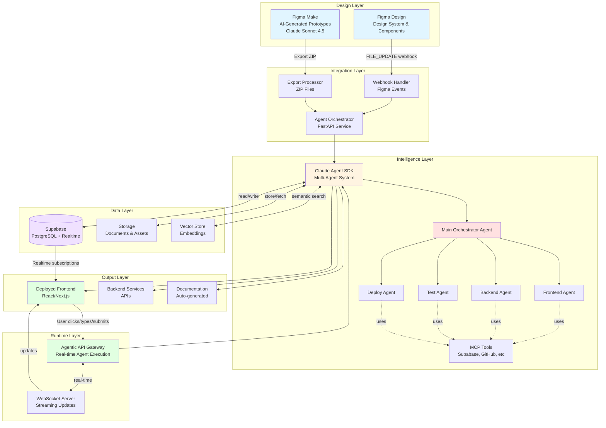
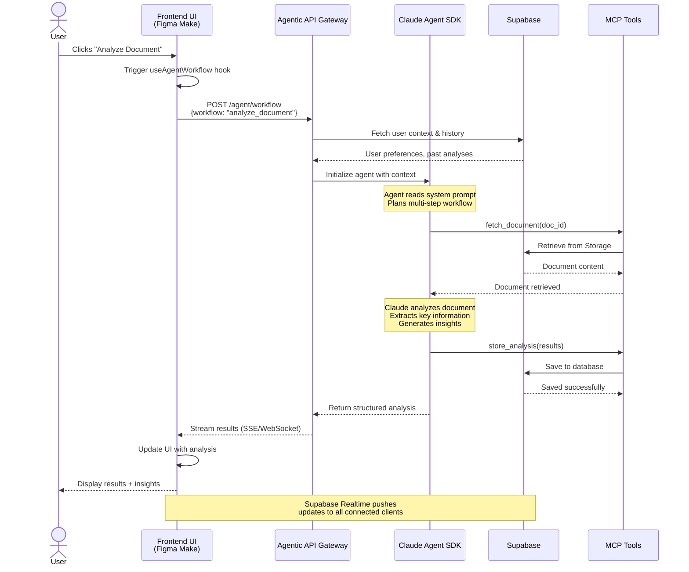
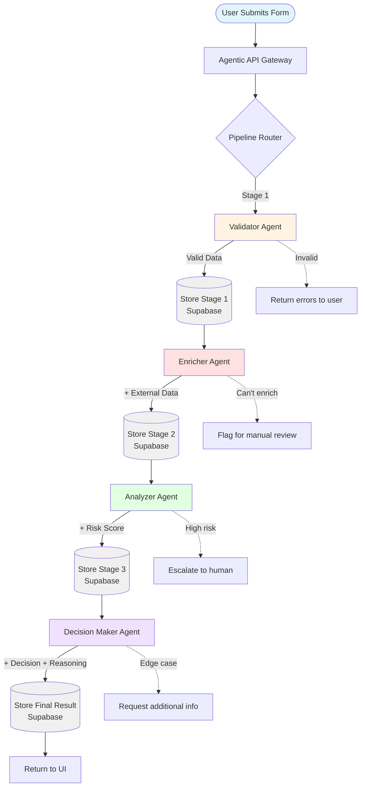
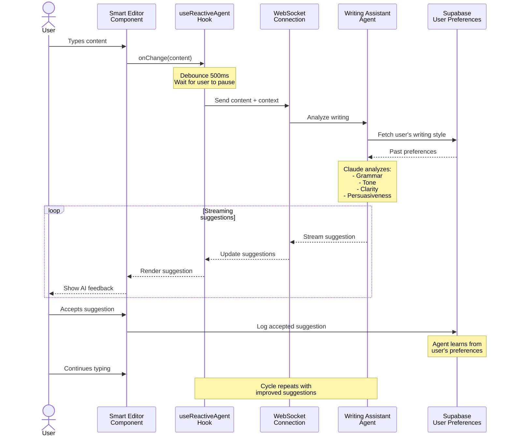
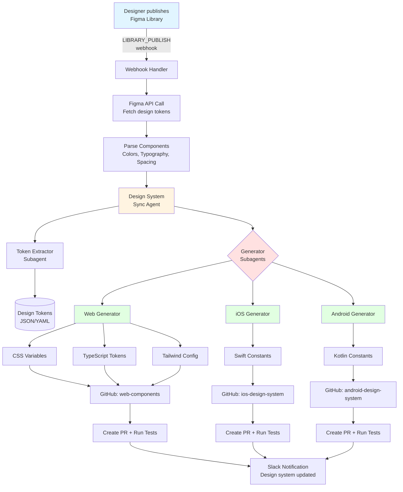
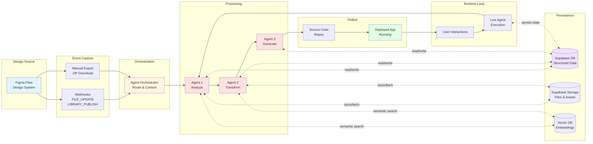

# Visual Architecture Guide: Intelligent Figma-to-Production Pipeline
## Mermaid Diagrams with Narrative Descriptions

**Version:** 1.0  
**Purpose:** High-level visual understanding of the complete system  
**Audience:** Technical leaders, architects, stakeholders

---

## 📊 Diagram 1: Complete System Architecture

### Narrative

This is your **end-to-end intelligent design-to-production system**. Designers work in Figma (both Figma Design and Figma Make), and every change automatically flows through an AI-powered pipeline that generates production-ready code, tests, documentation, and deployments.

**The Magic:** User interactions in your deployed applications trigger intelligent Claude agents that reason, make decisions, and execute complex workflows - all backed by Supabase for data persistence.



### Key Points

1. **Two Entry Points:**
   - **Figma Design webhooks** (automatic on design updates)
   - **Figma Make exports** (manual or automated ZIP uploads)

2. **Intelligent Processing:**
   - Orchestrator routes to appropriate agents
   - Multi-agent collaboration (frontend, backend, tests, deploy work in parallel)
   - MCP tools provide integration capabilities

3. **Runtime Intelligence:**
   - Deployed apps trigger agents on user actions
   - Real-time streaming of agent responses
   - Supabase provides persistent, reactive data layer

---

## 📊 Diagram 2: User Interaction Flow (Runtime Agentic Backend)

### Narrative

When a user interacts with your deployed application, they're not just calling simple API endpoints. Instead, **every action triggers an intelligent agent** that analyzes context, reasons about the best approach, executes multiple steps, and learns from the interaction.

**Example:** User clicks "Analyze Document" → Agent fetches doc from Supabase Storage → Reads it → Analyzes with Claude → Extracts insights → Stores results → Returns structured data → UI updates in real-time.



### Key Points

1. **Context-Aware:** Agent retrieves user's history and preferences from Supabase
2. **Multi-Step Reasoning:** Agent plans and executes complex workflows autonomously
3. **Tool Integration:** Uses MCP tools to interact with Supabase and external services
4. **Real-Time Updates:** Results stream back to UI as they're generated
5. **Persistent Learning:** Every interaction is logged and used to improve future responses

---

## 📊 Diagram 3: Multi-Agent Pipeline (Form Submission Example)

### Narrative

Complex user actions trigger **multi-agent pipelines** where specialized agents collaborate. Each agent is an expert in one domain and passes its work to the next agent.

**Example:** User submits a loan application → Validator checks completeness → Enricher adds credit score data → Risk Analyzer evaluates → Decision Maker approves/rejects with reasoning.



### Key Points

1. **Sequential Processing:** Each agent builds on the previous agent's work
2. **Specialized Expertise:** Each agent has focused responsibility
3. **Persistent State:** Results saved at each stage in Supabase
4. **Error Handling:** Agents can reject, escalate, or request clarification
5. **Transparent Process:** User sees progress through each stage

---

## 📊 Diagram 4: Reactive Agent Pattern (Real-Time Assistance)

### Narrative

The most sophisticated pattern: **reactive agents that respond to every keystroke**. As the user types or makes changes, an agent continuously analyzes and provides real-time suggestions.

**Example:** User writes business proposal → Agent analyzes tone, clarity, persuasiveness → Suggests improvements → User accepts/rejects → Agent learns preferences.



### Key Points

1. **Debounced Analysis:** Waits for user to pause typing before analyzing
2. **Streaming Feedback:** Suggestions appear in real-time as agent generates them
3. **Learning Loop:** Agent learns from accepted/rejected suggestions
4. **Non-Intrusive:** Suggestions don't block the user's workflow
5. **Context-Aware:** Agent knows user's writing style and preferences

---

## 📊 Diagram 5: Design System Synchronization

### Narrative

This shows the **design-to-code automation loop**. When a designer publishes changes to the design system in Figma, agents automatically update code repositories across all platforms.

**Example:** Designer updates button colors in Figma → Webhook triggers → Agent extracts design tokens → Generates CSS, TypeScript, Tailwind configs → Creates PRs → Runs tests → Deploys to staging.



### Key Points

1. **Automatic Trigger:** Figma webhook starts the process
2. **Token Extraction:** Agent parses Figma API response for design tokens
3. **Multi-Platform Generation:** Specialized subagents generate platform-specific code
4. **Repository Updates:** Direct commits or PRs to each platform's repo
5. **Validation:** Tests run automatically before merge
6. **Team Notification:** Slack/email alerts when updates are ready

---

## 📊 Diagram 6: Data Flow Architecture

### Narrative

This diagram shows **how data flows through the system** from design files to deployed applications with persistent state management in Supabase.



### Key Points

1. **Multiple Inputs:** Webhooks (automatic) and exports (manual)
2. **Bidirectional Data Flow:** Agents read and write to Supabase continuously
3. **Persistent Context:** All intermediate states saved
4. **Vector Search:** Semantic search for relevant past executions
5. **Runtime Loop:** Deployed app triggers agents, which update state, which updates app

---

## 📊 Diagram 7: Complete User Journey

### Narrative

This shows the **complete journey from designer to end user**, illustrating how design changes flow through the AI pipeline and result in intelligent, deployed applications.


### Key Points

1. **Design Phase:** Figma Make generates initial code with Claude
2. **Build Phase:** Multi-agent team enhances to production quality
3. **Deploy Phase:** Automated deployment pipeline
4. **Runtime Phase:** End users trigger intelligent agent workflows
5. **Learning Phase:** System improves with every interaction

---

## 🎯 High-Level Narratives

### Narrative 1: The Three Integration Points

Your system has **three distinct integration points**, each serving a different purpose:

#### 1. Design-Time Integration (Figma → Agents)
**When:** Designer publishes Figma changes  
**Trigger:** Webhooks (FILE_UPDATE, LIBRARY_PUBLISH)  
**Purpose:** Automatically update code when designs change  
**Example:** Design system color update propagates to all platform repos

#### 2. Build-Time Integration (Figma Make Export → Agents)
**When:** Designer exports Figma Make code  
**Trigger:** Manual ZIP upload or automated file watcher  
**Purpose:** Enhance prototypes into production applications  
**Example:** React prototype → Full-stack app with backend, tests, docs

#### 3. Runtime Integration (User Actions → Agents)
**When:** End user interacts with deployed app  
**Trigger:** Button clicks, form submissions, typing  
**Purpose:** Provide intelligent, context-aware responses  
**Example:** User uploads document → Agent analyzes → Returns insights

---

### Narrative 2: Why This Creates Competitive Advantage

#### Traditional Approach
1. Designer creates mockup in Figma
2. Developer manually codes frontend
3. Developer manually codes backend
4. Developer manually writes tests
5. Developer manually writes docs
6. Deploy with static API endpoints
7. User gets predetermined responses

**Problems:** Slow, expensive, no intelligence, rigid

#### Your AI-Led Approach
1. Designer creates in Figma Make (AI-assisted)
2. **Agents automatically enhance** to production quality
3. **Agents automatically generate** backend, tests, docs
4. **Agents automatically deploy** with CI/CD
5. Deploy with **intelligent agentic backend**
6. User gets **context-aware AI responses**
7. System **learns and improves** continuously

**Benefits:** 10x faster, adaptive, intelligent, sustainable advantage

---

### Narrative 3: The Learning Loop

Your system gets **smarter over time** through a continuous learning loop:

```
User Interaction → Agent Execution → Result + Reasoning → 
Store in Supabase → Future Agent Reads History → 
Better Decision → User Interaction → ...
```

**Example Evolution:**

**Week 1:** User submits loan application → Agent approves based on generic criteria

**Week 10:** Agent has processed 1,000 applications → Learned patterns → Now provides more nuanced decisions with higher accuracy

**Week 100:** Agent proactively suggests application improvements before submission → Understands user's business context → Provides industry-specific insights

---

### Narrative 4: Cost Structure Transformation

#### Traditional SaaS Cost Structure
- Upfront: $200k-500k development
- Ongoing: 3-5 engineers for maintenance
- Scale cost: Linear (more features = more devs)
- Intelligence: Requires separate ML team

#### Your AI-Led Cost Structure
- Upfront: $50k-100k setup (orchestrator + agents)
- Ongoing: 1 engineer for monitoring
- Scale cost: **Logarithmic** (agents handle complexity)
- Intelligence: **Built-in** (Claude does reasoning)

**Savings:** 60-80% reduction in development costs  
**Speed:** 10x faster from concept to production  
**Quality:** Consistent, testable, documented

---

## 🚀 Implementation Priorities

### Phase 1: Foundation (Week 1-2)
✅ Deploy agentic API gateway  
✅ Set up Supabase with schemas  
✅ Configure Figma webhooks  
✅ Create basic agent workflows  

### Phase 2: Enhancement (Week 3-4)
✅ Add multi-agent pipelines  
✅ Implement streaming responses  
✅ Create custom MCP tools  
✅ Set up monitoring  

### Phase 3: Intelligence (Week 5-6)
✅ Implement reactive agents  
✅ Add learning loops  
✅ Build feedback mechanisms  
✅ Optimize agent prompts  

### Phase 4: Scale (Week 7-8)
✅ Load testing  
✅ Performance optimization  
✅ Multi-tenancy support  
✅ Advanced error handling  

---

## 💡 Key Takeaways

### For Business Leaders
- **Faster Time-to-Market:** Ship intelligent features in days, not months
- **Lower Costs:** 60-80% reduction in development expenses
- **Competitive Moat:** AI-native applications that competitors can't easily replicate
- **Scalable Intelligence:** System improves autonomously with usage

### For Technical Leaders
- **Production-Ready:** All code examples are deployable today
- **Proven Stack:** FastAPI, Claude Agent SDK, Supabase, React
- **Observable:** Built-in logging, metrics, and monitoring
- **Maintainable:** Clear separation of concerns, well-documented

### For Architects
- **Event-Driven:** Reactive architecture with real-time capabilities
- **Microservices-Ready:** Agents can be deployed independently
- **Data-Centric:** Supabase provides unified data layer
- **AI-Native:** Built for agentic workflows from the ground up

---

## 📚 Next Steps

1. **Review Diagrams:** Understand each integration point
2. **Choose Pattern:** Start with one pattern (recommend runtime agentic backend)
3. **Deploy Minimal:** Use quick-start guide for basic implementation
4. **Iterate:** Add complexity as you validate value
5. **Scale:** Expand to all three integration points

---

**All code, schemas, and implementation details are in the companion documents.**

**Start building the future of intelligent applications today.**
