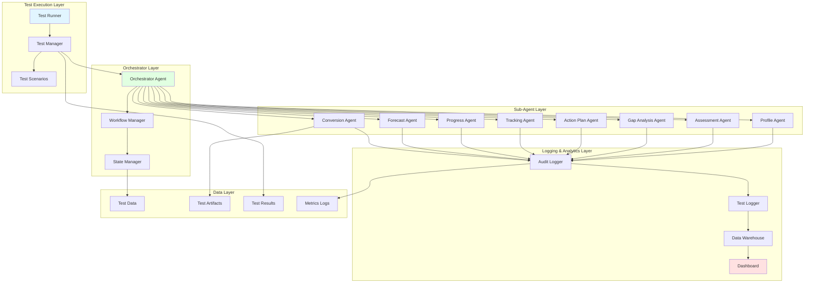
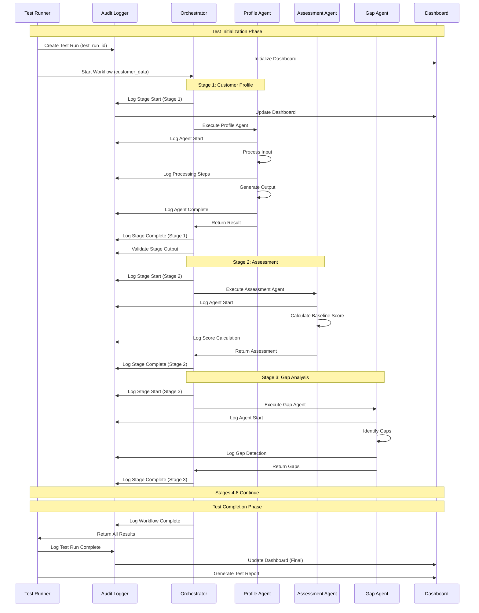
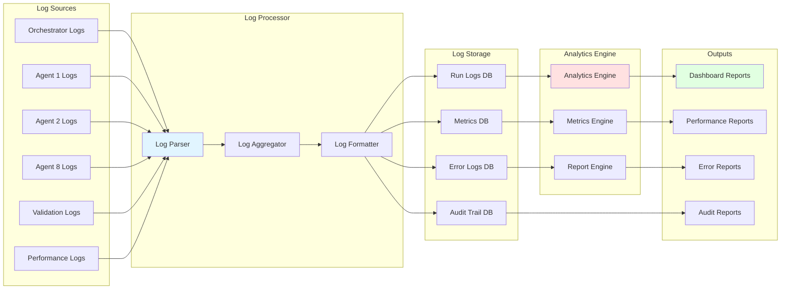
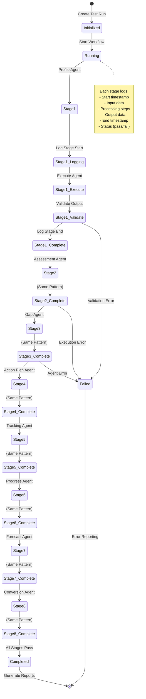
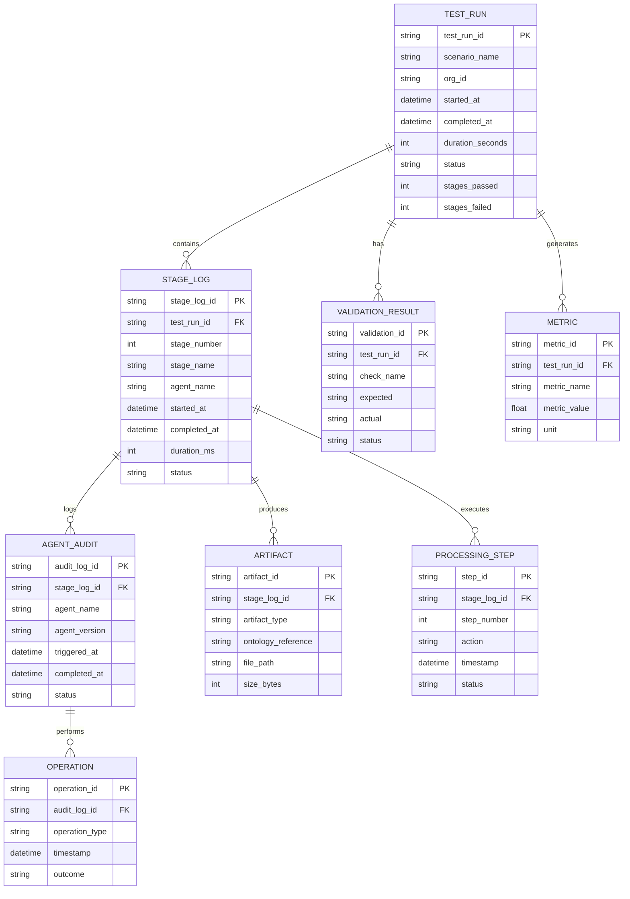

# 🧪 BAIV ORCHESTRATOR AGENT TESTING FRAMEWORK V3.0
## Complete Architecture with Enhanced Logging & Analytics

**Version**: 3.0.0  
**Date**: 2025-10-14  
**Based On**: Improvements from "BAIV Ontology agent testing 2 workflow"  
**Registry Compliant**: v3.0  

---

## 📊 TESTING FRAMEWORK OVERVIEW



---

## 🔄 COMPLETE TEST EXECUTION WORKFLOW



---

## 📝 ENHANCED LOGGING ARCHITECTURE



---

## 🎯 TEST RUN LIFECYCLE



---

## 📋 LOG RECORD STRUCTURE

### Master Test Run Log
```json
{
  "test_run_id": "TR-20251014-120000-001",
  "test_scenario": "scenario_techconsult_standard",
  "organization_id": "ORG-TC-001",
  "organization_name": "TechConsult Ltd",
  "started_at": "2025-10-14T12:00:00Z",
  "completed_at": "2025-10-14T12:01:45Z",
  "duration_seconds": 105,
  "status": "COMPLETED",
  "stages_executed": 8,
  "stages_passed": 8,
  "stages_failed": 0,
  "total_artifacts_generated": 47,
  "test_environment": "synthetic",
  "tester": "automated",
  "stage_logs": [
    "stage_1_log_id",
    "stage_2_log_id",
    "stage_3_log_id",
    "stage_4_log_id",
    "stage_5_log_id",
    "stage_6_log_id",
    "stage_7_log_id",
    "stage_8_log_id"
  ],
  "metrics": {
    "baseline_score": 42,
    "followup_score": 61,
    "improvement_delta": 19,
    "improvement_percentage": 45.2,
    "forecast_90_day": 72,
    "forecast_12_month": 85
  },
  "validation_results": {
    "total_checks": 156,
    "passed": 156,
    "failed": 0,
    "warnings": 3
  }
}
```

### Stage Execution Log
```json
{
  "stage_log_id": "SL-20251014-120000-001-S1",
  "test_run_id": "TR-20251014-120000-001",
  "stage_number": 1,
  "stage_name": "Customer Profile",
  "agent_name": "ProfileAgent",
  "stage_status": "COMPLETED",
  "started_at": "2025-10-14T12:00:05Z",
  "completed_at": "2025-10-14T12:00:12Z",
  "duration_ms": 7000,
  "input_data": {
    "organization_id": "ORG-TC-001",
    "organization_name": "TechConsult Ltd",
    "industry": "Technology Consulting"
  },
  "processing_steps": [
    {
      "step": 1,
      "action": "Validate input data",
      "timestamp": "2025-10-14T12:00:05.100Z",
      "status": "PASS"
    },
    {
      "step": 2,
      "action": "Create customer profile entity",
      "timestamp": "2025-10-14T12:00:06.200Z",
      "status": "PASS"
    },
    {
      "step": 3,
      "action": "Extract AI maturity context",
      "timestamp": "2025-10-14T12:00:08.500Z",
      "status": "PASS"
    },
    {
      "step": 4,
      "action": "Generate contact points",
      "timestamp": "2025-10-14T12:00:10.100Z",
      "status": "PASS"
    },
    {
      "step": 5,
      "action": "Validate output conformance",
      "timestamp": "2025-10-14T12:00:11.800Z",
      "status": "PASS"
    }
  ],
  "output_data": {
    "customer_organization_id": "CO-TC-001",
    "artifacts_generated": 1,
    "conformance_score": 100
  },
  "artifacts_created": [
    {
      "artifact_id": "ARTIFACT-CO-TC-001",
      "artifact_type": "CustomerOrganization",
      "ontology": "02-customer-organization-profile",
      "file_path": "/test_outputs/TR-20251014-120000-001/stage_1/customer_profile.jsonld"
    }
  ],
  "validation_checks": [
    {
      "check_id": "VC-S1-001",
      "check_name": "Schema.org compliance",
      "expected": "100%",
      "actual": "100%",
      "status": "PASS"
    },
    {
      "check_id": "VC-S1-002",
      "check_name": "Required properties present",
      "expected": "all",
      "actual": "all",
      "status": "PASS"
    }
  ],
  "performance_metrics": {
    "cpu_usage_percent": 12.5,
    "memory_used_mb": 45.2,
    "artifacts_per_second": 0.14
  },
  "errors": [],
  "warnings": []
}
```

### Agent-Level Audit Log
```json
{
  "audit_log_id": "AL-20251014-120000-001-S1-A1",
  "stage_log_id": "SL-20251014-120000-001-S1",
  "agent_name": "ProfileAgent",
  "agent_version": "1.0.0",
  "triggered_by": "OrchestratorAgent",
  "triggered_at": "2025-10-14T12:00:05Z",
  "input_received": {
    "timestamp": "2025-10-14T12:00:05.050Z",
    "data_size_bytes": 2048,
    "data_valid": true
  },
  "processing_started": "2025-10-14T12:00:05.100Z",
  "processing_completed": "2025-10-14T12:00:11.800Z",
  "output_generated": {
    "timestamp": "2025-10-14T12:00:11.850Z",
    "data_size_bytes": 4096,
    "data_valid": true
  },
  "returned_to_orchestrator": "2025-10-14T12:00:12.000Z",
  "status": "SUCCESS",
  "operations_performed": [
    "data_validation",
    "entity_creation",
    "context_extraction",
    "output_formatting"
  ],
  "dependencies_called": [],
  "next_stage_triggered": "Stage 2: Assessment"
}
```

---

## 📊 DASHBOARD DATA MODEL



---

## 🎨 DASHBOARD WIREFRAME

```
┌─────────────────────────────────────────────────────────────────────┐
│ BAIV ORCHESTRATOR TEST DASHBOARD                    [Refresh] [Export]│
├─────────────────────────────────────────────────────────────────────┤
│                                                                       │
│ TEST RUN SELECTOR:                                                    │
│ ┌───────────────────────────────────────────────────────────────┐   │
│ │ [Filter by Date] [Filter by Org] [Filter by Status]          │   │
│ │                                                                │   │
│ │ Test Run ID              │ Org           │ Date       │Status │   │
│ │ ────────────────────────────────────────────────────────────  │   │
│ │ ▶ TR-20251014-120000-001 │ TechConsult   │ 2025-10-14 │ ✅    │   │
│ │   TR-20251014-110000-001 │ HealthTech    │ 2025-10-14 │ ⚠️    │   │
│ │   TR-20251013-150000-001 │ FinanceCore   │ 2025-10-13 │ ✅    │   │
│ └───────────────────────────────────────────────────────────────┘   │
│                                                                       │
├─────────────────────────────────────────────────────────────────────┤
│ SELECTED TEST RUN: TR-20251014-120000-001                            │
├─────────────────────────────────────────────────────────────────────┤
│                                                                       │
│ OVERVIEW METRICS:                                                     │
│ ┌──────────┬──────────┬──────────┬──────────┬──────────┐            │
│ │ Duration │ Stages   │ Artifacts│ Baseline │ Final    │            │
│ │ 105s     │ 8/8 ✅   │ 47       │ 42/100   │ 61/100   │            │
│ └──────────┴──────────┴──────────┴──────────┴──────────┘            │
│                                                                       │
│ STAGE EXECUTION TIMELINE:                                             │
│ ┌───────────────────────────────────────────────────────────────┐   │
│ │ Stage 1 ████████░░ 7.0s  ✅                                    │   │
│ │ Stage 2 ██████████ 8.5s  ✅                                    │   │
│ │ Stage 3 ████████████ 12.3s ✅                                  │   │
│ │ Stage 4 ██████████████ 15.1s ✅                                │   │
│ │ Stage 5 ████████████ 11.2s ✅                                  │   │
│ │ Stage 6 ██████████ 9.8s  ✅                                    │   │
│ │ Stage 7 ██████████████ 14.5s ✅                                │   │
│ │ Stage 8 ████████████████ 18.6s ✅                              │   │
│ └───────────────────────────────────────────────────────────────┘   │
│                                                                       │
│ STAGE DETAILS:                                                        │
│ ┌───────────────────────────────────────────────────────────────┐   │
│ │ [Stage 1] [Stage 2] [Stage 3] [Stage 4] [Stage 5] [Stage 6]  │   │
│ │ [Stage 7] [Stage 8▼]                                          │   │
│ │                                                                │   │
│ │ Stage 8: Conversion Agent                                      │   │
│ │ ───────────────────────────────────────────────────────────   │   │
│ │ Status: ✅ COMPLETED                                           │   │
│ │ Duration: 18.6s                                                │   │
│ │ Input: ProgressReport, Forecast                                │   │
│ │ Output: DemoResults, ConversionOffer, Subscription             │   │
│ │                                                                │   │
│ │ Processing Steps:                                              │   │
│ │   1. Validate inputs ✅ (0.2s)                                 │   │
│ │   2. Package demo results ✅ (3.5s)                            │   │
│ │   3. Generate value proposition ✅ (4.2s)                      │   │
│ │   4. Create conversion offer ✅ (5.1s)                         │   │
│ │   5. Design subscription package ✅ (4.8s)                     │   │
│ │   6. Generate success story ✅ (0.8s)                          │   │
│ │                                                                │   │
│ │ Artifacts Created: 3                                           │   │
│ │   • DemoResults (demo-results-TC-001.jsonld) - 5.2KB          │   │
│ │   • ConversionOffer (offer-TC-001.jsonld) - 3.8KB             │   │
│ │   • SubscriptionPackage (subscription-TC-001.jsonld) - 4.1KB  │   │
│ │                                                                │   │
│ │ Validations: 18/18 ✅                                          │   │
│ │ Warnings: 0                                                    │   │
│ │ Errors: 0                                                      │   │
│ └───────────────────────────────────────────────────────────────┘   │
│                                                                       │
│ PERFORMANCE METRICS:                                                  │
│ ┌───────────────────────────────────────────────────────────────┐   │
│ │ CPU Usage: ▁▂▃▅▆▇█▇▆▅▃▂▁ Avg: 15.2%                          │   │
│ │ Memory:    ▁▂▃▄▅▆▇▇▆▅▄▃▂ Avg: 67.4 MB                        │   │
│ │ I/O Ops:   ▂▃▄▅▆▅▄▃▂▃▄▅▆ Total: 147 ops                       │   │
│ └───────────────────────────────────────────────────────────────┘   │
│                                                                       │
│ [View Full Audit Log] [Download Test Report] [Export Artifacts]      │
│                                                                       │
└─────────────────────────────────────────────────────────────────────┘
```

---

## 🔍 KEY IMPROVEMENTS FROM V2.0

### 1. **Comprehensive Audit Trail**
- ✅ Every test run gets unique ID
- ✅ Every stage execution logged
- ✅ Every agent interaction tracked
- ✅ Every artifact catalogued
- ✅ Every validation recorded

### 2. **Granular Step Logging**
- ✅ Processing steps within each stage
- ✅ Timestamps for each micro-operation
- ✅ Input/output data captured
- ✅ Performance metrics per step

### 3. **Interactive Dashboard**
- ✅ Select test runs from history
- ✅ Drill down into stages
- ✅ View agent execution details
- ✅ Inspect artifacts
- ✅ Analyze performance

### 4. **Enhanced Validation**
- ✅ Per-stage validation checks
- ✅ Cross-stage consistency validation
- ✅ Business rule enforcement
- ✅ Quality metric calculations

### 5. **Performance Analytics**
- ✅ Execution time tracking
- ✅ Resource utilization metrics
- ✅ Bottleneck identification
- ✅ Trend analysis

### 6. **Test Result Analytics**
- ✅ Pass/fail rates
- ✅ Common failure patterns
- ✅ Performance trends over time
- ✅ Artifact generation rates

---

## 📁 FILE CATALOG

After implementing this enhanced framework, you'll have:

```
/test_framework/
├── test_runner.py              # Main test execution engine
├── orchestrator.py             # Orchestrator agent implementation
├── agents/
│   ├── profile_agent.py        # Stage 1 agent
│   ├── assessment_agent.py     # Stage 2 agent
│   ├── gap_agent.py            # Stage 3 agent
│   ├── action_plan_agent.py    # Stage 4 agent
│   ├── tracking_agent.py       # Stage 5 agent
│   ├── progress_agent.py       # Stage 6 agent
│   ├── forecast_agent.py       # Stage 7 agent
│   └── conversion_agent.py     # Stage 8 agent
├── logging/
│   ├── audit_logger.py         # Audit log manager
│   ├── test_logger.py          # Test-specific logging
│   ├── performance_logger.py   # Performance metrics
│   └── log_formatter.py        # Log formatting utilities
├── analytics/
│   ├── metrics_engine.py       # Metrics calculation
│   ├── report_generator.py     # Report generation
│   └── dashboard_data.py       # Dashboard data preparation
├── validation/
│   ├── stage_validators.py     # Per-stage validation
│   ├── cross_stage_validator.py # Cross-stage validation
│   └── quality_validator.py    # Quality metric validation
├── test_data/
│   ├── scenarios.json          # Test scenarios
│   ├── organizations.json      # Test organizations
│   └── expected_results.json   # Expected outcomes
└── outputs/
    ├── test_runs/              # Test run logs
    │   └── TR-{id}/
    │       ├── master_log.json
    │       ├── stage_logs/
    │       ├── agent_audits/
    │       └── artifacts/
    ├── reports/                # Generated reports
    └── dashboards/             # Dashboard data exports
```

---

## 🎯 NEXT STEPS - HIGH-LEVEL PLAN (5 POINTS)

### 1. **Implement Enhanced Logging System**
   - Create comprehensive audit logger with granular step tracking
   - Add performance metrics collection at each stage
   - Implement structured log format matching diagrams above

### 2. **Build Dashboard Data Pipeline**
   - Create data warehouse schema matching ER diagram
   - Implement analytics engine for metric calculation
   - Generate dashboard-ready JSON exports

### 3. **Enhance Test Runner with Validation**
   - Add per-stage validation checkpoints
   - Implement cross-stage consistency checks
   - Create comprehensive validation report generation

### 4. **Create Dashboard Visualization**
   - Build interactive HTML dashboard matching wireframe
   - Implement test run selection and filtering
   - Add drill-down capability for stage details

### 5. **Consider Test Sub-Ontology**
   - Evaluate if testing should be formalized as ontology
   - Align with Process Engineer ontology patterns
   - Support TDD approach for Next.js/Jest integration

---

## â" CLARIFYING QUESTIONS

Before proceeding with implementation:

1. **Testing Ontology Priority**: Should we create a formal "Testing & Validation Ontology" as a sub-ontology of Process Engineer, or proceed with the enhanced testing framework first and formalize later?

2. **Dashboard Technology**: For MVP, should the dashboard be:
   - Static HTML with JavaScript (quick to deploy)
   - React/Next.js component (production-ready)
   - Python-based (Streamlit/Dash for quick prototyping)

3. **Log Storage**: For pre-Supabase MVP:
   - JSON files (current approach)
   - SQLite database (queryable)
   - Both (redundant but safe)

4. **Test Coverage Scope**: Should tests cover:
   - Just the 8 ontology workflow (current)
   - Include Registry v3.0 integration
   - Include error recovery scenarios
   - Include performance/load testing

5. **Jest/TDD Integration**: Are you planning to:
   - Use this framework to test Next.js frontend components
   - Keep backend (Python) and frontend (Jest) testing separate
   - Create unified test reporting across both stacks

Please advise on these questions so I can tailor the implementation to your exact needs!
