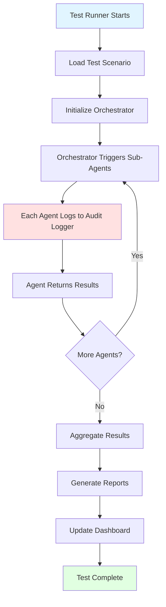
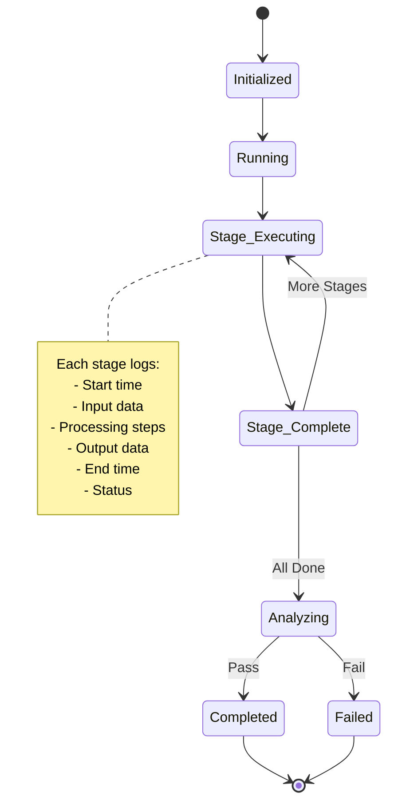
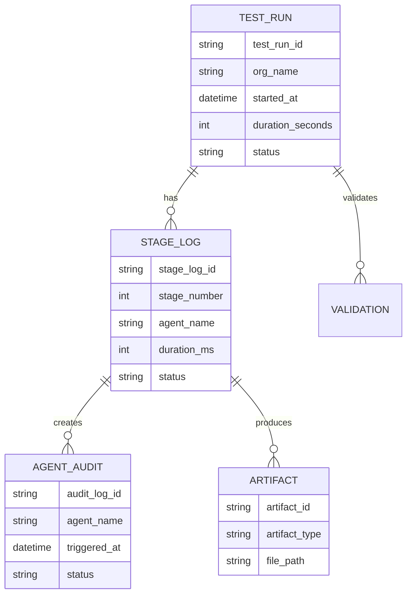

# 📊 BAIV TESTING FRAMEWORK V3.0 - VISUAL SUMMARY

**Quick Reference Guide**  
**Date**: 2025-10-14

---

## 🎯 WHAT WE BUILT TODAY

### Complete Testing Framework Architecture
- ✅ Enhanced logging with audit trails
- ✅ Dashboard data model and wireframe
- ✅ Test execution workflow diagrams
- ✅ Comprehensive test plan template
- ✅ Decision matrix for implementation

---

## 🔄 HOW TESTING WORKS (Simple Flow)



---

## 📋 TEST RUN STATES



---

## 🗄️ DATA MODEL (Simplified)



---

## 🎨 DASHBOARD LAYOUT (High-Level)

```
┌────────────────────────────────────────────────┐
│  BAIV TEST DASHBOARD                           │
├────────────────────────────────────────────────┤
│                                                 │
│  Test Run Selector                             │
│  ┌──────────────────────────────────────┐     │
│  │ [Filters]  [Search]  [Date Range]    │     │
│  │                                       │     │
│  │ ▶ TR-001 │ TechConsult │ ✅ PASS    │     │
│  │   TR-002 │ HealthTech  │ ⚠️ WARN    │     │
│  └──────────────────────────────────────┘     │
│                                                 │
├────────────────────────────────────────────────┤
│  Selected Run: TR-001                          │
├────────────────────────────────────────────────┤
│                                                 │
│  Metrics: Duration | Stages | Score Delta     │
│           105s     | 8/8 ✅ | +19 points     │
│                                                 │
│  Stage Timeline:                               │
│  Stage 1 ████░░ 7s  ✅                        │
│  Stage 2 ██████ 9s  ✅                        │
│  Stage 3 ████████ 12s ✅                      │
│  ... (stages 4-8)                              │
│                                                 │
│  [View Details] [Export Report]                │
│                                                 │
└────────────────────────────────────────────────┘
```

---

## 🔍 WHAT GETS LOGGED

### At Test Run Level
- Test run ID (unique identifier)
- Start/end timestamps
- Organization being tested
- Overall status (PASS/FAIL)
- Summary metrics

### At Stage Level
- Stage number and name
- Agent name and version
- Input data received
- Processing steps executed
- Output data generated
- Duration and performance metrics
- Validation results

### At Agent Level
- When agent was triggered
- Input data size and validity
- Operations performed
- Dependencies called
- When output was returned
- Success/failure status

### Artifacts
- What was created
- Where it's stored
- File size
- Ontology conformance

---

## 📊 KEY METRICS TRACKED

### Performance
- ⏱️ Execution time per stage
- 💾 Memory usage
- ⚡ CPU utilization
- 📁 I/O operations

### Quality
- ✅ Test pass rate
- 🎯 Validation success rate
- 📦 Artifact generation rate
- ⚠️ Error/warning frequency

### Business
- 📈 Baseline scores
- 📊 Improvement deltas
- 🔮 Forecast accuracy
- 💰 Conversion rates

---

## 🎯 FIVE DECISIONS NEEDED

### 1. Testing Ontology?
- ✅ Create (RECOMMENDED)
- ❌ Skip

### 2. Dashboard Tech?
- A) Static HTML
- **B) Next.js (RECOMMENDED)**
- C) Python Streamlit

### 3. Log Storage?
- A) JSON only
- B) SQLite only
- **C) Both (RECOMMENDED)**

### 4. Test Coverage?
- A) Core workflow only
- B) + Registry integration
- **C) + Error recovery (RECOMMENDED)**
- D) + Performance testing

### 5. Jest Integration?
- A) Separate suites
- **B) Unified reporting (RECOMMENDED)**
- C) Contract testing
- D) Full E2E

---

## 📦 FILES DELIVERED

### 1. testing-framework-architecture.md (26KB)
- Complete architecture with diagrams
- Enhanced logging details
- Dashboard wireframe
- Data model

### 2. test-plan-template.md (19KB)
- 15-section template
- AI prompts for generation
- Examples and checklists

### 3. TESTING-FRAMEWORK-SUMMARY.md (13KB)
- Answers to 5 key questions
- Decision recommendations
- Timeline estimates
- Next steps

---

## ⏱️ TIMELINE ESTIMATE

**If all recommendations accepted**:

| Week | Focus | Hours | Deliverables |
|------|-------|-------|--------------|
| 1 | Testing Ontology + Logging | 10-14 | Ontology v1.0, Logging system |
| 2 | Data Warehouse + Analytics | 8-10 | SQLite DB, Metrics engine |
| 3 | Next.js Dashboard | 10-12 | Interactive UI |
| 4 | Jest Integration + Docs | 4-6 | Unified testing |

**Total**: 32-42 hours (~1 month part-time)

---

## 🚀 IMMEDIATE NEXT ACTION

**AWAITING YOUR DECISIONS ON**:
1. Testing Ontology: Yes / No?
2. Dashboard: A / B / C?
3. Storage: A / B / C?
4. Coverage: A / B / C / D?
5. Jest: A / B / C / D?

**Once decided, I will**:
1. Implement chosen architecture
2. Generate all code
3. Create working prototypes
4. Provide documentation
5. Set up TDD infrastructure

---

## 💡 RECOMMENDED PATH

For your goal of "substantial and sustainable competitive advantage":

```
✅ Create Testing Ontology (standardization)
    ↓
✅ Next.js Dashboard (production-ready)
    ↓
✅ Hybrid Storage (robust logging)
    ↓
✅ Full Coverage (error recovery included)
    ↓
✅ Unified Reporting (Python + Jest)
    ↓
🏆 Enterprise-Grade Testing Framework
```

**Why**: Aligns with AI-led business vision, enables automation, provides competitive edge

---

## 📞 READY TO PROCEED?

Provide your 5 decisions and we'll implement immediately!

**Questions?** Ask anytime - I'm here to help! 🚀
