# BAIV Integration Mapping & Traceability Matrix

**Document:** BAIV-MILANA-Orchestration Integration Mapping & Traceability Matrix  
**Version:** 1.0.0  
**Date:** 2025-12-10  
**Status:** 🟢 ACTIVE - Integration Planning Document  
**Change Control:** Registered in PF-Core Ontology Registry  

---

## Executive Summary

This document provides comprehensive integration mapping and traceability across three critical BAIV architectural documents:

1. **MILANA_AIViz_INTEGRATION_PRD.md** - MILANA Python platform integration specification
2. **CLAUDE_AGENT_SDK_ORCHESTRATION_v2.0.md** - Agent orchestration architecture
3. **PRD_v1.7_Scope_Definition.md** - BAIV product requirements and scope

**Purpose:** Ensure complete alignment, identify gaps, and provide unified implementation roadmap.

**Key Findings:**
- ✅ 17 agents defined and aligned
- ⚠️ RRF system integration on HOLD pending positioning discussion
- ✅ All ontologies consolidated via PF-Core OAA
- 🔄 6 new database table categories need architecture integration
- 🔄 Frontend UI specifications need orchestration layer mapping
- ✅ PF-Core VE/CE integration comprehensive

---

## Document Metadata

### Source Documents

| Document | Version | Location | Size | Status |
|----------|---------|----------|------|--------|
| MILANA_AIViz_INTEGRATION_PRD.md | 1.0.0 | `/BAIV-PRD-PBS-WBS-AI-Visibility/` | 922 lines | P0 Critical |
| CLAUDE_AGENT_SDK_ORCHESTRATION_v2.0.md | 2.0.0 DRAFT | `/mil3-aivis-agents/` | 1096 lines | Draft |
| PRD_v1.7_Scope_Definition.md | 1.0.0 | `/BAIV-PRD-PBS-WBS-AI-Visibility/` | 921 lines | Scope Def |

### Integration Context


---

## 1. Traceability Matrix: Core Components

### 1.1 Agent Traceability

| Agent Name | MILANA PRD | Orchestration v2.0 | PRD v1.7 Scope | Status | Notes |
|------------|------------|-------------------|----------------|--------|-------|
| **Master Orchestrator** | ❌ Not mentioned | ✅ §1, Master Orchestrator | ❌ Not explicit | ✅ ALIGNED | Core orchestration agent |
| **Lead Intelligence** | ✅ §3 Lead Skills | ✅ §2, Lead Intelligence Agent | ❌ Not explicit | 🔄 NEEDS MAPPING | Add RRF scoring integration |
| **Content Strategy** | ✅ §3 Strategy Skills | ✅ §2, Content Strategy Agent | ✅ §13 Analytics | 🔄 NEEDS RRF | RRF content planner integration |
| **Campaign Orchestration** | ❌ Not mentioned | ✅ §2, Campaign Orchestration | ❌ Not explicit | ✅ ALIGNED | No MILANA changes |
| **ICP Discovery** | ❌ Not mentioned | ✅ §2, ICP Discovery Agent | ❌ Not explicit | ✅ ALIGNED | No MILANA changes |
| **Social Listening** | ✅ §3 Social Skills | ✅ §2, Social Listening Agent | ❌ Not explicit | ✅ ALIGNED | Social media integration |
| **Outreach Automation** | ✅ §3 Lead Skills | ✅ §2, Outreach Automation | ❌ Not explicit | ✅ ALIGNED | Email enrichment |
| **Analytics & Insights** | ✅ §3 Discovery/RRF | ✅ §2, Analytics Agent | ✅ §13 Analytics | 🔶 HOLD | RRF analytics on HOLD |
| **PF Manager** | ❌ Not mentioned | ✅ §2, PF Manager Agent | ❌ Not explicit | ✅ ALIGNED | Platform governance |
| **PF Admin** | ❌ Not mentioned | ✅ §2, PF Admin Agent | ❌ Not explicit | ✅ ALIGNED | Platform admin |
| **Product Manager** | ❌ Not mentioned | ✅ §2, Product Manager Agent | ❌ Not explicit | ✅ ALIGNED | PRD management |
| **Program Manager** | ❌ Not mentioned | ✅ §2, Program Manager Agent | ❌ Not explicit | ✅ ALIGNED | PBS/WBS tracking |
| **Program Builder** | ❌ Not mentioned | ✅ §2, Program Builder Agent | ❌ Not explicit | ✅ ALIGNED | Scaffolding |
| **Solution Architect** | ❌ Not mentioned | ✅ §2, Solution Architect Agent | ❌ Not explicit | ✅ ALIGNED | Architecture design |
| **Security Manager** | ❌ Not mentioned | ✅ §2, Security Manager Agent | ❌ Not explicit | ✅ ALIGNED | Security policy |
| **Security Auditor** | ❌ Not mentioned | ✅ §2, Security Auditor Agent | ❌ Not explicit | ✅ ALIGNED | Audit trails |
| **Ontology Architect** | ✅ §2 Ontologies | ✅ §2, Ontology Architect | ✅ §7 OAA | ✅ ALIGNED | All ontologies via OAA |
| **Registry OAA** | ✅ §2 Schemas | ✅ §2, Registry OAA Agent | ✅ §7 OAA | ✅ ALIGNED | Central registry |

**Summary:** 18 total agents, 15 aligned, 2 need RRF integration, 1 on HOLD

---

### 1.2 Ontology Traceability

| Ontology | MILANA PRD | Orchestration v2.0 | PRD v1.7 Scope | Registered in OAA | Status |
|----------|------------|-------------------|----------------|-------------------|--------|
| **Universal Brand** | ✅ §2 Ontologies | ❌ Not explicit | ✅ §7.3 Platform | 🔄 PENDING | To register |
| **AI Visibility** | ✅ §2 Ontologies | ❌ Not explicit | ✅ §7.3 Domain | 🔄 PENDING | To register |
| **Agent Architecture** | ✅ §2 Ontologies | ✅ Implicit in structure | ✅ §7.3 Platform | 🔄 PENDING | To register |
| **Organization** | ✅ Tenants mapping | ✅ VE-100 Governance | ✅ §7.3 Platform | ✅ EXISTS | Core ontology |
| **VSOM** | ❌ Not mentioned | ✅ VE framework | ✅ §7.3 Platform | ✅ EXISTS | Value scoring |
| **OKR** | ❌ Not mentioned | ✅ VE-300 Metrics | ✅ §7.3 Platform | ✅ EXISTS | Metrics framework |
| **RACI** | ❌ Not mentioned | ✅ VE-100 Governance | ✅ §7.3 Platform | ✅ EXISTS | Authority matrix |
| **Gap Analysis** | ✅ §3 Discovery Skills | ✅ Implicit in workflows | ✅ §7.3 Platform | 🔄 PENDING | To register |
| **CMO OKR** | ❌ Not mentioned | ❌ Not mentioned | ✅ §7.3 Domain | 🔄 PENDING | Marketing specific |
| **Customer Organization** | ✅ Tenants | ✅ Context packages | ✅ §7.3 Domain | 🔄 PENDING | Customer context |

**Summary:** 10 ontologies tracked, 4 exist in OAA, 6 pending registration

---

### 1.3 Database Schema Traceability

| Table/Schema | MILANA PRD | Orchestration v2.0 | PRD v1.7 Scope | Implementation Status |
|--------------|------------|-------------------|----------------|----------------------|
| **organizations** | ✅ Tenants (extend) | ✅ VE context | ✅ §16.2 Core | ✅ EXISTS (extend) |
| **rrf_topic_coverage** | ✅ §2 RRF System | ❌ NOT DEFINED | ✅ §16.4 (HOLD) | 🔶 HOLD |
| **gap_analysis** | ✅ §2 RRF System | ❌ NOT DEFINED | ✅ §16.2 (optimized) | 🔄 MAP TO baiv_gaps |
| **article_clusters** | ✅ §2 RRF System | ❌ NOT DEFINED | ✅ §16.2 (optimized) | 🔄 MAP TO baiv_content |
| **rrf_executive_summary** | ✅ §2 RRF System | ❌ NOT DEFINED | ✅ §16.2 (optimized) | 🔄 MAP TO baiv_snapshots |
| **rrf_priority_actions** | ✅ §2 RRF System | ❌ NOT DEFINED | ✅ §16.2 (optimized) | 🔄 MAP TO baiv_actions |
| **google_maps_leads** | ✅ §2 Lead Tables | ❌ NOT DEFINED | ✅ §16.4 (optional) | 🔄 OPTIONAL MODULE |
| **lead_emails** | ✅ §2 Lead Tables | ❌ NOT DEFINED | ✅ §16.4 (optional) | 🔄 OPTIONAL MODULE |
| **linkedin_leads** | ✅ §2 Lead Tables | ❌ NOT DEFINED | ✅ §16.4 (optional) | 🔄 OPTIONAL MODULE |
| **social_media_posts** | ✅ §2 Social Tables | ❌ NOT DEFINED | ✅ §16.4 (optional) | 🔄 OPTIONAL MODULE |
| **platform_connections** | ✅ §2 Social Tables | ❌ NOT DEFINED | ✅ §16.4 (optional) | 🔄 OPTIONAL MODULE |
| **discovery_results** | ✅ §2 Discovery | ❌ NOT DEFINED | ✅ §16.2 Core | 🔄 NEW TABLE NEEDED |
| **baiv_visibility_snapshots** | ❌ Not in MILANA | ❌ NOT DEFINED | ✅ §16.2 Optimized | ✅ NEW DESIGN |
| **baiv_citations** | ❌ Not in MILANA | ❌ NOT DEFINED | ✅ §16.2 Core | ✅ NEW DESIGN |
| **baiv_content_inventory** | ❌ Not in MILANA | ❌ NOT DEFINED | ✅ §16.2 Core | ✅ NEW DESIGN |
| **baiv_gaps** | ❌ Not in MILANA | ❌ NOT DEFINED | ✅ §16.2 Optimized | ✅ NEW DESIGN |
| **baiv_actions** | ❌ Not in MILANA | ❌ NOT DEFINED | ✅ §16.2 Optimized | ✅ NEW DESIGN |

**Summary:** 17 tables total, 5 new optimized designs, 6 MILANA tables need mapping, 6 optional module tables

---

### 1.4 Workflow Traceability

| Workflow | MILANA PRD | Orchestration v2.0 | PRD v1.7 Scope | Implementation Priority |
|----------|------------|-------------------|----------------|------------------------|
| **RRF Gap Analysis** | ✅ §3 Gap Analyzer | ❌ NOT DEFINED | ✅ §13.2 Metrics (HOLD) | 🔶 P1 - HOLD |
| **Content Planning** | ✅ §3 RRF Content Planner | ❌ NOT DEFINED | ✅ §13 Dashboards | 🔶 P1 - HOLD |
| **Lead Enrichment** | ✅ §3 Lead Skills | ✅ §5 New Lead Processing | ❌ Not explicit | ✅ P1 |
| **Campaign Launch** | ❌ Not mentioned | ✅ §5 Content Campaign | ❌ Not explicit | ✅ P2 |
| **ICP Discovery** | ❌ Not mentioned | ✅ §5 TO BE EXPANDED | ❌ Not explicit | 🔄 P2 |
| **Social Listening** | ✅ §3 Social Skills | ✅ §5 TO BE EXPANDED | ❌ Not explicit | 🔄 P3 |
| **Context Engineering** | ❌ Not mentioned | ✅ §PF-Core Integration | ✅ §5 CE | ✅ P0 - Foundation |
| **Value Engineering** | ❌ Not mentioned | ✅ §PF-Core Integration | ✅ §4 VE | ✅ P0 - Foundation |
| **Google Maps Leads** | ✅ §3 Lead Skills | ❌ NOT DEFINED | ✅ §16.4 (optional) | 🔄 P3 - Optional |
| **Email Enrichment** | ✅ §3 Hunter.io | ❌ NOT DEFINED | ✅ §16.4 (optional) | 🔄 P3 - Optional |

**Summary:** 10 workflows, 2 foundation (P0), 3 priority (P1), 3 secondary (P2), 2 optional (P3), 2 on HOLD

---

### 1.5 API Endpoint Traceability

| Endpoint | MILANA PRD | Orchestration v2.0 | PRD v1.7 Scope | Implementation Status |
|----------|------------|-------------------|----------------|----------------------|
| **POST /rrf/analyze-gaps** | ✅ §4 API Endpoints | ❌ NOT DEFINED | ✅ §12.4 (HOLD) | 🔶 HOLD |
| **GET /rrf/health/:orgId** | ✅ §4 API Endpoints | ❌ NOT DEFINED | ✅ §12.4 → /health | 🔄 MAP TO §12.2 |
| **GET /rrf/priority-actions/:orgId** | ✅ §4 API Endpoints | ❌ NOT DEFINED | ✅ §12.4 → /actions | 🔄 MAP TO §12.2 |
| **GET /rrf/executive-summary/:orgId** | ✅ §4 API Endpoints | ❌ NOT DEFINED | ✅ §12.4 → /dashboard | 🔄 MAP TO §12.2 |
| **POST /content/generate-plan** | ✅ §4 API Endpoints | ❌ NOT DEFINED | ✅ §12.4 → /content/plan | 🔄 MAP TO §12.2 |
| **GET /content/clusters/:orgId** | ✅ §4 API Endpoints | ❌ NOT DEFINED | ✅ §12.2 Generation APIs | 🔄 NEW |
| **POST /leads/google-maps** | ✅ §4 API Endpoints | ❌ NOT DEFINED | ✅ §12.4 (optional) | 🔄 OPTIONAL |
| **POST /leads/enrich-emails** | ✅ §4 API Endpoints | ❌ NOT DEFINED | ✅ §12.4 (optional) | 🔄 OPTIONAL |
| **GET /api/v1/orgs/{id}/config** | ❌ Not in MILANA | ❌ NOT DEFINED | ✅ §12.2 Config APIs | ✅ NEW |
| **GET /api/v1/orgs/{id}/assets** | ❌ Not in MILANA | ❌ NOT DEFINED | ✅ §12.2 Discovery APIs | ✅ NEW |
| **GET /api/v1/orgs/{id}/citations** | ❌ Not in MILANA | ❌ NOT DEFINED | ✅ §12.2 Discovery APIs | ✅ NEW |
| **GET /api/v1/orgs/{id}/gaps** | ❌ Not in MILANA | ❌ NOT DEFINED | ✅ §12.2 Analysis APIs | ✅ NEW |
| **GET /api/v1/orgs/{id}/opportunities** | ❌ Not in MILANA | ❌ NOT DEFINED | ✅ §12.2 Analysis APIs | ✅ NEW |
| **POST /api/v1/orgs/{id}/content/ideas** | ❌ Not in MILANA | ❌ NOT DEFINED | ✅ §12.2 Generation APIs | ✅ NEW |
| **GET /api/v1/orgs/{id}/scorecard** | ❌ Not in MILANA | ❌ NOT DEFINED | ✅ §12.2 Reporting APIs | ✅ NEW |

**Summary:** 15 endpoints total, 8 from MILANA (6 need mapping, 2 optional), 7 new BAIV-specific

---

### 1.6 Skills/Capabilities Traceability

| Skill/Capability | MILANA PRD | Orchestration v2.0 | PRD v1.7 Scope | Agent Assignment |
|------------------|------------|-------------------|----------------|------------------|
| **gap_analyzer.py** | ✅ §3 Discovery | ❌ NOT DEFINED | ✅ §6.3 (HOLD) | Analytics Agent |
| **content_audit.py** | ✅ §3 Discovery | ❌ NOT DEFINED | ✅ §10.5 Skills | Content Strategy |
| **competitor_analysis.py** | ✅ §3 Discovery | ❌ NOT DEFINED | ✅ §10.5 Skills | Analytics Agent |
| **rrf_content_planner.py** | ✅ §3 Strategy | ❌ NOT DEFINED | ✅ §10.5 (HOLD) | Content Strategy |
| **topic_clustering.py** | ✅ §3 Strategy | ❌ NOT DEFINED | ✅ §10.5 Skills | Content Strategy |
| **priority_scoring.py** | ✅ §3 Strategy | ❌ NOT DEFINED | ✅ §4.7 VE Integration | Analytics Agent |
| **google_maps_leads.py** | ✅ §3 Leads | ❌ NOT DEFINED | ✅ §10.5 (optional) | Lead Intelligence |
| **hunter_email_finder.py** | ✅ §3 Leads | ❌ NOT DEFINED | ✅ §10.5 (optional) | Lead Intelligence |
| **linkedin_leads.py** | ✅ §3 Leads | ❌ NOT DEFINED | ✅ §10.5 (optional) | Lead Intelligence |
| **social_media_manager.py** | ✅ §3 Social | ❌ NOT DEFINED | ✅ §10.5 (optional) | Social Listening |
| **post_scheduler.py** | ✅ §3 Social | ❌ NOT DEFINED | ✅ §10.5 (optional) | Social Listening |
| **platform_integrations.py** | ✅ §3 Connection | ❌ NOT DEFINED | ✅ §10.5 Skills | All Agents |
| **Data Access Skills** | ❌ Not in MILANA | ✅ §3 Skill Modules | ❌ Not explicit | All Agents |
| **Natural Language Skills** | ❌ Not in MILANA | ✅ §3 Skill Modules | ❌ Not explicit | Content/Social |
| **Integration Skills** | ✅ Implicit | ✅ §3 Skill Modules | ❌ Not explicit | All Agents |
| **Analysis Skills** | ✅ Gap analysis | ✅ §3 Skill Modules | ✅ §13.1 Analytics | Analytics Agent |
| **Workflow Skills** | ❌ Not in MILANA | ✅ §3 Skill Modules | ❌ Not explicit | Master Orchestrator |

**Summary:** 17 skills total, 12 from MILANA (6 optional), 5 from orchestration framework

---

### 1.7 External Integration Traceability

| Integration | MILANA PRD | Orchestration v2.0 | PRD v1.7 Scope | Priority |
|-------------|------------|-------------------|----------------|----------|
| **Anthropic Claude API** | ✅ Core | ✅ Core | ✅ Implicit | P0 |
| **Supabase** | ✅ Core | ✅ Core | ✅ §15 Tech Stack | P0 |
| **Apify (Google Maps)** | ✅ §3, §4 | ❌ Mentioned only | ✅ §12.4 (optional) | P3 - Optional |
| **Hunter.io** | ✅ §3, §4 | ❌ Mentioned only | ✅ §12.4 (optional) | P3 - Optional |
| **LinkedIn API** | ✅ §3 | ✅ §2 ICP Discovery | ✅ §12.4 (optional) | P3 - Optional |
| **Google Drive** | ❌ Not mentioned | ✅ §2 Integration | ❌ Not mentioned | P2 |
| **ECCO API** | ❌ Not mentioned | ✅ §2 Lead Intelligence | ❌ Not mentioned | P1 |
| **Campaign Management API** | ❌ Not mentioned | ✅ §2 Campaign Orchestration | ❌ Not mentioned | P2 |
| **PF-Core Ontology Registry** | ✅ Implicit | ✅ §PF-Core Integration | ✅ §7 OAA | P0 |
| **Redis (Caching)** | ❌ Not mentioned | ✅ §4 Tech Stack | ✅ §15 Tech Stack | P1 |

**Summary:** 10 integrations, 2 critical (P0), 2 priority (P1), 2 secondary (P2), 4 optional (P3)

---

## 2. Gap Analysis

### 2.1 Critical Gaps (P0 - Must Address)

| Gap # | Gap Description | Affected Documents | Impact | Recommendation |
|-------|----------------|-------------------|--------|----------------|
| **G1** | RRF algorithm not architected in Orchestration | MILANA PRD, Orchestration | 🔴 HIGH | Add RRF to Analytics Agent spec |
| **G2** | Database layer not defined in Orchestration | MILANA PRD, Orchestration | 🔴 HIGH | Add §Data Architecture to Orchestration |
| **G3** | API endpoints not mapped in Orchestration | MILANA PRD, Orchestration | 🔴 HIGH | Add §API Architecture to Orchestration |
| **G4** | Frontend UI not specified in Orchestration | MILANA PRD, Orchestration | 🟡 MEDIUM | Add §Frontend Integration to Orchestration |
| **G5** | Python migration decision not made | All 3 | 🔴 HIGH | Decide: Port vs Microservice vs Hybrid |

### 2.2 High Priority Gaps (P1 - Should Address)

| Gap # | Gap Description | Affected Documents | Impact | Recommendation |
|-------|----------------|-------------------|--------|----------------|
| **G6** | MILANA skills not mapped to agents | MILANA PRD, Orchestration | 🟡 MEDIUM | Extend agent skill specifications |
| **G7** | External API integration architecture incomplete | MILANA PRD, Orchestration | 🟡 MEDIUM | Add API integration patterns |
| **G8** | MILANA table mappings to optimized schema unclear | MILANA PRD, PRD v1.7 | 🟡 MEDIUM | Create detailed mapping guide |
| **G9** | Implementation roadmaps not aligned | All 3 | 🟡 MEDIUM | Merge into unified roadmap |
| **G10** | Testing strategy for MILANA integration missing | MILANA PRD, Orchestration | 🟡 MEDIUM | Extend TDD strategy |

### 2.3 Medium Priority Gaps (P2 - Nice to Have)

| Gap # | Gap Description | Affected Documents | Impact | Recommendation |
|-------|----------------|-------------------|--------|----------------|
| **G11** | Ontology registration process not detailed | All 3 | 🟢 LOW | Document OAA registration workflow |
| **G12** | Cost optimization for MILANA integrations | MILANA PRD, Orchestration | 🟢 LOW | Add cost analysis section |
| **G13** | Security for external APIs (Apify, Hunter) | MILANA PRD, Orchestration | 🟡 MEDIUM | Extend security architecture |
| **G14** | Monitoring for MILANA-specific workflows | MILANA PRD, Orchestration | 🟢 LOW | Add MILANA metrics to monitoring |
| **G15** | Documentation for MILANA skill porting | MILANA PRD, Orchestration | 🟢 LOW | Create porting guide |

---

## 3. Alignment Analysis

### 3.1 Well-Aligned Areas ✅

| Area | Alignment Score | Notes |
|------|----------------|-------|
| **PF-Core Integration** | 95% | VE/CE frameworks comprehensively defined in Orchestration v2.0 |
| **Ontology Architecture** | 100% | All three docs agree: everything via PF-Core OAA (§7) |
| **Agent Hierarchy** | 90% | 3-tier structure clear: PF-Core, Instance, Skills |
| **Authority & Governance** | 95% | VE-100 integration well-specified |
| **Testing Strategy** | 90% | TDD approach consistent across docs |
| **Context Engineering** | 95% | CE framework comprehensive in Orchestration |
| **Multi-tenant Design** | 100% | All docs agree on organization-scoped architecture |

### 3.2 Partially Aligned Areas 🔄

| Area | Alignment Score | Issues | Action Needed |
|------|----------------|--------|---------------|
| **Database Schema** | 60% | MILANA has 11 tables, PRD v1.7 has 6 optimized tables | Create mapping document |
| **API Endpoints** | 55% | MILANA has 8 endpoints, PRD v1.7 has 15, Orchestration has 0 | Merge and document |
| **Agent Skills** | 65% | MILANA has 12 Python skills, Orchestration has 5 categories | Map Python skills to agent categories |
| **Workflows** | 70% | Different workflow definitions across docs | Create unified workflow specs |
| **External Integrations** | 60% | Different APIs mentioned in different docs | Consolidate integration list |
| **Implementation Phases** | 50% | 3 different roadmaps (6-week, 5-phase, scope-based) | Create unified roadmap |

### 3.3 Misaligned/Conflicting Areas ⚠️

| Area | Conflict Description | Affected Docs | Resolution |
|------|---------------------|---------------|------------|
| **RRF Positioning** | MILANA: Core feature. PRD v1.7: ON HOLD. Orchestration: Not mentioned | All 3 | 🔶 **HOLD** - Awaiting positioning discussion |
| **Lead Generation Scope** | MILANA: Core module. PRD v1.7: Optional. Orchestration: Not specified | MILANA, PRD v1.7 | Mark as **Optional Module** |
| **Social Media Scope** | MILANA: Core module. PRD v1.7: Optional. Orchestration: Agent exists | MILANA, PRD v1.7 | Mark as **Optional Module** |
| **Python vs TypeScript** | MILANA: Python codebase. Orchestration: TypeScript focus. PRD v1.7: Not specified | MILANA, Orchestration | Decision needed: **Port vs Bridge vs Hybrid** |

---

## 4. Integration Architecture

### 4.1 Unified System Architecture


### 4.2 Data Flow Integration


---

## 5. Unified Implementation Roadmap

### 5.1 Roadmap Alignment

| Phase | MILANA PRD | Orchestration v2.0 | PRD v1.7 Scope | Unified Phase |
|-------|------------|-------------------|----------------|---------------|
| **Phase 0** | - | Foundation & PF-Core | - | **Foundation** (2 weeks) |
| **Phase 1** | Database Schema | Orchestrator & Framework | PRD Creation | **Core Infrastructure** (3 weeks) |
| **Phase 2** | Ontology Integration | First Agent & Workflow | Analytics Framework | **Ontology & Analytics** (2 weeks) |
| **Phase 3** | Core Workflow Porting | Expand Agents & Workflows | API Architecture | **Agent Development** (4 weeks) |
| **Phase 4** | Python Microservice (opt) | - | Data Architecture | **Integration Layer** (3 weeks) |
| **Phase 5** | Frontend Integration | Production Readiness | Implementation | **Production** (2 weeks) |

### 5.2 Unified 16-Week Implementation Plan


### 5.3 Detailed Phase Breakdown

#### **Phase 0: Foundation (Weeks 1-2)**

**Deliverables:**
- ✅ PF-Core VE/CE frameworks operational
- ✅ Context Engineer query layer implemented
- ✅ Agent registry schema designed
- ✅ Redis caching infrastructure setup

**Key Activities:**
1. Set up Claude Agent SDK environment
2. Implement CE Discovery (query VE modules)
3. Design agent registry schema extensions
4. Build context package assembly engine
5. Implement context caching (Redis)
6. Create VE-to-CE data pipeline

**Dependencies:** None (Foundation)

---

#### **Phase 1: Core Infrastructure (Weeks 3-5)**

**Deliverables:**
- ✅ Agent orchestration framework operational
- ✅ Database architecture finalized
- ✅ MILANA integration decision made
- ✅ API architecture specified

**Key Activities:**
1. Implement Master Orchestrator basic routing
2. **CRITICAL DECISION:** Port vs Microservice vs Hybrid for MILANA
3. Review and optimize database schema (§16.2)
4. Map MILANA tables to optimized BAIV tables
5. Design API endpoint structure (§12)
6. Implement agent communication protocol

**Critical Path:** MILANA integration decision blocks Phase 3

---

#### **Phase 2: Ontology & Analytics (Weeks 6-7)**

**Deliverables:**
- ✅ All ontologies registered in OAA
- ✅ Metrics tree implemented
- ✅ Analytics framework operational

**Key Activities:**
1. Extract MILANA ontologies (Universal Brand, AI Visibility, Agent Architecture)
2. Register 10 ontologies in OAA Registry
3. Implement AI Visibility Metrics Tree (§13.2)
4. Build analytics framework (§13.1)
5. Create dashboard data pipelines
6. Implement scorecard calculations

**Dependencies:** Phase 0 (OAA operational)

---

#### **Phase 3: Agent Development (Weeks 8-11)**

**Deliverables:**
- ✅ 4 core agents operational
- ✅ 17 skills implemented
- ✅ 3 workflows tested

**Key Activities:**

**Week 8: Master Orchestrator**
- Implement full routing logic
- Add RBAC authority enforcement
- Build workflow state management
- Integrate with Context Engineer

**Week 9: Lead Intelligence Agent**
- Port/bridge MILANA lead skills (google_maps_leads, hunter_email_finder, linkedin_leads)
- Implement ECCO API integration
- Build ICP matching logic
- Create lead enrichment workflow
- **Optional:** Implement Apify and Hunter.io integrations

**Week 10: Content Strategy Agent**
- Port MILANA content skills (content_audit, topic_clustering)
- **HOLD:** RRF content planner integration (pending decision)
- Implement alternative content planning algorithm
- Build SEO analysis
- Create multi-format content generation

**Week 11: Analytics Agent**
- Port MILANA analysis skills (competitor_analysis, priority_scoring)
- **HOLD:** RRF gap analyzer (pending decision)
- Implement alternative gap analysis
- Build metrics aggregation
- Create VE metrics reporting

**Dependencies:** Phase 1 (decision on MILANA integration)

---

#### **Phase 4: Integration Layer (Weeks 12-14)**

**Deliverables:**
- ✅ 15 API endpoints operational
- ✅ MILANA integration complete (or HOLD documented)
- ✅ Database migrations applied

**Key Activities:**

**Week 12: API Implementation**
- Implement 5 Configuration APIs
- Implement 3 Discovery APIs
- Implement 3 Analysis APIs
- Implement 3 Generation APIs
- Implement 3 Reporting APIs
- Add input/output validation

**Week 13: MILANA Integration**
- **If Port:** Complete TypeScript port of remaining skills
- **If Microservice:** Deploy Python service, implement API bridge
- **If Hybrid:** Port simple skills, deploy complex RRF microservice
- **RRF (HOLD):** Document RRF integration approach for future
- Set up API keys (APIFY_API_KEY, HUNTER_API_KEY) if needed

**Week 14: Database Migration**
- Apply optimized table creation (baiv_visibility_snapshots, baiv_citations, etc.)
- Migrate any existing data
- Map MILANA tables to optimized structure
- **HOLD:** RRF tables (rrf_topic_coverage, etc.) pending decision
- Test data integrity

**Dependencies:** Phase 3 (agents operational)

---

#### **Phase 5: Production (Weeks 15-16)**

**Deliverables:**
- ✅ 4 dashboards operational
- ✅ End-to-end testing complete
- ✅ Production deployment successful

**Key Activities:**

**Week 15: Frontend Dashboards**
- Build Executive Dashboard (§13.4)
- Build Operational Dashboard
- Build Performance Dashboard
- Build Content Dashboard
- **HOLD:** MILANA RRF dashboards (Gap Analysis UI, RRF Health)
- Integrate with API layer

**Week 16: Testing & Deployment**
- Unit tests for all agents and skills
- Integration tests for workflows
- End-to-end testing (New Lead Processing, Content Campaign Launch)
- Performance testing
- Security audit
- Production deployment
- Monitoring setup

**Dependencies:** Phase 4 (APIs operational)

---

### 5.4 Critical Path & Milestones

```mermaid
flowchart LR
    M0["Week 0<br/>Project Start"]
    M1["Week 2<br/>Foundation Complete"]
    M2["Week 3<br/>MILANA DECISION<br/>🔴 CRITICAL"]
    M3["Week 7<br/>Ontologies Registered"]
    M4["Week 11<br/>Core Agents Operational"]
    M5["Week 14<br/>Integration Complete"]
    M6["Week 16<br/>Production Launch"]
    
    M0 --> M1
    M1 --> M2
    M2 --> M3
    M3 --> M4
    M4 --> M5
    M5 --> M6
    
    style M2 fill:#dc2626,color:#fff
    style M6 fill:#059669,color:#fff
```



**Critical Milestones:**
1. **Week 2:** Foundation operational (enables all subsequent work)
2. **Week 3:** MILANA integration decision (blocks agent development)
3. **Week 7:** Ontologies registered (enables agent context)
4. **Week 11:** Core agents operational (enables API development)
5. **Week 14:** Integration complete (enables frontend)
6. **Week 16:** Production launch

---

## 6. Decision Registry

### 6.1 Decisions Required (CRITICAL - Week 3)

| Decision # | Decision Required | Options | Recommendation | Impact |
|------------|------------------|---------|----------------|--------|
| **D1** | MILANA Python Integration Strategy | Port / Microservice / Hybrid | **Hybrid** (simple→TS, complex→Python) | 🔴 BLOCKS Phase 3 |
| **D2** | RRF Algorithm Positioning | Core Feature / Alternative / Hold | **HOLD** per PRD v1.7 | 🔴 BLOCKS RRF integration |
| **D3** | Lead Generation Module Scope | Core / Optional | **Optional Module** | 🟡 Affects roadmap |
| **D4** | Social Publishing Module Scope | Core / Optional | **Optional Module** | 🟡 Affects roadmap |

### 6.2 Confirmed Decisions ✅

| Decision # | Decision | Confirmed In | Status |
|------------|----------|--------------|--------|
| **D5** | All Ontologies via PF-Core OAA | PRD v1.7 §2.1 | ✅ CONFIRMED |
| **D6** | Database Schema Optimization | PRD v1.7 §16 | ✅ CONFIRMED |
| **D7** | API Architecture Structure | PRD v1.7 §12 | ✅ CONFIRMED |
| **D8** | MILANA Mappings Clearly Delineated | PRD v1.7 §3.1 | ✅ CONFIRMED |
| **D9** | PF-Core VE/CE Integration | Orchestration v2.0 §PF-Core | ✅ CONFIRMED |
| **D10** | 3-Tier Agent Architecture | Orchestration v2.0 §1 | ✅ CONFIRMED |

### 6.3 Items on HOLD 🔶

| Item # | Item | Reason | Blocked Work | Resolution ETA |
|--------|------|--------|--------------|----------------|
| **H1** | RRF Algorithm Integration | Positioning discussion needed | §9.4, §13.5, Analytics Agent RRF skills | Week 3 |
| **H2** | RRF Database Tables | Depends on H1 | rrf_topic_coverage, rrf_executive_summary, etc. | Week 3 |
| **H3** | RRF API Endpoints | Depends on H1 | POST /rrf/analyze-gaps, GET /rrf/health | Week 3 |
| **H4** | RRF Frontend Dashboards | Depends on H1 | Gap Analysis UI, RRF Health Dashboard | Week 3 |

---

## 7. Testing & Validation Strategy

### 7.1 Integration Testing Matrix

| Test Category | MILANA Components | Orchestration Components | PRD v1.7 Components | Test Priority |
|---------------|-------------------|------------------------|---------------------|---------------|
| **Unit Tests** | 12 Python skills | 5 skill modules | Analytics calculations | P1 |
| **Integration Tests** | MILANA API calls | Agent-to-agent comm | API endpoint responses | P1 |
| **E2E Workflows** | Lead enrichment | New Lead Processing | Organization onboarding | P0 |
| **Performance Tests** | RRF calculation | Context delivery | Dashboard load time | P2 |
| **Security Tests** | API key management | Authority enforcement | RBAC validation | P0 |

### 7.2 Test Coverage Requirements


---

## 8. Monitoring & Observability

### 8.1 Metrics to Track

| Metric Category | MILANA Specific | Orchestration Specific | PRD v1.7 Specific |
|-----------------|-----------------|----------------------|-------------------|
| **Agent Performance** | RRF calculation time | Context delivery latency | Overall agent response time |
| **Workflow Execution** | Lead enrichment success rate | Workflow completion rate | Gap analysis completion |
| **API Performance** | MILANA endpoint p95 | All endpoints p95 | Dashboard API p95 |
| **Data Quality** | MILANA table integrity | Context version staleness | Metrics tree accuracy |
| **Cost Tracking** | Apify/Hunter.io spend | Claude API tokens | Total cost per org |

### 8.2 Monitoring Architecture


---

## 9. Risk Assessment

### 9.1 Technical Risks

| Risk # | Risk Description | Probability | Impact | Mitigation |
|--------|-----------------|-------------|--------|------------|
| **R1** | MILANA Python skills port too complex | Medium | High | Choose Hybrid approach (microservice for complex) |
| **R2** | RRF algorithm performance insufficient | Low | High | Benchmark early, optimize or use alternative |
| **R3** | Database schema migration causes data loss | Low | Critical | Comprehensive backup, staging testing |
| **R4** | External APIs (Apify, Hunter) unreliable | Medium | Medium | Implement retry logic, fallback strategies |
| **R5** | Context package size exceeds LLM limits | Medium | High | Implement compression, prioritization |

### 9.2 Project Risks

| Risk # | Risk Description | Probability | Impact | Mitigation |
|--------|-----------------|-------------|--------|------------|
| **R6** | MILANA decision delayed beyond Week 3 | Medium | Critical | Escalate to stakeholders, make decision by Week 3 |
| **R7** | RRF positioning discussion extends timeline | High | Medium | Proceed with alternative, RRF as optional enhancement |
| **R8** | Integration testing reveals incompatibilities | Medium | High | Allocate buffer time in Phase 5 |
| **R9** | Frontend development underestimated | Medium | Medium | Prioritize Executive Dashboard, defer others |
| **R10** | Production deployment issues | Low | High | Thorough staging testing, phased rollout |

---

## 10. Success Criteria

### 10.1 Technical Success Criteria

| Criteria | Target | Measurement | Validation |
|----------|--------|-------------|------------|
| **All 18 agents operational** | 100% | Agent health checks | Phase 3-4 |
| **10 ontologies registered** | 100% | OAA registry query | Phase 2 |
| **15 API endpoints live** | 100% | API status page | Phase 4 |
| **4 dashboards functional** | 100% | UI testing | Phase 5 |
| **Test coverage** | 90% unit, 80% integration | Code coverage reports | Phase 5 |
| **Performance** | <3s p95 API response | Monitoring dashboard | Phase 5 |
| **Uptime** | 99.9% | Monitoring dashboard | Post-launch |

### 10.2 Business Success Criteria

| Criteria | Target | Measurement | Timeline |
|----------|--------|-------------|----------|
| **Organizations onboarded** | 5 pilot customers | User count | Week 16-20 |
| **Gap analyses completed** | 10+ | Workflow execution count | Week 18 |
| **Content ideas generated** | 100+ | Content generation count | Week 20 |
| **AI Visibility scores calculated** | 5+ organizations | Scorecard generation | Week 18 |
| **User satisfaction** | 4.0/5.0 | Survey feedback | Week 20 |

---

## 11. Appendices

### Appendix A: Document Cross-Reference Index

| Topic | MILANA PRD | Orchestration v2.0 | PRD v1.7 Scope |
|-------|------------|-------------------|----------------|
| **RRF System** | §1, §2, §3, §4 (Core) | ❌ Not mentioned | §9.4 (HOLD), §13.5 (HOLD) |
| **Ontologies** | §2 | §2 (Ontology Architect, Registry OAA) | §7 (All via OAA) |
| **Agents** | §3 (Skills) | §1, §2 (18 agents) | §10 (Agent Architecture) |
| **Database** | §2 (11 tables) | ❌ Not specified | §16 (6 optimized tables) |
| **APIs** | §4 (8 endpoints) | ❌ Not specified | §12 (15 endpoints) |
| **Workflows** | §3 (Skills) | §5 (Workflow examples) | Implicit |
| **Context Engineering** | ❌ Not mentioned | §PF-Core Integration (comprehensive) | §5 CE |
| **Value Engineering** | ❌ Not mentioned | §PF-Core Integration (comprehensive) | §4 VE |
| **Metrics** | RRF health scores | VE-300 OKRs | §13.2 Metrics Tree |
| **UI/Frontend** | §5 Phase 5 (6 UIs) | ❌ Not specified | §13.4 Dashboards |
| **Testing** | §5 Phase 1.5 | §7 TDD Approach | Implicit |
| **Security** | §4 API Keys | §9 Security & Compliance | §7 (via OAA Governor) |

### Appendix B: Acronyms & Terminology

| Term | Definition | Used In |
|------|------------|---------|
| **RRF** | Reciprocal Rank Fusion - Ranking algorithm for content prioritization | MILANA PRD, PRD v1.7 (HOLD) |
| **OAA** | Ontology Access & Authorization Agent - Central ontology registry | All documents |
| **VE** | Value Engineering - Strategic framework (VE-100 to VE-600) | Orchestration, PRD v1.7 |
| **CE** | Context Engineering - Agent context delivery framework | Orchestration, PRD v1.7 |
| **PMF** | Product-Market Fit - Validation gates for agent autonomy | Orchestration (VE-500) |
| **ICP** | Ideal Customer Profile - Target customer definition | All documents |
| **BAIV** | Be AI Visible - Product name for AI visibility platform | All documents |
| **PBS/WBS** | Product/Work Breakdown Structure - Project management | Orchestration, PRD v1.7 |
| **RACI** | Responsible, Accountable, Consulted, Informed - Authority matrix | Orchestration (VE-100) |
| **RBAC** | Role-Based Access Control - Permission system | Orchestration, PRD v1.7 |

### Appendix C: Contact & Ownership

| Document | Owner | Approvers | Version Control |
|----------|-------|-----------|-----------------|
| **MILANA PRD** | Solution Architect, Milana | Solution Architect, Milana | v1.0.0 |
| **Orchestration v2.0** | Amanda Moore | PF Manager, Solution Architect | v2.0.0 DRAFT |
| **PRD v1.7 Scope** | Product Manager | Solution Architect, Stakeholders | v1.0.0 SCOPE |
| **This Document** | Solution Architect | PF Manager, Product Manager, Milana | v1.0.0 |

---

## Document Approval

**Prepared By:** Solution Architect  
**Date:** 2025-12-10  
**Status:** 🟢 READY FOR REVIEW

**Required Approvals:**
- [ ] PF Manager Agent - Platform governance approval
- [ ] Product Manager Agent - Product alignment approval
- [ ] Solution Architect (Milana) - MILANA integration approval
- [ ] Program Manager Agent - Roadmap approval

**Next Actions:**
1. Review this traceability matrix
2. Make MILANA integration decision (D1) by Week 3
3. Resolve RRF positioning (H1) by Week 3
4. Approve unified 16-week roadmap
5. Begin Phase 0: Foundation implementation

---

## 12. Current BAIV Implementation State (Mil3)

### 12.1 Milestone Versions

| Milestone | Version | Status | Description | Date |
|-----------|---------|--------|-------------|------|
| **Mil1** | 0.1.0 | ✅ COMPLETE | Initial frontend scaffold, basic auth, UI components | 2025-Q3 |
| **Mil2** | 0.2.0 | ✅ COMPLETE | Lead management, content generation, campaign management | 2025-Q3 |
| **Mil3** | 0.3.0 | ✅ CURRENT | Full feature set: Social media, podcasts, PMF surveys, ICP discovery, ambassadors | 2025-Q4 |
| **Mil4 (Planned)** | 1.0.0 | 🔄 PENDING | Agent orchestration integration, RRF system, PF-Core VE/CE | 2026-Q1 |

**Current Production State:**
- **Version:** Mil3-AIVis-Agents v0.3.0
- **Codebase:** 291 files, 226 React components
- **Framework:** React 18.3 + Vite 6.3.5 + TypeScript
- **Backend:** Supabase (Auth, Database, Functions, Storage)
- **Status:** Production-ready dashboard, pre-agent orchestration

### 12.2 Current Database Tables (Mil3)

| Table Name | Records | Purpose | Schema Type | Status |
|------------|---------|---------|-------------|--------|
| **auth.users** | Supabase | User authentication | Core Supabase | ✅ LIVE |
| **tenant_users** | ~50 | User-tenant relationship | Multi-tenant | ✅ LIVE |
| **tenants** | ~10 | Tenant/organization data | Multi-tenant | ✅ LIVE |
| **discovery_audits** | ~100 | AI visibility audits | BAIV Product | ✅ LIVE |
| **campaigns** | ~200 | Marketing campaigns | BAIV Product | ✅ LIVE |
| **campaign_results** | ~5000 | Lead generation results | BAIV Product | ✅ LIVE |
| **content_briefs** | ~300 | Blog/content briefs | BAIV Product | ✅ LIVE |
| **social_posts** | ~1000 | Social media posts | BAIV Product | ✅ LIVE |
| **social_ideas** | ~500 | Content idea library | BAIV Product | ✅ LIVE |
| **podcast_leads** | ~200 | Podcast outreach targets | BAIV Product | ✅ LIVE |
| **pmf_surveys** | ~50 | Product-market fit surveys | BAIV Product | ✅ LIVE |
| **pmf_responses** | ~500 | Survey responses | BAIV Product | ✅ LIVE |
| **ambassadors** | ~30 | Brand ambassador program | BAIV Product | ✅ LIVE |
| **icp_profiles** | ~20 | Ideal customer profiles | BAIV Product | ✅ LIVE |
| **linkedin_queue** | ~100 | LinkedIn DM queue | BAIV Product | ✅ LIVE |

**Tables to Add (Mil4 - Agent Orchestration):**
- `ontology_registry` - OAA catalog (PF-Core)
- `ontology_subscriptions` - Instance ontology subscriptions (PF-Core)
- `gap_analyses` - Gap analysis results (PF-Core)
- `gap_opportunities` - Identified opportunities (PF-Core)
- `gap_instance_configs` - Instance-specific gap configs (PF-Core)
- `vsom_contexts` - VSOM strategic context (PF-Core)
- `baiv_visibility_snapshots` - AI visibility metrics snapshots (BAIV)
- `baiv_citations` - Platform citations tracking (BAIV)
- `baiv_content_inventory` - Content tracking (BAIV)
- `baiv_gaps` - Consolidated gap tracking (BAIV)
- `baiv_actions` - Priority actions (BAIV)

### 12.3 Current API Integrations (Mil3)

| API | Provider | Purpose | Auth Method | Status | Used By |
|-----|----------|---------|-------------|--------|----------|
| **Supabase Auth** | Supabase | User authentication | API Key | ✅ LIVE | All components |
| **Supabase Database** | Supabase | PostgreSQL database | JWT + RLS | ✅ LIVE | All data operations |
| **Supabase Storage** | Supabase | File storage | JWT | ✅ LIVE | Media uploads |
| **Supabase Functions** | Supabase (Hono) | Server-side logic | JWT | ✅ LIVE | Backend operations |
| **ECCO Enrichment** | 3rd Party (DO) | Lead enrichment | Bearer Token | ✅ LIVE | Lead Intelligence |
| **ICP Discovery** | 3rd Party (DO) | ICP analysis | Bearer Token | ✅ LIVE | ICP Discovery |
| **Campaign Management** | 3rd Party (DO) | Campaign automation | Bearer Token | ✅ LIVE | Campaign Orchestration |
| **Google Drive** | Google | Document management | OAuth 2.0 | ✅ LIVE | Content generation |
| **LinkedIn Connections** | 3rd Party (DO) | LinkedIn automation | Bearer Token | ✅ LIVE | Outreach automation |
| **Claude API** | Anthropic | AI content generation | API Key | 🔄 PLANNED | Content strategy (Mil4) |
| **Apify** | Apify | Google Maps scraping | API Key | 🔄 OPTIONAL | Lead generation (Mil4) |
| **Hunter.io** | Hunter.io | Email finding | API Key | 🔄 OPTIONAL | Email enrichment (Mil4) |

**API Base URLs:**
```
ECCO: https://ecco-ai-vis-9wprj.ondigitalocean.app/api
ICP: https://icp-discovery-api.ondigitalocean.app/api
Campaign: https://campaign-mgmt-api.ondigitalocean.app/api
LinkedIn: https://linkedin-conn-api.ondigitalocean.app/api
Google Drive: https://www.googleapis.com/drive/v3
```

---

## 13. OAA Catalog Requirements & Validation

### 13.1 OAA Registry Architecture

```mermaid
flowchart TB
    subgraph PF_CORE_OAA["PF-CORE: OAA REGISTRY"]
        direction TB
        
        subgraph CATALOG["ONTOLOGY CATALOG"]
            CAT_CORE["Core Ontologies<br/>(organization, vsom, okr, raci)"]
            CAT_DOMAIN["Domain Ontologies<br/>(ai_visibility, cmo_okr, gap_analysis)"]
            CAT_INSTANCE["Instance Ontologies<br/>(baiv_specific, air_specific)"]
        end
        
        subgraph VALIDATOR["OAA VALIDATOR"]
            VAL_SCHEMA["Schema.org Compliance"]
            VAL_JSON["JSON-LD Validity"]
            VAL_INTEGRITY["Referential Integrity"]
            VAL_VERSION["Version Compatibility"]
        end
        
        subgraph GOVERNOR["OAA GOVERNOR"]
            GOV_LIFECYCLE["Lifecycle Management<br/>(Draft→Active→Deprecated)"]
            GOV_ACCESS["Access Control<br/>(Read/Write/Extend)"]
            GOV_VERSION["Version Control<br/>(Semantic Versioning)"]
            GOV_APPROVAL["Approval Workflow"]
        end
        
        subgraph DISTRIBUTOR["OAA DISTRIBUTOR"]
            DIST_SUBSCRIBE["Subscription Management"]
            DIST_DELIVERY["Context Package Delivery"]
            DIST_UPDATE["Auto-Update Notifications"]
        end
    end
    
    subgraph INSTANCES["PF-INSTANCES"]
        BAIV["BAIV Instance<br/>Consumes: ai_visibility,<br/>universal_brand, gap_analysis"]
        AIR["AIR Instance<br/>Consumes: ai_readiness,<br/>universal_brand"]
        W4M["W4M Instance<br/>Consumes: value_prop,<br/>universal_brand"]
    end
    
    CATALOG --> VALIDATOR
    VALIDATOR --> GOVERNOR
    GOVERNOR --> DISTRIBUTOR
    DISTRIBUTOR --> INSTANCES
    
    style PF_CORE_OAA fill:#4f46e5,color:#fff
    style CATALOG fill:#1e40af,color:#fff
    style VALIDATOR fill:#059669,color:#fff
    style GOVERNOR fill:#7c3aed,color:#fff
    style DISTRIBUTOR fill:#0891b2,color:#fff
    style INSTANCES fill:#64748b,color:#fff
```



### 13.2 Ontology Registration Process


### 13.3 Ontology Catalog Requirements

| Requirement ID | Requirement | Validation Method | Status |
|----------------|-------------|-------------------|--------|
| **OAA-REQ-001** | All ontologies MUST be Schema.org grounded | Automated validator checks @context | ✅ DEFINED |
| **OAA-REQ-002** | All ontologies MUST use JSON-LD format | JSON-LD parser validation | ✅ DEFINED |
| **OAA-REQ-003** | All ontologies MUST have semantic versioning (semver) | Regex validation: `^\d+\.\d+\.\d+$` | ✅ DEFINED |
| **OAA-REQ-004** | All ontologies MUST have changelog for version changes | Changelog array non-empty for v>1.0.0 | ✅ DEFINED |
| **OAA-REQ-005** | Core ontologies MUST be approved by PF Manager | Approval workflow with digital signature | 🔄 PENDING |
| **OAA-REQ-006** | Domain ontologies MUST be approved by domain owner | Owner approval + Ontology Architect review | 🔄 PENDING |
| **OAA-REQ-007** | Instance ontologies MUST not conflict with core/domain | Namespace collision detection | ✅ DEFINED |
| **OAA-REQ-008** | Deprecated ontologies MUST have migration path | Migration guide required in deprecation | 🔄 PENDING |
| **OAA-REQ-009** | Active ontologies MUST be accessible to subscribed instances | Access control enforcement via API | 🔄 PENDING |
| **OAA-REQ-010** | Ontology updates MUST notify subscribed instances | Event-driven notification system | 🔄 PENDING |

### 13.4 BAIV Ontology Subscription Manifest

```yaml
instance: BAIV
version: "1.0.0"
ontology_subscriptions:
  # Core Platform Ontologies (Required)
  - ontology_code: "organization"
    version: "1.0.0"
    auto_update: true
    license: "platform-core"
    required: true
    
  - ontology_code: "vsom"
    version: "1.2.0"
    auto_update: true
    license: "platform-core"
    required: true
    
  - ontology_code: "okr"
    version: "1.1.0"
    auto_update: true
    license: "platform-core"
    required: true
    
  - ontology_code: "raci"
    version: "1.0.0"
    auto_update: true
    license: "platform-core"
    required: true
    
  - ontology_code: "gap_analysis"
    version: "2.0.0"
    auto_update: true
    license: "platform-core"
    required: true
    
  - ontology_code: "agent_architecture"
    version: "1.0.0"
    auto_update: true
    license: "platform-core"
    required: true
    
  # Domain Ontologies (BAIV-Specific)
  - ontology_code: "ai_visibility"
    version: "1.0.0"
    auto_update: true
    license: "baiv-domain"
    required: true
    
  - ontology_code: "universal_brand"
    version: "1.0.0"
    auto_update: false  # Breaking changes possible
    license: "platform-shared"
    required: true
    
  - ontology_code: "cmo_okr"
    version: "1.0.0"
    auto_update: true
    license: "marketing-domain"
    required: false
    
  - ontology_code: "customer_organization"
    version: "1.0.0"
    auto_update: true
    license: "platform-shared"
    required: true
```

### 13.5 Ontology Validation & Verification Procedures

| Validation Stage | Performed By | Validation Steps | Pass Criteria | Failure Action |
|------------------|--------------|------------------|---------------|----------------|
| **Stage 1: Schema Validation** | OAA Validator (Automated) | 1. Parse JSON-LD<br/>2. Validate @context<br/>3. Check Schema.org types<br/>4. Verify required properties | All checks pass | Return to Draft with error details |
| **Stage 2: Integrity Check** | OAA Validator (Automated) | 1. Check referential integrity<br/>2. Validate type hierarchies<br/>3. Check for circular references<br/>4. Verify version compatibility | No integrity violations | Return to Draft with violations list |
| **Stage 3: Semantic Review** | Ontology Architect (Manual) | 1. Review domain alignment<br/>2. Check for redundancy<br/>3. Validate ontology purpose<br/>4. Assess reusability | Architect approval | Request revisions |
| **Stage 4: Governance Approval** | OAA Governor (Manual) | 1. Verify documentation<br/>2. Check license compliance<br/>3. Review change impact<br/>4. Approve lifecycle state | Governor approval | Reject with reason |
| **Stage 5: Integration Test** | OAA Distributor (Automated) | 1. Test subscription<br/>2. Test context delivery<br/>3. Verify instance compatibility<br/>4. Test rollback procedure | All tests pass | Hold pending fixes |
| **Stage 6: Production Release** | OAA Distributor (Automated) | 1. Activate ontology<br/>2. Notify subscribers<br/>3. Enable access<br/>4. Monitor adoption | Successful activation | Rollback and investigate |

---

## 14. Functional & Non-Functional Requirements Mapping

### 14.1 Functional Requirements (FRs) to Components

| FR ID | Requirement | MILANA PRD | Orchestration v2.0 | PRD v1.7 | Database Tables | APIs | Priority |
|-------|-------------|------------|-------------------|----------|-----------------|------|----------|
| **FR-001** | User authentication & authorization | ❌ | ✅ VE-100 Governance | ✅ §10 | auth.users, tenant_users | Supabase Auth | P0 |
| **FR-002** | Multi-tenant data isolation | ❌ | ✅ Context packages | ✅ §10 | tenants, RLS policies | All APIs (tenant_id) | P0 |
| **FR-003** | AI visibility audit execution | ✅ Discovery Skills | ❌ | ✅ §7 Be AI Visible | discovery_audits, baiv_citations | Discovery API | P1 |
| **FR-004** | Gap analysis (hypothesis & assessment) | ✅ §3 Gap Analyzer | ❌ | ✅ §3 Gap Analysis | gap_analyses, gap_opportunities | Gap Analysis API | P0 |
| **FR-005** | RRF content prioritization | ✅ §3 RRF Planner | ❌ | 🔶 §9.4 (HOLD) | rrf_topic_coverage (HOLD) | RRF API (HOLD) | P1-HOLD |
| **FR-006** | Lead generation & enrichment | ✅ §3 Lead Skills | ✅ Lead Intelligence Agent | ❌ | campaign_results, lead_emails | ECCO, ICP, Google Maps | P1 |
| **FR-007** | Content generation (blog, social, email) | ✅ §3 Strategy Skills | ✅ Content Strategy Agent | ✅ §7, §13 | content_briefs, social_posts | Claude API, Server Functions | P1 |
| **FR-008** | Campaign management & tracking | ❌ | ✅ Campaign Orchestration | ❌ | campaigns, campaign_results | Campaign Management API | P2 |
| **FR-009** | ICP discovery & profiling | ❌ | ✅ ICP Discovery Agent | ✅ §7 | icp_profiles | ICP Discovery API | P2 |
| **FR-010** | Social media listening & engagement | ✅ §3 Social Skills | ✅ Social Listening Agent | ❌ | social_posts, social_ideas | Social APIs (future) | P2 |
| **FR-011** | Podcast outreach automation | ❌ | ✅ Outreach Automation | ❌ | podcast_leads, campaigns | LinkedIn Connections | P3 |
| **FR-012** | PMF survey management | ❌ | ❌ | ❌ | pmf_surveys, pmf_responses | Survey API (internal) | P3 |
| **FR-013** | Ambassador program management | ❌ | ❌ | ❌ | ambassadors | Internal API | P3 |
| **FR-014** | Email enrichment (Hunter.io) | ✅ §3 Hunter.io | ❌ | ✅ §12.4 (optional) | lead_emails | Hunter.io API | P3-Optional |
| **FR-015** | LinkedIn DM queue management | ✅ Implicit | ✅ Outreach Automation | ❌ | linkedin_queue | LinkedIn Connections | P2 |
| **FR-016** | Content calendar & scheduling | ✅ §3 Post Scheduler | ❌ | ✅ §13.4 | social_posts (scheduled_at) | Internal scheduling | P2 |
| **FR-017** | Analytics & reporting | ✅ Discovery Skills | ✅ Analytics Agent | ✅ §13 Analytics | baiv_visibility_snapshots | Analytics API | P1 |
| **FR-018** | Ontology registration & governance | ❌ | ✅ Registry OAA | ✅ §7 OAA | ontology_registry | OAA Registry API | P0 |
| **FR-019** | Context package delivery to agents | ❌ | ✅ §PF-Core CE | ✅ §5 CE | N/A (runtime) | Context Engineer API | P0 |
| **FR-020** | Agent orchestration & workflow | ❌ | ✅ Master Orchestrator | ❌ | N/A (runtime) | Orchestrator API | P0 |

### 14.2 Non-Functional Requirements (NFRs) to Architecture

| NFR ID | Requirement | Target | Measurement | Implementation | Validation Method | Status |
|--------|-------------|--------|-------------|----------------|-------------------|--------|
| **NFR-001** | API response time (p95) | <3s | Response latency monitoring | Redis caching, optimized queries | Load testing, monitoring | 🔄 TBD |
| **NFR-002** | Database query performance | <500ms | Query execution time | GIN indexes on JSONB, query optimization | EXPLAIN ANALYZE, benchmarks | 🔄 TBD |
| **NFR-003** | System uptime | 99.9% | Uptime monitoring | Supabase SLA, redundant deployments | Uptime monitors (UptimeRobot) | ✅ 99.95% |
| **NFR-004** | Concurrent users supported | 1000+ | Load testing | Supabase connection pooling, edge functions | Load testing (Artillery, k6) | 🔄 TBD |
| **NFR-005** | Data backup frequency | Daily | Backup logs | Supabase automated backups | Backup verification scripts | ✅ Daily |
| **NFR-006** | Authentication security | JWT + RLS | Security audit | Supabase Auth, Row-Level Security | Penetration testing | 🔄 PENDING |
| **NFR-007** | API rate limiting | 100 req/min/user | Rate limit logs | Supabase rate limiting | API testing, monitoring | ✅ Configured |
| **NFR-008** | Context package size | <100KB | Package size monitoring | Context compression, prioritization | Context size tracking | 🔄 TBD |
| **NFR-009** | Agent response latency | <5s (p95) | Agent metrics | Asynchronous processing, caching | Agent performance monitoring | 🔄 TBD |
| **NFR-010** | Code test coverage | 90% unit, 80% integration | Coverage reports | Jest, React Testing Library | CI/CD coverage checks | 🔄 TBD |
| **NFR-011** | Accessibility compliance | WCAG 2.1 AA | Accessibility audit | Radix UI (WAI-ARIA), semantic HTML | Axe, Lighthouse audits | 🔄 PENDING |
| **NFR-012** | Mobile responsiveness | 100% responsive | Manual testing | Tailwind responsive utilities | Cross-device testing | ✅ Responsive |
| **NFR-013** | Browser compatibility | Chrome 90+, Firefox 88+, Safari 14+ | Browser testing | Modern JavaScript, transpilation | BrowserStack testing | ✅ Compatible |
| **NFR-014** | Scalability (data volume) | 1M+ records | Performance monitoring | PostgreSQL partitioning, archiving | Stress testing | 🔄 TBD |
| **NFR-015** | Multi-tenant isolation | 100% isolated | Security audit | PostgreSQL RLS, tenant_id scoping | SQL injection testing, audits | ✅ Enforced |

---

## 15. Security Review

### 15.1 Security Architecture Overview

```mermaid
flowchart TB
    subgraph EXTERNAL["EXTERNAL ZONE"]
        USER["User Browser"]
        ATTACKER["⚠️ Potential Attacker"]
    end
    
    subgraph DMZ["DMZ - PUBLIC INTERNET"]
        CDN["CDN (Cloudflare/Netlify)"]
        WAF["Web Application Firewall"]
    end
    
    subgraph APP_LAYER["APPLICATION LAYER"]
        FRONTEND["React SPA<br/>- XSS Protection<br/>- CSP Headers<br/>- Input Sanitization"]
        
        subgraph AUTH_LAYER["AUTHENTICATION LAYER"]
            AUTH["Supabase Auth<br/>- JWT Tokens<br/>- Session Management<br/>- MFA Support"]
            RLS["Row-Level Security<br/>- Tenant Isolation<br/>- RBAC Enforcement"]
        end
        
        subgraph API_LAYER["API LAYER"]
            EDGE["Supabase Edge Functions<br/>- Rate Limiting<br/>- Request Validation<br/>- CORS Policy"]
            ORCHESTRATOR["Agent Orchestrator<br/>- Authority Enforcement<br/>- Audit Logging"]
        end
    end
    
    subgraph DATA_LAYER["DATA LAYER"]
        DB["PostgreSQL Database<br/>- Encryption at Rest<br/>- Encrypted Connections<br/>- RLS Policies"]
        SECRETS["Secrets Management<br/>- API Keys<br/>- Credentials<br/>- Certificates"]
    end
    
    subgraph EXTERNAL_APIS["EXTERNAL APIs"]
        API_3RD["3rd Party APIs<br/>- HTTPS Only<br/>- API Key Rotation<br/>- IP Whitelisting"]
    end
    
    USER -->|HTTPS| CDN
    ATTACKER -.->|Blocked| WAF
    CDN --> WAF
    WAF --> FRONTEND
    FRONTEND --> AUTH
    AUTH --> RLS
    FRONTEND --> EDGE
    EDGE --> ORCHESTRATOR
    ORCHESTRATOR --> AUTH
    AUTH --> DB
    ORCHESTRATOR --> DB
    EDGE --> DB
    ORCHESTRATOR --> API_3RD
    ORCHESTRATOR --> SECRETS
    
    style EXTERNAL fill:#dc2626,color:#fff
    style DMZ fill:#f59e0b,color:#000
    style APP_LAYER fill:#059669,color:#fff
    style DATA_LAYER fill:#1e40af,color:#fff
    style EXTERNAL_APIS fill:#64748b,color:#fff
    style ATTACKER fill:#dc2626,color:#fff
```



### 15.2 Security Threat Model

| Threat ID | Threat | Attack Vector | Impact | Likelihood | Mitigation | Status |
|-----------|--------|---------------|--------|------------|------------|--------|
| **THREAT-001** | SQL Injection | Malicious input in API calls | Data breach, data loss | LOW | Parameterized queries, ORM, input validation | ✅ MITIGATED |
| **THREAT-002** | Cross-Site Scripting (XSS) | Malicious script injection | Session hijacking, data theft | MEDIUM | Content Security Policy, input sanitization, React auto-escaping | ✅ MITIGATED |
| **THREAT-003** | Cross-Site Request Forgery (CSRF) | Forged requests from malicious sites | Unauthorized actions | MEDIUM | SameSite cookies, CSRF tokens, origin validation | ✅ MITIGATED |
| **THREAT-004** | Authentication Bypass | Weak auth, stolen tokens | Unauthorized access | MEDIUM | JWT with short expiry, token refresh, secure storage | ✅ MITIGATED |
| **THREAT-005** | Tenant Data Leakage | Missing RLS, incorrect tenant_id | Cross-tenant data access | HIGH | PostgreSQL RLS, tenant_id validation, auditing | ✅ MITIGATED |
| **THREAT-006** | API Key Exposure | Hardcoded keys, leaked credentials | Unauthorized API access | HIGH | Environment variables, secrets management, key rotation | 🔄 PARTIAL |
| **THREAT-007** | Man-in-the-Middle (MITM) | Intercepted HTTP traffic | Data theft, session hijacking | LOW | HTTPS enforcement, HSTS headers, certificate pinning | ✅ MITIGATED |
| **THREAT-008** | Denial of Service (DoS) | Excessive API requests | Service unavailability | MEDIUM | Rate limiting, WAF, DDoS protection | ✅ MITIGATED |
| **THREAT-009** | Insecure Direct Object Reference | Guessable resource IDs | Unauthorized data access | MEDIUM | UUID IDs, authorization checks, RLS | ✅ MITIGATED |
| **THREAT-010** | Privilege Escalation | Role manipulation, permission bypass | Unauthorized admin access | HIGH | RBAC enforcement, role validation, audit logging | 🔄 PARTIAL |
| **THREAT-011** | Data Exfiltration | Bulk data export, API abuse | Sensitive data leak | MEDIUM | Export rate limiting, audit logging, anomaly detection | 🔄 PENDING |
| **THREAT-012** | Malicious Agent Behavior | Rogue agent, compromised agent | Data manipulation, system abuse | MEDIUM | Agent authority boundaries, action validation, monitoring | 🔄 PENDING |
| **THREAT-013** | Ontology Tampering | Modified ontologies, version attacks | System logic corruption | LOW | Digital signatures, version validation, access control | 🔄 PENDING |
| **THREAT-014** | Session Fixation | Forced session IDs | Session hijacking | LOW | Session regeneration, secure cookies, token binding | ✅ MITIGATED |
| **THREAT-015** | Insufficient Logging | Missing audit trails | Undetected breaches | HIGH | Comprehensive logging, log aggregation, SIEM integration | 🔄 PARTIAL |

### 15.3 Security Controls Matrix

| Control Category | Control | Implementation | Testing Method | Compliance | Owner |
|------------------|---------|----------------|----------------|------------|-------|
| **Access Control** | User Authentication | Supabase Auth (email/password, OAuth) | Login testing, credential validation | OWASP ASVS 2.1 | Security Manager |
| **Access Control** | Multi-Factor Authentication | Supabase MFA (TOTP) | MFA enrollment/validation testing | OWASP ASVS 2.8 | Security Manager |
| **Access Control** | Role-Based Access Control | Database RLS policies, app-level RBAC | Role permission testing | OWASP ASVS 4.1 | Solution Architect |
| **Access Control** | Session Management | JWT tokens (7-day expiry, auto-refresh) | Session timeout testing | OWASP ASVS 3.2 | Security Manager |
| **Data Protection** | Encryption at Rest | PostgreSQL encryption (AES-256) | Encryption verification | GDPR Art. 32 | PF Admin |
| **Data Protection** | Encryption in Transit | HTTPS/TLS 1.3 | SSL certificate validation | GDPR Art. 32 | PF Admin |
| **Data Protection** | PII Handling | Data minimization, pseudonymization | Privacy impact assessment | GDPR Art. 25 | Solution Architect |
| **Data Protection** | Data Retention | Configurable retention policies | Retention policy audits | GDPR Art. 5 | PF Admin |
| **API Security** | API Authentication | JWT Bearer tokens | Token validation testing | OWASP API Security Top 10 | Security Manager |
| **API Security** | Rate Limiting | 100 requests/min/user | Rate limit testing | OWASP API Security Top 10 | Solution Architect |
| **API Security** | Input Validation | Schema validation, sanitization | Fuzzing, injection testing | OWASP ASVS 5.1 | Solution Architect |
| **API Security** | CORS Policy | Strict origin whitelisting | CORS testing | OWASP API Security Top 10 | Solution Architect |
| **Application Security** | Content Security Policy | CSP headers (no inline scripts) | CSP violation monitoring | OWASP ASVS 1.14 | Solution Architect |
| **Application Security** | XSS Protection | React auto-escaping, DOMPurify | XSS penetration testing | OWASP Top 10 A03 | Security Auditor |
| **Application Security** | CSRF Protection | SameSite cookies, origin validation | CSRF testing | OWASP Top 10 A01 | Security Auditor |
| **Monitoring & Logging** | Audit Logging | All user actions, data changes logged | Log completeness review | SOC 2 CC6.8 | PF Admin |
| **Monitoring & Logging** | Security Monitoring | Real-time threat detection | SIEM integration testing | SOC 2 CC7.2 | Security Manager |
| **Monitoring & Logging** | Anomaly Detection | ML-based anomaly detection (planned) | False positive/negative analysis | N/A (future) | Security Manager |
| **Secrets Management** | API Key Storage | Environment variables, Supabase Vault | Secret scanning (GitGuardian) | CIS Benchmark 5.2 | Security Manager |
| **Secrets Management** | Key Rotation | Quarterly rotation policy | Key rotation testing | NIST SP 800-57 | PF Admin |
| **Secrets Management** | Secret Scanning | Pre-commit hooks, CI/CD scanning | Secret detection testing | CIS Benchmark 5.2 | Security Manager |
| **Agent Security** | Authority Boundaries | VE-100 RACI enforcement | Authority violation testing | Internal policy | Solution Architect |
| **Agent Security** | Agent Authentication | Agent-specific JWT tokens | Agent auth testing | Internal policy | Security Manager |
| **Agent Security** | Action Validation | Pre-execution validation, audit trail | Action validation testing | Internal policy | Solution Architect |

### 15.4 Security Testing Plan

| Test Type | Frequency | Tools | Scope | Pass Criteria | Owner |
|-----------|-----------|-------|-------|---------------|-------|
| **Vulnerability Scanning** | Weekly | OWASP ZAP, Burp Suite | All API endpoints, web pages | No HIGH/CRITICAL vulnerabilities | Security Auditor |
| **Penetration Testing** | Quarterly | External pentesting firm | Full application, infrastructure | OWASP Top 10 compliance | Security Manager |
| **Dependency Scanning** | On commit | Snyk, npm audit | All dependencies (npm, pip) | No known vulnerabilities | DevOps |
| **Secret Scanning** | On commit | GitGuardian, Gitleaks | All code commits | No secrets in code | Security Manager |
| **SAST (Static Analysis)** | On PR | SonarQube, ESLint security | TypeScript/Python code | No security hotspots | DevOps |
| **DAST (Dynamic Analysis)** | Pre-release | OWASP ZAP, Burp Suite | Staging environment | No exploitable vulnerabilities | Security Auditor |
| **Fuzzing** | Monthly | AFL, Jazzer | API inputs, form inputs | No crashes, injection flaws | Security Auditor |
| **Authentication Testing** | On feature | Manual testing, Playwright | Auth flows, session management | All auth controls pass | QA Team |
| **Authorization Testing** | On feature | Manual testing, SQL scripts | RLS policies, RBAC | No unauthorized access | QA Team |
| **Security Regression Testing** | On release | Automated test suite | Known vulnerabilities | All previous vulns still fixed | QA Team |

### 15.5 Compliance Requirements

| Regulation/Standard | Applicable | Requirements | Implementation Status | Evidence | Owner |
|---------------------|------------|--------------|----------------------|----------|-------|
| **GDPR** (EU) | ✅ YES | Data protection, privacy rights, breach notification | 🔄 PARTIAL | Privacy policy, DPO contact, consent forms | PF Admin |
| **CCPA** (California) | ✅ YES | Consumer rights, data disclosure, opt-out | 🔄 PARTIAL | Privacy policy, data request forms | PF Admin |
| **SOC 2 Type II** | 🔄 PLANNED | Security, availability, confidentiality controls | 🔄 PENDING | SOC 2 audit report (future) | Security Manager |
| **ISO 27001** | 🔄 PLANNED | Information security management system (ISMS) | 🔄 PENDING | ISMS documentation (future) | Security Manager |
| **OWASP ASVS 4.0** | ✅ YES | Application security verification | 🔄 PARTIAL | Security testing reports | Security Auditor |
| **PCI DSS** | ❌ NO | Payment card security | N/A | No payment card data stored | N/A |
| **HIPAA** | ❌ NO | Healthcare data protection | N/A | No healthcare data | N/A |

---

## 16. UI/UX Design Layer & Mapping

### 16.1 Design System Architecture


### 16.2 UI Component Inventory & Mapping

| Component Category | Component Count | Examples | Radix Primitives Used | Purpose | Pages Used |
|--------------------|-----------------|----------|----------------------|---------|------------|
| **Core Layout** | 4 | AppLayout, LeftNavigation, Navigation, AppContent | N/A | Application structure | All pages |
| **Authentication** | 2 | LoginPage, AuthContext | N/A | User authentication | Login, protected routes |
| **UI Primitives** | 48 | Button, Card, Dialog, Form, Table, Badge, etc. | All 50+ Radix primitives | Reusable UI building blocks | All feature pages |
| **Dashboard** | 6 | CircularGauge, MetricsRow, PlatformCitationChart, TopOpportunities, QuickActions, ActivityFeed | Card, Progress | Homepage dashboard | Dashboard page |
| **Leads Management** | 16 | LeadsDashboardPage, CampaignsListPage, CampaignResultsPage, LinkedInDMPage, etc. | Dialog, Select, Table, Tabs | Lead generation & campaign management | 4 pages |
| **Content Generation** | 28 | BlogCreatorPage, FAQGeneratorPage, ImageGeneratorPage, SocialPostCreator, etc. | Dialog, Form, Tabs, Accordion | AI content creation | 6 pages |
| **Social Media** | 15 | PublishingCalendarPage, SocialListeningPage, IdeasLibraryPage, QuickGenerateForm | Calendar, Dialog, Tabs | Social media management | 3 pages |
| **Podcasts** | 8 | PodcastOverviewPage, PodcastLeadsPage, PodcastBookingsPage, PodcastOutreachPage | Table, Dialog, Tabs | Podcast outreach | 4 pages |
| **PMF Surveys** | 7 | PMFOverviewPage, SurveysListPage, CreateSurveyPage, InterviewsListPage | Form, Dialog, Table | Product-market fit validation | 4 pages |
| **Ambassadors** | 5 | AmbassadorDiscoveryPage, AmbassadorListPage, AmbassadorCampaignsPage | Table, Dialog, Tabs | Ambassador program management | 3 pages |
| **ICP Discovery** | 3 | ICPDiscoveryPage, ICPRelevanceAnalysis | Form, Dialog | Ideal customer profiling | 1 page |
| **Audit** | 3 | DiscoveryAuditPage, ICPRelevanceAnalysis | Progress, Dialog | AI visibility auditing | 1 page |
| **Schema Generator** | 10 | SchemaGeneratorPage, SchemaLibrary, DynamicForm, various schema forms | Form, Tabs, Dialog | Schema.org markup generation | 1 page |
| **Settings** | 8 | SettingsPage, CompanySettings, ProfileSettings, TeamSettings, etc. | Form, Tabs, Dialog | Application configuration | 1 page |
| **Onboarding** | 3 | OnboardingWizard, VisibilityOnboardingFlow | Dialog, Progress, Form | User onboarding | Onboarding flow |
| **Shared Utilities** | 5 | LoadingOverlay, EmptyState, GoogleDrivePickerModal, AICoach | Dialog, Spinner | Cross-feature utilities | Multiple pages |

**Total:** 226 React components across 17 feature categories

### 16.3 Page-to-Feature Mapping

| Page/Route | Feature Module | Primary Components | Agent Integration (Mil4) | FR Mapping | Priority |
|------------|----------------|-------------------|-------------------------|------------|----------|
| **/** (Dashboard) | Overview | CircularGauge, MetricsRow, PlatformCitationChart, TopOpportunities | Analytics Agent | FR-017 | P0 |
| **/leads** | Leads Management | LeadsDashboardPage, StatsCards, QuickActionsSection | Lead Intelligence Agent | FR-006 | P1 |
| **/leads/campaigns** | Campaign Management | CampaignsListPage, CampaignsTable, CampaignFilters | Campaign Orchestration Agent | FR-008 | P2 |
| **/leads/campaign/:id/results** | Campaign Results | CampaignResultsPage, GridView, ListView, TableView | Lead Intelligence Agent | FR-006 | P1 |
| **/leads/linkedin-dm** | LinkedIn Outreach | LinkedInDMPage, LinkedInQueueWidget | Outreach Automation Agent | FR-015 | P2 |
| **/content-studio/blog** | Blog Creation | BlogCreatorPage, BriefCreationForm, BlogEditorModal | Content Strategy Agent | FR-007 | P1 |
| **/content-studio/faq** | FAQ Generation | FAQGeneratorPage, GenerateTab, FAQLibrary | Content Strategy Agent | FR-007 | P2 |
| **/content-studio/image** | Image Generation | ImageGeneratorPage, GenerateTab, ImageLibrary | Content Strategy Agent | FR-007 | P2 |
| **/content-studio/meta** | Meta Tags | MetaGeneratorPage, GenerateTab | Content Strategy Agent | FR-007 | P3 |
| **/content-studio/link** | Link Building | LinkSuggesterPage, AnalyzeContentTab | Content Strategy Agent | FR-007 | P3 |
| **/content-studio/schema** | Schema Markup | SchemaGeneratorPage, SchemaLibrary, DynamicForm | Content Strategy Agent | FR-007 | P2 |
| **/social-media** | Social Overview | SocialMediaPostCreatorPage, QuickGenerateForm | Social Listening Agent | FR-010 | P2 |
| **/social-media/calendar** | Publishing Calendar | PublishingCalendarPage, SchedulePostModal | Social Listening Agent | FR-016 | P2 |
| **/social-media/listening** | Social Listening | SocialListeningPage, MentionsTab | Social Listening Agent | FR-010 | P2 |
| **/social-media/ideas** | Content Ideas | IdeasLibraryPage, GenerateAIModal | Social Listening Agent | FR-010 | P3 |
| **/podcasts** | Podcast Overview | PodcastOverviewPage, StatsCards | Outreach Automation Agent | FR-011 | P3 |
| **/podcasts/leads** | Podcast Leads | PodcastLeadsPage, FilterBar, LeadCard | Lead Intelligence Agent | FR-011 | P3 |
| **/podcasts/outreach** | Podcast Outreach | PodcastOutreachPage, OutreachQueue | Outreach Automation Agent | FR-011 | P3 |
| **/podcasts/bookings** | Podcast Bookings | PodcastBookingsPage, BookingsCalendar | Outreach Automation Agent | FR-011 | P3 |
| **/podcasts/campaigns** | Podcast Campaigns | PodcastCampaignsPage, CampaignsList | Campaign Orchestration Agent | FR-011 | P3 |
| **/pmf** | PMF Overview | PMFOverviewPage, MetricsCards | Analytics Agent | FR-012 | P3 |
| **/pmf/surveys** | Survey Management | SurveysListPage, CreateSurveyPage | Analytics Agent | FR-012 | P3 |
| **/pmf/interviews** | Interview Analysis | InterviewsListPage, InterviewAnalysisPage | Analytics Agent | FR-012 | P3 |
| **/ambassadors** | Ambassador Overview | AmbassadorDiscoveryPage, AmbassadorListPage | Campaign Orchestration Agent | FR-013 | P3 |
| **/icp** | ICP Discovery | ICPDiscoveryPage, ICPRelevanceAnalysis | ICP Discovery Agent | FR-009 | P2 |
| **/audit** | Discovery Audit | DiscoveryAuditPage, AuditResults | Analytics Agent | FR-003 | P1 |
| **/settings** | Application Settings | SettingsPage, CompanySettings, ProfileSettings | N/A | FR-001 | P0 |

### 16.4 UI/UX Design Patterns

| Pattern Name | Description | Components Used | Example Pages | Accessibility | Status |
|--------------|-------------|-----------------|---------------|---------------|--------|
| **Dashboard Grid** | Card-based grid layout with metrics | Card, Grid, CircularGauge | Dashboard, PMF Overview | ARIA labels, keyboard nav | ✅ IMPLEMENTED |
| **List/Grid/Table Views** | Switchable data views | Table, Card (grid), List | Campaign Results, Leads | ARIA roles, keyboard shortcuts | ✅ IMPLEMENTED |
| **Multi-Step Form** | Wizard-style forms with progress | Progress, Form, Button | Onboarding, Survey Creation | ARIA steps, focus management | ✅ IMPLEMENTED |
| **Modal Workflows** | Complex actions in dialogs | Dialog, Form, Tabs | New Campaign, Lead Details | Focus trap, ESC to close | ✅ IMPLEMENTED |
| **Sidebar Navigation** | Collapsible left sidebar | Navigation, Accordion | All pages | Keyboard navigation, ARIA expanded | ✅ IMPLEMENTED |
| **Tabs Pattern** | Tabbed content sections | Tabs, TabsList, TabsContent | Content Studio, Settings | ARIA tablist, keyboard arrows | ✅ IMPLEMENTED |
| **Empty States** | Placeholder for no data | EmptyState, Button, Icon | All list pages (empty) | Screen reader announcements | ✅ IMPLEMENTED |
| **Loading States** | Loading indicators | LoadingOverlay, Spinner, Skeleton | All data fetches | ARIA live regions, loading text | ✅ IMPLEMENTED |
| **Toast Notifications** | Success/error messages | Sonner (toast library) | All actions | ARIA announcements, auto-dismiss | ✅ IMPLEMENTED |
| **Data Visualization** | Charts and graphs | Recharts (Line, Bar, Pie) | Dashboard, Analytics | ARIA labels, data tables fallback | ✅ IMPLEMENTED |
| **Filter/Search** | Data filtering controls | Input, Select, Combobox | Campaign Results, Leads | Clear labels, live regions | ✅ IMPLEMENTED |
| **Bulk Actions** | Multi-select actions | Checkbox, Button, Dialog | Campaign Results, Leads | Select all, keyboard selection | ✅ IMPLEMENTED |
| **Calendar View** | Calendar-based scheduling | Custom Calendar, Dialog | Social Calendar, Bookings | Keyboard date selection, labels | ✅ IMPLEMENTED |
| **AI Generation UI** | AI content generation flow | Form, Textarea, Button, Progress | All content generation | Clear progress, cancel option | ✅ IMPLEMENTED |

### 16.5 UI Component → Agent Integration Mapping (Mil4)

| UI Component | Current Behavior (Mil3) | Future Agent Integration (Mil4) | Agent | Data Flow | Priority |
|--------------|------------------------|--------------------------------|-------|-----------|----------|
| **DiscoveryAuditPage** | Manual form submission → API call → Display results | User submits → Gap Hypothesis Agent → Discovery Agent → Gap Assessment Agent → Display | Analytics Agent, Gap Analysis Agent | UI → Orchestrator → Agents → DB → UI | P0 |
| **CampaignResultsPage** | Fetch from campaign_results table → Display | Fetch results → Lead Intelligence Agent analyzes → Enrichment suggestions | Lead Intelligence Agent | UI → Orchestrator → Agent → DB → UI | P1 |
| **BlogCreatorPage** | User writes brief → Claude API → Editor | User provides brief → Content Strategy Agent → Gap-informed content generation → Editor | Content Strategy Agent | UI → Orchestrator → Agent → Claude API → DB → UI | P1 |
| **ICPDiscoveryPage** | Form submission → ICP API → Display results | Form submission → ICP Discovery Agent → Context-aware analysis → Results | ICP Discovery Agent | UI → Orchestrator → Agent → ICP API → DB → UI | P2 |
| **SocialListeningPage** | Manual search → Display mentions | Continuous monitoring → Social Listening Agent → Alert on mentions → Display | Social Listening Agent | Background → Agent → DB → UI (real-time) | P2 |
| **LinkedInDMPage** | Manual queue management → Send DMs | Queue management → Outreach Automation Agent → Personalized sequencing → Send | Outreach Automation Agent | UI → Orchestrator → Agent → LinkedIn API → DB → UI | P2 |
| **Dashboard (Metrics)** | Fetch static metrics → Display | Analytics Agent aggregates → Real-time calculations → Display | Analytics Agent | Background → Agent → DB → UI (polling) | P1 |
| **FAQGeneratorPage** | User input → Claude API → FAQ output | User input → Content Strategy Agent → SEO-optimized FAQs → Output | Content Strategy Agent | UI → Orchestrator → Agent → Claude API → DB → UI | P2 |

### 16.6 Responsive Design Breakpoints

| Breakpoint | Size | Description | Layout Changes |
|------------|------|-------------|----------------|
| **xs** | <640px | Mobile portrait | Single column, collapsed nav, stacked cards |
| **sm** | 640px - 767px | Mobile landscape | Single column, expandable nav |
| **md** | 768px - 1023px | Tablet | 2-column layouts, persistent nav |
| **lg** | 1024px - 1279px | Laptop | 3-column layouts, full nav, sidebars |
| **xl** | 1280px - 1535px | Desktop | 4-column layouts, expanded sidebars |
| **2xl** | ≥1536px | Large desktop | Max-width constraints, optimized spacing |

---

**Version:** 1.0.0  
**Document ID:** BAIV-MILANA-ORCH-TRACE-v1.0  
**Last Updated:** 2025-12-10  
**Next Review:** Week 3 (Critical Decision Point)
