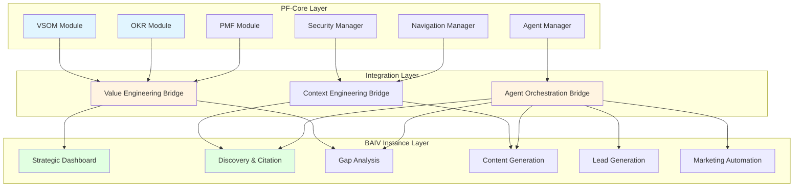
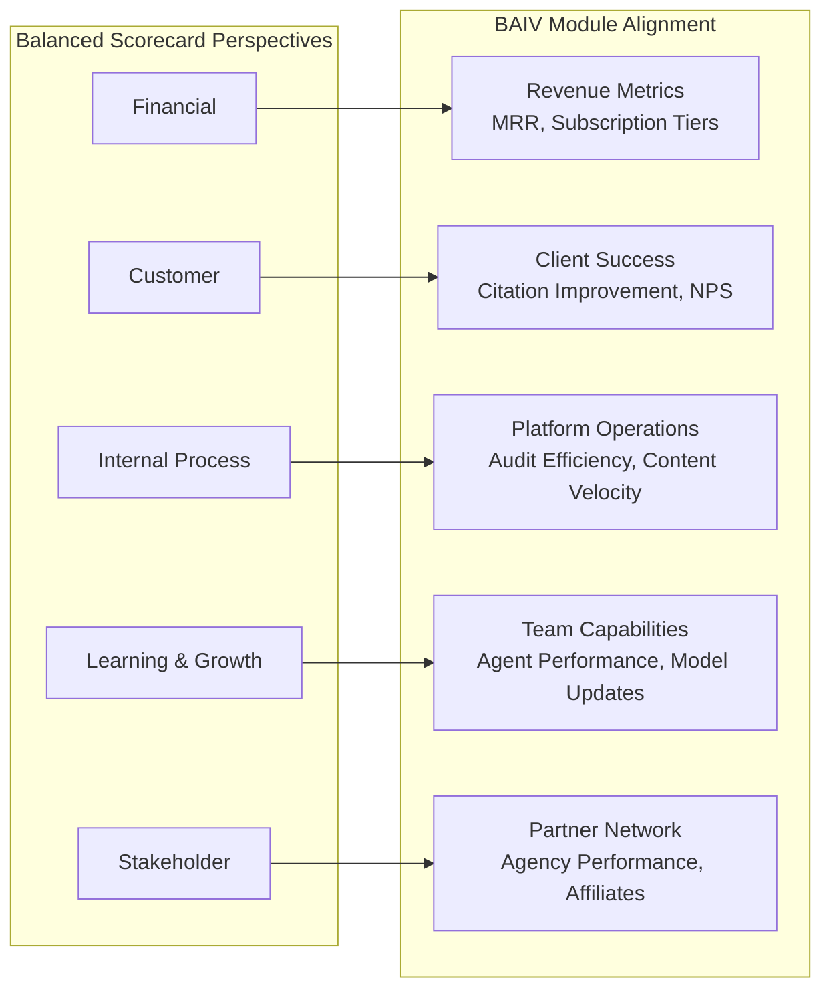
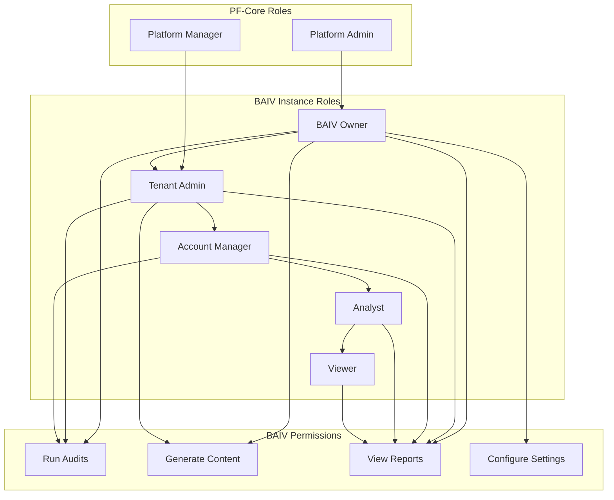
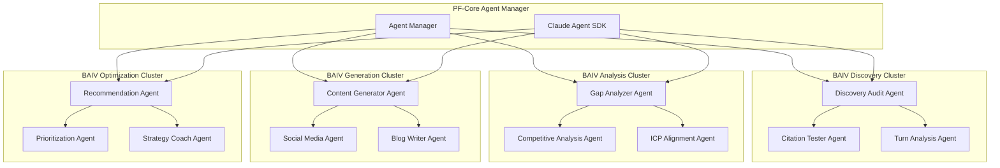
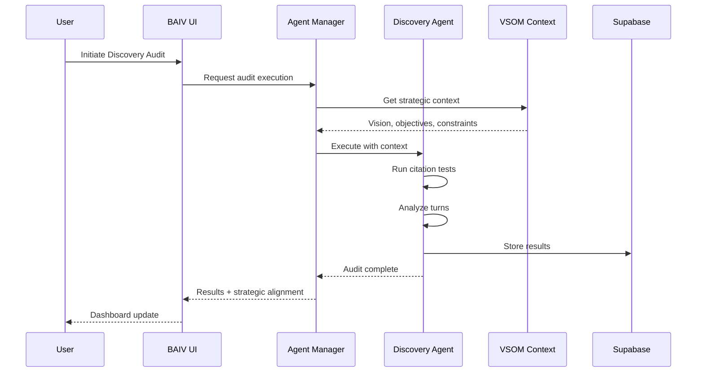
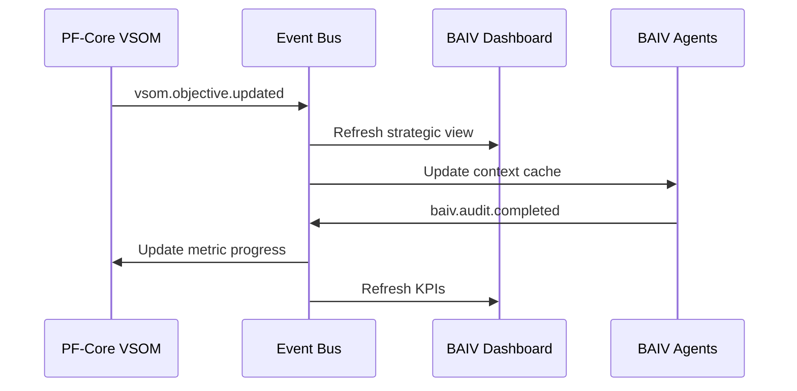

# BAIV PRD: PF-Core Integration v1.0

**Platform Foundation Core Integration for Be AI Visible**

| Attribute | Value |
|-----------|-------|
| **Document Version** | 1.0.0 |
| **Date** | December 2025 |
| **Author** | Platform Architecture Team |
| **Platform** | BAIV Agentic Platform - Platform Foundation Core |
| **PRD Type** | Integration Architecture & Module Mapping |
| **Base Document** | BAIV Instance PRD v1.7 |
| **Upstream Dependency** | PRD_PF_CORE_VSOM_Module_v1.0 |
| **Ontology Compliance** | Schema.org Grounded \| OAA Registry v3.0 |
| **Transferability Pattern** | W4M COO-GP Guardian SOP Reference |

---

## 1. Executive Summary

This document establishes the integration architecture connecting Platform Foundation Core (PF-Core) modules to the BAIV (Be AI Visible) product instance. The integration follows the Value Engineering cascade pattern established in the VSOM Module, ensuring strategic alignment flows from organizational vision through to product-specific AI Visibility operations.

### 1.1 Integration Purpose

The PF-Core to BAIV integration serves three critical functions:

1. **Value Cascade**: Propagate VSOM strategic context into BAIV-specific workflows, ensuring AI Visibility activities align with organizational objectives
2. **Module Reusability**: Enable PF-Core transferable modules (VSOM, OKR, Security, CRM) to instantiate within BAIV while maintaining platform independence
3. **Agent Context Sharing**: Provide BAIV's 16-agent architecture with strategic context for aligned decision-making

### 1.2 Reference Architecture Pattern

This integration follows the **W4M COO-GP Guardian SOP pattern**:

```
PF-Core (Platform Layer)
    └── Value Engineering Modules (VSOM, OKR, PMF)
        └── Instance Configuration Layer
            └── BAIV Instance (Product Layer)
                └── Domain-Specific Modules (AI Visibility, Citation, Gap Analysis)
                    └── Agent Orchestration Layer
```

---

## 2. PF-Core Module Inventory & BAIV Mapping

### 2.1 Platform Foundation Core Module Categories

Based on the comprehensive Figma reference documentation, PF-Core modules are organized into the following categories:

| Category | PF-Core Module | BAIV Instance Mapping | Integration Priority |
|----------|----------------|----------------------|---------------------|
| **Value Engineering** | VSOM (Vision, Strategy, Objectives, Metrics) | BAIV Strategic Dashboard | P0 - Critical |
| **Value Engineering** | OKR Module (CMO-OKR-ONTOLOGY v3.0.0) | Marketing OKRs & KPIs | P0 - Critical |
| **Value Engineering** | PMF Module (Product-Market Fit) | PMF Surveys & Analysis | P1 - High |
| **Security** | RBAC Module | BAIV Role Permissions | P0 - Critical |
| **Security** | Session Management | BAIV User Sessions | P0 - Critical |
| **Design** | Navigation Manager | BAIV Nav Hierarchy | P1 - High |
| **Design** | Atomic Design System | BAIV UI Components | P1 - High |
| **CRM** | Customer Organization Profile | BAIV Client Profiles | P1 - High |
| **CRM** | Partner Management | BAIV Agency/Affiliate | P2 - Medium |
| **Agent** | Agent Manager | BAIV Agent Orchestration | P0 - Critical |
| **Agent** | Claude Agent SDK | BAIV AI Agents | P0 - Critical |

### 2.2 Module Dependency Graph



---

## 3. Value Engineering Integration Architecture

### 3.1 Four-Layer Cascade from PF-Core to BAIV

The VSOM four-layer framework cascades into BAIV-specific implementation:

| VSOM Layer | PF-Core Component | BAIV Instantiation | Example |
|------------|-------------------|-------------------|---------|
| **Layer 1: Vision & Mission** | Vision Statement, Core Values | BAIV Brand Mission | "Establish AI Visibility Leadership" |
| **Layer 2: Strategic Objectives** | BSC Perspectives (5) | BAIV Strategic Themes | Customer: "Improve Client AI Citations by 40%" |
| **Layer 3: Operational Strategy & OKRs** | CMO-OKR-ONTOLOGY | BAIV Marketing OKRs | O: "Dominate AI Platform Citations" KR: "Achieve 75% citation rate" |
| **Layer 4: Metrics & KPIs** | Leading/Lagging Indicators | BAIV Performance Dashboard | Citation Rate, Gap Closure %, Content Coverage |

### 3.2 BAIV-Specific Strategic Alignment

#### BSC Perspective Mapping to BAIV Modules



### 3.3 OKR Integration with CMO-OKR-ONTOLOGY v3.0.0

BAIV leverages the CMO-OKR-ONTOLOGY for marketing-specific objective tracking:

```json
{
  "@context": {
    "@vocab": "https://schema.org/",
    "baiv": "https://baiv.co.uk/ontology/"
  },
  "@type": "baiv:BAIVObjective",
  "alignedStrategicObjective": "baiv:strategic-objective-citation-leadership",
  "objective": {
    "name": "Establish AI Platform Citation Dominance",
    "category": "awareness",
    "roleLevel": "CMO",
    "quarter": "Q1-2026"
  },
  "keyResults": [
    {
      "name": "Achieve 75% client citation rate improvement",
      "target": 75,
      "unit": "percentage",
      "measurementType": "lagging"
    },
    {
      "name": "Close 50 content gaps per client per month",
      "target": 50,
      "unit": "count",
      "measurementType": "leading"
    },
    {
      "name": "Onboard 100 paying customers",
      "target": 100,
      "unit": "count",
      "measurementType": "lagging"
    }
  ]
}
```

---

## 4. PF-Core Module Integration Specifications

### 4.1 VSOM Module Integration

**Source:** PRD_PF_CORE_VSOM_Module_v1.0

**Integration Points:**

| VSOM Component | BAIV Integration | Data Flow |
|----------------|------------------|-----------|
| Vision Statement | BAIV Brand Context | Read-only propagation |
| Strategic Objectives | BAIV Strategic Dashboard | Bidirectional alignment |
| Operational Strategies | BAIV Campaign Planning | Write-back capability |
| Metrics Dashboard | BAIV Analytics Integration | Real-time sync |

**Database Schema Extension:**

```sql
-- BAIV Instance Extension to VSOM
CREATE TABLE IF NOT EXISTS baiv_vsom_alignment (
    id UUID PRIMARY KEY DEFAULT gen_random_uuid(),
    tenant_id UUID NOT NULL REFERENCES tenants(id) ON DELETE CASCADE,
    
    -- VSOM Reference
    vsom_objective_id UUID NOT NULL,
    vsom_strategy_id UUID,
    
    -- BAIV-Specific Mapping
    baiv_module TEXT NOT NULL CHECK (baiv_module IN (
        'discovery_audit', 'citation_tracking', 'gap_analysis',
        'content_generation', 'lead_generation', 'pmf_analysis'
    )),
    
    -- Alignment Configuration
    alignment_type TEXT NOT NULL CHECK (alignment_type IN (
        'direct_contribution', 'indirect_support', 'enabling'
    )),
    contribution_weight DECIMAL(3,2) DEFAULT 1.0,
    
    -- Status Tracking
    alignment_status TEXT DEFAULT 'active',
    last_validated_at TIMESTAMP,
    
    -- Metadata
    created_at TIMESTAMP DEFAULT NOW(),
    updated_at TIMESTAMP DEFAULT NOW()
);

-- Index for tenant lookups
CREATE INDEX idx_baiv_vsom_alignment_tenant 
    ON baiv_vsom_alignment(tenant_id);

-- Index for module filtering
CREATE INDEX idx_baiv_vsom_alignment_module 
    ON baiv_vsom_alignment(baiv_module);
```

### 4.2 Security Module Integration

**Source:** PF-Security Manager PRD, RBAC_AND_REQUIREMENTS_GUIDE.md

**BAIV Role Hierarchy:**



### 4.3 Agent Manager Integration

**Source:** AGENT_MANAGER_PRD.md, ORCHESTRATED_AGENT_LAYER_PRD.md

**BAIV Agent Architecture (16 Primary + 12 Sub-Agents):**



**Agent Context Injection from VSOM:**

```python
# Agent Context Provider - VSOM Integration
class VSOMAgentContextProvider:
    """
    Provides VSOM strategic context to BAIV agents
    Enables strategy-aligned autonomous decision-making
    """
    
    def __init__(self, tenant_id: str):
        self.tenant_id = tenant_id
    
    async def get_strategic_context(self) -> dict:
        """
        Retrieve VSOM context for agent reasoning
        """
        return {
            "vision": await self._get_vision_mission(),
            "strategic_objectives": await self._get_aligned_objectives(),
            "current_okrs": await self._get_active_okrs(),
            "health_status": await self._get_metric_health(),
            "constraints": await self._get_strategic_constraints()
        }
    
    async def validate_action_alignment(
        self, 
        proposed_action: dict,
        agent_id: str
    ) -> dict:
        """
        Validate proposed agent action against strategic objectives
        Returns alignment score and recommendations
        """
        context = await self.get_strategic_context()
        
        return {
            "alignment_score": self._calculate_alignment(
                proposed_action, context
            ),
            "supporting_objectives": self._find_supporting_objectives(
                proposed_action, context
            ),
            "strategic_recommendations": self._generate_recommendations(
                proposed_action, context
            )
        }
```

---

## 5. BAIV Instance Module Specifications

### 5.1 BAIV Module Architecture

The BAIV Instance implements domain-specific modules that consume PF-Core services:

| BAIV Module | Table Count | PF-Core Dependencies | Primary Function |
|-------------|-------------|---------------------|------------------|
| **Discovery & Citation** | 11 | Agent Manager, Security | AI platform citation audits |
| **Gap Analysis** | 4 | VSOM, OKR Module | Content gap identification |
| **ICP & Profiles** | 3 | Customer Org Ontology | Ideal customer profiling |
| **Content Generation** | 15 | Agent Manager, Brand Voice | AI content creation |
| **Lead Generation** | 5 | CRM Module, PMF | Lead discovery & qualification |
| **LinkedIn Automation** | 5 | Security, Session Mgmt | Outreach automation |
| **Podcast Outreach** | 4 | CRM Module | Guest booking system |
| **Brand Ambassadors** | 3 | Partner Management | Influencer partnerships |
| **Product-Market Fit** | 11 | PMF Module | PMF analysis & surveys |
| **Analytics & Metrics** | 6 | VSOM Metrics Dashboard | Performance tracking |

**Total BAIV Tables:** 67 (of 101 total platform tables)

### 5.2 Discovery & Citation Module Integration

**Primary Integration:** Agent Manager + VSOM Strategic Context



### 5.3 Gap Analysis Module Integration

**Primary Integration:** VSOM Objectives + CMO-OKR-ONTOLOGY

```json
{
  "@context": {
    "@vocab": "https://schema.org/",
    "baiv": "https://baiv.co.uk/ontology/"
  },
  "@type": "baiv:GapAnalysisResult",
  "auditId": "audit-2025-001",
  "alignedObjective": "baiv:objective-citation-leadership",
  "gaps": [
    {
      "@type": "baiv:ContentGap",
      "gapType": "topic_missing",
      "topic": "AI implementation best practices",
      "strategicImpact": "high",
      "okrContribution": {
        "keyResult": "Achieve 75% citation rate",
        "estimatedContribution": 0.15
      },
      "priorityScore": 92,
      "recommendedAction": "Create comprehensive guide"
    }
  ],
  "strategicSummary": {
    "totalGaps": 23,
    "highPriorityGaps": 8,
    "estimatedOKRImpact": "18% improvement potential"
  }
}
```

---

## 6. Integration Implementation Phases

### Phase 1: Foundation (Weeks 1-3)

| Task | PF-Core Module | BAIV Target | Deliverable |
|------|----------------|-------------|-------------|
| VSOM Schema Deployment | VSOM Module | BAIV Tenant Config | vsom_* tables created |
| RBAC Integration | Security Manager | BAIV Permissions | Role hierarchy active |
| Agent Context Provider | Agent Manager | All BAIV Agents | Context injection live |

### Phase 2: Value Engineering Cascade (Weeks 4-6)

| Task | PF-Core Module | BAIV Target | Deliverable |
|------|----------------|-------------|-------------|
| Strategic Dashboard | VSOM Layer 1-2 | BAIV Dashboard | Vision/Objectives visible |
| OKR Integration | CMO-OKR-ONTOLOGY | BAIV Marketing | OKR cascade functional |
| Metrics Sync | VSOM Layer 4 | BAIV Analytics | Real-time KPI updates |

### Phase 3: Agent Orchestration (Weeks 7-9)

| Task | PF-Core Module | BAIV Target | Deliverable |
|------|----------------|-------------|-------------|
| Discovery Agent | Agent Manager | Discovery Module | Strategy-aligned audits |
| Gap Agent | Agent Manager | Gap Analysis | OKR-aware prioritization |
| Content Agent | Agent Manager | Content Generation | Brand-aligned output |

### Phase 4: Full Integration (Weeks 10-12)

| Task | PF-Core Module | BAIV Target | Deliverable |
|------|----------------|-------------|-------------|
| Cross-Module Sync | All PF-Core | All BAIV | Bidirectional data flow |
| Transferability Test | Module Packaging | W4M Instance | Successful clone |
| Documentation | All | All | Complete integration guide |

---

## 7. W4M COO-GP Guardian Pattern Reference

### 7.1 Pattern Definition

The W4M COO-GP (Chief Operating Officer - Governance & Process) Guardian pattern establishes the template for PF-Core to Instance integration:

```
COO-GP Guardian Pattern Components:
├── Governance Layer
│   ├── Strategic Alignment Validation
│   ├── Policy Enforcement
│   └── Compliance Monitoring
├── Process Layer
│   ├── Workflow Orchestration
│   ├── State Management
│   └── Error Handling
└── SOP Layer
    ├── Standard Operating Procedures
    ├── Playbook Execution
    └── Continuous Improvement Loop
```

### 7.2 BAIV Application of COO-GP Pattern

| COO-GP Component | BAIV Implementation | Integration Point |
|------------------|---------------------|-------------------|
| **Governance** | VSOM Strategic Alignment | Agent decision validation |
| **Process** | Agent Orchestration | Workflow state machine |
| **SOP** | Audit Playbooks | Discovery & Analysis flows |

### 7.3 SOP Integration Example

```yaml
# BAIV Discovery Audit SOP - COO-GP Pattern
sop_id: baiv-discovery-audit-001
version: 1.0.0
governance:
  strategic_alignment:
    required_objective: "AI Visibility Improvement"
    minimum_alignment_score: 0.7
  policy_enforcement:
    - max_queries_per_audit: 50
    - platform_coverage: ["chatgpt", "claude", "perplexity"]
  compliance:
    - data_retention: 90_days
    - audit_logging: required

process:
  orchestration:
    primary_agent: discovery_audit_agent
    sub_agents:
      - citation_tester_agent
      - turn_analysis_agent
      - attribution_metrics_agent
  state_management:
    states:
      - initiated
      - query_generation
      - citation_testing
      - analysis
      - completed
      - failed
  error_handling:
    retry_policy: exponential_backoff
    max_retries: 3
    fallback: manual_review

sop_steps:
  - step: 1
    name: "Context Injection"
    action: "Load VSOM strategic context"
    agent: orchestrator
    
  - step: 2
    name: "Query Generation"
    action: "Generate ICP-aligned queries"
    agent: discovery_audit_agent
    inputs:
      - tenant_icp_profile
      - target_keywords
      - competitor_domains
    
  - step: 3
    name: "Citation Testing"
    action: "Execute platform queries"
    agent: citation_tester_agent
    platforms:
      - chatgpt
      - claude
      - perplexity
      - gemini
    
  - step: 4
    name: "Turn Analysis"
    action: "Analyze response structure"
    agent: turn_analysis_agent
    
  - step: 5
    name: "Gap Identification"
    action: "Identify content gaps"
    agent: gap_analyzer_agent
    outputs:
      - gap_analysis_report
      - priority_recommendations
    
  - step: 6
    name: "Strategic Alignment Report"
    action: "Generate OKR-aligned recommendations"
    agent: strategy_coach_agent
    outputs:
      - strategic_alignment_score
      - okr_contribution_estimate
```

---

## 8. Database Schema Integration

### 8.1 PF-Core Tables Required for BAIV

The following PF-Core tables must be instantiated for BAIV:

```sql
-- PF-Core VSOM Tables
CREATE TABLE vsom_vision_mission (...);
CREATE TABLE vsom_strategic_objectives (...);
CREATE TABLE vsom_operational_strategies (...);
CREATE TABLE vsom_metrics_kpis (...);

-- PF-Core Security Tables
CREATE TABLE admin_user_sessions (...);
CREATE TABLE admin_session_events (...);
CREATE TABLE admin_team_activity_log (...);

-- PF-Core Agent Tables
CREATE TABLE agent_definitions (...);
CREATE TABLE agent_execution_logs (...);
CREATE TABLE agent_context_cache (...);
```

### 8.2 BAIV Instance Extension Tables

The following tables extend PF-Core for BAIV-specific functionality:

```sql
-- BAIV Strategic Alignment
CREATE TABLE baiv_vsom_alignment (...);
CREATE TABLE baiv_okr_contributions (...);
CREATE TABLE baiv_strategic_health (...);

-- BAIV Agent Extensions
CREATE TABLE baiv_agent_strategic_context (...);
CREATE TABLE baiv_agent_okr_tracking (...);
```

### 8.3 Integration Views

```sql
-- Combined Strategic View for BAIV Dashboard
CREATE VIEW baiv_strategic_dashboard AS
SELECT 
    v.id as vsom_id,
    v.vision_statement,
    so.objectives,
    os.strategies,
    m.metrics,
    ba.baiv_module_alignment,
    bc.contribution_metrics
FROM vsom_vision_mission v
JOIN vsom_strategic_objectives so ON so.tenant_id = v.tenant_id
JOIN vsom_operational_strategies os ON os.tenant_id = v.tenant_id
JOIN vsom_metrics_kpis m ON m.tenant_id = v.tenant_id
LEFT JOIN baiv_vsom_alignment ba ON ba.vsom_objective_id = so.id
LEFT JOIN baiv_okr_contributions bc ON bc.strategy_id = os.id
WHERE v.tenant_id = current_setting('app.tenant_id')::uuid;
```

---

## 9. API Integration Specifications

### 9.1 PF-Core to BAIV API Contracts

```typescript
// VSOM Context API
interface VSOMContext {
  tenantId: string;
  vision: {
    statement: string;
    timeHorizon: number;
    coreValues: string[];
  };
  objectives: StrategicObjective[];
  strategies: OperationalStrategy[];
  metrics: MetricKPI[];
}

// Agent Context Injection API
interface AgentContextRequest {
  agentId: string;
  tenantId: string;
  requestedContext: ('vsom' | 'okr' | 'metrics' | 'constraints')[];
}

interface AgentContextResponse {
  context: VSOMContext;
  alignmentRules: AlignmentRule[];
  activeConstraints: Constraint[];
  recommendedActions: RecommendedAction[];
}

// Strategic Alignment Validation API
interface AlignmentValidationRequest {
  agentId: string;
  proposedAction: AgentAction;
  targetModule: BAIVModule;
}

interface AlignmentValidationResponse {
  isAligned: boolean;
  alignmentScore: number;
  supportingObjectives: string[];
  recommendations: string[];
  requiredApprovals?: string[];
}
```

### 9.2 Event-Driven Integration



---

## 10. Success Metrics & Acceptance Criteria

### 10.1 Integration Success Metrics

| Metric | Target | Measurement Method |
|--------|--------|-------------------|
| **Module Deployment Time** | < 4 hours per tenant | Automated deployment script |
| **Context Injection Latency** | < 200ms | Agent response time monitoring |
| **Strategic Alignment Coverage** | 100% of BAIV actions | Alignment validation logs |
| **Data Consistency** | 99.9% sync accuracy | Reconciliation reports |
| **Transferability Index** | Deploy to 3+ ventures | Successful W4M/AIR deployment |

### 10.2 Acceptance Criteria

**AC-INT-001:** Given a new BAIV tenant, when PF-Core modules are deployed, then VSOM, Security, and Agent Manager are operational within 4 hours.

**AC-INT-002:** Given a BAIV agent action, when alignment validation is requested, then response includes alignment score and supporting objectives within 200ms.

**AC-INT-003:** Given VSOM objective update, when event is published, then all BAIV agents receive updated context within 5 seconds.

**AC-INT-004:** Given integration is complete, when transferability test is run, then W4M instance deploys with zero code changes.

---

## 11. Related Documentation

| Document | Location | Purpose |
|----------|----------|---------|
| PF-CORE VSOM Module PRD | PRD_PF_CORE_VSOM_Module_v1.0 | Value Engineering foundation |
| CMO-OKR-ONTOLOGY | ontologies/05-cmo-okr-ontology.json | Marketing OKR framework |
| Customer Organization Ontology | ontologies/03-customer-organization-ontology.json | Client profiling |
| Gap Analysis Ontology | ontologies/04-gap-analysis-ontology.json | Gap identification |
| AI Visibility Ontology | ontologies/01-ai-visibility-ontology.json | Citation patterns |
| Database Schema Complete | DATABASE_SCHEMA_COMPLETE.md | 101 table reference |
| Agent Manager PRD | AGENT_MANAGER_PRD.md | Agent orchestration |
| Security Manager PRD | SECURITY_MANAGER_PRD.md | RBAC implementation |

---

## 12. Glossary

| Term | Definition |
|------|------------|
| **PF-Core** | Platform Foundation Core - transferable infrastructure modules |
| **VSOM** | Vision, Strategy, Objectives & Metrics - top-level value engineering |
| **BAIV** | Be AI Visible - AI Visibility product instance |
| **BSC** | Balanced Scorecard - five-perspective strategic framework |
| **OKR** | Objectives and Key Results - execution framework |
| **COO-GP** | Chief Operating Officer - Governance & Process pattern |
| **OAA** | Ontology Architect Agent - registry governance |
| **RLS** | Row-Level Security - multi-tenant data isolation |

---

## Document Control

| Version | Date | Author | Changes |
|---------|------|--------|---------|
| 1.0.0 | December 2025 | Platform Architecture Team | Initial integration PRD |

---

**--- END OF DOCUMENT ---**
