# MILANA Components Integration Mapping
## Mapping to BAIV PRD v1.6 Sections

**Version:** 1.2.0  
**Date:** December 2025  
**Status:** DRAFT - For Collaborative Review  
**Purpose:** Map MILANA components to specific BAIV PRD v1.6 sections with RRF Analytics positioning and Ontology incorporation analysis

---

## 1. Executive Summary

This document maps MILANA's AI Visibility Platform components directly to the BAIV PRD v1.6 structure, with specific focus on:

1. **RRF (Reciprocal Rank Fusion)** - Positioned within Analytics & Scoring Metrics framework
2. **Ontology Incorporation** - How OAA and BAIV ontologies integrate into the AI Visibility product
3. **BAIV Tables** - Database architecture for the product instance

---

## 2. RRF: Definition, Rationale & Analytics Positioning

### 2.1 What is RRF (Reciprocal Rank Fusion)?

**Definition:**
> **Reciprocal Rank Fusion (RRF)** is a rank aggregation algorithm that combines multiple ranked lists into a single, unified ranking. Originally developed for information retrieval to merge results from different search algorithms, RRF assigns scores based on rank position rather than raw scores, making it robust for combining heterogeneous ranking sources.

**The RRF Formula:**
```
RRF_Score(d) = Σ (1 / (k + rank_r(d)))
```

Where:
- `d` = document/item being scored
- `k` = smoothing constant (typically 60)
- `rank_r(d)` = rank of document d in ranking r
- Σ = sum across all ranking sources

**BAIV Adaptation:**
In BAIV, RRF is adapted to combine multiple AI visibility dimensions into a unified priority score:

```
BAIV_RRF_Score(topic) = Σ (weight_i / (k + rank_i(topic)))
```

Where dimensions include:
- Search volume rank
- Current AI citation rank
- Content coverage rank
- Competitive position rank

### 2.2 Rationale for RRF Adoption

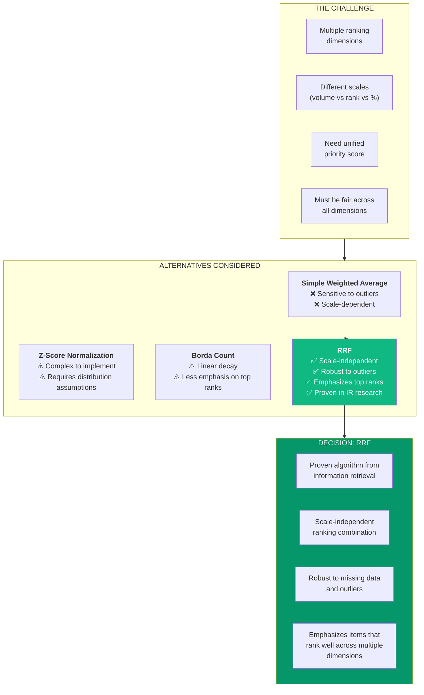

**Key Reasons for RRF Adoption:**

| Factor | RRF Advantage | Business Impact |
|--------|---------------|-----------------|
| **Scale Independence** | Combines search volume (1000s) with ranks (1-100) without normalization | Simpler implementation, fewer assumptions |
| **Outlier Robustness** | Rank-based, not score-based | One bad metric doesn't skew results |
| **Top-Rank Emphasis** | 1/(k+1) >> 1/(k+100) | Prioritizes topics that excel in multiple areas |
| **Research Proven** | Used by major search engines | Battle-tested algorithm |
| **Interpretability** | Higher score = better opportunity | Easy for CMOs to understand |

### 2.3 RRF as Part of Analytics & Scoring Framework

RRF should NOT be a standalone section. It belongs within a broader **Analytics & Scoring Framework** that serves multiple purposes across the platform.

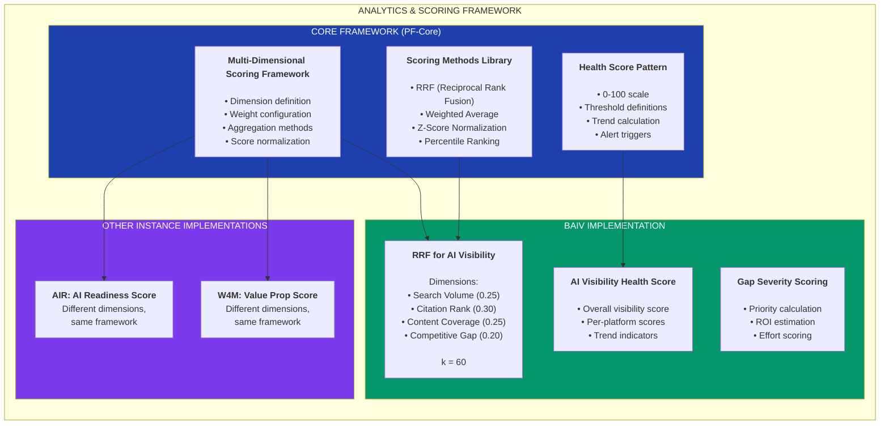

### 2.4 Proposed PRD Structure for Analytics & Scoring

Instead of §9.4 RRF Algorithm, propose restructuring as:

```
§X. ANALYTICS & SCORING FRAMEWORK

  §X.1 Multi-Dimensional Scoring Framework (PF-Core)
    - Dimension definition patterns
    - Weight configuration
    - Aggregation method selection
    
  §X.2 Scoring Methods Library (PF-Core)
    - RRF (Reciprocal Rank Fusion)
      - Definition and formula
      - When to use
      - Configuration parameters
    - Weighted Average
    - Percentile Ranking
    - Custom methods
    
  §X.3 Health Score Pattern (PF-Core)
    - 0-100 scale convention
    - Threshold definitions (Good/Warning/Critical)
    - Trend calculation
    - Alert integration
    
  §X.4 BAIV Scoring Implementation
    - AI Visibility RRF Configuration
    - Dimension definitions and weights
    - Gap severity scoring
    - Health score thresholds
```

### 2.5 RRF Configuration for BAIV

```yaml
# BAIV RRF Scoring Configuration
baiv_rrf_config:
  algorithm: "rrf"
  smoothing_constant: 60
  
  dimensions:
    search_volume:
      weight: 0.25
      description: "Monthly search volume for topic"
      source: "keyword_research_api"
      ranking: "descending"  # Higher volume = better rank
      
    citation_rank:
      weight: 0.30
      description: "Current position in AI platform citations"
      source: "ai_citation_audit"
      ranking: "ascending"  # Lower rank number = better
      
    content_coverage:
      weight: 0.25
      description: "Ratio of content published vs needed"
      source: "content_inventory"
      ranking: "descending"  # Higher coverage = better
      
    competitive_gap:
      weight: 0.20
      description: "Gap vs top competitor"
      source: "competitor_analysis"
      ranking: "descending"  # Larger gap = more opportunity
      
  health_thresholds:
    excellent: 80
    good: 60
    warning: 40
    critical: 20
    
  output:
    priority_score: "0-100 normalized"
    priority_tier: "P1/P2/P3/P4"
    estimated_impact: "derived from gap size"
```

---

## 3. Ontology Incorporation Analysis

### 3.1 Ontology Architecture Overview

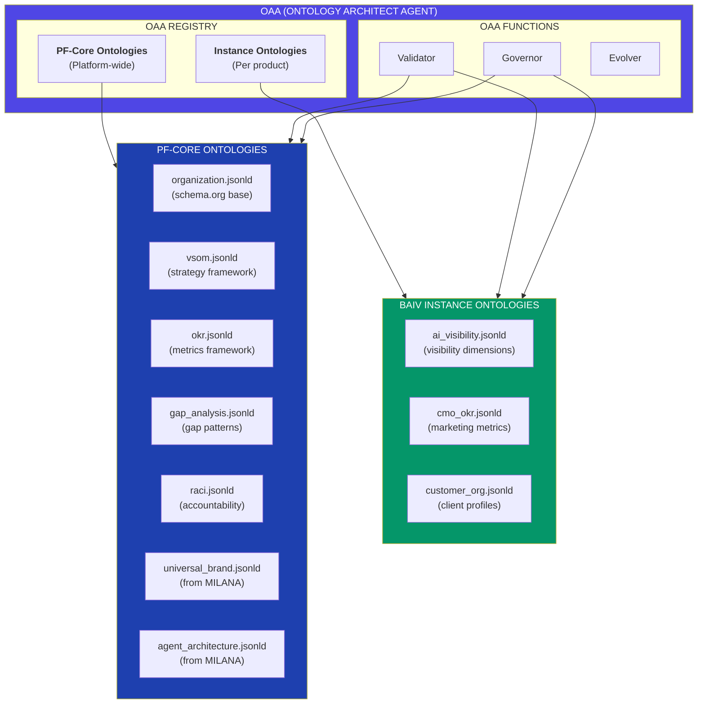

### 3.2 How Ontologies Flow into BAIV Product

```mermaid
flowchart TB
    subgraph REGISTRATION["1. ONTOLOGY REGISTRATION"]
        OAA_REG["OAA Registry receives<br/>ontology definitions"]
        VALIDATE["OAA Validator checks<br/>schema.org compliance"]
        STORE["Stored in Supabase<br/>ontology_registry table"]
    end

    subgraph RETRIEVAL["2. CONTEXT ENGINEERING RETRIEVAL"]
        CE100["CE-100 Discovery<br/>retrieves ontologies"]
        CE200["CE-200 Assembly<br/>builds context package"]
        CE400["CE-400 Instance Extensions<br/>adds BAIV-specific"]
    end

    subgraph DELIVERY["3. AGENT CONTEXT DELIVERY"]
        CE500["CE-500 Orchestration<br/>delivers to agents"]
        CONTEXT["Context Package includes:<br/>• Ontology schemas<br/>• Entity definitions<br/>• Relationship maps<br/>• Validation rules"]
    end

    subgraph USAGE["4. BAIV AGENT USAGE"]
        P0["P0 Orchestrator<br/>understands workflow entities"]
        P2["P2 Discovery<br/>knows what to discover"]
        P7["P7 Ideation<br/>understands content types"]
        P13["P13 Re-audit<br/>knows success criteria"]
    end

    subgraph OUTCOMES["5. SEMANTIC OUTCOMES"]
        STRUCT["Structured data capture"]
        REASON["Semantic reasoning"]
        INTEROP["Cross-instance interoperability"]
        EVOLVE["Governed evolution"]
    end

    REGISTRATION --> RETRIEVAL --> DELIVERY --> USAGE --> OUTCOMES

    style REGISTRATION fill:#4f46e5,color:#fff
    style RETRIEVAL fill:#7c3aed,color:#fff
    style DELIVERY fill:#7c3aed,color:#fff
    style USAGE fill:#059669,color:#fff
    style OUTCOMES fill:#10b981,color:#fff
```

### 3.3 PF-Core Ontologies and Their BAIV Application

#### 3.3.1 Universal Brand Ontology (from MILANA)

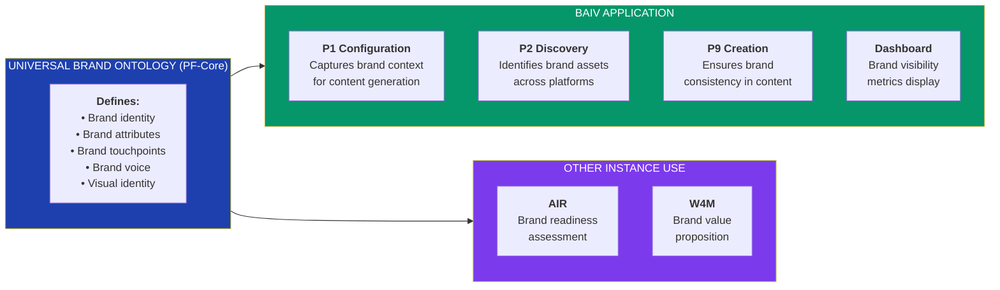

**Universal Brand Ontology Key Entities:**

| Entity | schema.org Base | BAIV Usage |
|--------|-----------------|------------|
| `Brand` | schema:Brand | Root entity for brand identity |
| `BrandIdentity` | Extension | Name, tagline, mission, values |
| `BrandVoice` | Extension | Tone, style, vocabulary |
| `BrandAsset` | schema:CreativeWork | Logos, images, content |
| `BrandTouchpoint` | Extension | Channels where brand appears |

#### 3.3.2 Agent Architecture Ontology (from MILANA)

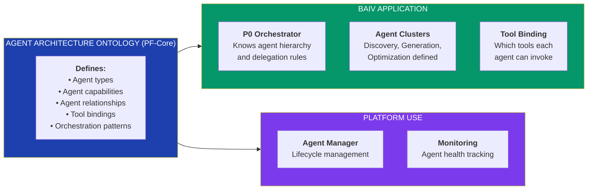

#### 3.3.3 Gap Analysis Ontology (PF-Core)

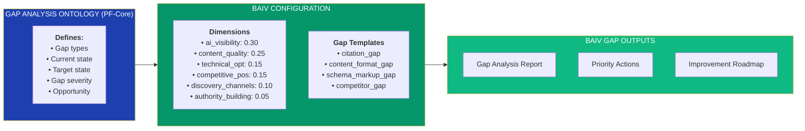

### 3.4 BAIV Instance Ontologies

#### 3.4.1 AI Visibility Ontology

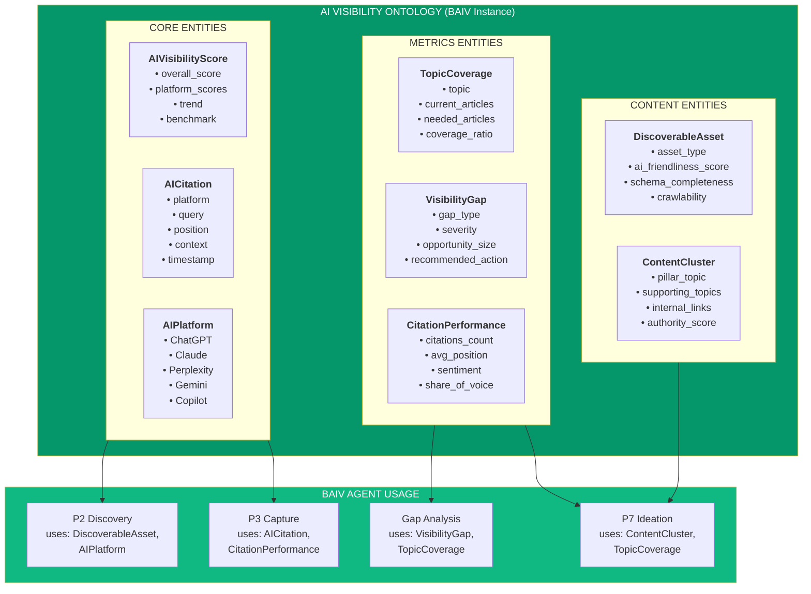

**AI Visibility Ontology - schema.org Grounding:**

| BAIV Entity | schema.org Base | Extension Reason |
|-------------|-----------------|------------------|
| `AIVisibilityScore` | schema:Rating | Extended for multi-platform scoring |
| `AICitation` | schema:Citation | Extended for AI-specific context |
| `AIPlatform` | schema:SoftwareApplication | Specialized for AI assistants |
| `TopicCoverage` | schema:ItemList | Extended for gap analysis |
| `VisibilityGap` | Extension | No direct schema.org equivalent |
| `DiscoverableAsset` | schema:CreativeWork | Extended for AI discoverability |
| `ContentCluster` | schema:ItemList | Extended for topic clustering |

#### 3.4.2 CMO OKR Ontology

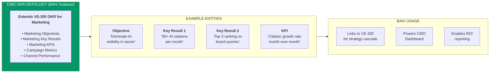

### 3.5 Complete Ontology Incorporation Flow

```mermaid
flowchart TB
    subgraph DEFINE["1. DEFINE & REGISTER"]
        DEF_CORE["Define PF-Core ontologies<br/>(Universal Brand, Agent Arch,<br/>Gap Analysis, VSOM, OKR)"]
        DEF_BAIV["Define BAIV ontologies<br/>(AI Visibility, CMO OKR,<br/>Customer Org)"]
        REG["Register all in<br/>OAA Registry"]
    end

    subgraph GOVERN["2. GOVERN & VALIDATE"]
        VAL["OAA Validator ensures<br/>schema.org compliance"]
        GOV["OAA Governor manages<br/>lifecycle states"]
        VER["Version control<br/>Draft → Active → Deprecated"]
    end

    subgraph STORE["3. STORE & INDEX"]
        DB["Store in Supabase<br/>ontology_registry table"]
        IDX["Index for retrieval<br/>by CE-100 Discovery"]
        CACHE["Cache frequently<br/>used ontologies"]
    end

    subgraph RETRIEVE["4. RETRIEVE & ASSEMBLE"]
        CE100_R["CE-100 retrieves<br/>relevant ontologies"]
        CE200_R["CE-200 assembles<br/>context package"]
        CE400_R["CE-400 adds BAIV<br/>extensions"]
    end

    subgraph DELIVER["5. DELIVER TO AGENTS"]
        CE500_D["CE-500 delivers<br/>context to agents"]
        CONTEXT_D["Agents receive:<br/>• Entity definitions<br/>• Relationship schemas<br/>• Validation rules<br/>• Reasoning patterns"]
    end

    subgraph EXECUTE["6. AGENT EXECUTION"]
        P0_E["P0 Orchestrator<br/>understands workflow"]
        DISC_E["Discovery agents<br/>know what to find"]
        GEN_E["Generation agents<br/>know what to create"]
        OPT_E["Optimization agents<br/>know success criteria"]
    end

    subgraph OUTCOME["7. SEMANTIC OUTCOMES"]
        STRUCT_O["<b>Structured Data</b><br/>All data follows<br/>ontology schemas"]
        REASON_O["<b>Semantic Reasoning</b><br/>Agents understand<br/>relationships"]
        INTEROP_O["<b>Interoperability</b><br/>Data works across<br/>all instances"]
        EVOLVE_O["<b>Governed Evolution</b><br/>Ontologies evolve<br/>with control"]
    end

    DEFINE --> GOVERN --> STORE --> RETRIEVE --> DELIVER --> EXECUTE --> OUTCOME

    style DEFINE fill:#4f46e5,color:#fff
    style GOVERN fill:#4f46e5,color:#fff
    style STORE fill:#64748b,color:#fff
    style RETRIEVE fill:#7c3aed,color:#fff
    style DELIVER fill:#7c3aed,color:#fff
    style EXECUTE fill:#059669,color:#fff
    style OUTCOME fill:#10b981,color:#fff
```

### 3.6 Ontology Incorporation Summary Table

| Ontology | Location | BAIV Agents Using | Purpose |
|----------|----------|-------------------|---------|
| **PF-CORE** ||||
| Universal Brand | OAA Registry | P1, P2, P9 | Brand context for content |
| Agent Architecture | OAA Registry | P0, Agent Manager | Agent orchestration |
| Gap Analysis | OAA Registry | Gap Agent, P4 | Gap identification patterns |
| VSOM | OAA Registry | VE Agent | Strategy cascade |
| OKR | OAA Registry | VE Agent | Metrics framework |
| RACI | OAA Registry | VE Agent | Accountability |
| **BAIV INSTANCE** ||||
| AI Visibility | OAA Registry (BAIV) | P2, P3, P4, P7, P13 | Core domain model |
| CMO OKR | OAA Registry (BAIV) | Dashboard, Reporting | Marketing metrics |
| Customer Organization | OAA Registry (BAIV) | P1, P0 | Client profiling |

---

## 4. Updated BAIV Tables Analysis

### 4.1 Tables Aligned with RRF Analytics Framework

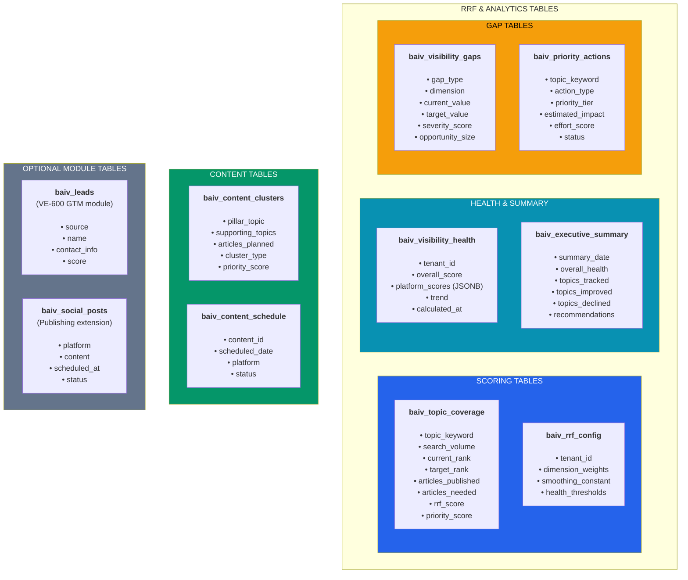

### 4.2 Table Relationship Diagram

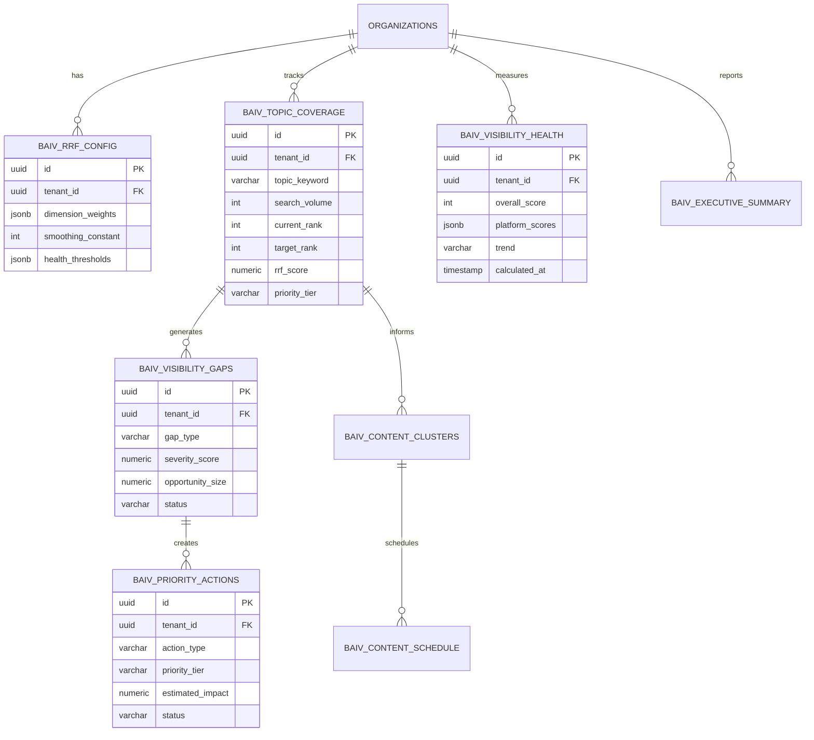

---

## 5. Complete MILANA to BAIV PRD Mapping (Updated)

```mermaid
flowchart TB
    subgraph MILANA["MILANA PLATFORM COMPONENTS"]
        direction TB
        
        subgraph M_ONT["ONTOLOGIES"]
            M_UBO["Universal Brand"]
            M_AIVO["AI Visibility"]
            M_AAO["Agent Architecture"]
        end
        
        subgraph M_RRF["RRF SYSTEM"]
            M_RRF_ALG["RRF Algorithm"]
            M_SCORE["Scoring Logic"]
            M_HEALTH["Health Calculation"]
        end
        
        subgraph M_SKILLS["SKILLS"]
            M_GAP["gap_analyzer"]
            M_AUDIT["content_audit"]
            M_COMP["competitor_analysis"]
            M_PLAN["rrf_content_planner"]
            M_CLUST["topic_clustering"]
            M_PRIOR["priority_scoring"]
        end
        
        subgraph M_DB["DATABASE"]
            M_TC["topic_coverage"]
            M_GA["gap_analysis"]
            M_ES["executive_summary"]
            M_PA["priority_actions"]
            M_AC["article_clusters"]
        end
    end

    subgraph BAIV_PRD["BAIV PRD v1.7 SECTIONS"]
        direction TB
        
        subgraph NEW_ANALYTICS["NEW: §X ANALYTICS & SCORING"]
            XA1["§X.1 Multi-Dimensional<br/>Scoring Framework"]
            XA2["§X.2 Scoring Methods<br/>(incl. RRF definition)"]
            XA3["§X.3 Health Score Pattern"]
            XA4["§X.4 BAIV RRF<br/>Implementation"]
        end
        
        subgraph SEC7_12["§7 OAA & §12 ONTOLOGIES"]
            ONT_REG["OAA Registry"]
            ONT_CORE["PF-Core Ontologies"]
            ONT_BAIV["BAIV Ontologies"]
        end
        
        subgraph SEC6["§6 GAP ANALYSIS"]
            GAP_TOOLS["Tools & Skills Library"]
            GAP_CONFIG["BAIV Configuration"]
        end
        
        subgraph SEC10["§10 AGENT ARCHITECTURE"]
            P2_AGT["P2 Discovery"]
            P3_AGT["P3 Capture"]
            P7_AGT["P7 Ideation"]
            P8_AGT["P8 Selection"]
        end
        
        subgraph NEW_DB["NEW: §14.2 BAIV TABLES"]
            DB_RRF["RRF & Analytics Tables"]
            DB_GAP["Gap Tables"]
            DB_CONTENT["Content Tables"]
            DB_OPT["Optional Tables"]
        end
    end

    %% Ontology mappings
    M_UBO -->|"PF-Core"| ONT_CORE
    M_AAO -->|"PF-Core"| ONT_CORE
    M_AIVO -->|"BAIV"| ONT_BAIV
    
    %% RRF mappings
    M_RRF_ALG -->|"Definition"| XA2
    M_SCORE -->|"Framework"| XA1
    M_HEALTH -->|"Pattern"| XA3
    M_PRIOR -->|"Implementation"| XA4
    
    %% Skills mappings
    M_GAP --> GAP_TOOLS
    M_AUDIT --> P2_AGT
    M_COMP --> P3_AGT
    M_PLAN --> P7_AGT
    M_CLUST --> P7_AGT
    
    %% Database mappings
    M_TC --> DB_RRF
    M_GA --> DB_GAP
    M_ES --> DB_RRF
    M_PA --> DB_GAP
    M_AC --> DB_CONTENT

    style MILANA fill:#0891b2,color:#fff
    style NEW_ANALYTICS fill:#f59e0b,color:#000
    style SEC7_12 fill:#4f46e5,color:#fff
    style SEC6 fill:#0891b2,color:#fff
    style SEC10 fill:#059669,color:#fff
    style NEW_DB fill:#64748b,color:#fff
```

---

## 6. Updated Decision Matrix

### 6.1 RRF & Analytics Decisions

| # | Decision | Proposed | Alternative | Status |
|---|----------|----------|-------------|--------|
| 1 | RRF placement | New §X Analytics & Scoring Framework | §9.4 standalone | ⬜ Review |
| 2 | RRF as PF-Core pattern | Yes - abstract framework | BAIV-only | ⬜ Review |
| 3 | Health Score standardization | 0-100 scale platform-wide | Per-instance definition | ⬜ Review |

### 6.2 Ontology Decisions

| # | Decision | Proposed | Alternative | Status |
|---|----------|----------|-------------|--------|
| 4 | Universal Brand location | PF-Core (OAA) | BAIV-only | ⬜ Review |
| 5 | Agent Architecture location | PF-Core (OAA) | BAIV-only | ⬜ Review |
| 6 | AI Visibility ontology | BAIV Instance | PF-Core | ⬜ Review |
| 7 | Ontology delivery mechanism | Via CE-100 to CE-500 | Direct agent access | ⬜ Review |

### 6.3 Database Decisions

| # | Decision | Proposed | Alternative | Status |
|---|----------|----------|-------------|--------|
| 8 | baiv_rrf_config table | New table for RRF settings | Inline in code | ⬜ Review |
| 9 | Health score storage | Separate baiv_visibility_health | In executive_summary | ⬜ Review |
| 10 | Lead tables | Optional (VE-600 activated) | Core BAIV | ⬜ Review |

---

## 7. PRD v1.7 Section Updates Summary

| Current Section | Update Required | From MILANA |
|-----------------|-----------------|-------------|
| **NEW §X** | Analytics & Scoring Framework | RRF algorithm, scoring logic |
| §4.4 VE-300 | Add abstract Priority Scoring | priority_scoring pattern |
| §5.3 CE-100 | Add CE-118, CE-119 retrievers | content_audit, competitor_analysis |
| §6.2 | Add RRF to Tools Library | gap_analyzer RRF integration |
| §7/§12 | Add Universal Brand, Agent Arch | MILANA ontologies |
| §10.1 | Enhance P2, P3, P7, P8 agents | MILANA skills |
| **NEW §14.2** | BAIV Tables (8 tables) | MILANA database schema |

---

## 8. Next Steps

1. **Confirm RRF positioning** in Analytics & Scoring Framework
2. **Approve ontology locations** (PF-Core vs BAIV Instance)
3. **Validate table structure** for BAIV database
4. **Create PRD v1.7** with all approved integrations

---

**Document Version:** 1.2.0  
**Status:** For Collaborative Review  
**Maps To:** BAIV PRD v1.6 → v1.7  
**Key Additions:** RRF definition & rationale, Ontology incorporation analysis
