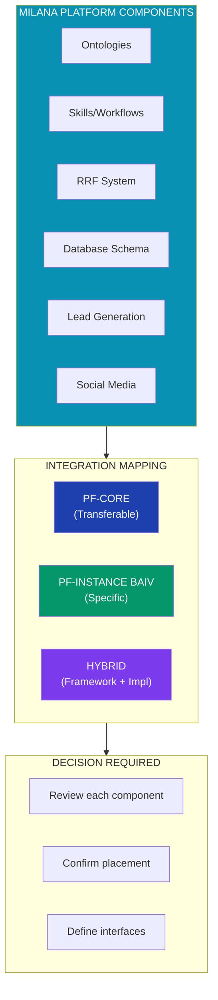
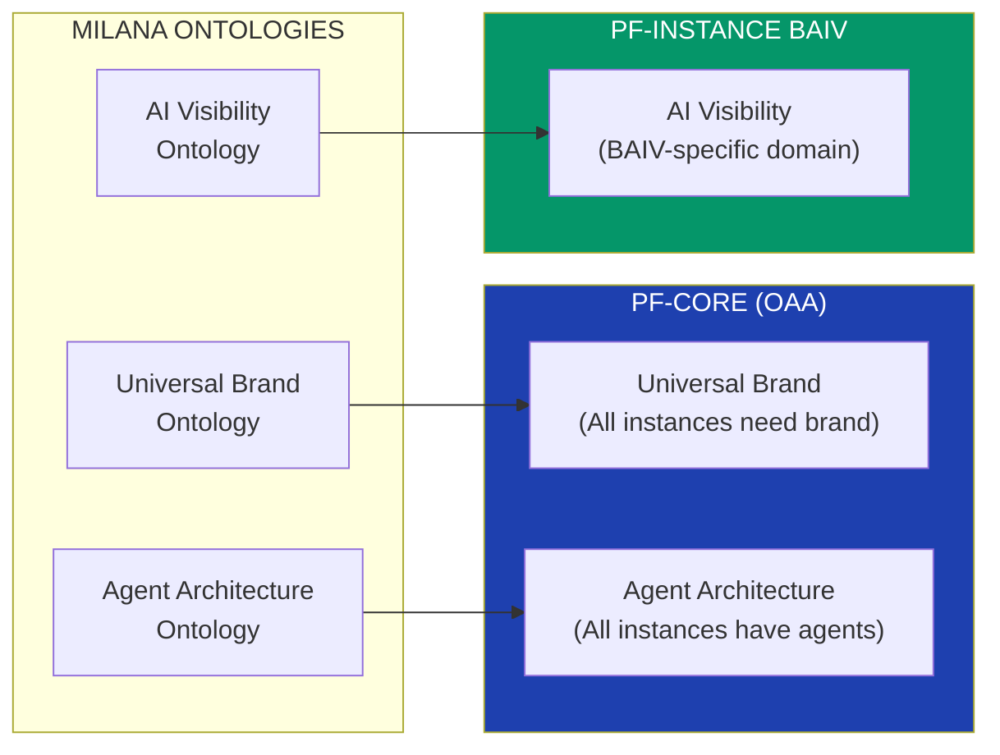
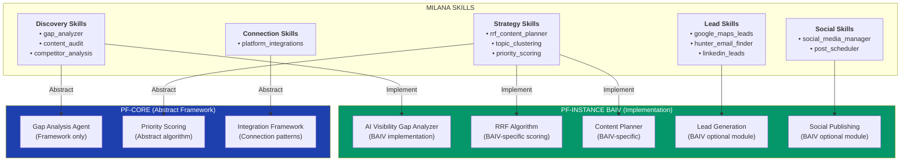
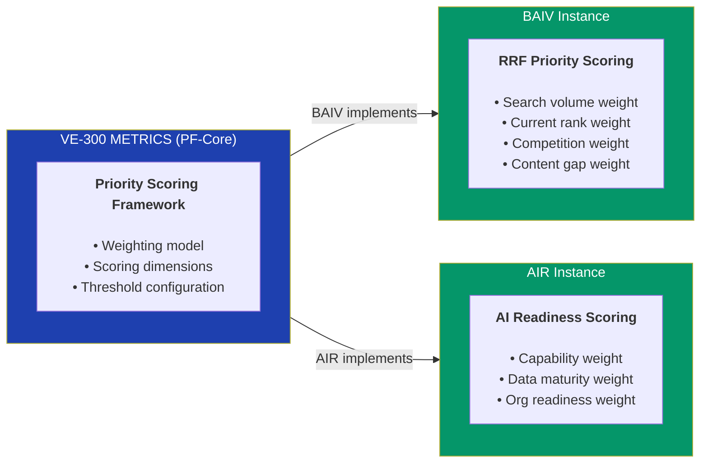
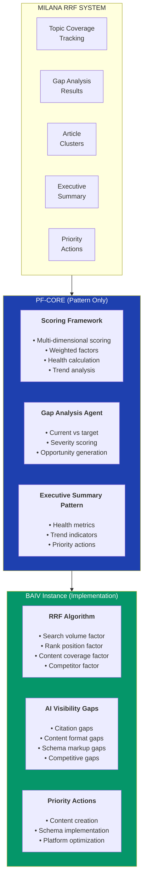
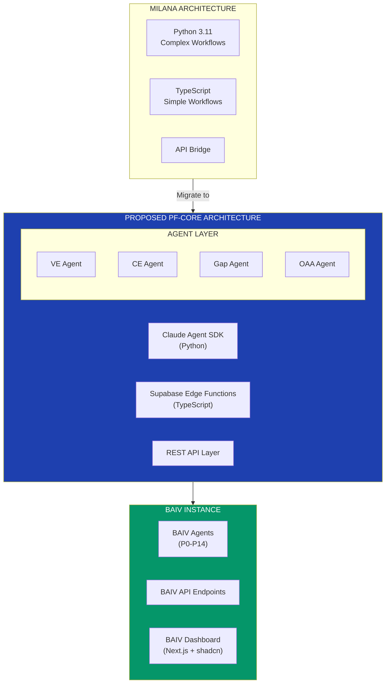
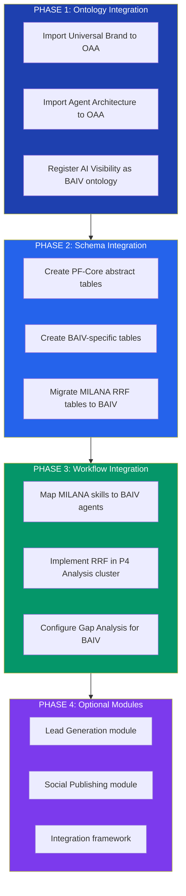

# MILANA Components Integration Mapping
## PF-Core and BAIV Instance Alignment Analysis

**Version:** 1.0.0  
**Date:** December 2025  
**Status:** DRAFT - For Collaborative Review  
**Purpose:** Map MILANA components to PF-Core (transferable) vs PF-Instance BAIV (specific)

---

## 1. Executive Summary

MILANA's AI Visibility Platform provides concrete implementation components that can be factored into the PF-Core / PF-Instance architecture. This document analyzes each MILANA component and proposes:

1. **PF-Core Candidates** - Abstract, transferable components usable across all instances
2. **PF-Instance BAIV** - Domain-specific components for AI Visibility product
3. **Hybrid Components** - Framework in PF-Core, implementation in PF-Instance



---

## 2. Component-by-Component Analysis

### 2.1 Ontologies

| MILANA Component | Proposed Location | Rationale | Decision Needed |
|------------------|-------------------|-----------|-----------------|
| **Universal Brand Ontology** | PF-Core (OAA) | Brand identity is universal across all instances (AIR, W4M need brand too) | ✅ Confirm as PF-Core |
| **AI Visibility Ontology** | PF-Instance BAIV | Specific to AI visibility domain, citation patterns | ✅ Confirm as BAIV-specific |
| **Agent Architecture Ontology** | PF-Core (OAA) | Agent structure applies to all instances | ✅ Confirm as PF-Core |



**Decision Questions:**
1. Does AIR need Universal Brand Ontology? (Likely yes - for client brand analysis)
2. Does W4M need Universal Brand Ontology? (Likely yes - for value proposition branding)
3. Should Agent Architecture Ontology be part of OAA or separate?

---

### 2.2 Skills/Workflows

MILANA defines 5 skill categories. Here's the proposed mapping:



#### 2.2.1 Discovery Skills Mapping

| MILANA Skill | PF-Core | BAIV Instance | Notes |
|--------------|---------|---------------|-------|
| `gap_analyzer.py` | Gap Analysis Agent (abstract) | AI Visibility Gap Analyzer (configured) | Already in PRD - Gap Analysis is PF-Wide |
| `content_audit.py` | - | P2 Discovery Agent | BAIV-specific digital asset discovery |
| `competitor_analysis.py` | Competitive Analysis Tool (abstract) | AI Visibility Competitor Tool | Could be PF-Core tool used by BAIV |

**Decision Questions:**
1. Should `competitor_analysis` be a PF-Core tool? (AIR and W4M may need competitive analysis)
2. Is `content_audit` transferable or truly BAIV-specific?

#### 2.2.2 Strategy Skills Mapping

| MILANA Skill | PF-Core | BAIV Instance | Notes |
|--------------|---------|---------------|-------|
| `rrf_content_planner.py` | - | P7 Ideation + P8 Selection | RRF is BAIV-specific algorithm |
| `topic_clustering.py` | - | P7 Ideation sub-agent | Content clustering for AI visibility |
| `priority_scoring.py` | VE-300 Priority Framework | RRF Priority Scoring | Abstract in VE, implemented in BAIV |

**Key Insight:** Priority scoring could be abstracted to VE-300 as a general framework, with BAIV implementing RRF-specific scoring.



#### 2.2.3 Lead Skills Mapping

| MILANA Skill | PF-Core | BAIV Instance | Notes |
|--------------|---------|---------------|-------|
| `google_maps_leads.py` | - | BAIV Lead Module (optional) | Specific to BAIV go-to-market |
| `hunter_email_finder.py` | - | BAIV Lead Module (optional) | Specific to BAIV go-to-market |
| `linkedin_leads.py` | - | BAIV Lead Module (optional) | Specific to BAIV go-to-market |

**Decision Questions:**
1. Is Lead Generation part of core BAIV or an optional add-on module?
2. Could Lead Generation be PF-Core if AIR/W4M also need lead gen?
3. Should this be a separate PF-Instance entirely (e.g., PF-Leads)?

#### 2.2.4 Social Skills Mapping

| MILANA Skill | PF-Core | BAIV Instance | Notes |
|--------------|---------|---------------|-------|
| `social_media_manager.py` | - | BAIV Social Module (optional) | Content distribution channel |
| `post_scheduler.py` | - | P11 Scheduling sub-agent | Could extend to social scheduling |

**Decision Questions:**
1. Is Social Publishing part of core BAIV or optional?
2. Does this belong in P12 Publishing cluster?

#### 2.2.5 Connection Skills Mapping

| MILANA Skill | PF-Core | BAIV Instance | Notes |
|--------------|---------|---------------|-------|
| `platform_integrations.py` | Integration Framework | BAIV-specific integrations | Abstract in PF-Core, implement per instance |

---

### 2.3 RRF System (Reciprocal Rank Fusion)

The RRF system is MILANA's core algorithm for AI visibility scoring. This is **BAIV-specific** but provides a pattern for other instances.



**Proposed Mapping:**

| RRF Component | PF-Core Pattern | BAIV Implementation |
|---------------|-----------------|---------------------|
| Topic Coverage Tracking | Coverage Tracking Framework | AI Visibility Topic Coverage |
| RRF Score Calculation | Multi-Dimensional Scoring Framework | RRF Algorithm |
| Gap Analysis Results | Gap Analysis Agent | AI Visibility Gap Configuration |
| Article Clusters | Content Clustering Pattern | AI-Optimized Content Clusters |
| Executive Summary | Dashboard Pattern | AI Visibility Dashboard |
| Priority Actions | Action Queue Pattern | AI Visibility Priority Actions |

**Key Decision:** Should RRF algorithm be abstracted to PF-Core or remain BAIV-specific?

Arguments for PF-Core:
- AIR could use similar weighted scoring for AI Readiness
- W4M could use for value proposition scoring
- Pattern is reusable

Arguments for BAIV-specific:
- RRF is specifically tuned for search/citation ranking
- Other instances have different scoring needs
- Simpler to keep domain-specific

**Recommendation:** Keep RRF implementation in BAIV, but abstract "Multi-Dimensional Weighted Scoring Framework" to PF-Core.

---

### 2.4 Database Schema

MILANA provides concrete table definitions that can be mapped:

```mermaid
flowchart TB
    subgraph MILANA_TABLES["MILANA DATABASE TABLES"]
        T1["tenants"]
        T2["rrf_topic_coverage"]
        T3["gap_analysis"]
        T4["article_clusters"]
        T5["rrf_executive_summary"]
        T6["rrf_priority_actions"]
        T7["google_maps_leads"]
        T8["lead_emails"]
        T9["social_posts"]
        T10["platform_connections"]
    end

    subgraph PFCORE_TABLES["PF-CORE TABLES"]
        PC1["organizations<br/>(extends tenants)"]
        PC2["ve_vsom"]
        PC3["ve_okrs"]
        PC4["ve_pmf_gates"]
        PC5["gap_analysis_results<br/>(abstract)"]
        PC6["priority_actions<br/>(abstract)"]
        PC7["executive_summaries<br/>(abstract)"]
    end

    subgraph BAIV_TABLES["BAIV TABLES"]
        B1["baiv_topic_coverage<br/>(from rrf_topic_coverage)"]
        B2["baiv_visibility_gaps<br/>(from gap_analysis)"]
        B3["baiv_content_clusters<br/>(from article_clusters)"]
        B4["baiv_leads<br/>(optional)"]
        B5["baiv_social_posts<br/>(optional)"]
    end

    T1 --> PC1
    T2 --> B1
    T3 -->|"Abstract"| PC5
    T3 -->|"Implement"| B2
    T4 --> B3
    T5 -->|"Abstract"| PC7
    T6 -->|"Abstract"| PC6
    T7 --> B4
    T9 --> B5

    style PFCORE_TABLES fill:#1e40af,color:#fff
    style BAIV_TABLES fill:#059669,color:#fff
```



#### 2.4.1 Table-by-Table Mapping

| MILANA Table | Target | Rationale |
|--------------|--------|-----------|
| `tenants` | PF-Core `organizations` | Multi-tenancy is platform-wide |
| `rrf_topic_coverage` | BAIV `baiv_topic_coverage` | RRF-specific tracking |
| `gap_analysis` | PF-Core abstract + BAIV implementation | Gap analysis is PF-Wide |
| `article_clusters` | BAIV `baiv_content_clusters` | Content strategy is BAIV-specific |
| `rrf_executive_summary` | PF-Core pattern + BAIV implementation | Dashboard pattern is reusable |
| `rrf_priority_actions` | PF-Core pattern + BAIV implementation | Action queue is reusable |
| `google_maps_leads` | BAIV `baiv_leads` (optional) | Lead gen is BAIV GTM |
| `lead_emails` | BAIV `baiv_lead_emails` (optional) | Lead gen is BAIV GTM |
| `social_posts` | BAIV `baiv_social_posts` (optional) | Social is BAIV distribution |
| `platform_connections` | PF-Core `integrations` | Integration framework is platform-wide |

---

### 2.5 Integration Architecture

MILANA proposes a hybrid TypeScript/Python approach:



**Key Architecture Decisions:**

1. **Agent SDK:** Claude Agent SDK (Python) for all agents
2. **API Layer:** FastAPI or Supabase Edge Functions?
3. **Frontend:** Next.js + shadcn (via Figma Make)
4. **Complex Algorithms:** Keep in Python (Claude Agent SDK handles this)

**Recommendation:** Since Claude Agent SDK is Python-based, MILANA's Python workflows can integrate naturally. No need for TypeScript bridge for complex workflows.

---

## 3. Proposed PRD Section Additions

Based on MILANA analysis, here are proposed additions to the BAIV PRD:

### 3.1 New Section: RRF Algorithm (BAIV-Specific)

```markdown
## X. RRF Algorithm (BAIV Instance)

### X.1 Overview

RRF (Reciprocal Rank Fusion) is BAIV's proprietary algorithm for calculating AI visibility health and prioritizing content gaps.

### X.2 Scoring Dimensions

| Dimension | Weight | Description |
|-----------|--------|-------------|
| Search Volume | 0.25 | Monthly search volume for topic |
| Current Rank | 0.30 | Current position in AI platform citations |
| Content Coverage | 0.25 | Ratio of articles published vs needed |
| Competitor Gap | 0.20 | Relative position vs competitors |

### X.3 RRF Formula

```
RRF_Score = Σ (1 / (k + rank_i)) * weight_i
```

Where:
- k = smoothing constant (default: 60)
- rank_i = rank in dimension i
- weight_i = dimension weight

### X.4 Integration with Gap Analysis

RRF scoring is used by the Gap Analysis Agent when configured for BAIV:

```yaml
baiv_gap_configuration:
  scoring_algorithm: "rrf"
  dimensions:
    - search_volume: 0.25
    - current_rank: 0.30
    - content_coverage: 0.25
    - competitor_gap: 0.20
```
```

### 3.2 New Section: Lead Generation Module (BAIV Optional)

```markdown
## Y. Lead Generation Module (BAIV Optional)

### Y.1 Overview

Lead generation is an optional BAIV module for go-to-market activities. Not required for core AI visibility functionality.

### Y.2 Lead Sources

| Source | Integration | Purpose |
|--------|-------------|---------|
| Google Maps | Apify API | Local business discovery |
| Hunter.io | Hunter API | Email enrichment |
| LinkedIn | Optional | Professional outreach |

### Y.3 Module Activation

Lead generation is activated via VE-600 GTM configuration:

```yaml
ve_600_gtm:
  lead_generation:
    enabled: true
    sources:
      - google_maps
      - hunter_email
    budget_monthly: 500  # API costs
```
```

### 3.3 New Section: Social Publishing Module (BAIV Optional)

```markdown
## Z. Social Publishing Module (BAIV Optional)

### Z.1 Overview

Social publishing extends P12 Publishing to social media platforms. Optional module for content distribution.

### Z.2 Supported Platforms

- LinkedIn (company pages, personal profiles)
- Twitter/X
- Facebook

### Z.3 Integration with P11 Scheduling

Social posts are queued through P11 Scheduling agent and executed by P12 Publishing.
```

---

## 4. Decision Matrix for Collaborative Review

### 4.1 Ontology Decisions

| # | Component | Proposed Location | Alternative | Decision |
|---|-----------|-------------------|-------------|----------|
| 1 | Universal Brand Ontology | PF-Core (OAA) | BAIV-only | ⬜ Review |
| 2 | AI Visibility Ontology | BAIV Instance | PF-Core | ⬜ Review |
| 3 | Agent Architecture Ontology | PF-Core (OAA) | Per-instance | ⬜ Review |

### 4.2 Skills/Workflow Decisions

| # | Component | Proposed Location | Alternative | Decision |
|---|-----------|-------------------|-------------|----------|
| 4 | Gap Analyzer | PF-Core (abstract) + BAIV (config) | BAIV-only | ⬜ Review |
| 5 | Competitor Analysis | PF-Core Tool | BAIV-only | ⬜ Review |
| 6 | RRF Content Planner | BAIV Instance | Abstract to PF-Core | ⬜ Review |
| 7 | Priority Scoring | VE-300 (abstract) + BAIV (RRF impl) | BAIV-only | ⬜ Review |
| 8 | Lead Generation | BAIV Optional Module | PF-Core Module | ⬜ Review |
| 9 | Social Publishing | BAIV Optional Module | PF-Core Module | ⬜ Review |

### 4.3 Database Decisions

| # | Component | Proposed Location | Alternative | Decision |
|---|-----------|-------------------|-------------|----------|
| 10 | Topic Coverage Tables | BAIV Instance | PF-Core pattern | ⬜ Review |
| 11 | Gap Analysis Tables | PF-Core (abstract) + BAIV | BAIV-only | ⬜ Review |
| 12 | Executive Summary Tables | PF-Core pattern + BAIV | BAIV-only | ⬜ Review |
| 13 | Lead Tables | BAIV Optional | PF-Core optional | ⬜ Review |
| 14 | Integration Tables | PF-Core | Per-instance | ⬜ Review |

### 4.4 Architecture Decisions

| # | Component | Proposed Location | Alternative | Decision |
|---|-----------|-------------------|-------------|----------|
| 15 | Agent Runtime | Claude Agent SDK (Python) | Hybrid TS/Python | ⬜ Review |
| 16 | API Layer | FastAPI | Supabase Edge Functions | ⬜ Review |
| 17 | Complex Algorithms | Python (in SDK) | TypeScript port | ⬜ Review |

---

## 5. Recommended Integration Approach



---

## 6. Summary: What Goes Where

### 6.1 PF-Core (Transferable)

```
PF-CORE ADDITIONS FROM MILANA
│
├── OAA Registry
│   ├── Universal Brand Ontology (from MILANA)
│   └── Agent Architecture Ontology (from MILANA)
│
├── Gap Analysis Agent
│   └── (Already defined - MILANA validates approach)
│
├── VE-300 Metrics
│   └── Priority Scoring Framework (abstract from RRF)
│
├── Database Patterns
│   ├── Executive Summary Pattern
│   ├── Priority Actions Pattern
│   └── Integration Framework
│
└── Infrastructure
    └── Platform Connections Framework
```

### 6.2 PF-Instance BAIV (Specific)

```
BAIV ADDITIONS FROM MILANA
│
├── Domain Ontologies
│   └── AI Visibility Ontology (from MILANA)
│
├── RRF Algorithm
│   ├── Topic Coverage Tracking
│   ├── RRF Score Calculation
│   └── Priority Scoring (implements VE-300)
│
├── Agent Extensions
│   ├── P4 Analysis → RRF Gap Analysis
│   ├── P7 Ideation → Topic Clustering
│   └── P11 Scheduling → Content Calendar
│
├── Database Tables
│   ├── baiv_topic_coverage
│   ├── baiv_visibility_gaps
│   ├── baiv_content_clusters
│   └── baiv_priority_actions
│
└── Optional Modules
    ├── Lead Generation (VE-600 GTM)
    └── Social Publishing (P12 extension)
```

---

## 7. Next Steps

1. **Review Decision Matrix** (Section 4) - Confirm each placement decision
2. **Validate RRF Abstraction** - Should scoring framework be in VE-300?
3. **Clarify Optional Modules** - Lead Gen and Social in core BAIV or add-ons?
4. **Confirm Architecture** - Claude Agent SDK as primary runtime?
5. **Update PRD v1.7** - Incorporate agreed decisions

---

**Document Version:** 1.0.0  
**Status:** For Collaborative Review  
**Next Action:** Review decision matrix and confirm placements
