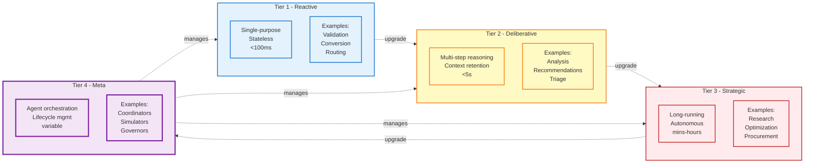
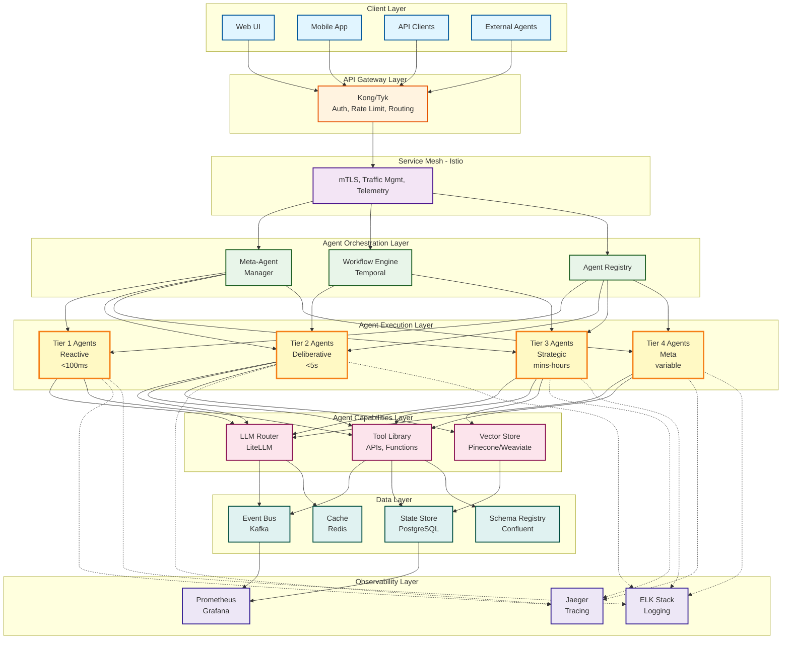

# Platform Agentic Implementation Guide
## Directives, Policies, Procedures & Templates

**Version**: 1.0  
**Effective Date**: 2025-10-24  
**Classification**: Strategic Implementation Framework  
**Owner**: AI Architecture Council

---

## EXECUTIVE DIRECTIVE

**Mission**: Deploy AI-first agentic architecture delivering sustainable competitive advantage through intelligent automation, autonomous decision-making, and adaptive workflows.

**Core Principle**: Every process, interaction, and transaction must be agent-capable, API-first, and schema-driven from inception.

---

## I. ARCHITECTURAL POLICIES

### 1.1 Agent-First Design Mandate
- **All systems** shall be architected with autonomous agent interaction as the primary interface
- Human interfaces are secondary layers atop agent-capable APIs
- Every feature must answer: "How will an agent consume/control this?"

### 1.2 Schema-Driven Development
- **Schema.org** serves as the foundational vocabulary for all data models
- Application-specific extensions inherit from Schema.org base types
- All APIs must expose JSON Schema definitions (OpenAPI 3.1+)
- Schema validation enforced at ingress/egress boundaries

### 1.3 Composability Requirements
- Microservices architecture with single-responsibility agents
- Event-driven choreography over orchestration where possible
- Zero hard dependencies between agent domains
- Graceful degradation protocols mandatory

---

## II. AGENTIC IMPLEMENTATION PROCEDURES

### 2.1 Agent Classification Framework



**Tier 1 - Reactive Agents**
- Single-purpose, stateless operations
- <100ms response time target
- Example: Data validation, format conversion, routing

**Tier 2 - Deliberative Agents**
- Multi-step reasoning with context retention
- <5s decision time target
- Example: Document analysis, recommendation engines, triage systems

**Tier 3 - Strategic Agents**
- Long-running autonomous workflows
- Minutes to hours execution
- Example: Research synthesis, competitive analysis, procurement optimization

**Tier 4 - Meta-Agents**
- Agent orchestration and capability composition
- Manage agent lifecycles and inter-agent protocols
- Example: Project delivery coordinators, multi-agent simulation controllers

### 2.2 Agent Communication Protocol

**Standard Message Schema** (Schema.org based):

```json
{
  "@context": "https://schema.org",
  "@type": "Action",
  "identifier": "action-uuid-v4",
  "agent": {
    "@type": "SoftwareApplication",
    "identifier": "agent-uuid",
    "name": "AgentName",
    "version": "1.2.0",
    "applicationCategory": "Tier2-Deliberative"
  },
  "actionStatus": "PotentialActionStatus|ActiveActionStatus|CompletedActionStatus|FailedActionStatus",
  "startTime": "2025-10-24T10:30:00Z",
  "endTime": "2025-10-24T10:30:45Z",
  "object": {
    "@type": "CreativeWork",
    "identifier": "object-uuid",
    "encodingFormat": "application/json"
  },
  "result": {
    "@type": "Thing",
    "value": {},
    "confidence": 0.95
  },
  "error": {
    "@type": "PropertyValue",
    "propertyID": "ErrorCode",
    "value": "ERR_VALIDATION_001",
    "description": "Schema validation failed on field X"
  },
  "instrument": {
    "@type": "Service",
    "serviceType": "API|Tool|Model",
    "name": "gpt-4",
    "provider": {
      "@type": "Organization",
      "name": "OpenAI"
    }
  },
  "cost": {
    "@type": "MonetaryAmount",
    "currency": "USD",
    "value": "0.0023"
  }
}
```

### 2.3 Observability Standards

**Required Instrumentation:**
- OpenTelemetry spans for every agent action
- Structured logging (JSON) with correlation IDs
- Metrics exported to Prometheus/Grafana stack
- Distributed tracing with Jaeger/Zipkin

**Key Metrics:**
```json
{
  "agent_execution_duration_seconds": "histogram",
  "agent_success_rate": "counter",
  "agent_cost_per_operation_usd": "gauge",
  "agent_token_usage_total": "counter",
  "agent_error_rate_by_type": "counter",
  "agent_decision_confidence_score": "histogram"
}
```

**Alerting Thresholds:**
- Error rate >5% in 5-minute window
- P95 latency exceeds SLA by 50%
- Cost per operation increases >30% week-over-week
- Confidence score drops below tier-specific threshold

---

## III. OPERATIONAL DIRECTIVES

### 3.1 Development Workflow

```mermaid
flowchart TD
    START([Agent Development Start]) --> STAGE1

    STAGE1[Stage 1: Discovery & Assessment]
    STAGE1 --> S1A[Identify bottleneck/opportunity]
    S1A --> S1B[Conduct Readiness Assessment]
    S1B --> S1C[Map current state + baselines]
    S1C --> STAGE2

    STAGE2[Stage 2: Schema Design]
    STAGE2 --> S2A[Define Schema.org vocabulary]
    S2A --> S2B[Create JSON Schema defs]
    S2B --> S2C[Establish validation rules]
    S2C --> STAGE3

    STAGE3[Stage 3: Agent Specification]
    STAGE3 --> S3A[Complete spec template]
    S3A --> S3B[Define tier, triggers, SLAs]
    S3B --> S3C[Identify tools & models]
    S3C --> STAGE4

    STAGE4[Stage 4: Prototype]
    STAGE4 --> S4A[Build MVP with synthetic data]
    S4A --> S4B[Red-team testing]
    S4B --> S4C[Security & privacy review]
    S4C --> REVIEW1{Prototype<br/>Approved?}
    
    REVIEW1 -->|No| S4A
    REVIEW1 -->|Yes| STAGE5

    STAGE5[Stage 5: Validation]
    STAGE5 --> S5A[Run parallel with humans 30d]
    S5A --> S5B[A/B testing]
    S5B --> S5C[Collect stakeholder feedback]
    S5C --> REVIEW2{Validation<br/>Passed?}
    
    REVIEW2 -->|No| S5A
    REVIEW2 -->|Yes| STAGE6

    STAGE6[Stage 6: Scale & Monitor]
    STAGE6 --> S6A[Graduate to production]
    S6A --> S6B[Implement learning loops]
    S6B --> S6C[Schedule quarterly reviews]
    S6C --> END([Agent in Production])

    classDef stageStyle fill:#e3f2fd,stroke:#1976d2,stroke-width:2px
    classDef actionStyle fill:#fff9c4,stroke:#f57f17,stroke-width:1px
    classDef decisionStyle fill:#ffebee,stroke:#c62828,stroke-width:2px
    classDef endStyle fill:#c8e6c9,stroke:#2e7d32,stroke-width:3px

    class STAGE1,STAGE2,STAGE3,STAGE4,STAGE5,STAGE6 stageStyle
    class S1A,S1B,S1C,S2A,S2B,S2C,S3A,S3B,S3C,S4A,S4B,S4C,S5A,S5B,S5C,S6A,S6B,S6C actionStyle
    class REVIEW1,REVIEW2 decisionStyle
    class START,END endStyle
```



**Stage 1: Discovery & Assessment**
- Identify process bottleneck/opportunity
- Conduct Agentic Readiness Assessment (see Section VIII)
- Map current state with baseline metrics

**Stage 2: Schema Design**
- Define inputs/outputs using Schema.org vocabulary
- Create JSON Schema definitions
- Establish validation rules and data contracts

**Stage 3: Agent Specification**
- Complete Agent Specification Template (see Section IX)
- Define tier, triggers, guardrails, SLAs
- Identify required tools and models

**Stage 4: Prototype Development**
- Build MVP with synthetic data
- Implement red-team testing scenarios
- Conduct security and privacy reviews

**Stage 5: Validation**
- Run parallel with human baseline (30-day minimum)
- A/B testing where applicable
- Collect qualitative feedback from stakeholders

**Stage 6: Scale & Monitor**
- Graduate to production with monitoring thresholds
- Implement continuous learning loops
- Schedule quarterly capability reviews

### 3.2 Client Engagement Protocol

**Pre-Engagement Phase:**
1. Discovery Call (60 min)
   - Understand business objectives and pain points
   - Identify potential high-impact processes
   - Assess technical maturity and readiness

2. Agentic Readiness Assessment (2-4 hours)
   - Complete assessment template (Section VIII)
   - Analyze data quality, API maturity, change tolerance
   - Generate readiness score and gap analysis

3. Opportunity Mapping Workshop (4 hours)
   - Map process flows and decision points
   - Identify automation candidates
   - Prioritize by impact vs. complexity matrix

**Engagement Phase:**
1. Baseline Establishment
   - Document current metrics (time, cost, error rate)
   - Define success criteria tied to business KPIs
   - Establish measurement methodology

2. Phased Rollout
   - **Shadow Mode** (Weeks 1-2): Agent observes, doesn't act
   - **Supervised Mode** (Weeks 3-6): Agent suggests, human approves
   - **Autonomous Mode** (Week 7+): Agent acts with monitoring

3. Review Cadence
   - Weekly: Operational metrics review
   - Monthly: Agent performance tuning
   - Quarterly: Strategic capability assessment

**Post-Deployment:**
- Continuous monitoring and optimization
- Knowledge transfer to client team
- Expansion planning for additional processes

### 3.3 Risk Management

**Guardrails by Agent Tier:**

| Tier | Financial Limit | Human Approval | Rollback Window |
|------|----------------|----------------|-----------------|
| Tier 1 | $100 | Never | Immediate |
| Tier 2 | $1,000 | Edge cases | <5 min |
| Tier 3 | $10,000 | Novel scenarios | <30 min |
| Tier 4 | Unlimited | Strategic decisions | <2 hours |

**Mandatory Human-in-the-Loop Triggers:**
- Confidence score below tier threshold
- Novel scenario (no training data precedent)
- Regulatory/compliance sensitive actions
- Financial threshold exceeded
- Anomaly detection flags raised

**Incident Response Protocol:**

```mermaid
flowchart TD
    ALERT[🚨 Incident Detected] --> STEP1

    STEP1[1. DETECTION<br/>&lt;1 minute]
    STEP1 --> S1A[Automated monitoring<br/>triggers alert]
    S1A --> S1B[On-call team notified]
    S1B --> STEP2

    STEP2[2. CONTAINMENT<br/>&lt;5 minutes]
    STEP2 --> S2A[Pause affected agents]
    S2A --> S2B[Rollback if necessary]
    S2B --> S2C{Contained?}
    S2C -->|No| ESCALATE[Escalate to<br/>Senior Team]
    S2C -->|Yes| STEP3
    ESCALATE --> STEP3

    STEP3[3. INVESTIGATION<br/>&lt;2 hours]
    STEP3 --> S3A[Analyze logs & traces]
    S3A --> S3B[Identify root cause]
    S3B --> S3C[Document findings]
    S3C --> STEP4

    STEP4[4. RESOLUTION<br/>&lt;24 hours]
    STEP4 --> S4A[Develop fix]
    S4A --> S4B[Test in staging]
    S4B --> S4C[Deploy to production]
    S4C --> S4D[Validate resolution]
    S4D --> STEP5

    STEP5[5. DOCUMENTATION<br/>&lt;48 hours]
    STEP5 --> S5A[Write post-mortem]
    S5A --> S5B[Update runbooks]
    S5B --> S5C[Share with team]
    S5C --> STEP6

    STEP6[6. PREVENTION<br/>&lt;1 week]
    STEP6 --> S6A[Update knowledge base]
    S6A --> S6B[Enhance monitoring]
    S6B --> S6C[Retrain agents if needed]
    S6C --> COMPLETE[✅ Incident Resolved]

    classDef stepStyle fill:#e3f2fd,stroke:#1976d2,stroke-width:2px
    classDef actionStyle fill:#fff9c4,stroke:#f57f17,stroke-width:1px
    classDef decisionStyle fill:#ffebee,stroke:#c62828,stroke-width:2px
    classDef escalateStyle fill:#ff8a80,stroke:#d32f2f,stroke-width:2px
    classDef completeStyle fill:#c8e6c9,stroke:#2e7d32,stroke-width:3px

    class STEP1,STEP2,STEP3,STEP4,STEP5,STEP6 stepStyle
    class S1A,S1B,S2A,S2B,S3A,S3B,S3C,S4A,S4B,S4C,S4D,S5A,S5B,S5C,S6A,S6B,S6C actionStyle
    class S2C decisionStyle
    class ESCALATE escalateStyle
    class COMPLETE completeStyle
```



**Detailed Steps:**
1. **Detection** (<1 min): Automated monitoring alerts
2. **Containment** (<5 min): Agent pause/rollback procedures
3. **Investigation** (<2 hours): Root cause analysis initiated
4. **Resolution** (<24 hours): Fix deployed and validated
5. **Documentation** (<48 hours): Post-mortem completed
6. **Prevention** (<1 week): Knowledge base updated, retraining initiated

---

## IV. COMPETITIVE ADVANTAGE MECHANISMS

### 4.1 Beyond Obvious Use Cases

**AVOID (Commoditized):**
- Generic chatbots and virtual assistants
- Basic document summarization
- Simple classification and routing
- Standard RPA workflows
- Anything achievable via SaaS product configuration

**PURSUE (Differentiated):**

**Cross-Domain Synthesis**
- Example: Market signals → Supply chain adjustments → Pricing optimization
- Example: Customer sentiment → Product roadmap → Resource allocation

**Predictive Process Optimization**
- Pre-empt bottlenecks before formation
- Dynamic resource allocation based on forecasted demand
- Proactive exception handling

**Autonomous Negotiation**
- Dynamic pricing engines
- Vendor selection and contract optimization
- Multi-party coordination and consensus building

**Continuous Learning Loops**
- Self-improving workflows without manual retraining
- Adaptive strategies based on outcome feedback
- Transfer learning across client deployments

**Contextual Intelligence**
- Real-time intelligence briefings synthesized from multiple sources
- Opportunity identification through pattern recognition
- Risk assessment with multi-factor analysis

### 4.2 SaaS Incumbent Gap Exploitation

**Target Weaknesses:**

| Incumbent Limitation | Our Agentic Solution |
|---------------------|---------------------|
| Rigid workflow engines | Adaptive agent orchestration with runtime reconfiguration |
| Manual integration hell | Self-configuring API agents with schema discovery |
| Static reports/dashboards | Real-time intelligence briefings with proactive insights |
| Feature request backlogs | Custom agent deployment in <48 hours |
| One-size-fits-all logic | Context-aware, learning-enabled customization |
| Siloed data processing | Cross-system synthesis and correlation |
| Reactive support | Predictive issue detection and resolution |

**Penetration Strategy:**
1. Identify high-friction integration points in client's SaaS stack
2. Deploy agents that bridge gaps and enhance capabilities
3. Demonstrate measurable improvement in weeks, not quarters
4. Expand agent coverage to increase switching costs
5. Position as "intelligent middleware" layer

### 4.3 Defensibility Strategies

**Moat Building:**
1. **Proprietary Training Data**
   - Client operational data creates unique agent capabilities
   - Performance improves with deployment duration
   - Data network effects across similar industry verticals

2. **Vertical-Specific Ontologies**
   - Domain extensions on Schema.org
   - Industry-specific agent libraries
   - Regulatory compliance built-in

3. **Inter-Client Agent Collaboration**
   - Anonymous, privacy-preserving agent learning
   - Benchmark intelligence sharing
   - Industry best practice propagation

4. **Embedded Agent Ecosystems**
   - Deep integration into client operations
   - High switching costs due to customization
   - Agent dependencies create lock-in

5. **Velocity Advantage**
   - 48-hour agent deployment vs. months for custom development
   - Continuous capability expansion
   - Rapid adaptation to market changes

---

## V. TECHNICAL STANDARDS

### 5.1 Technology Stack Requirements

**Core Platform:**
- **Container Orchestration**: Kubernetes (v1.27+)
- **Service Mesh**: Istio or Linkerd for agent-to-agent communication
- **API Gateway**: Kong or Tyk with rate limiting and authentication

**Agent Frameworks:**
- **Multi-Agent Orchestration**: LangGraph (primary), CrewAI (alternative)
- **Workflow Engine**: Apache Airflow or Temporal for long-running processes
- **Agent Memory**: LangMem or custom vector store integration

**LLM Infrastructure:**
- **Router/Gateway**: LiteLLM or custom routing logic
- **Model Providers**: OpenAI, Anthropic, Azure OpenAI, self-hosted
- **Cost Optimization**: Task complexity → model selection mapping
- **Fallback Chain**: Primary → Secondary → Tertiary providers

**Data Layer:**
- **Vector Stores**: Pinecone (managed), Weaviate (self-hosted), Qdrant (hybrid)
- **Event Bus**: Apache Kafka (high-throughput), RabbitMQ (complex routing)
- **State Management**: Redis (ephemeral), PostgreSQL (durable), Valkey (Redis alternative)
- **Document Store**: MongoDB or ElasticSearch for unstructured data

**Observability:**
- **Metrics**: Prometheus + Grafana
- **Logging**: ELK Stack (ElasticSearch, Logstash, Kibana) or Loki
- **Tracing**: Jaeger or Zipkin with OpenTelemetry
- **APM**: DataDog or New Relic for production

### 5.2 API Design Principles

**Protocol Selection:**
- **RESTful**: CRUD operations, public-facing APIs
- **GraphQL**: Complex queries, flexible client needs
- **gRPC**: High-performance inter-agent communication
- **WebSockets**: Real-time streaming, agent notifications

**Standards:**
- OpenAPI 3.1 specification for all REST endpoints
- JSON Schema validation at request/response boundaries
- Versioned endpoints with backward compatibility (min 12 months)
- Rate limiting per agent identity with tiered quotas
- Idempotency keys for all state-changing operations
- Pagination for list operations (cursor-based preferred)

**Authentication & Authorization:**
- OAuth 2.0 / OpenID Connect for user authentication
- Service-to-service: mTLS or JWT with short expiry
- Agent identity: Unique credentials with scope-limited permissions
- API key rotation policy: 90 days maximum

**Error Handling:**
```json
{
  "@context": "https://schema.org",
  "@type": "Error",
  "errorCode": "ERR_VALIDATION_001",
  "errorType": "ValidationError",
  "message": "Field 'email' must be a valid email address",
  "statusCode": 400,
  "timestamp": "2025-10-24T10:30:00Z",
  "requestId": "req-uuid-v4",
  "documentation": "https://docs.platform.com/errors/ERR_VALIDATION_001"
}
```

### 5.3 Data Governance

**Schema Management:**
- Central schema registry (Confluent Schema Registry or Apicurio)
- Schema versioning with compatibility checks (backward, forward, full)
- Automated schema validation in CI/CD pipeline
- Schema documentation auto-generated and published

**Privacy & Compliance:**
- GDPR/CCPA compliance by design
- Data lineage tracking with provenance metadata
- PII detection and redaction agents
- Right-to-deletion automation
- Consent management integration

**Security:**
- Encryption at rest: AES-256
- Encryption in transit: TLS 1.3
- Secrets management: HashiCorp Vault or AWS Secrets Manager
- Agent audit logs retained per regulatory requirements (7 years default)
- Regular penetration testing and security audits

**Data Quality:**
- Automated data quality checks in agent pipelines
- Anomaly detection on incoming data streams
- Data validation against schemas at every boundary
- Quality metrics published to observability stack

---

## VI. SUCCESS METRICS

### 6.1 Platform Health Indicators

**Availability & Reliability:**
- Agent uptime: >99.5% (target), >99.9% (aspirational)
- Mean time to recovery (MTTR): <30 minutes
- Mean time between failures (MTBF): >720 hours

**Performance:**
- API response time: P50 <100ms, P95 <500ms, P99 <2s
- Agent deployment time: <48 hours (simple), <1 week (complex)
- Schema coverage: >90% of business entities

**Development Velocity:**
- Time to first agent deployment: <2 weeks
- Agent reusability rate: >40% across projects
- API-first adoption rate: 100% of new features

### 6.2 Business Impact Metrics

**Operational Efficiency:**
- Process cycle time reduction: 40-70% target
- Cost per transaction decrease: 30-60% target
- Error rate improvement: 50-80% reduction target
- Manual intervention reduction: >60%

**Financial:**
- Total Cost of Ownership (TCO) vs. traditional automation
- Return on Investment (ROI) timeline
- Cost avoidance through error prevention
- Revenue impact through faster processing

**Quality:**
- Accuracy improvement vs. human baseline
- Consistency across repeated operations
- Audit compliance rate
- Customer satisfaction impact (NPS/CSAT delta)

### 6.3 Innovation Metrics

**Capability Expansion:**
- New agent types deployed per quarter: >3
- Cross-client agent reuse percentage: >30%
- Time from concept to production agent: <30 days average

**Market Position:**
- Client retention tied to agent deployment depth
- Expansion revenue from additional agent deployments
- Competitive win rate when agent-first approach highlighted

---

## VII. CONTINUOUS IMPROVEMENT

### 7.1 Knowledge Management

**Central Repository:**
- Agent pattern library with reusable components
- Anti-pattern documentation with lessons learned
- Decision logs for architectural choices
- Client success stories and case studies

**Review Cadence:**
- Weekly: Agent performance retrospectives
- Monthly: Technical architecture reviews
- Quarterly: Strategic capability assessment
- Annually: Technology stack evaluation

**Benchmarking:**
- Agent performance across clients (anonymized)
- Industry-specific capability maturity
- Technology adoption vs. market trends

### 7.2 Ecosystem Development

**Partner Strategy:**
- Integration partnerships with complementary platforms
- Agent marketplace for third-party extensions
- Technology partnerships with AI/ML providers
- System integrator network for delivery scale

**Community Building:**
- Developer documentation portal
- Open-source contributions for generic capabilities
- Technical blog and thought leadership
- Industry working groups and standards participation

**Training & Enablement:**
- Client technical team certification program
- Partner training and accreditation
- Internal capability development workshops
- Academic research collaborations

---

## VIII. AGENTIC READINESS ASSESSMENT TEMPLATE

### Assessment Framework

**Section 1: Technical Infrastructure (Weight: 30%)**

| Criterion | Score (1-5) | Evidence | Remediation Required |
|-----------|-------------|----------|---------------------|
| API Availability | | % of systems with REST/GraphQL APIs | |
| API Documentation | | OpenAPI specs, up-to-date docs | |
| Data Quality | | Completeness, accuracy, timeliness | |
| Integration Maturity | | Middleware, ESB, iPaaS usage | |
| Cloud Readiness | | Container adoption, DevOps maturity | |

**Section 2: Data Landscape (Weight: 25%)**

| Criterion | Score (1-5) | Evidence | Remediation Required |
|-----------|-------------|----------|---------------------|
| Schema Consistency | | Standardized data models | |
| Data Accessibility | | API access to core systems | |
| Historical Data | | Training data availability | |
| Real-time Capabilities | | Event streaming, CDC | |
| Master Data Mgmt | | Single source of truth | |

**Section 3: Organizational Readiness (Weight: 25%)**

| Criterion | Score (1-5) | Evidence | Remediation Required |
|-----------|-------------|----------|---------------------|
| Change Tolerance | | Previous automation adoption | |
| Technical Capability | | Developer skills, AI literacy | |
| Leadership Support | | Executive sponsorship | |
| Process Documentation | | Workflow clarity, tribal knowledge | |
| Risk Appetite | | Willingness to experiment | |

**Section 4: Use Case Potential (Weight: 20%)**

| Criterion | Score (1-5) | Evidence | Remediation Required |
|-----------|-------------|----------|---------------------|
| Process Repeatability | | Standardized workflows | |
| Decision Complexity | | Rule-based vs. judgment calls | |
| Volume/Frequency | | Transaction throughput | |
| Business Impact | | Revenue/cost/risk significance | |
| Current Pain Points | | Documented inefficiencies | |

**Scoring Guide:**
- **5 - Excellent**: Ready for immediate deployment
- **4 - Good**: Minor gaps, addressable quickly
- **3 - Fair**: Moderate gaps, 1-3 month remediation
- **2 - Poor**: Major gaps, 3-6 month remediation
- **1 - Critical**: Foundational issues, >6 month remediation

**Readiness Calculation:**
```
Total Score = (Technical × 0.30) + (Data × 0.25) + (Organizational × 0.25) + (Use Case × 0.20)

Readiness Level:
- 4.5-5.0: High - Proceed with full deployment
- 3.5-4.4: Medium-High - Proceed with pilot, plan for scale
- 2.5-3.4: Medium - Remediation first, then pilot
- 1.5-2.4: Low - Significant preparation required
- 0.0-1.4: Not Ready - Foundational work needed
```

### Assessment Deliverable Template

```markdown
# Agentic Readiness Assessment Report

**Client**: [Client Name]
**Assessment Date**: [Date]
**Assessor**: [Name/Team]
**Overall Readiness Score**: [X.X/5.0] - [Readiness Level]

## Executive Summary
[2-3 paragraph summary of findings and recommendations]

## Detailed Findings

### Technical Infrastructure (Score: X.X/5.0)
[Detailed findings with evidence]

### Data Landscape (Score: X.X/5.0)
[Detailed findings with evidence]

### Organizational Readiness (Score: X.X/5.0)
[Detailed findings with evidence]

### Use Case Potential (Score: X.X/5.0)
[Detailed findings with evidence]

## Priority Gaps & Remediation Plan

| Gap | Impact | Effort | Timeline | Owner |
|-----|--------|--------|----------|-------|
| | | | | |

## Recommended Next Steps
1. [Step 1]
2. [Step 2]
3. [Step 3]

## Appendix: Supporting Documentation
[Links to evidence, interviews, system diagrams]
```

---

## IX. AGENT SPECIFICATION TEMPLATE

### Agent Design Document

```markdown
# Agent Specification: [Agent Name]

**Version**: 1.0
**Author**: [Name]
**Date**: [Date]
**Status**: [Draft|Review|Approved|Deprecated]

## 1. Overview

### 1.1 Purpose
[Clear statement of what problem this agent solves]

### 1.2 Business Value
- **Primary Benefit**: [e.g., 60% reduction in processing time]
- **Secondary Benefits**: [List additional benefits]
- **Success Criteria**: [Measurable outcomes]

### 1.3 Agent Classification
- **Tier**: [1|2|3|4]
- **Type**: [Reactive|Deliberative|Strategic|Meta]
- **Lifecycle**: [Stateless|Stateful|Long-running]

## 2. Functional Specification

### 2.1 Inputs
```json
{
  "@context": "https://schema.org",
  "@type": "[SchemaType]",
  "requiredFields": {
    "field1": {
      "type": "string",
      "validation": "regex or constraint",
      "example": "sample value"
    }
  },
  "optionalFields": {}
}
```

### 2.2 Outputs
```json
{
  "@context": "https://schema.org",
  "@type": "[SchemaType]",
  "result": {
    "field1": {
      "type": "string",
      "description": "output description"
    }
  },
  "metadata": {
    "confidence": "float [0-1]",
    "processingTime": "duration in ms"
  }
}
```

### 2.3 Processing Logic
[Step-by-step description of agent behavior]

1. **Trigger Conditions**: [What initiates this agent]
2. **Decision Points**: [Key decision logic]
3. **Error Handling**: [How errors are managed]
4. **Completion Criteria**: [When is the task done]

## 3. Technical Specification

### 3.1 Dependencies
- **Models**: [LLM models required, e.g., gpt-4-turbo]
- **Tools**: [External APIs, databases, services]
- **Data Sources**: [Required data inputs]
- **Upstream Agents**: [Other agents this depends on]

### 3.2 Performance Requirements
- **Response Time SLA**: [e.g., P95 < 2s]
- **Throughput**: [e.g., 100 requests/min]
- **Concurrency**: [Max parallel executions]
- **Resource Limits**: [CPU, memory, token budget]

### 3.3 Cost Profile
- **Estimated Cost per Execution**: $[amount]
- **Monthly Volume Estimate**: [number of executions]
- **Total Monthly Cost**: $[amount]
- **Cost Optimization Strategies**: [List approaches]

## 4. Operational Specification

### 4.1 Deployment
- **Environment**: [Production|Staging|Development]
- **Scaling Policy**: [Horizontal|Vertical|Auto-scaling rules]
- **Rollback Procedure**: [How to revert if issues arise]

### 4.2 Monitoring & Alerts
```json
{
  "metrics": [
    {
      "name": "agent_execution_success_rate",
      "threshold": ">95%",
      "alertSeverity": "high"
    }
  ],
  "logs": {
    "level": "INFO",
    "retention": "30 days"
  },
  "traces": {
    "samplingRate": "100% for first week, then 10%"
  }
}
```

### 4.3 Maintenance
- **Update Frequency**: [How often retraining/tuning occurs]
- **Responsible Team**: [Team/individual]
- **Review Schedule**: [Monthly|Quarterly]

## 5. Risk & Compliance

### 5.1 Risk Assessment
| Risk | Likelihood | Impact | Mitigation |
|------|------------|--------|------------|
| | | | |

### 5.2 Guardrails
- **Financial Limits**: $[amount] per operation
- **Human-in-the-Loop Triggers**: [Conditions requiring human approval]
- **Rate Limits**: [Max requests per time period]
- **Rollback Conditions**: [Auto-rollback triggers]

### 5.3 Compliance
- **Data Privacy**: [GDPR, CCPA considerations]
- **Regulatory**: [Industry-specific requirements]
- **Audit Requirements**: [Logging, retention policies]

## 6. Testing & Validation

### 6.1 Test Scenarios
1. **Happy Path**: [Standard successful execution]
2. **Edge Cases**: [List unusual but valid scenarios]
3. **Failure Modes**: [Expected failure scenarios]
4. **Load Testing**: [High-volume scenarios]

### 6.2 Acceptance Criteria
- [ ] All test scenarios pass
- [ ] Performance meets SLA requirements
- [ ] Security review completed
- [ ] Documentation complete
- [ ] Monitoring configured and validated

## 7. Rollout Plan

### 7.1 Phased Deployment
- **Phase 1 - Shadow** (Days 1-14): Observe only, no actions
- **Phase 2 - Supervised** (Days 15-42): Suggest actions, human approves
- **Phase 3 - Autonomous** (Day 43+): Full autonomy with monitoring

### 7.2 Success Metrics
| Metric | Baseline | Target | Actual |
|--------|----------|--------|--------|
| | | | |

## 8. Documentation & Training

### 8.1 User Documentation
- [Link to end-user guide]
- [Link to FAQ]
- [Link to troubleshooting guide]

### 8.2 Developer Documentation
- [Link to API documentation]
- [Link to architecture diagrams]
- [Link to code repository]

## 9. Appendices

### Appendix A: Schema Definitions
[Full JSON Schema definitions]

### Appendix B: Architecture Diagrams
[System context, component diagrams]

### Appendix C: Change Log
| Version | Date | Changes | Author |
|---------|------|---------|--------|
| 1.0 | [Date] | Initial specification | [Name] |
```

---

## X. CLIENT ENGAGEMENT TEMPLATES

### 10.1 Discovery Call Agenda

```markdown
# Initial Discovery Call - [Client Name]

**Date**: [Date]
**Duration**: 60 minutes
**Attendees**: [List participants]

## Agenda

**1. Introductions (5 min)**
- Our team and expertise
- Client stakeholders and roles

**2. Business Context (15 min)**
- Company overview and industry
- Strategic objectives and priorities
- Current challenges and pain points

**3. Process Exploration (20 min)**
Key questions:
- Which processes are most time-consuming?
- Where do bottlenecks typically occur?
- What decisions require significant manual effort?
- Which processes have high error rates or rework?
- What data sources are involved?

**4. Technical Landscape (10 min)**
- Current technology stack
- Integration capabilities
- Data accessibility
- Development practices

**5. Opportunity Alignment (5 min)**
- Potential high-impact use cases
- Preliminary feasibility assessment
- Expected business outcomes

**6. Next Steps (5 min)**
- Schedule Agentic Readiness Assessment
- Information gathering requests
- Follow-up timeline

## Pre-Call Preparation
- [ ] Research client industry and competitors
- [ ] Review public financial information
- [ ] Identify common use cases in their sector
- [ ] Prepare example case studies

## Post-Call Actions
- [ ] Send meeting notes and action items
- [ ] Schedule readiness assessment
- [ ] Send information request list
- [ ] Document initial impressions and opportunities
```

### 10.2 Opportunity Mapping Workshop

```markdown
# Opportunity Mapping Workshop - [Client Name]

**Date**: [Date]
**Duration**: 4 hours
**Location**: [Location/Virtual]
**Facilitators**: [Names]
**Participants**: [Department heads, process owners, technical leads]

## Pre-Workshop Preparation
- [ ] Client completes process inventory form
- [ ] Review current state documentation
- [ ] Prepare impact/complexity matrix template
- [ ] Set up virtual whiteboard (Miro/Mural)

## Workshop Agenda

### Session 1: Process Mapping (90 min)

**Activity 1.1: Process Inventory (30 min)**
- List all processes from different departments
- Categorize by function (sales, ops, finance, etc.)
- Identify process owners

**Activity 1.2: Detailed Flow Mapping (60 min)**
For top 5-7 processes:
- Map current state workflow
- Identify decision points
- Note data inputs/outputs
- Highlight pain points
- Document frequency/volume

### Break (15 min)

### Session 2: Automation Assessment (90 min)

**Activity 2.1: Automation Potential Scoring (45 min)**
For each process, score (1-5):
- **Repeatability**: How standardized is the process?
- **Rule-based**: Are decisions based on clear rules?
- **Data availability**: Is required data accessible?
- **Volume**: How frequently does this occur?
- **Impact**: What's the business value?

**Activity 2.2: Prioritization Matrix (45 min)**
- Plot processes on Impact vs. Complexity grid
- Identify "quick wins" (high impact, low complexity)
- Identify "strategic bets" (high impact, high complexity)
- Note "deprioritize" candidates (low impact)

### Break (15 min)

### Session 3: Agent Design Thinking (60 min)

**Activity 3.1: Agent Conceptualization (30 min)**
For top 3 opportunities:
- Define agent purpose
- Sketch agent interaction model
- Identify required capabilities
- Estimate effort and timeline

**Activity 3.2: Roadmap Development (30 min)**
- Sequence implementation phases
- Identify dependencies
- Allocate to quarters
- Define success metrics

## Workshop Deliverables
1. Process inventory with automation scores
2. Prioritization matrix with plotted opportunities
3. Top 3 agent concepts with high-level specs
4. 12-month implementation roadmap
5. Business case outline for top priority

## Post-Workshop Actions
- [ ] Finalize workshop documentation
- [ ] Conduct technical feasibility deep-dives
- [ ] Develop detailed proposals for top opportunities
- [ ] Schedule steering committee presentation
```

### 10.3 Proposal Template

```markdown
# Agentic AI Implementation Proposal
## [Client Name] - [Project Name]

**Prepared by**: [Your Company]
**Date**: [Date]
**Valid Until**: [Date + 30 days]
**Proposal ID**: [ID]

---

## Executive Summary

[2-3 paragraphs summarizing the opportunity, approach, and expected outcomes]

**Key Benefits:**
- [Benefit 1 with quantified impact]
- [Benefit 2 with quantified impact]
- [Benefit 3 with quantified impact]

**Investment**: $[Amount]
**Timeline**: [Duration]
**Expected ROI**: [X]% over [timeframe]

---

## 1. Current State Analysis

### 1.1 Business Challenge
[Description of the problem and its business impact]

**Quantified Impact of Current State:**
- Time spent: [X] hours/month
- Error rate: [Y]%
- Cost: $[Z]/month
- Customer impact: [Description]

### 1.2 Process Overview
[High-level description of current process flow]

**Pain Points:**
1. [Pain point 1]
2. [Pain point 2]
3. [Pain point 3]

---

## 2. Proposed Solution

### 2.1 Agentic Approach
[Explanation of how agents will address the challenge]

**Agent Architecture:**
```
[Visual diagram or text description of agent ecosystem]

Agent 1: [Name] - [Purpose]
Agent 2: [Name] - [Purpose]
Agent 3: [Name] - [Purpose]
```

### 2.2 Key Capabilities
1. **[Capability 1]**: [Description]
2. **[Capability 2]**: [Description]
3. **[Capability 3]**: [Description]

### 2.3 Integration Approach
- **Systems Involved**: [List systems]
- **Data Sources**: [List data sources]
- **APIs Required**: [List APIs]
- **Security Considerations**: [Key points]

---

## 3. Implementation Plan

### 3.1 Phased Rollout

**Phase 1: Foundation (Weeks 1-4)**
- Technical setup and integration
- Schema design and validation
- Agent development (Tier 1 & 2)
- Deliverable: Functioning prototype in staging

**Phase 2: Validation (Weeks 5-8)**
- Shadow mode deployment
- Parallel processing with human baseline
- Performance tuning and optimization
- Deliverable: Validated agent performance

**Phase 3: Supervised Deployment (Weeks 9-12)**
- Production deployment with human oversight
- User training and change management
- Monitoring and alerting setup
- Deliverable: Agents handling [X]% of volume

**Phase 4: Autonomous Operation (Week 13+)**
- Full autonomy with exception handling
- Continuous learning and improvement
- Expansion planning
- Deliverable: [X]% automation rate achieved

### 3.2 Project Timeline
```
[Gantt chart or timeline visualization]
```

### 3.3 Roles & Responsibilities

**Your Team:**
| Role | Responsibility | Time Commitment |
|------|----------------|-----------------|
| Project Sponsor | Decisions, escalations | 2 hrs/week |
| Process Owner | Requirements, validation | 5 hrs/week |
| Technical Lead | Integration, APIs | 10 hrs/week |
| SMEs | Domain knowledge | 3 hrs/week |

**Our Team:**
| Role | Responsibility | Time Commitment |
|------|----------------|-----------------|
| Engagement Lead | Overall delivery | 10 hrs/week |
| AI Architect | Agent design | 15 hrs/week |
| Engineers (2) | Development | 40 hrs/week each |
| QA Engineer | Testing | 20 hrs/week |

---

## 4. Expected Outcomes

### 4.1 Quantified Benefits

**Efficiency Gains:**
- Process time: From [X] hours to [Y] hours ([Z]% reduction)
- Throughput: From [A] transactions/day to [B] transactions/day
- Cost per transaction: From $[C] to $[D]

**Quality Improvements:**
- Error rate: From [E]% to [F]%
- Consistency: [G]% improvement
- Compliance: [H]% improvement in audit scores

**Strategic Benefits:**
- Scalability without proportional headcount increase
- 24/7 processing capability
- Real-time insights and decision support
- Foundation for additional automation initiatives

### 4.2 ROI Analysis

**One-Time Costs:**
- Implementation: $[Amount]
- Integration: $[Amount]
- Training: $[Amount]
**Total**: $[Amount]

**Ongoing Costs (Annual):**
- Platform fees: $[Amount]
- LLM API costs: $[Amount]
- Maintenance: $[Amount]
**Total**: $[Amount]/year

**Benefits (Annual):**
- Labor savings: $[Amount]
- Error reduction: $[Amount]
- Productivity gains: $[Amount]
**Total**: $[Amount]/year

**ROI**: [X]% in Year 1, [Y]% in Year 2
**Payback Period**: [Z] months

---

## 5. Risk Management

### 5.1 Identified Risks

| Risk | Likelihood | Impact | Mitigation Strategy |
|------|------------|--------|---------------------|
| Data quality issues | Medium | High | Data validation layer, human review for edge cases |
| Integration delays | Medium | Medium | Early technical discovery, API sandbox testing |
| User adoption challenges | Low | Medium | Change management program, phased rollout |
| Performance issues | Low | High | Load testing, scalable infrastructure |

### 5.2 Success Factors
- Executive sponsorship and change leadership
- Access to subject matter experts
- Timely API and data access
- User participation in validation phase
- Clear success metrics and tracking

---

## 6. Investment & Commercial Terms

### 6.1 Pricing

**Implementation (One-Time):** $[Amount]
Includes:
- Agent development and deployment
- Integration with [X] systems
- Testing and validation
- Training and documentation
- [X] weeks of post-deployment support

**Platform Subscription (Annual):** $[Amount]
Includes:
- Agent hosting and infrastructure
- Monitoring and alerting
- Ongoing optimization
- Quarterly capability reviews
- [X] hours of support per month

**Optional Add-Ons:**
- Additional agent development: $[Amount]/agent
- Extended support: $[Amount]/month
- Advanced analytics dashboard: $[Amount]

### 6.2 Payment Terms
- 30% upon contract signing
- 40% upon Phase 2 completion
- 30% upon Phase 4 completion

### 6.3 Warranty & Support
- 90-day warranty on agent functionality
- [X] hours/month of included support
- SLA: [Response time] for critical issues

---

## 7. Next Steps

1. **Review & Questions** (This Week): Schedule call to discuss proposal
2. **Contract Finalization** (Week 2): SOW and legal review
3. **Kickoff** (Week 3): Project initiation and discovery
4. **Delivery** (Weeks 4-16): Phased implementation per plan

---

## Appendices

### Appendix A: Case Studies
[Relevant examples from similar clients or industries]

### Appendix B: Technical Architecture
[Detailed system diagrams]

### Appendix C: Team Biographies
[Profiles of key delivery team members]

### Appendix D: References
[Client testimonials and references]

---

**Contact Information:**
[Your Name]
[Title]
[Email]
[Phone]
```

---

## XI. IMPLEMENTATION ROADMAP

### Phase-by-Phase Execution Plan

#### **Phase 1: Foundation (Months 1-3)**

**Objectives:**
- Establish core platform infrastructure
- Deploy first 3 Tier 1-2 agents
- Validate technical architecture
- Build internal capability

**Key Deliverables:**
1. Platform Infrastructure
   - Kubernetes cluster configured
   - Service mesh deployed (Istio/Linkerd)
   - Observability stack operational (Prometheus, Grafana, Jaeger)
   - Schema registry established

2. Agent Development
   - Agent 1: [Specific use case - Tier 1]
   - Agent 2: [Specific use case - Tier 1]
   - Agent 3: [Specific use case - Tier 2]

3. Documentation
   - Architecture decision records
   - Developer onboarding guide
   - Agent specification templates
   - API documentation portal

**Success Criteria:**
- All 3 agents deployed to production
- <2% error rate across agents
- P95 latency within SLA
- Team trained on agent development process

**Estimated Effort:** 3 FTE months

---

#### **Phase 2: Observability & Strategic Agents (Months 4-6)**

**Objectives:**
- Implement comprehensive monitoring
- Deploy 2 Tier 3 agents with complex workflows
- Establish operational excellence practices
- Onboard first pilot client

**Key Deliverables:**
1. Enhanced Observability
   - Custom dashboards for agent performance
   - Automated alerting with escalation
   - Cost tracking and optimization tools
   - Agent decision explainability UI

2. Strategic Agent Development
   - Agent 4: [Tier 3 - Multi-step workflow]
   - Agent 5: [Tier 3 - Research/analysis agent]

3. Operational Playbooks
   - Incident response procedures
   - Agent tuning guidelines
   - Cost optimization strategies
   - Client onboarding checklist

**Success Criteria:**
- Tier 3 agents achieving >80% autonomous operation
- Average agent deployment time <48 hours
- Client pilot successfully launched
- Zero security incidents

**Estimated Effort:** 4 FTE months

---

#### **Phase 3: Scaling & Orchestration (Months 7-9)**

**Objectives:**
- Deploy Meta-agent orchestration framework
- Automate client onboarding
- Expand to 3+ active clients
- Achieve agent reusability across clients

**Key Deliverables:**
1. Meta-Agent Framework
   - Agent lifecycle management system
   - Cross-agent workflow orchestration
   - Dynamic capability composition
   - Self-healing mechanisms

2. Client Onboarding Automation
   - Automated readiness assessment scoring
   - Integration template library
   - Self-service agent configuration UI
   - Automated deployment pipelines

3. Agent Library Expansion
   - 5+ new agents across tiers
   - Industry-specific agent variants
   - Reusable component library

**Success Criteria:**
- 3+ clients in production
- >30% agent reusability rate
- Client onboarding time <2 weeks
- Platform uptime >99.5%

**Estimated Effort:** 5 FTE months

---

#### **Phase 4: Vertical Specialization (Months 10-12)**

**Objectives:**
- Develop industry-specific agent suites
- Launch agent marketplace beta
- Establish partner ecosystem
- Achieve profitability milestones

**Key Deliverables:**
1. Vertical Solutions
   - Financial Services agent pack
   - Healthcare agent pack
   - Manufacturing/Supply Chain agent pack
   - Professional Services agent pack

2. Agent Marketplace
   - Public catalog of available agents
   - Self-service trial and deployment
   - Usage-based pricing engine
   - Partner agent certification program

3. Ecosystem Development
   - 3+ technology partnerships
   - 2+ system integrator partnerships
   - Community developer portal
   - Contribution guidelines and SDK

**Success Criteria:**
- 10+ clients across 3+ industries
- Marketplace with 20+ agents
- 2+ partner-developed agents live
- Positive unit economics achieved

**Estimated Effort:** 6 FTE months

---

### Ongoing Activities (Month 13+)

**Continuous Improvement:**
- Quarterly capability reviews
- Monthly agent performance optimization
- Weekly agent library updates
- Daily monitoring and incident response

**Innovation Pipeline:**
- R&D on frontier AI capabilities
- Academic partnerships for research
- Beta testing of new agent frameworks
- Competitive intelligence and market sensing

---

## XII. APPENDICES

### Appendix A: Glossary of Terms

**Agent**: An autonomous software entity capable of perceiving its environment, making decisions, and taking actions to achieve specific goals.

**Agentic Architecture**: A system design approach where autonomous agents are the primary actors, orchestrating workflows and making decisions with minimal human intervention.

**Agent Tier**: Classification system (1-4) indicating agent complexity, autonomy level, and operational risk.

**Deliberative Agent**: Agent that performs multi-step reasoning with context awareness before taking action.

**Meta-Agent**: Higher-order agent responsible for managing, coordinating, and optimizing other agents.

**Reactive Agent**: Simple agent that responds to stimuli with predefined rules or immediate inference without extended deliberation.

**Schema.org**: A collaborative, community-driven effort to create, maintain, and promote schemas for structured data on the Internet.

**Strategic Agent**: Agent capable of executing long-running workflows involving multiple decision points and external interactions.

---

### Appendix B: Reference Architecture Diagram



---

### Appendix C: Sample JSON Schemas

#### Agent Action Schema
```json
{
  "$schema": "https://json-schema.org/draft/2020-12/schema",
  "$id": "https://platform.example.com/schemas/agent-action.json",
  "title": "Agent Action",
  "description": "Standard schema for agent actions based on Schema.org Action type",
  "type": "object",
  "properties": {
    "@context": {
      "type": "string",
      "const": "https://schema.org",
      "description": "JSON-LD context"
    },
    "@type": {
      "type": "string",
      "const": "Action",
      "description": "Schema.org type"
    },
    "identifier": {
      "type": "string",
      "format": "uuid",
      "description": "Unique action identifier"
    },
    "agent": {
      "type": "object",
      "properties": {
        "@type": {
          "type": "string",
          "const": "SoftwareApplication"
        },
        "identifier": {
          "type": "string",
          "format": "uuid"
        },
        "name": {
          "type": "string"
        },
        "version": {
          "type": "string",
          "pattern": "^\\d+\\.\\d+\\.\\d+$"
        },
        "applicationCategory": {
          "type": "string",
          "enum": ["Tier1-Reactive", "Tier2-Deliberative", "Tier3-Strategic", "Tier4-Meta"]
        }
      },
      "required": ["@type", "identifier", "name", "version"]
    },
    "actionStatus": {
      "type": "string",
      "enum": ["PotentialActionStatus", "ActiveActionStatus", "CompletedActionStatus", "FailedActionStatus"]
    },
    "startTime": {
      "type": "string",
      "format": "date-time"
    },
    "endTime": {
      "type": "string",
      "format": "date-time"
    },
    "object": {
      "type": "object",
      "properties": {
        "@type": {
          "type": "string"
        },
        "identifier": {
          "type": "string"
        }
      },
      "required": ["@type"]
    },
    "result": {
      "type": "object",
      "properties": {
        "@type": {
          "type": "string"
        },
        "value": {},
        "confidence": {
          "type": "number",
          "minimum": 0,
          "maximum": 1
        }
      }
    },
    "error": {
      "type": "object",
      "properties": {
        "@type": {
          "type": "string",
          "const": "PropertyValue"
        },
        "propertyID": {
          "type": "string",
          "description": "Error code"
        },
        "value": {
          "type": "string"
        },
        "description": {
          "type": "string"
        }
      }
    },
    "instrument": {
      "type": "object",
      "properties": {
        "@type": {
          "type": "string",
          "const": "Service"
        },
        "serviceType": {
          "type": "string",
          "enum": ["API", "Tool", "Model"]
        },
        "name": {
          "type": "string"
        },
        "provider": {
          "type": "object",
          "properties": {
            "@type": {
              "type": "string",
              "const": "Organization"
            },
            "name": {
              "type": "string"
            }
          }
        }
      }
    },
    "cost": {
      "type": "object",
      "properties": {
        "@type": {
          "type": "string",
          "const": "MonetaryAmount"
        },
        "currency": {
          "type": "string",
          "pattern": "^[A-Z]{3}$"
        },
        "value": {
          "type": "string",
          "pattern": "^\\d+\\.\\d{2,}$"
        }
      }
    }
  },
  "required": ["@context", "@type", "identifier", "agent", "actionStatus"]
}
```

---

### Appendix D: Code Examples

#### Sample Agent Implementation (Python)

```python
from typing import Dict, Any, Optional
from datetime import datetime
from uuid import uuid4
import asyncio
from pydantic import BaseModel, Field

class AgentConfig(BaseModel):
    """Configuration for an agent"""
    name: str
    version: str
    tier: str = Field(..., regex="^Tier[1-4]-")
    max_retries: int = 3
    timeout_seconds: int = 30
    
class AgentAction(BaseModel):
    """Schema.org based Action"""
    context: str = Field(default="https://schema.org", alias="@context")
    type: str = Field(default="Action", alias="@type")
    identifier: str = Field(default_factory=lambda: str(uuid4()))
    agent: Dict[str, Any]
    action_status: str = "PotentialActionStatus"
    start_time: Optional[datetime] = None
    end_time: Optional[datetime] = None
    object: Dict[str, Any]
    result: Optional[Dict[str, Any]] = None
    error: Optional[Dict[str, Any]] = None
    instrument: Optional[Dict[str, Any]] = None
    cost: Optional[Dict[str, Any]] = None
    
    class Config:
        allow_population_by_field_name = True

class BaseAgent:
    """Base class for all agents"""
    
    def __init__(self, config: AgentConfig):
        self.config = config
        self.agent_info = {
            "@type": "SoftwareApplication",
            "identifier": str(uuid4()),
            "name": config.name,
            "version": config.version,
            "applicationCategory": config.tier
        }
    
    async def execute(self, input_data: Dict[str, Any]) -> AgentAction:
        """Execute agent action with full lifecycle management"""
        
        action = AgentAction(
            agent=self.agent_info,
            object=input_data,
            start_time=datetime.utcnow()
        )
        
        try:
            action.action_status = "ActiveActionStatus"
            
            # Execute with timeout
            result = await asyncio.wait_for(
                self._process(input_data),
                timeout=self.config.timeout_seconds
            )
            
            action.result = result
            action.action_status = "CompletedActionStatus"
            
        except asyncio.TimeoutError:
            action.error = {
                "@type": "PropertyValue",
                "propertyID": "ERR_TIMEOUT",
                "value": f"Execution exceeded {self.config.timeout_seconds}s",
                "description": "Agent execution timeout"
            }
            action.action_status = "FailedActionStatus"
            
        except Exception as e:
            action.error = {
                "@type": "PropertyValue",
                "propertyID": "ERR_EXECUTION",
                "value": str(e),
                "description": "Agent execution failed"
            }
            action.action_status = "FailedActionStatus"
            
        finally:
            action.end_time = datetime.utcnow()
            
        # Log action for observability
        await self._log_action(action)
        
        return action
    
    async def _process(self, input_data: Dict[str, Any]) -> Dict[str, Any]:
        """Override this method in subclasses"""
        raise NotImplementedError("Subclasses must implement _process method")
    
    async def _log_action(self, action: AgentAction):
        """Log action to observability system"""
        # Implementation would send to logging/tracing system
        print(f"Action {action.identifier}: {action.action_status}")

# Example Tier 1 Agent Implementation
class DocumentValidatorAgent(BaseAgent):
    """Simple reactive agent for document validation"""
    
    async def _process(self, input_data: Dict[str, Any]) -> Dict[str, Any]:
        """Validate document against schema"""
        
        document = input_data.get("document", {})
        schema = input_data.get("schema", {})
        
        # Validation logic
        errors = []
        required_fields = schema.get("required", [])
        
        for field in required_fields:
            if field not in document:
                errors.append(f"Missing required field: {field}")
        
        is_valid = len(errors) == 0
        
        return {
            "@type": "ValidationResult",
            "valid": is_valid,
            "errors": errors,
            "confidence": 1.0 if is_valid else 0.0
        }

# Example Tier 2 Agent Implementation
class SentimentAnalysisAgent(BaseAgent):
    """Deliberative agent with LLM integration"""
    
    def __init__(self, config: AgentConfig, llm_client):
        super().__init__(config)
        self.llm_client = llm_client
    
    async def _process(self, input_data: Dict[str, Any]) -> Dict[str, Any]:
        """Analyze sentiment of text"""
        
        text = input_data.get("text", "")
        
        prompt = f"""Analyze the sentiment of the following text and classify it as positive, negative, or neutral. 
        Also provide a confidence score between 0 and 1.
        
        Text: {text}
        
        Respond in JSON format:
        {{
            "sentiment": "positive|negative|neutral",
            "confidence": 0.95,
            "reasoning": "Brief explanation"
        }}
        """
        
        response = await self.llm_client.complete(prompt)
        result = self._parse_llm_response(response)
        
        return {
            "@type": "AnalysisResult",
            "sentiment": result["sentiment"],
            "confidence": result["confidence"],
            "reasoning": result["reasoning"]
        }
    
    def _parse_llm_response(self, response: str) -> Dict[str, Any]:
        """Parse and validate LLM response"""
        import json
        # Remove markdown code blocks if present
        cleaned = response.strip().strip("```json").strip("```").strip()
        return json.loads(cleaned)

# Usage Example
async def main():
    # Configure agent
    config = AgentConfig(
        name="SentimentAnalyzer",
        version="1.0.0",
        tier="Tier2-Deliberative"
    )
    
    # Initialize agent (would pass real LLM client)
    agent = SentimentAnalysisAgent(config, llm_client=None)
    
    # Execute agent
    input_data = {
        "@type": "Message",
        "text": "This product exceeded my expectations! Highly recommend."
    }
    
    action = await agent.execute(input_data)
    
    print(f"Status: {action.action_status}")
    print(f"Result: {action.result}")

if __name__ == "__main__":
    asyncio.run(main())
```

---

### Appendix E: Additional Resources

**Documentation & Standards:**
- Schema.org: https://schema.org
- OpenAPI Specification: https://spec.openapis.org/oas/latest.html
- JSON Schema: https://json-schema.org
- OpenTelemetry: https://opentelemetry.io

**Agent Frameworks:**
- LangGraph: https://langchain-ai.github.io/langgraph
- CrewAI: https://docs.crewai.com
- AutoGen: https://microsoft.github.io/autogen

**Technology Documentation:**
- Kubernetes: https://kubernetes.io/docs
- Istio: https://istio.io/latest/docs
- Apache Kafka: https://kafka.apache.org/documentation
- Temporal: https://docs.temporal.io

**Research Papers:**
- "Communicative Agents for Software Development" (arXiv)
- "Generative Agents: Interactive Simulacra of Human Behavior" (arXiv)
- "ReAct: Synergizing Reasoning and Acting in Language Models" (arXiv)

---

## Document Control

**Version History:**

| Version | Date | Author | Changes |
|---------|------|--------|---------|
| 1.0 | 2025-10-24 | AI Architecture Council | Initial release |

**Review Schedule:**
- Next Review: 2026-01-24 (Quarterly)
- Major Update: 2026-04-24 (Semi-annual)

**Approval:**
- [ ] Technical Architecture Lead
- [ ] Head of AI/ML
- [ ] Chief Technology Officer
- [ ] VP of Professional Services

**Distribution:**
- All engineering teams
- Client-facing consultants
- Partner organizations (approved sections only)

---

**END OF DOCUMENT**
