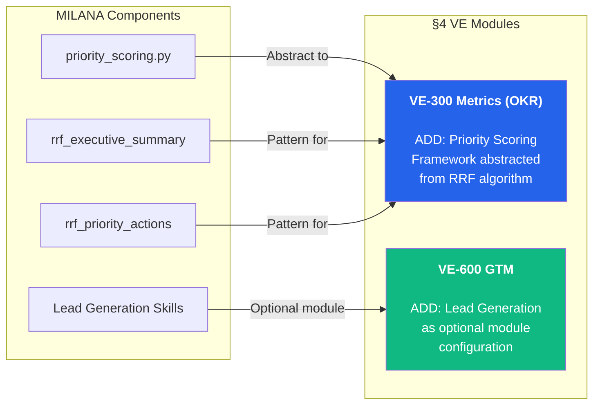
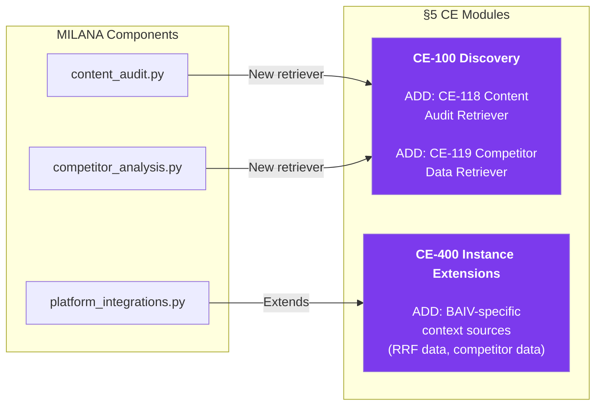
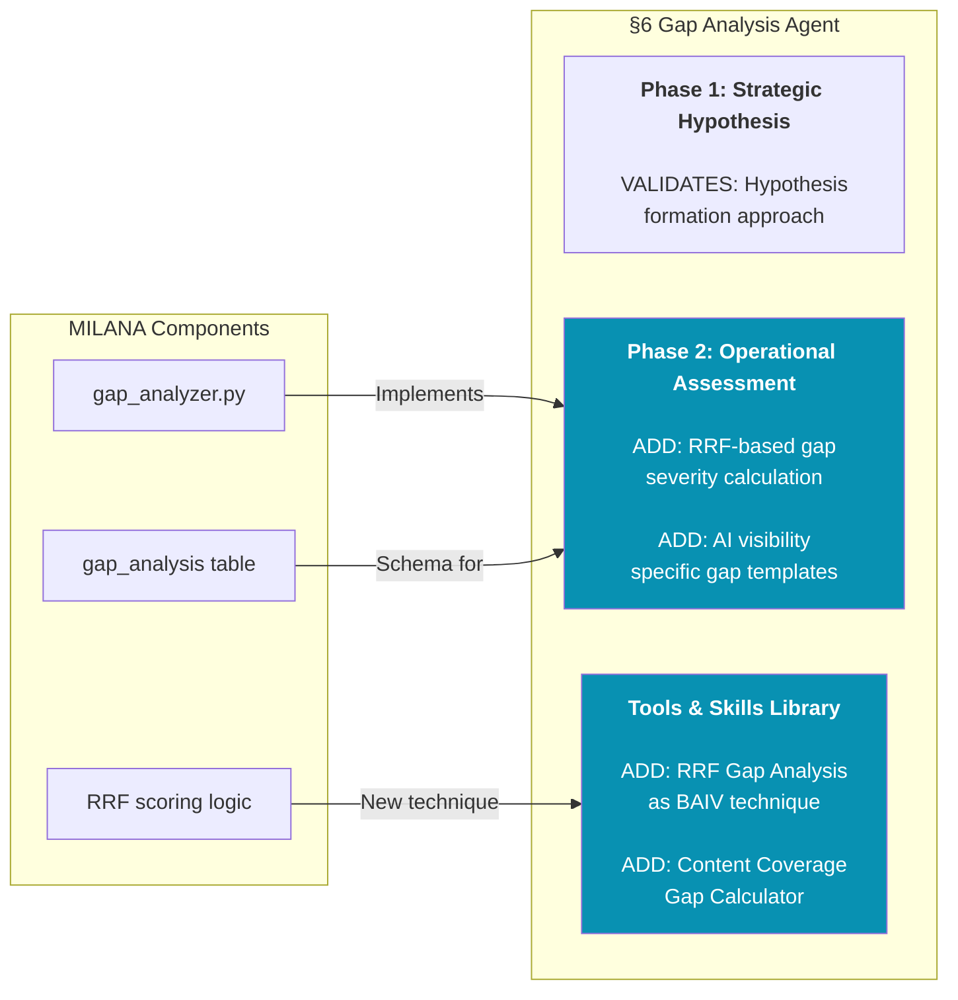
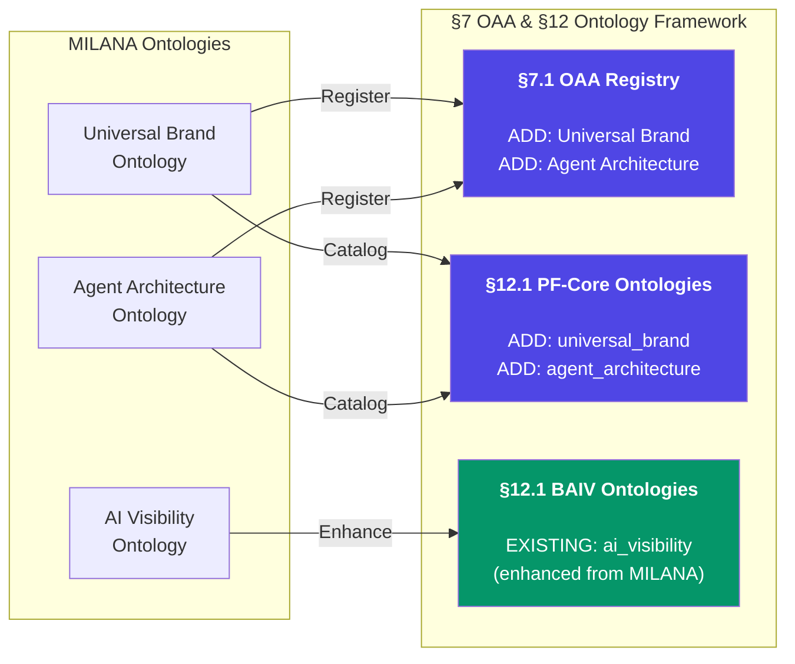
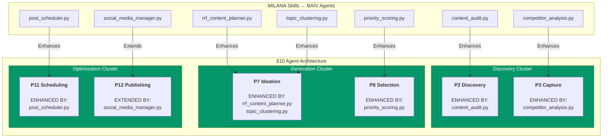
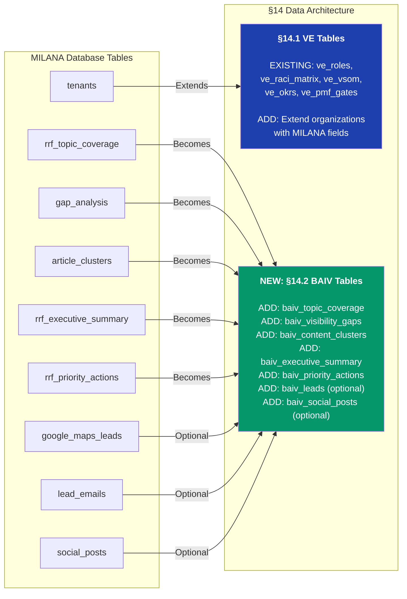
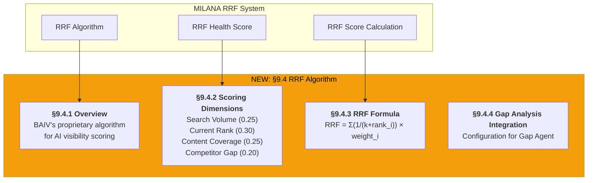
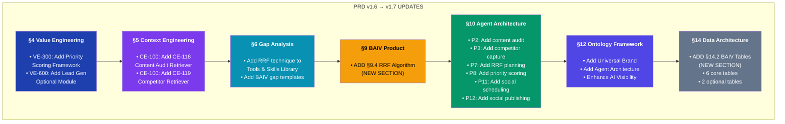

# MILANA Components Integration Mapping
## Mapping to BAIV PRD v1.6 Sections

**Version:** 1.1.0  
**Date:** December 2025  
**Status:** DRAFT - For Collaborative Review  
**Purpose:** Map MILANA components to specific BAIV PRD v1.6 sections

---

## 1. Executive Summary

This document maps MILANA's AI Visibility Platform components directly to the BAIV PRD v1.6 structure, identifying where each MILANA component integrates with specific PRD sections.

---

## 2. Complete MILANA to BAIV PRD Mapping Diagram

```mermaid
flowchart TB
    subgraph MILANA["MILANA PLATFORM COMPONENTS"]
        direction TB
        
        subgraph M_ONT["ONTOLOGIES"]
            M_UBO["Universal Brand<br/>Ontology"]
            M_AIVO["AI Visibility<br/>Ontology"]
            M_AAO["Agent Architecture<br/>Ontology"]
        end
        
        subgraph M_SKILLS["SKILLS"]
            subgraph M_DISC["Discovery Skills"]
                M_GAP["gap_analyzer.py"]
                M_AUDIT["content_audit.py"]
                M_COMP["competitor_analysis.py"]
            end
            
            subgraph M_STRAT["Strategy Skills"]
                M_RRF["rrf_content_planner.py"]
                M_TOPIC["topic_clustering.py"]
                M_PRIOR["priority_scoring.py"]
            end
            
            subgraph M_LEAD["Lead Skills"]
                M_GMAP["google_maps_leads.py"]
                M_HUNT["hunter_email_finder.py"]
                M_LINK["linkedin_leads.py"]
            end
            
            subgraph M_SOC["Social Skills"]
                M_SOCMGR["social_media_manager.py"]
                M_SCHED["post_scheduler.py"]
            end
        end
        
        subgraph M_SCHEMA["DATABASE SCHEMA"]
            M_TENANT["tenants"]
            M_RRFTC["rrf_topic_coverage"]
            M_GAPDB["gap_analysis"]
            M_CLUSTER["article_clusters"]
            M_EXEC["rrf_executive_summary"]
            M_ACTIONS["rrf_priority_actions"]
            M_LEADS["google_maps_leads"]
        end
    end

    subgraph BAIV_PRD["BAIV PRD v1.6 SECTIONS"]
        direction TB
        
        subgraph SEC4["§4 VALUE ENGINEERING"]
            VE100["VE-100 Governance<br/>(RRR)"]
            VE200["VE-200 Strategy<br/>(VSOM)"]
            VE300["VE-300 Metrics<br/>(OKR)"]
            VE400["VE-400 Value Prop"]
            VE500["VE-500 PMF Valid."]
            VE600["VE-600 GTM"]
        end
        
        subgraph SEC5["§5 CONTEXT ENGINEERING"]
            CE100["CE-100 Discovery"]
            CE200["CE-200 Assembly"]
            CE400["CE-400 Instance Ext."]
        end
        
        subgraph SEC6["§6 GAP ANALYSIS AGENT"]
            GAP_P1["Phase 1: Strategic<br/>Hypothesis"]
            GAP_P2["Phase 2: Operational<br/>Assessment"]
            GAP_TOOLS["Tools & Skills<br/>Library"]
        end
        
        subgraph SEC7["§7 OAA"]
            OAA_REG["Registry"]
            OAA_VAL["Validator"]
        end
        
        subgraph SEC9["§9 BAIV PRODUCT"]
            BAIV_PROB["Problem Statement"]
            BAIV_VP["Value Proposition"]
            BAIV_FLOW["Process Flow"]
        end
        
        subgraph SEC10["§10 AGENT ARCHITECTURE"]
            subgraph DISC_CLUSTER["Discovery Cluster"]
                P1["P1 Configuration"]
                P2["P2 Discovery"]
                P3["P3 Capture"]
            end
            
            subgraph GEN_CLUSTER["Generation Cluster"]
                P7["P7 Ideation"]
                P8["P8 Selection"]
                P9["P9 Creation"]
            end
            
            subgraph OPT_CLUSTER["Optimization Cluster"]
                P10["P10 Optimization"]
                P11["P11 Scheduling"]
                P12["P12 Publishing"]
                P13["P13 Re-audit"]
                P14["P14 Predictive"]
            end
        end
        
        subgraph SEC12["§12 ONTOLOGY FRAMEWORK"]
            ONT_CORE["PF-Core Ontologies"]
            ONT_BAIV["BAIV Ontologies"]
        end
        
        subgraph SEC14["§14 DATA ARCHITECTURE"]
            DB_VE["VE Tables"]
            DB_BAIV["BAIV Tables"]
        end
        
        subgraph SEC17["§17 SUCCESS METRICS"]
            METRICS["Platform &<br/>BAIV Metrics"]
        end
    end

    %% ONTOLOGY MAPPINGS
    M_UBO -->|"Register in"| OAA_REG
    M_UBO -->|"Add to"| ONT_CORE
    M_AIVO -->|"Register in"| OAA_REG
    M_AIVO -->|"Add to"| ONT_BAIV
    M_AAO -->|"Register in"| OAA_REG
    M_AAO -->|"Add to"| ONT_CORE

    %% DISCOVERY SKILLS MAPPINGS
    M_GAP -->|"Implements"| GAP_P2
    M_GAP -->|"Configures"| GAP_TOOLS
    M_AUDIT -->|"Powers"| P2
    M_COMP -->|"Powers"| P3

    %% STRATEGY SKILLS MAPPINGS
    M_RRF -->|"New Section"| BAIV_FLOW
    M_RRF -->|"Powers"| P7
    M_RRF -->|"Powers"| P8
    M_TOPIC -->|"Powers"| P7
    M_PRIOR -->|"Extends"| VE300
    M_PRIOR -->|"Powers"| P8

    %% LEAD SKILLS MAPPINGS
    M_GMAP -->|"Optional Module"| VE600
    M_HUNT -->|"Optional Module"| VE600
    M_LINK -->|"Optional Module"| VE600

    %% SOCIAL SKILLS MAPPINGS
    M_SOCMGR -->|"Extends"| P12
    M_SCHED -->|"Powers"| P11

    %% DATABASE MAPPINGS
    M_TENANT -->|"Extends"| DB_VE
    M_RRFTC -->|"New table"| DB_BAIV
    M_GAPDB -->|"Pattern for"| GAP_P2
    M_GAPDB -->|"New table"| DB_BAIV
    M_CLUSTER -->|"New table"| DB_BAIV
    M_EXEC -->|"Pattern for"| METRICS
    M_EXEC -->|"New table"| DB_BAIV
    M_ACTIONS -->|"New table"| DB_BAIV
    M_LEADS -->|"Optional table"| DB_BAIV

    style MILANA fill:#0891b2,color:#fff
    style BAIV_PRD fill:#1e40af,color:#fff
    style SEC4 fill:#1e3a8a,color:#fff
    style SEC5 fill:#7c3aed,color:#fff
    style SEC6 fill:#0891b2,color:#fff
    style SEC7 fill:#4f46e5,color:#fff
    style SEC10 fill:#059669,color:#fff
    style SEC12 fill:#4f46e5,color:#fff
    style SEC14 fill:#64748b,color:#fff
```

---

## 3. Detailed Section-by-Section Mapping

### 3.1 Mapping to §4 Value Engineering

**Specific Additions:**

| MILANA Component | PRD Section | Addition Type |
|------------------|-------------|---------------|
| `priority_scoring.py` | §4.4 VE-300 Metrics | Add Priority Scoring Framework subsection |
| `rrf_executive_summary` | §4.4 VE-300 Metrics | Add Executive Summary Pattern |
| `rrf_priority_actions` | §4.4 VE-300 Metrics | Add Priority Actions Pattern |
| Lead Generation Skills | §4.6 VE-600 GTM | Add Optional Lead Generation Module config |

---

### 3.2 Mapping to §5 Context Engineering

**Specific Additions:**

| MILANA Component | PRD Section | Addition Type |
|------------------|-------------|---------------|
| `content_audit.py` | §5.3 CE-100 Retrievers | Add CE-118 Content Audit Retriever |
| `competitor_analysis.py` | §5.3 CE-100 Retrievers | Add CE-119 Competitor Data Retriever |
| `platform_integrations.py` | §5.4 CE-400 | Add integration framework patterns |

---

### 3.3 Mapping to §6 Gap Analysis Agent

**Specific Additions:**

| MILANA Component | PRD Section | Addition Type |
|------------------|-------------|---------------|
| `gap_analyzer.py` | §6.1 Gap Analysis Overview | Validates two-phase model |
| `gap_analysis` table | §6.2 BAIV Gap Configuration | Add schema definition |
| RRF scoring logic | §6.2 BAIV Gap Configuration | Add RRF technique to library |

---

### 3.4 Mapping to §7 OAA and §12 Ontology Framework

**Specific Additions:**

| MILANA Component | PRD Section | Addition Type |
|------------------|-------------|---------------|
| Universal Brand Ontology | §12.1 OAA-Managed Ontologies | Add to pf_core_ontologies |
| Agent Architecture Ontology | §12.1 OAA-Managed Ontologies | Add to pf_core_ontologies |
| AI Visibility Ontology | §12.1 OAA-Managed Ontologies | Enhance existing baiv_ontologies entry |

---

### 3.5 Mapping to §10 Agent Architecture

**Specific Additions:**

| MILANA Component | PRD Section | Addition Type |
|------------------|-------------|---------------|
| `content_audit.py` | §10.1 P2 Discovery | Add Content Audit capability |
| `competitor_analysis.py` | §10.1 P3 Capture | Add Competitor Data Capture |
| `rrf_content_planner.py` | §10.1 P7 Ideation | Add RRF-based content planning |
| `topic_clustering.py` | §10.1 P7 Ideation | Add topic clustering algorithm |
| `priority_scoring.py` | §10.1 P8 Selection | Add RRF priority scoring |
| `post_scheduler.py` | §10.1 P11 Scheduling | Add social post scheduling |
| `social_media_manager.py` | §10.1 P12 Publishing | Add social publishing extension |

---

### 3.6 Mapping to §14 Data Architecture

**Specific Additions:**

| MILANA Table | PRD Section | New Table Name |
|--------------|-------------|----------------|
| `tenants` | §14.1 VE Tables | Extend `organizations` |
| `rrf_topic_coverage` | §14.2 BAIV Tables (NEW) | `baiv_topic_coverage` |
| `gap_analysis` | §14.2 BAIV Tables (NEW) | `baiv_visibility_gaps` |
| `article_clusters` | §14.2 BAIV Tables (NEW) | `baiv_content_clusters` |
| `rrf_executive_summary` | §14.2 BAIV Tables (NEW) | `baiv_executive_summary` |
| `rrf_priority_actions` | §14.2 BAIV Tables (NEW) | `baiv_priority_actions` |
| `google_maps_leads` | §14.2 BAIV Tables (NEW) | `baiv_leads` (optional) |
| `social_posts` | §14.2 BAIV Tables (NEW) | `baiv_social_posts` (optional) |

---

### 3.7 New Section Required: RRF Algorithm

---

## 4. Complete Mapping Summary Table

| MILANA Component | BAIV PRD Section | Integration Type | Status |
|------------------|------------------|------------------|--------|
| **ONTOLOGIES** ||||
| Universal Brand Ontology | §7 OAA, §12 Ontology | Add to PF-Core | ⬜ Review |
| AI Visibility Ontology | §12 Ontology | Enhance BAIV entry | ⬜ Review |
| Agent Architecture Ontology | §7 OAA, §12 Ontology | Add to PF-Core | ⬜ Review |
| **DISCOVERY SKILLS** ||||
| gap_analyzer.py | §6 Gap Analysis | Implements Phase 2 | ⬜ Review |
| content_audit.py | §10 P2 Discovery | Enhance agent | ⬜ Review |
| competitor_analysis.py | §10 P3 Capture | Enhance agent | ⬜ Review |
| **STRATEGY SKILLS** ||||
| rrf_content_planner.py | §9.4 RRF (NEW), §10 P7 | New section + enhance | ⬜ Review |
| topic_clustering.py | §10 P7 Ideation | Enhance agent | ⬜ Review |
| priority_scoring.py | §4 VE-300, §10 P8 | Abstract + implement | ⬜ Review |
| **LEAD SKILLS** ||||
| google_maps_leads.py | §4 VE-600 GTM | Optional module | ⬜ Review |
| hunter_email_finder.py | §4 VE-600 GTM | Optional module | ⬜ Review |
| linkedin_leads.py | §4 VE-600 GTM | Optional module | ⬜ Review |
| **SOCIAL SKILLS** ||||
| social_media_manager.py | §10 P12 Publishing | Extension | ⬜ Review |
| post_scheduler.py | §10 P11 Scheduling | Enhance agent | ⬜ Review |
| **DATABASE** ||||
| tenants | §14.1 VE Tables | Extend organizations | ⬜ Review |
| rrf_topic_coverage | §14.2 BAIV Tables (NEW) | New table | ⬜ Review |
| gap_analysis | §14.2 BAIV Tables (NEW) | New table | ⬜ Review |
| article_clusters | §14.2 BAIV Tables (NEW) | New table | ⬜ Review |
| rrf_executive_summary | §14.2 BAIV Tables (NEW) | New table | ⬜ Review |
| rrf_priority_actions | §14.2 BAIV Tables (NEW) | New table | ⬜ Review |
| google_maps_leads | §14.2 BAIV Tables (NEW) | Optional table | ⬜ Review |

---

## 5. PRD Sections Requiring Updates

Based on the mapping, here are the BAIV PRD v1.6 sections that need updates:

---

## 6. Decision Matrix for Review

### 6.1 Ontology Placement

| # | Component | Proposed PRD Section | Decision |
|---|-----------|---------------------|----------|
| 1 | Universal Brand Ontology | §12 as PF-Core | ⬜ Confirm |
| 2 | AI Visibility Ontology | §12 as BAIV | ⬜ Confirm |
| 3 | Agent Architecture Ontology | §12 as PF-Core | ⬜ Confirm |

### 6.2 Skills Integration

| # | Skill | Proposed PRD Section | Decision |
|---|-------|---------------------|----------|
| 4 | gap_analyzer | §6 Gap Analysis | ⬜ Confirm |
| 5 | content_audit | §10 P2 | ⬜ Confirm |
| 6 | competitor_analysis | §10 P3 | ⬜ Confirm |
| 7 | rrf_content_planner | §9.4 NEW + §10 P7 | ⬜ Confirm |
| 8 | topic_clustering | §10 P7 | ⬜ Confirm |
| 9 | priority_scoring | §4 VE-300 + §10 P8 | ⬜ Confirm |
| 10 | Lead skills | §4 VE-600 Optional | ⬜ Confirm |
| 11 | Social skills | §10 P11/P12 | ⬜ Confirm |

### 6.3 Database Tables

| # | Table | Proposed PRD Section | Decision |
|---|-------|---------------------|----------|
| 12 | topic_coverage | §14.2 BAIV Tables | ⬜ Confirm |
| 13 | visibility_gaps | §14.2 BAIV Tables | ⬜ Confirm |
| 14 | content_clusters | §14.2 BAIV Tables | ⬜ Confirm |
| 15 | executive_summary | §14.2 BAIV Tables | ⬜ Confirm |
| 16 | priority_actions | §14.2 BAIV Tables | ⬜ Confirm |
| 17 | leads (optional) | §14.2 BAIV Tables | ⬜ Confirm |
| 18 | social_posts (optional) | §14.2 BAIV Tables | ⬜ Confirm |

---

## 7. Next Steps

1. **Review this mapping document** - Confirm each placement
2. **Approve new sections** - §9.4 RRF Algorithm, §14.2 BAIV Tables
3. **Confirm optional modules** - Lead Gen and Social Publishing scope
4. **Create PRD v1.7** - Incorporate all approved MILANA integrations

---

**Document Version:** 1.1.0  
**Status:** For Collaborative Review  
**Maps To:** BAIV PRD v1.6  
**Next Action:** Review decision matrix and confirm placements
