# PRD: Be AI Visible (BAIV) Product Module
## PF-Instance Implementation on Platform Foundation Core

| Document Version | 1.6.0 |
|------------------|-------|
| Date | December 2025 |
| Status | DRAFT - For Review |
| Platform Layer | PF-Instance (BAIV Product) |
| Architecture | Claude Agent SDK + PF-Core Foundation |
| Ontology Compliance | Schema.org Grounded \| OAA v3.0 |

---

## Document Control

| Version | Date | Author | Changes |
|---------|------|--------|---------|
| 1.0.0 | 2025-12-07 | Platform Architecture Team | Initial restructure from v12 PRD |
| 1.1.0 | 2025-12-07 | Platform Architecture Team | Refactored Gap Analysis to PF-Core |
| 1.2.0 | 2025-12-07 | Platform Architecture Team | Two-phase gap model |
| 1.3.0 | 2025-12-07 | Platform Architecture Team | VSOM within VE; OAA as full agent |
| 1.4.0 | 2025-12-07 | Platform Architecture Team | RRR in VE; CE & Gap as separate agents |
| 1.5.0 | 2025-12-07 | Platform Architecture Team | Full VE-CE alignment (VE-100 to VE-600, CE-100 to CE-500) |
| 1.6.0 | 2025-12-07 | Platform Architecture Team | **Converted diagrams to Mermaid format** |

---

## Table of Contents

1. [Executive Summary](#1-executive-summary)
2. [Organizational Alignment Framework](#2-organizational-alignment-framework)
3. [PF-Core Architecture](#3-pf-core-architecture)
4. [Value Engineering (VE)](#4-value-engineering-ve)
5. [Context Engineering (CE)](#5-context-engineering-ce)
6. [Gap Analysis Agent](#6-gap-analysis-agent)
7. [Ontology Architect Agent (OAA)](#7-ontology-architect-agent-oaa)
8. [BAIV Instance Configuration](#8-baiv-instance-configuration)
9. [Be AI Visible Product Definition](#9-be-ai-visible-product-definition)
10. [Agent Architecture](#10-agent-architecture)
11. [PMF-Gated Agent Build Model](#11-pmf-gated-agent-build-model)
12. [Ontology Framework](#12-ontology-framework)
13. [Technical Stack](#13-technical-stack)
14. [Data Architecture](#14-data-architecture)
15. [Process Flows](#15-process-flows)
16. [Implementation Roadmap](#16-implementation-roadmap)
17. [Success Metrics](#17-success-metrics)
18. [Appendices](#18-appendices)

---

## 1. Executive Summary

### 1.1 Purpose

This PRD defines the **Be AI Visible (BAIV)** product module as a PF-Instance implementation built on Platform Foundation Core (PF-Core). BAIV delivers AI Visibility outcomes for client organizations, receiving strategic context through Value Engineering (VE) and Context Engineering (CE).

### 1.2 The Strategic Imperative

> **"How do agents know what matters?"**

Without strategic alignment, AI agents operate in isolation—technically capable but strategically blind. They can execute tasks but cannot prioritize, cannot understand business context, and cannot adapt to organizational goals.

**PF-Core solves this through two integrated systems:**

| System | Question Answered | Owner |
|--------|-------------------|-------|
| **Value Engineering (VE)** | *What is valuable and why?* | Human leadership |
| **Context Engineering (CE)** | *How do agents receive that knowledge?* | Platform automation |

### 1.3 The Core VE-CE Relationship


### 1.4 PF-Core Component Overview

```
PF-CORE FOUNDATION
│
├── VALUE ENGINEERING (VE) - Human-led strategic definition
│   ├── VE-100: Governance (RRR)     - WHO decides?
│   ├── VE-200: Strategy (VSOM)      - WHAT do we pursue?
│   ├── VE-300: Metrics (OKR)        - HOW do we measure?
│   ├── VE-400: Value Proposition    - WHAT creates value?
│   ├── VE-500: PMF Validation       - IS there market fit?
│   └── VE-600: Go-To-Market         - HOW do we scale?
│
├── CONTEXT ENGINEERING (CE) - Platform-automated delivery
│   ├── CE-100: Discovery            - Retrieve from VE
│   ├── CE-200: Assembly             - Build context packages
│   ├── CE-300: Lifecycle            - Cache and refresh
│   ├── CE-400: Instance Extensions  - Instance-specific context
│   └── CE-500: Orchestration        - Coordinate delivery
│
├── GAP ANALYSIS AGENT - PF-Wide capability
│   ├── Strategic Hypothesis Phase
│   ├── Operational Assessment Phase
│   └── Tools & Skills Library
│
├── ONTOLOGY ARCHITECT AGENT (OAA)
│   ├── Registry
│   ├── Validator
│   ├── Governor
│   └── Evolver
│
└── INFRASTRUCTURE SERVICES
    ├── Multi-Tenant Manager
    ├── Agent Manager
    └── Authentication/Authorization
```

---

## 2. Organizational Alignment Framework

### 2.1 The Strategic Cascade

The platform exists to help organizations achieve their strategic objectives. Every PF-Instance delivers outcomes that align with and contribute to the overall organizational strategy.


### 2.2 BAIV in the Client Organization Context


---

## 3. PF-Core Architecture

### 3.1 Complete Architecture Diagram


### 3.2 PF-Core Agent Relationships

```mermaid
flowchart TB
    OAA["<b>OAA</b><br/>Ontology Architect Agent<br/><br/>Governs ontologies<br/>for all agents"]

    VE_AGT["<b>VALUE ENGINEERING</b><br/><br/>• VE-100 Governance<br/>• VE-200 Strategy<br/>• VE-300 Metrics<br/>• VE-400 Value Prop<br/>• VE-500 PMF<br/>• VE-600 GTM"]

    CE_AGT["<b>CONTEXT ENGINEERING</b><br/><br/>• CE-100 Discovery<br/>• CE-200 Assembly<br/>• CE-300 Lifecycle<br/>• CE-400 Extensions<br/>• CE-500 Orchestration"]

    GAP_AGT["<b>GAP ANALYSIS</b><br/><br/>• Strategic Hypothesis<br/>• Operational Assessment<br/>• Tools & Skills Library"]

    OAA -->|"Governs"| VE_AGT
    OAA -->|"Governs"| CE_AGT
    OAA -->|"Governs"| GAP_AGT

    VE_AGT <-->|"Collaborates"| CE_AGT
    VE_AGT <-->|"Collaborates"| GAP_AGT
    CE_AGT <-->|"Collaborates"| GAP_AGT

    CE_AGT -->|"Provides context"| INSTANCES

    subgraph INSTANCES["PF-INSTANCES"]
        BAIV["BAIV<br/>Uses VE for CMO VSOM<br/>Uses CE for context<br/>Uses Gap for visibility gaps"]
        AIR["AIR<br/>Uses VE for CTO VSOM<br/>Uses CE for context<br/>Uses Gap for readiness gaps"]
        W4M["W4M<br/>Uses VE for Product VSOM<br/>Uses CE for context<br/>Uses Gap for value prop gaps"]
    end

    GAP_AGT -->|"Serves"| BAIV
    GAP_AGT -->|"Serves"| AIR
    GAP_AGT -->|"Serves"| W4M

    style OAA fill:#4f46e5,color:#fff
    style VE_AGT fill:#1e40af,color:#fff
    style CE_AGT fill:#7c3aed,color:#fff
    style GAP_AGT fill:#0891b2,color:#fff
    style INSTANCES fill:#059669,color:#fff
```



### 3.3 Core vs Instance

| Aspect | PF-Core | PF-Instance |
|--------|---------|-------------|
| **Scope** | Universal platform capabilities | Specific product/market application |
| **VE Content** | Framework and ontologies | Populated strategic context |
| **CE Content** | Retrieval architecture | Instance-specific extensions |
| **Ownership** | Platform team | Instance leadership |
| **Customization** | Parameterized, not forked | Fully customizable within framework |

---

## 4. Value Engineering (VE)

### 4.1 VE Overview

**Value Engineering** is the human-led discipline that cascades organizational purpose from vision through strategy to measurable outcomes. It answers: *Who decides? What do we pursue? How do we measure success? What products create value?*

### 4.2 VE Module Cascade

```mermaid
flowchart TB
    subgraph VE["VALUE ENGINEERING CASCADE"]
        VE100["<b>VE-100: GOVERNANCE (RRR)</b><br/><i>WHO decides?</i><br/><br/>• Roles: Named positions<br/>• RACI: Accountability matrix<br/>• RBAC: Access control<br/><br/>Impact: Clear decision rights"]
        
        VE200["<b>VE-200: STRATEGY (VSOM)</b><br/><i>WHAT do we pursue?</i><br/><br/>• Vision: Where we're going<br/>• Mission: Why we exist<br/>• Objectives: BSC perspectives<br/>• Metrics: Success definition<br/><br/>Impact: Strategic alignment"]
        
        VE300["<b>VE-300: METRICS (OKR)</b><br/><i>HOW do we measure?</i><br/><br/>• Objectives: Qualitative goals<br/>• Key Results: Quantitative measures<br/>• KPIs: Leading/lagging indicators<br/>• Health: On Track/At Risk/Off Track<br/><br/>Impact: Data-driven decisions"]
        
        VE400["<b>VE-400: VALUE PROPOSITION</b><br/><i>WHAT creates value?</i><br/><br/>• Customer Segments<br/>• Problems Solved<br/>• Solutions Offered<br/>• Win-Win Definition<br/><br/>Impact: Customer-centric products"]
        
        VE500["<b>VE-500: PMF VALIDATION</b><br/><i>IS there market fit?</i><br/><br/>• PMF Gates: Stage-gated investment<br/>• Evidence Requirements<br/>• Validation Metrics<br/><br/>Impact: Reduced waste, validated bets"]
        
        VE600["<b>VE-600: GO-TO-MARKET</b><br/><i>HOW do we scale?</i><br/><br/>• Positioning: Differentiation<br/>• Channels: Customer reach<br/>• Pricing: Value capture<br/>• Launch Strategy<br/><br/>Impact: Efficient growth"]
        
        VE100 --> VE200 --> VE300 --> VE400 --> VE500 --> VE600
    end

    style VE100 fill:#1e3a8a,color:#fff
    style VE200 fill:#1e40af,color:#fff
    style VE300 fill:#2563eb,color:#fff
    style VE400 fill:#3b82f6,color:#fff
    style VE500 fill:#f59e0b,color:#000
    style VE600 fill:#10b981,color:#fff
```



### 4.3 VE-100: Governance (RRR) Detail


### 4.4 VE-200: Strategy (VSOM) Layers

```mermaid
flowchart TB
    subgraph VSOM["VE-200: STRATEGY (VSOM)"]
        L1["<b>LAYER 1: VISION & MISSION</b><br/><br/>Vision: Where we're going<br/>Mission: Why we exist<br/>Values: What we believe<br/>Purpose: How we make a difference"]
        
        L2["<b>LAYER 2: STRATEGIC OBJECTIVES</b><br/>(Balanced Scorecard)<br/><br/>Financial • Customer • Process<br/>Learning & Growth • Stakeholder"]
        
        L3["<b>LAYER 3: OPERATIONAL STRATEGIES</b><br/><br/>Objectives: What we must achieve<br/>Initiatives: How we'll achieve them<br/>Assignments: Who will execute"]
        
        L4["<b>LAYER 4: METRICS</b><br/><br/>Success Metrics: Definition of success<br/>Leading Indicators: Predictive measures<br/>Lagging Indicators: Outcome measures"]
        
        L1 --> L2 --> L3 --> L4
    end

    style L1 fill:#1e3a8a,color:#fff
    style L2 fill:#1e40af,color:#fff
    style L3 fill:#2563eb,color:#fff
    style L4 fill:#3b82f6,color:#fff
```



### 4.5 VE Module Summary

| Module | Code | Question | Key Outputs |
|--------|------|----------|-------------|
| **Governance** | VE-100 | WHO decides? | Roles, RACI, RBAC |
| **Strategy** | VE-200 | WHAT pursue? | Vision, Mission, Objectives |
| **Metrics** | VE-300 | HOW measure? | OKRs, KPIs, Health Status |
| **Value Proposition** | VE-400 | WHAT value? | Customer, Problem, Solution, Win-Win |
| **PMF Validation** | VE-500 | IS there fit? | Gates, Evidence, Validation Metrics |
| **Go-To-Market** | VE-600 | HOW scale? | Positioning, Channels, Pricing |

---

## 5. Context Engineering (CE)

### 5.1 CE Overview

**Context Engineering** is the platform capability that makes VE outputs actionable for AI agents. It retrieves, assembles, optimizes, and delivers the right context at the right time—ensuring agents operate within strategic boundaries with appropriate authority.

### 5.2 CE Module Flow

```mermaid
flowchart LR
    subgraph SOURCES["VE OUTPUTS"]
        S1["VE-100<br/>Governance"]
        S2["VE-200<br/>Strategy"]
        S3["VE-300<br/>Metrics"]
        S4["VE-400<br/>Value Prop"]
        S5["VE-500<br/>PMF"]
        S6["VE-600<br/>GTM"]
        S7["External<br/>Sources"]
    end

    subgraph CE["CONTEXT ENGINEERING"]
        CE100["<b>CE-100: DISCOVERY</b><br/><br/>Retrievers:<br/>• CE-111: Governance<br/>• CE-112: Strategy<br/>• CE-113: Outcomes<br/>• CE-114: Products<br/>• CE-115: Validation<br/>• CE-116: Market<br/>• CE-117: External"]
        
        CE200["<b>CE-200: ASSEMBLY</b><br/><br/>• Build context packages<br/>• Optimize tokens<br/>• Prioritize content<br/>• Structure for agents"]
        
        CE300["<b>CE-300: LIFECYCLE</b><br/><br/>• Cache intelligently<br/>• Refresh as needed<br/>• Version control<br/>• Invalidate on change"]
        
        CE400["<b>CE-400: INSTANCE EXT</b><br/><br/>• BAIV-specific<br/>• AIR-specific<br/>• W4M-specific<br/>• Domain ontologies"]
        
        CE500["<b>CE-500: ORCHESTRATION</b><br/><br/>• Coordinate delivery<br/>• Enforce RBAC<br/>• Monitor usage<br/>• Audit access"]
        
        CE100 --> CE200 --> CE300 --> CE400 --> CE500
    end

    subgraph OUTPUT["AGENT CONTEXT"]
        PKG["<b>CONTEXT PACKAGE</b><br/><br/>• Strategic direction<br/>• Authority boundaries<br/>• Success metrics<br/>• Product specs<br/>• Validation status<br/>• Market positioning"]
    end

    S1 & S2 & S3 & S4 & S5 & S6 & S7 --> CE100
    CE500 --> PKG

    style SOURCES fill:#1e40af,color:#fff
    style CE fill:#7c3aed,color:#fff
    style PKG fill:#059669,color:#fff
```



### 5.3 CE-100 Retrievers


### 5.4 CE Module Summary

| Module | Code | Function | Agent Benefit |
|--------|------|----------|---------------|
| **Discovery** | CE-100 | Retrieves context from VE modules | Access to strategic knowledge |
| **Assembly** | CE-200 | Builds optimized context packages | Efficient token usage |
| **Lifecycle** | CE-300 | Caches and refreshes context | Consistent, current information |
| **Instance Extensions** | CE-400 | Adds instance-specific context | Domain-relevant information |
| **Orchestration** | CE-500 | Coordinates delivery, enforces RBAC | Appropriate access control |

---

## 6. Gap Analysis Agent

### 6.1 PF-Wide Capability

The Gap Analysis Agent is a **platform-wide capability** that serves all PF-Core modules and PF-Instances. It is NOT specific to Value Engineering—it provides gap analysis services to VE, CE, OAA, and all product instances.

```mermaid
flowchart TB
    subgraph GAP["GAP ANALYSIS AGENT (PF-Wide)"]
        PURPOSE["<b>Purpose:</b> Identify gaps between current and desired state<br/><b>Scope:</b> Serves VE, CE, OAA, BAIV, AIR, W4M, all future instances<br/><b>Transferability:</b> Best-of-class techniques across all domains"]
        
        subgraph PHASES["TWO-PHASE MODEL"]
            P1["<b>PHASE 1: Strategic Hypothesis</b><br/>(Pre-Discovery)<br/><br/>• Limited data available<br/>• Form testable hypotheses<br/>• Define evidence requirements<br/>• Scope discovery activities<br/><br/>Output: Discovery Scope"]
            
            P2["<b>PHASE 2: Operational Assessment</b><br/>(Post-Discovery)<br/><br/>• Rich evidence available<br/>• Validate/invalidate hypotheses<br/>• Calculate gap severity<br/>• Generate opportunities<br/><br/>Output: Roadmap"]
            
            P1 -->|"Discovery<br/>Execution"| P2
        end
        
        subgraph TOOLS["TOOLS & SKILLS LIBRARY"]
            QUANT["<b>Quantitative</b><br/>• Quantitative Gap<br/>• Benchmark<br/>• Competitive Pos."]
            QUAL["<b>Qualitative</b><br/>• SWOT-Derived<br/>• Maturity Model<br/>• Jobs-to-be-Done"]
            ROOT["<b>Root Cause</b><br/>• Fishbone<br/>• 5-Why<br/>• Pareto"]
        end
        
        SELECTOR["<b>Technique Selector</b><br/>Chooses best technique based on:<br/>Domain • Data availability • Phase • Instance config"]
    end

    subgraph CONSUMERS["CONSUMERS"]
        VE_C["VE: Strategy gaps"]
        CE_C["CE: Context coverage gaps"]
        OAA_C["OAA: Ontology gaps"]
        BAIV_C["BAIV: AI visibility gaps"]
        AIR_C["AIR: AI readiness gaps"]
        W4M_C["W4M: Value prop gaps"]
    end

    GAP --> VE_C & CE_C & OAA_C & BAIV_C & AIR_C & W4M_C

    style GAP fill:#0891b2,color:#fff
    style P1 fill:#0e7490,color:#fff
    style P2 fill:#06b6d4,color:#fff
    style TOOLS fill:#22d3ee,color:#000
```



### 6.2 BAIV Gap Configuration

BAIV **configures** the PF-Wide Gap Analysis Agent with domain-specific settings:

```yaml
baiv_gap_configuration:
  instance: "BAIV"
  domain: "marketing"
  subdomain: "ai_visibility"
  
  dimensions:
    enabled:
      - ai_visibility: 0.30
      - content_quality: 0.25
      - technical_optimization: 0.15
      - competitive_positioning: 0.15
      - discovery_channels: 0.10
      - authority_building: 0.05
      
  gap_templates:
    - citation_gap: "AI platform citation rate vs target"
    - content_format_gap: "AI-friendly content coverage"
    - schema_markup_gap: "Schema implementation completeness"
    - competitor_citation_gap: "Relative citation share"
    
  technique_preferences:
    strategic_phase: "benchmark_analysis"
    operational_phase: "competitive_positioning"
```

---

## 7. Ontology Architect Agent (OAA)

### 7.1 OAA Overview

The **Ontology Architect Agent (OAA)** governs all knowledge structures across the platform.

```mermaid
flowchart TB
    subgraph OAA["ONTOLOGY ARCHITECT AGENT (OAA)"]
        PURPOSE["<b>Purpose:</b> Govern knowledge structures enabling semantic AI reasoning<br/><b>Scope:</b> All ontologies across PF-Core and PF-Instances"]
        
        subgraph FUNCTIONS["OAA FUNCTIONS"]
            REG["<b>REGISTRY</b><br/><br/>• Versioning<br/>• Storage<br/>• Discovery<br/>• Catalog<br/>• Dependencies"]
            
            VAL["<b>VALIDATOR</b><br/><br/>• Schema.org compliance<br/>• JSON-LD validity<br/>• Integrity checks<br/>• Consistency<br/>• Competency testing"]
            
            GOV["<b>GOVERNOR</b><br/><br/>• Approval workflows<br/>• Lifecycle states<br/>• Access control<br/>• Change tracking"]
            
            EVO["<b>EVOLVER</b><br/><br/>• Migration<br/>• Extension<br/>• Deprecation<br/>• Refactoring<br/>• Backward compat."]
        end
        
        LIFECYCLE["<b>Lifecycle States:</b> Draft → Review → Active → Deprecated → Archived"]
    end

    REG --> VAL --> GOV --> EVO

    style OAA fill:#4f46e5,color:#fff
    style REG fill:#6366f1,color:#fff
    style VAL fill:#6366f1,color:#fff
    style GOV fill:#6366f1,color:#fff
    style EVO fill:#6366f1,color:#fff
```



---

## 8. BAIV Instance Configuration

### 8.1 What BAIV Receives from PF-Core

| PF-Core Capability | How BAIV Uses It |
|-------------------|------------------|
| **VE-100 Governance** | Defines BAIV user roles, RACI for workflows, RBAC permissions |
| **VE-200 Strategy** | CMO's AI visibility VSOM (vision, objectives, metrics) |
| **VE-300 Metrics** | OKRs and KPIs for AI visibility improvement |
| **VE-400 Value Prop** | BAIV's customer segments, problems solved, win-win |
| **VE-500 PMF Valid.** | BAIV's current PMF gate status, evidence requirements |
| **VE-600 GTM** | BAIV positioning, pricing tiers, channels |
| **CE-100 to CE-500** | Context package delivered to BAIV agents |
| **Gap Analysis** | Configured with AI visibility dimensions and templates |
| **OAA** | Governance for BAIV ontologies (AI Visibility, Universal Brand) |

### 8.2 What BAIV Owns

| Component | Description |
|-----------|-------------|
| **Discovery Agents (P1-P3)** | BAIV-specific discovery for AI visibility |
| **Generation Agents (P7-P9)** | Content creation for gap closure |
| **Optimization Agents (P10-P14)** | Publishing, monitoring, prediction |
| **Orchestrator (P0)** | BAIV workflow coordination |
| **Gap Configuration** | AI visibility dimensions, weights, templates |
| **Domain Ontologies** | AI Visibility, Universal Brand, CMO OKR (extensions) |
| **CE-400 Extensions** | BAIV-specific context additions |

---

## 9. Be AI Visible Product Definition

### 9.1 Problem Statement

**78% of businesses with excellent products remain invisible to AI platforms.**

AI platforms (ChatGPT, Claude, Perplexity, Gemini) are becoming primary discovery channels. Organizations face gaps in AI visibility that impact their ability to be found, cited, and recommended.

### 9.2 Value Proposition (VE-400)

```yaml
baiv_value_proposition:
  customer_segments:
    primary: "CMO / VP Marketing at mid-market companies"
    secondary: "Marketing agencies serving multiple clients"
    
  problems_solved:
    - "Invisible to AI platforms despite quality content"
    - "No visibility into AI citation performance"
    - "Manual, time-consuming optimization processes"
    - "Lack of AI-specific content strategy"
    
  solution:
    - "Automated AI visibility auditing and gap analysis"
    - "AI-optimized content generation"
    - "Continuous monitoring and optimization"
    - "Performance tracking and reporting"
    
  win_win:
    customer_wins: "60%+ AI visibility improvement in 90 days"
    platform_wins: "$199-$2,499/month recurring revenue"
```

### 9.3 BAIV Process Flow (VE-CE Aligned)


---

## 10. Agent Architecture

### 10.1 Agent Distribution


---

## 11. PMF-Gated Agent Build Model

### 11.1 Core Principle

> **"Validate before you build. No agent development proceeds without explicit PMF gate authorization."**

### 11.2 PMF-Gated Build Flow


### 11.3 PMF Gate Requirements

| Gate | Requirement | What's Authorized |
|------|-------------|-------------------|
| **Gate 3** | MVP defined, PRD approved | PBS creation begins |
| **Gate 4** | 10+ alpha users, 70% journey completion | Agent SDK development |
| **Gate 5** | 50+ beta, Sean Ellis ≥30% | Agent beta deployment |
| **Gate 6** | 100 paying customers, PMF certified | Full scale + GTM execution |

### 11.4 BAIV Current Status

```yaml
baiv_pmf_status:
  current_gate: "PMF-5"
  status: "Beta Validated"
  evidence:
    beta_users: 62
    sean_ellis_score: "35%"
    engagement_rate: "78%"
  next_gate: "PMF-6"
  requirements:
    - "100 paying customers"
    - "PMF certification complete"
  authorized_activities:
    - "Agent SDK development"
    - "Beta deployment"
    - "Performance optimization"
  not_yet_authorized:
    - "Full production scale"
    - "GTM execution"
```

---

## 12. Ontology Framework

### 12.1 OAA-Managed Ontologies

```yaml
oaa_catalog:
  pf_core_ontologies:
    - organization: "schema.org/Organization base"
    - vsom: "VE-200 strategy framework"
    - okr: "VE-300 metrics framework"
    - gap_analysis: "Transferable gap framework"
    - raci: "VE-100 accountability framework"
    
  baiv_ontologies:
    - ai_visibility: "v1.1 - AI platform citation patterns"
    - universal_brand: "v1.0 - Brand identity and discovery"
    - customer_organization: "v1.0 - Client profiling"
    - cmo_okr: "v3.0.0 - Extends VE-300 for marketing"
```

---

## 13. Technical Stack

```yaml
infrastructure:
  hosting: "Digital Ocean App Platform"
  database: "Supabase (PostgreSQL)"
  storage: "Supabase Storage"

backend:
  runtime: "Python 3.11+"
  framework: "FastAPI"
  agent_sdk: "Claude Agent SDK"

frontend:
  framework: "Next.js 14+"
  ui_library: "shadcn/ui"
  design_pipeline: "Figma Make"

ai_services:
  primary: "Claude API"
  analysis: "InfraNodus"
```

---

## 14. Data Architecture

### 14.1 VE Tables

```sql
-- VE-100: Governance
CREATE TABLE ve_roles (
    id UUID PRIMARY KEY,
    tenant_id UUID NOT NULL,
    role_code TEXT NOT NULL,
    role_name TEXT NOT NULL,
    responsibilities JSONB DEFAULT '[]',
    created_at TIMESTAMPTZ DEFAULT now()
);

CREATE TABLE ve_raci_matrix (
    id UUID PRIMARY KEY,
    tenant_id UUID NOT NULL,
    activity TEXT NOT NULL,
    role_assignments JSONB NOT NULL,  -- {role_code: 'R'|'A'|'C'|'I'}
    created_at TIMESTAMPTZ DEFAULT now()
);

-- VE-200: Strategy (VSOM)
CREATE TABLE ve_vsom (
    id UUID PRIMARY KEY,
    tenant_id UUID NOT NULL,
    function_code TEXT NOT NULL,  -- 'marketing', 'finance', etc.
    vision JSONB NOT NULL,
    mission JSONB NOT NULL,
    strategic_objectives JSONB DEFAULT '[]',
    metrics JSONB DEFAULT '[]',
    created_at TIMESTAMPTZ DEFAULT now()
);

-- VE-300: Metrics (OKR)
CREATE TABLE ve_okrs (
    id UUID PRIMARY KEY,
    tenant_id UUID NOT NULL,
    vsom_id UUID REFERENCES ve_vsom(id),
    objective TEXT NOT NULL,
    key_results JSONB DEFAULT '[]',
    owner_role TEXT NOT NULL,
    health_status TEXT DEFAULT 'on_track',
    created_at TIMESTAMPTZ DEFAULT now()
);

-- VE-500: PMF Validation
CREATE TABLE ve_pmf_gates (
    id UUID PRIMARY KEY,
    tenant_id UUID NOT NULL,
    instance_code TEXT NOT NULL,
    current_gate TEXT NOT NULL,
    evidence JSONB DEFAULT '{}',
    gate_requirements JSONB DEFAULT '{}',
    authorized_activities JSONB DEFAULT '[]',
    created_at TIMESTAMPTZ DEFAULT now()
);
```

---

## 15. Process Flows

*See Section 9.3 for complete BAIV process flow aligned with VE-CE.*

---

## 16. Implementation Roadmap

| Phase | Weeks | VE Modules | CE Modules | Gap Analysis | BAIV Agents |
|-------|-------|------------|------------|--------------|-------------|
| **1** | 1-4 | VE-100, VE-200 | CE-100, CE-200 | Phase 1 | P0, P1 |
| **2** | 5-8 | VE-300 | CE-300 | Phase 2 | P2, P3 |
| **3** | 9-12 | VE-400 | CE-400 | Tools Library | Integration |
| **4** | 13-16 | VE-500 | CE-500 | - | P7, P8, P9 |
| **5** | 17-20 | VE-600 | - | - | P10-P14 |
| **6** | 21-24 | Refinement | Refinement | Refinement | Polish |

---

## 17. Success Metrics

### 17.1 Platform Metrics (Quantified Benefits)

| Metric | Without VE-CE | With VE-CE | Impact |
|--------|---------------|------------|--------|
| Agent strategic alignment | Manual briefing | Automated delivery | 90% reduction in context prep |
| Investment validation | Gut feel | Evidence-gated | 60% reduction in failed bets |
| New venture deployment | 6-12 months | 2-4 weeks | 80% faster time-to-market |
| Agent authority conflicts | Frequent | Governed | Near-zero unauthorized actions |

### 17.2 BAIV Metrics

| Metric | Target | Timeframe |
|--------|--------|-----------|
| Gap closure rate | 60%+ | 90 days |
| AI visibility improvement | 40%+ | 30 days |
| Quick win delivery | 80%+ | <30 days |
| PMF-6 achievement | 100 paying customers | Q1 2025 |

---

## 18. Appendices

### 18.1 Module Code Reference

**Value Engineering (VE):**
- VE-100: Governance (RRR)
- VE-200: Strategy (VSOM)
- VE-300: Metrics (OKR)
- VE-400: Value Proposition
- VE-500: PMF Validation
- VE-600: Go-To-Market

**Context Engineering (CE):**
- CE-100: Discovery (CE-111 to CE-117 retrievers)
- CE-200: Assembly
- CE-300: Lifecycle
- CE-400: Instance Extensions
- CE-500: Orchestration

### 18.2 Key Documents

| Document | Purpose |
|----------|---------|
| VE-CE Executive Overview v1.0 | Strategic framework overview |
| PF-Core VE-CE Integrated Framework v1.1 | Detailed implementation |
| VE-PMF-GTM Agent Build Lifecycle v1.1 | PMF-gated development model |
| Gap Analysis Ontology v1.1 | Transferable gap framework |
| AI Visibility Ontology v1.1 | BAIV domain schema |

### 18.3 Glossary

| Term | Definition |
|------|------------|
| **VE** | Value Engineering - Human-led strategic definition |
| **CE** | Context Engineering - Platform-automated context delivery |
| **RRR** | Roles, RACI, RBAC - Governance framework |
| **VSOM** | Vision, Strategy, Objectives, Metrics |
| **OKR** | Objectives and Key Results |
| **PMF** | Product-Market Fit |
| **GTM** | Go-To-Market |
| **OAA** | Ontology Architect Agent |
| **PF-Core** | Platform Foundation Core |
| **PF-Instance** | Product implementation (BAIV, AIR, W4M) |

---

**Document Version 1.6.0**
*Diagrams converted to Mermaid format*
