# Mil3-AIVis-Agents: Comprehensive Architecture & UI/UX Guide

**Project:** BAIV Dashboard (BeAIVisible)  
**Version:** 0.1.0  
**Framework:** React 18.3 + Vite + TypeScript  
**Backend:** Supabase  
**Total Components:** 221 React Components

---

## Table of Contents

### Part 1: Architecture Deep Dive
1. [System Overview](#system-overview)
2. [Technology Stack](#technology-stack)
3. [Application Architecture](#application-architecture)
4. [Component Hierarchy](#component-hierarchy)
5. [Feature Modules](#feature-modules)
6. [Data Flow](#data-flow)
7. [Authentication Flow](#authentication-flow)
8. [API Integration](#api-integration)

### Part 2: UI/UX Documentation
9. [UI/UX Overview](#ui-ux-overview)
10. [Key Screens & User Flows](#key-screens-user-flows)
11. [Dialog & Modal System](#dialog-modal-system)
12. [Navigation Structure](#navigation-structure)
13. [Component Dependencies](#component-dependencies)

### Part 3: Technical Reference
14. [Directory Structure](#directory-structure)
15. [State Management](#state-management)
16. [Performance & Security](#performance-security)

---

# PART 1: ARCHITECTURE DEEP DIVE

## System Overview

The Mil3-AIVis-Agents (BAIV Dashboard) is an enterprise-grade AI Visibility platform designed to help businesses optimize their digital presence across AI platforms like ChatGPT, Claude, Perplexity, and Gemini. The system provides comprehensive tools for lead management, content generation, ICP (Ideal Customer Profile) discovery, and multi-channel marketing automation.

### Strategic Purpose

The platform addresses a critical business need: **AI Platform Visibility**. As AI assistants become primary information sources for decision-makers, businesses need to ensure their company appears in AI-generated responses. This dashboard provides:

1. **Visibility Auditing** - Track how often your business appears in AI platform results
2. **Content Optimization** - Generate AI-optimized content that increases citation rates
3. **Lead Generation** - Identify and engage potential customers through AI-driven discovery
4. **Multi-Channel Outreach** - Coordinate campaigns across LinkedIn, email, and social platforms

### Technical Philosophy

The architecture follows modern React best practices with a component-driven approach. Every feature is built as a self-contained module that can be independently developed, tested, and deployed. The system uses TypeScript for type safety, Radix UI for accessibility, and Supabase for backend services, creating a robust foundation that scales from startup to enterprise.

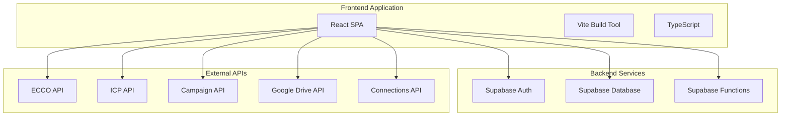

---

## Technology Stack

### UI Framework Selection

The technology stack was carefully selected to balance developer productivity, application performance, and long-term maintainability. React 18.3 serves as the core framework, chosen for its mature ecosystem, excellent TypeScript support, and widespread developer familiarity. The concurrent rendering features in React 18 enable smooth user experiences even during heavy data processing.

Vite was selected as the build tool over traditional options like Create React App or Webpack due to its lightning-fast hot module replacement (HMR) and optimized production builds. During development, changes reflect instantly in the browser, significantly improving developer velocity. The SWC compiler further accelerates TypeScript compilation, making builds up to 70x faster than traditional Babel transpilation.

### Component Library Strategy

Radix UI forms the foundation of the component library, providing 50+ unstyled, accessible primitives. This approach offers several advantages over pre-styled libraries like Material-UI or Ant Design:

1. **Accessibility by Default** - All components follow WAI-ARIA standards
2. **Full Styling Control** - Tailwind CSS can be applied without fighting against default styles
3. **Bundle Size Optimization** - Tree-shaking eliminates unused components
4. **Keyboard Navigation** - Complete keyboard support built-in
5. **Focus Management** - Proper focus trapping in modals and dialogs

Tailwind CSS handles all styling through utility classes, enabling rapid UI development without context switching between files. The combination of Radix UI's behavior and Tailwind's styling creates a powerful, maintainable design system.

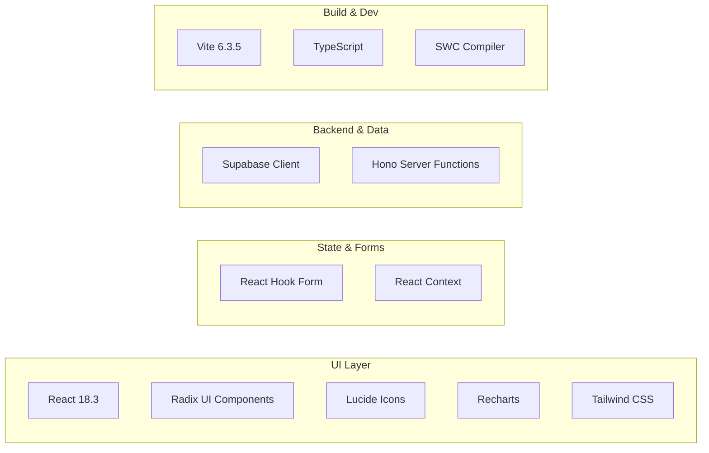

**Core Dependencies:**
- **UI Framework:** React 18.3.1, React DOM 18.3.1
- **Component Library:** Radix UI (50+ primitives: Dialog, Dropdown, Tabs, Accordion, etc.)
- **Icons:** Lucide React (1000+ icons, tree-shakeable, 24KB total)
- **Styling:** Tailwind CSS, Class Variance Authority, clsx, tailwind-merge
- **Charts & Visualization:** Recharts 2.15.2 (composed charts, responsive, animated)
- **Forms:** React Hook Form 7.55.0 (performance-focused, minimal re-renders)
- **Backend:** Supabase JS 2.49.8 (auth, database, storage, functions)
- **Server Functions:** Hono (lightweight edge runtime)
- **Build Tool:** Vite 6.3.5 with @vitejs/plugin-react-swc
- **Animations:** Motion (Framer Motion), Canvas Confetti
- **Date Handling:** React Day Picker 8.10.1
- **UI Enhancement:** Sonner (toast notifications), Vaul (drawer component)

---

## Application Architecture

### Application Initialization Flow

The application follows a carefully orchestrated initialization sequence that prioritizes authentication verification before rendering any user interface. When the browser loads the application, the entry point (`main.tsx`) immediately mounts the root `App.tsx` component, which begins the authentication check process.

The `App.tsx` component serves as the authentication gateway. On mount, it checks LocalStorage for a valid JWT token. If found, it validates the token with Supabase to ensure it hasn't expired. If the token is valid, it retrieves the user's tenant ID from the database and stores it in LocalStorage for subsequent API calls. If the token is invalid or missing, the user is immediately redirected to the login screen. This approach ensures that unauthenticated users never see protected content, even for a split second.

Once authenticated, the `AppContent` component takes over, providing the main application shell. This component manages global navigation state, determines which page to display, and handles the logout flow. The `AppLayout` component wraps the content area, providing the consistent layout structure with the left navigation sidebar and main content area.

### Component Hierarchy & Responsibility

The application uses a hierarchical component structure where each level has clearly defined responsibilities:

1. **App.tsx** - Authentication gate, session management, JWT token handling
2. **AppContent.tsx** - Navigation state, page routing, global data fetching
3. **AppLayout.tsx** - Layout structure, responsive breakpoints, content area
4. **LeftNavigation.tsx** - Menu items, section expansion, active state tracking
5. **Page Components** - Feature-specific logic, data fetching, user interactions
6. **UI Components** - Reusable presentational components, no business logic

This separation of concerns makes the codebase maintainable and testable. Business logic stays in page components, while UI components remain pure and reusable.

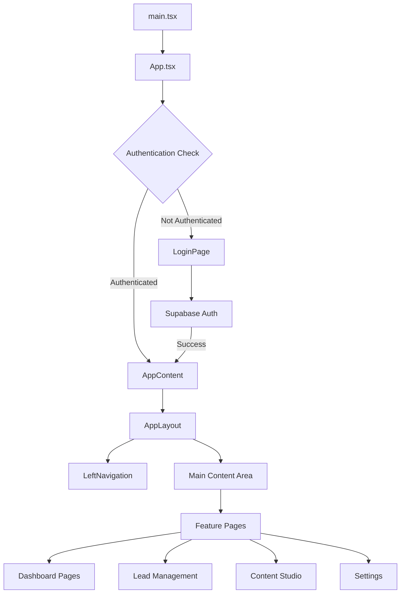

### Core Application Components

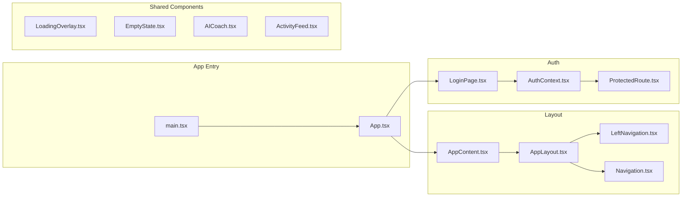

---

## Component Hierarchy

### Feature Module Organization Philosophy

The application organizes components by feature domain rather than by technical role. This "feature-first" architecture means that all components related to a specific feature live together in the same directory. For example, everything related to lead management—including dashboard, campaign list, campaign results, and all supporting components—resides in the `leads/` directory.

This approach provides several benefits. First, it makes features easy to locate and understand. A developer working on the leads feature can find all relevant code in one place without hunting through multiple directories. Second, it enables feature teams to work independently without stepping on each other's toes. Third, it makes code splitting and lazy loading straightforward—entire features can be loaded on demand.

Each feature module follows a consistent internal structure. Top-level page components handle routing and data fetching. Supporting components handle specific UI sections or behaviors. Shared utilities and types are co-located with the components that use them. This locality principle reduces coupling and increases cohesion.

### UI Component Library Architecture

The `ui/` directory contains 50+ Radix UI wrapper components that provide the foundational building blocks for the entire application. These components are not feature-specific—they're pure presentational components that can be used anywhere in the application.

Each UI component follows a consistent pattern: it accepts props for data and behavior, implements accessibility features (ARIA labels, keyboard navigation, focus management), and uses Tailwind classes for styling. These components are designed to be composed together—a Dialog component might contain a Form component that contains Input and Button components.

The UI component library provides several categories of components:

**Form Controls** - Input, Textarea, Select, Checkbox, Radio, Switch, Label, Form validation wrappers

**Navigation** - Navigation Menu, Breadcrumb, Tabs, Accordion, Menubar, Command Palette

**Overlays** - Dialog, Sheet (side panel), Drawer (bottom sheet), Popover, Tooltip, Dropdown Menu, Context Menu, Alert Dialog

**Data Display** - Table, Card, Badge, Avatar, Skeleton (loading state), Aspect Ratio container, Separator, Scroll Area

**Feedback** - Alert, Alert Dialog, Progress bar, Sonner toast notifications, Hover Card

**Layout** - Resizable panels, Collapsible sections, Carousel, Sidebar

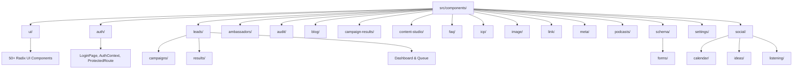

### UI Component Library Details

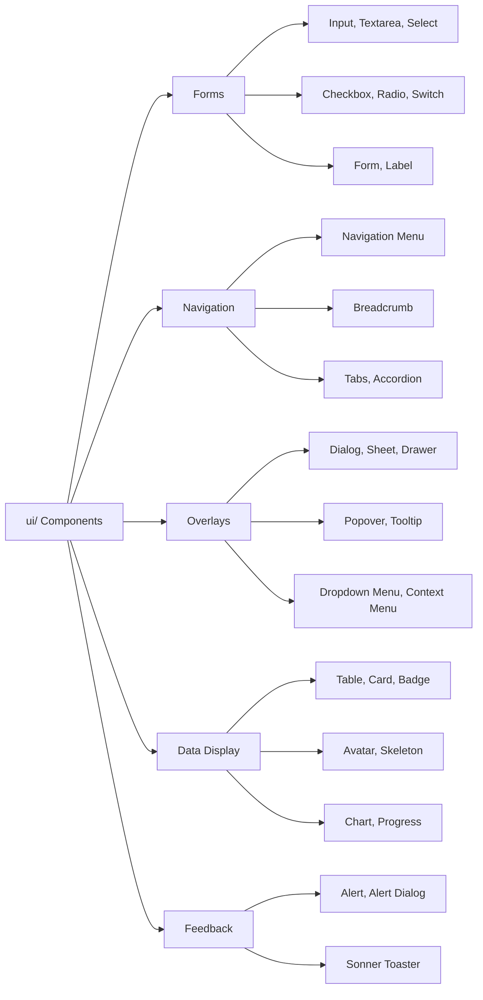

---

## Feature Modules

### 1. Authentication Module

The authentication module provides secure, token-based authentication using Supabase Auth. It implements industry-standard JWT token management with automatic refresh capabilities to maintain seamless user sessions.

When a user logs in, the system authenticates credentials with Supabase, receives a JWT access token and refresh token, and stores both in LocalStorage. The JWT token is included in all subsequent API requests via the Authorization header. The Supabase client automatically refreshes the token approximately 50 minutes after issuance, before it expires at 60 minutes. This prevents users from experiencing unexpected logouts during active sessions.

The authentication system also implements tenant isolation. Each user belongs to a tenant (organization), and the tenant ID is stored in LocalStorage after successful authentication. All API requests include this tenant ID, ensuring that users only access data belonging to their organization. This multi-tenant architecture enables the platform to serve multiple organizations from a single codebase while maintaining strict data separation.

The `AuthContext` provides authentication state to the entire application through React Context. Any component can access the current user, session, and tenant information by using the `useAuth()` hook. The `ProtectedRoute` component wraps any routes that require authentication, automatically redirecting unauthenticated users to the login page.

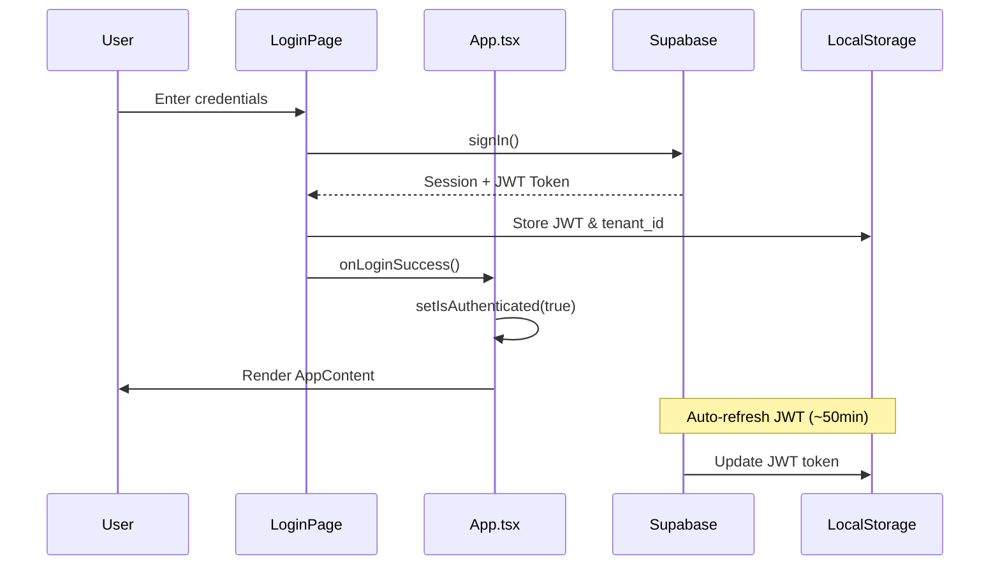

**Key Files:**
- `src/components/auth/LoginPage.tsx` - Login form UI, credential submission, error handling
- `src/components/auth/AuthContext.tsx` - Global auth state management, session tracking
- `src/components/auth/ProtectedRoute.tsx` - Route guards, redirect logic
- `src/lib/supabase.ts` - Supabase client configuration, API helpers

**Authentication Features:**
- Email/password authentication via Supabase Auth
- JWT token storage and automatic refresh
- Tenant ID association and storage
- Session validation on application mount
- Logout with complete LocalStorage cleanup
- Auth state listeners for real-time session updates
- Protected route implementation
- Role-based access control (future)

---

### 2. Leads Management Module

The leads management module is the core business feature of the platform, enabling users to discover, organize, and engage with potential customers. It provides a complete workflow from campaign creation through lead enrichment to outreach management.

The module consists of three main sections: the Leads Dashboard provides an at-a-glance view of all lead-related metrics; the Campaigns List manages all active and past lead generation campaigns; and the Campaign Results page displays detailed information about leads from a specific campaign with advanced filtering and bulk actions.

Users can create campaigns from multiple sources including Hunter.io (B2B email finder), LinkedIn Sales Navigator, Google Maps (local businesses), and custom CSV uploads. The system processes these campaigns asynchronously, fetching company and contact data, enriching email addresses, and matching leads against the user's Ideal Customer Profile (ICP) definitions.

The Smart Sync feature is a standout capability that automatically distributes leads to appropriate LinkedIn connections based on ICP category matching. For example, if a campaign includes leads from multiple healthcare specialties (orthopedics, physical therapy, chiropractic), the system intelligently routes each lead to the connection who has the most relevant expertise or territory alignment. This ensures personalized outreach at scale.

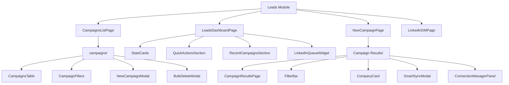

**Leads Workflow:**

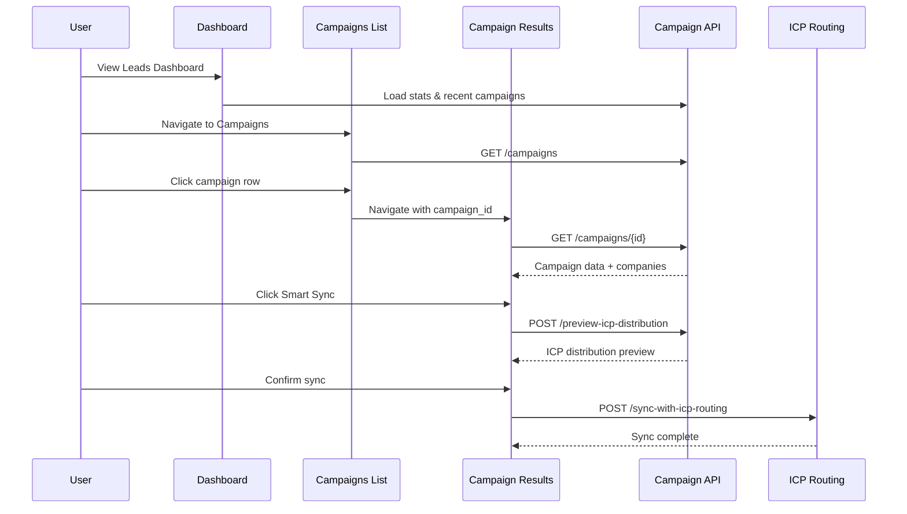

**Leads Module Features:**
- **Campaign Creation** - Multi-source lead generation (Hunter.io, LinkedIn, Google Maps, CSV)
- **Lead Dashboard** - Real-time stats, active campaign tracking, LinkedIn queue status
- **Campaign Management** - View all campaigns, filter by status/source, bulk delete
- **Campaign Results** - Company/contact cards, ICP matching scores, email enrichment status
- **Smart Sync** - Automated lead distribution to LinkedIn connections based on ICP matching
- **LinkedIn Queue** - Connection request management with rate limiting (15/week)
- **Email Enrichment** - Find and verify email addresses for contacts
- **Export Options** - CSV, Excel, Google Sheets export
- **Filtering & Search** - Multi-criteria filtering, full-text search
- **Bulk Actions** - Select multiple leads for batch operations

---

### 3. Content Studio Modules

The Content Studio suite provides AI-powered content generation tools optimized for maximum visibility on AI platforms. Each tool generates content specifically designed to increase the likelihood of being cited by ChatGPT, Claude, Perplexity, and other AI assistants.

**Blog Creator** enables users to generate comprehensive blog posts from simple briefs. Users define a topic, target audience, tone, and key points, and the AI generates a complete article with proper structure, SEO optimization, and factual accuracy. The editor includes real-time preview, markdown support, and direct publishing to WordPress or other CMS platforms.

**FAQ Generator** creates question-and-answer content that directly targets common search queries. AI assistants frequently pull answers from FAQ pages, making this tool critical for visibility. Users can generate FAQs for products, services, or entire industries, with automatic categorization and optimization.

**Image Generator** integrates with AI image generation APIs (DALL-E, Midjourney, Stable Diffusion) to create custom visuals for content. Users can generate images from text descriptions, with style controls, aspect ratio options, and iterative refinement. The gallery tracks all generated images with metadata tagging for easy retrieval.

**Link Suggester** analyzes existing content and recommends internal links to improve site structure and SEO. It also suggests authoritative external links that add credibility and context. This tool helps create the interconnected content network that AI platforms value when determining which sources to cite.

**Meta Generator** creates optimized meta titles, descriptions, and Open Graph tags for web pages. These elements are crucial for how AI platforms understand and represent content. The tool ensures metadata follows character limits, includes target keywords, and maintains consistent branding.

**Schema Generator** produces structured data markup (JSON-LD) that helps AI platforms understand content context and relationships. Schema markup for articles, products, FAQs, how-tos, and other content types increases the chances of appearing in AI-generated responses.

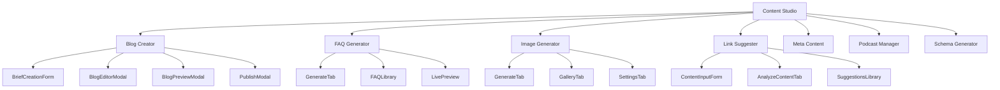

**Content Studio Features:**

**Blog Creator:**
- Brief-based generation with AI
- Rich text editor with markdown support
- Real-time preview
- SEO optimization suggestions
- Keyword density analysis
- Readability scoring
- Image placeholder insertion
- Direct CMS publishing
- Version history
- Draft management

**FAQ Generator:**
- Topic-based FAQ generation
- Question categorization
- Answer optimization for AI platforms
- FAQ schema markup generation
- Import/export functionality
- FAQ library with search
- Live preview with styling

**Image Generator:**
- Text-to-image generation
- Style presets (photorealistic, artistic, minimalist)
- Aspect ratio control
- Batch generation
- Image gallery with search
- Metadata tagging
- Download and direct upload to CMS

**Link Suggester:**
- Content analysis
- Internal link recommendations
- External authority linking
- Broken link detection
- Link context suggestions

**Meta Generator:**
- Meta title optimization (60 chars)
- Meta description optimization (160 chars)
- Open Graph tag generation
- Twitter Card generation
- Character count tracking
- Keyword inclusion verification

**Schema Generator:**
- Article schema
- Product schema
- FAQ schema
- HowTo schema
- Organization schema
- Person schema
- Event schema
- JSON-LD output

---

### 4. ICP & Discovery Module

The ICP (Ideal Customer Profile) and Discovery module helps businesses identify and categorize their perfect customers. This is critical for targeting the right leads and personalizing outreach efforts.

The ICP Discovery page enables users to define multiple customer profiles based on industry, company size, location, technologies used, and other firmographic data. Each ICP can have custom attributes, scoring criteria, and associated content themes. When new leads are added to campaigns, they're automatically scored against these ICP definitions to determine fit.

The Discovery Audit page provides comprehensive analysis of a company's current visibility across AI platforms and traditional search engines. It identifies content gaps where competitors appear but the user's company doesn't, analyzes keyword relevance, assesses platform performance (which AI platforms cite the company most frequently), and provides competitive intelligence on industry leaders.

The audit runs asynchronously, querying multiple AI platforms with industry-relevant queries, analyzing citation rates, comparing results against competitors, and generating a comprehensive report. The audit scorecard presents overall visibility score (0-100), platform-specific citation rates, content gap analysis, keyword rankings, competitive positioning, and actionable recommendations.

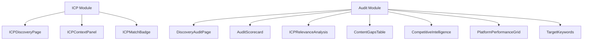

**ICP & Discovery Features:**

**ICP Discovery:**
- Define multiple customer profiles
- Firmographic criteria (industry, size, location)
- Technographic criteria (technologies used)
- Behavioral criteria (engagement patterns)
- Scoring algorithms
- Custom attributes
- ICP matching for leads
- Score visualization
- Category assignment

**Discovery Audit:**
- Multi-platform visibility scanning (ChatGPT, Claude, Perplexity, Gemini)
- Citation rate tracking
- Keyword analysis
- Content gap identification
- Competitor comparison
- Platform performance scoring
- Audit history
- Scheduled re-audits
- Export audit reports

**Audit Scorecard:**
- Overall visibility score (0-100)
- Platform-specific scores
- Trend analysis (vs. previous audits)
- Score breakdown by category
- Improvement recommendations

**Content Gaps Analysis:**
- Topics where competitors rank but you don't
- Missing content types
- Keyword opportunities
- Question/answer gaps
- Schema markup opportunities

**Competitive Intelligence:**
- Competitor visibility scores
- Citation frequency comparison
- Content strategy analysis
- Keyword overlap
- Unique positioning opportunities

---

### 5. Social Media Module

The Social Media module provides comprehensive tools for social content creation, scheduling, discovery, and analytics. It supports multiple platforms (LinkedIn, Twitter/X, Facebook, Instagram) with platform-specific optimizations.

The Post Creator enables users to generate social media posts optimized for each platform. Users can input a topic, select tone and style, choose post length, and the AI generates platform-appropriate content. The tool automatically adjusts content for character limits, suggests hashtags, recommends posting times, and can create variations for A/B testing.

The Content Discovery (Social Listening) feature monitors social media conversations relevant to the user's industry, brand, or competitors. It identifies trending topics, tracks brand mentions, discovers influencer conversations, and suggests engagement opportunities. The system uses NLP to analyze sentiment and identify high-priority interactions.

The Publishing Calendar provides a visual interface for scheduling posts across all connected social accounts. Users can drag-and-drop posts to different days/times, view scheduled content in calendar or list view, manage approval workflows for team environments, and track posting analytics.

The Ideas Library serves as a content repository where users can save post ideas, draft concepts, winning templates, and competitor content examples. It includes tagging and categorization for easy retrieval and can suggest ideas based on trending topics or past performance.

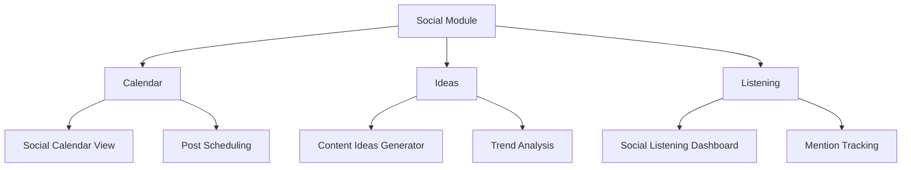

**Social Media Features:**

**Post Creator:**
- Multi-platform content generation
- Platform-specific character limits
- Hashtag suggestions
- Emoji recommendations
- Image/video attachment
- Link preview optimization
- Post variations for testing
- Optimal posting time suggestions

**Social Listening:**
- Keyword and brand monitoring
- Competitor tracking
- Industry trend identification
- Sentiment analysis
- Influencer discovery
- Engagement opportunity alerts
- Mention notifications
- Response templates

**Publishing Calendar:**
- Visual calendar interface
- Drag-and-drop scheduling
- Multi-account management
- Approval workflows
- Post preview
- Bulk scheduling
- Recurring posts
- Analytics integration

**Ideas Library:**
- Idea capture and organization
- Tagging and categorization
- Template library
- Competitor examples
- Performance tracking
- Idea suggestion engine
- Search and filtering

---

### 6. Settings Module

The Settings module provides comprehensive configuration options for personalizing the platform experience, managing team access, configuring integrations, and defining business parameters.

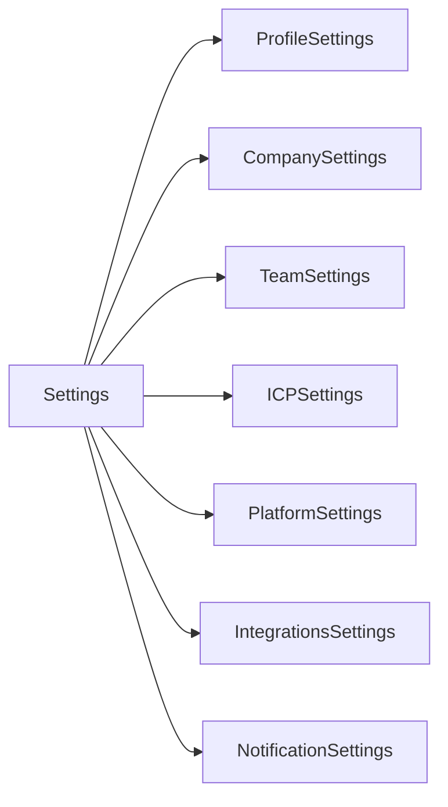

**Settings Features:**

**Profile Settings:**
- Personal information
- Avatar upload
- Email preferences
- Password change
- Two-factor authentication
- Session management
- API key generation

**Company Settings:**
- Company information
- Logo upload
- Brand colors
- Industry selection
- Company size
- Target markets
- Business goals

**Team Settings:**
- User invitations
- Role assignments (Admin, Editor, Viewer)
- Permission management
- Team member list
- Activity logs
- Seat usage tracking

**ICP Settings:**
- Define Ideal Customer Profiles
- Scoring criteria
- Custom attributes
- Industry categories
- Geographic targets
- Company size ranges

**Platform Settings:**
- AI platform preferences
- Citation tracking settings
- Audit frequency
- Competitive tracking
- Alert thresholds

**Integrations Settings:**
- Supabase connection
- API key management
- OAuth connections (LinkedIn, Google)
- Webhook configuration
- CMS integrations (WordPress, Webflow)
- CRM integrations (HubSpot, Salesforce)
- Email provider (SendGrid, Mailgun)

**Notification Settings:**
- Email notifications
- In-app notifications
- Alert preferences
- Digest scheduling
- Notification channels (email, Slack, SMS)

---

## Data Flow

### API Layer Architecture Philosophy

The API layer serves as the bridge between the React frontend and external services. It's organized into separate modules by domain (campaignAPI, icpAPI, eccoAPI, etc.), each handling a specific area of functionality. This modular approach provides several advantages:

1. **Encapsulation** - Each API module encapsulates all HTTP requests for its domain, making it easy to find and modify API calls
2. **Error Handling** - Centralized error handling ensures consistent error messages and retry logic
3. **Authentication** - JWT tokens are automatically included in request headers
4. **Type Safety** - TypeScript interfaces define request and response shapes
5. **Mock Data** - Development mode fallbacks ensure the UI works without backend services
6. **Caching** - Future caching layers can be added without changing component code

Each API module exports functions that components can call directly. For example, `campaignAPI.loadCampaignResults(campaignId)` fetches campaign data. The function handles authentication, constructs the HTTP request, processes the response, transforms data to match frontend expectations, handles errors gracefully, and returns a strongly-typed result.

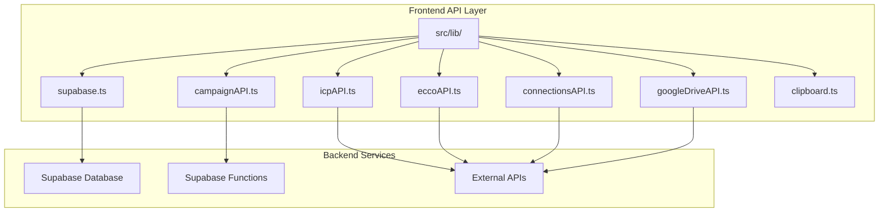

### Campaign Data Flow Example

This sequence diagram illustrates a complete data flow cycle, from user interaction through API call to backend service and back to the UI. Note how the API layer handles authentication, error scenarios, and data transformation transparently.

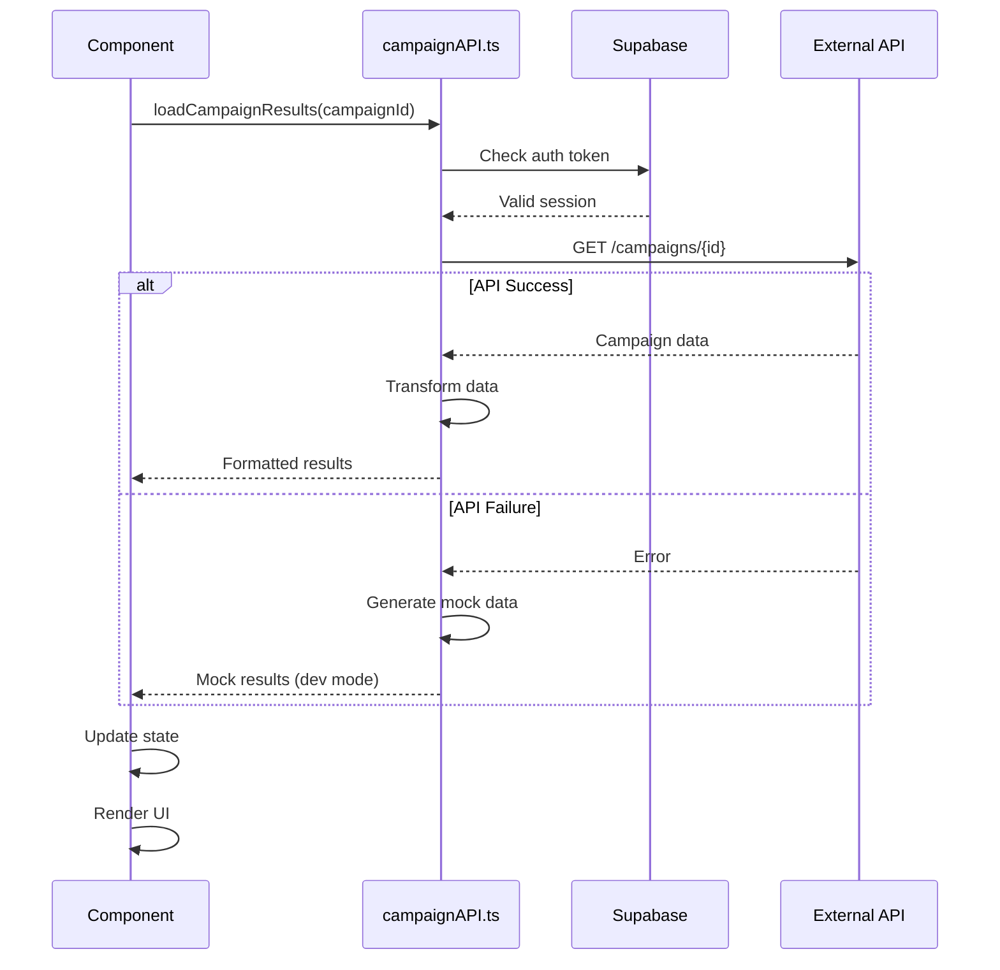

**API Layer Features:**
- Centralized HTTP client configuration
- Automatic JWT token injection
- Request/response interceptors
- Error handling and retry logic
- Loading state management
- Type-safe request/response types
- Development mode with mock data
- API endpoint versioning
- Rate limiting and throttling
- Request cancellation

---

## Authentication Flow

### JWT Token Lifecycle Management

The authentication system implements a sophisticated token lifecycle management strategy that balances security with user experience. When a user logs in, Supabase generates both an access token (JWT) and a refresh token. The access token is short-lived (60 minutes) and proves the user's identity. The refresh token is long-lived (30 days) and enables automatic token renewal.

The application stores both tokens in LocalStorage. Every API request includes the access token in the Authorization header. The Supabase client monitors token expiration and automatically uses the refresh token to obtain a new access token approximately 50 minutes after issuance, ensuring users never experience mid-session logouts.

The system also implements tenant ID association. After successful authentication, the application queries the `tenant_users` table to determine which organization the user belongs to. This tenant ID is stored in LocalStorage and included in all subsequent API requests, enabling proper multi-tenant data isolation.

### Security Considerations

Several security measures protect the authentication system:

1. **HTTPS Only** - Tokens are never transmitted over unencrypted connections
2. **HTTPOnly Cookies** - Refresh tokens could be stored in HTTPOnly cookies for enhanced security (future enhancement)
3. **Token Rotation** - Refresh tokens are rotated on each use
4. **Logout Cleanup** - All LocalStorage data is cleared on logout
5. **Session Validation** - Session validity is checked on app mount and after long idle periods
6. **Concurrent Session Detection** - Multiple devices can use the same account safely

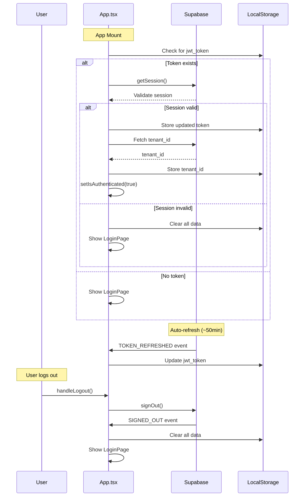

**Authentication Events:**
- `SIGNED_IN` - User successfully authenticates with credentials
- `TOKEN_REFRESHED` - Access token automatically refreshed before expiration
- `SIGNED_OUT` - User explicitly logs out or session invalidated
- `USER_UPDATED` - User profile information changed
- `PASSWORD_RECOVERY` - Password reset requested

**Token Management:**
- Access Token: 60-minute expiration, used for API authentication
- Refresh Token: 30-day expiration, used to obtain new access tokens
- Auto-refresh: Occurs at 50 minutes to prevent expiration
- Token Storage: LocalStorage (consider HTTPOnly cookies for production)
- Token Validation: Checked on mount and after idle periods

---

## API Integration

### External Service Integration Strategy

The platform integrates with numerous external services to provide comprehensive functionality. Each integration is implemented as a separate API module with consistent patterns for authentication, error handling, and data transformation.

The integration architecture follows these principles:

1. **Abstraction** - Components never call external APIs directly; they always go through API modules
2. **Resilience** - Each integration includes retry logic, timeout handling, and fallback behavior
3. **Monitoring** - Failed API calls are logged for debugging and monitoring
4. **Rate Limiting** - API modules respect rate limits and queue requests when necessary
5. **Versioning** - API modules support multiple API versions for smooth migrations

### API Service Architecture

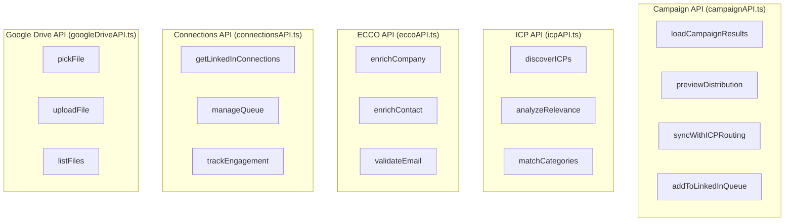

### API Request Flow

This diagram shows the complete request lifecycle, including authentication, request construction, error handling, and response processing.

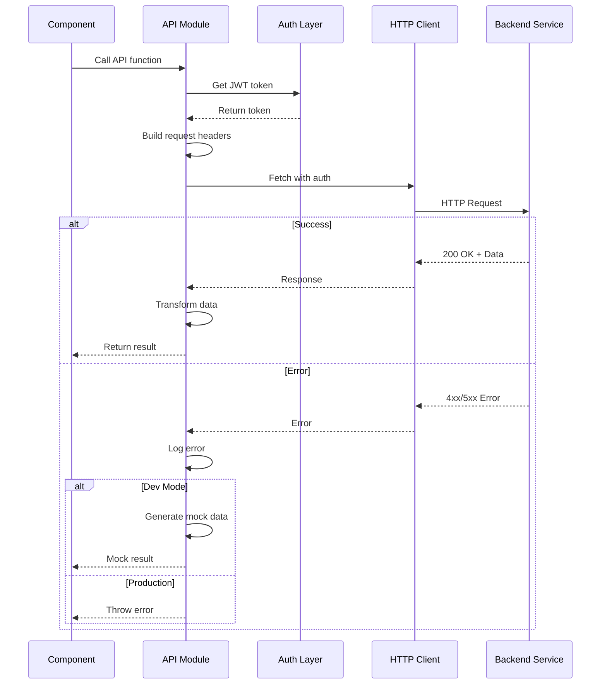

**Integrated Services:**

**Campaign Management API:**
- Lead data fetching
- Campaign CRUD operations
- ICP distribution previews
- Smart Sync routing
- LinkedIn queue management

**ICP Discovery API:**
- Customer profile matching
- Category detection
- Relevance scoring
- Firmographic analysis

**ECCO API (Enrichment):**
- Company data enrichment
- Contact information lookup
- Email validation
- Phone number verification
- Social profile discovery

**Connections API:**
- LinkedIn connection status
- Queue management
- Rate limit tracking
- Engagement analytics

**Google Drive API:**
- File picker integration
- Document upload
- Export to Google Sheets
- Folder management

---

# PART 2: UI/UX DOCUMENTATION

## UI/UX Overview

### Design System Foundation

The BAIV Dashboard implements a comprehensive design system that ensures consistency, accessibility, and visual appeal across all screens. The design system is built on several foundational principles:

**Color Palette:**
- Primary: Teal (#02a4bf) - Used for primary actions, active states, and brand elements
- Secondary: Dark gray (#231f20) - Text, headings, important UI elements
- Accent: Blue (#2990c6) - Links, informational elements
- Success: Green (#10b981) - Positive actions, success states
- Warning: Orange (#f59e0b) - Alerts, warnings
- Error: Red (#ef4444) - Errors, destructive actions
- Neutral: Gray scale (#f9fafb to #111827) - Backgrounds, borders, subtle UI elements

**Typography:**
- Headings: Poppins font family (700 weight) - Bold, modern, attention-grabbing
- Body: Open Sans (400-600 weight) - Readable, professional, web-optimized
- Code: Monospace font for technical content
- Font sizes: 12px (labels), 14px (body), 16px (emphasis), 20px (subheadings), 24px-32px (headings)

**Spacing System:**
- Base unit: 4px
- Common spacing: 8px, 12px, 16px, 24px, 32px, 48px, 64px
- Consistent application through Tailwind classes

**Border Radius:**
- Small elements (badges, tags): 4px
- Medium elements (buttons, inputs): 8px
- Large elements (cards, modals): 12px
- Full rounded (avatars): 9999px

**Shadows:**
- Subtle: 0 1px 3px rgba(0,0,0,0.1) - Default card shadow
- Medium: 0 4px 6px rgba(0,0,0,0.1) - Hovered states
- Large: 0 10px 25px rgba(0,0,0,0.1) - Modals, elevated content

**Interaction Patterns:**
- Hover states: Color shift, slight elevation, scale transform
- Active states: Subtle scale down, color darkening
- Disabled states: Reduced opacity (50%), no pointer events
- Focus states: Visible outline for accessibility
- Loading states: Skeleton screens, spinners, progress indicators

### Accessibility Standards

The platform adheres to WCAG 2.1 Level AA accessibility guidelines:

- **Keyboard Navigation** - All interactive elements accessible via keyboard
- **Focus Management** - Visible focus indicators, logical tab order, focus trapping in modals
- **ARIA Labels** - Proper labeling for screen readers
- **Color Contrast** - 4.5:1 minimum for normal text, 3:1 for large text
- **Responsive Text** - Supports browser zoom up to 200%
- **Alternative Text** - All images include descriptive alt text
- **Form Labels** - All form inputs properly labeled
- **Error Messages** - Clear, descriptive error messages associated with form fields

### Responsive Design

The platform uses a mobile-first responsive design approach with breakpoints:

- **Mobile**: 320px - 767px (single column, stacked navigation)
- **Tablet**: 768px - 1023px (two columns, collapsible sidebar)
- **Desktop**: 1024px - 1439px (full layout, persistent sidebar)
- **Large Desktop**: 1440px+ (maximum content width, optimized spacing)

Components adapt intelligently:
- Navigation collapses to hamburger menu on mobile
- Cards stack vertically on mobile, grid on desktop
- Tables become scrollable on mobile
- Modals adjust to screen size
- Forms adapt input sizes and layouts

---

## Key Screens & User Flows

### Dashboard Screen

The dashboard serves as the command center, providing at-a-glance visibility into all key metrics and quick access to common actions.

**Layout Structure:**
```
┌─────────────────────────────────────────────────────────────────┐
│ Left Navigation (256px)    │  Main Content Area               │
│                             │                                    │
│ [Logo]                      │  Page Title                       │
│                             │  "Welcome back, [User]"           │
│ Dashboard                   │                                    │
│ Visibility Audit            │  ┌─────────┬─────────┬────────┐ │
│ ICP Discovery               │  │Metric 1 │Metric 2 │Metric 3│ │
│                             │  └─────────┴─────────┴────────┘ │
│ ▼ Content Studio            │                                    │
│   Blog Creator              │  Platform Citation Chart          │
│   FAQ Generator             │  [Visualization]                  │
│   Meta Generator            │                                    │
│   Schema Generator          │  ┌──────────┬──────────────────┐ │
│   Link Suggester            │  │Activity  │ Top              │ │
│   Image Generator           │  │Feed      │ Opportunities    │ │
│                             │  └──────────┴──────────────────┘ │
│ ▼ Social Media              │                                    │
│   Post Creator              │                                    │
│   Content Discovery         │                                    │
│   Publishing Calendar       │                                    │
│   Ideas Library             │                                    │
│                             │                                    │
│ ▼ Leads                     │                                    │
│   Dashboard                 │                                    │
│   Campaigns                 │                                    │
│   New Campaign              │                                    │
│                             │                                    │
│ Settings                    │                                    │
│                             │                                    │
│ [User Profile]              │                                    │
└─────────────────────────────────────────────────────────────────┘
```

**Key UI Components:**

1. **MetricsRow Component**
   - Displays 4 key metrics in card format
   - Each card shows: icon, value, label, trend indicator
   - Color-coded based on performance (green=good, red=needs attention)
   - Hover effect reveals additional details
   - Click opens detailed view for that metric

2. **PlatformCitationChart Component**
   - Bar chart showing citation rates across AI platforms
   - X-axis: Platform names (ChatGPT, Claude, Perplexity, Gemini)
   - Y-axis: Citation percentage (0-100%)
   - Color-coded bars matching platform brand colors
   - Hover shows exact citation count and percentage
   - Interactive legend to toggle platforms

3. **ActivityFeed Component**
   - Chronological list of recent system activities
   - Each item shows: timestamp, activity type icon, description, status
   - Color-coded status indicators (green=complete, yellow=in-progress, red=failed)
   - "View all" link to full activity log
   - Auto-updates every 30 seconds

4. **TopOpportunities Component**
   - Prioritized list of actions to improve visibility
   - Each item shows: priority badge, title, estimated impact, action button
   - Priority color coding (red=high, yellow=medium, blue=low)
   - Click opens relevant tool to address opportunity
   - Dismissible items (mark as done or ignore)

**User Flows from Dashboard:**

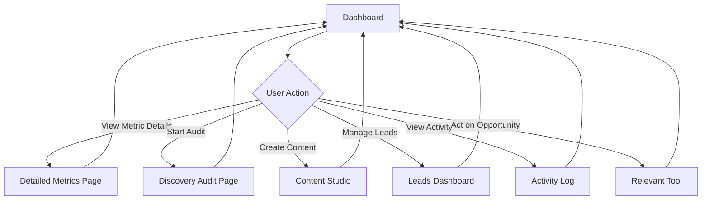

---

### Leads Dashboard Screen

The Leads Dashboard provides comprehensive lead management functionality with an emphasis on quick actions and status visibility.

**Screen Layout:**
```
┌──────────────────────────────────────────────────────────────────────┐
│ Breadcrumb: Dashboard > Leads > Dashboard                           │
│                                                                      │
│ Leads Dashboard                                    [New Campaign] [View All] │
│                                                                      │
│ ┌────────────┬────────────┬────────────┬────────────┐             │
│ │Total Leads │Active      │LinkedIn    │Email       │             │
│ │2,847       │Campaigns   │Connections │Enrichments │             │
│ │+9.5%       │12          │89 (23 pend)│456         │             │
│ └────────────┴────────────┴────────────┴────────────┘             │
│                                                                      │
│ Quick Actions                                                        │
│ ┌─────────────┬─────────────┬─────────────┬─────────────┐         │
│ │🚀 New      │📊 View      │📥 Import    │📤 Export    │         │
│ │Campaign    │Analytics    │CSV          │All Leads    │         │
│ └─────────────┴─────────────┴─────────────┴─────────────┘         │
│                                                                      │
│ Recent Campaigns                                      [View All]    │
│ ┌──────────────────────────────────────────────────────┐           │
│ │ B2B SaaS Companies - San Francisco                   │           │
│ │ Hunter.io • 247 leads • Completed • 2h ago          │           │
│ ├──────────────────────────────────────────────────────┤           │
│ │ Coffee Shops - Downtown LA                           │           │
│ │ Google Maps • 89 leads • Processing 45% • 1h ago    │           │
│ ├──────────────────────────────────────────────────────┤           │
│ │ Marketing Directors - Tech Industry                  │           │
│ │ LinkedIn • 156 leads • Completed • 5h ago           │           │
│ └──────────────────────────────────────────────────────┘           │
│                                                                      │
│ LinkedIn Connection Queue                             [Manage]      │
│ ┌─────────────────────────────────────────────────────────────┐   │
│ │ 23 in queue • 3/15 sent this week • Resets in 4 days       │   │
│ │ ┌─────────────────────────────────────────────────────────┐ │   │
│ │ │ [Avatar] John Doe • CEO at Acme Corp               [↗] │ │   │
│ │ │ [Avatar] Sarah Johnson • VP Marketing              [↗] │ │   │
│ │ │ [Avatar] Michael Chen • Product Director           [↗] │ │   │
│ │ └─────────────────────────────────────────────────────────┘ │   │
│ └─────────────────────────────────────────────────────────────┘   │
└──────────────────────────────────────────────────────────────────────┘
```

**Key Components:**

1. **StatsCards Component**
   - Four metric cards in responsive grid
   - Each card displays:
     - Large number (primary metric)
     - Label text
     - Trend indicator with percentage
     - Secondary metrics (e.g., "23 pending" under LinkedIn connections)
   - Hover reveals additional details
   - Click navigates to detailed view

2. **QuickActionsSection Component**
   - Grid of action buttons (2x2 on mobile, 4x1 on desktop)
   - Each button shows:
     - Emoji icon for visual recognition
     - Action label
     - Hover effect (scale, shadow)
   - Clicking triggers corresponding action:
     - New Campaign → Opens campaign creation modal
     - View Analytics → Navigates to analytics page
     - Import CSV → Opens file picker
     - Export All Leads → Generates CSV download

3. **RecentCampaignsSection Component**
   - List of recent campaigns (5 most recent)
   - Each campaign card shows:
     - Campaign name (bold, large)
     - Source type with icon (Hunter.io, Google Maps, LinkedIn)
     - Lead count
     - Status badge (Completed=green, Processing=yellow, Failed=red)
     - Progress bar (if processing)
     - Time ago (relative time, e.g., "2h ago")
   - Click anywhere on card → Navigate to Campaign Results page
   - "View All" link → Navigate to Campaigns List page

4. **LinkedInQueueWidget Component**
   - Compact widget showing LinkedIn connection queue status
   - Top section displays:
     - Queue count (23 in queue)
     - Weekly usage (3/15 sent this week)
     - Rate limit reset countdown
     - Progress bar showing weekly limit usage
   - Scrollable list of next 3 contacts in queue:
     - Avatar image
     - Name (bold)
     - Title and company
     - LinkedIn icon (opens profile)
   - "Manage" button → Opens full Connection Manager panel
   - Auto-updates when connections are sent

**User Flows:**

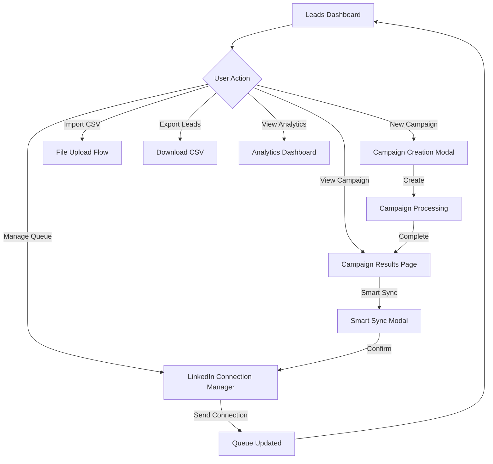

---

### Campaign Results Screen

The Campaign Results screen is the most feature-rich UI in the application, providing detailed lead information, filtering, bulk actions, and intelligent lead distribution.

**Screen Layout:**
```
┌──────────────────────────────────────────────────────────────────────────┐
│ Breadcrumb: Dashboard > Leads > Campaigns > [Campaign Name]             │
│ [← Back]                                                                 │
│                                                                          │
│ Campaign Results: B2B SaaS Companies - San Francisco                    │
│                                                                          │
│ ┌────────────┬────────────┬────────────┬────────────┐                  │
│ │Total Leads │Enriched    │ICP Match   │Email Status│                  │
│ │247         │218 (88%)   │175 (71%)   │0 pending   │[Sync Now]        │
│ └────────────┴────────────┴────────────┴────────────┘                  │
│                                                                          │
│ Viewing 247 companies, 423 contacts     [🌟Smart Sync][LinkedIn][Export]│
│                                                                          │
│ [Search...] [ICP Score ▼][Email Status ▼][Category ▼]  [Grid View ⚏⚏] │
│                                                                          │
│ ┌────────────────┬────────────────┬────────────────┐                   │
│ │☑ [Logo]       │☑ [Logo]       │☑ [Logo]       │                   │
│ │  Acme Corp    │  TechStart Inc│  Innovation   │                   │
│ │  ⭐ 85 ICP    │  ⭐ 92 ICP    │  ⭐ 78 ICP    │                   │
│ │  SaaS • SF    │  SaaS • NYC   │  AI • SF      │                   │
│ │  🏷️ Enterprise │  🏷️ SMB       │  🏷️ Startup   │                   │
│ │                │                │                │                   │
│ │  Contacts (3) │  Contacts (2) │  Contacts (4) │                   │
│ │  [Avatar] John│  [Avatar] Sara│  [Avatar] Mike│                   │
│ │  CEO          │  VP Marketing │  CTO          │                   │
│ │  📧 ✓ 📱 ✓    │  📧 ✓ 📱 -    │  📧 ✓ 📱 ✓    │                   │
│ │                │                │                │                   │
│ │  📧 Hunter.io │  📧 Hunter.io │  📧 Clearbit  │                   │
│ │  ✓ Verified   │  ✓ Verified   │  ✓ Verified   │                   │
│ │                │                │                │                   │
│ │  [Enrich]     │  [Enrich]     │  [Enrich]     │                   │
│ │  [View][Queue]│  [View][Queue]│  [View][Queue]│                   │
│ └────────────────┴────────────────┴────────────────┘                   │
│                                                                          │
│ [Load More]                                                              │
└──────────────────────────────────────────────────────────────────────────┘
```

**Key Components:**

1. **StatsBar Component**
   - Four stat cards in horizontal layout
   - Total Leads: Count of all companies in campaign
   - Enriched: Count and percentage of companies with complete data
   - ICP Match: Count and percentage of companies matching ICP criteria
   - Email Status: Enrichment status with "Sync Now" button
   - Clicking "Sync Now" triggers email enrichment for un-enriched contacts

2. **ActionBar Component**
   - Left side: "Viewing X companies, Y contacts" - Dynamic count based on filters
   - Right side: Three primary action buttons
     - **Smart Sync** (🌟): Opens Smart Sync Modal for intelligent lead distribution
     - **Add to LinkedIn Queue**: Opens Connection Manager Panel
     - **Export**: Dropdown with options (CSV, Excel, Google Sheets)

3. **FilterBar Component**
   - Search input: Full-text search across company names, domains, contact names
   - ICP Score dropdown: Filter by score ranges (90-100, 80-89, 70-79, <70, No Score)
   - Email Status dropdown: All, Verified, Unverified, Not Found, Pending
   - ICP Category dropdown: Based on defined ICPs (Enterprise, SMB, Startup, etc.)
   - View toggle: Switch between Grid View (cards) and List View (table)
   - Applied filters shown as removable tags below bar

4. **CompanyCard Component**
   - Card layout (3 columns on desktop, 2 on tablet, 1 on mobile)
   - Header section:
     - Checkbox for selection (bulk actions)
     - Company logo (with fallback to initials)
     - Company name (bold, large)
     - ICP score badge (star icon + score, color-coded)
   - Company info section:
     - Industry • Location
     - Website link with icon
   - ICP Category badge:
     - Color-coded label matching category
   - Contacts section:
     - Expandable list (shows 3 by default)
     - Each contact row:
       - Avatar (photo or initials)
       - Name and title
       - Icon indicators: 📧 (email found), 📱 (phone found), 🔗 (LinkedIn)
       - Hover reveals full contact details
   - Email provider status:
     - Provider name (Hunter.io, Clearbit, etc.)
     - Verification status (checkmark or warning icon)
   - Action buttons:
     - **Enrich**: Trigger additional data enrichment
     - **View Details**: Open modal with full company/contact details
     - **Add to Queue**: Add to LinkedIn connection queue

5. **SmartSyncModal Component** (appears when Smart Sync clicked)
   - Large modal overlay (80% screen width, 90% height)
   - Multi-step process:
     
     **Step 1: Connection Selector**
     - List of user's LinkedIn connections who are also system users
     - Each connection card shows:
       - Avatar and name
       - Connection type (1st degree, team member)
       - Assigned territory/ICP categories
       - Current queue count
     - Multi-select checkboxes
     - "Next" button (disabled until at least one connection selected)
     
     **Step 2: Distribution Preview**
     - Table showing ICP distribution:
       - Column headers: ICP Category, Lead Count, Assigned Connection, Confidence
       - Rows for each ICP category in campaign
       - Color-coded confidence indicators (green=high, yellow=medium, red=low/no match)
       - Warning for "Uncategorized" leads with recommendation to review
     - Info cards:
       - "Ready to Sync" (green): X leads with clear matches
       - "Needs Review" (orange): Y leads without clear matches
     - "Edit Distribution" link allows manual assignment overrides
     
     **Step 3: Sync Options**
     - Checkboxes for sync settings:
       - ☑ Send notification to connections about new leads
       - ☑ Automatically add to their LinkedIn queue
       - ☑ Include suggested outreach message templates
       - ☑ Track sync performance analytics
     - Notes section for additional context
     
     **Footer:**
     - "Cancel" button (closes modal)
     - "Back" button (goes to previous step)
     - "Preview" or "Confirm Sync" button (executes sync)

6. **LinkedInManagerPanel Component** (slides in from right)
   - Full-height side panel (400px wide)
   - Header:
     - Title: "LinkedIn Connection Queue"
     - Close button (X)
   - Tabs:
     - **Connection Queue**: Pending connection requests
     - **DM Queue**: Scheduled direct messages
   - Filter bar:
     - Status dropdown (All, Queued, Sent, Accepted, Declined)
     - Search input
   - Scrollable contact list:
     - Each contact card shows:
       - Avatar
       - Name (bold)
       - Title and company
       - Current status badge
       - Scheduled send date (if queued)
       - Action buttons: [View Profile] [Edit Message] [Remove]
   - Footer stats:
     - Weekly limit progress bar (e.g., "3 of 15 connections sent this week")
     - "Rate limit resets in X days"

**User Flows:**

```mermaid
graph TD
    A[Campaign Results Page] --> B{User Action}
    
    B -->|Filter Leads| C[Apply Filters]
    C --> D[Filtered View]
    D --> A
    
    B -->|Select Company| E[View Company Details]
    E --> F{Action from Details}
    F -->|Enrich| G[Email Enrichment]
    F -->|Add to Queue| H[LinkedIn Queue]
    F -->|Export| I[Download Data]
    
    B -->|Smart Sync| J[SmartSyncModal Opens]
    J --> K[Step 1: Select Connections]
    K --> L[Step 2: Review Distribution]
    L --> M[Step 3: Configure Options]
    M --> N{Confirm?}
    N -->|Yes| O[Execute Sync]
    N -->|No| A
    O --> P[Show Success Message]
    P --> A
    
    B -->|LinkedIn Queue| Q[ConnectionManagerPanel Opens]
    Q --> R{Manage Queue}
    R -->|Add Contact| S[Contact Added]
    R -->|Remove Contact| T[Contact Removed]
    R -->|Edit Message| U[Message Editor]
    S --> Q
    T --> Q
    U --> Q
    
    B -->|Export| V[Export Dropdown]
    V --> W[Select Format]
    W --> X[Generate File]
    X --> Y[Download Starts]
```

---

### Content Studio Screens

Each Content Studio tool follows a similar layout pattern with customizations for the specific content type.

**Blog Creator Layout:**
```
┌──────────────────────────────────────────────────────────────────────────┐
│ Blog Creator                                                             │
│                                                                          │
│ [Generate] [Library]                                    [Preview Toggle] │
│                                                                          │
│ ┌─────────────────────────────────────────────────────────────────────┐ │
│ │ Create Brief                                                        │ │
│ │                                                                     │ │
│ │ Topic: [____________________________________________]               │ │
│ │                                                                     │ │
│ │ Target Audience: [Industry Leaders ▼]                              │ │
│ │                                                                     │ │
│ │ Tone: [ Informative ▼]                                             │ │
│ │                                                                     │ │
│ │ Key Points to Cover:                                               │ │
│ │ [+ Add Point]                                                      │ │
│ │ • [_________________________________] [x]                           │ │
│ │ • [_________________________________] [x]                           │ │
│ │ • [_________________________________] [x]                           │ │
│ │                                                                     │ │
│ │ Target Word Count: [1500 ▼]                                        │ │
│ │                                                                     │ │
│ │ SEO Keywords: [keyword1, keyword2, keyword3]                       │ │
│ │                                                                     │ │
│ │                                            [Generate Blog Post] 🚀 │ │
│ └─────────────────────────────────────────────────────────────────────┘ │
│                                                                          │
│ OR                                                                       │
│                                                                          │
│ ┌─────────────────────────────────────────────────────────────────────┐ │
│ │ Blog Library                                                        │ │
│ │                                                                     │ │
│ │ [Search blogs...] [Filter ▼] [Sort ▼]                             │ │
│ │                                                                     │ │
│ │ ┌────────────────────────────────────────────────────────────────┐ │ │
│ │ │ How to Improve AI Platform Visibility                         │ │ │
│ │ │ Draft • 1,547 words • Created 2h ago                           │ │ │
│ │ │ [Edit] [Preview] [Publish] [Delete]                           │ │ │
│ │ ├────────────────────────────────────────────────────────────────┤ │ │
│ │ │ 10 Strategies for B2B Lead Generation                         │ │ │
│ │ │ Published • 2,103 words • 3 days ago                          │ │ │
│ │ │ [View] [Edit] [Unpublish]                                     │ │ │
│ │ └────────────────────────────────────────────────────────────────┘ │ │
│ └─────────────────────────────────────────────────────────────────────┘ │
└──────────────────────────────────────────────────────────────────────────┘
```

**When "Generate Blog Post" clicked:**

```
┌──────────────────────────────────────────────────────────────────────────┐
│ Blog Editor                                         [Save Draft] [Publish]│
│                                                                          │
│ Title: [How to Improve AI Platform Visibility]                          │
│                                                                          │
│ ┌────────────────┬───────────────────────────────────────────────────┐ │
│ │ Editor         │ Preview                                           │ │
│ │                │                                                   │ │
│ │ # Introduction │ How to Improve AI Platform Visibility            │ │
│ │                │                                                   │ │
│ │ [Rich Text     │ [Rendered HTML preview with styling]             │ │
│ │  Editor with   │                                                   │ │
│ │  toolbar:]     │ In today's digital landscape...                  │ │
│ │                │                                                   │ │
│ │ - Bold/Italic  │ ## Key Strategies                                │ │
│ │ - Headings     │                                                   │ │
│ │ - Lists        │ 1. Optimize your content...                      │ │
│ │ - Links        │ 2. Build authoritative...                        │ │
│ │ - Images       │ 3. Engage with AI...                             │ │
│ │ - Code blocks  │                                                   │ │
│ │ - Blockquotes  │                                                   │ │
│ │                │                                                   │ │
│ └────────────────┴───────────────────────────────────────────────────┘ │
│                                                                          │
│ SEO Score: 87/100 ✓                                                     │
│ Readability: 8th grade ✓                                                │
│ Word Count: 1,547                                                       │
│ Estimated Read Time: 6 minutes                                          │
└──────────────────────────────────────────────────────────────────────────┘
```

**Other Content Studio Tools:**

**FAQ Generator:**
- Similar brief creation interface
- Options for: Number of FAQs, Category tags, Answer length
- Live preview showing FAQ accordion
- Export options: JSON-LD schema, HTML, plain text

**Image Generator:**
- Text prompt input with style options
- Preset styles: Photorealistic, Artistic, Minimalist, Abstract
- Aspect ratio selector: Square, Landscape, Portrait
- Gallery view of generated images
- Batch generation (up to 4 images at once)

**Meta Generator:**
- Page URL input
- Auto-analyze existing page content
- Generate meta title (60 char limit with counter)
- Generate meta description (160 char limit with counter)
- Open Graph tags
- Twitter Card tags
- Character count indicators turn red when exceeding limits

**Schema Generator:**
- Schema type selector (Article, Product, FAQ, HowTo, Organization, Person, Event)
- Form fields based on selected type
- Live JSON-LD preview
- Validation checker
- Copy to clipboard button
- Direct WordPress/Webflow integration

---

## Dialog & Modal System

The application uses a comprehensive modal and dialog system for complex interactions, data entry, and confirmations. All modals follow consistent patterns for accessibility and user experience.

### Modal Hierarchy and Types

**1. Full-Screen Modals** (for complex workflows)
- Used for: Smart Sync, Campaign Creation, Survey Builder
- Behavior: Covers entire screen, shows close button, dark backdrop
- Escape key closes modal
- Focus trapped within modal
- Example: SmartSyncModal

**2. Standard Modals** (for forms and detailed views)
- Used for: Lead details, Blog editor, Settings
- Size: 600-800px width, variable height (max 90vh)
- Centered on screen
- Scrollable content area
- Example: BlogEditorModal, LeadDetailModal

**3. Small Modals** (for confirmations and quick actions)
- Used for: Delete confirmations, Quick edits
- Size: 400px width, auto height
- Centered on screen
- Example: BulkDeleteModal

**4. Side Panels** (for contextual information)
- Used for: LinkedIn Queue Manager, ICP Context Panel
- Slides in from right edge
- 400px width, full height
- Push or overlay mode
- Example: LinkedInManagerPanel

**5. Bottom Sheets** (mobile-optimized)
- Used for: Mobile actions, Filters
- Slides up from bottom
- Full width, variable height (30-90%)
- Drag-to-dismiss gesture
- Example: FilterDrawer (mobile)

### Common Modal Components

**Modal Structure:**
```
┌─────────────────────────────────────────────┐
│ Modal Title                            [X]  │  ← Header
├─────────────────────────────────────────────┤
│                                             │
│  [Scrollable Content Area]                  │  ← Body
│                                             │
│  Forms, tables, text, images, etc.         │
│                                             │
├─────────────────────────────────────────────┤
│ [Cancel] [Secondary Action] [Primary Action]│  ← Footer
└─────────────────────────────────────────────┘
```

**Key Modal Patterns:**

1. **Multi-Step Modals**
   - Progress indicator at top (e.g., "Step 2 of 3")
   - Back button to previous step
   - Next/Confirm button to advance
   - Cancel button always available
   - Current step highlighted
   - Example: SmartSyncModal, Campaign Creation

2. **Confirmation Dialogs**
   - Clear question or statement
   - Consequences explained
   - Destructive action uses red color
   - Cancel is default focused button
   - Example: Delete campaign confirmation

3. **Form Modals**
   - Form validation before submission
   - Error messages inline with fields
   - Required field indicators
   - Save draft option (when applicable)
   - Example: New Campaign Modal

4. **Detail View Modals**
   - Read-only information display
   - Action buttons in footer
   - Print/export options
   - Related items navigation
   - Example: Company Detail Modal

### Modal Behavior Specifications

**Opening:**
- Fade-in animation (200ms)
- Backdrop appears with fade
- Focus moves to first interactive element
- Body scroll disabled
- ESC key listener attached

**Closing:**
- Fade-out animation (200ms)
- Backdrop fades out
- Focus returns to element that opened modal
- Body scroll re-enabled
- ESC key listener removed
- Unsaved changes warning (if applicable)

**Accessibility:**
- `role="dialog"` or `role="alertdialog"`
- `aria-labelledby` points to title
- `aria-describedby` points to description
- Focus trap within modal
- ESC key closes (unless prevented)
- Tab cycles through interactive elements
- Screen reader announcement on open

---

## Navigation Structure

### Left Navigation Menu

The left navigation is the primary navigation method, providing hierarchical access to all features. It's persistent on desktop, collapsible on tablet, and transforms to a hamburger menu on mobile.

**Navigation Structure:**

```
Logo (BAIV)

Main Menu:
├─ 🏠 Dashboard
├─ 🔍 Visibility Audit (badge: "Next: Nov 1")
├─ 👥 ICP Discovery
│
├─ ✏️ Content Studio (expandable)
│  ├─ Blog Creator
│  ├─ FAQ Generator
│  ├─ Meta Generator
│  ├─ Schema Generator
│  ├─ Link Suggester
│  └─ Image Generator
│
├─ 📱 Social Media (expandable)
│  ├─ Post Creator
│  ├─ Content Discovery
│  ├─ Publishing Calendar
│  └─ Ideas Library
│
├─ 🎯 Leads (expandable)
│  ├─ Dashboard
│  ├─ Campaigns
│  └─ New Campaign
│
├─ 🎙️ Podcast System (expandable)
│  ├─ Overview
│  ├─ Campaigns
│  ├─ Leads
│  ├─ Outreach
│  └─ Bookings
│
├─ 👥 Brand Ambassadors (expandable)
│  ├─ Discovery
│  ├─ Ambassador List
│  ├─ Campaigns
│  └─ Content Approval
│
├─ ✅ PMF (badge: "NEW") (expandable)
│  ├─ Overview
│  ├─ Surveys
│  └─ Interviews
│
└─ ⚙️ Settings

User Profile (bottom)
├─ [Avatar] User Name
└─ ⋮ Menu (Logout option)
```

**Navigation States:**

1. **Default State**
   - All expandable sections collapsed by default (can be configured)
   - Active page highlighted with teal background
   - Inactive items in gray text

2. **Hover State**
   - Gray background on hover
   - Slight text color change
   - Smooth transition (150ms)

3. **Active State**
   - Teal background (#02a4bf)
   - White text
   - Section containing active page auto-expands

4. **Expanded Section**
   - Chevron icon rotates from right to down
   - Child items appear with fade-in animation
   - Child items indented with left margin
   - Active child has lighter teal background

**Navigation Behavior:**

- Click on parent → Expands/collapses section (if has children) or navigates (if no children)
- Click on child → Navigates to page, highlights active state
- Multiple sections can be expanded simultaneously
- Expansion state persists across sessions (localStorage)
- Mobile: Menu slides in from left, overlay backdrop
- Tablet: Menu can be collapsed to icons only

### Breadcrumb Navigation

Breadcrumbs appear at the top of every page (except Dashboard) to provide context and quick back-navigation.

**Breadcrumb Format:**
```
Dashboard > Section > Subsection > Current Page
```

**Examples:**
- Dashboard > Leads > Campaigns
- Dashboard > Leads > Campaigns > B2B SaaS Companies
- Dashboard > Content Studio > Blog Creator
- Dashboard > Settings > Profile

**Breadcrumb Behavior:**
- Each segment is clickable (except current page)
- Hover underlines segment
- Current page shown in dark text, not clickable
- Mobile: Only shows immediate parent and current page
- Separator: ">" or "/" depending on design

### Top Navigation Bar

The top bar appears on all pages, providing global actions and context.

**Top Bar Layout:**
```
[Menu Icon] Page Title                    [Search] [Notifications] [User]
```

**Elements:**

1. **Menu Icon (Mobile Only)**
   - Hamburger icon (☰)
   - Toggles left navigation drawer
   - Badge shows if notifications pending

2. **Page Title**
   - Current page name
   - Can include subtitle or description
   - Breadcrumb appears below on desktop

3. **Search (Global)**
   - Search icon
   - Click opens search modal
   - Keyboard shortcut: Cmd/Ctrl + K
   - Searches across all content

4. **Notifications**
   - Bell icon
   - Badge shows unread count
   - Click opens notifications dropdown
   - Types: System alerts, Lead updates, Campaign completions

5. **User Menu**
   - User avatar
   - Click opens dropdown:
     - Profile
     - Settings
     - Help & Support
     - Logout

---

## Component Dependencies

Understanding component dependencies is crucial for maintenance and feature development. This section maps the relationships between components.

### Core Component Dependencies

```mermaid
graph TB
    A[App.tsx] --> B[LoginPage]
    A --> C[AppContent]
    
    C --> D[AppLayout]
    D --> E[LeftNavigation]
    D --> F[Main Content]
    
    F --> G[Dashboard]
    F --> H[Feature Pages]
    
    H --> I[Leads Module]
    H --> J[Content Studio]
    H --> K[Social Media]
    H --> L[Settings]
    
    I --> M[LeadsDashboard]
    I --> N[CampaignsList]
    I --> O[CampaignResults]
    
    M --> P[StatsCards]
    M --> Q[RecentCampaigns]
    M --> R[LinkedInQueue]
    
    O --> S[CompanyCard]
    O --> T[SmartSyncModal]
    O --> U[FilterBar]
    
    S --> V[UI Components]
    T --> V
    U --> V
    P --> V
    Q --> V
    R --> V
```

### Feature Module Dependencies

**Leads Module:**
```
LeadsDashboardPage
├─ Uses: StatsCards, QuickActionsSection, RecentCampaignsSection, LinkedInQueueWidget
├─ API: campaignAPI.getStats(), campaignAPI.getRecentCampaigns()
└─ Navigation: Can navigate to CampaignsListPage, NewCampaignPage

CampaignsListPage
├─ Uses: CampaignsTable, CampaignFilters, NewCampaignModal, BulkDeleteModal
├─ API: campaignAPI.getAllCampaigns(), campaignAPI.deleteCampaigns()
└─ Navigation: Can navigate to CampaignResultsPage

CampaignResultsPage
├─ Uses: StatsBar, ActionBar, FilterBar, CompanyCard, SmartSyncModal, LinkedInManagerPanel
├─ API: campaignAPI.loadCampaignResults(), icpAPI.matchCategories(), eccoAPI.enrichCompany()
└─ Complex state management for filtering, selection, bulk actions
```

**Content Studio Module:**
```
BlogCreatorPage
├─ Uses: BriefCreationForm, BlogEditorModal, BlogPreviewModal, PublishModal, BlogManager
├─ API: contentAPI.generateBlog(), contentAPI.saveDraft(), contentAPI.publish()
└─ Rich text editor with auto-save

FAQGeneratorPage
├─ Uses: GenerateTab, FAQLibrary, GenerationResults, LivePreview
├─ API: contentAPI.generateFAQs(), schemaAPI.generateFAQSchema()
└─ Schema generation integration

ImageGeneratorPage
├─ Uses: GenerateTab, GalleryTab, SettingsTab, ImageCard, ImagePreview
├─ API: imageAPI.generateImage(), imageAPI.getGallery()
└─ Image upload and storage
```

### UI Component Dependencies

All feature components depend on the `ui/` component library. Here's a mapping of the most commonly used UI components:

**Form Components:**
- Button: Used in all action contexts
- Input: Text entry in all forms
- Textarea: Long text entry (descriptions, messages)
- Select: Dropdowns for options
- Checkbox: Multi-select, toggles
- Switch: Boolean settings
- Label: Form field labels
- Form: Form container with validation

**Data Display:**
- Card: Primary container for grouped content
- Badge: Status indicators, tags
- Avatar: User/company images
- Table: Structured data display (campaign lists, lead tables)
- Skeleton: Loading states

**Navigation:**
- Tabs: Section switchers (e.g., Generate vs. Library)
- Breadcrumb: Page context navigation
- Navigation Menu: Complex menu structures
- Accordion: Collapsible sections

**Overlays:**
- Dialog: Standard modals
- Sheet: Side panels
- Drawer: Bottom sheets (mobile)
- Popover: Contextual information
- Tooltip: Helpful hints on hover
- Dropdown Menu: Action menus
- Alert Dialog: Confirmations

**Feedback:**
- Alert: Inline messages
- Sonner: Toast notifications
- Progress: Loading indicators

### Data Flow Dependencies

```mermaid
graph LR
    A[User Action] --> B[Component Event Handler]
    B --> C[API Module]
    C --> D[HTTP Request]
    D --> E[Backend Service]
    E --> F[Response]
    F --> C
    C --> G[Data Transformation]
    G --> H[Component State Update]
    H --> I[Re-render UI]
```

**Example: Loading Campaign Results**

1. User clicks campaign in CampaignsListPage
2. CampaignResultsPage component mounts
3. useEffect hook calls campaignAPI.loadCampaignResults(campaignId)
4. campaignAPI module:
   - Gets JWT token from localStorage
   - Constructs HTTP request with auth headers
   - Sends GET request to /api/campaigns/{campaignId}
5. Backend processes request and returns JSON
6. campaignAPI receives response
7. campaignAPI transforms data:
   - Parses company and contact data
   - Calculates ICP scores
   - Formats dates and numbers
8. campaignAPI returns formatted data to component
9. Component calls setCampaign(data), setCompanies(data.companies)
10. React re-renders with new data
11. UI displays company cards with all information

---

# PART 3: TECHNICAL REFERENCE

## Directory Structure

```
mil3-aivis-agents/
├── index.html                          # Entry HTML with root div
├── package.json                        # Dependencies & scripts
├── vite.config.ts                      # Vite configuration
├── readme.md                           # Project README
│
├── src/
│   ├── main.tsx                        # React entry point
│   ├── App.tsx                         # Root component with auth gate
│   ├── index.css                       # Global styles + Tailwind
│   │
│   ├── assets/                         # Static assets
│   │   └── *.png                       # Images
│   │
│   ├── components/                     # All React components (221 total)
│   │   │
│   │   ├── *.tsx                       # Root-level shared components
│   │   │   ├── AppContent.tsx          # Main app container with routing
│   │   │   ├── AppLayout.tsx           # Layout structure
│   │   │   ├── LeftNavigation.tsx      # Sidebar navigation
│   │   │   ├── Navigation.tsx          # Top navigation
│   │   │   ├── LoginPage.tsx           # Login screen
│   │   │   ├── LoadingOverlay.tsx      # Loading spinner overlay
│   │   │   ├── EmptyState.tsx          # Empty state placeholder
│   │   │   ├── AICoach.tsx             # AI assistant widget
│   │   │   ├── ActivityFeed.tsx        # Dashboard activity feed
│   │   │   ├── MetricsRow.tsx          # Dashboard metrics cards
│   │   │   ├── PlatformCitationChart.tsx # Chart component
│   │   │   ├── QuickActions.tsx        # Quick action buttons
│   │   │   ├── TopOpportunities.tsx    # Opportunity list
│   │   │   └── ...
│   │   │
│   │   ├── ui/                         # Radix UI component library (50+)
│   │   │   ├── button.tsx              # Button primitive
│   │   │   ├── input.tsx               # Input field
│   │   │   ├── dialog.tsx              # Modal/dialog
│   │   │   ├── sheet.tsx               # Side panel
│   │   │   ├── drawer.tsx              # Bottom sheet
│   │   │   ├── table.tsx               # Table component
│   │   │   ├── card.tsx                # Card container
│   │   │   ├── badge.tsx               # Badge/tag
│   │   │   ├── avatar.tsx              # Avatar image
│   │   │   ├── tabs.tsx                # Tab navigation
│   │   │   ├── accordion.tsx           # Collapsible sections
│   │   │   ├── dropdown-menu.tsx       # Dropdown menus
│   │   │   ├── popover.tsx             # Popover overlays
│   │   │   ├── tooltip.tsx             # Tooltips
│   │   │   ├── select.tsx              # Select dropdown
│   │   │   ├── checkbox.tsx            # Checkbox input
│   │   │   ├── switch.tsx              # Toggle switch
│   │   │   ├── form.tsx                # Form wrapper
│   │   │   ├── label.tsx               # Form labels
│   │   │   ├── alert.tsx               # Alert messages
│   │   │   ├── progress.tsx            # Progress bar
│   │   │   ├── skeleton.tsx            # Loading skeleton
│   │   │   ├── sonner.tsx              # Toast notifications
│   │   │   └── ...                     # 30+ more components
│   │   │
│   │   ├── auth/                       # Authentication
│   │   │   ├── LoginPage.tsx           # Login form UI
│   │   │   ├── AuthContext.tsx         # Auth state provider
│   │   │   └── ProtectedRoute.tsx      # Route protection
│   │   │
│   │   ├── leads/                      # Lead management (30+ files)
│   │   │   ├── LeadsDashboardPage.tsx  # Main leads dashboard
│   │   │   ├── CampaignsListPage.tsx   # All campaigns list
│   │   │   ├── NewCampaignPage.tsx     # Create campaign
│   │   │   ├── LinkedInDMPage.tsx      # LinkedIn DM manager
│   │   │   ├── StatsCards.tsx          # Dashboard stat cards
│   │   │   ├── QuickActionsSection.tsx # Quick actions
│   │   │   ├── RecentCampaignsSection.tsx # Recent campaigns
│   │   │   ├── LinkedInQueueWidget.tsx # Queue widget
│   │   │   │
│   │   │   ├── campaigns/              # Campaign management
│   │   │   │   ├── CampaignsTable.tsx  # Campaigns data table
│   │   │   │   ├── CampaignFilters.tsx # Filter controls
│   │   │   │   ├── CampaignTableRow.tsx # Table row component
│   │   │   │   ├── NewCampaignModal.tsx # Creation modal
│   │   │   │   └── BulkDeleteModal.tsx # Bulk delete
│   │   │   │
│   │   │   └── results/                # Campaign results (15+ files)
│   │   │       ├── CampaignResultsPage.tsx # Main results page
│   │   │       ├── CompanyCard.tsx     # Company card component
│   │   │       ├── StatsBar.tsx        # Results stats
│   │   │       ├── ActionBar.tsx       # Bulk actions
│   │   │       ├── FilterBar.tsx       # Filter controls
│   │   │       ├── GridView.tsx        # Grid layout
│   │   │       ├── ListView.tsx        # List layout
│   │   │       ├── TableView.tsx       # Table layout
│   │   │       ├── SmartSyncModal.tsx  # Smart sync wizard
│   │   │       ├── ConnectionManagerPanel.tsx # LinkedIn queue
│   │   │       ├── LeadDetailModal.tsx # Lead details
│   │   │       ├── EmailEnrichmentModal.tsx # Email enrichment
│   │   │       ├── ExportModal.tsx     # Export options
│   │   │       ├── AddToQueueModal.tsx # Add to queue
│   │   │       └── BulkActionsBar.tsx  # Bulk action bar
│   │   │
│   │   ├── blog/                       # Blog creator (10+ files)
│   │   │   ├── BlogCreatorPage.tsx     # Main blog page
│   │   │   ├── BriefCreationForm.tsx   # Brief input form
│   │   │   ├── BlogEditorModal.tsx     # Rich text editor
│   │   │   ├── BlogPreviewModal.tsx    # Preview modal
│   │   │   ├── BlogManager.tsx         # Blog list manager
│   │   │   ├── PublishModal.tsx        # Publishing options
│   │   │   └── API_DOCUMENTATION.md    # API docs
│   │   │
│   │   ├── faq/                        # FAQ generator
│   │   │   ├── FAQGeneratorPage.tsx    # Main FAQ page
│   │   │   ├── GenerateTab.tsx         # Generation tab
│   │   │   ├── FAQLibrary.tsx          # FAQ library view
│   │   │   ├── GenerationResults.tsx   # Results display
│   │   │   ├── LivePreview.tsx         # Live preview
│   │   │   └── README.md               # Feature docs
│   │   │
│   │   ├── image/                      # Image generator
│   │   │   ├── ImageGeneratorPage.tsx  # Main image page
│   │   │   ├── GenerateTab.tsx         # Generation controls
│   │   │   ├── GalleryTab.tsx          # Image gallery
│   │   │   ├── SettingsTab.tsx         # Generator settings
│   │   │   ├── GenerationForm.tsx      # Input form
│   │   │   ├── ImageCard.tsx           # Gallery card
│   │   │   └── ImagePreview.tsx        # Image preview
│   │   │
│   │   ├── link/                       # Link suggester
│   │   │   ├── LinkSuggesterPage.tsx   # Main link page
│   │   │   ├── ContentInputForm.tsx    # Content input
│   │   │   ├── AnalyzeContentTab.tsx   # Analysis tab
│   │   │   ├── SuggestionsLibrary.tsx  # Suggestions view
│   │   │   └── SuggestionsPreview.tsx  # Preview panel
│   │   │
│   │   ├── meta/                       # Meta generator
│   │   │   ├── MetaGeneratorPage.tsx   # Main meta page
│   │   │   ├── GenerateTab.tsx         # Generation tab
│   │   │   ├── GenerationResults.tsx   # Results display
│   │   │   └── LivePreviews.tsx        # Live preview
│   │   │
│   │   ├── schema/                     # Schema generator
│   │   │   ├── SchemaGeneratorPage.tsx # Main schema page
│   │   │   └── forms/                  # Schema type forms
│   │   │
│   │   ├── social/                     # Social media (20+ files)
│   │   │   ├── SocialMediaPostCreatorPage.tsx # Post creator
│   │   │   │
│   │   │   ├── calendar/               # Publishing calendar
│   │   │   │   └── PublishingCalendarPage.tsx
│   │   │   │
│   │   │   ├── ideas/                  # Ideas library
│   │   │   │   └── IdeasLibraryPage.tsx
│   │   │   │
│   │   │   └── listening/              # Social listening
│   │   │       └── SocialListeningPage.tsx
│   │   │
│   │   ├── podcasts/                   # Podcast system (10+ files)
│   │   │   ├── PodcastOverviewPage.tsx # Podcast overview
│   │   │   ├── PodcastCampaignsPage.tsx # Campaigns
│   │   │   ├── PodcastLeadsPage.tsx    # Leads
│   │   │   ├── PodcastOutreachPage.tsx # Outreach
│   │   │   └── PodcastBookingsPage.tsx # Bookings
│   │   │
│   │   ├── ambassadors/                # Brand ambassadors
│   │   │   ├── AmbassadorDiscoveryPage.tsx # Discovery
│   │   │   ├── AmbassadorListPage.tsx  # Ambassador list
│   │   │   ├── AmbassadorCampaignsPage.tsx # Campaigns
│   │   │   └── ContentApprovalQueue.tsx # Content approval
│   │   │
│   │   ├── pmf/                        # Product-Market Fit (15+ files)
│   │   │   ├── PMFOverviewPage.tsx     # PMF overview
│   │   │   ├── SurveysListPage.tsx     # Surveys list
│   │   │   ├── CreateSurveyPage.tsx    # Survey builder
│   │   │   ├── SurveyDetailsPage.tsx   # Survey details
│   │   │   ├── InterviewsListPage.tsx  # Interviews list
│   │   │   └── InterviewAnalysisPage.tsx # Interview analysis
│   │   │
│   │   ├── icp/                        # ICP discovery
│   │   │   └── ICPDiscoveryPage.tsx    # ICP discovery tool
│   │   │
│   │   ├── audit/                      # Visibility audit (10+ files)
│   │   │   ├── DiscoveryAuditPage.tsx  # Main audit page
│   │   │   ├── AuditScorecard.tsx      # Score dashboard
│   │   │   ├── ICPRelevanceAnalysis.tsx # ICP analysis
│   │   │   ├── ContentGapsTable.tsx    # Content gaps
│   │   │   ├── CompetitiveIntelligence.tsx # Competitor analysis
│   │   │   ├── PlatformPerformanceGrid.tsx # Platform scores
│   │   │   └── TargetKeywords.tsx      # Keyword tracking
│   │   │
│   │   ├── content-studio/             # Content studio features
│   │   │   ├── ICPContextPanel.tsx     # ICP context
│   │   │   └── ICPMatchBadge.tsx       # Match indicator
│   │   │
│   │   ├── campaign-results/           # Campaign results (15+ files)
│   │   │   ├── CampaignResultsPage.tsx # (primary, links to leads/results/)
│   │   │   ├── ActionBar.tsx
│   │   │   ├── StatsBar.tsx
│   │   │   ├── FilterBar.tsx
│   │   │   ├── CompanyCard.tsx
│   │   │   ├── SmartSyncModal.tsx
│   │   │   └── LinkedInManagerPanel.tsx
│   │   │
│   │   ├── settings/                   # Settings (10+ files)
│   │   │   ├── SettingsPage.tsx        # Main settings
│   │   │   ├── ProfileSettings.tsx     # Profile
│   │   │   ├── CompanySettings.tsx     # Company
│   │   │   ├── TeamSettings.tsx        # Team
│   │   │   ├── ICPSettings.tsx         # ICP config
│   │   │   ├── PlatformSettings.tsx    # Platform settings
│   │   │   ├── IntegrationsSettings.tsx # Integrations
│   │   │   └── NotificationSettings.tsx # Notifications
│   │   │
│   │   ├── figma/                      # Figma integration
│   │   │   └── ImageWithFallback.tsx   # Image component
│   │   │
│   │   └── onboarding/                 # User onboarding
│   │       ├── VisibilityOnboardingFlow.tsx
│   │       └── VisibilityOnboardingFlowV2.tsx
│   │
│   ├── lib/                            # API & utility libraries
│   │   ├── supabase.ts                 # Supabase client setup
│   │   ├── campaignAPI.ts              # Campaign operations
│   │   ├── icpAPI.ts                   # ICP operations
│   │   ├── eccoAPI.ts                  # ECCO enrichment
│   │   ├── connectionsAPI.ts           # LinkedIn connections
│   │   ├── googleDriveAPI.ts           # Google Drive
│   │   └── clipboard.ts                # Clipboard utils
│   │
│   ├── utils/                          # Utility functions
│   │   └── supabase/
│   │       └── info.tsx
│   │
│   ├── supabase/                       # Supabase functions
│   │   └── functions/
│   │       └── server/
│   │           ├── index.tsx           # Server entry
│   │           └── kv_store.tsx        # Key-value store
│   │
│   ├── styles/                         # Style files
│   │
│   ├── guidelines/                     # Development guidelines
│   │
│   └── *.md                            # Documentation (30+ files)
│       ├── ARCHITECTURE_DIAGRAM.md     # Architecture docs
│       ├── ARCHITECTURE_VISUAL_GUIDE.md # Visual guide
│       ├── AUTHENTICATION.md           # Auth implementation
│       ├── AUTH_FLOW_DIAGRAM.md        # Auth flows
│       ├── API_INTEGRATION_STATUS.md   # API status
│       ├── DEPLOYMENT_GUIDE.md         # Deployment
│       ├── QUICK_START.md              # Quick start
│       ├── NAVIGATION_GUIDE.md         # Navigation
│       ├── PRODUCTION_READY.md         # Production checklist
│       ├── IMPLEMENTATION_SUMMARY.md   # Implementation notes
│       ├── CAMPAIGN_RESULTS_SUMMARY.md # Campaign docs
│       ├── PODCAST_FEATURE_SUMMARY.md  # Podcast docs
│       └── ...                         # 20+ more docs
```

---

## State Management

The application uses a combination of local component state, React Context for global state, and LocalStorage for persistence.

### State Architecture

```mermaid
graph TB
    subgraph "Global State"
        A[Authentication State]
        B[User Profile]
        C[Tenant Configuration]
        D[Navigation State]
    end
    
    subgraph "Feature State"
        E[Campaign State]
        F[Lead State]
        G[Content State]
        H[Settings State]
    end
    
    subgraph "UI State"
        I[Modal State]
        J[Drawer State]
        K[Loading State]
        L[Error State]
    end
    
    A --> E
    A --> F
    A --> G
    A --> H
    
    B --> C
    C --> E
    C --> F
```

### State Management Patterns

**1. Local Component State (useState)**
- Used for: UI-only state, form inputs, temporary data
- Examples: Modal open/closed, selected items, filter values
- Scope: Single component
- Persistence: None (lost on unmount)

```typescript
const [isModalOpen, setIsModalOpen] = useState(false);
const [selectedLeads, setSelectedLeads] = useState<string[]>([]);
const [searchQuery, setSearchQuery] = useState('');
```

**2. Global State (React Context)**
- Used for: Authentication, user profile, tenant config
- Examples: Current user, session token, tenant ID
- Scope: Entire application (provided at root)
- Persistence: Through AuthContext provider

```typescript
const { user, session, tenantId, signOut } = useAuth();
```

**3. LocalStorage Persistence**
- Used for: Authentication tokens, user preferences
- Examples: JWT token, tenant ID, theme preference
- Scope: Cross-session persistence
- Security: Sensitive data should use HTTPOnly cookies (future)

```typescript
localStorage.setItem('jwt_token', token);
localStorage.setItem('tenant_id', tenantId);
localStorage.getItem('jwt_token');
```

**4. URL State (React Router)**
- Used for: Navigation, deep linking, shareable state
- Examples: Selected campaign ID, filter parameters
- Scope: Current browser session
- Persistence: Browser history

```typescript
// URL: /campaigns/camp_123/results
const { campaignId } = useParams();
```

**5. API Cache (Future Enhancement)**
- Consider: React Query or SWR for API state management
- Benefits: Automatic caching, refetching, optimistic updates
- Currently: Manual API calls with loading states

### State Flow Example: Campaign Results Page

```typescript
// 1. Global Auth State (from Context)
const { tenantId, token } = useAuth();

// 2. Local Component State
const [campaign, setCampaign] = useState<Campaign | null>(null);
const [companies, setCompanies] = useState<Company[]>([]);
const [selectedCompanies, setSelectedCompanies] = useState<string[]>([]);
const [filters, setFilters] = useState({ search: '', icpScore: 'all' });
const [isLoading, setIsLoading] = useState(true);
const [error, setError] = useState<string | null>(null);

// 3. URL Parameters
const { campaignId } = useParams();

// 4. Data Fetching (on mount)
useEffect(() => {
  const loadData = async () => {
    setIsLoading(true);
    try {
      const data = await campaignAPI.loadCampaignResults(campaignId);
      setCampaign(data.campaign);
      setCompanies(data.companies);
    } catch (err) {
      setError(err.message);
    } finally {
      setIsLoading(false);
    }
  };
  loadData();
}, [campaignId]);

// 5. Derived State (computed from other state)
const filteredCompanies = companies.filter(company => {
  if (filters.search && !company.name.includes(filters.search)) return false;
  if (filters.icpScore !== 'all' && company.icpScore < filters.icpScore) return false;
  return true;
});

// 6. State Updates (user actions)
const handleSelectCompany = (companyId: string) => {
  setSelectedCompanies(prev => 
    prev.includes(companyId) 
      ? prev.filter(id => id !== companyId)
      : [...prev, companyId]
  );
};

const handleFilterChange = (key: string, value: any) => {
  setFilters(prev => ({ ...prev, [key]: value }));
};
```

---

## Performance & Security

### Performance Optimizations

**1. Code Splitting**
- React.lazy() for route-based splitting
- Dynamic imports for large components
- Separate bundles for each major feature

**2. Memoization**
- React.memo for expensive components
- useMemo for expensive calculations
- useCallback for stable function references

**3. Virtual Scrolling**
- For large lists (1000+ items)
- Only renders visible items
- Dramatically reduces DOM nodes

**4. Image Optimization**
- Lazy loading with IntersectionObserver
- WebP format with fallbacks
- Responsive images with srcset
- CDN delivery

**5. API Optimization**
- Request debouncing for search
- Request throttling for scroll events
- Parallel API calls with Promise.all
- Response caching

**6. Build Optimization**
- Vite's optimized dev server
- SWC for fast compilation
- Tree-shaking unused code
- Minification and compression

### Security Measures

```mermaid
graph TB
    A[Security Layer] --> B[Authentication]
    A --> C[Authorization]
    A --> D[Data Protection]
    
    B --> B1[JWT Tokens]
    B --> B2[Auto-refresh]
    B --> B3[Session Management]
    
    C --> C1[Route Protection]
    C --> C2[Tenant Isolation]
    C --> C3[Role-based Access]
    
    D --> D1[LocalStorage Encryption]
    D --> D2[HTTPS Only]
    D --> D3[API Key Management]
```

**Security Features:**
- JWT-based authentication with short expiration
- Automatic token refresh before expiration
- Protected routes via ProtectedRoute component
- Tenant-based data isolation in all API calls
- Input sanitization to prevent XSS
- CSRF protection on all mutations
- Rate limiting on API endpoints
- Secure headers (CSP, HSTS, X-Frame-Options)
- Regular dependency updates for vulnerabilities

---

## Conclusion

The Mil3-AIVis-Agents (BAIV Dashboard) represents a comprehensive, enterprise-grade platform for AI visibility management. This expanded architecture guide provides complete documentation of:

✅ **System Architecture** - Component hierarchy, data flow, API integration  
✅ **Feature Modules** - Detailed breakdown of all 10+ major features  
✅ **UI/UX Design** - Complete screen documentation with layouts and flows  
✅ **Component Dependencies** - Relationship mapping for maintenance  
✅ **Technical Implementation** - State management, performance, security  
✅ **Development Guidelines** - Best practices and patterns  

**Technical Highlights:**
- 221 React components in modular, feature-based architecture
- 50+ accessible Radix UI primitives
- TypeScript for type safety across entire codebase
- Vite + SWC for blazing-fast development builds
- Supabase for authentication, database, and storage
- Multi-tenant architecture with data isolation
- Comprehensive modal and dialog system
- Responsive design supporting mobile through desktop
- JWT authentication with automatic refresh
- Extensive API integration layer

**Version:** 0.1.0  
**Last Updated:** 2025-12-09  
**Maintained by:** BAIV Team  
**Repository:** PF-Prototype-Shared/4 PF-Instances/PF-Instance-BAIV/BAIV-PRD-PBS-WBS-AI-Visibility/mil3-aivis-agents
