# Mil3-AIVis-Agents Architecture Visual Guide

**Project:** BAIV Dashboard (BeAIVisible)  
**Version:** 0.1.0  
**Framework:** React 18.3 + Vite + TypeScript  
**Backend:** Supabase  

---

## Table of Contents
1. [System Overview](#system-overview)
2. [Technology Stack](#technology-stack)
3. [Application Architecture](#application-architecture)
4. [Component Hierarchy](#component-hierarchy)
5. [Feature Modules](#feature-modules)
6. [Data Flow](#data-flow)
7. [Authentication Flow](#authentication-flow)
8. [API Integration](#api-integration)
9. [Directory Structure](#directory-structure)

---

## System Overview

The Mil3-AIVis-Agents is a comprehensive AI Visibility Dashboard that helps businesses manage leads, content generation, ICP (Ideal Customer Profile) discovery, and multi-platform marketing campaigns.

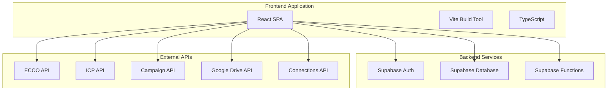

---

## Technology Stack

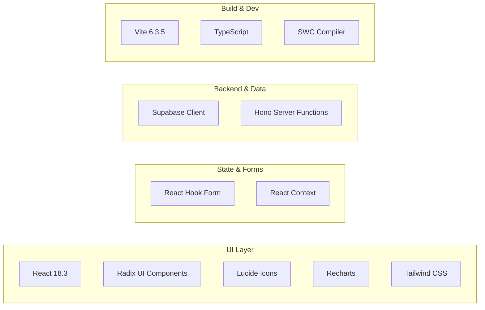

**Key Dependencies:**
- **UI Framework:** React 18.3.1, React DOM 18.3.1
- **Component Library:** Radix UI (50+ components), Lucide React Icons
- **Styling:** Tailwind CSS, Class Variance Authority, Tailwind Merge
- **Charts:** Recharts 2.15.2
- **Forms:** React Hook Form 7.55.0
- **Backend:** Supabase JS, Hono
- **Build Tool:** Vite 6.3.5 with React SWC plugin
- **Animations:** Motion, Canvas Confetti

---

## Application Architecture

### High-Level Application Flow

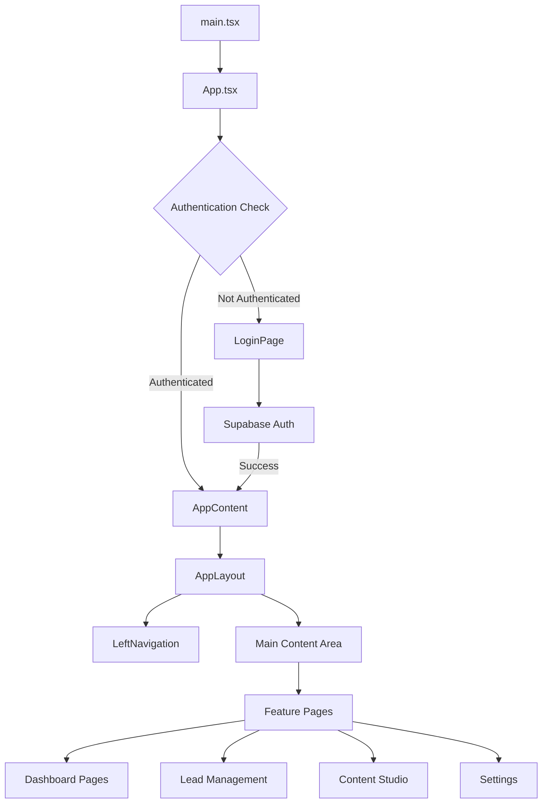

### Core Application Components

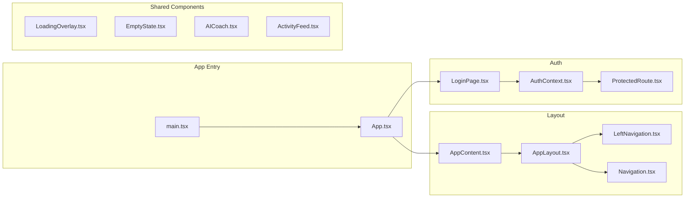

---

## Component Hierarchy

### Feature Module Organization

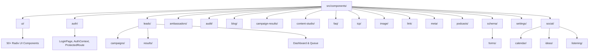

### UI Component Library (ui/)

The application uses **50+ Radix UI primitives** for consistent, accessible UI:

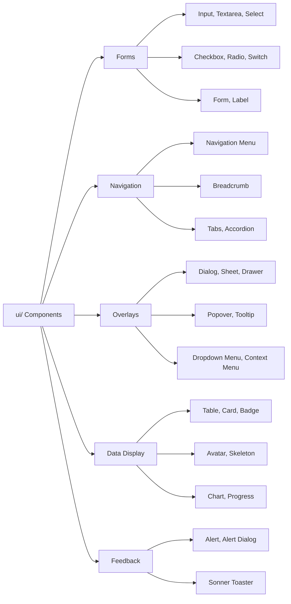

---

## Feature Modules

### 1. Authentication Module

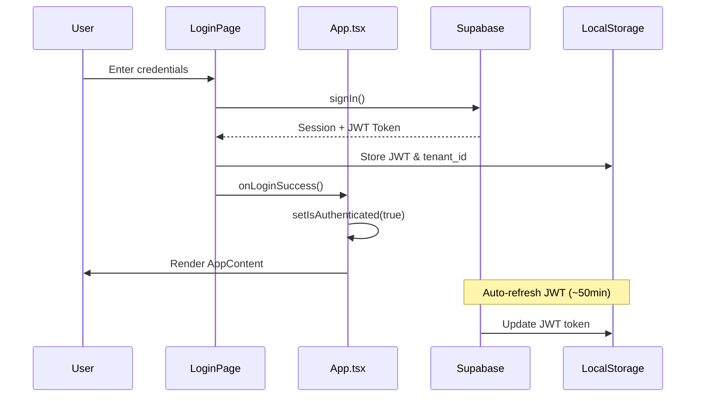

**Key Files:**
- `src/components/auth/LoginPage.tsx` - Login UI
- `src/components/auth/AuthContext.tsx` - Auth state management
- `src/components/auth/ProtectedRoute.tsx` - Route guards
- `src/lib/supabase.ts` - Supabase client configuration

### 2. Leads Management Module

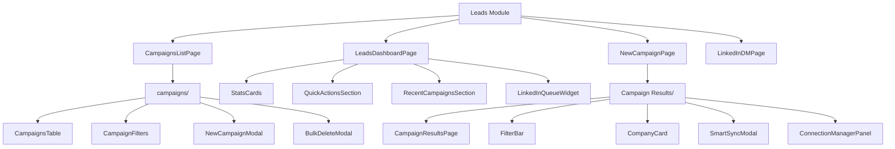

**Leads Workflow:**

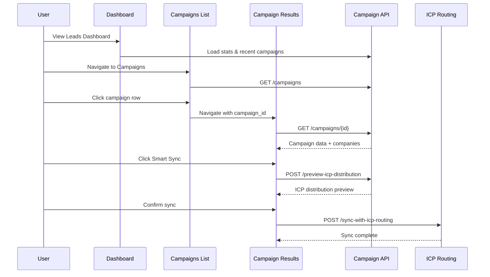

### 3. Content Studio Modules

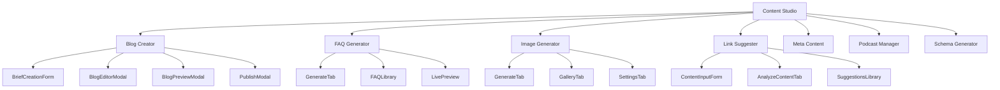

### 4. ICP & Discovery Module

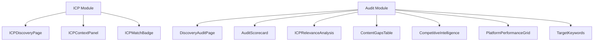

### 5. Social Media Module

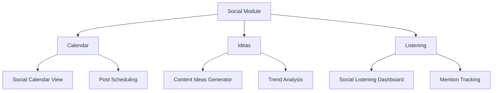

### 6. Settings Module

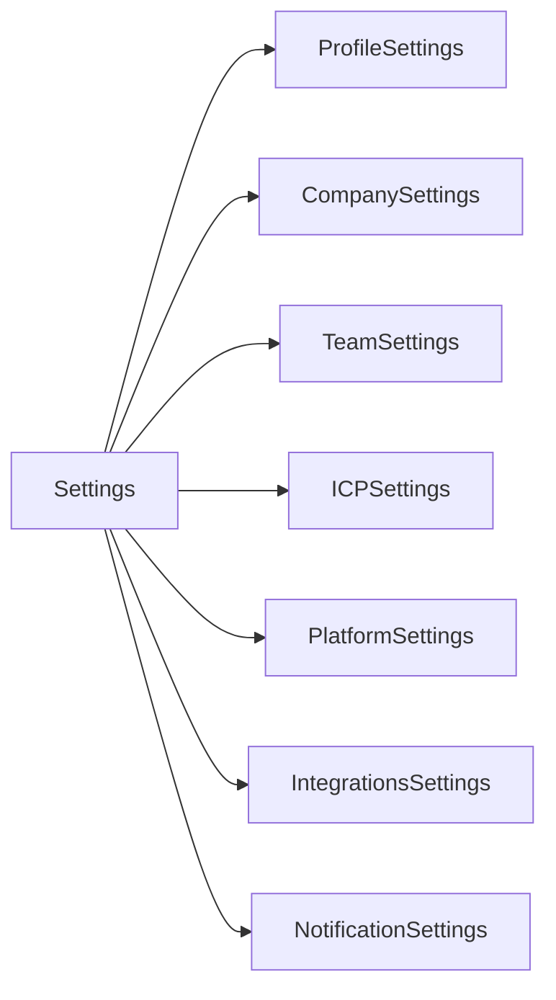

---

## Data Flow

### API Layer Architecture

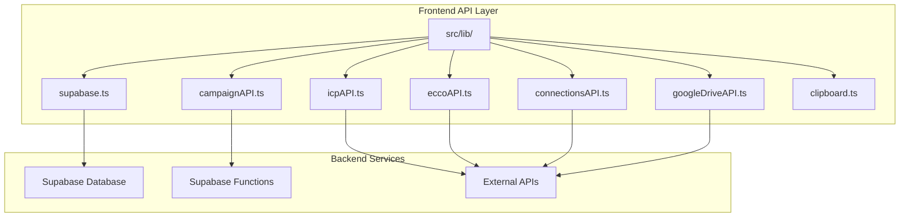

### Campaign Data Flow Example

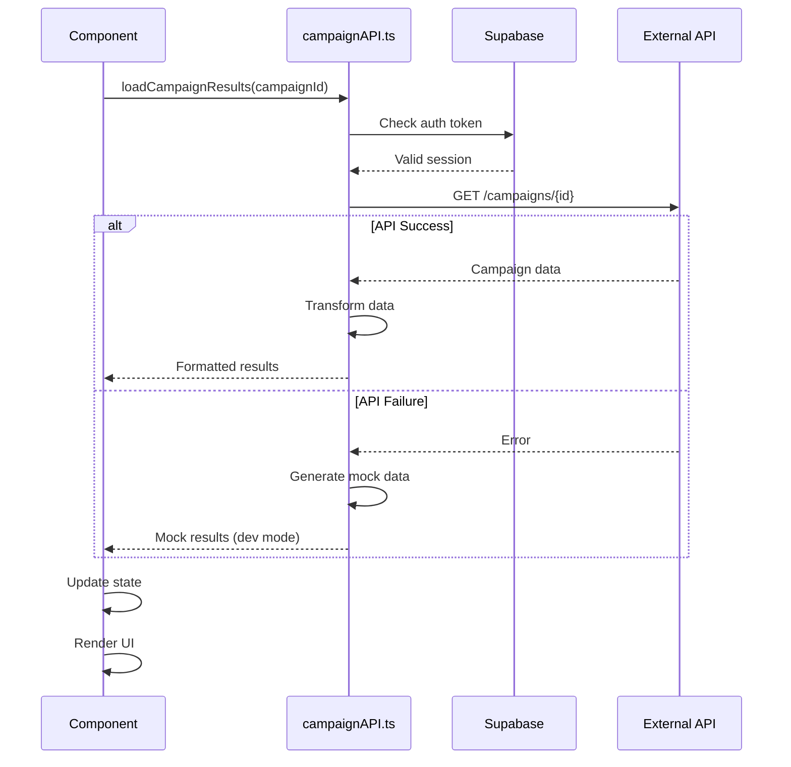

---

## Authentication Flow

### JWT Token Management

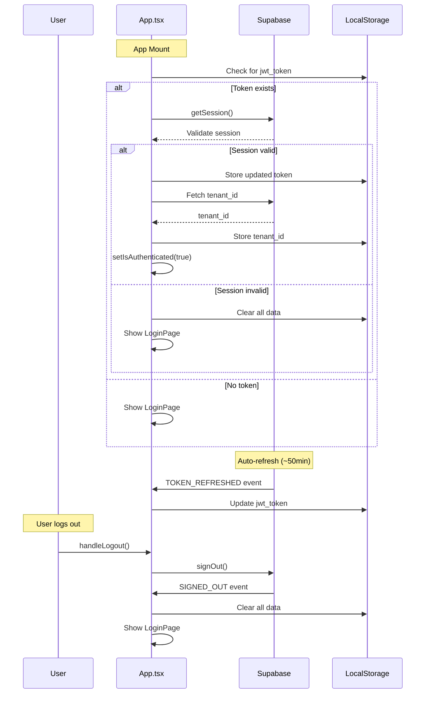

**Authentication Events:**
- `SIGNED_IN` - User successfully logs in
- `TOKEN_REFRESHED` - JWT auto-refreshed
- `SIGNED_OUT` - User logs out

---

## API Integration

### API Service Architecture

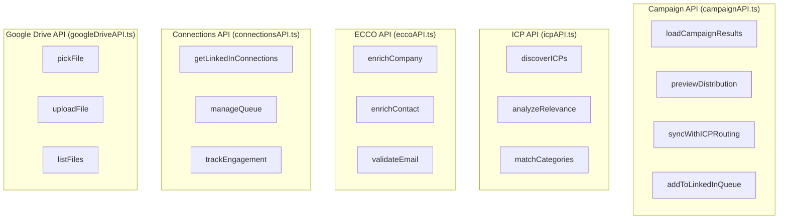

### API Request Flow

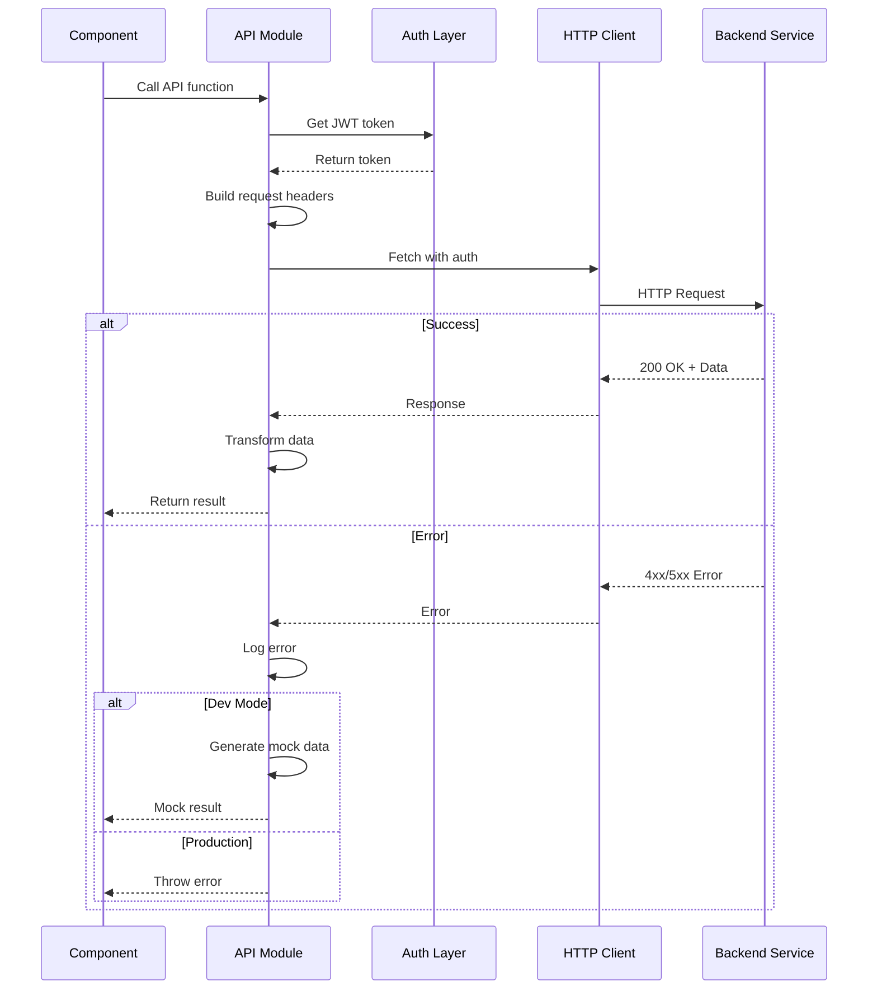

---

## Directory Structure

### Complete Project Structure

```
mil3-aivis-agents/
├── index.html                          # Entry HTML file
├── package.json                        # Dependencies & scripts
├── vite.config.ts                      # Vite configuration
├── readme.md                           # Project documentation
│
├── src/
│   ├── main.tsx                        # React entry point
│   ├── App.tsx                         # Root component
│   ├── index.css                       # Global styles (144KB)
│   │
│   ├── assets/                         # Static assets
│   │   ├── *.png                       # Images
│   │
│   ├── components/                     # React components
│   │   ├── *.tsx                       # Root-level components
│   │   │   ├── AppContent.tsx
│   │   │   ├── AppLayout.tsx
│   │   │   ├── LeftNavigation.tsx
│   │   │   ├── Navigation.tsx
│   │   │   ├── LoginPage.tsx
│   │   │   ├── AICoach.tsx
│   │   │   ├── ActivityFeed.tsx
│   │   │   └── ...
│   │   │
│   │   ├── ui/                         # Radix UI components (50+)
│   │   │   ├── button.tsx
│   │   │   ├── input.tsx
│   │   │   ├── dialog.tsx
│   │   │   ├── table.tsx
│   │   │   └── ...
│   │   │
│   │   ├── auth/                       # Authentication
│   │   │   ├── LoginPage.tsx
│   │   │   ├── AuthContext.tsx
│   │   │   └── ProtectedRoute.tsx
│   │   │
│   │   ├── leads/                      # Lead management
│   │   │   ├── LeadsDashboardPage.tsx
│   │   │   ├── CampaignsListPage.tsx
│   │   │   ├── NewCampaignPage.tsx
│   │   │   ├── LinkedInDMPage.tsx
│   │   │   ├── campaigns/              # Campaign components
│   │   │   │   ├── CampaignsTable.tsx
│   │   │   │   ├── CampaignFilters.tsx
│   │   │   │   └── ...
│   │   │   └── results/                # Campaign results
│   │   │       ├── CampaignResultsPage.tsx
│   │   │       ├── CompanyCard.tsx
│   │   │       ├── FilterBar.tsx
│   │   │       ├── SmartSyncModal.tsx
│   │   │       └── ...
│   │   │
│   │   ├── blog/                       # Blog content creation
│   │   │   ├── BlogCreatorPage.tsx
│   │   │   ├── BriefCreationForm.tsx
│   │   │   ├── BlogEditorModal.tsx
│   │   │   └── ...
│   │   │
│   │   ├── faq/                        # FAQ generation
│   │   │   ├── FAQGeneratorPage.tsx
│   │   │   ├── GenerateTab.tsx
│   │   │   └── ...
│   │   │
│   │   ├── image/                      # Image generation
│   │   │   ├── ImageGeneratorPage.tsx
│   │   │   ├── GalleryTab.tsx
│   │   │   └── ...
│   │   │
│   │   ├── ambassadors/                # Ambassador management
│   │   │   ├── AmbassadorListPage.tsx
│   │   │   ├── AmbassadorCampaignsPage.tsx
│   │   │   └── ...
│   │   │
│   │   ├── audit/                      # Discovery audit
│   │   │   ├── AuditScorecard.tsx
│   │   │   ├── ICPRelevanceAnalysis.tsx
│   │   │   └── ...
│   │   │
│   │   ├── icp/                        # ICP discovery
│   │   │   └── ICPDiscoveryPage.tsx
│   │   │
│   │   ├── content-studio/             # Content studio features
│   │   │   ├── ICPContextPanel.tsx
│   │   │   └── ICPMatchBadge.tsx
│   │   │
│   │   ├── social/                     # Social media
│   │   │   ├── calendar/
│   │   │   ├── ideas/
│   │   │   └── listening/
│   │   │
│   │   ├── podcasts/                   # Podcast management
│   │   ├── meta/                       # Meta content
│   │   ├── link/                       # Link suggestions
│   │   ├── campaign-results/           # Campaign results
│   │   ├── schema/                     # Schema generation
│   │   │   └── forms/
│   │   ├── settings/                   # App settings
│   │   │   ├── SettingsPage.tsx
│   │   │   ├── ProfileSettings.tsx
│   │   │   ├── CompanySettings.tsx
│   │   │   └── ...
│   │   ├── figma/                      # Figma integration
│   │   └── onboarding/                 # User onboarding
│   │
│   ├── lib/                            # API & utility libraries
│   │   ├── supabase.ts                 # Supabase client
│   │   ├── campaignAPI.ts              # Campaign API
│   │   ├── icpAPI.ts                   # ICP API
│   │   ├── eccoAPI.ts                  # ECCO API
│   │   ├── connectionsAPI.ts           # Connections API
│   │   ├── googleDriveAPI.ts           # Google Drive API
│   │   └── clipboard.ts                # Clipboard utils
│   │
│   ├── utils/                          # Utility functions
│   │   └── supabase/
│   │       └── info.tsx
│   │
│   ├── supabase/                       # Supabase functions
│   │   └── functions/
│   │       └── server/
│   │           ├── index.tsx
│   │           └── kv_store.tsx
│   │
│   ├── styles/                         # Style files
│   │
│   ├── guidelines/                     # Development guidelines
│   │
│   └── *.md                            # Documentation files
│       ├── ARCHITECTURE_DIAGRAM.md
│       ├── AUTHENTICATION.md
│       ├── API_INTEGRATION_STATUS.md
│       ├── DEPLOYMENT_GUIDE.md
│       ├── QUICK_START.md
│       └── ...
```

---

## Component Interaction Map

### Main Dashboard Flow

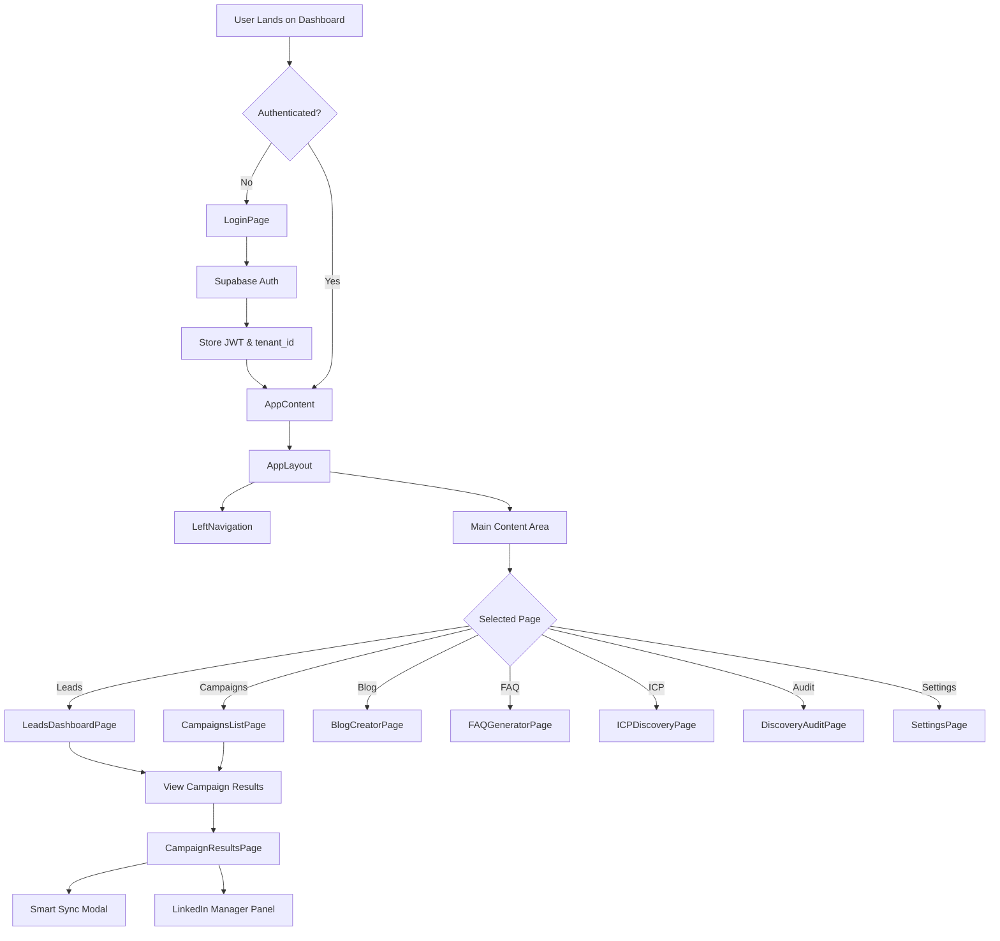

---

## Build & Deployment

### Build Configuration

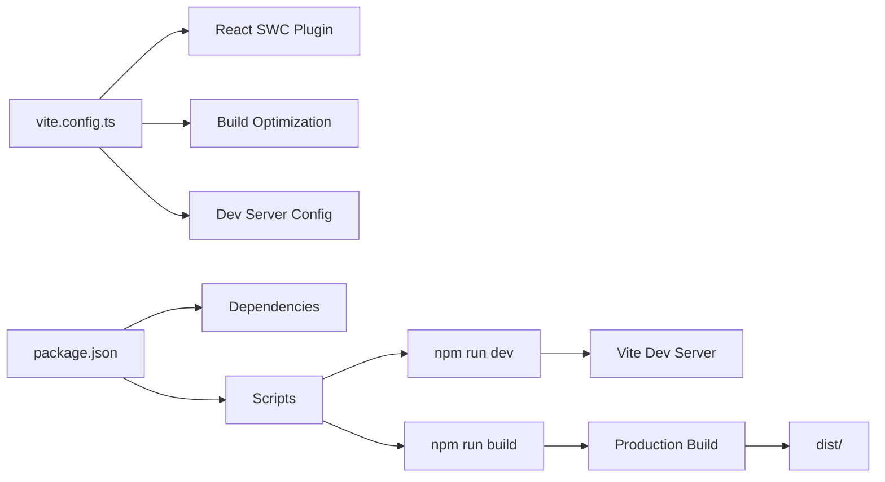

**Available Scripts:**
- `npm run dev` - Start Vite development server
- `npm run build` - Build for production

---

## Key Features Summary

```mermaid
mindmap
  root((BAIV Dashboard))
    Lead Management
      Campaign Creation
      Lead Discovery
      ICP Matching
      LinkedIn Queue
      Smart Sync
      Email Enrichment
    Content Studio
      Blog Creator
      FAQ Generator
      Image Generator
      Link Suggester
      Meta Content
      Schema Generator
      Podcast Manager
    Social Media
      Content Calendar
      Idea Generation
      Social Listening
    Discovery & Audit
      ICP Discovery
      Audit Scorecard
      Content Gaps
      Competitive Intelligence
      Platform Performance
    Ambassador Management
      Ambassador Discovery
      Campaign Management
      Content Approval
    Settings & Config
      Profile Settings
      Company Settings
      Team Management
      ICP Configuration
      Platform Integration
      Notifications
```

---

## State Management

### Application State Architecture

```mermaid
graph TB
    subgraph "Global State"
        A[Authentication State]
        B[User Profile]
        C[Tenant Configuration]
        D[Navigation State]
    end
    
    subgraph "Feature State"
        E[Campaign State]
        F[Lead State]
        G[Content State]
        H[Settings State]
    end
    
    subgraph "UI State"
        I[Modal State]
        J[Drawer State]
        K[Loading State]
        L[Error State]
    end
    
    A --> E
    A --> F
    A --> G
    A --> H
    
    B --> C
    C --> E
    C --> F
```

**State Management Patterns:**
- **React Context** - Authentication, theme
- **Component State** - Feature-specific data
- **LocalStorage** - JWT tokens, user preferences
- **Supabase Realtime** - Live data updates

---

## Integration Points

### External Service Integrations

```mermaid
graph TB
    A[BAIV Dashboard] --> B[Supabase]
    A --> C[ECCO API]
    A --> D[ICP Discovery API]
    A --> E[Campaign Management API]
    A --> F[Google Drive API]
    A --> G[LinkedIn API]
    
    B --> B1[Authentication]
    B --> B2[Database]
    B --> B3[Storage]
    B --> B4[Functions]
    
    C --> C1[Company Enrichment]
    C --> C2[Contact Enrichment]
    C --> C3[Email Validation]
    
    D --> D1[ICP Matching]
    D --> D2[Category Detection]
    D --> D3[Score Calculation]
    
    E --> E1[Campaign CRUD]
    E --> E2[Lead Distribution]
    E --> E3[Smart Routing]
    
    F --> F1[File Upload]
    F --> F2[File Picker]
    F --> F3[Content Export]
    
    G --> G1[Connection Queue]
    G --> G2[DM Management]
    G --> G3[Engagement Tracking]
```

---

## Performance Considerations

### Optimization Strategies

```mermaid
graph LR
    A[Performance] --> B[Code Splitting]
    A --> C[Lazy Loading]
    A --> D[Memoization]
    A --> E[Virtual Scrolling]
    
    B --> B1[Route-based splitting]
    C --> C1[Component lazy load]
    D --> D1[React.memo]
    D --> D2[useMemo/useCallback]
    E --> E1[Large lists optimization]
```

**Key Optimizations:**
- Vite's fast HMR (Hot Module Replacement)
- SWC for faster compilation
- Component code splitting
- Lazy loading for heavy features
- Optimized Radix UI components
- Recharts for performant data visualization

---

## Security Architecture

```mermaid
graph TB
    A[Security Layer] --> B[Authentication]
    A --> C[Authorization]
    A --> D[Data Protection]
    
    B --> B1[JWT Tokens]
    B --> B2[Auto-refresh]
    B --> B3[Session Management]
    
    C --> C1[Route Protection]
    C --> C2[Tenant Isolation]
    C --> C3[Role-based Access]
    
    D --> D1[LocalStorage Encryption]
    D --> D2[HTTPS Only]
    D --> D3[API Key Management]
```

**Security Features:**
- JWT-based authentication
- Automatic token refresh (~50 min)
- Protected routes with `ProtectedRoute` component
- Tenant-based data isolation
- Secure API communication
- Session validation on mount

---

## Future Architecture Considerations

### Scalability Roadmap

```mermaid
graph TB
    A[Current Architecture] --> B[Phase 2]
    B --> C[Phase 3]
    
    B --> B1[State Management Library]
    B --> B2[GraphQL API Layer]
    B --> B3[Micro-frontends]
    
    C --> C1[Server Components]
    C --> C2[Edge Functions]
    C --> C3[Real-time Collaboration]
```

---

## Documentation Files

The project includes extensive documentation:

- `ARCHITECTURE_DIAGRAM.md` - Original architecture diagrams
- `AUTHENTICATION.md` - Authentication implementation details
- `AUTH_FLOW_DIAGRAM.md` - Detailed auth flow documentation
- `API_INTEGRATION_STATUS.md` - API integration status
- `DEPLOYMENT_GUIDE.md` - Deployment instructions
- `QUICK_START.md` - Quick start guide
- `NAVIGATION_GUIDE.md` - Navigation structure
- `PRODUCTION_READY.md` - Production readiness checklist
- `IMPLEMENTATION_SUMMARY.md` - Implementation notes
- `CAMPAIGN_RESULTS_SUMMARY.md` - Campaign feature docs
- `PODCAST_FEATURE_SUMMARY.md` - Podcast feature docs

---

## Conclusion

The Mil3-AIVis-Agents (BAIV Dashboard) is a comprehensive, modular React application built with modern best practices:

✅ **Modular Architecture** - Feature-based organization  
✅ **Type Safety** - Full TypeScript coverage  
✅ **Accessible UI** - Radix UI primitives  
✅ **Secure Authentication** - JWT with auto-refresh  
✅ **API Integration** - Multiple external services  
✅ **Scalable Structure** - Easy to extend and maintain  
✅ **Developer Experience** - Fast builds with Vite + SWC  
✅ **Comprehensive Documentation** - Detailed guides and diagrams  

**Version:** 0.1.0  
**Last Updated:** 2025-12-09  
**Maintained by:** BAIV Team
