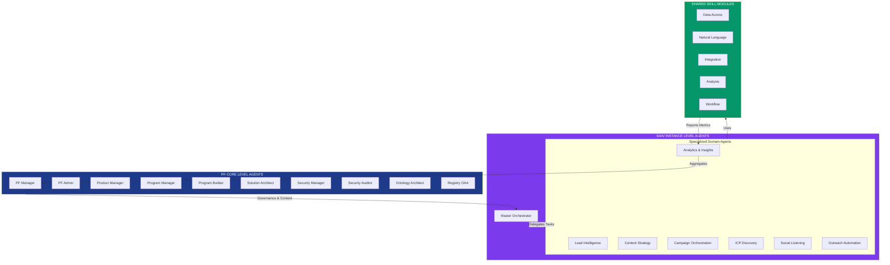

# Claude Agent SDK: Agent Orchestration Architecture Plan

**Document:** Mil3-AIVis-Agents Claude Agent SDK Integration Plan  
**Version:** 1.0  
**Date:** 2025-12-09  
**Instance:** PF-Instance-BAIV (BeAIVisible)  
**Integration Milestone:** Mil3 + PF-Core VE/CE + BAIV v1.2  
**Status:** Initial Architecture - Detailed Alignment in Progress

## Problem Statement

The BAIV Dashboard (BeAIVisible) needs an intelligent agent orchestration system to automate complex workflows across lead management, content generation, ICP discovery, campaign management, and AI platform monitoring. The system must coordinate multiple specialized agents that can work autonomously and collaboratively to achieve business objectives while maintaining traceability and change control per established registry requirements.

**Critical Integration Requirement:** The BAIV instance must integrate with PF-Core's Value Engineering (VE) and Context Engineering (CE) frameworks to ensure agents operate with strategic alignment, appropriate authority boundaries, and measurable outcomes.

## Current State Overview

**Existing Infrastructure:**
* React 18.3 + TypeScript frontend with Vite
* Supabase backend (Auth, Database, Functions, Storage)
* 226 React components organized by feature modules
* Multiple external API integrations (ECCO, ICP Discovery, Campaign Management, LinkedIn, Google Drive)
* Established authentication and state management patterns
* Comprehensive documentation and artifact tracking system

**Key Modules:**
* Authentication & User Management
* Leads Management with enrichment
* Content Generation (Blog, Social, Email)
* Campaign Management (Multi-channel)
* Social Media Listening & Engagement
* ICP Discovery & Analysis
* Podcast Outreach
* Product-Market Fit Surveys

**PF-Core Foundation Available:**
* Value Engineering (VE) framework with 6 modules (VE-100 through VE-600)
* Context Engineering (CE) framework for agent context delivery
* Ontology Registry for semantic modeling and traceability
* Agent Architecture templates and patterns
* Change control and version management system

## Proposed Agent Orchestration Architecture

### Agent Hierarchy & Organization

The agent architecture is organized in three tiers:
1. **PF-Core Level Agents** - Platform-wide governance, architecture, and management (operate across all instances)
2. **Instance Level Agents** - BAIV-specific operational agents (Master Orchestrator + specialized domain agents)
3. **Shared Skill Modules** - Reusable capabilities accessible by all agents



**Agent Hierarchy Overview:**

This diagram illustrates the three-tier agent architecture that forms the foundation of the Claude Agent SDK integration. At the top tier, ten PF-Core level agents provide platform-wide governance, security, architecture, and ontology management that operates consistently across all PF-Instances (BAIV, AIR, W4M). These agents enforce strategic alignment, security policies, and resource coordination at the enterprise level.

The middle tier consists of BAIV instance-specific agents, led by the Master Orchestrator which receives governance and strategic context from PF-Core agents. The Master Orchestrator coordinates seven specialized domain agents that handle specific business functions like lead intelligence, content strategy, and campaign orchestration. Each domain agent operates within authority boundaries defined by PF-Core governance while executing BAIV-specific workflows.

The bottom tier contains five categories of shared skill modules that provide reusable capabilities accessible by all agents. These skills include data access, natural language processing, API integrations, analysis, and workflow management. This modular approach ensures consistent implementation patterns, reduces code duplication, and enables rapid agent development by composing pre-built, tested capabilities. Metrics flow from domain agents through the Analytics agent back to PF-Core for platform-wide visibility and optimization.

### 1. Orchestration Layer

**Master Orchestrator Agent**
* Central coordination hub for all agent activities
* Workflow routing and task delegation
* Priority management and resource allocation
* Cross-agent communication protocol
* State synchronization across agents
* Error handling and recovery strategies
* Audit logging and traceability

**Capabilities:**
* Parse high-level business objectives into executable workflows
* Dynamically compose agent teams based on task requirements
* Monitor agent performance and health
* Implement circuit breakers for failing agents
* Manage shared context and memory across agent sessions

### 2. Specialized Sub-Agents

**Lead Intelligence Agent**
* Responsibilities: Lead discovery, enrichment, scoring, qualification
* Skills: ECCO API integration, ICP matching, data enrichment, LinkedIn profile analysis
* Tools: Supabase database queries, ECCO enrichment API, ICP discovery API
* Triggers: New lead ingestion, scheduled enrichment jobs, manual refresh requests

**Content Strategy Agent**
* Responsibilities: Content planning, generation, optimization, distribution
* Skills: SEO analysis, AI-optimized content creation, multi-format adaptation (blog/social/email)
* Tools: Claude API for generation, content templates, SEO analysis tools
* Triggers: Content calendar events, campaign launches, engagement thresholds

**Campaign Orchestration Agent**
* Responsibilities: Multi-channel campaign planning, execution, monitoring, optimization
* Skills: Campaign design, audience segmentation, A/B testing, performance analysis
* Tools: Campaign Management API, email/social schedulers, analytics dashboards
* Triggers: Campaign creation events, scheduled sends, performance milestones

**ICP Discovery Agent**
* Responsibilities: Ideal customer profile identification, market research, persona development
* Skills: Pattern recognition, industry analysis, competitive intelligence, firmographic analysis
* Tools: ICP Discovery API, web scraping, data aggregation, LinkedIn Connections API
* Triggers: New market entry, quarterly research cycles, low lead quality signals

**Social Listening Agent**
* Responsibilities: Brand monitoring, sentiment analysis, engagement opportunities, trend detection
* Skills: Natural language processing, sentiment analysis, intent classification, response generation
* Tools: Social media APIs, sentiment analysis models, engagement tracking
* Triggers: Brand mentions, keyword matches, competitor activity, viral trends

**Outreach Automation Agent**
* Responsibilities: Personalized outreach, follow-up sequencing, relationship nurturing
* Skills: Message personalization, timing optimization, response handling, conversion tracking
* Tools: Email APIs, LinkedIn automation, CRM integration, scheduling systems
* Triggers: Lead status changes, engagement signals, scheduled touches

**Analytics & Insights Agent**
* Responsibilities: Performance monitoring, reporting, predictive analytics, optimization recommendations
* Skills: Data analysis, visualization, forecasting, anomaly detection, recommendation engine
* Tools: Supabase analytics, charting libraries (Recharts), statistical models
* Triggers: Dashboard loads, scheduled reports, threshold breaches, executive requests

### PF-Level Management & Architecture Agents

**PF Manager Agent**
* Responsibilities: Platform-level oversight, governance enforcement, cross-instance coordination, strategic alignment
* Skills: Resource allocation, dependency management, conflict resolution, escalation handling
* Tools: PF-Core registry APIs, VE framework access, instance health monitors
* Triggers: Instance requests, governance violations, strategic updates, capacity thresholds

**PF Admin Agent**
* Responsibilities: Platform configuration, user access management, system maintenance, operational oversight
* Skills: RBAC administration, infrastructure provisioning, backup/recovery, audit management
* Tools: Supabase Admin APIs, Redis management, deployment orchestration
* Triggers: Configuration changes, access requests, system alerts, maintenance windows

**Product Manager Agent**
* Responsibilities: Product vision alignment, feature prioritization, stakeholder communication, roadmap management
* Skills: Requirements gathering, user story creation, acceptance criteria definition, backlog management
* Tools: PRD templates, VE-400 (Value Prop) integration, stakeholder feedback aggregation
* Triggers: Strategy updates, feature requests, PMF validation results, quarterly planning

**Program Manager Agent**
* Responsibilities: Cross-functional coordination, milestone tracking, risk management, delivery assurance
* Skills: PBS/WBS management, dependency tracking, resource leveling, stakeholder reporting
* Tools: Project tracking systems, gantt chart generation, status dashboards
* Triggers: Phase transitions, milestone deadlines, risk identification, resource conflicts

**Program Builder Agent**
* Responsibilities: Scaffold new programs, generate artifacts, configure infrastructure, establish baselines
* Skills: Template instantiation, PBS/WBS generation, CI/CD pipeline setup, documentation scaffolding
* Tools: Code generators, template engines, infrastructure-as-code tools
* Triggers: New program initiation, instance creation requests, architecture approvals

**Solution Architect Agent**
* Responsibilities: Architecture design, technical decision-making, integration patterns, scalability planning
* Skills: System design, technology selection, capacity planning, performance optimization
* Tools: Architecture modeling tools, PF-Core ontology, technical debt tracking
* Triggers: New feature requests, performance issues, technology evaluations, architecture reviews

**Security Manager Agent**
* Responsibilities: Security policy enforcement, threat management, compliance oversight, incident response coordination
* Skills: Security framework implementation, risk assessment, vulnerability management, security training
* Tools: Security scanning tools, SIEM integration, compliance frameworks (SOC2, GDPR, HIPAA)
* Triggers: Security policy updates, compliance audits, threat intelligence, incident reports

**Security Auditor Agent**
* Responsibilities: Continuous security auditing, compliance validation, penetration testing coordination, security reporting
* Skills: Audit trail analysis, access control validation, vulnerability assessment, security metrics tracking
* Tools: Audit log analyzers, compliance checkers, security dashboards, vulnerability scanners
* Triggers: Scheduled audits, access change events, security anomalies, compliance review periods

**Ontology Architect Agent**
* Responsibilities: Ontology design, semantic modeling, knowledge graph architecture, schema evolution
* Skills: RDF/OWL/RDFS design, LPG (Labeled Property Graph) modeling, ontology mapping, SPARQL/Cypher query design
* Tools: Protégé, ontology editors, graph databases (Neo4j, RDFox), validation tools
* Triggers: New domain modeling requirements, schema changes, cross-ontology alignment needs, ontology version releases

**Registry OAA (Ontology Access & Authorization) Agent**
* Responsibilities: Central ontology registry management, access control enforcement, licensing management, version control
* Skills: Ontology registration, license validation, access policy enforcement, provenance tracking, usage auditing
* Tools: OAA registry database, license management system, access control matrix, ontology catalog
* Triggers: Ontology registration requests, access permission requests, license validation checks, usage audits
* **Key Functions:**
    * Central registry for all PF-Core and instance-specific ontologies
    * License tracking and enforcement (open, proprietary, restricted)
    * Access control per ontology (read, write, extend, derive)
    * Version management and deprecation policies
    * Usage analytics and compliance reporting
    * Cross-instance ontology sharing governance

**Note:** These PF-level agents operate across all PF-Instances (BAIV, AIR, W4M) and will be aligned in detail in follow-up session.

### 3. Skill Modules (Reusable Capabilities)

**Data Access Skills**
* Supabase query execution (CRUD operations)
* External API authentication and requests
* File storage and retrieval (Supabase Storage)
* Cache management and invalidation

**Natural Language Skills**
* Text generation (Claude API)
* Sentiment analysis
* Entity extraction
* Summarization and synthesis
* Translation and adaptation

**Integration Skills**
* API client implementations (ECCO, ICP, Campaign, LinkedIn, Google Drive)
* Webhook handling and event processing
* Rate limiting and retry logic
* Data transformation and mapping

**Analysis Skills**
* Statistical analysis
* Pattern recognition
* Scoring and ranking algorithms
* Trend detection
* Predictive modeling

**Workflow Skills**
* State machine management
* Conditional branching
* Parallel execution coordination
* Error handling and rollback
* Notification and alerting

### 4. Implementation Architecture

**Technical Stack:**
* **Agent Framework:** Claude Agent SDK (Python/TypeScript)
* **Orchestration Engine:** Custom workflow engine or temporal.io
* **Message Queue:** Redis or Supabase Realtime for agent communication
* **State Management:** Supabase Database + Redis for session state
* **Monitoring:** Custom dashboard + logging infrastructure
* **Deployment:** Supabase Edge Functions or dedicated microservices

**Agent Communication Protocol:**
```
Message Format:
{
  "messageId": "uuid",
  "timestamp": "ISO8601",
  "from": "agentId",
  "to": "agentId | broadcast",
  "type": "task | query | response | event | error",
  "priority": "high | medium | low",
  "payload": { /* task-specific data */ },
  "context": { /* shared workflow context */ },
  "traceId": "workflowId"
}
```

**Agent Lifecycle:**
1. Initialization: Load configuration, authenticate, register with orchestrator
2. Ready: Listen for incoming messages and triggers
3. Execution: Process tasks, call skills, generate outputs
4. Reporting: Log activities, update state, notify orchestrator
5. Idle/Shutdown: Release resources, persist state, deregister

### 5. Workflow Examples

**Workflow: New Lead Processing**
1. Master Orchestrator receives new lead event
2. Delegates to Lead Intelligence Agent for enrichment
3. Lead Intelligence Agent calls ECCO API and ICP matching skills
4. ICP Discovery Agent evaluates fit and scores lead
5. If qualified, Campaign Orchestration Agent triggers welcome sequence
6. Content Strategy Agent prepares personalized content
7. Outreach Automation Agent schedules first touch
8. Analytics Agent logs metrics and updates dashboard

```mermaid
[WORKFLOW SEQUENCE DIAGRAM: New Lead Processing - TO BE ADDED]
```

[Explanation paragraphs for New Lead Processing workflow sequence to be added]

**Workflow: Content Campaign Launch**
1. User initiates campaign via UI
2. Master Orchestrator validates campaign parameters
3. Content Strategy Agent generates multi-format content
4. Campaign Orchestration Agent creates distribution plan
5. Social Listening Agent monitors initial engagement
6. Analytics Agent tracks performance in real-time
7. Based on performance, Content Strategy Agent suggests optimizations
8. Campaign Orchestration Agent implements A/B tests

```mermaid
[WORKFLOW SEQUENCE DIAGRAM: Content Campaign Launch - TO BE ADDED]
```

[Explanation paragraphs for Content Campaign Launch workflow to be added]

### [5.1 Additional Workflow Examples - TO BE EXPANDED]

**[Workflow: ICP Discovery & Market Research]**
[Step-by-step workflow to be detailed]

```mermaid
[WORKFLOW DIAGRAM - TO BE ADDED]
```

[Explanation to be added]

**[Workflow: Social Listening & Engagement Response]**
[Step-by-step workflow to be detailed]

```mermaid
[WORKFLOW DIAGRAM - TO BE ADDED]
```

[Explanation to be added]

**[Workflow: Multi-Channel Campaign Optimization]**
[Step-by-step workflow to be detailed]

```mermaid
[WORKFLOW DIAGRAM - TO BE ADDED]
```

[Explanation to be added]

### 6. Registry Integration & Change Control

**Agent Artifacts as Controlled Entities:**
* Each agent definition registered as versioned entity in registry
* Agent prompt templates tracked with semantic versioning (e.g., v2.0.0)
* Skills registered as reusable components with dependency tracking
* Workflow definitions stored as change-controlled artifacts
* All modifications logged with reasoning and approval trail

**Registry Schema Extensions:**
* AgentDefinition entity: id, name, version, capabilities, skills[], prompts, configuration
* SkillDefinition entity: id, name, version, implementation, dependencies[], apis[]
* WorkflowDefinition entity: id, name, version, steps[], agents[], triggers[]
* ExecutionLog entity: workflowId, agentId, timestamp, action, input, output, status
* ChangeLog entity: artifactId, version, changes[], approvedBy, timestamp, reason

### 7. Testing & Validation Strategy

**TDD Approach per Registry Rules:**
* Unit tests for each skill module
* Integration tests for agent-to-agent communication
* End-to-end workflow tests for complete scenarios
* Performance tests for throughput and latency
* Chaos engineering for failure recovery

**Test Documentation:**
* Test specifications in markdown format
* Test execution flows in mermaid diagrams
* Coverage reports tracked in registry
* Regression test suite for version upgrades

### 8. Deployment & Scaling Considerations

**Phase 1: Proof of Concept**
* Implement Master Orchestrator + 2-3 core agents
* Single workflow: New Lead Processing
* Manual triggers and monitoring
* Monolithic deployment to Supabase Edge Functions

**Phase 2: Production MVP**
* All 7 specialized agents operational
* 5-10 automated workflows
* Event-driven triggers
* Distributed deployment with load balancing

**Phase 3: Scale & Optimize**
* Agent performance tuning
* Parallel execution optimization
* Advanced analytics and ML integration
* Self-healing and auto-scaling capabilities

### 9. Security & Compliance

* API key rotation and secure storage
* Agent authentication and authorization
* Audit trail for all agent actions
* PII handling and data privacy compliance
* Rate limiting and abuse prevention
* Encrypted communication between agents

### 10. Monitoring & Observability

* Real-time agent health dashboard
* Workflow execution tracking
* Performance metrics (latency, throughput, success rate)
* Error tracking and alerting
* Cost monitoring (API usage, compute resources)
* User feedback integration

```mermaid
[MONITORING ARCHITECTURE DIAGRAM - TO BE ADDED]
```

[Explanation of monitoring and observability architecture to be added]

### [11. Technology Stack Deep Dive - TO BE EXPANDED]

**[Claude Agent SDK Configuration]**
[Detailed SDK setup, configuration patterns, and best practices to be added]

**[Orchestration Engine Details]**
[Temporal.io or custom workflow engine specifications to be added]

**[Message Queue Architecture]**
[Redis/Supabase Realtime configuration and patterns to be added]

```mermaid
[TECHNOLOGY STACK DIAGRAM - TO BE ADDED]
```

[Explanation of technology choices and integration patterns to be added]

### [12. Data Flow Architecture - TO BE EXPANDED]

**[Agent-to-Agent Communication Patterns]**
[Detailed communication patterns and examples to be added]

**[Context Package Flow]**
[How context packages flow through the system to be detailed]

**[Metrics and Analytics Pipeline]**
[Data pipeline for metrics collection and aggregation to be added]

```mermaid
[DATA FLOW DIAGRAM - TO BE ADDED]
```

[Explanation of data flows and transformation points to be added]

### [13. Deployment Architecture - TO BE EXPANDED]

**[Infrastructure Layout]**
[Detailed infrastructure architecture to be added]

**[Scaling Strategy]**
[Horizontal and vertical scaling approaches to be detailed]

**[High Availability & Disaster Recovery]**
[HA and DR strategies to be added]

```mermaid
[DEPLOYMENT ARCHITECTURE DIAGRAM - TO BE ADDED]
```

[Explanation of deployment topology and scaling approach to be added]

### [14. Agent Specifications & Templates - TO BE EXPANDED]

**[Agent Specification Template]**
[Standard template for all agent specifications including: Purpose, Responsibilities, Skills Required, Authority Boundaries, Input/Output Schema, Performance SLAs, Error Handling, Testing Requirements]

**[Lead Intelligence Agent - Detailed Spec]**
[Complete specification with code examples, API integrations, skill implementations]

**[Content Strategy Agent - Detailed Spec]**
[Complete specification with code examples, API integrations, skill implementations]

**[Campaign Orchestration Agent - Detailed Spec]**
[Complete specification with code examples, API integrations, skill implementations]

**[ICP Discovery Agent - Detailed Spec]**
[Complete specification with code examples, API integrations, skill implementations]

**[Social Listening Agent - Detailed Spec]**
[Complete specification with code examples, API integrations, skill implementations]

**[Outreach Automation Agent - Detailed Spec]**
[Complete specification with code examples, API integrations, skill implementations]

**[Analytics & Insights Agent - Detailed Spec]**
[Complete specification with code examples, API integrations, skill implementations]

### [15. PF-Core Agent Detailed Specifications - TO BE EXPANDED]

**[PF Manager Agent - Complete Specification]**
[Detailed spec with workflows, decision trees, cross-instance coordination patterns]

**[PF Admin Agent - Complete Specification]**
[Detailed spec with configuration management, access control workflows, operational playbooks]

**[Product Manager Agent - Complete Specification]**
[Detailed spec with PRD generation, backlog management, stakeholder communication patterns]

**[Program Manager Agent - Complete Specification]**
[Detailed spec with PBS/WBS management, milestone tracking, risk management workflows]

**[Program Builder Agent - Complete Specification]**
[Detailed spec with scaffolding templates, artifact generation, infrastructure provisioning]

**[Solution Architect Agent - Complete Specification]**
[Detailed spec with architecture patterns, decision frameworks, capacity planning models]

**[Security Manager Agent - Complete Specification]**
[Detailed spec with security policies, threat management, compliance frameworks]

**[Security Auditor Agent - Complete Specification]**
[Detailed spec with audit procedures, compliance validation, security reporting]

**[Ontology Architect Agent - Complete Specification]**
[Detailed spec with ontology design patterns, semantic modeling workflows, validation rules]

**[Registry OAA Agent - Complete Specification]**
[Detailed spec with registration workflows, access control matrix, license management, usage auditing]

### [16. Cross-Instance Coordination Patterns - TO BE EXPANDED]

**[Resource Sharing Across Instances]**
[How BAIV, AIR, and W4M share skill modules, context packages, and PF-Core agent services]

```mermaid
[CROSS-INSTANCE COORDINATION DIAGRAM - TO BE ADDED]
```

[Explanation of resource sharing patterns and conflict resolution]

**[Unified Metrics & Reporting]**
[How Analytics Agents aggregate metrics across instances for platform-wide visibility]

**[Platform-Wide Governance Enforcement]**
[How PF-Core agents enforce consistent policies across all instances]

**[Multi-Instance Workflow Examples]**
[Example workflows that span multiple instances, e.g., BAIV leads feeding into W4M task automation]

### [17. Security Architecture Deep Dive - TO BE EXPANDED]

**[Zero-Trust Agent Architecture]**
[Detailed security model with authentication, authorization, and encryption at every agent boundary]

```mermaid
[SECURITY ARCHITECTURE DIAGRAM - TO BE ADDED]
```

[Explanation of zero-trust principles applied to agent orchestration]

**[Agent Authentication & Authorization]**
[Detailed RBAC/ABAC implementation, credential management, token rotation]

**[Audit Trail & Compliance Logging]**
[Tamper-proof logging architecture, compliance reporting automation]

**[Data Privacy & PII Handling]**
[PII detection, anonymization, data retention policies, GDPR/HIPAA compliance]

**[Threat Models & Mitigation Strategies]**
[Agent-specific threat models, attack vectors, mitigation controls]

**[Security Incident Response Playbooks]**
[Automated response workflows for security events involving agents]

### [18. Testing Strategy & Quality Assurance - TO BE EXPANDED]

**[Unit Test Suite Structure]**
[Test organization, coverage requirements, mock/stub patterns for skills]

**[Integration Test Scenarios]**
[Agent-to-agent communication tests, workflow integration tests, failure scenario tests]

**[End-to-End Test Workflows]**
[Complete business scenario tests with real API integrations]

**[Performance & Load Testing]**
[Benchmarking, stress testing, capacity planning tests]

**[Chaos Engineering Experiments]**
[Failure injection, recovery testing, resilience validation]

**[Test Documentation Templates]**
[Markdown test specifications, mermaid test flow diagrams, coverage reports]

### [19. Cost Management & Optimization - TO BE EXPANDED]

**[Agent Cost Model]**
[Token usage tracking, API call costs, compute resource costs per agent]

**[Cost Optimization Strategies]**
[Context compression, caching strategies, agent selection optimization]

**[Budget Allocation & Monitoring]**
[Per-agent budgets, cost alerts, spend forecasting]

**[ROI Analysis Framework]**
[Cost vs. value metrics, agent effectiveness scoring, investment prioritization]

## PF-Core Integration: Value Engineering & Context Engineering

### Integration Architecture Overview

The BAIV agent orchestration system operates as a PF-Instance that consumes capabilities from PF-Core's Value Engineering (VE) and Context Engineering (CE) frameworks. This ensures agents are strategically aligned, authority-bounded, and outcome-driven.

**Integration Model:**
```
┌─────────────────────────────────────────────────────────────┐
│                        PF-CORE                               │
│  ┌──────────────────────┐  ┌──────────────────────────┐   │
│  │  Value Engineering   │  │  Context Engineering     │   │
│  │  - VE-100 Governance │  │  - Discovery            │   │
│  │  - VE-200 Strategy   │  │  - Assembly             │   │
│  │  - VE-300 Metrics    │──│  - Delivery             │   │
│  │  - VE-400 Value Prop │  │  - Lifecycle Mgmt       │   │
│  │  - VE-500 PMF Valid  │  │  - Authority Enforce    │   │
│  │  - VE-600 GTM        │  │                          │   │
│  └──────────────────────┘  └──────────────────────────┘   │
│              │                          │                   │
│              └──────────┬───────────────┘                   │
└─────────────────────────┼─────────────────────────────────┘
                          │ Context Packages
                          ▼
┌─────────────────────────────────────────────────────────────┐
│                    BAIV INSTANCE                             │
│  ┌────────────────────────────────────────────────────┐    │
│  │           Master Orchestrator Agent                │    │
│  │  - Receives strategic context from CE              │    │
│  │  - Routes tasks per authority boundaries           │    │
│  │  - Tracks outcomes against VE metrics              │    │
│  └──────────────┬──────────────────────────────────┘       │
│                 │                                            │
│  ┌──────────────┴──────────────────────────────────┐       │
│  │        Specialized Sub-Agents                    │       │
│  │  - Each receives scoped context package          │       │
│  │  - Operates within authority boundaries          │       │
│  │  - Reports metrics to VE framework               │       │
│  └──────────────────────────────────────────────────┘       │
└─────────────────────────────────────────────────────────────┘
```

### Value Engineering Integration (VE)

**VE-100: Governance Integration**
* **Purpose:** Define authority boundaries for agent decision-making
* **BAIV Application:**
    * Agent roles mapped to RACI matrix (Responsible, Accountable, Consulted, Informed)
    * RBAC (Role-Based Access Control) enforced for data access and action permissions
    * Lead Intelligence Agent: Can read/enrich leads but not delete
    * Campaign Orchestration Agent: Can create campaigns but requires approval for budgets >$X
    * Content Strategy Agent: Can generate drafts but not publish without review
* **Implementation:** Agent configuration includes `authorityLevel`, `permittedActions[]`, `dataScopes[]`

**VE-200: Strategy Integration**
* **Purpose:** Align agent objectives with BAIV strategic vision
* **BAIV Application:**
    * Vision: Optimize AI platform visibility for B2B companies
    * Mission: Automate discovery, engagement, and conversion of AI-aware buyers
    * Strategic Objectives embedded in agent prompts and decision logic
    * ICP Discovery Agent prioritizes industries/segments from strategy
    * Content Strategy Agent generates content aligned with positioning
* **Implementation:** Strategic context injected via Context Engineering at agent initialization

**VE-300: Metrics Integration (OKRs/KPIs)**
* **Purpose:** Measure agent performance against business outcomes
* **BAIV Application:**
    * OKR: Increase qualified lead flow by 40% (Q1 2025)
        * KR1: Lead Intelligence Agent enriches 95% of inbound leads within 2 hours
        * KR2: ICP Discovery Agent maintains 80%+ match accuracy
    * OKR: Improve AI citation rate by 25%
        * KR1: Content Strategy Agent generates 50 AI-optimized articles/month
        * KR2: Social Listening Agent identifies 100+ citation opportunities/week
* **Implementation:** Analytics Agent tracks KRs in real-time, reports to VE dashboard

**VE-400: Value Proposition Integration**
* **Purpose:** Ensure agents create win-win outcomes for customers and business
* **BAIV Application:**
    * Customer Value: Help companies get discovered by AI assistants
    * Business Value: Drive qualified leads and subscriptions
    * Lead Intelligence Agent scores leads by mutual fit (ICP match + budget authority)
    * Campaign Orchestration Agent personalizes outreach based on customer pain points
    * Outreach Automation Agent focuses on value delivery, not pushy sales
* **Implementation:** Value proposition principles encoded in agent prompts and scoring algorithms

**VE-500: PMF Validation Integration**
* **Purpose:** Gate agent capabilities and resource allocation based on market validation
* **BAIV Application:**
    * Phase 1 (Pre-PMF): Manual agent triggers, human-in-the-loop for critical decisions
    * Phase 2 (PMF Evidence): Semi-autonomous agents with approval workflows
    * Phase 3 (PMF Validated): Fully autonomous agents with alerting
    * PMF signals tracked: conversion rates, customer feedback, retention metrics
* **Implementation:** Agent autonomy levels configured per VE-500 validation gates

**VE-600: Go-To-Market Integration**
* **Purpose:** Align agent activities with GTM strategy and positioning
* **BAIV Application:**
    * Target Segments: B2B SaaS, Professional Services, Technology Vendors
    * Positioning: "AI Visibility Platform for B2B Growth"
    * ICP Discovery Agent focuses on target segments
    * Content Strategy Agent adapts messaging per segment
    * Campaign Orchestration Agent sequences outreach per segment playbook
* **Implementation:** GTM strategy and segment definitions provided via Context Engineering

### Context Engineering Integration (CE)

**CE Discovery: Retrieve Strategic Context**
* **BAIV Implementation:**
    * Context Engineer queries VE modules to retrieve relevant strategic artifacts
    * For Lead Intelligence Agent: Pull ICP definitions, scoring rubrics, authority matrix
    * For Content Strategy Agent: Pull brand guidelines, positioning, SEO keywords, content calendar
    * For Campaign Orchestration Agent: Pull segment playbooks, budget approvals, channel strategies
    * External enrichment: Industry trends, competitor intelligence, market data
* **Technical Approach:**
    * VE artifacts stored in PF-Core ontology registry (RDF/OWL or LPG format)
    * Context Engineer implements query layer (SPARQL or Cypher)
    * Cached queries for frequently accessed context

**CE Assembly: Build Optimized Context Packages**
* **BAIV Implementation:**
    * Each agent receives a tailored context package at initialization and task execution
    * Context package structure:
```json
{
  "agentId": "lead-intelligence-001",
  "contextVersion": "v2.1.0",
  "strategicContext": {
    "vision": "...",
    "objectives": [...],
    "targetSegments": [...]
  },
  "authorityContext": {
    "role": "LeadEnrichmentSpecialist",
    "permissions": ["read:leads", "update:leads", "call:ecco-api"],
    "restrictions": ["delete:leads", "modify:billing"]
  },
  "metricsContext": {
    "primaryKRs": [...],
    "successCriteria": {...}
  },
  "operationalContext": {
    "icpDefinitions": [...],
    "scoringRubric": {...},
    "apiEndpoints": {...}
  }
}
```
* Token optimization: Compress/summarize context to fit LLM context windows
* Prioritization: Include critical context first, optional context conditionally
* **Technical Approach:**
    * Template-based assembly engine
    * Context compression using semantic chunking
    * Version control for context packages (semantic versioning)

**CE Delivery: Provide Context to Agents**
* **BAIV Implementation:**
    * Initialization: Full context package loaded when agent starts
    * Runtime: Incremental context updates pushed via message queue
    * On-demand: Agent requests additional context as needed (e.g., "What's the current ICP for fintech?")
    * Context refresh triggers: Strategy updates, metrics changes, validation gate transitions
* **Technical Approach:**
    * Context injection via agent SDK initialization parameters
    * Supabase Realtime for push notifications of context changes
    * Context API endpoint for on-demand retrieval

**CE Lifecycle Management: Cache & Refresh**
* **BAIV Implementation:**
    * Context caching: Store assembled packages in Redis with TTL
    * Cache invalidation: On VE module updates, context version increments
    * Refresh strategy:
        * Strategic context: Refresh quarterly or on major strategy changes
        * Authority context: Refresh immediately on RBAC changes
        * Metrics context: Refresh monthly or on OKR updates
        * Operational context: Refresh as needed (ICP changes, API updates)
    * Staleness detection: Agents check context version and request refresh if outdated
* **Technical Approach:**
    * Redis for high-performance caching
    * Event-driven refresh via PubSub
    * Context versioning and compatibility checks

**CE Authority Enforcement: RBAC Boundaries**
* **BAIV Implementation:**
    * Every agent action validated against authority context
    * Pre-execution checks: "Does Lead Intelligence Agent have permission to call ICP API?"
    * Post-execution audits: Log all actions with authority validation results
    * Violation handling: Block unauthorized actions, alert administrators, log security events
    * Dynamic authority: Adjust permissions based on validation gates (more autonomy post-PMF)
* **Technical Approach:**
    * Policy decision point (PDP) in Master Orchestrator
    * Attribute-based access control (ABAC) for fine-grained rules
    * Audit trail in Supabase with tamper-proof logging

### Integration Data Flow

**Agent Initialization Flow:**
1. Agent registers with Master Orchestrator
2. Orchestrator requests context package from Context Engineer
3. Context Engineer discovers relevant VE artifacts
4. Context Engineer assembles and optimizes context package
5. Context package delivered to agent via SDK
6. Agent validates context version and begins operation

**Agent Execution Flow:**
1. Agent receives task from Orchestrator
2. Agent checks if task requires fresh context (e.g., ICP scoring)
3. If needed, agent requests incremental context from Context Engineer
4. Agent executes task within authority boundaries
5. Agent reports metrics and outcomes to VE framework
6. Analytics Agent aggregates metrics and updates VE dashboards

**Context Update Flow:**
1. VE module updated (e.g., new ICP definition added)
2. VE triggers context refresh event
3. Context Engineer invalidates cached contexts
4. Context Engineer reassembles affected context packages
5. Context Engineer pushes updates to active agents via Realtime
6. Agents acknowledge receipt and update their context

### Benefits of PF-Core Integration

**Strategic Alignment:**
* Agents always operate in service of business objectives, not just technical efficiency
* No "rogue agents" pursuing locally optimal but globally suboptimal goals

**Authority & Governance:**
* Clear boundaries prevent agents from overstepping permissions
* Audit trail ensures compliance and accountability

**Measurable Outcomes:**
* Agent performance directly tied to OKRs and KPIs
* Data-driven decisions on which agents to scale or retire

**Reusability:**
* VE and CE frameworks built once in PF-Core, reused across BAIV and other instances (AIR, W4M)
* Consistency across all platform instances

**Adaptability:**
* As strategy evolves, agents automatically adapt via context updates
* No need to reprogram agents for every strategic shift

## Implementation Roadmap

### Phase 1: Foundation & PF-Core Integration
1. Set up Claude Agent SDK environment and dependencies
2. Implement Context Engineer query layer to access PF-Core VE modules
3. Design agent registry schema (extends PF-Core ontology) and implement in Supabase
4. Build Context Engineer assembly engine for context package generation
5. Implement context caching layer (Redis) with versioning
6. Create VE-to-CE data pipeline for strategic artifact retrieval

### Phase 2: Orchestrator & Agent Framework
7. Implement Master Orchestrator with basic routing logic
8. Integrate Master Orchestrator with Context Engineer for context delivery
9. Implement RBAC/ABAC authority enforcement in orchestrator
10. Develop agent communication protocol and message queue (Supabase Realtime)
11. Build agent lifecycle management (registration, health checks, shutdown)
12. Create test suite framework with TDD approach (per registry rules)

### Phase 3: First Agent & Workflow
13. Build Lead Intelligence Agent with 2-3 core skills (ECCO enrichment, ICP scoring)
14. Integrate Lead Intelligence Agent with Context Engineer for strategic context
15. Implement VE-300 metrics tracking for Lead Intelligence Agent
16. Create first end-to-end workflow: New Lead Processing
17. Test authority boundaries and context refresh mechanisms
18. Document all artifacts in registry with version control

### Phase 4: Expand Agents & Workflows
19. Build Content Strategy Agent and Campaign Orchestration Agent
20. Implement 3-5 additional workflows with agent collaboration
21. Add Analytics Agent for VE metrics aggregation and reporting
22. Implement PMF validation gates (VE-500) for agent autonomy levels
23. Create monitoring dashboard for agent health and workflow tracking

### Phase 5: Production Readiness
24. Conduct integration testing across all agents and workflows
25. Perform security audit of authority enforcement and audit trails
26. Optimize context package assembly and caching for performance
27. Create deployment pipeline and CI/CD integration
28. Document integration patterns for reuse in other PF-Instances (AIR, W4M)
29. Conduct user acceptance testing with BAIV stakeholders
30. Deploy to production with monitoring and alerting

## Significant Additions & Future Integrations

### Current Milestone: Mil3 + PF-Core + BAIV v1.2

This plan represents the initial integration of Claude Agent SDK with the existing Mil3-AIVis-Agents infrastructure, PF-Core Value Engineering/Context Engineering frameworks, and BAIV Dashboard v1.2.

**Key Integration Points Established:**
* ✅ 3-tier agent architecture (PF-Core Level, Instance Level, Skill Modules)
* ✅ 7 BAIV instance-specific operational agents defined
* ✅ 10 PF-Core platform-level management agents identified
* ✅ VE integration across all 6 modules (VE-100 through VE-600)
* ✅ CE framework for context discovery, assembly, delivery, lifecycle, and authority
* ✅ Agent registry schema with version control and change tracking
* ✅ TDD testing strategy with markdown/mermaid documentation
* ✅ 5-phase implementation roadmap

### Additional Integrations to Follow

**1. PF-Core VE-to-Build Alignment (PRD-PBS-WBS)**
* **Status:** Scheduled for follow-up session
* **Scope:** Align agent orchestration architecture with PF-Core's PRD (Product Requirements Document), PBS (Product Breakdown Structure), and WBS (Work Breakdown Structure) frameworks
* **Purpose:** Ensure agent development artifacts trace to product requirements and work packages in standardized PF-Core format
* **Benefits:**
    * Bidirectional traceability from business requirements → agents → deliverables
    * Consistent artifact structure across all PF-Instances
    * Simplified project management and resource allocation
    * Automated requirement validation and completion tracking
* **Next Action:** Review PF-Core PRD-PBS-WBS templates and map agent orchestration components to framework structure

**2. PF-Level Agent Detailed Specifications**
* **Status:** To be expanded in follow-up sessions
* **Scope:** Full specifications for all 10 PF-Core level agents including:
    * PF Manager Agent
    * PF Admin Agent
    * Product Manager Agent
    * Program Manager Agent
    * Program Builder Agent
    * Solution Architect Agent
    * Security Manager Agent
    * Security Auditor Agent
    * Ontology Architect Agent
    * Registry OAA Agent
* **Deliverables:** Agent PRDs, skill definitions, workflow mappings, cross-instance coordination patterns

**3. Cross-Instance Orchestration**
* **Status:** Architecture defined, implementation pending
* **Scope:** Enable PF-Core agents to coordinate activities across BAIV, AIR, and W4M instances
* **Focus Areas:**
    * Shared resource management
    * Cross-instance workflow coordination
    * Unified metrics and reporting
    * Platform-wide governance enforcement

**4. Advanced Context Engineering Features**
* **Status:** Core CE capabilities defined, advanced features to follow
* **Planned Enhancements:**
    * Machine learning-based context optimization
    * Predictive context pre-fetching
    * Multi-modal context (text, images, structured data)
    * Context versioning and A/B testing
    * Context analytics and usage patterns

**5. Agent Performance Optimization**
* **Status:** To be addressed post-MVP
* **Focus Areas:**
    * Token usage optimization
    * Response time reduction
    * Cost per workflow analysis
    * Agent collaboration efficiency
    * Context caching strategies

**6. Ontology Registry Enhancements**
* **Status:** Basic schema defined, full ontology modeling to follow
* **Planned Work:**
    * Complete semantic modeling of agent domain
    * Knowledge graph visualization
    * SPARQL/Cypher query optimization
    * Ontology versioning and migration tools
    * Cross-ontology reasoning capabilities

**7. Advanced Security & Compliance**
* **Status:** Security agents defined, detailed security architecture to follow
* **Planned Additions:**
    * Zero-trust agent architecture
    * Automated compliance reporting (SOC2, GDPR, HIPAA)
    * Threat modeling and simulation
    * Security incident playbooks for agents
    * Encrypted agent memory and state

**8. Additional Instance Integrations**
* **Status:** BAIV architecture complete, other instances to follow
* **Roadmap:**
    * AIR (AI Research) instance agent architecture
    * W4M (Work4Me) instance agent architecture
    * Cross-instance agent sharing and reuse patterns
    * Instance-specific skill module libraries

### Integration Timeline

* **Current Phase:** Mil3-AIVis-Agents + PF-Core VE/CE + BAIV v1.2 foundation
* **Next Phase:** PRD-PBS-WBS alignment + PF-level agent specifications
* **Future Phases:** Cross-instance orchestration + advanced CE features + security hardening

### Document Evolution

This plan is a living document that will be updated as:
* New agents are specified and implemented
* Integration patterns are validated through testing
* Cross-instance requirements emerge
* PF-Core framework capabilities expand
* Claude Agent SDK features and best practices evolve

**Version History:**
* v1.0 (2025-12-09): Initial architecture plan with BAIV instance agents, PF-Core agents, VE/CE integration
