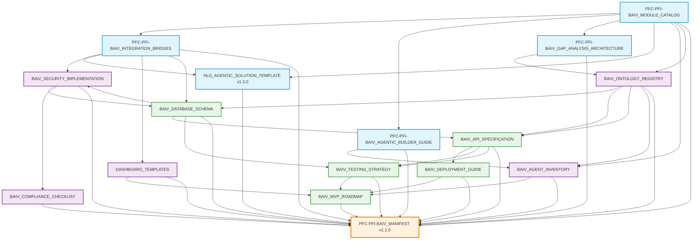
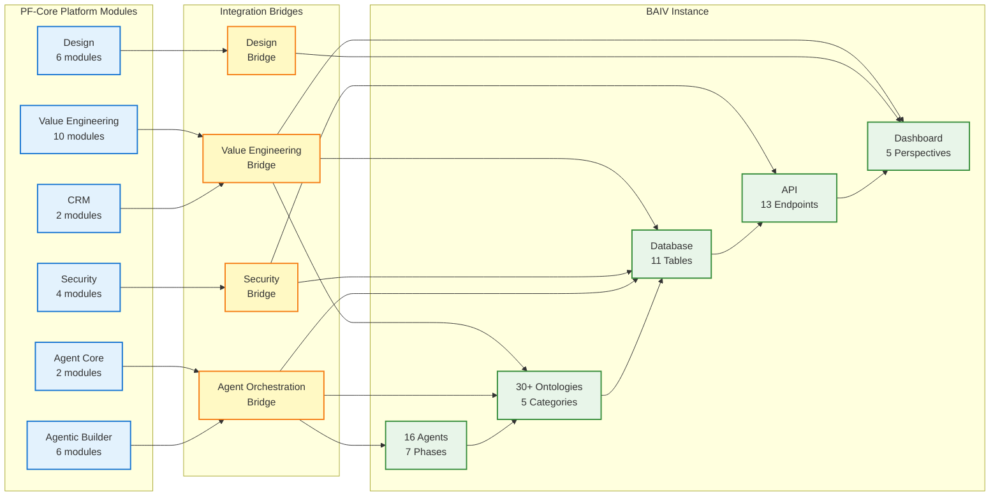
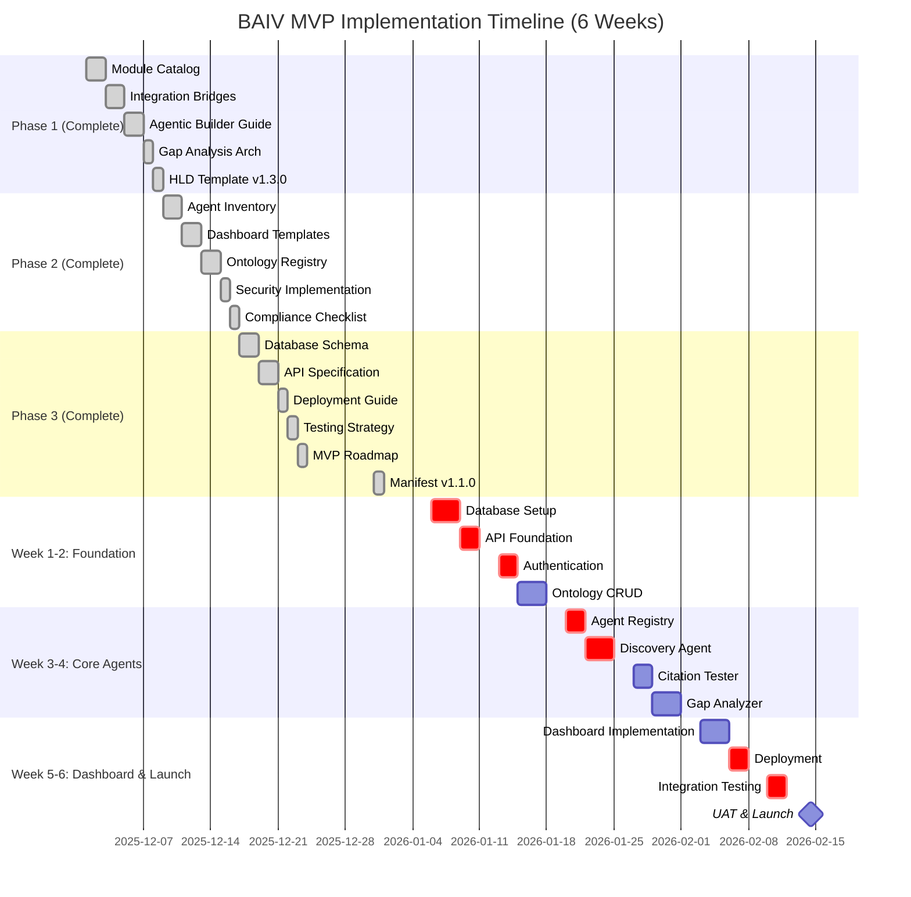
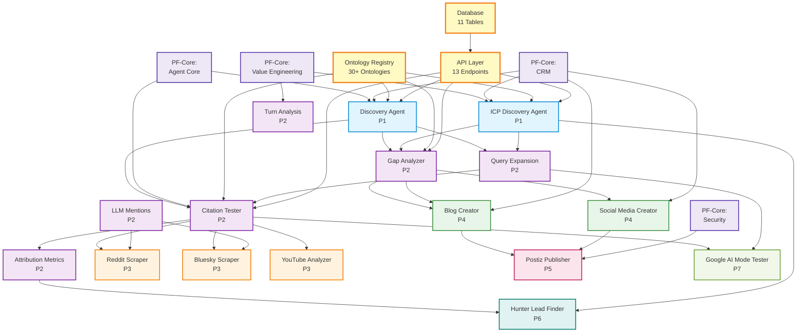

# PFC-PFI-BAIV Artifact Manifest & Traceability Matrix v1.1.0

**Complete documentation manifest with GitHub links and PFC↔BAIV traceability**

| Attribute | Value |
|-----------|-------|
| **Document Version** | 1.1.0 |
| **Date** | December 31, 2025 |
| **Purpose** | Comprehensive manifest and traceability for all PFC-PFI-BAIV artifacts |
| **Status** | 🟢 Active |
| **Repository** | https://github.com/ajrmooreuk/PF-Prototype-Shared |

---

## Executive Summary

This manifest catalogs **15 key artifacts** across 3 implementation phases (Phases 1-3), totaling **16,936 lines** of documentation. It provides direct GitHub links and a traceability matrix showing PF-Core module integration with BAIV capabilities.

**Document Distribution:**
- **Phase 1 (PFC-PFI Integration):** 5 artifacts, 6,517 lines
- **Phase 2 (BAIV Documentation):** 5 artifacts, 7,590 lines
- **Phase 3 (Implementation):** 5 artifacts, 2,829 lines

---

## Table of Contents

1. [Phase 1: PFC-PFI-BAIV Integration](#phase-1-pfc-pfi-baiv-integration)
2. [Phase 2: BAIV-Specific Documentation](#phase-2-baiv-specific-documentation)
3. [Phase 3: Implementation Planning](#phase-3-implementation-planning)
4. [Dependency Diagrams](#dependency-diagrams)
5. [Traceability Matrix](#traceability-matrix)
6. [Version Control History](#version-control-history)
7. [Quick Reference](#quick-reference)

---

## Phase 1: PFC-PFI-BAIV Integration

**Location:** `1 Architecture/0.1 Solution architects/HLD-High-level/`

### 1.1 PFC-PFI-BAIV_MODULE_CATALOG.md
- **Lines:** 1,715
- **Version:** 1.0.0
- **Purpose:** Complete inventory of 30+ PF-Core modules with BAIV mappings
- **GitHub:** [View File](https://github.com/ajrmooreuk/PF-Prototype-Shared/blob/main/1%20Architecture/0.1%20Solution%20architects/HLD-High-level/PFC-PFI-BAIV_MODULE_CATALOG.md)

**Key Contents:**
- 10 Value Engineering modules
- 4 Security modules
- 6 Design modules
- 2 CRM modules
- 2 Agent Core modules
- 6 Agentic Builder modules
- Module dependency graph
- 3-phase implementation priorities

### 1.2 PFC-PFI-BAIV_INTEGRATION_BRIDGES.md
- **Lines:** 1,735
- **Version:** 1.0.0
- **Purpose:** 4 integration bridges connecting PF-Core to BAIV
- **GitHub:** [View File](https://github.com/ajrmooreuk/PF-Prototype-Shared/blob/main/1%20Architecture/0.1%20Solution%20architects/HLD-High-level/PFC-PFI-BAIV_INTEGRATION_BRIDGES.md)

**Key Contents:**
- Value Engineering Bridge
- Security Bridge (RBAC, tenant isolation)
- Design Bridge (Figma integration)
- Agent Orchestration Bridge
- 4-level config hierarchy (Platform → Instance → Tenant → User)
- 6 mermaid diagrams

### 1.3 PFC-PFI-BAIV_AGENTIC_BUILDER_GUIDE.md
- **Lines:** 1,709
- **Version:** 1.0.0
- **Purpose:** Documentation of 6-module meta-agent stack for building agents
- **GitHub:** [View File](https://github.com/ajrmooreuk/PF-Prototype-Shared/blob/main/1%20Architecture/0.1%20Solution%20architects/HLD-High-level/PFC-PFI-BAIV_AGENTIC_BUILDER_GUIDE.md)

**Key Contents:**
- 6 Agentic Builder modules (PFC-only)
- Program Manager, Platform Manager, Product Manager
- Solution Architect, Solution Builder, Test Driven Design
- 7-phase agent build order
- BAIV integration checklist

### 1.4 PFC-PFI-BAIV_GAP_ANALYSIS_ARCHITECTURE.md
- **Lines:** 1,194
- **Version:** 1.0.0
- **Purpose:** Dual-layer gap analysis (platform + product)
- **GitHub:** [View File](https://github.com/ajrmooreuk/PF-Prototype-Shared/blob/main/1%20Architecture/0.1%20Solution%20architects/HLD-High-level/PFC-PFI-BAIV_GAP_ANALYSIS_ARCHITECTURE.md)

**Key Contents:**
- Platform-level gaps (PFC-SpecAgent-Gap-Analysis)
- Product-level gaps (BAIV-Product-Gap-Analysis)
- Gap Analysis Orchestrator pattern
- Complete ontology specs for both layers

### 1.5 HLD_AGENTIC_SOLUTION_TEMPLATE.md
- **Lines:** 164 (additions)
- **Version:** 1.3.0 (updated from 1.2.0)
- **Purpose:** Template updated with PF-Core integration section
- **GitHub:** [View File](https://github.com/ajrmooreuk/PF-Prototype-Shared/blob/main/1%20Architecture/0.1%20Solution%20architects/HLD-High-level/HLD_AGENTIC_SOLUTION_TEMPLATE.md)

**Key Additions:**
- Section 3: Instance Integration Architecture
- PF-Core architecture diagram (30+ modules)
- 4 integration bridges
- 4-step instance implementation pattern
- VE-Business-Models module references

---

## Phase 2: BAIV-Specific Documentation

**Location:** `4 PF-Instances/PF-Instance-BAIV/`

### 2.1 BAIV_AGENT_INVENTORY.md
- **Lines:** 2,369
- **Version:** 1.0.0
- **Purpose:** Complete inventory of 16 primary BAIV agents
- **GitHub:** [View File](https://github.com/ajrmooreuk/PF-Prototype-Shared/blob/main/4%20PF-Instances/PF-Instance-BAIV/BAIV_AGENT_INVENTORY.md)

**Key Contents:**
- 16 agents across 7 implementation phases
- Phase 1: Discovery, ICP Discovery
- Phase 2: Citation Tester, Query Expansion, Gap Analyzer, Turn Analysis, LLM Mentions, Attribution Metrics
- Phase 3: Reddit Scraper, Bluesky Scraper, YouTube Analyzer
- Phase 4: Blog Creator, Social Media Creator
- Phase 5: Postiz Publisher
- Phase 6: Hunter Lead Finder
- Phase 7: Google AI Mode Tester
- 6-week implementation roadmap
- Agent orchestration patterns

### 2.2 DASHBOARD_TEMPLATES.md
- **Lines:** 1,225
- **Version:** 1.0.0
- **Purpose:** 5-Perspective Balanced Scorecard dashboard framework
- **GitHub:** [View File](https://github.com/ajrmooreuk/PF-Prototype-Shared/blob/main/4%20PF-Instances/PF-Instance-BAIV/DASHBOARD_TEMPLATES.md)

**Key Contents:**
- Executive Overview (5 KPIs)
- 5-Perspective BSC: Financial, Customer, Process, Learning, Stakeholder
- 20+ widget specifications (TypeScript interfaces)
- 12-column responsive grid layout
- React + TypeScript component library
- Real-time WebSocket updates

### 2.3 BAIV_ONTOLOGY_REGISTRY.md
- **Lines:** 1,544
- **Version:** 1.0.0
- **Purpose:** Registry of 30+ BAIV ontologies with JSON-LD specs
- **GitHub:** [View File](https://github.com/ajrmooreuk/PF-Prototype-Shared/blob/main/4%20PF-Instances/PF-Instance-BAIV/BAIV_ONTOLOGY_REGISTRY.md)

**Key Contents:**
- Discovery Ontologies (5): Client-Context, Discovery-Report, ICP-Profile
- Analysis Ontologies (8): Citation-Test-Result, RPI-Score, Gap-Analysis
- Content Ontologies (6): Blog-Post, Social-Post, FAQ-Page
- Business Ontologies (6): AI-Visibility-Score, Financial-Metrics
- Operational Ontologies (5): Publishing-Log, Reddit-Mention
- Complete JSON-LD specifications
- Agent binding mappings

### 2.4 BAIV_SECURITY_IMPLEMENTATION.md
- **Lines:** 861
- **Version:** 1.0.0
- **Purpose:** Security architecture, RBAC, and compliance
- **GitHub:** [View File](https://github.com/ajrmooreuk/PF-Prototype-Shared/blob/main/4%20PF-Instances/PF-Instance-BAIV/BAIV_SECURITY_IMPLEMENTATION.md)

**Key Contents:**
- 5-layer defense-in-depth architecture
- 4-tier RBAC (Admin, Manager, Analyst, Viewer)
- 40+ granular permissions
- Row-Level Security (RLS) implementation
- API key management (90/180 day rotation)
- Encryption (AES-256 at rest, TLS 1.3 in transit)
- GDPR compliance patterns
- Comprehensive audit logging

### 2.5 BAIV_COMPLIANCE_CHECKLIST.md
- **Lines:** 747
- **Version:** 1.0.0
- **Purpose:** SOC 2, GDPR, ISO 27001 compliance checklist
- **GitHub:** [View File](https://github.com/ajrmooreuk/PF-Prototype-Shared/blob/main/4%20PF-Instances/PF-Instance-BAIV/BAIV_COMPLIANCE_CHECKLIST.md)

**Key Contents:**
- 85 compliance checkpoints total
- SOC 2 Type II: 45 controls (9 Trust Services Criteria)
- GDPR: 25 requirements (data protection + rights)
- ISO 27001: 15 key controls (14 domains)
- Operational compliance checklists
- Audit preparation guide

---

## Phase 3: Implementation Planning

**Location:** `4 PF-Instances/PF-Instance-BAIV/`

### 3.1 BAIV_DATABASE_SCHEMA.sql
- **Lines:** 395
- **Version:** 1.0.0
- **Purpose:** Simplified PostgreSQL schema with JSONB
- **GitHub:** [View File](https://github.com/ajrmooreuk/PF-Prototype-Shared/blob/main/4%20PF-Instances/PF-Instance-BAIV/BAIV_DATABASE_SCHEMA.sql)

**Key Contents:**
- 11 tables (simplified from original 25)
- Core tables (5): tenants, users, roles, user_tenant_roles, api_keys
- ontology_data table (all ontology instances as JSONB)
- audits table (results in JSONB)
- Agent/execution tables (3): agent_registry, agent_executions, audit_logs
- RLS policies on 6 tenant-scoped tables
- 4 roles + 16 agents seeded

### 3.2 BAIV_API_SPECIFICATION.yaml
- **Lines:** 621
- **Version:** 1.0.0
- **Purpose:** OpenAPI 3.0.3 specification for BAIV MVP
- **GitHub:** [View File](https://github.com/ajrmooreuk/PF-Prototype-Shared/blob/main/4%20PF-Instances/PF-Instance-BAIV/BAIV_API_SPECIFICATION.yaml)

**Key Contents:**
- 13 endpoints (minimal MVP set)
- Auth (2): /auth/login, /auth/me
- Ontology (5): CRUD endpoints with single /ontology resource
- Agents (3): /agents, /agents/{id}/execute, /agents/executions/{id}
- Audits (3): /audits CRUD operations
- JWT authentication
- All schemas leverage JSONB

### 3.3 BAIV_DEPLOYMENT_GUIDE.md
- **Lines:** 644
- **Version:** 1.0.0
- **Purpose:** DigitalOcean deployment guide (no Docker)
- **GitHub:** [View File](https://github.com/ajrmooreuk/PF-Prototype-Shared/blob/main/4%20PF-Instances/PF-Instance-BAIV/BAIV_DEPLOYMENT_GUIDE.md)

**Key Contents:**
- DigitalOcean App Platform setup
- Managed PostgreSQL configuration
- GitHub auto-deploy integration
- Node.js/TypeScript or Python/FastAPI options
- Environment variable setup
- Custom domain configuration
- Monitoring and cost breakdown (~$20/month MVP)

### 3.4 BAIV_TESTING_STRATEGY.md
- **Lines:** 576
- **Version:** 1.0.0
- **Purpose:** Pragmatic testing strategy (70% coverage)
- **GitHub:** [View File](https://github.com/ajrmooreuk/PF-Prototype-Shared/blob/main/4%20PF-Instances/PF-Instance-BAIV/BAIV_TESTING_STRATEGY.md)

**Key Contents:**
- Inverted test pyramid: 50% integration, 20% unit, 30% manual
- Integration test examples (Jest + supertest)
- Unit test examples (JWT, validation)
- Manual testing checklist
- 3 end-to-end scenarios
- GitHub Actions CI/CD config
- Test data fixtures

### 3.5 BAIV_MVP_ROADMAP.md
- **Lines:** 593
- **Version:** 1.0.0
- **Purpose:** 6-week MVP implementation timeline
- **GitHub:** [View File](https://github.com/ajrmooreuk/PF-Prototype-Shared/blob/main/4%20PF-Instances/PF-Instance-BAIV/BAIV_MVP_ROADMAP.md)

**Key Contents:**
- Week 1: Database + API foundation
- Week 2: Authentication + Ontology CRUD
- Week 3: Agent registry + Discovery Agent
- Week 4: Citation Tester + Gap Analyzer
- Week 5: Dashboard + deployment
- Week 6: Testing + launch
- 3 sprints (Weeks 1-2, 3-4, 5-6)
- Resource requirements (~$200/month)
- Risk mitigation strategies

---

## Dependency Diagrams

### 4.1 Document Dependency Flow



### 4.2 PF-Core Module Integration Architecture



### 4.3 Implementation Timeline & Dependencies



### 4.4 Agent Dependency Graph



---

## Traceability Matrix

### PF-Core Module → BAIV Capability Mapping

| PF-Core Module | Type | BAIV Capability | BAIV Artifact | Integration Bridge |
|----------------|------|-----------------|---------------|-------------------|
| **VE-Value-Prop-Canvas** | Value Eng | ICP Profile, Customer Segments | BAIV_ONTOLOGY_REGISTRY (ICP-Profile) | Value Engineering Bridge |
| **VE-Business-Models** | Value Eng | Revenue streams, pricing tiers | DASHBOARD_TEMPLATES (Financial BSC) | Value Engineering Bridge |
| **VE-Product-Market-Fit** | Value Eng | PMF signals (NPS, retention) | DASHBOARD_TEMPLATES (Customer BSC) | Value Engineering Bridge |
| **VE-Pricing-Strategy** | Value Eng | Pricing tier configuration | BAIV_DATABASE_SCHEMA (tenants.tier) | Value Engineering Bridge |
| **SEC-RBAC-Foundation** | Security | 4-tier role model | BAIV_SECURITY_IMPLEMENTATION (RBAC) | Security Bridge |
| **SEC-Multi-Tenant-Isolation** | Security | RLS policies | BAIV_DATABASE_SCHEMA (RLS) | Security Bridge |
| **SEC-Auth-Foundation** | Security | JWT authentication | BAIV_API_SPECIFICATION (/auth) | Security Bridge |
| **SEC-API-Key-Management** | Security | API key lifecycle | BAIV_SECURITY_IMPLEMENTATION (API Keys) | Security Bridge |
| **DSN-Design-System** | Design | Design tokens, spacing | DASHBOARD_TEMPLATES (BAIV tokens) | Design Bridge |
| **DSN-Figma-Bridge** | Design | Figma integration | DASHBOARD_TEMPLATES (Figma refs) | Design Bridge |
| **DSN-Component-Library** | Design | Widget library (20+ widgets) | DASHBOARD_TEMPLATES (Widget lib) | Design Bridge |
| **CRM-Customer-Organization** | CRM | Tenant management | BAIV_DATABASE_SCHEMA (tenants) | Value Engineering Bridge |
| **CRM-Brand-Identity** | CRM | Brand voice, messaging | BAIV_ONTOLOGY_REGISTRY (Universal-Brand) | Value Engineering Bridge |
| **OAA-Agent-Registry** | Agent Core | Agent registration | BAIV_DATABASE_SCHEMA (agent_registry) | Agent Orchestration Bridge |
| **OAA-Ontology-Registry** | Agent Core | Ontology definitions | BAIV_ONTOLOGY_REGISTRY (ontologies table) | Agent Orchestration Bridge |
| **AB-Program-Manager** | Agentic Builder | Program-level orchestration | BAIV_AGENT_INVENTORY (orchestration) | Agent Orchestration Bridge |
| **AB-Platform-Manager** | Agentic Builder | Platform config | BAIV_DEPLOYMENT_GUIDE (env vars) | Agent Orchestration Bridge |
| **AB-Product-Manager** | Agentic Builder | Product requirements | BAIV_AGENT_INVENTORY (agent specs) | Agent Orchestration Bridge |
| **AB-Solution-Architect** | Agentic Builder | Architecture design | BAIV_DATABASE_SCHEMA, BAIV_API_SPECIFICATION | Agent Orchestration Bridge |
| **AB-Solution-Builder** | Agentic Builder | Implementation | BAIV_MVP_ROADMAP (6-week plan) | Agent Orchestration Bridge |
| **AB-Test-Driven-Design** | Agentic Builder | Testing strategy | BAIV_TESTING_STRATEGY | Agent Orchestration Bridge |

### BAIV Agent → PF-Core Module Dependencies

| BAIV Agent | Phase | PF-Core Dependencies | Purpose |
|------------|-------|---------------------|---------|
| **Discovery Agent** | P1 | OAA-Agent-Registry, CRM-Customer-Organization | Client discovery, context creation |
| **ICP Discovery Agent** | P1 | VE-Value-Prop-Canvas, VE-Product-Market-Fit, CRM-Customer-Organization | ICP profiling, customer segmentation |
| **Citation Tester Agent** | P2 | OAA-Agent-Registry, OAA-Ontology-Registry | Multi-platform citation testing |
| **Query Expansion Agent** | P2 | VE-Value-Prop-Canvas (customer pain points) | Query fanout generation (25+ variations) |
| **Gap Analyzer Agent** | P2 | VE-Product-Market-Fit, OAA-Ontology-Registry | Content gap identification, prioritization |
| **Turn Analysis Agent** | P2 | VE-Value-Prop-Canvas (customer journey) | Multi-turn conversation patterns |
| **LLM Mentions Agent** | P2 | OAA-Ontology-Registry | Brand mention discovery |
| **Attribution Metrics Agent** | P2 | VE-Product-Market-Fit, OAA-Ontology-Registry | AI Visibility Score calculation |
| **Blog Creator Agent** | P4 | CRM-Brand-Identity, DSN-Component-Library | Content generation (2500+ words) |
| **Social Media Creator Agent** | P4 | CRM-Brand-Identity, DSN-Design-System | Platform-optimized posts |
| **Postiz Publisher Agent** | P5 | OAA-Agent-Registry, SEC-API-Key-Management | Social media publishing |

### Cross-Document Dependencies

| Document | Depends On | Used By |
|----------|-----------|---------|
| **PFC-PFI-BAIV_MODULE_CATALOG** | - | All integration bridges, all agent specs |
| **PFC-PFI-BAIV_INTEGRATION_BRIDGES** | MODULE_CATALOG | SECURITY_IMPLEMENTATION, DEPLOYMENT_GUIDE |
| **BAIV_DATABASE_SCHEMA** | ONTOLOGY_REGISTRY, INTEGRATION_BRIDGES | API_SPECIFICATION, SECURITY_IMPLEMENTATION |
| **BAIV_API_SPECIFICATION** | DATABASE_SCHEMA, ONTOLOGY_REGISTRY | DEPLOYMENT_GUIDE, TESTING_STRATEGY |
| **BAIV_AGENT_INVENTORY** | ONTOLOGY_REGISTRY, MODULE_CATALOG | MVP_ROADMAP, TESTING_STRATEGY |
| **BAIV_SECURITY_IMPLEMENTATION** | DATABASE_SCHEMA, INTEGRATION_BRIDGES (Security) | COMPLIANCE_CHECKLIST, DEPLOYMENT_GUIDE |
| **BAIV_ONTOLOGY_REGISTRY** | MODULE_CATALOG, AGENT_INVENTORY | DATABASE_SCHEMA, API_SPECIFICATION |
| **DASHBOARD_TEMPLATES** | ONTOLOGY_REGISTRY, INTEGRATION_BRIDGES (Design) | MVP_ROADMAP (Week 5) |
| **BAIV_TESTING_STRATEGY** | API_SPECIFICATION, DATABASE_SCHEMA | MVP_ROADMAP (Week 6) |
| **BAIV_MVP_ROADMAP** | All Phase 3 artifacts | Implementation execution |

---

## Version Control History

### 6.1 Document Versions

| Version | Date | Changes | Author |
|---------|------|---------|--------|
| **1.1.0** | 2025-12-31 | Added 4 Mermaid dependency diagrams, version control section, updated TOC | BAIV Team + Warp |
| **1.0.0** | 2025-12-31 | Initial manifest with 15 artifacts, traceability matrices, GitHub links | BAIV Team + Warp |

### 6.2 Referenced Document Versions

**Phase 1 Documents:**
- PFC-PFI-BAIV_MODULE_CATALOG.md - v1.0.0
- PFC-PFI-BAIV_INTEGRATION_BRIDGES.md - v1.0.0
- PFC-PFI-BAIV_AGENTIC_BUILDER_GUIDE.md - v1.0.0
- PFC-PFI-BAIV_GAP_ANALYSIS_ARCHITECTURE.md - v1.0.0
- HLD_AGENTIC_SOLUTION_TEMPLATE.md - v1.3.0 (updated from v1.2.0)

**Phase 2 Documents:**
- BAIV_AGENT_INVENTORY.md - v1.0.0
- DASHBOARD_TEMPLATES.md - v1.0.0
- BAIV_ONTOLOGY_REGISTRY.md - v1.0.0
- BAIV_SECURITY_IMPLEMENTATION.md - v1.0.0
- BAIV_COMPLIANCE_CHECKLIST.md - v1.0.0

**Phase 3 Documents:**
- BAIV_DATABASE_SCHEMA.sql - v1.0.0
- BAIV_API_SPECIFICATION.yaml - v1.0.0
- BAIV_DEPLOYMENT_GUIDE.md - v1.0.0
- BAIV_TESTING_STRATEGY.md - v1.0.0
- BAIV_MVP_ROADMAP.md - v1.0.0

### 6.3 Change Control Policy

**Version Numbering:** Semantic versioning (MAJOR.MINOR.PATCH)
- **MAJOR:** Breaking changes, architectural shifts, major scope changes
- **MINOR:** New sections, diagrams, or significant content additions
- **PATCH:** Typo fixes, clarifications, minor updates

**Review Process:**
1. All document changes require version increment
2. Major version changes require architecture review
3. All commits include co-author attribution: `Co-Authored-By: Warp <agent@warp.dev>`
4. GitHub serves as source of truth for all versions

**Related Registry Entries:**
- System prompts and artifacts should be registered as change-controlled entities
- Ontologies and documentation follow same version control standards
- Registry entity: `PF-Document-Control` manages all artifact versioning

---

## Quick Reference

### Key Statistics

| Metric | Value |
|--------|-------|
| Total Artifacts | 15 |
| Total Lines | 16,936 |
| PF-Core Modules Referenced | 22 |
| BAIV Agents Documented | 16 |
| Integration Bridges | 4 |
| Database Tables | 11 |
| API Endpoints | 13 |
| Ontologies Registered | 30+ |
| Implementation Timeline | 6 weeks |

### Document Versions

All documents are version **1.0.0** as of December 31, 2025.

### GitHub Repository Structure

```
PF-Prototype-Shared/
├── 1 Architecture/
│   └── 0.1 Solution architects/
│       └── HLD-High-level/
│           ├── PFC-PFI-BAIV_MODULE_CATALOG.md
│           ├── PFC-PFI-BAIV_INTEGRATION_BRIDGES.md
│           ├── PFC-PFI-BAIV_AGENTIC_BUILDER_GUIDE.md
│           ├── PFC-PFI-BAIV_GAP_ANALYSIS_ARCHITECTURE.md
│           └── HLD_AGENTIC_SOLUTION_TEMPLATE.md (v1.3.0)
└── 4 PF-Instances/
    └── PF-Instance-BAIV/
        ├── BAIV_AGENT_INVENTORY.md
        ├── DASHBOARD_TEMPLATES.md
        ├── BAIV_ONTOLOGY_REGISTRY.md
        ├── BAIV_SECURITY_IMPLEMENTATION.md
        ├── BAIV_COMPLIANCE_CHECKLIST.md
        ├── BAIV_DATABASE_SCHEMA.sql
        ├── BAIV_API_SPECIFICATION.yaml
        ├── BAIV_DEPLOYMENT_GUIDE.md
        ├── BAIV_TESTING_STRATEGY.md
        ├── BAIV_MVP_ROADMAP.md
        └── PFC-PFI-BAIV_MANIFEST.md (this file)
```

### Implementation Phases

**Phase 1: PFC-PFI Integration (Complete)**
- Module catalog
- Integration bridges
- Agentic builder guide
- Gap analysis architecture
- HLD template update

**Phase 2: BAIV Documentation (Complete)**
- Agent inventory
- Dashboard templates
- Ontology registry
- Security implementation
- Compliance checklist

**Phase 3: Implementation Planning (Complete)**
- Database schema
- API specification
- Deployment guide
- Testing strategy
- MVP roadmap

**Next: Phase 4 - MVP Development (6 weeks)**
- Follow BAIV_MVP_ROADMAP.md
- Week 1: Foundation
- Week 2: API + Auth
- Week 3-4: Core agents
- Week 5-6: Dashboard + launch

---

## Summary

This manifest provides complete traceability between **PF-Core platform modules** and **BAIV instance capabilities**. All 15 artifacts are version-controlled, documented, and accessible via direct GitHub links.

**Key Integration Points:**
- 4 Integration Bridges connect PF-Core to BAIV
- 22 PF-Core modules leveraged by BAIV
- 16 BAIV agents mapped to platform modules
- 30+ ontologies with complete specs
- 6-week implementation timeline ready

**Ready for Development:** All planning artifacts complete. Begin Week 1, Day 1 of MVP implementation.

---

**Document Version:** 1.1.0  
**Status:** 🟢 Active  
**Last Updated:** December 31, 2025  
**Repository:** https://github.com/ajrmooreuk/PF-Prototype-Shared  
**Maintained By:** BAIV Product Team

**Version History:**
- v1.1.0 (2025-12-31): Added dependency diagrams and version control
- v1.0.0 (2025-12-31): Initial release
