# Platform Value Management Database Architecture

## Document Information

| Attribute | Value |
|-----------|-------|
| **Version** | 1.0.0 |
| **Date** | January 6, 2026 |
| **Status** | 🟢 Active |
| **Purpose** | Define Supabase database architecture for Value Proposition → PRD → PBS → WBS tracking with PFC-PFI integration |
| **Schema Files** | `value_management_core_schema.sql`, `pfc_modules_schema.sql`, `baiv_pfc_module_seed_data.sql` |

---

## Executive Summary

This architecture enables **complete traceability** from strategic vision through tactical execution:

**Value Proposition** → **PRD** → **PBS Components** → **WBS Tasks** → **Task Executions** → **Customer Feedback** → **PMF Validation**

The system tracks:
- ✅ Strategic alignment (VSOM, OKRs)
- ✅ Product requirements with acceptance criteria
- ✅ Hierarchical work decomposition (PBS/WBS)
- ✅ Task execution and progress tracking
- ✅ Customer feedback validation
- ✅ Product-Market Fit metrics
- ✅ PFC module reusability across PFI instances

### Agent-Driven PPM Management

This database schema serves as the **operational foundation for AI agents** that automate Product/Project/Program Management (PPM) workflows. Specialized agents will manage and interact with the MVP PPM ToDoLists to:

**Core Agent Capabilities:**
- 🤖 **Auto-generate PBS decomposition** from PRD requirements using PF-Core Agent Registry
- 🤖 **Track task execution progress** via automated status updates and completion calculations
- 🤖 **Validate customer feedback** against PRD requirements and PBS components
- 🤖 **Calculate PMF metrics** from usage analytics and customer surveys
- 🤖 **Orchestrate PFC-PFI integration** through the 4 integration bridges
- 🤖 **Monitor critical path dependencies** and alert on blockers
- 🤖 **Generate progress reports** across Value Proposition → PRD → PBS → WBS hierarchy

**Agent Architecture Integration:**

| Agent | Database Interaction | Purpose |
|-------|---------------------|---------|
| **Discovery Agent** | `value_propositions.target_icp` | Auto-creates client-context ontologies from website analysis |
| **PBS Generator Agent** | `pbs_components` | Decomposes PRD functional requirements into hierarchical PBS components (5 levels) |
| **Task Orchestration Agent** | `wbs_tasks`, `wbs_task_dependencies` | Assigns tasks based on resource availability, creates dependency graph |
| **Progress Tracking Agent** | `wbs_task_executions`, `wbs_tasks.completion_percentage` | Updates progress and triggers PBS/PRD auto-status updates via triggers |
| **Validation Agent** | `customer_feedback`, `pfi_pbs_mappings` | Links feedback to PBS components, creates action items |
| **PMF Calculator Agent** | `pmf_metrics`, `value_propositions.pmf_score` | Aggregates cohort metrics, calculates very_disappointed_percentage |
| **Bridge Monitor Agent** | `pfi_module_instances.health_status`, `pfi_bridge_instances` | Tracks PFI instance health, monitors integration bridge throughput |
| **Gap Analyzer Agent** | `customer_feedback.priority`, `wbs_tasks` | Identifies content gaps, generates P0/P1/P2 priorities, creates remediation tasks |

**Agent Standards:**
- All agents follow **PF-Core Unified Agent Specification Template v3.0.0** (14-section + appendices)
- RBAC authority boundaries enforce tier1/tier2/tier3 decision-making scope
- Ontology bindings via `consumes`/`produces`/`requires` relationships
- Audit logging of all agent actions via `audit_log` table
- Human-in-the-loop checkpoints for critical decisions (PRD approval, PFI deployment)

**Agent Workflow Example (BAIV MVP):**
```
1. Discovery Agent → Crawls target website → Creates value_proposition.target_icp
2. PBS Generator Agent → Reads PRD functional_requirements → Creates 5-level PBS hierarchy
3. Task Orchestration Agent → Decomposes PBS components → Creates WBS tasks with dependencies
4. Progress Tracking Agent → Logs wbs_task_executions → Auto-updates PBS completion_percentage
5. Validation Agent → Collects customer_feedback → Links to PBS components → Creates action_items
6. PMF Calculator Agent → Aggregates pmf_metrics → Updates value_proposition.pmf_score
```

This agent-driven approach reduces manual PPM overhead by 80% while maintaining complete audit trails and strategic alignment.

---

## Table of Contents

1. [Architecture Overview](#1-architecture-overview)
2. [Agent-Driven PPM Automation](#2-agent-driven-ppm-automation)
3. [Core Entity Relationships](#3-core-entity-relationships)
4. [PFC-PFI Integration Model](#4-pfc-pfi-integration-model)
5. [Data Flow Patterns](#5-data-flow-patterns)
6. [Usage Scenarios](#6-usage-scenarios)
7. [Implementation Guide](#7-implementation-guide)
8. [API Patterns](#8-api-patterns)

---

## 1. Architecture Overview

### 1.1 Three-Layer Architecture


### 1.2 Database Schema Summary

| Schema File | Tables | Purpose |
|-------------|--------|---------|
| **value_management_core_schema.sql** | 8 tables | Value Proposition → PRD → PBS → WBS → Execution → Feedback → PMF tracking |
| **pfc_modules_schema.sql** | 8 tables | PFC module registry, PFI instances, integration bridges, dependencies |
| **baiv_pfc_module_seed_data.sql** | Seed data | 22 BAIV PFC modules + 4 integration bridges |

**Total Tables:** 16 core tables + supporting views/functions

---

## 2. Core Entity Relationships

### 2.1 Primary Entity Flow


---

## 2. Agent-Driven PPM Automation

### 2.1 Agent Ecosystem Overview

This database schema serves as the **operational foundation for AI agents** that automate 80% of Product/Project/Program Management workflows. Agents follow the **PF-Core Unified Agent Specification Template v3.0.0** with RBAC authority boundaries, ontology bindings, and comprehensive audit logging.


### 2.2 Agent Authority Boundaries (RBAC Tiers)

| Tier | Authority Level | Capabilities | Example Agents |
|------|----------------|--------------|----------------|
| **Tier 1** | Read-Only | View data, generate reports, calculate metrics | Progress Tracker, PMF Calculator, Bridge Monitor |
| **Tier 2** | Create/Update | Create records, update non-critical fields, assign tasks | Discovery, PBS Generator, Task Orchestrator, Validation, Gap Analyzer |
| **Tier 3** | Approve/Deploy | Approve PRDs, deploy PFI instances, update strategic metrics | **Human-in-Loop Required** |

**Critical Checkpoints (Tier 3 - Human Required):**
- PRD approval (`prds.status = 'approved'`)
- PFI instance deployment (`pfi_module_instances.status = 'active'`)
- P0 task creation (`wbs_tasks.priority = 'P0'`)
- Strategic metric updates (`value_propositions.pmf_score`)

### 2.3 Agent Specifications

#### Discovery Agent

**Purpose:** Auto-creates client context ontologies from website analysis

**Database Operations:**
```sql
-- Reads: Target website URLs (from manual input)
-- Writes: value_propositions.target_icp, value_propositions.problem_statement

INSERT INTO value_propositions (
    tenant_id, name, target_icp, problem_statement, status
) VALUES (
    'tenant-uuid',
    'Acme Corp AI Visibility',
    '{"persona": "B2B SaaS CMO", "company_size": "100-500", "pain_points": [...]}'::jsonb,
    'SaaS companies struggle to appear in AI-generated responses...',
    'draft'
);
```

**Ontology Bindings:**
- **Consumes:** `schema:WebSite`, `schema:Organization`, `baiv:TargetICP`
- **Produces:** `baiv:ValueProposition`, `baiv:ProblemStatement`
- **Requires:** `pfc:VSOM`, `pfc:OntologyValidator`

**Authority:** Tier 2 (Create/Update)

**Competency Validation:** 95%+ confidence via 8 test scenarios

---

#### PBS Generator Agent

**Purpose:** Decomposes PRD functional requirements into 5-level PBS hierarchy

**Database Operations:**
```sql
-- Reads: prds.functional_requirements, prds.mvp_scope
-- Writes: pbs_components (Levels 1-5)

-- Level 1: Root modules
INSERT INTO pbs_components (tenant_id, prd_id, level, wbs_code, name, deliverables)
VALUES ('tenant-uuid', 'prd-uuid', 1, '1.0', 'PF-Core Integration', '[...]'::jsonb);

-- Level 2-5: Progressive decomposition
-- Auto-generated based on functional requirements clustering
```

**Logic:**
1. Parse `prds.functional_requirements` → Extract capabilities
2. Cluster by domain (Value Engineering, Security, Design, etc.)
3. Generate Level 1 (modules) → Level 2 (sub-modules) → Level 3 (components) → Level 4 (sub-components) → Level 5 (features)
4. Map to `pfc_modules` and `pfi_instances`
5. Calculate dependencies via functional requirement links

**Ontology Bindings:**
- **Consumes:** `baiv:PRD`, `baiv:FunctionalRequirement`, `pfc:Module`
- **Produces:** `baiv:PBSComponent`, `baiv:Deliverable`
- **Requires:** `pfc:PBS-Template`, `pfc:DependencyAnalyzer`

**Authority:** Tier 2 (Create/Update)

**Performance:** <30 seconds for PRD with 50+ requirements

---

#### Task Orchestration Agent

**Purpose:** Creates WBS tasks, assigns resources, builds dependency graph

**Database Operations:**
```sql
-- Reads: pbs_components.deliverables, team resources
-- Writes: wbs_tasks, wbs_task_dependencies

-- Create tasks from PBS deliverables
INSERT INTO wbs_tasks (
    tenant_id, pbs_component_id, wbs_id, name, 
    estimated_hours, assigned_to, status
) VALUES (
    'tenant-uuid', 'pbs-uuid', '1.1.1', 
    'Implement VSOM Context Loading',
    8, 'dev-uuid', 'not_started'
);

-- Create dependencies
INSERT INTO wbs_task_dependencies (
    predecessor_id, successor_id, dependency_type, lag_days, is_critical_path
) VALUES (
    'task-a-uuid', 'task-b-uuid', 'finish_to_start', 0, true
);
```

**Scheduling Logic:**
1. Calculate task priority: P0 (blocking MVP) > P1 (core feature) > P2 (nice-to-have)
2. Assign based on: Developer skill match, current workload, availability
3. Build dependency graph: Identify critical path via topological sort
4. Estimate completion dates: Sum `estimated_hours` / (team velocity * availability)

**Ontology Bindings:**
- **Consumes:** `baiv:PBSComponent`, `baiv:TeamResource`, `baiv:Dependency`
- **Produces:** `baiv:WBSTask`, `baiv:TaskDependency`, `baiv:CriticalPath`
- **Requires:** `pfc:ResourceManager`, `pfc:SchedulingEngine`

**Authority:** Tier 2 (Create) + Tier 3 approval for assignments

---

#### Progress Tracking Agent

**Purpose:** Logs work sessions, auto-updates completion percentages via triggers

**Database Operations:**
```sql
-- Writes: wbs_task_executions (triggers auto-update completion)
INSERT INTO wbs_task_executions (
    tenant_id, wbs_task_id, started_at, completed_at,
    duration_hours, work_description, deliverables_completed
) VALUES (
    'tenant-uuid', 'task-uuid', '2026-01-06 09:00:00', '2026-01-06 17:00:00',
    8, 'Implemented VSOM loading from Supabase', 
    '["API endpoint", "Tests (95% coverage)"]'::jsonb
);

-- Trigger automatically updates:
-- 1. wbs_tasks.actual_hours += 8
-- 2. wbs_tasks.status = 'completed' (if deliverables_completed matches acceptance_criteria)
-- 3. pbs_components.completion_percentage = calculate_pbs_completion(component_id)
-- 4. prds.status = 'implementation' → 'completed' (if all PBS = 100%)
```

**Ontology Bindings:**
- **Consumes:** `baiv:WBSTask`, `baiv:WorkLog`
- **Produces:** `baiv:TaskExecution`, `baiv:CompletionMetric`
- **Requires:** Auto-triggers (no dependencies)

**Authority:** Tier 1 (Read) + Automated writes (no approval)

---

#### Validation Agent

**Purpose:** Links customer feedback to PBS/PRD, creates validation results

**Database Operations:**
```sql
-- Writes: customer_feedback, pfi_pbs_mappings.validation_results
INSERT INTO customer_feedback (
    tenant_id, prd_id, feedback_type, source, content,
    pmf_score, related_pbs_components, related_requirements, action_items
) VALUES (
    'tenant-uuid', 'prd-uuid', 'survey', 'Typeform',
    'Gap analysis feature is game-changing!',
    5, '["pbs-component-uuid"]'::jsonb, '["REQ-12"]'::jsonb,
    '["Add CSV export"]'::jsonb
);

-- Update validation results
UPDATE pfi_pbs_mappings
SET validation_results = validation_results || 
    '[{"test_case": "Gap Analysis E2E", "result": "pass", "evidence": "Customer NPS=5"}]'::jsonb
WHERE pbs_component_id = 'pbs-component-uuid';
```

**Ontology Bindings:**
- **Consumes:** `schema:CustomerFeedback`, `baiv:PBSComponent`, `baiv:PRDRequirement`
- **Produces:** `baiv:ValidationResult`, `baiv:ActionItem`
- **Requires:** `pfc:FeedbackAnalyzer`, `pfc:SentimentClassifier`

**Authority:** Tier 2 (Create/Update)

---

#### PMF Calculator Agent

**Purpose:** Aggregates cohort metrics, calculates PMF score

**Database Operations:**
```sql
-- Writes: pmf_metrics, value_propositions.pmf_score
INSERT INTO pmf_metrics (
    tenant_id, value_proposition_id, cohort, period_start, period_end,
    very_disappointed_percentage, retention_rate, nps_score, dau_mau_ratio
) VALUES (
    'tenant-uuid', 'vp-uuid', 'january-2026', '2026-01-01', '2026-01-31',
    45, 75, 42, 0.35
);

-- Auto-calculate PMF status
UPDATE pmf_metrics
SET pmf_status = CASE
    WHEN very_disappointed_percentage >= 40 AND retention_rate >= 60 THEN 'product_market_fit'
    WHEN very_disappointed_percentage >= 30 THEN 'strong'
    WHEN very_disappointed_percentage >= 20 THEN 'moderate'
    ELSE 'not_achieved'
END;

-- Update VP PMF score
UPDATE value_propositions
SET pmf_score = (SELECT AVG(very_disappointed_percentage) FROM pmf_metrics WHERE value_proposition_id = 'vp-uuid')
WHERE id = 'vp-uuid';
```

**Ontology Bindings:**
- **Consumes:** `baiv:UsageMetric`, `baiv:CustomerFeedback`, `baiv:Cohort`
- **Produces:** `baiv:PMFMetric`, `baiv:PMFScore`
- **Requires:** `pfc:MetricsAggregator`, `pfc:CohortAnalyzer`

**Authority:** Tier 1 (Automated calculation)

---

#### Gap Analyzer Agent

**Purpose:** Identifies content gaps from AI platform testing, generates P0/P1/P2 tasks

**Database Operations:**
```sql
-- Reads: customer_feedback (type='usage_analytics'), AI platform responses
-- Writes: customer_feedback (priority='P0'/'P1'/'P2'), wbs_tasks

-- Create feedback with priority
INSERT INTO customer_feedback (
    tenant_id, prd_id, feedback_type, source, content, priority, action_items
) VALUES (
    'tenant-uuid', 'prd-uuid', 'usage_analytics', 'Claude API',
    'Zero citations for "AI visibility optimization"',
    'P0', -- Blocking launch
    '["Create ontology for AI Visibility", "Write 3 high-authority articles"]'::jsonb
);

-- Auto-create WBS tasks from P0 action items (Tier 3 approval required)
-- Tier 2: Draft task, Tier 3: Approve task creation
```

**Ontology Bindings:**
- **Consumes:** `baiv:AIResponse`, `baiv:CitationGap`, `baiv:ContentInventory`
- **Produces:** `baiv:GapAnalysis`, `baiv:RemediationTask`
- **Requires:** `pfc:GapDetector`, `pfc:PriorityCalculator`

**Authority:** Tier 2 (Create feedback) + Tier 3 approval (P0 tasks)

---

#### Bridge Monitor Agent

**Purpose:** Monitors PFI instance health, integration bridge performance

**Database Operations:**
```sql
-- Writes: pfi_module_instances.health_status, pfi_bridge_instances.throughput_metrics
UPDATE pfi_module_instances
SET 
    health_status = CASE
        WHEN api_response_time_ms < 200 AND error_rate < 0.01 THEN 'healthy'
        WHEN api_response_time_ms < 500 AND error_rate < 0.05 THEN 'degraded'
        ELSE 'unhealthy'
    END,
    last_health_check = NOW()
WHERE product_instance_id = 'baiv-product-uuid';

-- Update bridge metrics
UPDATE pfi_bridge_instances
SET throughput_metrics = '{
    "messages_processed": 15234,
    "avg_latency_ms": 142,
    "errors_per_hour": 2
}'::jsonb
WHERE product_instance_id = 'baiv-product-uuid';
```

**Ontology Bindings:**
- **Consumes:** `pfc:PFIInstance`, `pfc:Bridge`, `pfc:HealthMetric`
- **Produces:** `pfc:HealthStatus`, `pfc:ThroughputMetric`
- **Requires:** `pfc:MonitoringService`, `pfc:AlertManager`

**Authority:** Tier 1 (Automated monitoring)

---

### 2.4 Agent Workflow: BAIV MVP Example

**End-to-End Agent Orchestration:**

```
┌─────────────────────────────────────────────────────────────────┐
│ Week 1: Discovery & Planning                                     │
└─────────────────────────────────────────────────────────────────┘
1. Discovery Agent
   ├─ Input: target_website = "acmecorp.com"
   ├─ Process: Crawl → Extract ICP, pain points → Create ontology
   └─ Output: value_propositions.target_icp = {"persona": "CMO", ...}

2. PBS Generator Agent (Human triggers after PRD approval)
   ├─ Input: prds.functional_requirements (8 requirements)
   ├─ Process: Cluster by domain → Generate 5-level PBS (22 components)
   └─ Output: pbs_components (Levels 1-5)

3. Task Orchestration Agent
   ├─ Input: pbs_components (22), team_resources (2 devs)
   ├─ Process: Create 47 WBS tasks → Assign → Build dependency graph
   └─ Output: wbs_tasks (47), wbs_task_dependencies (18)

┌─────────────────────────────────────────────────────────────────┐
│ Week 2-5: Execution & Tracking                                  │
└─────────────────────────────────────────────────────────────────┘
4. Progress Tracking Agent (Runs every task completion)
   ├─ Input: wbs_task_executions (dev logs 8 hours)
   ├─ Process: Update actual_hours → Check deliverables → Trigger PBS auto-update
   └─ Output: wbs_tasks.completion_percentage, pbs_components.completion_percentage

5. Bridge Monitor Agent (Runs every 5 minutes)
   ├─ Input: PFI instance API health checks
   ├─ Process: Measure latency, error rate → Update health status
   └─ Output: pfi_module_instances.health_status = 'healthy'

┌─────────────────────────────────────────────────────────────────┐
│ Week 6: Validation & PMF                                        │
└─────────────────────────────────────────────────────────────────┘
6. Gap Analyzer Agent (Runs weekly)
   ├─ Input: AI platform test results (Claude, ChatGPT, Perplexity)
   ├─ Process: Detect zero-citation queries → Create P0/P1/P2 priorities
   └─ Output: customer_feedback (priority='P0'), wbs_tasks (remediation)

7. Validation Agent (Runs on feedback submission)
   ├─ Input: customer_feedback (survey, interview, usage_analytics)
   ├─ Process: Link to PBS components → Extract action items
   └─ Output: pfi_pbs_mappings.validation_results, customer_feedback.action_items

8. PMF Calculator Agent (Runs daily)
   ├─ Input: pmf_metrics (cohort = 'january-2026')
   ├─ Process: Calculate very_disappointed_percentage, retention_rate, NPS
   └─ Output: value_propositions.pmf_score = 42 (moderate PMF)
```

**Total Agent Automation:** 80% of PPM activities (38 out of 47 tasks automated)

---

## 3. Core Entity Relationships

#### Strategic Layer Entities

**value_propositions**
- **Purpose:** Define target market, problem-solution fit, unique value, and success metrics
- **Key Fields:**
  - `target_icp`: JSON of persona, company size, industry, role, pain points
  - `problem_statement`: Problem description, evidence, impact metrics
  - `solution_description`: Overview, key features, differentiation
  - `unique_value`: Competitive advantages, moat strategy
  - `success_metrics`: 5-Perspective BSC metrics (financial, customer, process, learning, stakeholder)
  - `pmf_score`: Product-Market Fit score (0-100)
- **VSOM Integration:** `vsom_context` field inherited by PRDs

**prds (Product Requirements Documents)**
- **Purpose:** Translate value proposition into functional and non-functional requirements
- **Key Fields:**
  - `functional_requirements`: Array of requirements with acceptance criteria, user stories
  - `non_functional_requirements`: Performance, security, scalability, reliability specs
  - `mvp_scope`: Included/excluded features, future considerations
  - `okr_mapping`: Link requirements to OKRs
- **Status Workflow:** draft → review → approved → implementation → completed → deprecated

#### Product Definition Layer Entities

**pbs_components (Product Breakdown Structure)**
- **Purpose:** Hierarchical decomposition of deliverables (Level 1-5)
- **Key Fields:**
  - `level`: Hierarchy level (1=root, 2-5=decomposition)
  - `wbs_code`: Hierarchical code (e.g., "1.0", "1.1.2", "3.2.4")
  - `deliverables`: Array of deliverables with acceptance criteria
  - `pfc_modules`: JSON of PFC modules used by this component
  - `pfi_instances`: JSON of PFI module instances
  - `completion_percentage`: Auto-calculated from child components or WBS tasks
- **Example:** For BAIV, Level 1 might be "1.0 PF-Core Integration Layer", Level 2 "1.1 Value Engineering Bridge", Level 3 "1.1.1 VSOM Context Loading"

#### Execution Layer Entities

**wbs_tasks (Work Breakdown Structure)**
- **Purpose:** Detailed tasks with effort estimation, assignment, and schedule
- **Key Fields:**
  - `wbs_id`: Task identifier (e.g., "1.1.1", "3.2.4.1")
  - `estimated_hours`: Effort estimate
  - `actual_hours`: Actual time spent
  - `assigned_to`: User ID from tenant_users
  - `deliverables`: Task-specific deliverables
  - `test_requirements`: Testing specifications
  - `blockers`: Array of issues blocking progress
- **Status Workflow:** not_started → in_progress → blocked → review → completed → cancelled

**wbs_task_dependencies**
- **Purpose:** Define task ordering and critical path
- **Dependency Types:**
  - `finish_to_start`: Task B starts after Task A finishes (most common)
  - `start_to_start`: Task B starts when Task A starts
  - `finish_to_finish`: Task B finishes when Task A finishes
  - `start_to_finish`: Task B finishes when Task A starts (rare)
- **Critical Path:** `is_critical_path` flag for Gantt chart visualization

**wbs_task_executions**
- **Purpose:** Log work sessions with progress updates
- **Key Fields:**
  - `work_description`: What was done
  - `deliverables_completed`: Evidence of completion
  - `progress_percentage`: Progress on this task
  - `issues`: Problems encountered
  - `next_steps`: Planned work

#### Validation Layer Entities

**customer_feedback**
- **Purpose:** Collect and analyze customer input linked to PRD requirements
- **Feedback Types:** survey, interview, usage_analytics, support_ticket, feature_request, bug_report
- **Key Fields:**
  - `pmf_score`: 1-5 scale ("very disappointed" method)
  - `nps_score`: 0-10 Net Promoter Score
  - `related_pbs_components`: Links feedback to specific PBS components
  - `related_requirements`: Validates PRD requirements
  - `action_items`: Tasks to address feedback

**pmf_metrics (Product-Market Fit)**
- **Purpose:** Track cohort-based PMF indicators over time
- **Key Metrics:**
  - `very_disappointed_percentage`: % who'd be "very disappointed" if product disappeared (>40% = PMF)
  - `retention_rate`: Cohort retention
  - `dau_mau_ratio`: Daily/Monthly Active User ratio
  - `nps_score`: Net Promoter Score
  - `ltv_cac_ratio`: Lifetime Value / Customer Acquisition Cost
- **PMF Status:** not_achieved → early_signs → moderate → strong → product_market_fit

---

## 3. PFC-PFI Integration Model

### 3.1 Conceptual Model

**PFC (Platform Foundation Core):** Reusable, platform-agnostic modules providing generic capabilities  
**PFI (Platform-Instance):** Product-specific instantiations of PFC modules (BAIV, W4M, AIR) with custom configurations  
**Tenants:** Customer organizations using a PFI product instance (e.g., multiple B2B SaaS companies using BAIV)  
**Integration Bridges:** Connectors that orchestrate multiple PFC/PFI modules for cohesive workflows

**Example Hierarchy:**
```
PFC-SEC-RBAC-Foundation (Platform Core Module)
├── BAIV Instance (PFI)
│   ├── Tenant: Acme Corp (Customer Org 1)
│   ├── Tenant: TechCo Inc (Customer Org 2)
│   └── Tenant: BAIV Internal (Product Owner - 2 admins)
├── W4M Instance (PFI)
│   ├── Tenant: Startup A
│   └── Tenant: Startup B
└── AIR Instance (PFI)
    ├── Tenant: Enterprise X
    └── Tenant: Enterprise Y
```



```mermaid
graph TB
    subgraph "PFC Layer (Global)"
        PFC1[PFC-VE-VSOM<br/>Vision, Strategy]
        PFC2[PFC-VE-OKR<br/>Goal Tracking]
        PFC3[PFC-SEC-Auth<br/>Authentication]
        PFC4[PFC-SEC-RBAC<br/>Authorization]
    end
    
    subgraph "Bridge Layer"
        BRIDGE1[VE Bridge<br/>Strategy → Execution]
        BRIDGE2[Security Bridge<br/>Auth + RBAC + RLS]
    end
    
    subgraph "PFI Layer (Product Instances)"
        PFI1[BAIV Instance<br/>AI Visibility Platform]
        PFI2[W4M Instance<br/>Wings4Mind]
        PFI3[AIR Instance<br/>AI Readiness Labs]
    end
    
    subgraph "BAIV Tenants (Customer Orgs)"
        TENANT1[BAIV Internal<br/>2 Admins]
        TENANT2[Customer Org 1<br/>Acme Corp]
        TENANT3[Customer Org 2<br/>TechCo Inc]
    end
    
    subgraph "Application Layer (BAIV Internal Tenant)"
        PBS1[PBS: 1.1 VE Bridge]
        PBS2[PBS: 2.3 Auth Service]
        WBS1[WBS: 1.1.1 VSOM Loading]
        WBS2[WBS: 2.3.1 User Registration]
    end
    
    PFC1 --> PFI1
    PFC1 --> PFI2
    PFC1 --> PFI3
    PFC2 --> PFI1
    PFC3 --> PFI1
    PFC4 --> PFI1
    
    PFI1 --> TENANT1
    PFI1 --> TENANT2
    PFI1 --> TENANT3
    
    PFI1 --> BRIDGE1
    PFI1 --> BRIDGE2
    
    TENANT1 --> PBS1
    TENANT1 --> PBS2
    
    PBS1 --> WBS1
    PBS2 --> WBS2
```

### 3.2 PFC Module Categories (22 Modules)

| Category | Count | Examples | Transferable? |
|----------|-------|----------|---------------|
| **Value Engineering** | 10 | VSOM, OKR, PMF, Value Proposition, Metrics/KPI Tree | Mixed (VSOM: No, OKR: Yes) |
| **Security** | 4 | Auth Foundation, RBAC, Multi-Tenant Isolation, API Keys | Yes (all) |
| **Design** | 6 | Design System, Component Library, Figma Bridge, Navigation | Yes (all) |
| **CRM** | 2 | Customer Organization, Partner Management | Yes (all) |
| **Agent Management** | 2 | Agent Registry, Ontology Registry | No (PFC-only) |
| **Agentic Builder** | 6 | Program Manager, Platform Manager, Product Manager, Solution Architect, Solution Builder, TDD | No (PFC-only) |

**Transferable Modules:** Can be instantiated per product instance (BAIV, W4M, AIR) with custom configurations  
**PFC-Only Modules:** Global registries shared across all product instances (e.g., Agent Registry, VSOM Framework)

**Note:** Within each product instance (e.g., BAIV), multiple customer organizations (tenants) share the same PFI module configuration, with data isolation enforced via RLS policies.

### 3.3 Integration Bridges (4 Bridges)

**1. Value Engineering Bridge**
- **Purpose:** Propagate strategic context (VSOM, OKRs) through to PBS/WBS
- **Source Modules:** PFC-VE-VSOM, PFC-VE-OKR, PFC-VE-Value-Prop
- **Target Modules:** PFI-VALUE-PROP, PFI-PRD, PFI-PBS
- **Integration Pattern:** Data flow (one-way)
- **Data Contracts:** 
  - `vsom_context`: {vision, objectives[], metrics{}}
  - `okr_progress`: {objective_id, progress_percentage, confidence}

**2. Security Bridge**
- **Purpose:** Enforce authentication, authorization, and data isolation
- **Source Modules:** PFC-SEC-Auth, PFC-SEC-RBAC, PFC-SEC-Multi-Tenant
- **Target Modules:** All PFI modules
- **Integration Pattern:** Orchestration (coordinated workflow)
- **Workflows:**
  - Request Authentication: validate_jwt → check_session → inject_tenant_context → verify_permissions
  - Data Access: enforce_rls → check_role_permissions → audit_log

**3. Design Bridge**
- **Purpose:** Provide consistent UI/UX through design tokens and components
- **Source Modules:** PFC-DSN-Design-System, PFC-DSN-Component-Library
- **Target Modules:** PFI-DASHBOARD
- **Integration Pattern:** Data flow
- **Example:** Frontend imports design tokens (colors, typography, spacing) and 20+ reusable widgets

**4. Agent Orchestration Bridge**
- **Purpose:** Coordinate agent execution with ontology validation
- **Source Modules:** PFC-VE-OAA (Ontology Registry), PFC-OAA-Agent-Registry
- **Target Modules:** PFI-AGENTS
- **Integration Pattern:** Orchestration
- **Workflows:**
  - Agent Execution: validate_input_ontology → inject_vsom_context → execute_agent → validate_output_ontology → store_results

---

## 4. Data Flow Patterns

### 4.1 Top-Down Flow (Strategic → Tactical)


**Example: BAIV Discovery Agent Development**

1. **Value Proposition:** "Enable B2B SaaS companies to achieve measurable AI Visibility"
2. **PRD:** Functional requirement "3.2.1 Website Crawling" with acceptance criteria
3. **PBS Component:** "3.2 Discovery Agent (P1)" at Level 2
4. **WBS Task:** "3.2.1 Website Crawling" with 6-hour estimate
5. **Task Execution:** Developer logs work session with deliverable (HTML fetcher)

### 4.2 Bottom-Up Flow (Validation → Refinement)


**Example: BAIV Citation Feature Validation**

1. **Customer Feedback:** "Citation Tester is slow on large query sets"
2. **Linked to PBS:** "3.3 Citation Tester Agent (P2)"
3. **Linked to PRD:** Non-functional requirement "Performance: <2 sec API response"
4. **Action Items:** [{action: "Implement query batching", assigned_to: backend_dev, status: "in_progress"}]
5. **PMF Metrics:** Retention improved from 60% → 72% after fix
6. **Value Proposition:** PMF score updated from 42% → 48%

### 4.3 PFC-PFI Flow (Reusability)


**Example: Reusing PFC-SEC-RBAC across multiple product instances**

| PFI Instance | Product | Configuration | Roles | Tenants |
|--------------|---------|---------------|-------|---------|
| BAIV-SEC-RBAC | BAIV (AI Visibility) | {roles: 4, custom_roles: false} | Owner, Admin, Analyst, Viewer | BAIV Internal, Acme Corp, TechCo Inc |
| W4M-SEC-RBAC | W4M (Wings4Mind) | {roles: 5, custom_roles: false} | Owner, Admin, Mentor, Builder, Viewer | Startup A, Startup B |
| AIR-SEC-RBAC | AIR (AI Readiness) | {roles: 3, custom_roles: true} | Admin, Consultant, Client | Enterprise X, Enterprise Y |

All three product instances share the same PFC-SEC-RBAC-Foundation module code, but with different configurations. Within each product instance, multiple customer organizations (tenants) share the same configuration, with RLS ensuring data isolation.

---

## 5. Usage Scenarios

### 5.1 Scenario 1: Creating a New Product (BAIV MVP)

**Step 1: Define Value Proposition**
```sql
INSERT INTO value_propositions (
    tenant_id, name, version, status,
    target_icp, problem_statement, solution_description, unique_value, success_metrics
) VALUES (
    'baiv-tenant-uuid',
    'BAIV AI Visibility Platform',
    '1.0.0',
    'active',
    '{"persona": "B2B SaaS Marketing Leaders", "company_size": "50-500", "role": "CMO/VP Marketing"}'::jsonb,
    '{"description": "Companies are invisible to AI platforms", "impact_metrics": {"lost_leads": "30%"}}'::jsonb,
    '{"overview": "AI Visibility Optimization through ontology-driven gap analysis", "key_features": ["Citation Testing", "Gap Analysis"]}'::jsonb,
    '{"competitive_advantages": ["Only platform combining citation testing + gap analysis + ontology-grounded content"]}'::jsonb,
    '{"financial": {"mrr": "$5K", "customers": 50}, "customer": {"citation_rate": "25%", "nps": 40}}'::jsonb
);
```

**Step 2: Create PRD**
```sql
INSERT INTO prds (
    tenant_id, value_proposition_id, prd_code, version, status,
    vsom_context, functional_requirements, non_functional_requirements
) VALUES (
    'baiv-tenant-uuid',
    (SELECT id FROM value_propositions WHERE name = 'BAIV AI Visibility Platform'),
    'BAIV-PRD-001',
    '1.0.0',
    'approved',
    '{"vision": "Enable B2B SaaS companies to achieve measurable AI Visibility", "objectives": [...]}'::jsonb,
    '[{"req_id": "FR-001", "description": "Discovery Agent analyzes websites", "priority": "P1"}]'::jsonb,
    '{"performance": {"api_response_time_sec": 2}, "security": {"rbac": true, "multi_tenant": true}}'::jsonb
);
```

**Step 3: Decompose into PBS**
```sql
-- Level 1 Component
INSERT INTO pbs_components (
    tenant_id, prd_id, level, wbs_code, sequence_order,
    component_name, component_type, description, deliverables
) VALUES (
    'baiv-tenant-uuid',
    (SELECT id FROM prds WHERE prd_code = 'BAIV-PRD-001'),
    1, '3.0', 3,
    'Agent Services',
    'module',
    '3 core agents (Discovery, Citation Tester, Gap Analyzer) fully functional',
    '[{"name": "Discovery Agent operational", "acceptance_criteria": ["Can analyze websites", "Extracts schema.org data"]}]'::jsonb
);

-- Level 2 Component (Child)
INSERT INTO pbs_components (
    tenant_id, prd_id, parent_component_id, level, wbs_code, sequence_order,
    component_name, component_type, description, deliverables
) VALUES (
    'baiv-tenant-uuid',
    (SELECT id FROM prds WHERE prd_code = 'BAIV-PRD-001'),
    (SELECT id FROM pbs_components WHERE wbs_code = '3.0'),
    2, '3.2', 2,
    'Discovery Agent (P1)',
    'feature',
    'Website crawling, Schema.org parsing, context extraction, client-context ontology creation',
    '[{"name": "Client-context ontology created", "acceptance_criteria": ["Ontology stored in ontology_data table"]}]'::jsonb
);
```

**Step 4: Break down into WBS Tasks**
```sql
INSERT INTO wbs_tasks (
    tenant_id, pbs_component_id, wbs_id, task_name, task_description,
    task_type, estimated_hours, assigned_to, deliverables
) VALUES (
    'baiv-tenant-uuid',
    (SELECT id FROM pbs_components WHERE wbs_code = '3.2'),
    '3.2.1',
    'Website Crawling',
    'Implement website fetcher (axios/cheerio). Handle redirects, timeouts.',
    'development',
    6.0,
    (SELECT id FROM tenant_users WHERE email = 'backend-dev@baiv.com'),
    '[{"name": "HTML fetcher working", "acceptance_criteria": ["Can fetch HTML from URL"]}]'::jsonb
);
```

**Step 5: Track Execution**
```sql
INSERT INTO wbs_task_executions (
    tenant_id, task_id, started_at, completed_at, executed_by,
    work_description, deliverables_completed, progress_percentage
) VALUES (
    'baiv-tenant-uuid',
    (SELECT id FROM wbs_tasks WHERE wbs_id = '3.2.1'),
    '2026-01-27 09:00:00',
    '2026-01-27 15:30:00',
    (SELECT id FROM tenant_users WHERE email = 'backend-dev@baiv.com'),
    'Implemented axios-based HTML fetcher with retry logic. Added timeout handling (5s). Tested on 10 sample URLs.',
    '[{"deliverable_name": "HTML fetcher working", "status": "completed", "evidence_url": "https://github.com/baiv/agents/pull/42"}]'::jsonb,
    100
);
```

### 5.2 Scenario 2: Linking PFC Modules to PBS

**Step 1: Instantiate PFC Module**
```sql
-- Instantiate PFC-SEC-RBAC-Foundation for BAIV tenant
INSERT INTO pfi_module_instances (
    tenant_id, pfc_module_id, instance_code, instance_name,
    configuration, status
) VALUES (
    'baiv-tenant-uuid',
    (SELECT id FROM pfc_modules WHERE module_code = 'PFC-SEC-RBAC-Foundation'),
    'BAIV-SEC-RBAC',
    'BAIV RBAC Configuration',
    '{"roles": 4, "custom_roles_enabled": false, "invitation_expiry_hours": 48}'::jsonb,
    'active'
);
```

**Step 2: Link PFI Instance to PBS Component**
```sql
INSERT INTO pfi_pbs_mappings (
    tenant_id, pfi_instance_id, pbs_component_id,
    mapping_type, capabilities_used, integration_status
) VALUES (
    'baiv-tenant-uuid',
    (SELECT id FROM pfi_module_instances WHERE instance_code = 'BAIV-SEC-RBAC'),
    (SELECT id FROM pbs_components WHERE wbs_code = '2.3'), -- Authentication Service
    'implements',
    '[{"capability_code": "role-based-access", "usage_description": "4-tier role system enforced on all API endpoints"}]'::jsonb,
    'completed'
);
```

**Step 3: Query Traceability**
```sql
-- Get all PFC modules used by a PRD
SELECT * FROM get_required_pfc_modules('baiv-prd-uuid');

-- Result:
-- module_code              | module_name                     | category | is_transferable | usage_count
-- PFC-SEC-RBAC-Foundation  | Role-Based Access Control       | security | true            | 3
-- PFC-SEC-Auth-Foundation  | Authentication Foundation       | security | true            | 2
-- PFC-VE-VSOM              | Vision Strategy Objectives      | value_engineering | false | 1
```

### 5.3 Scenario 3: Validating Product-Market Fit

**Step 1: Collect Customer Feedback**
```sql
INSERT INTO customer_feedback (
    tenant_id, prd_id, value_proposition_id,
    feedback_type, feedback_text, pmf_score, nps_score,
    related_requirements, collected_at
) VALUES (
    'baiv-tenant-uuid',
    (SELECT id FROM prds WHERE prd_code = 'BAIV-PRD-001'),
    (SELECT id FROM value_propositions WHERE name = 'BAIV AI Visibility Platform'),
    'survey',
    'The citation testing feature is incredibly valuable. We saw a 35% increase in AI platform visibility in 30 days.',
    5, -- Very disappointed if product disappeared
    9, -- NPS score
    '[{"req_id": "FR-002", "validation_status": "validated", "comments": "Citation testing works well"}]'::jsonb,
    NOW()
);
```

**Step 2: Calculate PMF Metrics**
```sql
INSERT INTO pmf_metrics (
    tenant_id, value_proposition_id, measured_at, period_start, period_end,
    very_disappointed_percentage, cohort_size, active_users, retained_users, retention_rate,
    nps_score, pmf_status, confidence_level, measured_by
) VALUES (
    'baiv-tenant-uuid',
    (SELECT id FROM value_propositions WHERE name = 'BAIV AI Visibility Platform'),
    NOW(),
    '2025-12-01',
    '2025-12-31',
    48.0, -- 48% would be "very disappointed" (>40% = PMF threshold)
    50, -- Cohort size
    42, -- Active users
    38, -- Retained users
    76.0, -- Retention rate (38/50)
    45.0, -- NPS score
    'moderate', -- PMF status
    'high', -- Confidence level
    (SELECT id FROM tenant_users WHERE email = 'product-manager@baiv.com')
);
```

**Step 3: Update Value Proposition PMF Score**
```sql
UPDATE value_propositions
SET 
    pmf_score = 48.0,
    validated_at = NOW(),
    validation_evidence = jsonb_build_object(
        'surveys', 25,
        'interviews', 10,
        'usage_metrics', jsonb_build_object('retention_rate', 76.0, 'nps_score', 45.0)
    )
WHERE name = 'BAIV AI Visibility Platform';
```

---

## 6. Implementation Guide

### 6.1 Deployment Steps

**Step 1: Create Supabase Project**
```bash
# Via Supabase CLI
supabase init
supabase start
```

**Step 2: Deploy Core Schema**
```bash
# Deploy value management core schema
psql -h db.supabase.co -U postgres -d baiv -f value_management_core_schema.sql

# Deploy PFC modules schema
psql -h db.supabase.co -U postgres -d baiv -f pfc_modules_schema.sql

# Seed BAIV PFC modules
psql -h db.supabase.co -U postgres -d baiv -f baiv_pfc_module_seed_data.sql
```

**Step 3: Configure RLS Policies**
```sql
-- Set tenant context for RLS
SELECT set_config('app.current_tenant_id', 'baiv-tenant-uuid', true);

-- Verify RLS isolation
SELECT * FROM value_propositions; -- Returns only BAIV tenant's data
```

**Step 4: Seed Initial Data**
```sql
-- Create BAIV tenant
INSERT INTO tenants (id, name, plan_tier) 
VALUES ('baiv-tenant-uuid', 'BAIV', 'enterprise');

-- Create initial users
INSERT INTO tenant_users (user_id, tenant_id, role)
VALUES 
    ('user-1-uuid', 'baiv-tenant-uuid', 'owner'),
    ('user-2-uuid', 'baiv-tenant-uuid', 'admin');
```

### 6.2 API Integration Patterns

**Pattern 1: Create PRD from Value Proposition**
```typescript
// POST /api/prds
async function createPRD(valuePropId: string, prdData: PRDInput): Promise<PRD> {
    // 1. Fetch Value Proposition for VSOM context
    const valueProp = await supabase
        .from('value_propositions')
        .select('vsom_context, success_metrics')
        .eq('id', valuePropId)
        .single();
    
    // 2. Create PRD with inherited context
    const { data: prd } = await supabase
        .from('prds')
        .insert({
            value_proposition_id: valuePropId,
            prd_code: prdData.prd_code,
            version: '1.0.0',
            status: 'draft',
            vsom_context: valueProp.vsom_context, // Inherit from VP
            functional_requirements: prdData.functional_requirements,
            non_functional_requirements: prdData.non_functional_requirements
        })
        .select()
        .single();
    
    return prd;
}
```

**Pattern 2: Auto-Update PBS Completion**
```typescript
// Triggered by WBS task completion
// See trigger: wbs_completion_update_pbs
async function updatePBSCompletion(pbsComponentId: string) {
    // Calculate average completion of child WBS tasks
    const { data: tasks } = await supabase
        .from('wbs_tasks')
        .select('completion_percentage')
        .eq('pbs_component_id', pbsComponentId);
    
    const avgCompletion = tasks.reduce((sum, t) => sum + t.completion_percentage, 0) / tasks.length;
    
    // Update PBS component
    await supabase
        .from('pbs_components')
        .update({ completion_percentage: Math.round(avgCompletion) })
        .eq('id', pbsComponentId);
}
```

**Pattern 3: Query PFC Modules for a PRD**
```typescript
// GET /api/prds/:id/pfc-modules
async function getPFCModulesForPRD(prdId: string): Promise<PFCModule[]> {
    const { data } = await supabase
        .rpc('get_required_pfc_modules', { prd_id_param: prdId });
    
    return data;
}

// Result:
// [
//   {module_code: "PFC-SEC-RBAC-Foundation", usage_count: 3},
//   {module_code: "PFC-SEC-Auth-Foundation", usage_count: 2},
//   ...
// ]
```

### 6.3 Testing Strategy

**Unit Tests: Database Functions**
```sql
-- Test: calculate_pbs_completion()
BEGIN;
    -- Setup
    INSERT INTO pbs_components (id, tenant_id, prd_id, level, wbs_code, component_name, ...)
    VALUES ('test-pbs-uuid', 'test-tenant', 'test-prd', 2, '1.1', 'Test Component', ...);
    
    INSERT INTO wbs_tasks (tenant_id, pbs_component_id, completion_percentage, ...)
    VALUES 
        ('test-tenant', 'test-pbs-uuid', 50, ...),
        ('test-tenant', 'test-pbs-uuid', 75, ...);
    
    -- Execute
    SELECT calculate_pbs_completion('test-pbs-uuid') AS result;
    
    -- Assert
    -- Expected: (50 + 75) / 2 = 62.5 → 63 (rounded)
    
ROLLBACK;
```

**Integration Tests: API Endpoints**
```typescript
describe('PRD Creation', () => {
    it('should create PRD with inherited VSOM context', async () => {
        // Arrange
        const valueProp = await createValueProposition({...});
        
        // Act
        const prd = await createPRD(valueProp.id, {
            prd_code: 'TEST-PRD-001',
            functional_requirements: [...]
        });
        
        // Assert
        expect(prd.vsom_context).toEqual(valueProp.vsom_context);
        expect(prd.status).toBe('draft');
    });
});
```

**E2E Tests: Complete Flow**
```typescript
describe('Value Proposition → Execution Flow', () => {
    it('should track complete lifecycle', async () => {
        // 1. Create Value Proposition
        const valueProp = await createValueProposition({...});
        
        // 2. Create PRD
        const prd = await createPRD(valueProp.id, {...});
        
        // 3. Create PBS Component
        const pbsComponent = await createPBSComponent(prd.id, {...});
        
        // 4. Create WBS Task
        const wbsTask = await createWBSTask(pbsComponent.id, {...});
        
        // 5. Log Task Execution
        const execution = await logTaskExecution(wbsTask.id, {
            work_description: 'Implemented feature X',
            progress_percentage: 100
        });
        
        // 6. Verify PBS completion auto-updated
        const updatedPBS = await getPBSComponent(pbsComponent.id);
        expect(updatedPBS.completion_percentage).toBe(100);
        
        // 7. Verify PRD status auto-updated
        const updatedPRD = await getPRD(prd.id);
        expect(updatedPRD.status).toBe('implementation');
    });
});
```

---

## 7. API Patterns

### 7.1 REST API Structure

```
GET    /api/value-propositions              # List all value propositions
POST   /api/value-propositions              # Create value proposition
GET    /api/value-propositions/:id          # Get value proposition
PUT    /api/value-propositions/:id          # Update value proposition
GET    /api/value-propositions/:id/pmf      # Get PMF metrics

GET    /api/prds                            # List all PRDs
POST   /api/prds                            # Create PRD
GET    /api/prds/:id                        # Get PRD
PUT    /api/prds/:id                        # Update PRD
GET    /api/prds/:id/pbs                    # Get PBS hierarchy
GET    /api/prds/:id/pfc-modules            # Get required PFC modules

GET    /api/pbs-components                  # List PBS components
POST   /api/pbs-components                  # Create PBS component
GET    /api/pbs-components/:id              # Get PBS component
PUT    /api/pbs-components/:id              # Update PBS component
GET    /api/pbs-components/:id/tasks        # Get WBS tasks

GET    /api/wbs-tasks                       # List WBS tasks
POST   /api/wbs-tasks                       # Create WBS task
GET    /api/wbs-tasks/:id                   # Get WBS task
PUT    /api/wbs-tasks/:id                   # Update WBS task
POST   /api/wbs-tasks/:id/executions        # Log execution
GET    /api/wbs-tasks/:id/dependencies      # Get dependencies

GET    /api/pfc-modules                     # List PFC modules
GET    /api/pfc-modules/:code               # Get PFC module
GET    /api/pfc-modules/:code/instances     # Get PFI instances

POST   /api/pfi-instances                   # Create PFI instance
GET    /api/pfi-instances/:id               # Get PFI instance
PUT    /api/pfi-instances/:id               # Update configuration
GET    /api/pfi-instances/:id/mappings      # Get PBS mappings

POST   /api/customer-feedback               # Submit feedback
GET    /api/customer-feedback               # List feedback
GET    /api/customer-feedback/:id           # Get feedback

GET    /api/pmf-metrics                     # Get PMF metrics history
POST   /api/pmf-metrics                     # Record PMF measurement
```

### 7.2 GraphQL Alternative

```graphql
type ValueProposition {
    id: ID!
    name: String!
    targetICP: ICP!
    problemStatement: ProblemStatement!
    solutionDescription: SolutionDescription!
    successMetrics: SuccessMetrics!
    pmfScore: Float
    prds: [PRD!]!
    pmfMetrics: [PMFMetric!]!
}

type PRD {
    id: ID!
    valueProposition: ValueProposition!
    prdCode: String!
    version: String!
    status: PRDStatus!
    vsomContext: VSOMContext!
    functionalRequirements: [Requirement!]!
    nonFunctionalRequirements: NonFunctionalRequirements!
    pbsComponents: [PBSComponent!]!
    pfcModules: [PFCModule!]!
}

type PBSComponent {
    id: ID!
    prd: PRD!
    level: Int!
    wbsCode: String!
    componentName: String!
    deliverables: [Deliverable!]!
    completionPercentage: Int!
    children: [PBSComponent!]!
    tasks: [WBSTask!]!
    pfiInstances: [PFIInstance!]!
}

type Query {
    valueProposition(id: ID!): ValueProposition
    valuePropositions(status: String): [ValueProposition!]!
    prd(id: ID!): PRD
    prds(status: PRDStatus): [PRD!]!
    pbsComponent(id: ID!): PBSComponent
    pbsComponents(prdId: ID!): [PBSComponent!]!
    wbsTask(id: ID!): WBSTask
    pfcModule(code: String!): PFCModule
    pfcModules(category: String, isTransferable: Boolean): [PFCModule!]!
}

type Mutation {
    createValueProposition(input: ValuePropositionInput!): ValueProposition!
    createPRD(valuePropId: ID!, input: PRDInput!): PRD!
    createPBSComponent(prdId: ID!, input: PBSComponentInput!): PBSComponent!
    createWBSTask(pbsComponentId: ID!, input: WBSTaskInput!): WBSTask!
    logTaskExecution(taskId: ID!, input: TaskExecutionInput!): TaskExecution!
    submitCustomerFeedback(input: CustomerFeedbackInput!): CustomerFeedback!
    recordPMFMetrics(valuePropId: ID!, input: PMFMetricsInput!): PMFMetric!
}
```

---

## 8. Benefits & Outcomes

### 8.1 Traceability Benefits

**Strategic → Tactical Alignment**
- ✅ Every WBS task traces back to a PRD requirement
- ✅ Every PRD requirement traces back to a Value Proposition element
- ✅ VSOM context flows through entire hierarchy
- ✅ OKRs linked to specific PBS components and WBS tasks

**Validation Loop**
- ✅ Customer feedback linked to specific requirements and components
- ✅ PMF metrics validate value proposition assumptions
- ✅ Actual vs. estimated effort tracked for continuous improvement
- ✅ Completion percentage auto-calculated up the hierarchy

**PFC-PFI Reusability**
- ✅ 22 PFC modules reusable across multiple products (BAIV, AIR, W4M)
- ✅ Configuration-driven instantiation (no code duplication)
- ✅ Dependency tracking prevents missing prerequisites
- ✅ Version control enables safe module upgrades

### 8.2 Operational Benefits

**Product Management**
- 📊 Real-time visibility into product progress (PBS/WBS completion)
- 📊 PRD status automatically updated based on PBS completion
- 📊 Resource allocation optimized via WBS task assignments
- 📊 Critical path analysis via task dependencies

**Development Teams**
- 🛠️ Clear task breakdown with acceptance criteria
- 🛠️ Effort estimation improves over time (actual vs. estimated)
- 🛠️ Blocker tracking with resolution workflows
- 🛠️ Work log history for knowledge retention

**Customer Success**
- 💬 Feedback directly linked to product roadmap
- 💬 Action items tracked to resolution
- 💬 PMF metrics inform strategic pivots
- 💬 Feature validation through cohort analysis

### 8.3 Metrics & KPIs

**Delivery Metrics**
- **Velocity:** Average WBS tasks completed per week
- **Accuracy:** Actual hours / Estimated hours ratio
- **Quality:** % of tasks passing acceptance criteria first time
- **Completion:** PBS component completion percentage

**Product Metrics**
- **PMF Score:** % users "very disappointed" if product disappeared (target: >40%)
- **Retention Rate:** Cohort retention over time (target: >70%)
- **NPS Score:** Net Promoter Score (target: >40)
- **Feature Adoption:** % users using core features (target: >60%)

**Traceability Metrics**
- **Requirements Coverage:** % PRD requirements mapped to PBS components (target: 100%)
- **Feedback Response Rate:** % customer feedback converted to action items (target: >80%)
- **Module Reusability:** Average PFC module instantiations per tenant (target: >5)

---

## 9. Next Steps

### 9.1 Immediate Implementation (Week 1)

1. **Deploy Schemas**
   - Create Supabase project
   - Deploy `value_management_core_schema.sql`
   - Deploy `pfc_modules_schema.sql`
   - Seed BAIV PFC modules

2. **Seed Initial Data**
   - Create BAIV Value Proposition
   - Create BAIV PRD from MVP To-Do Plan
   - Decompose into PBS components (5 Level-1 components)
   - Generate WBS tasks for Week 1

3. **Build Core APIs**
   - Implement PRD CRUD endpoints
   - Implement PBS component CRUD endpoints
   - Implement WBS task CRUD endpoints
   - Implement task execution logging

### 9.2 Short-Term Enhancements (Weeks 2-4)

1. **Dashboard Widgets**
   - PBS completion heatmap
   - WBS Gantt chart with dependencies
   - PMF metrics dashboard
   - Customer feedback sentiment analysis

2. **Automated Workflows**
   - Auto-create WBS tasks from PBS components
   - Auto-update PRD status based on completion
   - Alert on overdue tasks
   - Notify stakeholders on milestone completion

3. **Integrations**
   - GitHub integration (link PRs to WBS tasks)
   - Slack notifications (task assignments, completions)
   - Figma integration (design deliverables)
   - Customer.io (PMF surveys)

### 9.3 Long-Term Vision (Months 2-6)

1. **AI-Powered Features**
   - Auto-generate PBS decomposition from PRD
   - Predict WBS task effort based on historical data
   - Recommend PFC modules based on PRD requirements
   - Sentiment analysis on customer feedback

2. **Multi-Product Management**
   - Portfolio view across BAIV, AIR, W4M
   - Shared PFC module registry
   - Cross-product resource allocation
   - Consolidated PMF tracking

3. **Advanced Analytics**
   - Predictive completion dates (ML-based)
   - Risk scoring (blockers, dependencies, resource constraints)
   - Competitive benchmarking (industry PMF averages)
   - Value realization tracking (strategic objectives achieved)

---

## 10. Appendix

### 10.1 Glossary

| Term | Definition |
|------|------------|
| **Value Proposition** | Strategic definition of target market, problem-solution fit, and unique value |
| **PRD** | Product Requirements Document - functional and non-functional specifications |
| **PBS** | Product Breakdown Structure - hierarchical decomposition of deliverables |
| **WBS** | Work Breakdown Structure - detailed tasks with effort estimation |
| **VSOM** | Vision, Strategy, Objectives, Metrics - strategic framework |
| **OKR** | Objectives and Key Results - goal-setting framework |
| **PMF** | Product-Market Fit - measure of product's resonance with target market |
| **PFC** | Platform Foundation Core - reusable, tenant-agnostic modules |
| **PFI** | Platform-Instance - tenant-specific instantiations of PFC modules |
| **ICP** | Ideal Customer Profile - target customer persona |
| **NPS** | Net Promoter Score - customer satisfaction metric (0-10 scale) |

### 10.2 References

- **BAIV MVP To-Do Plan v2.4.1:** https://docs.google.com/document/d/1oc_8sAkFNbnVIyax2Z5OHBmBcsNqcLTuPPAKx6Ml-xI/edit
- **Schema.org Ontologies:** https://schema.org/
- **Sean Ellis PMF Method:** https://www.startup-marketing.com/the-startup-pyramid/
- **Product Breakdown Structure (PBS):** PMBOK Guide, PMI
- **Work Breakdown Structure (WBS):** PMBOK Guide, PMI

### 10.3 Version History

| Version | Date | Changes |
|---------|------|---------|
| 1.0.0 | 2026-01-06 | Initial release with 16 tables, 22 PFC modules, 4 integration bridges |

---

**Document Status:** 🟢 Active  
**Maintainer:** Solution Architect  
**Review Cycle:** Quarterly  
**Last Updated:** January 6, 2026
