# OAA (Ontology Architect Agent) Architecture & Operating Guide v4.0.0

**Version:** 4.0.0  
**Date:** 2025-12-19  
**Status:** Production Reference  
**Document Type:** Architecture & Operations Guide  
**Change Control:** This document is a change-controlled artifact in the registry  
**Registry Entry:** Entry-008 (OAA System)

---

## Table of Contents

1. [Executive Summary](#executive-summary)
2. [System Architecture Overview](#system-architecture-overview)
3. [Component Capabilities](#component-capabilities)
4. [System Dependencies](#system-dependencies)
5. [Ontology Agent Architecture](#ontology-agent-architecture)
6. [System Prompt Design](#system-prompt-design)
7. [Operational Workflows](#operational-workflows)
8. [Integration Architecture](#integration-architecture)
9. [Quality & Governance Framework](#quality--governance-framework)
10. [Deployment & Operations](#deployment--operations)
11. [Monitoring & Metrics](#monitoring--metrics)
12. [Troubleshooting Guide](#troubleshooting-guide)

---

## Executive Summary

### What is OAA?

The **Ontology Architect Agent (OAA)** is an AI-powered governance and automation system that ensures enterprise ontologies maintain compliance with schema.org standards, deliver consistent semantic relationships, and support AI agent context engineering. It operates as both an intelligent agent (system prompt v3.0.0+) and a software development kit (SDK v4.0.0).

### Key Capabilities

| Capability | Description | Priority |
|------------|-------------|----------|
| **Ontology Creation** | Automated creation with Registry v3.0.0 format compliance | Critical |
| **Schema.org Grounding** | ≥80% alignment requirement with schema.org vocabulary | Critical |
| **Competency Validation** | Domain-specific requirements checking (≥90% score) | High |
| **Quality Gates** | 100% completeness requirements for production ontologies | Critical |
| **Multi-Tenant Support** | Platform-wide governance with instance-specific extensions | High |
| **Change Control** | Comprehensive version management and audit trails | High |
| **Visual Design** | Figma plugin for non-technical ontology design | High |
| **Programmatic Access** | SDK/CLI for developer automation | Critical |

### Architecture Philosophy

```
┌──────────────────────────────────────────────────────────────┐
│                    OAA ARCHITECTURE                           │
│                                                              │
│  Visual Design     ←→    Semantic Validation    ←→   Storage│
│  (User Interface)        (Agent Intelligence)      (Registry)│
│                                                              │
│  • Figma Plugin          • System Prompt v3.0     • Registry│
│  • Web Dashboard         • Validation Rules       • Database│
│  • CLI Tool              • Quality Gates          • Backups │
│  • SDK API               • Schema.org Alignment   • Version │
└──────────────────────────────────────────────────────────────┘
```

---

## System Architecture Overview

### High-Level Architecture

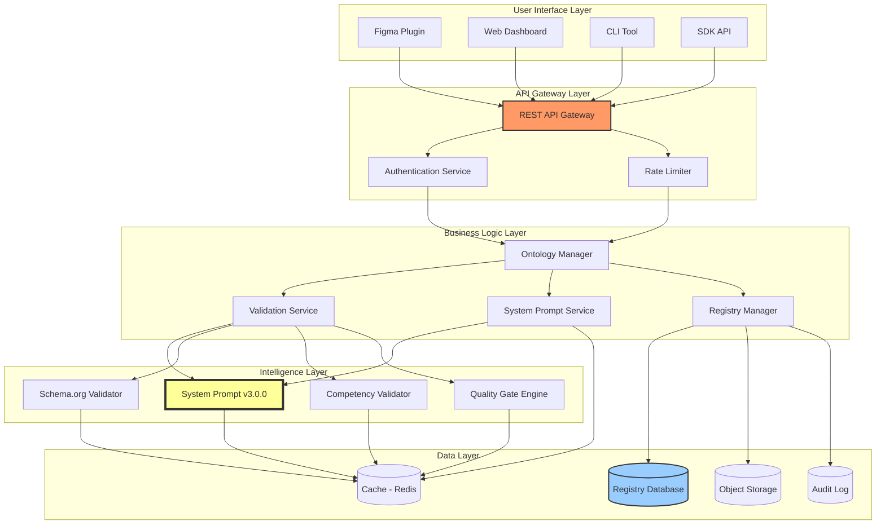

### Layer Responsibilities

**User Interface Layer:**
- Provide multiple access patterns (visual, CLI, programmatic)
- Collect user input and present results
- Export/import ontology definitions

**API Gateway Layer:**
- Authenticate and authorize requests
- Rate limit to protect backend services
- Route requests to appropriate services

**Business Logic Layer:**
- Orchestrate ontology operations
- Manage workflow state
- Coordinate between intelligence and data layers

**Intelligence Layer:**
- Validate ontology semantics
- Check schema.org alignment
- Enforce quality gates
- Generate enrichments (glossaries, test data)

**Data Layer:**
- Persist ontology definitions
- Cache validation results
- Store audit trails
- Maintain version history

---

## Component Capabilities

### 1. System Prompt Service (Core Intelligence)

**Purpose:** AI-powered semantic validation and enrichment engine

**Capabilities:**
- **Ontology Validation:** Structural, semantic, and business rule validation
- **Schema.org Alignment:** Automated mapping to schema.org types (≥80% requirement)
- **Competency Checking:** Domain-specific requirement validation
- **Quality Gate Enforcement:** 100% completeness gates for production
- **Artifact Generation:** Auto-generate glossaries, test data, documentation
- **Relationship Inference:** Suggest missing relationships based on patterns
- **Duplicate Detection:** Identify similar ontologies (>70% overlap warning)

**Technical Details:**
- **Model:** Claude 3.5 Sonnet / Claude Opus
- **Context Window:** 200K tokens
- **Response Time:** <2 seconds per validation
- **Uptime Target:** 99%
- **Caching:** Redis with 24-hour TTL (70%+ hit rate)

**Dependencies:**
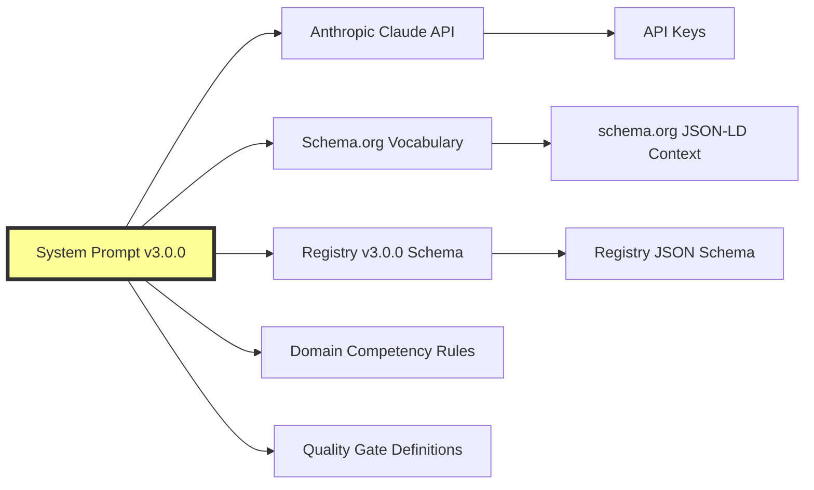

### 2. Ontology Manager

**Purpose:** Orchestrate CRUD operations and workflow management

**Capabilities:**
- **Create:** Guide users through ontology creation workflow
- **Read:** Query and retrieve ontologies from registry
- **Update:** Version-controlled updates with changelog
- **Delete:** Soft delete with dependency checking
- **Search:** Purpose-based, domain-based, entity-based search
- **Recommend:** Suggest reusable entities from PF-Core
- **Export:** Multiple formats (JSON-LD, Markdown, Mermaid)

**State Machine:**
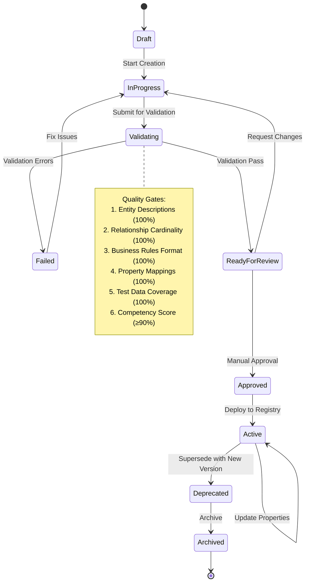

### 3. Validation Service

**Purpose:** Multi-dimensional ontology validation

**Validation Dimensions:**

```mermaid
graph TB
    A[Validation Service] --> B[Structural Validation]
    A --> C[Semantic Validation]
    A --> D[Business Rule Validation]
    A --> E[Quality Metrics Validation]
    A --> F[Competency Validation]
    A --> G[Completeness Gates]
    
    B --> B1[JSON-LD Syntax]
    B --> B2[@context Validity]
    B --> B3[Required Fields]
    
    C --> C1[Circular Dependencies]
    C --> C2[Cardinality Consistency]
    C --> C3[Type Compatibility]
    
    D --> D1[Rule Format IF-THEN]
    D --> D2[Rule Priority]
    D --> D3[Testability]
    
    E --> E1[Entity Reuse Rate ≥80%]
    E --> E2[Schema.org Alignment ≥80%]
    E --> E3[Validation Pass Rate ≥95%]
    
    F --> F1[Required Entities Present]
    F --> F2[Required Relationships Present]
    F --> F3[Domain Score ≥90%]
    
    G --> G1[Entity Descriptions 100%]
    G --> G2[Relationship Cardinality 100%]
    G --> G3[Business Rules 100%]
    G --> G4[Property Mappings 100%]
    G --> G5[Test Data 100%]
    
    style A fill:#f96,stroke:#333,stroke-width:4px
```

**Short Description:** The Validation Service performs six types of validation across 23 specific checks, ensuring ontologies meet structural correctness, semantic integrity, business rule compliance, quality thresholds, domain competency requirements, and production completeness gates before deployment.

### 4. Registry Manager

**Purpose:** Persistent storage and versioning for ontologies

**Capabilities:**
- **CRUD Operations:** Full lifecycle management
- **Version Control:** Semantic versioning (MAJOR.MINOR.PATCH)
- **Dependency Tracking:** Graph of ontology dependencies
- **Multi-Tenant Isolation:** Row-level security by tenant
- **Search & Query:** Full-text search, faceted navigation
- **Backup & Recovery:** Daily incremental backups
- **Audit Trail:** Complete change history

**Data Model:**
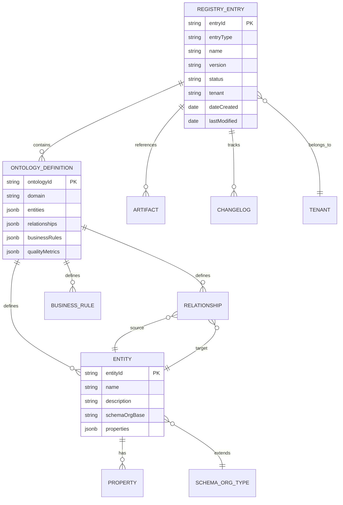

### 5. Figma Plugin (v4.0.0)

**Purpose:** Visual ontology design for non-technical users

**Capabilities:**
- **Visual Entity Design:** Drag-drop entity creation
- **Property Definition:** Form-based property editor
- **Relationship Mapping:** Visual connector tool
- **Schema.org Search:** Built-in schema.org type browser
- **Real-time Validation:** Live feedback from validation service
- **One-Click Export:** JSON-LD export to registry
- **Import Existing:** Load ontologies back into Figma

**User Flow:**
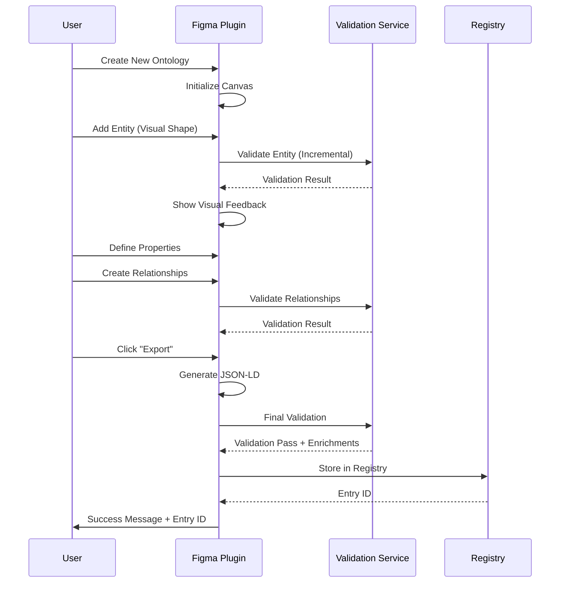

**Short Description:** The Figma Plugin provides a visual, no-code interface for ontology design, enabling designers and business analysts to create valid ontologies through drag-and-drop interactions with real-time validation feedback.

### 6. CLI Tool

**Purpose:** Command-line automation for developers and DevOps

**Commands:**

| Command | Description | Example |
|---------|-------------|---------|
| `oaa create` | Interactive ontology creation wizard | `oaa create marketing-campaign` |
| `oaa validate` | Validate existing ontology file | `oaa validate ./campaign.jsonld` |
| `oaa convert` | Convert v2.0 to v3.0 format | `oaa convert legacy.json` |
| `oaa deploy` | Deploy ontology to registry | `oaa deploy campaign.jsonld --env prod` |
| `oaa export` | Export ontology in multiple formats | `oaa export Entry-042 --format markdown` |
| `oaa search` | Search registry for ontologies | `oaa search --domain marketing` |
| `oaa diff` | Compare two ontology versions | `oaa diff v1.0.0 v1.1.0` |

**Workflow Example:**
```bash
# Step 1: Initialize new ontology
oaa create

# Interactive prompts:
? Ontology name: campaign-management
? Domain: marketing
? Tenant: marketing-jv
? Base on existing? (Y/n) Y
? Search registry: campaign

# Step 2: Edit in preferred editor
oaa edit campaign-management

# Step 3: Validate
oaa validate campaign-management.jsonld

# Step 4: Deploy
oaa deploy campaign-management.jsonld --env production
```

### 7. SDK Package (@pf-ontologies/oaa-sdk)

**Purpose:** Programmatic API for developers

**Core Classes:**

```typescript
// Fluent API for ontology creation
class OntologyBuilder {
  constructor(name: string, domain: string)
  entity(name: string): EntityBuilder
  relationship(source: string, target: string): RelationshipBuilder
  businessRule(rule: string): BusinessRuleBuilder
  validate(): Promise<ValidationResult>
  build(): Promise<Ontology>
}

// Validation against Registry v3.0.0
class OntologyValidator {
  validateStructure(ontology: Ontology): ValidationResult
  validateSemantics(ontology: Ontology): ValidationResult
  validateCompleteness(ontology: Ontology): CompletenessResult
  validateCompetency(ontology: Ontology, domain: string): CompetencyResult
}

// CRUD operations on registry
class RegistryManager {
  load(entryId: string): Promise<Ontology>
  create(ontology: Ontology): Promise<RegistryEntry>
  update(entryId: string, updates: Partial<Ontology>): Promise<RegistryEntry>
  delete(entryId: string): Promise<boolean>
  search(query: SearchQuery): Promise<RegistryEntry[]>
}

// Communication with system prompt service
class SystemPromptClient {
  validate(ontology: Ontology): Promise<ValidationResult>
  enrich(ontology: Ontology): Promise<EnrichedOntology>
  generateGlossary(ontology: Ontology): Promise<Glossary>
  generateTestData(ontology: Ontology): Promise<TestData>
}
```

**Usage Example:**
```typescript
import { OntologyBuilder, RegistryManager } from '@pf-ontologies/oaa-sdk';

// Create new ontology
const ontology = new OntologyBuilder('campaign-management', 'marketing')
  .entity('Campaign')
    .description('Marketing campaign entity')
    .schemaOrgBase('Event')
    .property('name', 'Text', { required: true })
    .property('startDate', 'Date', { required: true })
    .done()
  .entity('Audience')
    .description('Target audience for campaigns')
    .schemaOrgBase('Audience')
    .property('segmentName', 'Text')
    .done()
  .relationship('Campaign', 'Audience')
    .name('targets')
    .cardinality('1..*')
    .done()
  .businessRule('IF Campaign.startDate > Campaign.endDate THEN invalid')
  .build();

// Validate
const validation = await ontology.validate();
if (validation.isValid) {
  // Deploy to registry
  const registry = new RegistryManager();
  const entry = await registry.create(ontology);
  console.log(`Deployed: ${entry.entryId}`);
}
```

---

## System Dependencies

### Dependency Graph

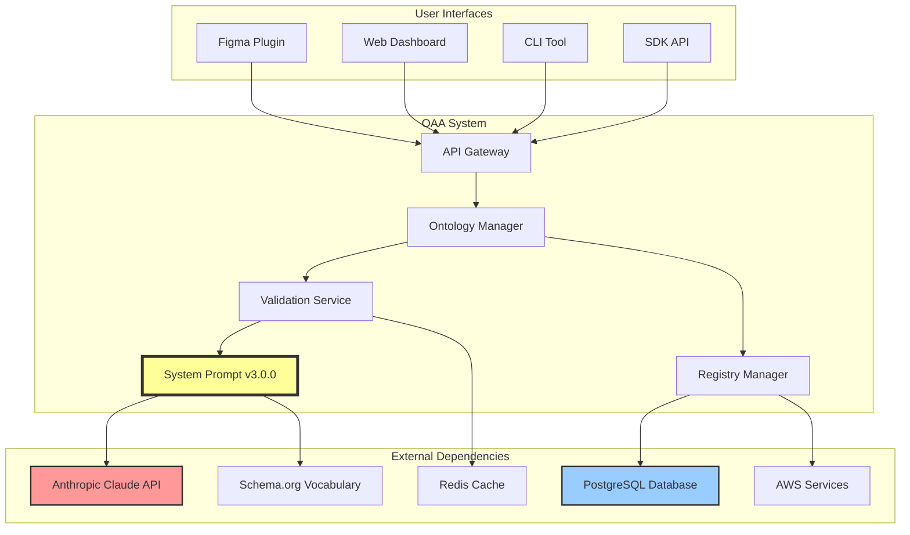

### Critical Dependencies

| Dependency | Purpose | SLA | Fallback Strategy |
|------------|---------|-----|-------------------|
| **Anthropic Claude API** | AI-powered validation | 99.9% | Queue requests, retry with exponential backoff |
| **Schema.org** | Vocabulary reference | 99.5% | Local cache (updated weekly) |
| **PostgreSQL** | Registry persistence | 99.99% | Read replicas, automated failover |
| **Redis** | Validation result cache | 99.9% | Degraded mode (direct API calls) |
| **AWS S3** | Artifact storage | 99.999999999% | Multi-region replication |

### Version Compatibility Matrix

| Component | Version | Registry Format | System Prompt | SDK |
|-----------|---------|----------------|---------------|-----|
| System Prompt | v3.0.0 | v3.0.0 | - | - |
| System Prompt | v3.0.01 | v3.0.0 | - | Claude Agent SDK |
| SDK | v4.0.0 | v3.0.0 | v3.0.0+ | - |
| CLI | v4.0.0 | v3.0.0 | v3.0.0+ | v4.0.0 |
| Figma Plugin | v4.0.0 | v3.0.0 | v3.0.0+ | v4.0.0 |
| Web Dashboard | v4.0.0 | v3.0.0 | v3.0.0+ | v4.0.0 |

---

## Ontology Agent Architecture

### Agent Capability Model

```mermaid
graph TB
    subgraph "OAA Agent Capabilities"
        A[Discovery & Scoping]
        B[Schema.org Mapping]
        C[Entity Definition]
        D[Relationship Modeling]
        E[Business Rule Definition]
        F[Validation & Quality]
        G[Artifact Generation]
        H[Registry Management]
    end
    
    A --> A1[Understand Business Objectives]
    A --> A2[Query Existing Ontologies]
    A --> A3[Recommend Reuse]
    
    B --> B1[Search Schema.org Types]
    B --> B2[Map Properties]
    B --> B3[Document Rationale]
    
    C --> C1[Define Entities with Descriptions]
    C --> C2[Specify Properties + Constraints]
    C --> C3[Validate Competency]
    
    D --> D1[Define Relationships + Cardinality]
    D --> D2[Check Circular Dependencies]
    D --> D3[Specify Inverse Relationships]
    
    E --> E1[Define IF-THEN Rules]
    E --> E2[Specify Rule Priority]
    E --> E3[Ensure Testability]
    
    F --> F1[Structural Validation]
    F --> F2[Semantic Validation]
    F --> F3[Quality Gate Enforcement]
    
    G --> G1[Generate Glossary]
    G --> G2[Generate Test Data]
    G --> G3[Generate Documentation]
    
    H --> H1[Generate Registry Entry]
    H --> H2[Track Version History]
    H --> H3[Manage Dependencies]
    
    style A fill:#9f9,stroke:#333,stroke-width:2px
    style F fill:#ff9,stroke:#333,stroke-width:2px
    style H fill:#9cf,stroke:#333,stroke-width:2px
```

### Agent Reasoning Flow

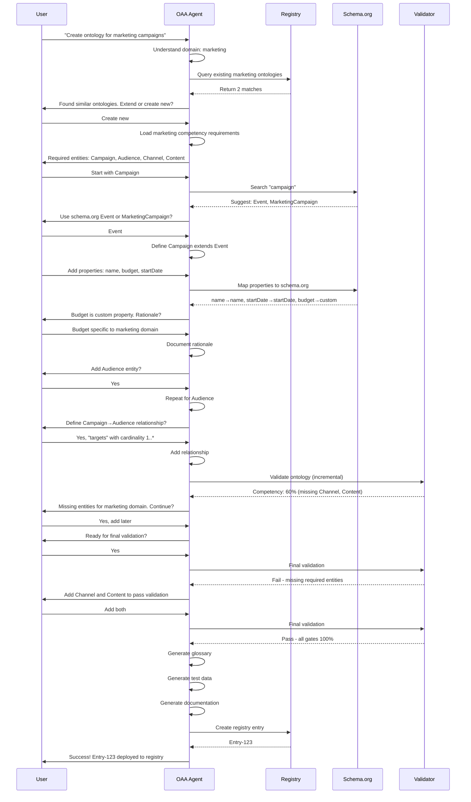

**Short Description:** The OAA Agent uses conversational AI to guide users through ontology creation, automatically querying schema.org for mappings, validating against domain competency requirements, enforcing quality gates, and generating all required artifacts before deployment to the registry.

---

## System Prompt Design

### Prompt Architecture

```mermaid
graph TB
    subgraph "System Prompt v3.0.0 Structure"
        A[Identity & Mission]
        B[Core Capabilities]
        C[Operational Workflows]
        D[Validation Rules]
        E[Quality Standards]
        F[Interaction Patterns]
        G[Artifact Templates]
        H[Change Control]
    end
    
    A --> A1[Define agent role]
    A --> A2[State version 3.0.0]
    A --> A3[Declare production-ready status]
    
    B --> B1[Ontology Creation]
    B --> B2[Competency Validation]
    B --> B3[Quality Gates]
    B --> B4[Registry Query]
    B --> B5[External Integration]
    
    C --> C1[WORKFLOW A: New Ontology]
    C --> C2[WORKFLOW B: Convert v2→v3]
    C --> C3[WORKFLOW C: Incremental Validation]
    
    D --> D1[Structural Rules]
    D --> D2[Semantic Rules]
    D --> D3[Business Rule Rules]
    D --> D4[Competency Rules]
    
    E --> E1[Quality Thresholds ≥80%]
    E --> E2[Completeness Gates 100%]
    E --> E3[Competency Score ≥90%]
    
    F --> F1[Ask Clarifying Questions]
    F --> F2[Query Registry First]
    F --> F3[Recommend Reuse]
    F --> F4[Provide Structured Output]
    
    G --> G1[Registry Entry Template]
    G --> G2[Glossary Template]
    G --> G3[Test Data Template]
    G --> G4[Validation Report Template]
    
    H --> H1[Version History]
    H --> H2[Change Log]
    H --> H3[Approval Tracking]
    
    style A fill:#f96,stroke:#333,stroke-width:4px
    style D fill:#ff9,stroke:#333,stroke-width:2px
    style E fill:#9f9,stroke:#333,stroke-width:2px
```

### Prompt Sections (v3.0.0)

| Section | Lines | Purpose | Key Content |
|---------|-------|---------|-------------|
| **Header** | 1-24 | Version control, change log | Version 3.0.0, date, registry entry |
| **System Overview** | 25-42 | Agent identity and mission | Purpose, new features in v3.0.0 |
| **Core Capabilities** | 43-79 | List of 6 major capabilities | Creation, competency, gates, registry, integration |
| **Workflows** | 80-438 | 3 detailed workflows | A: New ontology, B: Convert v2→v3, C: Incremental |
| **Competency Framework** | 330-415 | Domain-specific requirements | Marketing, strategy, CMO, organization domains |
| **Quality Gates** | 416-505 | 100% completeness requirements | 5 gates with validation logic |
| **Registry Query** | 506-591 | Search and reuse logic | Query patterns, recommendations |
| **Change Control** | 592-685 | Version management rules | Semantic versioning, changelog format |
| **Responsibilities** | 686-706 | Core duties (17 items) | What agent MUST do |
| **Operational Principles** | 707-737 | Do's and don'ts | 13 ALWAYS, 10 NEVER rules |
| **Interaction Style** | 738-768 | Communication guidelines | How to interact with users |
| **Artifacts** | 769-827 | 7 mandatory artifacts | What to generate for every ontology |
| **Quality Thresholds** | 828-857 | Metric requirements | Minimum and production thresholds |
| **Schema.org Protocol** | 858-888 | Grounding process | 4-step mapping process |
| **Glossary Rules** | 889-end | Artifact generation rules | Templates and requirements |

### Key Design Decisions

**Decision 1: System Prompt as Microservice**
- **Rationale:** Enable SDK/CLI/Figma to use same validation logic
- **Implication:** System prompt accessed via API, not just copy/paste
- **Benefit:** Consistency across all interfaces

**Decision 2: 100% Completeness Gates**
- **Rationale:** Production ontologies must be complete, not "mostly complete"
- **Implication:** Changed from ≥95% to exactly 100% for 5 gates
- **Benefit:** Higher quality, fewer deployment issues

**Decision 3: Domain Competency Validation**
- **Rationale:** Ontologies must meet domain-specific requirements
- **Implication:** Marketing ontologies MUST have Campaign, Audience, etc.
- **Benefit:** Ensures fitness for purpose

**Decision 4: Incremental Validation**
- **Rationale:** Support UI builders where users create ontologies step-by-step
- **Implication:** Agent provides real-time feedback as ontology is built
- **Benefit:** Better user experience, faster iteration

---

## Operational Workflows

### Workflow A: New Ontology Creation

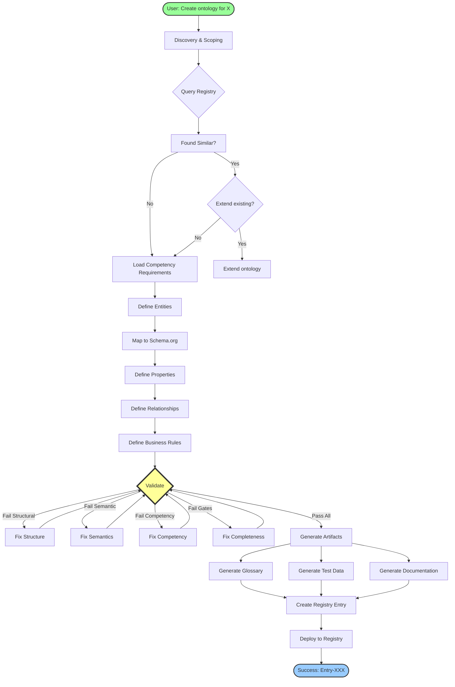

**Duration:** 15-30 minutes for simple ontology, 2-4 hours for complex

### Workflow B: Convert v2.0 to v3.0

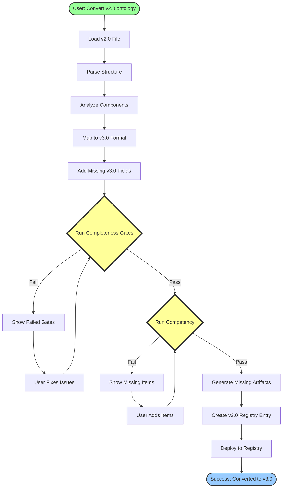

**Duration:** 5-15 minutes for simple conversion, 30-60 minutes if significant gaps

### Workflow C: Incremental Validation (UI Integration)

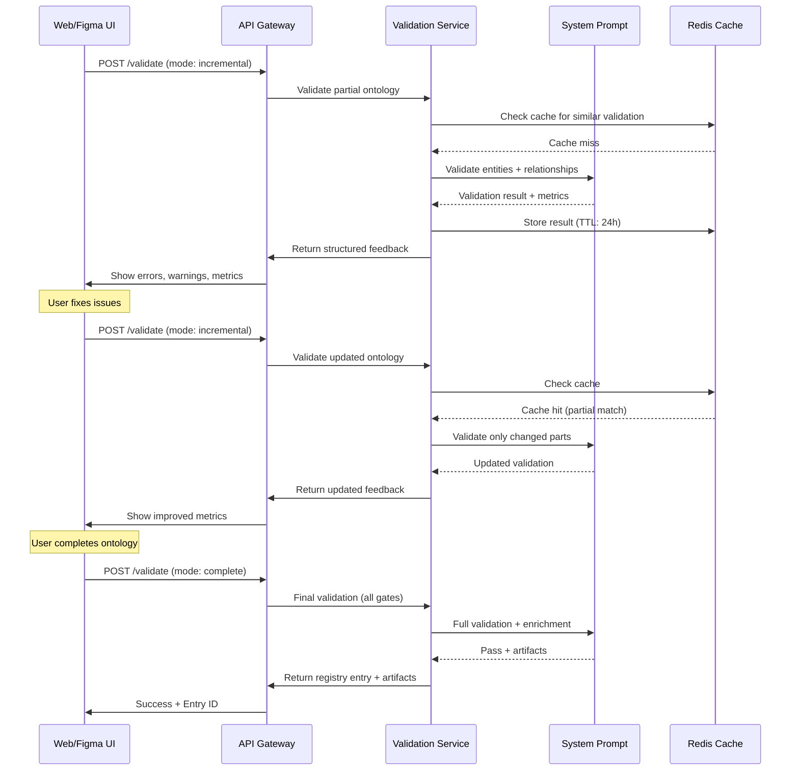

**Duration:** Real-time feedback (<2 seconds per validation call)

---

## Integration Architecture

### REST API Endpoints

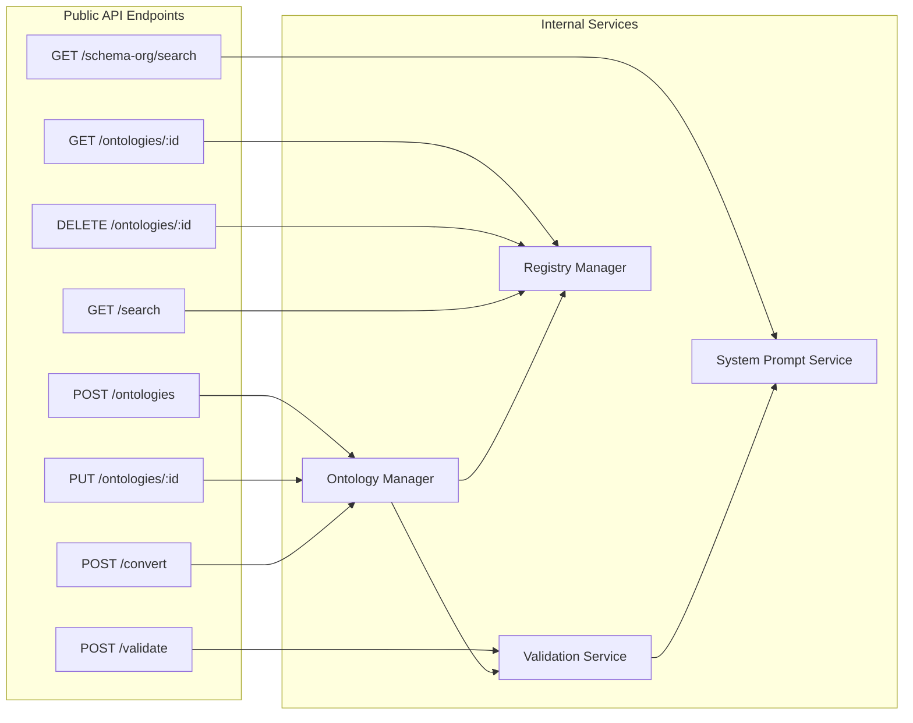

### API Specification (OpenAPI)

```yaml
openapi: 3.0.0
info:
  title: OAA SDK API
  version: 4.0.0

paths:
  /ontologies:
    post:
      summary: Create new ontology
      requestBody:
        content:
          application/json:
            schema:
              $ref: '#/components/schemas/Ontology'
      responses:
        201:
          description: Created
          content:
            application/json:
              schema:
                $ref: '#/components/schemas/RegistryEntry'
  
  /validate:
    post:
      summary: Validate ontology
      requestBody:
        content:
          application/json:
            schema:
              type: object
              properties:
                mode:
                  type: string
                  enum: [incremental, complete]
                ontology:
                  $ref: '#/components/schemas/Ontology'
      responses:
        200:
          description: Validation result
          content:
            application/json:
              schema:
                $ref: '#/components/schemas/ValidationResult'

components:
  schemas:
    Ontology:
      type: object
      properties:
        name:
          type: string
        domain:
          type: string
        entities:
          type: array
          items:
            $ref: '#/components/schemas/Entity'
        relationships:
          type: array
          items:
            $ref: '#/components/schemas/Relationship'
    
    ValidationResult:
      type: object
      properties:
        status:
          type: string
          enum: [pass, fail, in_progress]
        errors:
          type: array
          items:
            type: object
        qualityMetrics:
          type: object
        competencyStatus:
          type: object
```

### Event-Driven Architecture

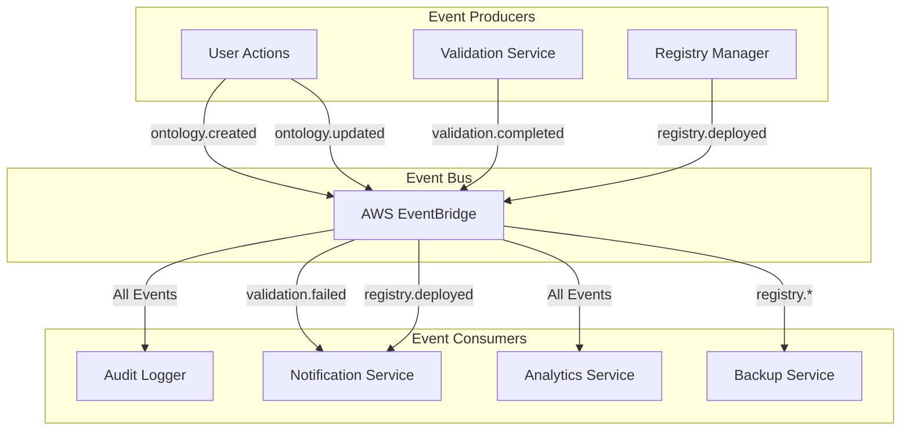

**Key Events:**
- `ontology.created` - New ontology initiated
- `ontology.validated` - Validation completed (pass/fail)
- `ontology.deployed` - Deployed to registry
- `ontology.updated` - Existing ontology modified
- `validation.failed` - Validation errors detected
- `competency.failed` - Domain requirements not met
- `gate.failed` - Completeness gate not passed

---

## Quality & Governance Framework

### Quality Metrics Dashboard

```mermaid
graph TB
    subgraph "Quality Dimensions"
        A[Structural Quality]
        B[Semantic Quality]
        C[Completeness Quality]
        D[Competency Quality]
        E[Adoption Quality]
    end
    
    A --> A1[JSON-LD Validity: 100%]
    A --> A2[Required Fields: 100%]
    
    B --> B1[Schema.org Alignment: ≥80%]
    B --> B2[Circular Dependencies: 0]
    B --> B3[Cardinality Consistency: 100%]
    
    C --> C1[Entity Descriptions: 100%]
    C --> C2[Relationship Cardinality: 100%]
    C --> C3[Business Rules Format: 100%]
    C --> C4[Property Mappings: 100%]
    C --> C5[Test Data Coverage: 100%]
    
    D --> D1[Domain Competency Score: ≥90%]
    D --> D2[Required Entities: 100%]
    D --> D3[Required Relationships: 100%]
    
    E --> E1[Reuse Rate: ≥80%]
    E --> E2[Agent Query Success: ≥90%]
    E --> E3[User Satisfaction: ≥4.5/5]
    
    style A fill:#9cf,stroke:#333,stroke-width:2px
    style B fill:#9cf,stroke:#333,stroke-width:2px
    style C fill:#ff9,stroke:#333,stroke-width:4px
    style D fill:#ff9,stroke:#333,stroke-width:4px
    style E fill:#9f9,stroke:#333,stroke-width:2px
```

### Governance Model

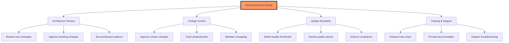

### Quality Gates (Production Requirements)

| Gate | Requirement | Threshold | Rationale |
|------|-------------|-----------|-----------|
| **GATE 1** | Entity Descriptions | 100% | Every entity must have clear business purpose |
| **GATE 2** | Relationship Cardinality | 100% | Data integrity depends on correct cardinality |
| **GATE 3** | Business Rules Format | 100% | Rules must be testable (IF-THEN format) |
| **GATE 4** | Property Mappings | 100% | Schema.org alignment or documented rationale |
| **GATE 5** | Test Data Coverage | 100% | Validate business rules work correctly |
| **GATE 6** | Competency Score | ≥90% | Domain-specific requirements must be met |

**Enforcement:**
- Gates checked automatically by validation service
- Any gate failure blocks deployment to production
- User receives specific feedback on what needs fixing
- Re-validation required after fixes

---

## Deployment & Operations

### Deployment Architecture

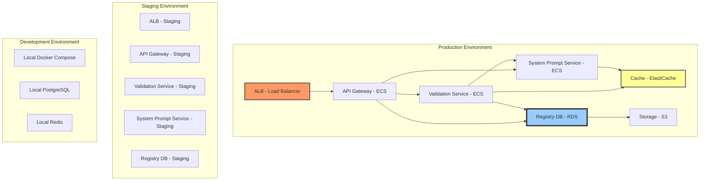

### Environment Configuration

| Environment | Purpose | Infrastructure | Access |
|-------------|---------|----------------|--------|
| **Development** | Local development | Docker Compose | Developers |
| **Staging** | Pre-production testing | AWS ECS (t3.medium) | QA Team, Developers |
| **Production** | Live system | AWS ECS (c5.large) | Approved users |
| **DR (Disaster Recovery)** | Backup region | AWS ECS (on-demand) | Failover only |

### CI/CD Pipeline

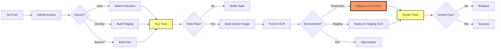

### Operational Runbooks

**Runbook 1: Deploy New Version**
```bash
# Step 1: Merge to main branch
git checkout main
git merge develop
git push origin main

# Step 2: CI/CD automatically triggers

# Step 3: Monitor deployment
aws ecs describe-services --cluster oaa-prod --services oaa-api

# Step 4: Verify health checks
curl https://api.oaa.platformfoundation.io/health

# Step 5: Check metrics
# CloudWatch → oaa-prod dashboard
```

**Runbook 2: Rollback Deployment**
```bash
# Step 1: Identify previous task definition
aws ecs list-task-definitions --family-prefix oaa-api

# Step 2: Update service to previous version
aws ecs update-service \
  --cluster oaa-prod \
  --service oaa-api \
  --task-definition oaa-api:42

# Step 3: Wait for stabilization
aws ecs wait services-stable \
  --cluster oaa-prod \
  --services oaa-api

# Step 4: Verify rollback
curl https://api.oaa.platformfoundation.io/version
```

**Runbook 3: Scale for High Load**
```bash
# Step 1: Update desired count
aws ecs update-service \
  --cluster oaa-prod \
  --service oaa-api \
  --desired-count 10

# Step 2: Monitor scaling
watch -n 5 'aws ecs describe-services \
  --cluster oaa-prod \
  --services oaa-api | grep runningCount'

# Step 3: Verify no errors
aws logs tail /ecs/oaa-api --follow
```

---

## Monitoring & Metrics

### Observability Stack

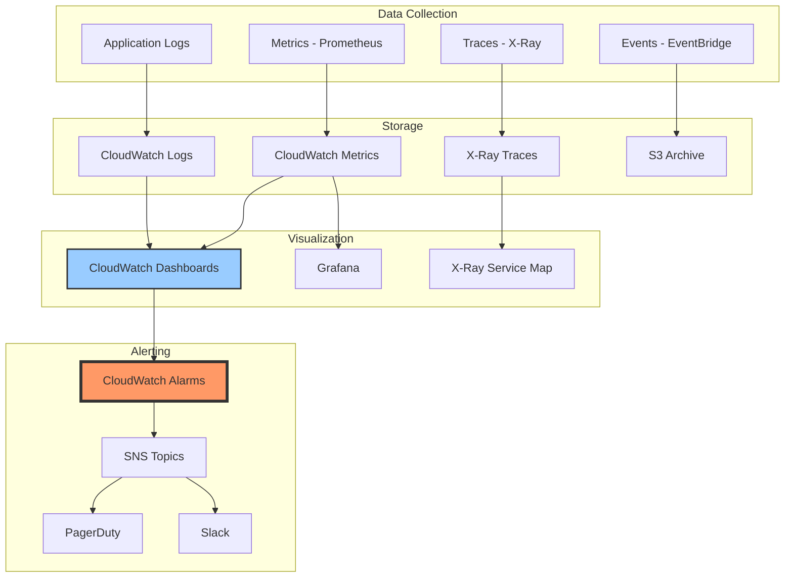

### Key Metrics

| Metric | Target | Alert Threshold | Action |
|--------|--------|-----------------|--------|
| **API Response Time** | <500ms | >1000ms | Scale up instances |
| **System Prompt Response** | <2s | >5s | Check Claude API status |
| **Validation Success Rate** | >95% | <90% | Review validation errors |
| **Cache Hit Rate** | >70% | <50% | Increase cache TTL |
| **Database Connections** | <80% | >90% | Add read replica |
| **Error Rate** | <1% | >5% | Page on-call engineer |
| **Queue Depth** | <100 | >1000 | Scale workers |

### Dashboards

**Dashboard 1: System Health**
- API response time (p50, p95, p99)
- Error rate by endpoint
- Active connections
- CPU/memory utilization

**Dashboard 2: Validation Metrics**
- Validations per hour
- Pass/fail ratio
- Average validation time
- Competency failure rate by domain

**Dashboard 3: Business Metrics**
- Ontologies created per day
- Active users (DAU/MAU)
- SDK downloads
- Figma plugin installs

**Dashboard 4: System Prompt Performance**
- Claude API calls per hour
- Cache hit rate
- Average prompt tokens
- Validation queue depth

---

## Troubleshooting Guide

### Common Issues

**Issue 1: Validation Timeout**

**Symptoms:**
- Validation requests timeout after 30 seconds
- Error: `Validation service unavailable`

**Diagnosis:**
```bash
# Check Claude API status
curl https://status.anthropic.com/api/v2/status.json

# Check validation service logs
aws logs tail /ecs/oaa-validation --since 5m

# Check queue depth
redis-cli LLEN validation_queue
```

**Resolution:**
1. If Claude API down: Wait for recovery, queue will retry
2. If high queue depth: Scale validation workers
3. If service error: Restart ECS task

**Issue 2: Completeness Gate Failures**

**Symptoms:**
- Ontology fails at GATE 1, 2, or 4
- Error: `Entity descriptions: 93% (14/15) - GATE 1 FAIL`

**Diagnosis:**
- Review validation report
- Identify missing descriptions/cardinality/mappings

**Resolution:**
1. Add missing entity descriptions
2. Define cardinality for all relationships (format: `1..*`, `0..1`, etc.)
3. Map properties to schema.org OR document rationale
4. Re-validate

**Issue 3: Schema.org Alignment Below 80%**

**Symptoms:**
- Ontology rejected due to low schema.org alignment
- Error: `Schema.org alignment: 65% (target: ≥80%)`

**Diagnosis:**
```json
{
  "qualityMetrics": {
    "schemaOrgAlignment": 65,
    "unmappedEntities": ["CustomEntity1", "CustomEntity2"],
    "customPropertiesCount": 12
  }
}
```

**Resolution:**
1. Search schema.org for equivalent types
2. Extend existing schema.org types instead of custom
3. Document rationale for truly custom entities
4. Reduce custom properties by mapping to schema.org properties

**Issue 4: Competency Validation Failure**

**Symptoms:**
- Marketing ontology missing required entities
- Error: `Competency score: 60% (requires ≥90%)`

**Diagnosis:**
```json
{
  "competencyStatus": {
    "domain": "marketing",
    "missingEntities": ["Audience", "Channel"],
    "missingRelationships": ["Campaign-targets-Audience"],
    "competencyScore": 60
  }
}
```

**Resolution:**
1. Add missing entities (Audience, Channel)
2. Define required relationships with cardinality
3. Re-validate until competency ≥90%

**Issue 5: Circular Dependency Detected**

**Symptoms:**
- Semantic validation failure
- Error: `Circular dependency: A → B → C → A`

**Diagnosis:**
- Review relationship graph
- Identify circular reference chain

**Resolution:**
1. Break circular dependency by removing one relationship
2. Consider using inverse relationships instead
3. Restructure ontology hierarchy if needed

---

## Appendix A: Glossary

| Term | Definition |
|------|------------|
| **OAA** | Ontology Architect Agent - AI-powered ontology governance system |
| **Registry v3.0.0** | Current ontology storage format with multi-tenant support |
| **System Prompt** | AI agent definition (v3.0.0) for ontology validation |
| **Completeness Gates** | 5 mandatory 100% checks for production ontologies |
| **Competency Validation** | Domain-specific requirement checking (≥90% score) |
| **Schema.org Alignment** | Percentage of entities mapped to schema.org types (≥80%) |
| **Quality Metrics** | Calculated scores for reuse, alignment, validation, documentation |
| **Entity** | Core ontology concept (e.g., Campaign, Organization) |
| **Relationship** | Typed connection between entities with cardinality |
| **Business Rule** | IF-THEN constraint for data validation |
| **Artifact** | Generated output (glossary, test data, documentation) |
| **Entry ID** | Unique registry identifier (format: Entry-XXX) |
| **Tenant** | Isolated namespace for multi-tenant ontologies |
| **PF-Core** | Platform Foundation Core - transferable base layer |

---

## Appendix B: Change Log

### Version 4.0.0 (2025-12-19)
**Changes:**
- Created comprehensive architecture and operating guide
- Documented all component capabilities with Mermaid diagrams
- Added dependency graphs and integration architecture
- Included operational runbooks and troubleshooting guide
- Consolidated v3.0.0 system prompt design
- Documented v4.0.0 SDK architecture

**Authors:** Amanda Moore, Platform Architecture Team  
**Approved By:** OAA Governance Board  
**Status:** Active

---

## Appendix C: Related Documents

- **OAA Documentation v3.0.0+** - Comprehensive system documentation
- **OAA Quick Start Guide v3.0.0** - Getting started guide
- **OAA System Prompt v3.0.0** - Agent definition file
- **OAA SDK v4.0.0 PRD** - Product requirements document
- **OAA SDK v4.0.0 PBS** - Product breakdown structure
- **OAA SDK v4.0.0 WBS** - Work breakdown structure
- **Registry Operational Guide v3.0** - Registry management guide
- **BAIV MVP Workflow** - BAIV-specific ontology workflow
- **WARP.md** - Repository guidance for AI agents

---

**END OF DOCUMENT**

*This document is a living specification. Updates should follow the OAA Registry change management process with version tracking and approval workflows.*
