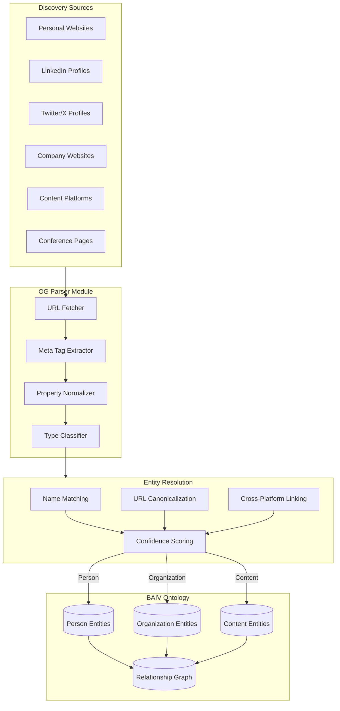
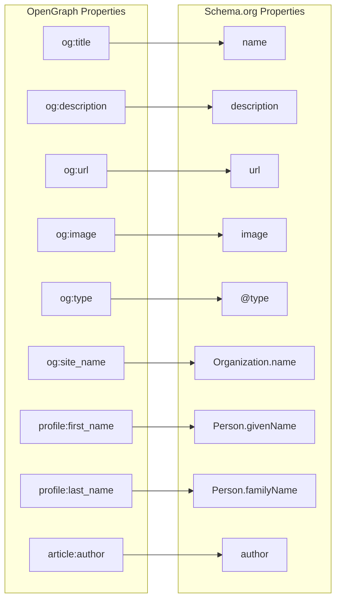
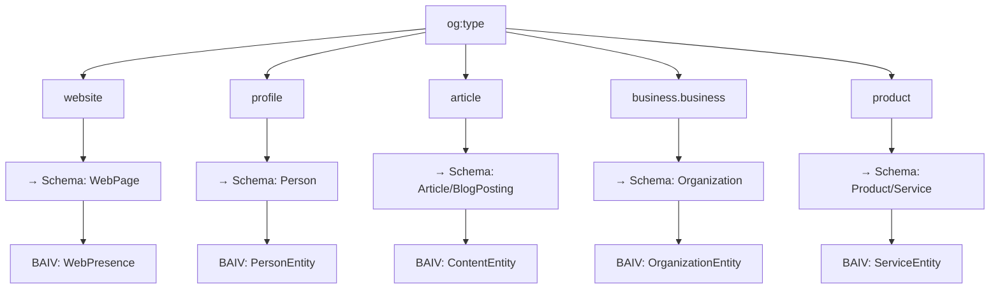
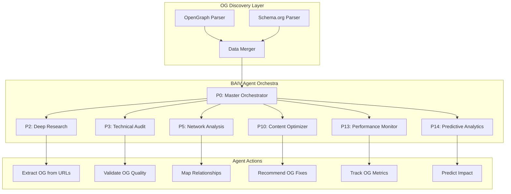
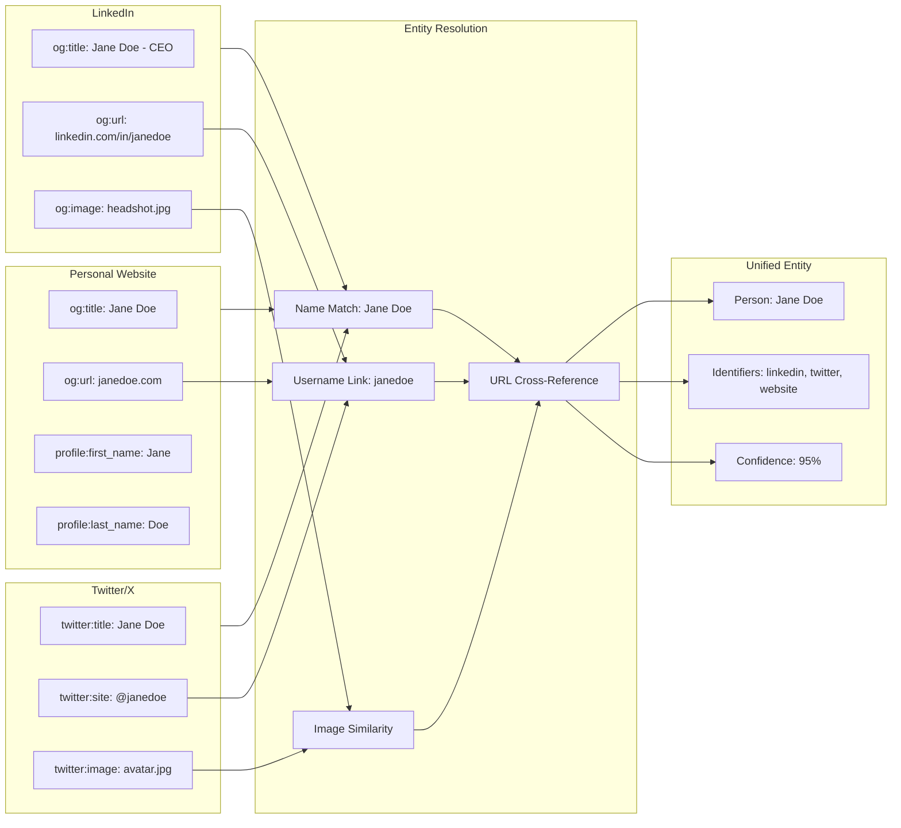
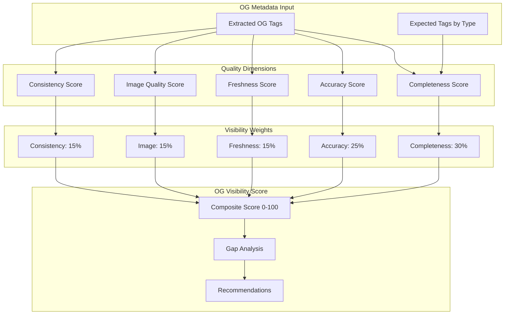
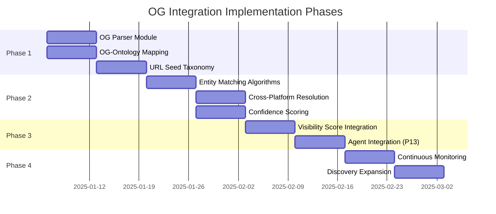
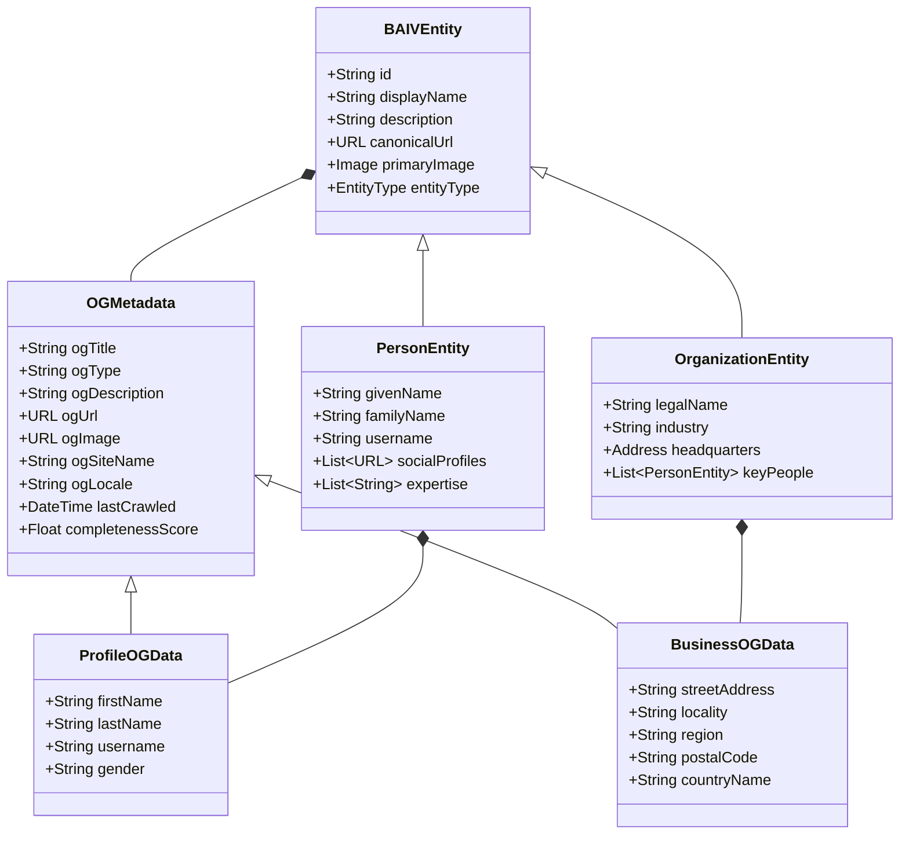

# OpenGraph + BAIV Integration Architecture Diagrams

## 1. OG Discovery Pipeline Flow

## 2. OG Property Mapping to Schema.org

## 3. OG Type Hierarchy for BAIV

## 4. Agent Integration with OG Discovery

## 5. Cross-Platform Entity Resolution

## 6. OG Quality Scoring Framework

## 7. Implementation Phase Timeline

## 8. OAA Ontology Extension Structure

---

*These diagrams provide visual architecture documentation for the OpenGraph integration into BAIV. Render using any Mermaid-compatible viewer or the BAIV dashboard.*
