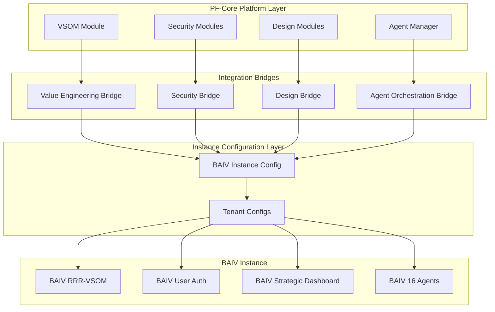
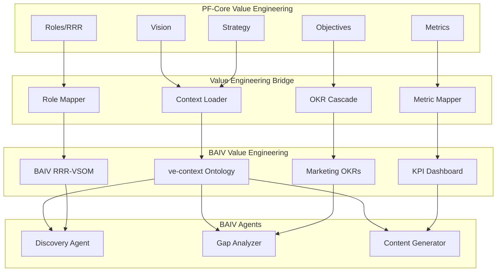
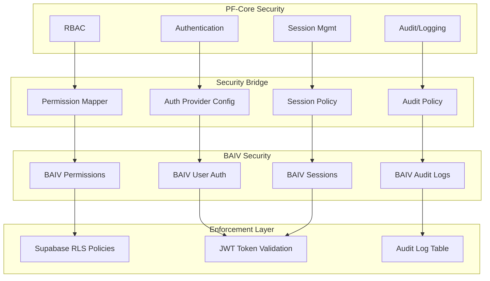
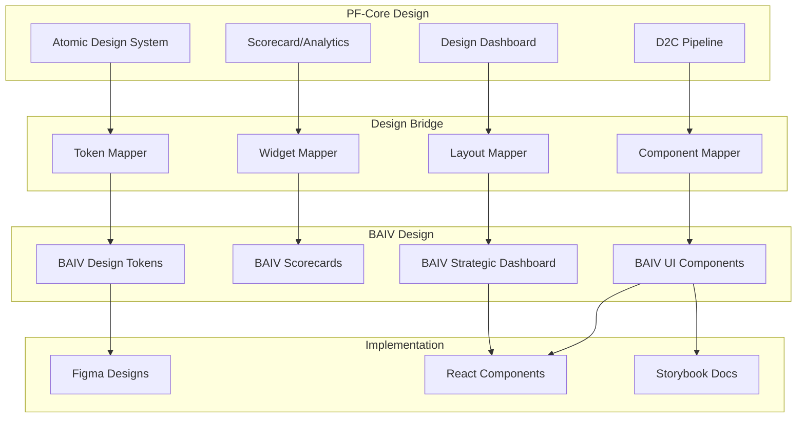
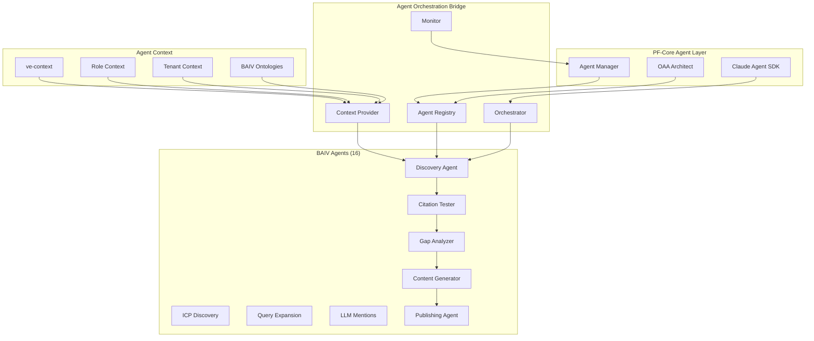

# PFC-PFI-BAIV Integration Bridges v1.0.0

**Platform Foundation Core to BAIV Instance Integration Architecture**

| Attribute | Value |
|-----------|-------|
| **Document Version** | 1.0.0 |
| **Date** | December 31, 2025 |
| **Purpose** | Define how PF-Core modules cascade to BAIV instance |
| **Status** | 🟢 Active |
| **Owner** | Platform Architecture Team |
| **Parent Documents** | BAIV_INTEGRATION_PLAN.md, PFC-PFI-BAIV_MODULE_CATALOG.md |
| **Related Artifacts** | PFC-PFI-BAIV_AGENTIC_BUILDER_GUIDE.md |

---

## Executive Summary

This document defines the **Integration Bridge Pattern** that enables Platform Foundation Core (PF-Core) modules to cascade their capabilities, configurations, and strategic context to BAIV (Be AI Visible) instance implementations.

The bridge pattern follows the W4M COO-GP Guardian SOP reference architecture:

```
PF-Core (Platform Layer)
    ↓ [Integration Bridges]
    Instance Configuration Layer
    ↓
    BAIV Instance (Product Layer)
    ↓
    Domain-Specific Implementations
```

**4 Integration Bridges:**
1. **Value Engineering Bridge** - Strategic context and objectives
2. **Security Bridge** - Authentication, authorization, audit
3. **Design Bridge** - Dashboards, scorecards, components
4. **Agent Orchestration Bridge** - Agent management and execution

Each bridge defines:
- **Configuration cascade** from PFC to BAIV
- **Value flow patterns** (context, data, events)
- **Validation criteria** for successful integration
- **Implementation guidance** with code examples

---

## 1. Integration Bridge Pattern Overview

### 1.1 Bridge Architecture

Integration bridges are architectural patterns that enable **controlled propagation** of platform capabilities to instances while maintaining:
- **Platform independence** (instances don't depend on PFC internals)
- **Configuration flexibility** (instances override defaults)
- **Tenant isolation** (multi-tenant data separation)
- **Value cascade** (strategic context flows to execution)



### 1.2 Bridge Components

Each bridge consists of:

| Component | Purpose | Example |
|-----------|---------|---------|
| **Source Module** | PFC module providing capability | VSOM, Auth, Dashboard |
| **Configuration Schema** | Data structure for instance config | JSON schema with defaults |
| **Transformation Logic** | Maps PFC config to instance config | Role mapping, token application |
| **Validation Rules** | Ensures config correctness | Required fields, type checks |
| **Context Loader** | Runtime context provision | Agent context loading |
| **Target Implementation** | Instance-specific module | BAIV RRR-VSOM, BAIV Auth |

### 1.3 Configuration Hierarchy

Bridges enforce a 4-level configuration hierarchy:

```
1. Platform Defaults (PFC)
   └── Base configuration for all instances
       └── Cannot be overridden by instances
       
2. Instance Overrides (BAIV)
   └── BAIV-specific feature settings
       └── Override platform defaults
       
3. Tenant Customization
   └── Per-customer configuration
       └── Within instance constraints
       
4. User Preferences
   └── Individual user settings
       └── Most specific level
```

**Example: Session Timeout Configuration**
```json
{
  "session_timeout": {
    "platform_default": 3600,        // 1 hour (PFC)
    "instance_override": 7200,       // 2 hours (BAIV)
    "tenant_customization": null,    // Use instance default
    "user_preference": null          // Use tenant/instance default
  },
  "effective_value": 7200            // Result: 2 hours
}
```

---

## 2. Value Engineering Bridge

### 2.1 Purpose

The Value Engineering Bridge cascades strategic context, objectives, and organizational structure from PF-Core VSOM and related modules to BAIV instance implementations.

**Source Modules:**
- VSOM (Vision, Strategy, Objectives, Metrics)
- OKR Module
- VE-RRR (Roles, RACI, RBAC)
- VE-Metrics/KPI Tree
- PMF Module

**Target Implementations:**
- BAIV RRR-VSOM
- BAIV Marketing OKRs
- BAIV KPI Dashboard

### 2.2 Value Cascade Flow



### 2.3 VSOM Context Loading

**Pattern:** Agents load strategic context via the `ve-context` ontology

**Configuration Schema:**
```json
{
  "@context": "https://schema.org",
  "@type": "VEContext",
  "vision": {
    "statement": "Empower B2B SaaS companies to be discovered by AI platforms",
    "horizon": "3 years",
    "success_criteria": ["#1 AI Visibility platform", "10K customers", "$100M ARR"]
  },
  "strategy": {
    "approach": "Ontology-driven, multi-agent architecture",
    "competitive_advantage": ["First mover", "Technical depth", "Agent automation"],
    "target_market": "B2B SaaS Marketing Leaders"
  },
  "objectives": [
    {
      "id": "obj-001",
      "title": "Increase AI Visibility",
      "owner": "CMO",
      "key_results": [
        {"id": "kr-001", "metric": "citation_rate", "target": 0.25, "current": 0.10},
        {"id": "kr-002", "metric": "platform_coverage", "target": 4, "current": 2}
      ]
    }
  ],
  "metrics": {
    "strategic": ["MRR", "NPS", "Citation Rate"],
    "operational": ["Audit Velocity", "Gap Closure %", "Content Velocity"]
  }
}
```

**Agent Usage (TypeScript Example):**
```typescript
class DiscoveryAgent extends BaseAgent {
  async execute(input: any) {
    // Load strategic context from PFC via bridge
    const veContext = await this.loadOntology('ve-context');
    
    // Extract relevant strategic objectives
    const objectives = veContext.objectives.filter(
      obj => obj.owner === 'CMO' || obj.owner === 'Marketing Director'
    );
    
    // Use objectives to guide discovery queries
    const queries = this.generateQueriesAlignedWithObjectives(
      input.competitor_url,
      objectives
    );
    
    return this.runDiscovery(queries);
  }
}
```

### 2.4 Role Mapping (VE-RRR → BAIV RRR-VSOM)

**Pattern:** Map PFC role hierarchy to BAIV user roles with permissions

**Configuration Schema:**
```json
{
  "role_mapping": {
    "pfc_roles": [
      {
        "role_id": "pfc-role-cmo",
        "role_name": "Chief Marketing Officer",
        "level": "C-Suite",
        "vsom_ownership": ["All Marketing Objectives"],
        "baiv_mapping": {
          "role_id": "baiv-role-cmo",
          "permissions": ["read_all", "execute_all", "admin"],
          "objective_ownership": ["obj-001", "obj-002", "obj-003"]
        }
      },
      {
        "role_id": "pfc-role-marketing-dir",
        "role_name": "Marketing Director",
        "level": "VP/Director",
        "vsom_ownership": ["Campaign Objectives"],
        "baiv_mapping": {
          "role_id": "baiv-role-director",
          "permissions": ["read_team", "execute_team", "approve"],
          "objective_ownership": ["obj-002"]
        }
      },
      {
        "role_id": "pfc-role-content-mgr",
        "role_name": "Content Manager",
        "level": "Manager",
        "vsom_ownership": ["Content Production"],
        "baiv_mapping": {
          "role_id": "baiv-role-manager",
          "permissions": ["execute", "approve_content"],
          "objective_ownership": ["obj-003"]
        }
      },
      {
        "role_id": "pfc-role-analyst",
        "role_name": "Marketing Analyst",
        "level": "IC",
        "vsom_ownership": ["Task Execution"],
        "baiv_mapping": {
          "role_id": "baiv-role-analyst",
          "permissions": ["execute", "view"],
          "objective_ownership": []
        }
      }
    ]
  }
}
```

**RACI Matrix Integration:**
```json
{
  "raci_workflows": {
    "audit_execution": {
      "responsible": ["baiv-role-manager", "baiv-role-analyst"],
      "accountable": ["baiv-role-director"],
      "consulted": ["baiv-role-cmo"],
      "informed": []
    },
    "gap_analysis": {
      "responsible": ["baiv-role-analyst"],
      "accountable": ["baiv-role-manager"],
      "consulted": ["baiv-role-director"],
      "informed": ["baiv-role-cmo"]
    },
    "content_publishing": {
      "responsible": ["baiv-role-manager"],
      "accountable": ["baiv-role-director"],
      "consulted": ["baiv-role-analyst"],
      "informed": ["baiv-role-cmo"]
    }
  }
}
```

### 2.5 OKR Cascade (OKR Module → BAIV Marketing OKRs)

**Pattern:** Company objectives cascade to functional to team OKRs

**Configuration Schema:**
```json
{
  "okr_cascade": {
    "company_level": {
      "objective": "Become the #1 AI Visibility Platform",
      "owner": "CEO",
      "key_results": [
        {"kr": "Achieve 10K customers", "target": 10000, "current": 1200},
        {"kr": "Reach $100M ARR", "target": 100000000, "current": 12000000}
      ]
    },
    "functional_level": {
      "objective": "Increase AI Visibility for Customers",
      "owner": "CMO",
      "parent_objective": "Become the #1 AI Visibility Platform",
      "key_results": [
        {"kr": "Citation rate ≥ 25%", "target": 0.25, "current": 0.10},
        {"kr": "4 platform coverage", "target": 4, "current": 2},
        {"kr": "100 priority keywords covered", "target": 100, "current": 40}
      ],
      "baiv_mapping": {
        "module": "BAIV Marketing OKRs",
        "ontology": "BAIV-ONT-CMO-OKR",
        "agents_consuming": ["Discovery", "Gap Analyzer", "Content Generator"]
      }
    },
    "team_level": {
      "objective": "Execute 500 audits per quarter",
      "owner": "Marketing Director",
      "parent_objective": "Increase AI Visibility for Customers",
      "key_results": [
        {"kr": "500 audits completed", "target": 500, "current": 120},
        {"kr": "80% gap closure rate", "target": 0.80, "current": 0.65}
      ],
      "baiv_mapping": {
        "workflow": "Audit execution",
        "responsible_roles": ["baiv-role-manager", "baiv-role-analyst"]
      }
    }
  }
}
```

**OKR Progress Tracking:**
```typescript
interface OKRProgress {
  objective_id: string;
  owner_role: string;
  key_results: Array<{
    kr_id: string;
    metric: string;
    target: number;
    current: number;
    progress_pct: number;
    status: 'on-track' | 'at-risk' | 'off-track';
  }>;
  last_updated: string;
}

// BAIV Dashboard widget queries OKR progress
async function getOKRProgressForDashboard(userId: string): Promise<OKRProgress[]> {
  const userRole = await getUserRole(userId);
  const relevantOKRs = await supabase
    .from('okr_progress')
    .select('*')
    .eq('owner_role', userRole)
    .order('objective_id');
  
  return relevantOKRs.data;
}
```

### 2.6 Metric Mapping (VE-Metrics/KPI Tree → BAIV KPI Dashboard)

**Pattern:** Map PFC metrics hierarchy to BAIV ontologies and dashboard widgets

**Configuration Schema:**
```json
{
  "metric_mapping": {
    "strategic_kpis": {
      "financial": [
        {
          "pfc_metric": "MRR",
          "baiv_mapping": {
            "ontology": null,
            "dashboard_widget": "financial_scorecard",
            "data_source": "billing_system",
            "refresh_rate": "daily"
          }
        },
        {
          "pfc_metric": "LTV",
          "baiv_mapping": {
            "ontology": null,
            "dashboard_widget": "financial_scorecard",
            "data_source": "billing_system",
            "refresh_rate": "weekly"
          }
        }
      ],
      "customer": [
        {
          "pfc_metric": "Citation Rate",
          "baiv_mapping": {
            "ontology": "BAIV-ONT-AI-Visibility",
            "ontology_property": "citationRate",
            "dashboard_widget": "citation_rate_trend",
            "data_source": "audits_table",
            "refresh_rate": "per_audit"
          }
        },
        {
          "pfc_metric": "NPS",
          "baiv_mapping": {
            "ontology": "BAIV-ONT-Customer-Organization",
            "ontology_property": "npsScore",
            "dashboard_widget": "customer_scorecard",
            "data_source": "pmf_surveys",
            "refresh_rate": "weekly"
          }
        }
      ],
      "process": [
        {
          "pfc_metric": "Audit Velocity",
          "baiv_mapping": {
            "ontology": "BAIV-ONT-AI-Visibility",
            "ontology_property": "auditVelocity",
            "dashboard_widget": "process_scorecard",
            "data_source": "audits_table",
            "refresh_rate": "daily"
          }
        },
        {
          "pfc_metric": "Gap Closure %",
          "baiv_mapping": {
            "ontology": "BAIV-ONT-Gap-Analysis",
            "ontology_property": "gapClosureRate",
            "dashboard_widget": "gap_closure_trend",
            "data_source": "gaps_table",
            "refresh_rate": "weekly"
          }
        }
      ]
    }
  }
}
```

### 2.7 Value Engineering Bridge Validation

**Validation Criteria:**
- [ ] VSOM context loaded by all BAIV agents
- [ ] Role hierarchy mapped from PFC to BAIV
- [ ] RACI matrix applied to BAIV workflows
- [ ] OKRs cascaded from company to functional to team
- [ ] Metrics mapped to BAIV ontologies and dashboard
- [ ] Strategic Dashboard displays OKR progress
- [ ] Agents make decisions aligned with strategic objectives

**Implementation Checklist:**
- [ ] Create `ve-context` ontology in OAA Registry
- [ ] Implement `loadOntology('ve-context')` in BaseAgent
- [ ] Map PFC roles to BAIV roles in configuration
- [ ] Configure RACI workflows in BAIV
- [ ] Cascade OKRs to BAIV Marketing OKRs module
- [ ] Map metrics to BAIV ontology properties
- [ ] Build KPI dashboard widgets
- [ ] Configure refresh rates per metric
- [ ] Test agent context loading
- [ ] Validate OKR progress tracking

---

## 3. Security Bridge

### 3.1 Purpose

The Security Bridge cascades authentication, authorization, session management, and audit logging from PF-Core security modules to BAIV implementations.

**Source Modules:**
- Authentication Module
- RBAC Module
- Session Management
- Audit & Logging Control

**Target Implementations:**
- BAIV User Authentication
- BAIV Role Permissions
- BAIV User Sessions
- BAIV Audit Trail

### 3.2 Security Flow



### 3.3 Authentication Configuration

**Pattern:** PFC Auth Module configures OAuth providers and MFA for BAIV

**Configuration Schema:**
```json
{
  "authentication_config": {
    "provider": "supabase_auth",
    "oauth_providers": [
      {
        "provider": "google",
        "client_id": "{{GOOGLE_CLIENT_ID}}",
        "enabled": true,
        "domain_restriction": null
      },
      {
        "provider": "microsoft",
        "client_id": "{{MICROSOFT_CLIENT_ID}}",
        "enabled": true,
        "domain_restriction": null
      },
      {
        "provider": "saml",
        "idp_url": "{{SAML_IDP_URL}}",
        "enabled": false,
        "enterprise_only": true
      }
    ],
    "mfa": {
      "enabled": true,
      "method": "TOTP",
      "required_for_roles": ["baiv-role-cmo", "baiv-role-director"]
    },
    "password_policy": {
      "min_length": 12,
      "require_uppercase": true,
      "require_number": true,
      "require_special": true,
      "expiry_days": 90
    },
    "api_authentication": {
      "api_keys_enabled": true,
      "jwt_tokens_enabled": true,
      "jwt_secret": "{{JWT_SECRET}}",
      "jwt_expiry": 3600
    }
  }
}
```

**Authentication Flow (TypeScript):**
```typescript
// BAIV Login Component
async function handleLogin(email: string, password: string) {
  // Auth via Supabase (configured by PFC Auth Module)
  const { data, error } = await supabase.auth.signInWithPassword({
    email,
    password
  });
  
  if (error) throw error;
  
  // Load user role from VE-RRR mapping
  const userRole = await getUserRole(data.user.id);
  
  // Check if MFA required for this role
  const mfaRequired = checkMFARequired(userRole);
  
  if (mfaRequired && !data.user.factors?.length) {
    // Redirect to MFA setup
    return { requireMFA: true };
  }
  
  // Session created, redirect to dashboard
  return { success: true, user: data.user };
}
```

### 3.4 RBAC Permission Mapping

**Pattern:** Map PFC RBAC roles to Supabase RLS policies for BAIV

**Configuration Schema:**
```json
{
  "rbac_mapping": {
    "roles": [
      {
        "baiv_role": "baiv-role-cmo",
        "permissions": {
          "audits": ["read_all", "execute_all", "delete_all"],
          "content": ["read_all", "edit_all", "publish_all"],
          "gaps": ["read_all", "edit_all"],
          "configuration": ["read", "edit"],
          "admin": ["full"]
        },
        "rls_policies": [
          "audits_read_all",
          "content_read_all",
          "gaps_read_all",
          "config_read"
        ]
      },
      {
        "baiv_role": "baiv-role-director",
        "permissions": {
          "audits": ["read_team", "execute_team"],
          "content": ["read_team", "edit_team"],
          "gaps": ["read_team", "edit_team"],
          "configuration": [],
          "admin": []
        },
        "rls_policies": [
          "audits_read_team",
          "content_read_team",
          "gaps_read_team"
        ]
      },
      {
        "baiv_role": "baiv-role-manager",
        "permissions": {
          "audits": ["execute"],
          "content": ["approve"],
          "gaps": ["read_own", "edit_own"],
          "configuration": [],
          "admin": []
        },
        "rls_policies": [
          "audits_execute",
          "content_approve",
          "gaps_read_own"
        ]
      },
      {
        "baiv_role": "baiv-role-analyst",
        "permissions": {
          "audits": ["execute"],
          "content": ["view"],
          "gaps": ["read_own"],
          "configuration": [],
          "admin": []
        },
        "rls_policies": [
          "audits_execute",
          "content_view",
          "gaps_read_own"
        ]
      }
    ]
  }
}
```

**RLS Policy Implementation (SQL):**
```sql
-- Row-Level Security Policy: Audits Read Team
CREATE POLICY "audits_read_team"
ON audits
FOR SELECT
USING (
  -- User can read audits from their team
  EXISTS (
    SELECT 1 FROM user_roles ur
    WHERE ur.user_id = auth.uid()
    AND ur.role IN ('baiv-role-director', 'baiv-role-cmo')
    AND audits.tenant_id = ur.tenant_id
    AND (
      audits.team_id = ur.team_id
      OR ur.role = 'baiv-role-cmo'  -- CMO sees all teams
    )
  )
);

-- Row-Level Security Policy: Content Approve
CREATE POLICY "content_approve"
ON content
FOR UPDATE
USING (
  -- User can approve content if they're a Manager or above
  EXISTS (
    SELECT 1 FROM user_roles ur
    WHERE ur.user_id = auth.uid()
    AND ur.role IN ('baiv-role-manager', 'baiv-role-director', 'baiv-role-cmo')
    AND content.tenant_id = ur.tenant_id
    AND content.status = 'pending_approval'
  )
);

-- Row-Level Security Policy: Gaps Read Own
CREATE POLICY "gaps_read_own"
ON gaps
FOR SELECT
USING (
  -- User can read gaps they created or gaps assigned to them
  auth.uid() = gaps.created_by
  OR auth.uid() = gaps.assigned_to
  OR EXISTS (
    SELECT 1 FROM user_roles ur
    WHERE ur.user_id = auth.uid()
    AND ur.role IN ('baiv-role-manager', 'baiv-role-director', 'baiv-role-cmo')
    AND gaps.tenant_id = ur.tenant_id
  )
);
```

### 3.5 Session Management Configuration

**Pattern:** PFC Session Module configures token TTLs and policies for BAIV

**Configuration Schema:**
```json
{
  "session_config": {
    "access_token": {
      "ttl": 3600,
      "format": "JWT",
      "refresh_strategy": "sliding_window"
    },
    "refresh_token": {
      "ttl": 2592000,
      "rotation": true,
      "rotation_threshold": 0.8
    },
    "inactivity_timeout": 7200,
    "concurrent_sessions": {
      "max_per_user": 3,
      "policy": "revoke_oldest"
    },
    "device_tracking": {
      "enabled": true,
      "track_ip": true,
      "track_user_agent": true,
      "suspicious_login_detection": true
    }
  }
}
```

### 3.6 Audit Logging Configuration

**Pattern:** PFC Audit Module defines logging categories and retention for BAIV

**Configuration Schema:**
```json
{
  "audit_config": {
    "categories": {
      "security_events": {
        "priority": "P0",
        "retention_days": 2555,
        "events": ["auth_failure", "permission_violation", "suspicious_activity"],
        "alert_threshold": "immediate"
      },
      "user_activity": {
        "priority": "P1",
        "retention_days": 90,
        "events": ["audit_run", "content_generated", "export"],
        "alert_threshold": null
      },
      "agent_activity": {
        "priority": "P1",
        "retention_days": 90,
        "events": ["agent_execution", "agent_decision", "agent_handoff"],
        "alert_threshold": null
      },
      "system_events": {
        "priority": "P2",
        "retention_days": 30,
        "events": ["api_call", "integration_sync", "error"],
        "alert_threshold": "error_rate_10_per_min"
      },
      "compliance_trail": {
        "priority": "P0",
        "retention_days": 2555,
        "events": ["gdpr_request", "data_export", "data_deletion"],
        "alert_threshold": "immediate"
      }
    },
    "log_structure": {
      "fields": ["timestamp", "event_type", "actor", "subject", "result", "metadata"],
      "format": "JSON",
      "enrichment": ["ip_address", "user_agent", "tenant_id", "session_id"]
    }
  }
}
```

**Audit Log Implementation (TypeScript):**
```typescript
interface AuditLog {
  id: string;
  timestamp: string;
  event_type: string;
  category: 'security' | 'user_activity' | 'agent_activity' | 'system' | 'compliance';
  actor: string;  // user_id or service_account
  subject: string; // resource affected
  result: 'success' | 'failure' | 'error';
  metadata: Record<string, any>;
}

async function logAuditEvent(event: Omit<AuditLog, 'id' | 'timestamp'>) {
  const auditLog: AuditLog = {
    id: generateUUID(),
    timestamp: new Date().toISOString(),
    ...event,
    metadata: {
      ...event.metadata,
      ip_address: getRequestIP(),
      user_agent: getRequestUserAgent(),
      tenant_id: getCurrentTenantId(),
      session_id: getCurrentSessionId()
    }
  };
  
  await supabase.from('audit_logs').insert(auditLog);
  
  // Check if alert threshold met
  if (shouldAlert(event.category, event.event_type)) {
    await sendSecurityAlert(auditLog);
  }
}

// Usage example
await logAuditEvent({
  event_type: 'audit_run',
  category: 'user_activity',
  actor: userId,
  subject: `audit-${auditId}`,
  result: 'success',
  metadata: {
    competitor_url: input.url,
    queries_tested: results.queries.length
  }
});
```

### 3.7 Security Bridge Validation

**Validation Criteria:**
- [ ] OAuth providers configured and tested
- [ ] MFA enabled for appropriate roles
- [ ] RLS policies implemented for all tables
- [ ] Permission matrix enforced
- [ ] Session management configured
- [ ] Audit logging enabled for all categories
- [ ] Security alerts configured
- [ ] Compliance logs retained for 7 years

**Implementation Checklist:**
- [ ] Configure OAuth providers in Supabase Auth
- [ ] Enable MFA for privileged roles
- [ ] Implement RLS policies in SQL
- [ ] Map PFC roles to BAIV permissions
- [ ] Configure session timeouts
- [ ] Create audit_logs table
- [ ] Implement logAuditEvent() function
- [ ] Set up security alerting
- [ ] Test permission enforcement
- [ ] Validate audit log retention

---

## 4. Design Bridge

### 4.1 Purpose

The Design Bridge cascades dashboard layouts, scorecards, design tokens, and component systems from PF-Core design modules to BAIV implementations.

**Source Modules:**
- Design Dashboard
- Scorecard & Analytics
- Atomic Design System
- D2C (Design-to-Code)

**Target Implementations:**
- BAIV Strategic Dashboard
- BAIV Performance Scorecards
- BAIV UI Components
- BAIV Figma → Code Pipeline

### 4.2 Design Flow



### 4.3 Dashboard Layout Mapping

**Pattern:** Map PFC dashboard templates to BAIV-specific layouts

**Configuration Schema:**
```json
{
  "dashboard_layouts": {
    "executive_overview": {
      "pfc_template": "strategic_dashboard_exec",
      "baiv_implementation": "BAIV_Executive_Dashboard",
      "widgets": [
        {
          "widget_id": "vision_panel",
          "pfc_widget": "Vision Display Widget",
          "baiv_widget": "BAIV Brand Mission & Vision Panel",
          "data_source": "ve-context.vision",
          "position": {"row": 1, "col": 1, "width": 12, "height": 2}
        },
        {
          "widget_id": "bsc_cards",
          "pfc_widget": "BSC Perspective Cards",
          "baiv_widget": "BAIV 5-Perspective Performance Cards",
          "data_source": "metrics_table",
          "position": {"row": 3, "col": 1, "width": 12, "height": 6},
          "perspectives": ["Financial", "Customer", "Process", "Learning", "Stakeholder"]
        },
        {
          "widget_id": "okr_progress",
          "pfc_widget": "OKR Progress Tracking",
          "baiv_widget": "BAIV Marketing OKR Progress Bars",
          "data_source": "okr_progress",
          "position": {"row": 9, "col": 1, "width": 12, "height": 4}
        },
        {
          "widget_id": "citation_trend",
          "pfc_widget": "KPI Trend Visualizations",
          "baiv_widget": "BAIV Citation Rate Trend",
          "data_source": "audits_table",
          "position": {"row": 13, "col": 1, "width": 6, "height": 4}
        },
        {
          "widget_id": "gap_closure",
          "pfc_widget": "KPI Trend Visualizations",
          "baiv_widget": "BAIV Gap Closure Rate",
          "data_source": "gaps_table",
          "position": {"row": 13, "col": 7, "width": 6, "height": 4}
        }
      ]
    },
    "manager_view": {
      "pfc_template": "operational_dashboard",
      "baiv_implementation": "BAIV_Manager_Dashboard",
      "widgets": [
        {
          "widget_id": "audit_queue",
          "baiv_widget": "BAIV Audit Queue",
          "data_source": "audits_table",
          "position": {"row": 1, "col": 1, "width": 6, "height": 6}
        },
        {
          "widget_id": "gap_priority_queue",
          "baiv_widget": "BAIV Gap Priority Queue",
          "data_source": "gaps_table",
          "position": {"row": 1, "col": 7, "width": 6, "height": 6}
        },
        {
          "widget_id": "content_queue",
          "baiv_widget": "BAIV Content Queue",
          "data_source": "content_table",
          "position": {"row": 7, "col": 1, "width": 12, "height": 6}
        }
      ]
    }
  }
}
```

### 4.4 Design Token Mapping

**Pattern:** Apply BAIV-specific design tokens to PFC component templates

**Configuration Schema:**
```json
{
  "design_tokens": {
    "colors": {
      "primary": "#00A4BF",
      "secondary": "#E84E1C",
      "accent": "#CEC528",
      "text_primary": "#1A1A1A",
      "text_secondary": "#666666",
      "background": "#FFFFFF",
      "surface": "#F5F5F5",
      "error": "#D32F2F",
      "warning": "#FFA000",
      "success": "#388E3C"
    },
    "typography": {
      "font_family_heading": "Titillium Web",
      "font_family_body": "Open Sans",
      "font_size_h1": "32px",
      "font_size_h2": "24px",
      "font_size_h3": "20px",
      "font_size_body": "16px",
      "font_size_small": "14px",
      "font_weight_regular": 400,
      "font_weight_medium": 500,
      "font_weight_bold": 700
    },
    "spacing": {
      "base_unit": 4,
      "xs": "4px",
      "sm": "8px",
      "md": "16px",
      "lg": "24px",
      "xl": "32px",
      "xxl": "48px"
    },
    "border_radius": {
      "sm": "4px",
      "md": "8px",
      "lg": "12px",
      "full": "9999px"
    },
    "shadows": {
      "sm": "0 1px 2px rgba(0, 0, 0, 0.1)",
      "md": "0 4px 6px rgba(0, 0, 0, 0.1)",
      "lg": "0 10px 15px rgba(0, 0, 0, 0.1)"
    },
    "breakpoints": {
      "mobile": "375px",
      "tablet": "1024px",
      "desktop": "1920px"
    }
  }
}
```

**Token Application (CSS/TypeScript):**
```typescript
// tokens.ts
export const BAIVTokens = {
  colors: {
    primary: '#00A4BF',
    secondary: '#E84E1C',
    accent: '#CEC528',
    // ...
  },
  spacing: {
    xs: '4px',
    sm: '8px',
    md: '16px',
    lg: '24px',
    xl: '32px',
    xxl: '48px'
  },
  // ...
};

// Component usage
import { BAIVTokens } from './tokens';

const Button = styled.button`
  background-color: ${BAIVTokens.colors.primary};
  padding: ${BAIVTokens.spacing.md} ${BAIVTokens.spacing.lg};
  border-radius: ${BAIVTokens.borderRadius.md};
  font-family: ${BAIVTokens.typography.fontFamilyHeading};
  font-weight: ${BAIVTokens.typography.fontWeightBold};
`;
```

### 4.5 Widget Library Mapping

**Pattern:** Map PFC widget types to BAIV-specific widget implementations

**Widget Configuration:**
```json
{
  "widget_library": {
    "citation_widgets": [
      {
        "widget_id": "citation_rate_trend",
        "widget_type": "line_chart",
        "data_source": {
          "table": "audits",
          "query": "SELECT date, AVG(citation_rate) FROM audits GROUP BY date",
          "refresh_rate": "per_audit"
        },
        "visualization": {
          "x_axis": "date",
          "y_axis": "citation_rate",
          "format": "percentage",
          "target_line": 0.25
        }
      },
      {
        "widget_id": "platform_comparison",
        "widget_type": "bar_chart",
        "data_source": {
          "table": "audit_results",
          "query": "SELECT platform, AVG(citation_count) FROM audit_results GROUP BY platform",
          "refresh_rate": "per_audit"
        },
        "visualization": {
          "x_axis": "platform",
          "y_axis": "citation_count",
          "platforms": ["ChatGPT", "Claude", "Gemini", "Perplexity"]
        }
      }
    ],
    "gap_widgets": [
      {
        "widget_id": "gap_count_by_priority",
        "widget_type": "donut_chart",
        "data_source": {
          "table": "gaps",
          "query": "SELECT priority, COUNT(*) FROM gaps WHERE status='open' GROUP BY priority",
          "refresh_rate": "hourly"
        },
        "visualization": {
          "segments": ["P0", "P1", "P2"],
          "colors": ["#D32F2F", "#FFA000", "#388E3C"]
        }
      }
    ],
    "content_widgets": [
      {
        "widget_id": "content_velocity",
        "widget_type": "metric_card",
        "data_source": {
          "table": "content",
          "query": "SELECT COUNT(*) FROM content WHERE created_at > NOW() - INTERVAL '7 days'",
          "refresh_rate": "daily"
        },
        "visualization": {
          "metric": "content_pieces_per_week",
          "trend": "compare_previous_week"
        }
      }
    ]
  }
}
```

### 4.6 Design Bridge Validation

**Validation Criteria:**
- [ ] Dashboard layouts implemented for all user roles
- [ ] BAIV design tokens applied to all components
- [ ] Widget library built and tested
- [ ] Responsive breakpoints functional
- [ ] Figma designs match implementation
- [ ] Storybook documentation complete
- [ ] Accessibility standards met (WCAG 2.1 AA)

**Implementation Checklist:**
- [ ] Create Figma layouts using BAIV tokens
- [ ] Generate dashboard components from Figma
- [ ] Build widget library (15+ widgets)
- [ ] Apply design tokens to all components
- [ ] Test responsive layouts
- [ ] Document components in Storybook
- [ ] Run accessibility audits
- [ ] Configure widget data sources
- [ ] Test widget refresh rates

---

## 5. Agent Orchestration Bridge

### 5.1 Purpose

The Agent Orchestration Bridge enables PF-Core Agent Manager to orchestrate BAIV's 16 agents with proper context, permissions, and lifecycle management.

**Source Modules:**
- Agent Manager
- VE-OAA Architect
- Claude Agent SDK

**Target Implementations:**
- BAIV 16 Agents
- BAIV Ontology Registry
- Agent Context Loading

### 5.2 Agent Flow



### 5.3 Agent Registration

**Pattern:** All BAIV agents registered in OAA Registry via Agent Manager

**Registration Schema:**
```json
{
  "agent_registration": {
    "agent_id": "agent-baiv-discovery-v1.0.0",
    "agent_name": "Discovery Agent",
    "agent_type": "domain_specialist",
    "tier": 1,
    "description": "Discovers how AI platforms cite competitors and client brands",
    "ontology_bindings": {
      "consumes": [
        "BAIV-ONT-Customer-Organization",
        "BAIV-ONT-Universal-Brand",
        "ve-context"
      ],
      "produces": [
        "BAIV-ONT-AI-Visibility"
      ],
      "requires": [
        "ve-context"
      ],
      "validates": []
    },
    "authority_boundary": {
      "can_read": ["customer_profiles", "competitor_data"],
      "can_write": ["audit_results", "citation_data"],
      "can_delete": [],
      "requires_approval": false,
      "time_constraints": null,
      "resource_limits": {
        "max_queries_per_audit": 100,
        "max_concurrent_audits": 5
      }
    },
    "implementation": {
      "class_name": "DiscoveryAgent",
      "file_path": "src/agents/discovery/DiscoveryAgent.ts",
      "api_route": "/api/agents/discovery",
      "deployment": "production"
    },
    "metadata": {
      "created_at": "2025-12-31T00:00:00Z",
      "created_by": "Platform Architecture Team",
      "version": "1.0.0",
      "status": "active"
    }
  }
}
```

### 5.4 Agent Context Loading

**Pattern:** Agents load strategic, role, tenant, and ontology context at execution time

**Context Loading (TypeScript):**
```typescript
abstract class BaseAgent {
  protected veContext: any;
  protected roleContext: any;
  protected tenantContext: any;
  protected ontologies: Map<string, any> = new Map();
  
  async setTenantContext(tenantId: string, userId: string) {
    // Load tenant configuration
    this.tenantContext = await supabase
      .from('tenant_config')
      .select('*')
      .eq('tenant_id', tenantId)
      .single();
    
    // Load user role from VE-RRR mapping
    this.roleContext = await supabase
      .from('user_roles')
      .select('role, permissions, objective_ownership')
      .eq('user_id', userId)
      .eq('tenant_id', tenantId)
      .single();
    
    // Load VSOM context (strategic objectives)
    this.veContext = await this.loadOntology('ve-context');
  }
  
  async loadOntology(ontologyId: string): Promise<any> {
    if (this.ontologies.has(ontologyId)) {
      return this.ontologies.get(ontologyId);
    }
    
    const ontology = await supabase
      .from('ontologies')
      .select('*')
      .eq('ontology_id', ontologyId)
      .single();
    
    this.ontologies.set(ontologyId, ontology.data);
    return ontology.data;
  }
  
  abstract async execute(input: any): Promise<any>;
}

// Discovery Agent Implementation
class DiscoveryAgent extends BaseAgent {
  async execute(input: { competitor_url: string; tenant_id: string; user_id: string }): Promise<any> {
    // 1. Load contexts
    await this.setTenantContext(input.tenant_id, input.user_id);
    
    // 2. Load required ontologies
    const customerOrg = await this.loadOntology('BAIV-ONT-Customer-Organization');
    const universalBrand = await this.loadOntology('BAIV-ONT-Universal-Brand');
    
    // 3. Extract strategic objectives aligned with user role
    const relevantObjectives = this.veContext.objectives.filter(
      (obj: any) => this.roleContext.objective_ownership.includes(obj.id)
    );
    
    // 4. Generate queries aligned with objectives
    const queries = await this.generateQueriesFromObjectives(
      input.competitor_url,
      relevantObjectives,
      customerOrg,
      universalBrand
    );
    
    // 5. Execute discovery
    const results = await this.runDiscoveryQueries(queries);
    
    // 6. Log agent activity
    await logAuditEvent({
      event_type: 'agent_execution',
      category: 'agent_activity',
      actor: 'agent-baiv-discovery-v1.0.0',
      subject: `audit-${generateUUID()}`,
      result: 'success',
      metadata: {
        queries_tested: queries.length,
        citations_found: results.citation_count
      }
    });
    
    return results;
  }
}
```

### 5.5 Agent Orchestration

**Pattern:** Agent Manager orchestrates agent-to-agent handoffs

**Orchestration Example:**
```typescript
// Agent Orchestration: Discovery → Citation Tester → Gap Analyzer → Content Generator
async function orchestrateAuditWorkflow(input: {
  competitor_url: string;
  tenant_id: string;
  user_id: string;
}): Promise<any> {
  // Phase 1: Discovery
  const discoveryAgent = new DiscoveryAgent();
  const discoveryResults = await discoveryAgent.execute(input);
  
  // Phase 2: Citation Testing (parallel)
  const citationTesterAgent = new CitationTesterAgent();
  const citationPromises = discoveryResults.queries.map((query: any) =>
    citationTesterAgent.execute({
      query: query.text,
      client_brand: discoveryResults.client_brand,
      tenant_id: input.tenant_id,
      user_id: input.user_id
    })
  );
  const citationResults = await Promise.all(citationPromises);
  
  // Phase 3: Gap Analysis
  const gapAnalyzerAgent = new GapAnalyzerAgent();
  const gapResults = await gapAnalyzerAgent.execute({
    citation_results: citationResults,
    competitor_url: input.competitor_url,
    tenant_id: input.tenant_id,
    user_id: input.user_id
  });
  
  // Phase 4: Content Generation (if gaps found)
  if (gapResults.gaps.length > 0) {
    const contentGeneratorAgent = new ContentGeneratorAgent();
    const contentResults = await contentGeneratorAgent.execute({
      gaps: gapResults.gaps.filter((g: any) => g.priority === 'P0'),
      tenant_id: input.tenant_id,
      user_id: input.user_id
    });
    
    return {
      discovery: discoveryResults,
      citations: citationResults,
      gaps: gapResults,
      content: contentResults
    };
  }
  
  return {
    discovery: discoveryResults,
    citations: citationResults,
    gaps: gapResults
  };
}
```

### 5.6 Agent Monitoring

**Pattern:** Agent Manager monitors agent execution, errors, and performance

**Monitoring Configuration:**
```json
{
  "agent_monitoring": {
    "metrics": [
      {
        "metric": "agent_execution_time",
        "unit": "seconds",
        "threshold": 60,
        "alert": "execution_time_exceeded"
      },
      {
        "metric": "agent_error_rate",
        "unit": "percentage",
        "threshold": 0.05,
        "alert": "high_error_rate"
      },
      {
        "metric": "agent_success_rate",
        "unit": "percentage",
        "threshold": 0.95,
        "alert": "low_success_rate"
      }
    ],
    "logging": {
      "log_level": "info",
      "log_agent_decisions": true,
      "log_agent_handoffs": true,
      "log_agent_errors": true
    }
  }
}
```

### 5.7 Agent Orchestration Bridge Validation

**Validation Criteria:**
- [ ] All 16 BAIV agents registered in OAA Registry
- [ ] Agent ontology bindings configured
- [ ] Agent context loading functional
- [ ] Agent-to-agent handoffs working
- [ ] Agent monitoring enabled
- [ ] Agent error handling tested
- [ ] Agent performance metrics tracked

**Implementation Checklist:**
- [ ] Register all BAIV agents in Agent Manager
- [ ] Configure agent ontology bindings
- [ ] Implement BaseAgent.setTenantContext()
- [ ] Implement BaseAgent.loadOntology()
- [ ] Build agent orchestration workflows
- [ ] Set up agent monitoring
- [ ] Test agent handoffs
- [ ] Validate agent permissions
- [ ] Log agent activity to audit_logs

---

## 6. Bridge Implementation Summary

### 6.1 Implementation Priority

**Phase 1 (P0 Critical):**
1. Value Engineering Bridge - VSOM context loading
2. Security Bridge - Authentication and RBAC
3. Agent Orchestration Bridge - Agent registration and context

**Phase 2 (P1 High):**
4. Value Engineering Bridge - OKR cascade and metrics
5. Security Bridge - Audit logging
6. Design Bridge - Dashboard and tokens

**Phase 3 (P2 Medium):**
7. Design Bridge - Widget library and D2C
8. All bridge validation and testing

### 6.2 Configuration Files

All bridge configurations stored in:
```
/config/bridges/
├── value-engineering-bridge.json
├── security-bridge.json
├── design-bridge.json
└── agent-orchestration-bridge.json
```

### 6.3 Validation Checklist

**Value Engineering Bridge:**
- [ ] ve-context ontology created
- [ ] Role mapping configured
- [ ] OKR cascade implemented
- [ ] Metric mapping complete
- [ ] Agents load VSOM context

**Security Bridge:**
- [ ] OAuth providers configured
- [ ] RLS policies implemented
- [ ] Session management configured
- [ ] Audit logging enabled

**Design Bridge:**
- [ ] Dashboard layouts implemented
- [ ] Design tokens applied
- [ ] Widget library built
- [ ] Responsive design tested

**Agent Orchestration Bridge:**
- [ ] Agents registered in OAA
- [ ] Context loading functional
- [ ] Orchestration workflows built
- [ ] Monitoring enabled

---

## Appendix: Bridge Reference

### Module to Bridge Mapping

| PFC Module | Bridge | BAIV Implementation |
|------------|--------|-------------------|
| VSOM | Value Engineering | BAIV RRR-VSOM |
| OKR Module | Value Engineering | BAIV Marketing OKRs |
| VE-RRR | Value Engineering | BAIV RRR-VSOM |
| Authentication | Security | BAIV User Auth |
| RBAC | Security | BAIV Role Permissions |
| Session Management | Security | BAIV User Sessions |
| Audit & Logging | Security | BAIV Audit Trail |
| Design Dashboard | Design | BAIV Strategic Dashboard |
| Scorecard & Analytics | Design | BAIV Performance Scorecards |
| Atomic Design System | Design | BAIV UI Components |
| Agent Manager | Agent Orchestration | BAIV 16 Agents Orchestration |
| Claude Agent SDK | Agent Orchestration | BAIV AI Agents Implementation |

---

**Document Version:** 1.0.0  
**Status:** 🟢 Active  
**Next Review:** After Phase 1 implementation  
**Related Documents:** PFC-PFI-BAIV_MODULE_CATALOG.md, PFC-PFI-BAIV_AGENTIC_BUILDER_GUIDE.md
