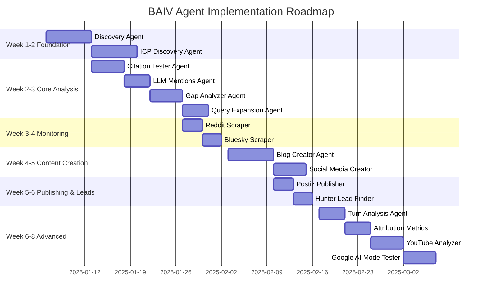

# BAIV Agent Inventory v1.0.0

**Complete Inventory of 16 Primary BAIV Agents**

| Attribute | Value |
|-----------|-------|
| **Document Version** | 1.0.0 |
| **Date** | December 31, 2025 |
| **Purpose** | Complete inventory of BAIV agents with implementation specifications |
| **Status** | 🟢 Active |
| **Owner** | BAIV Product Team |
| **Parent Documents** | AGENT_BUILD_MASTER_LIST.md, UNIVERSAL_AGENT_TEMPLATE.md |
| **Related Artifacts** | PFC-PFI-BAIV_MODULE_CATALOG.md, PFC-PFI-BAIV_INTEGRATION_BRIDGES.md |

---

## Executive Summary

BAIV implements **16 primary agents** organized into **7 phases** following a structured build order. Each agent is self-contained per client (zero cross-contamination) while being orchestrated through shared ontologies and the OAA Registry.

**Agent Distribution:**
- **Phase 1:** 2 foundation agents (Discovery, ICP Discovery)
- **Phase 2:** 6 analysis agents (Citation Tester, Query Expansion, Gap Analyzer, Turn Analysis, LLM Mentions, Attribution Metrics)
- **Phase 3:** 3 monitoring agents (Reddit Scraper, Bluesky Scraper, YouTube Transcript Analyzer)
- **Phase 4:** 2 content creation agents (Blog Creator, Social Media Creator)
- **Phase 5:** 1 publishing agent (Postiz Publisher)
- **Phase 6:** 1 lead generation agent (Hunter Lead Finder)
- **Phase 7:** 1 advanced feature agent (Google Search AI Mode Tester)

**Architecture Principle:** Every agent is standalone + callable. No shared dependencies, no cross-contamination per client.

---

## Table of Contents

1. [Phase 1: Foundation Agents](#phase-1-foundation-agents)
2. [Phase 2: Analysis Agents](#phase-2-analysis-agents)
3. [Phase 3: Monitoring Agents](#phase-3-monitoring-agents)
4. [Phase 4: Content Creation Agents](#phase-4-content-creation-agents)
5. [Phase 5: Publishing Agents](#phase-5-publishing-agents)
6. [Phase 6: Lead Generation Agents](#phase-6-lead-generation-agents)
7. [Phase 7: Advanced Feature Agents](#phase-7-advanced-feature-agents)
8. [Implementation Roadmap](#implementation-roadmap)
9. [Agent Orchestration Patterns](#agent-orchestration-patterns)
10. [Validation Checklist](#validation-checklist)

---

## Phase 1: Foundation Agents

**Purpose:** Create client context that everything else depends on. Run these FIRST for any new client.

### 1.1 Discovery Agent

**Agent ID:** `agent-baiv-discovery-v1.0.0`  
**Agent Name:** Discovery Agent  
**Agent Type:** `orchestrator`  
**Tier:** 1  
**Status:** ⬜ Not Started  
**Priority:** P0 - Critical  
**UAT Reference:** Section 1-4

#### Purpose
Initial client intelligence gathering - creates the master context file that all other agents consume.

#### Ontology Bindings

**Consumes:**
- `BAIV-ONT-Universal-Brand` v1.0+ - Client brand information
- `BAIV-ONT-Customer-Organization` v1.0+ - Client organization structure

**Produces:**
- `BAIV-ONT-Discovery-Report` v1.0 - Discovery findings and analysis
- `BAIV-ONT-Client-Context` v1.0 - Master context file for all agents

**Requires:**
- `PF-ONT-VE-Context` v1.0+ - Strategic context (VSOM, OKR)
- `PF-ONT-Tenant-Config` v1.0+ - Tenant configuration

**Validates:**
- `BAIV-ONT-Discovery-Validation` v1.0+ - Quality standards for discovery

#### Input Schema

```typescript
interface DiscoveryInput {
  tenant_id: string;
  user_id: string;
  client_url: string;
  competitor_urls: string[];  // 2-5 competitors
  industry: string;
  target_geography?: string;  // Optional for local businesses
  brand_voice_notes?: string;
}
```

#### Output Schema

```typescript
interface DiscoveryOutput {
  client_context: {
    client_id: string;
    client_name: string;
    client_url: string;
    industry: string;
    target_geography?: string;
    content_themes: string[];
    key_products: string[];
    brand_messaging: string;
    schema_status: SchemaStatus;
    crawler_permissions: CrawlerPermissions;
    site_architecture: SiteArchitecture;
  };
  discovery_report: {
    website_structure: WebsiteStructure;
    web_presence: WebPresence;
    content_analysis: ContentAnalysis;
    schema_audit: SchemaAudit;
    crawlability_assessment: CrawlabilityAssessment;
  };
  airtable_records: {
    table: "Discovery Audits";
    records: DiscoveryRecord[];
  };
}
```

#### Authority Boundary

```yaml
can_read:
  - entity_type: "tenant_config"
    scope: "tenant"
  - entity_type: "brand_info"
    scope: "tenant"

can_write:
  - entity_type: "discovery_report"
    scope: "tenant"
  - entity_type: "client_context"
    scope: "tenant"

can_delete: []

requires_approval:
  - action: "finalize_client_context"
    approver_role: "admin"
```

#### Resource Limits

```yaml
execution:
  max_execution_time: "10m"
  timeout_action: "graceful_shutdown"
  retry_attempts: 3

api_calls:
  max_per_execution: 100
  max_per_minute: 50

tokens:
  max_input_tokens: 100000
  max_output_tokens: 50000

storage:
  max_storage_mb: 50
```

#### Implementation Status

- [ ] Agent specification created
- [ ] JSON-LD ontologies registered in OAA
- [ ] Input/output schemas defined
- [ ] Authority boundary configured
- [ ] Implementation code written (TypeScript)
- [ ] Unit tests written (80%+ coverage)
- [ ] Integration tests written
- [ ] Deployed to staging
- [ ] Production deployment

#### Run Frequency
**Once at onboarding, then quarterly refresh**

---

### 1.2 ICP Discovery Agent

**Agent ID:** `agent-baiv-icp-discovery-v1.0.0`  
**Agent Name:** ICP Discovery Agent  
**Agent Type:** `domain_specialist`  
**Tier:** 1  
**Status:** ⬜ Not Started  
**Priority:** P0 - Critical  
**UAT Reference:** Section 1-4

#### Purpose
Ideal Customer Profile analysis - identifies who the client serves and where they hang out online.

#### Ontology Bindings

**Consumes:**
- `BAIV-ONT-Client-Context` v1.0+ - Discovery Agent output
- `BAIV-ONT-Customer-Organization` v1.0+ - Existing customer data

**Produces:**
- `BAIV-ONT-ICP-Profile` v1.0 - ICP documentation
- `BAIV-ONT-Customer-Pathway` v1.0 - Customer journey stages

**Requires:**
- `PF-ONT-VE-Context` v1.0+ - Value proposition, PMF signals
- `BAIV-ONT-Client-Context` v1.0+ - Discovery findings

**Validates:**
- `BAIV-ONT-ICP-Validation` v1.0+ - ICP quality standards

#### Input Schema

```typescript
interface ICPDiscoveryInput {
  tenant_id: string;
  user_id: string;
  client_context: ClientContext;  // From Discovery Agent
  existing_personas?: CustomerPersona[];
  target_market_notes?: string;
}
```

#### Output Schema

```typescript
interface ICPDiscoveryOutput {
  icp_profile: {
    customer_segments: CustomerSegment[];
    pain_points: PainPoint[];
    journey_stages: JourneyStage[];  // awareness → consideration → decision
    online_communities: Community[];  // subreddits, forums, social
    query_patterns: QueryPattern[];
    competitor_audiences: CompetitorAudience[];
  };
  updated_client_context: ClientContext;  // Enhanced with ICP section
  airtable_records: {
    table: "ICP Profiles";
    records: ICPRecord[];
  };
  monitoring_targets: {
    subreddits: string[];
    forums: string[];
    social_accounts: string[];
  };
}
```

#### Authority Boundary

```yaml
can_read:
  - entity_type: "client_context"
    scope: "tenant"
  - entity_type: "customer_data"
    scope: "tenant"

can_write:
  - entity_type: "icp_profile"
    scope: "tenant"
  - entity_type: "client_context"
    scope: "tenant"
    conditions: ["append_only"]

can_delete: []

requires_approval: []
```

#### Resource Limits

```yaml
execution:
  max_execution_time: "8m"
  retry_attempts: 3

api_calls:
  max_per_execution: 75

tokens:
  max_input_tokens: 75000
  max_output_tokens: 40000

storage:
  max_storage_mb: 30
```

#### Implementation Status

- [ ] Agent specification created
- [ ] JSON-LD ontologies registered in OAA
- [ ] Input/output schemas defined
- [ ] Authority boundary configured
- [ ] Implementation code written
- [ ] Unit tests (80%+ coverage)
- [ ] Integration tests
- [ ] Deployed to staging
- [ ] Production deployment

#### Run Frequency
**Once at onboarding, refresh when targeting changes**

---

## Phase 2: Analysis Agents

**Purpose:** Analyze where the client currently stands in AI visibility.

### 2.1 Citation Tester Agent

**Agent ID:** `agent-baiv-citation-tester-v1.0.0`  
**Agent Name:** Citation Tester Agent  
**Agent Type:** `domain_specialist`  
**Tier:** 3  
**Status:** ✅ Example Complete  
**Priority:** P0 - Critical  
**UAT Reference:** Section 1-4, Section 8 (JSON-LD Example)

#### Purpose
Tests AI platform citations for client queries across ChatGPT, Claude, Gemini, Perplexity, and Google Search AI Mode. Calculates RPI scores and identifies citation gaps.

#### Ontology Bindings

**Consumes:**
- `BAIV-ONT-Query-Category` v1.0+ - Query definitions to test
- `BAIV-ONT-Platform-Config` v1.0+ - Platform testing configuration
- `BAIV-ONT-Client-Context` v1.0+ - Client and competitor context

**Produces:**
- `BAIV-ONT-Citation-Test-Result` v1.0 - Citation test results
- `BAIV-ONT-RPI-Score` v1.0 - Relevance Position Index scores
- `BAIV-ONT-Citation-Gap` v1.0 - Gap analysis

**Requires:**
- `PF-ONT-VE-Context` v1.0+ - Strategic context for query prioritization
- `BAIV-ONT-ICP-Profile` v1.0+ - Customer pathway context

**Validates:**
- `BAIV-ONT-Citation-Validation` v1.0+ - Quality standards for citation results

#### Input Schema

```typescript
interface CitationTesterInput {
  tenant_id: string;
  user_id: string;
  audit_id: string;
  query_categories: QueryCategory[];
  platforms: Platform[];  // ChatGPT, Claude, Gemini, Perplexity, Google AI Mode
  test_tier: "tier1" | "tier2";  // Tier 1: ChatGPT only, Tier 2: All platforms
  client_url: string;
  competitor_urls: string[];
}
```

#### Output Schema

```typescript
interface CitationTesterOutput {
  audit_results: {
    audit_id: string;
    total_queries_tested: number;
    platforms_tested: string[];
    client_citations: number;
    competitor_citations: number;
    overall_rpi: number;
  };
  citation_results: CitationResult[];
  citation_gaps: CitationGap[];
  competitor_analysis: CompetitorAnalysis;
  airtable_records: {
    table: "Citation Tests";
    records: CitationTestRecord[];
  };
  recommendations: Recommendation[];
}

interface CitationResult {
  query_id: string;
  query_text: string;
  platform: string;
  client_cited: boolean;
  client_position?: number;
  competitors_cited: string[];
  citation_type: "text" | "table" | "interactive" | "calculator";
  rpi_score: number;
  tested_at: string;
}
```

#### Authority Boundary

```yaml
can_read:
  - entity_type: "query_category"
    scope: "tenant"
  - entity_type: "client_context"
    scope: "tenant"
  - entity_type: "audit"
    scope: "tenant"

can_write:
  - entity_type: "citation_result"
    scope: "tenant"
  - entity_type: "rpi_score"
    scope: "tenant"
  - entity_type: "citation_gap"
    scope: "tenant"

can_delete:
  - entity_type: "draft_citation_test"
    scope: "tenant"
    conditions: ["status = 'draft'"]

requires_approval:
  - action: "publish_citation_report"
    approver_role: "editor|admin"
```

#### Resource Limits

```yaml
execution:
  max_execution_time: "15m"  # DataForSEO API can be slow
  timeout_action: "save_partial_results"
  retry_attempts: 3

api_calls:
  max_per_execution: 200  # DataForSEO rate limits
  max_per_minute: 100
  rate_limit_action: "queue"

tokens:
  max_input_tokens: 100000
  max_output_tokens: 75000

storage:
  max_storage_mb: 100  # Large result sets

cooldown:
  between_executions: "60s"  # Rate limiting
  after_error: "120s"
```

#### Implementation Status

- [x] Agent specification created
- [x] JSON-LD ontologies registered in OAA
- [x] Input/output schemas defined
- [x] Authority boundary configured
- [ ] Implementation code written
- [ ] Unit tests (80%+ coverage)
- [ ] Integration tests
- [ ] Deployed to staging
- [ ] Production deployment

#### Run Frequency
**Weekly or bi-weekly**

---

### 2.2 Query Expansion Agent

**Agent ID:** `agent-baiv-query-expansion-v1.0.0`  
**Agent Name:** Query Expansion Agent  
**Agent Type:** `domain_specialist`  
**Tier:** 2  
**Status:** ⬜ Not Started  
**Priority:** P1 - High  
**UAT Reference:** Section 1-4

#### Purpose
Generates comprehensive query variations and maps to customer pathways. Replicates Gemini Deep Research query expansion.

#### Ontology Bindings

**Consumes:**
- `BAIV-ONT-Query-Category` v1.0+ - Core queries to expand
- `BAIV-ONT-ICP-Profile` v1.0+ - Customer pathways
- `BAIV-ONT-Client-Context` v1.0+ - Client context

**Produces:**
- `BAIV-ONT-Query-Fanout` v1.0 - Query variations (25+ per core query)
- `BAIV-ONT-Search-Intent` v1.0 - Intent analysis per variation
- `BAIV-ONT-Content-Gap` v1.0 - Content gaps per query cluster

**Requires:**
- `PF-ONT-VE-Context` v1.0+ - Strategic objectives
- `BAIV-ONT-Citation-Test-Result` v1.0+ - Current citation performance

**Validates:**
- `BAIV-ONT-Query-Validation` v1.0+ - Query quality standards

#### Input Schema

```typescript
interface QueryExpansionInput {
  tenant_id: string;
  user_id: string;
  core_queries: string[];
  customer_pathways: CustomerPathway[];
  expansion_depth: number;  // Default: 25
}
```

#### Output Schema

```typescript
interface QueryExpansionOutput {
  query_clusters: QueryCluster[];
  intent_analysis: IntentAnalysis[];
  pathway_mapping: PathwayMapping[];
  content_gaps: ContentGap[];
  opportunity_priorities: OpportunityPriority[];
  airtable_records: {
    table: "Query Fanout";
    records: QueryFanoutRecord[];
  };
}

interface QueryCluster {
  core_query: string;
  variations: string[];  // 25+ variations
  total_search_volume?: number;
  cluster_intent: "informational" | "navigational" | "transactional" | "commercial";
}
```

#### Authority Boundary

```yaml
can_read:
  - entity_type: "query_category"
    scope: "tenant"
  - entity_type: "icp_profile"
    scope: "tenant"
  - entity_type: "citation_result"
    scope: "tenant"

can_write:
  - entity_type: "query_fanout"
    scope: "tenant"
  - entity_type: "search_intent"
    scope: "tenant"
  - entity_type: "content_gap"
    scope: "tenant"

can_delete: []

requires_approval: []
```

#### Resource Limits

```yaml
execution:
  max_execution_time: "10m"
  retry_attempts: 3

api_calls:
  max_per_execution: 150

tokens:
  max_input_tokens: 80000
  max_output_tokens: 60000

storage:
  max_storage_mb: 50
```

#### Implementation Status

- [ ] Agent specification created
- [ ] JSON-LD ontologies registered in OAA
- [ ] Input/output schemas defined
- [ ] Authority boundary configured
- [ ] Implementation code written
- [ ] Unit tests (80%+ coverage)
- [ ] Integration tests
- [ ] Deployed to staging
- [ ] Production deployment

#### Run Frequency
**Monthly or when targeting new topics**

---

### 2.3 Gap Analyzer Agent

**Agent ID:** `agent-baiv-gap-analyzer-v1.0.0`  
**Agent Name:** Gap Analyzer Agent  
**Agent Type:** `domain_specialist`  
**Tier:** 2  
**Status:** ⬜ Not Started  
**Priority:** P0 - Critical  
**UAT Reference:** Section 1-4, Section 3.2 (Gap Analysis)

#### Purpose
RRF-based content gap analysis. Key insight: Breadth > Depth (20 articles ranking #5 beat 1 article ranking #1 in RRF).

#### Ontology Bindings

**Consumes:**
- `BAIV-ONT-Citation-Test-Result` v1.0+ - Current citation performance
- `BAIV-ONT-Query-Fanout` v1.0+ - Query variations
- `BAIV-ONT-Client-Context` v1.0+ - Client and competitor content

**Produces:**
- `BAIV-ONT-Gap-Analysis` v1.0 - Content gaps (product-level)
- `BAIV-ONT-RRF-Score` v1.0 - RRF health score (0-100)
- `BAIV-ONT-Content-Recommendation` v1.0 - Prioritized recommendations

**Requires:**
- `PF-ONT-VE-Context` v1.0+ - Strategic priorities
- `BAIV-ONT-ICP-Profile` v1.0+ - Customer needs

**Validates:**
- `BAIV-ONT-Gap-Validation` v1.0+ - Gap analysis quality standards

#### Input Schema

```typescript
interface GapAnalyzerInput {
  tenant_id: string;
  user_id: string;
  audit_id: string;
  citation_results: CitationResult[];
  competitor_urls: string[];
  topic_areas: string[];
}
```

#### Output Schema

```typescript
interface GapAnalyzerOutput {
  gap_analysis: {
    total_gaps: number;
    critical_gaps: number;
    rrf_health_score: number;  // 0-100
    content_depth_score: number;  // 0-100
  };
  gaps: Gap[];
  rrf_topic_coverage: RRFTopicCoverage[];
  competitor_comparison: CompetitorComparison;
  recommendations: ContentRecommendation[];
  airtable_records: {
    tables: ["Gap Analysis", "RRF Topic Coverage"];
    records: GapRecord[];
  };
}

interface Gap {
  gap_id: string;
  gap_type: "topic_coverage" | "keyword" | "citation_opportunity" | "competitor_advantage";
  topic: string;
  competitor_citations: number;
  client_citations: number;
  priority: "P0" | "P1" | "P2" | "P3";
  rrf_score: number;
  recommendation: string;
  estimated_impact: string;
}
```

#### Authority Boundary

```yaml
can_read:
  - entity_type: "citation_result"
    scope: "tenant"
  - entity_type: "query_fanout"
    scope: "tenant"
  - entity_type: "client_context"
    scope: "tenant"

can_write:
  - entity_type: "gap_analysis"
    scope: "tenant"
  - entity_type: "rrf_score"
    scope: "tenant"
  - entity_type: "content_recommendation"
    scope: "tenant"

can_delete: []

requires_approval: []
```

#### Resource Limits

```yaml
execution:
  max_execution_time: "12m"
  retry_attempts: 3

api_calls:
  max_per_execution: 200

tokens:
  max_input_tokens: 120000
  max_output_tokens: 80000

storage:
  max_storage_mb: 75
```

#### Implementation Status

- [ ] Agent specification created
- [ ] JSON-LD ontologies registered in OAA
- [ ] Input/output schemas defined
- [ ] Authority boundary configured
- [ ] Implementation code written
- [ ] Unit tests (80%+ coverage)
- [ ] Integration tests
- [ ] Deployed to staging
- [ ] Production deployment

#### Run Frequency
**Monthly**

---

### 2.4 Turn Analysis Agent

**Agent ID:** `agent-baiv-turn-analysis-v1.0.0`  
**Agent Name:** Turn Analysis Agent  
**Agent Type:** `domain_specialist`  
**Tier:** 3  
**Status:** ⬜ Not Started  
**Priority:** P2 - Medium  
**UAT Reference:** Section 1-4

#### Purpose
Analyzes conversation turn patterns and customer journey stages to optimize for multi-turn AI conversations.

#### Ontology Bindings

**Consumes:**
- `BAIV-ONT-Citation-Test-Result` v1.0+ - Citation performance by query
- `BAIV-ONT-Customer-Pathway` v1.0+ - Journey stages
- `BAIV-ONT-Query-Category` v1.0+ - Query classifications

**Produces:**
- `BAIV-ONT-Turn-Analysis` v1.0 - Turn pattern analysis
- `BAIV-ONT-Journey-Stage-Performance` v1.0 - Performance by stage
- `BAIV-ONT-Conversation-Pattern` v1.0 - Identified patterns

**Requires:**
- `PF-ONT-VE-Context` v1.0+ - Strategic goals
- `BAIV-ONT-ICP-Profile` v1.0+ - Customer behaviors

**Validates:**
- `BAIV-ONT-Turn-Validation` v1.0+ - Analysis quality standards

#### Input Schema

```typescript
interface TurnAnalysisInput {
  tenant_id: string;
  user_id: string;
  citation_results: CitationResult[];
  journey_stages: JourneyStage[];
  conversation_depth: "initial" | "follow_up" | "deep";
}
```

#### Output Schema

```typescript
interface TurnAnalysisOutput {
  turn_patterns: TurnPattern[];
  stage_performance: StagePerformance[];
  conversation_scenarios: ConversationScenario[];
  optimization_recommendations: Recommendation[];
  airtable_records: {
    table: "Turn Analysis";
    records: TurnAnalysisRecord[];
  };
}

interface TurnPattern {
  pattern_type: "quick_answer" | "research_journey" | "comparison";
  turn_depth: number;
  journey_stage: "awareness" | "consideration" | "decision";
  citation_rate: number;
  recommendations: string[];
}
```

#### Authority Boundary

```yaml
can_read:
  - entity_type: "citation_result"
    scope: "tenant"
  - entity_type: "customer_pathway"
    scope: "tenant"

can_write:
  - entity_type: "turn_analysis"
    scope: "tenant"

can_delete: []

requires_approval: []
```

#### Resource Limits

```yaml
execution:
  max_execution_time: "8m"
  retry_attempts: 3

tokens:
  max_input_tokens: 100000
  max_output_tokens: 60000

storage:
  max_storage_mb: 40
```

#### Implementation Status

- [ ] Agent specification created
- [ ] JSON-LD ontologies registered in OAA
- [ ] Input/output schemas defined
- [ ] Implementation code written
- [ ] Tests (80%+ coverage)
- [ ] Deployed

#### Run Frequency
**Monthly**

---

### 2.5 LLM Mentions Agent

**Agent ID:** `agent-baiv-llm-mentions-v1.0.0`  
**Agent Name:** LLM Mentions Agent  
**Agent Type:** `domain_specialist`  
**Tier:** 3  
**Status:** ⬜ Not Started  
**Priority:** P1 - High  
**UAT Reference:** Section 1-4

#### Purpose
Passive monitoring for brand/client mentions across AI platforms via DataForSEO. Different from Citation Tester: discovers ANY mention, not just tested queries.

#### Ontology Bindings

**Consumes:**
- `BAIV-ONT-Universal-Brand` v1.0+ - Brand and product names
- `BAIV-ONT-Client-Context` v1.0+ - Competitor names

**Produces:**
- `BAIV-ONT-LLM-Mention` v1.0 - Brand mentions discovered
- `BAIV-ONT-Share-Of-Voice` v1.0 - Share of voice metrics
- `BAIV-ONT-Sentiment-Analysis` v1.0 - Mention sentiment

**Requires:**
- `PF-ONT-VE-Context` v1.0+ - Brand priorities
- `BAIV-ONT-ICP-Profile` v1.0+ - Expected contexts

**Validates:**
- `BAIV-ONT-Mention-Validation` v1.0+ - Mention quality standards

#### Input Schema

```typescript
interface LLMMentionsInput {
  tenant_id: string;
  user_id: string;
  brand_names: string[];
  product_names: string[];
  competitor_brands: string[];
  platforms: Platform[];
  lookback_days: number;  // Default: 7
}
```

#### Output Schema

```typescript
interface LLMMentionsOutput {
  mentions: Mention[];
  share_of_voice: ShareOfVoice;
  sentiment_breakdown: SentimentBreakdown;
  new_discovery_alerts: DiscoveryAlert[];
  trend_analysis: TrendAnalysis;
  airtable_records: {
    table: "LLM Mentions";
    records: MentionRecord[];
  };
}

interface Mention {
  mention_id: string;
  platform: string;
  query_context: string;
  brand_mentioned: string;
  mention_type: "direct_citation" | "brand_mention" | "indirect_reference";
  position?: number;
  sentiment: "positive" | "negative" | "neutral";
  discovered_at: string;
}
```

#### Authority Boundary

```yaml
can_read:
  - entity_type: "brand_info"
    scope: "tenant"
  - entity_type: "client_context"
    scope: "tenant"

can_write:
  - entity_type: "llm_mention"
    scope: "tenant"
  - entity_type: "share_of_voice"
    scope: "tenant"

can_delete:
  - entity_type: "old_mention"
    scope: "tenant"
    conditions: ["age > 90 days"]

requires_approval: []
```

#### Resource Limits

```yaml
execution:
  max_execution_time: "10m"
  retry_attempts: 3

api_calls:
  max_per_execution: 150

tokens:
  max_input_tokens: 80000
  max_output_tokens: 50000

storage:
  max_storage_mb: 60
```

#### Implementation Status

- [ ] Agent specification created
- [ ] JSON-LD ontologies registered
- [ ] Implementation code written
- [ ] Tests (80%+ coverage)
- [ ] Deployed

#### Run Frequency
**Daily or every other day**

---

### 2.6 Attribution Metrics Agent

**Agent ID:** `agent-baiv-attribution-metrics-v1.0.0`  
**Agent Name:** Attribution Metrics Agent  
**Agent Type:** `domain_specialist`  
**Tier:** 2  
**Status:** ⬜ Not Started  
**Priority:** P1 - High  
**UAT Reference:** Section 1-4

#### Purpose
Calculates AI Visibility Score (0-100) from 5 weighted factors and projects ROI.

#### Ontology Bindings

**Consumes:**
- `BAIV-ONT-Citation-Test-Result` v1.0+ - Citation rate
- `BAIV-ONT-RPI-Score` v1.0+ - Position scores
- `BAIV-ONT-Journey-Stage-Performance` v1.0+ - Coverage
- `BAIV-ONT-Gap-Analysis` v1.0+ - Content authority

**Produces:**
- `BAIV-ONT-AI-Visibility-Score` v1.0 - Overall score (0-100)
- `BAIV-ONT-ROI-Projection` v1.0 - Traffic and revenue projections
- `BAIV-ONT-Competitor-Benchmark` v1.0 - Competitive comparison

**Requires:**
- `PF-ONT-VE-Context` v1.0+ - Strategic goals, PMF signals
- `PF-ONT-GTM-Strategy` v1.0+ - Revenue targets

**Validates:**
- `BAIV-ONT-Metrics-Validation` v1.0+ - Calculation accuracy

#### Input Schema

```typescript
interface AttributionMetricsInput {
  tenant_id: string;
  user_id: string;
  audit_id: string;
  citation_results: CitationResult[];
  rpi_scores: RPIScore[];
  platform_consistency: PlatformConsistency;
  journey_coverage: JourneyCoverage;
  content_authority: ContentAuthority;
}
```

#### Output Schema

```typescript
interface AttributionMetricsOutput {
  visibility_score: {
    overall_score: number;  // 0-100
    citation_rate: number;  // 40 points max
    rpi_score: number;  // 25 points max
    platform_consistency: number;  // 15 points max
    journey_coverage: number;  // 10 points max
    content_authority: number;  // 10 points max
  };
  roi_projection: {
    current_traffic: number;
    projected_traffic: number;
    traffic_increase_pct: number;
    projected_conversions: number;
    projected_revenue: number;
  };
  competitor_benchmark: CompetitorBenchmark;
  leading_indicators: LeadingIndicator[];
  airtable_records: {
    table: "Attribution Metrics";
    records: MetricsRecord[];
  };
}
```

#### Authority Boundary

```yaml
can_read:
  - entity_type: "citation_result"
    scope: "tenant"
  - entity_type: "rpi_score"
    scope: "tenant"
  - entity_type: "gap_analysis"
    scope: "tenant"

can_write:
  - entity_type: "visibility_score"
    scope: "tenant"
  - entity_type: "roi_projection"
    scope: "tenant"

can_delete: []

requires_approval: []
```

#### Resource Limits

```yaml
execution:
  max_execution_time: "5m"
  retry_attempts: 3

tokens:
  max_input_tokens: 60000
  max_output_tokens: 40000

storage:
  max_storage_mb: 30
```

#### Implementation Status

- [ ] Agent specification created
- [ ] JSON-LD ontologies registered
- [ ] Implementation code written
- [ ] Tests (80%+ coverage)
- [ ] Deployed

#### Run Frequency
**Monthly**

---

## Phase 3: Monitoring Agents

**Purpose:** Daily scrapers to keep social listening data fresh.

### 3.1 Reddit Scraper Agent

**Agent ID:** `agent-baiv-reddit-scraper-v1.0.0`  
**Agent Name:** Reddit Scraper Agent  
**Agent Type:** `utility`  
**Tier:** 3  
**Status:** ⬜ Not Started  
**Priority:** P2 - Medium  
**UAT Reference:** Section 1-4

#### Purpose
Monitors subreddits for pain points, solutions, and content opportunities.

#### Ontology Bindings

**Consumes:**
- `BAIV-ONT-ICP-Profile` v1.0+ - Subreddits to monitor
- `BAIV-ONT-Client-Context` v1.0+ - Topics of interest

**Produces:**
- `BAIV-ONT-Reddit-Mention` v1.0 - Reddit posts discovered
- `BAIV-ONT-Pain-Point` v1.0 - Pain points extracted
- `BAIV-ONT-Content-Opportunity` v1.0 - Content ideas

**Requires:**
- `PF-ONT-VE-Context` v1.0+ - Strategic priorities
- `BAIV-ONT-Query-Category` v1.0+ - Topic matching

**Validates:**
- `BAIV-ONT-Reddit-Validation` v1.0+ - Post relevance standards

#### Input Schema

```typescript
interface RedditScraperInput {
  tenant_id: string;
  user_id: string;
  subreddits: string[];
  keywords: string[];
  lookback_hours: number;  // Default: 24
  min_relevance_score: number;  // Default: 0.7
}
```

#### Output Schema

```typescript
interface RedditScraperOutput {
  reddit_mentions: RedditMention[];
  pain_points: PainPoint[];
  solutions_discussed: Solution[];
  engagement_opportunities: EngagementOpportunity[];
  content_ideas: ContentIdea[];
  airtable_records: {
    table: "Reddit Mentions";
    records: RedditRecord[];
  };
  daily_digest: string;  // Markdown summary
}

interface RedditMention {
  post_id: string;
  subreddit: string;
  title: string;
  content: string;
  pain_points: string[];
  solutions: string[];
  relevance_score: number;
  engagement_priority: "high" | "medium" | "low";
  posted_at: string;
}
```

#### Authority Boundary

```yaml
can_read:
  - entity_type: "icp_profile"
    scope: "tenant"
  - entity_type: "client_context"
    scope: "tenant"

can_write:
  - entity_type: "reddit_mention"
    scope: "tenant"
  - entity_type: "pain_point"
    scope: "tenant"
  - entity_type: "content_opportunity"
    scope: "tenant"

can_delete:
  - entity_type: "old_reddit_mention"
    scope: "tenant"
    conditions: ["age > 30 days"]

requires_approval: []
```

#### Resource Limits

```yaml
execution:
  max_execution_time: "8m"
  retry_attempts: 3

api_calls:
  max_per_execution: 100  # Reddit API limits

tokens:
  max_input_tokens: 80000
  max_output_tokens: 50000

storage:
  max_storage_mb: 40
```

#### Implementation Status

- [ ] Agent specification created
- [ ] JSON-LD ontologies registered
- [ ] Implementation code written
- [ ] Tests (80%+ coverage)
- [ ] Deployed

#### Run Frequency
**Daily**

---

### 3.2 Bluesky Scraper Agent

**Agent ID:** `agent-baiv-bluesky-scraper-v1.0.0`  
**Agent Name:** Bluesky Scraper Agent  
**Agent Type:** `utility`  
**Tier:** 3  
**Status:** ⬜ Not Started  
**Priority:** P2 - Medium  
**UAT Reference:** Section 1-4

#### Purpose
Monitors Bluesky for content opportunities and engagement.

#### Ontology Bindings

**Consumes:**
- `BAIV-ONT-ICP-Profile` v1.0+ - Target accounts/hashtags
- `BAIV-ONT-Client-Context` v1.0+ - Topics of interest

**Produces:**
- `BAIV-ONT-Bluesky-Mention` v1.0 - Bluesky posts discovered
- `BAIV-ONT-Trend-Analysis` v1.0 - Trending topics
- `BAIV-ONT-Engagement-Opportunity` v1.0 - Engagement flags

**Requires:**
- `PF-ONT-VE-Context` v1.0+ - Brand voice guidelines

**Validates:**
- `BAIV-ONT-Bluesky-Validation` v1.0+ - Post relevance standards

#### Input Schema

```typescript
interface BlueskyScraperInput {
  tenant_id: string;
  user_id: string;
  hashtags: string[];
  accounts: string[];
  keywords: string[];
  lookback_hours: number;  // Default: 24
}
```

#### Output Schema

```typescript
interface BlueskyScraperOutput {
  bluesky_mentions: BlueskyMention[];
  trend_analysis: TrendAnalysis;
  engagement_opportunities: EngagementOpportunity[];
  thought_leadership_opportunities: ThoughtLeadershipOpportunity[];
  airtable_records: {
    table: "Bluesky Mentions";
    records: BlueskyRecord[];
  };
}
```

#### Authority Boundary

```yaml
can_read:
  - entity_type: "icp_profile"
    scope: "tenant"

can_write:
  - entity_type: "bluesky_mention"
    scope: "tenant"

can_delete:
  - entity_type: "old_bluesky_mention"
    conditions: ["age > 30 days"]

requires_approval: []
```

#### Resource Limits

```yaml
execution:
  max_execution_time: "6m"

api_calls:
  max_per_execution: 80

tokens:
  max_input_tokens: 60000
  max_output_tokens: 40000

storage:
  max_storage_mb: 30
```

#### Implementation Status

- [ ] Agent specification created
- [ ] JSON-LD ontologies registered
- [ ] Implementation
- [ ] Tests (80%+ coverage)
- [ ] Deployed

#### Run Frequency
**Daily**

---

### 3.3 YouTube Transcript Analyzer Agent

**Agent ID:** `agent-baiv-youtube-analyzer-v1.0.0`  
**Agent Name:** YouTube Transcript Analyzer Agent  
**Agent Type:** `domain_specialist`  
**Tier:** 3  
**Status:** ⬜ Not Started  
**Priority:** P2 - Medium  
**UAT Reference:** Section 1-4

#### Purpose
Analyzes YouTube video transcripts for AI citation opportunities.

#### Ontology Bindings

**Consumes:**
- `BAIV-ONT-Client-Context` v1.0+ - Client YouTube channel
- `BAIV-ONT-Query-Category` v1.0+ - Query alignment

**Produces:**
- `BAIV-ONT-YouTube-Analysis` v1.0 - Video analysis results
- `BAIV-ONT-Citation-Potential` v1.0 - Citation potential scores
- `BAIV-ONT-Content-Recommendation` v1.0 - Article recommendations from videos

**Requires:**
- `PF-ONT-VE-Context` v1.0+ - Content authority markers

**Validates:**
- `BAIV-ONT-YouTube-Validation` v1.0+ - Analysis quality standards

#### Input Schema

```typescript
interface YouTubeAnalyzerInput {
  tenant_id: string;
  user_id: string;
  channel_url: string;
  video_urls?: string[];  // Optional: specific videos
  lookback_days: number;  // Default: 30
  incremental: boolean;  // Default: true (only new videos)
}
```

#### Output Schema

```typescript
interface YouTubeAnalyzerOutput {
  video_analyses: VideoAnalysis[];
  high_potential_videos: Video[];
  content_recommendations: ContentRecommendation[];
  airtable_records: {
    table: "YouTube Video Analysis";
    records: YouTubeRecord[];
  };
}

interface VideoAnalysis {
  video_id: string;
  title: string;
  transcript: string;
  citation_potential_score: number;  // 0-100
  scores: {
    content_authority: number;  // 0-25
    query_alignment: number;  // 0-25
    trigger_words: number;  // 0-25
    content_completeness: number;  // 0-25
  };
  priority: "high" | "medium" | "low";  // high = 80+, medium = 60-79, low < 60
  recommended_articles: string[];
}
```

#### Authority Boundary

```yaml
can_read:
  - entity_type: "client_context"
    scope: "tenant"
  - entity_type: "query_category"
    scope: "tenant"

can_write:
  - entity_type: "youtube_analysis"
    scope: "tenant"
  - entity_type: "content_recommendation"
    scope: "tenant"

can_delete: []

requires_approval: []
```

#### Resource Limits

```yaml
execution:
  max_execution_time: "15m"  # Transcript fetching can be slow

api_calls:
  max_per_execution: 50  # YouTube API quota

tokens:
  max_input_tokens: 150000  # Long transcripts
  max_output_tokens: 80000

storage:
  max_storage_mb: 100
```

#### Implementation Status

- [ ] Agent specification created
- [ ] JSON-LD ontologies registered
- [ ] Implementation
- [ ] Tests (80%+ coverage)
- [ ] Deployed

#### Run Frequency
**Weekly (incremental)**

---

## Phase 4: Content Creation Agents

**Purpose:** Generate content based on gaps and opportunities.

### 4.1 Blog Creator Agent

**Agent ID:** `agent-baiv-blog-creator-v1.0.0`  
**Agent Name:** Blog Creator Agent  
**Agent Type:** `orchestrator`  
**Tier:** 2  
**Status:** ⬜ Not Started  
**Priority:** P1 - High  
**UAT Reference:** Section 1-4

#### Purpose
Generates 2500+ word AI-optimized blog posts using multi-stage generation with prompt caching (76% cost reduction).

#### Ontology Bindings

**Consumes:**
- `BAIV-ONT-Content-Brief` v1.0+ - Content briefs
- `BAIV-ONT-Client-Context` v1.0+ - Brand voice, discovery data
- `BAIV-ONT-Gap-Analysis` v1.0+ - Content gaps to address
- `BAIV-ONT-Citation-Test-Result` v1.0+ - Citation patterns
- `BAIV-ONT-RRF-Score` v1.0+ - RRF coverage context

**Produces:**
- `BAIV-ONT-Blog-Post` v1.0 - Complete blog post (markdown)
- `BAIV-ONT-FAQ-Page` v1.0 - Generated FAQs
- `BAIV-ONT-Schema-Markup` v1.0 - Article schema
- `BAIV-ONT-Meta-Tags` v1.0 - SEO meta tags
- `BAIV-ONT-Link-Suggestions` v1.0 - Internal/external links
- `BAIV-ONT-Image-Asset` v1.0 - Generated images

**Requires:**
- `PF-ONT-VE-Context` v1.0+ - Value proposition, brand guidelines
- `BAIV-ONT-ICP-Profile` v1.0+ - Target audience

**Validates:**
- `BAIV-ONT-Content-Validation` v1.0+ - Content quality standards

#### Sub-Agents (Called by Blog Creator)
1. FAQ Generator Agent
2. Meta Generator Agent
3. Schema Generator Agent
4. Link Suggester Agent
5. Image Generator Agent

#### Input Schema

```typescript
interface BlogCreatorInput {
  tenant_id: string;
  user_id: string;
  content_brief: {
    topic: string;
    target_keyword: string;
    target_audience: string;
    tone: "professional" | "conversational" | "technical";
    content_goals: string[];
  };
  target_word_count: number;  // Default: 2500
  generate_images: boolean;  // Default: true
  generate_schema: boolean;  // Default: true
}
```

#### Output Schema

```typescript
interface BlogCreatorOutput {
  blog_post: {
    title: string;
    slug: string;
    content: string;  // Markdown
    word_count: number;
    sections: BlogSection[];
    toc: TableOfContents;
  };
  faqs: FAQ[];
  schema_markup: SchemaMarkup;
  meta_tags: MetaTags;
  link_suggestions: LinkSuggestions;
  images: GeneratedImage[];
  airtable_records: {
    table: "Content Queue";
    records: ContentRecord[];
  };
}

interface BlogSection {
  heading: string;
  content: string;
  word_count: number;
}
```

#### Authority Boundary

```yaml
can_read:
  - entity_type: "content_brief"
    scope: "tenant"
  - entity_type: "client_context"
    scope: "tenant"
  - entity_type: "gap_analysis"
    scope: "tenant"

can_write:
  - entity_type: "blog_post"
    scope: "tenant"
  - entity_type: "faq_page"
    scope: "tenant"
  - entity_type: "schema_markup"
    scope: "tenant"

can_delete:
  - entity_type: "draft_blog_post"
    conditions: ["status = 'draft'", "age > 30 days"]

requires_approval:
  - action: "publish_blog_post"
    approver_role: "editor|admin"
```

#### Resource Limits

```yaml
execution:
  max_execution_time: "20m"  # Multi-stage generation

api_calls:
  max_per_execution: 300  # Multiple sub-agents

tokens:
  max_input_tokens: 200000  # Large context with caching
  max_output_tokens: 150000

storage:
  max_storage_mb: 200  # Images + content

cooldown:
  between_executions: "60s"
```

#### Implementation Status

- [ ] Agent specification created
- [ ] JSON-LD ontologies registered
- [ ] Implementation (10-stage pipeline)
- [ ] Sub-agents integrated
- [ ] Tests (80%+ coverage)
- [ ] Deployed

#### Run Frequency
**On-demand based on content calendar**

---

### 4.2 Social Media Creator Agent

**Agent ID:** `agent-baiv-social-creator-v1.0.0`  
**Agent Name:** Social Media Creator Agent  
**Agent Type:** `domain_specialist`  
**Tier:** 3  
**Status:** ⬜ Not Started  
**Priority:** P2 - Medium  
**UAT Reference:** Section 1-4

#### Purpose
Generates platform-optimized social media posts with platform-specific formatting, hashtags, and images.

#### Ontology Bindings

**Consumes:**
- `BAIV-ONT-Content-Brief` v1.0+ - Post briefs
- `BAIV-ONT-Client-Context` v1.0+ - Brand voice
- `BAIV-ONT-Reddit-Mention` v1.0+ - Reddit content source (optional)
- `BAIV-ONT-Bluesky-Mention` v1.0+ - Bluesky content source (optional)
- `BAIV-ONT-Gap-Analysis` v1.0+ - Gap-based content (optional)
- `BAIV-ONT-Blog-Post` v1.0+ - Blog-based posts (optional)

**Produces:**
- `BAIV-ONT-Social-Post` v1.0 - Platform-optimized posts
- `BAIV-ONT-Hashtag-Set` v1.0 - Hashtag recommendations
- `BAIV-ONT-Social-Image` v1.0 - Generated social images

**Requires:**
- `PF-ONT-VE-Context` v1.0+ - Brand guidelines
- `BAIV-ONT-ICP-Profile` v1.0+ - Audience preferences

**Validates:**
- `BAIV-ONT-Social-Validation` v1.0+ - Post quality standards

#### Input Schema

```typescript
interface SocialMediaCreatorInput {
  tenant_id: string;
  user_id: string;
  platforms: SocialPlatform[];  // LinkedIn, Facebook, Instagram, Twitter, Threads, Bluesky
  content_source: {
    type: "manual" | "reddit" | "bluesky" | "gap" | "blog";
    source_id?: string;
    manual_brief?: string;
  };
  generate_images: boolean;  // Default: true
}

type SocialPlatform = "linkedin" | "facebook" | "instagram" | "twitter" | "threads" | "bluesky";
```

#### Output Schema

```typescript
interface SocialMediaCreatorOutput {
  social_posts: SocialPost[];
  airtable_records: {
    table: "Social Content Queue";
    records: SocialRecord[];
  };
}

interface SocialPost {
  platform: SocialPlatform;
  content: string;
  character_count: number;
  hashtags: string[];
  image_url?: string;
  optimal_post_time?: string;
  platform_specific: {
    linkedin?: { tone: "professional"; length: "1300-2000 chars" };
    facebook?: { tone: "conversational"; length: "40-80 chars optimal" };
    instagram?: { hashtag_count: "5-10"; max_length: "2200 chars" };
    twitter?: { max_length: "280 chars" };
    threads?: { tone: "conversational"; style: "authentic" };
    bluesky?: { tone: "community-focused" };
  };
}
```

#### Authority Boundary

```yaml
can_read:
  - entity_type: "content_brief"
    scope: "tenant"
  - entity_type: "reddit_mention"
    scope: "tenant"
  - entity_type: "blog_post"
    scope: "tenant"

can_write:
  - entity_type: "social_post"
    scope: "tenant"

can_delete:
  - entity_type: "draft_social_post"
    conditions: ["status = 'draft'", "age > 7 days"]

requires_approval:
  - action: "publish_social_post"
    approver_role: "editor|admin"
```

#### Resource Limits

```yaml
execution:
  max_execution_time: "10m"

api_calls:
  max_per_execution: 100

tokens:
  max_input_tokens: 80000
  max_output_tokens: 50000

storage:
  max_storage_mb: 60
```

#### Implementation Status

- [ ] Agent specification created
- [ ] JSON-LD ontologies registered
- [ ] Platform-specific templates
- [ ] Implementation
- [ ] Tests (80%+ coverage)
- [ ] Deployed

#### Run Frequency
**On-demand or batch weekly**

---

## Phase 5: Publishing Agents

**Purpose:** Push content to platforms.

### 5.1 Postiz Publisher Agent

**Agent ID:** `agent-baiv-postiz-publisher-v1.0.0`  
**Agent Name:** Postiz Publisher Agent  
**Agent Type:** `integration`  
**Tier:** 3  
**Status:** ⬜ Not Started  
**Priority:** P2 - Medium  
**UAT Reference:** Section 1-4

#### Purpose
Publishes content via Postiz social media management platform.

#### Ontology Bindings

**Consumes:**
- `BAIV-ONT-Social-Post` v1.0+ - Posts to publish
- `BAIV-ONT-Publishing-Schedule` v1.0+ - Schedule configuration

**Produces:**
- `BAIV-ONT-Publishing-Log` v1.0 - Publishing confirmation
- `BAIV-ONT-Post-Status` v1.0 - Published post status

**Requires:**
- `PF-ONT-Tenant-Config` v1.0+ - Postiz API credentials

**Validates:**
- `BAIV-ONT-Publishing-Validation` v1.0+ - Publishing quality checks

#### Input Schema

```typescript
interface PostizPublisherInput {
  tenant_id: string;
  user_id: string;
  post_id: string;
  platforms: SocialPlatform[];
  schedule_type: "immediate" | "scheduled";
  scheduled_time?: string;  // ISO 8601
}
```

#### Output Schema

```typescript
interface PostizPublisherOutput {
  published_posts: PublishedPost[];
  publishing_status: "success" | "partial" | "failed";
  errors?: PublishingError[];
  airtable_records: {
    table: "Publishing Log";
    records: PublishingRecord[];
  };
}

interface PublishedPost {
  platform: SocialPlatform;
  post_url: string;
  published_at: string;
  status: "published" | "scheduled" | "failed";
}
```

#### Authority Boundary

```yaml
can_read:
  - entity_type: "social_post"
    scope: "tenant"
    conditions: ["status = 'approved'"]

can_write:
  - entity_type: "publishing_log"
    scope: "tenant"
  - entity_type: "post_status"
    scope: "tenant"

can_delete: []

requires_approval: []  # Already approved at creation
```

#### Resource Limits

```yaml
execution:
  max_execution_time: "5m"

api_calls:
  max_per_execution: 20  # Postiz API limits

storage:
  max_storage_mb: 20
```

#### Implementation Status

- [ ] Agent specification created
- [ ] Postiz API integration
- [ ] Implementation
- [ ] Tests
- [ ] Deployed

#### Run Frequency
**On-demand or scheduled**

---

## Phase 6: Lead Generation Agents

**Purpose:** Business development automation.

### 6.1 Hunter Lead Finder Agent

**Agent ID:** `agent-baiv-hunter-lead-finder-v1.0.0`  
**Agent Name:** Hunter Lead Finder Agent  
**Agent Type:** `integration`  
**Tier:** 3  
**Status:** ⬜ Not Started  
**Priority:** P2 - Medium  
**UAT Reference:** Section 1-4

#### Purpose
Finds email addresses and company information using Hunter.io API.

#### Ontology Bindings

**Consumes:**
- `BAIV-ONT-Target-Company` v1.0+ - Companies to research
- `BAIV-ONT-ICP-Profile` v1.0+ - ICP matching criteria

**Produces:**
- `BAIV-ONT-Lead` v1.0 - Verified leads with contact info
- `BAIV-ONT-Company-Profile` v1.0 - Company information

**Requires:**
- `PF-ONT-Tenant-Config` v1.0+ - Hunter API credentials
- `PF-ONT-VE-Context` v1.0+ - Target market definition

**Validates:**
- `BAIV-ONT-Lead-Validation` v1.0+ - Lead quality standards

#### Input Schema

```typescript
interface HunterLeadFinderInput {
  tenant_id: string;
  user_id: string;
  target_domains: string[];
  lead_criteria?: {
    job_titles?: string[];
    departments?: string[];
    seniority?: string[];
  };
  verify_emails: boolean;  // Default: true
}
```

#### Output Schema

```typescript
interface HunterLeadFinderOutput {
  leads: Lead[];
  company_profiles: CompanyProfile[];
  airtable_records: {
    table: "Leads";
    records: LeadRecord[];
  };
}

interface Lead {
  lead_id: string;
  email: string;
  email_verified: boolean;
  first_name: string;
  last_name: string;
  job_title: string;
  company: string;
  company_domain: string;
  linkedin_url?: string;
  phone?: string;
  icp_match_score: number;
}
```

#### Authority Boundary

```yaml
can_read:
  - entity_type: "target_company"
    scope: "tenant"
  - entity_type: "icp_profile"
    scope: "tenant"

can_write:
  - entity_type: "lead"
    scope: "tenant"
  - entity_type: "company_profile"
    scope: "tenant"

can_delete: []

requires_approval: []
```

#### Resource Limits

```yaml
execution:
  max_execution_time: "10m"

api_calls:
  max_per_execution: 100  # Hunter API quota

storage:
  max_storage_mb: 30
```

#### Implementation Status

- [ ] Agent specification created
- [ ] Hunter API integration
- [ ] Implementation
- [ ] Tests
- [ ] Deployed

#### Run Frequency
**On-demand**

---

## Phase 7: Advanced Feature Agents

**Purpose:** Gemini 3 and advanced AI platform features.

### 7.1 Google Search AI Mode Tester Agent

**Agent ID:** `agent-baiv-google-ai-mode-tester-v1.0.0`  
**Agent Name:** Google Search AI Mode Tester Agent  
**Agent Type:** `domain_specialist`  
**Tier:** 3  
**Status:** ⬜ Not Started  
**Priority:** P1 - High  
**UAT Reference:** Section 1-4

#### Purpose
Tests citations specifically in Google Search AI Mode (separate from Gemini app). Critical: 2B users, fundamentally different behavior.

#### Ontology Bindings

**Consumes:**
- `BAIV-ONT-Query-Category` v1.0+ - Queries to test
- `BAIV-ONT-Client-Context` v1.0+ - Client context

**Produces:**
- `BAIV-ONT-Google-AI-Mode-Result` v1.0 - Test results
- `BAIV-ONT-Interactive-Citation` v1.0 - Interactive tool inclusions
- `BAIV-ONT-Citation-Type-Analysis` v1.0 - Citation type breakdown

**Requires:**
- `PF-ONT-VE-Context` v1.0+ - Strategic priorities
- `BAIV-ONT-Citation-Test-Result` v1.0+ - Gemini app comparison

**Validates:**
- `BAIV-ONT-Google-Validation` v1.0+ - Result quality standards

#### Input Schema

```typescript
interface GoogleAIModeTesterInput {
  tenant_id: string;
  user_id: string;
  audit_id: string;
  queries: string[];
  compare_to_gemini_app: boolean;  // Default: true
}
```

#### Output Schema

```typescript
interface GoogleAIModeTesterOutput {
  test_results: GoogleAIModeResult[];
  interactive_citations: InteractiveCitation[];
  citation_type_breakdown: CitationTypeBreakdown;
  gemini_app_comparison?: GeminiComparison;
  airtable_records: {
    table: "Google AI Mode Tests";
    records: GoogleTestRecord[];
  };
}

interface GoogleAIModeResult {
  query_id: string;
  query_text: string;
  client_cited: boolean;
  citation_types: CitationType[];
  interactive_tool_inclusion: boolean;
  calculator_inclusion: boolean;
  visualization_inclusion: boolean;
  comparison_table_inclusion: boolean;
  client_position?: number;
  tested_at: string;
}

type CitationType = "text" | "table" | "interactive" | "calculator" | "visualization";
```

#### Authority Boundary

```yaml
can_read:
  - entity_type: "query_category"
    scope: "tenant"
  - entity_type: "client_context"
    scope: "tenant"

can_write:
  - entity_type: "google_ai_mode_result"
    scope: "tenant"
  - entity_type: "interactive_citation"
    scope: "tenant"

can_delete: []

requires_approval: []
```

#### Resource Limits

```yaml
execution:
  max_execution_time: "15m"

api_calls:
  max_per_execution: 150  # DataForSEO for Google AI Mode

tokens:
  max_input_tokens: 100000
  max_output_tokens: 75000

storage:
  max_storage_mb: 80
```

#### Implementation Status

- [ ] Agent specification created
- [ ] JSON-LD ontologies registered
- [ ] DataForSEO Google AI Mode integration
- [ ] Implementation
- [ ] Tests (80%+ coverage)
- [ ] Deployed

#### Run Frequency
**Weekly**

---

## Implementation Roadmap

### 6-Week Build Order



### Priority Breakdown

**P0 - Critical (Must Have):**
1. Discovery Agent
2. ICP Discovery Agent
3. Citation Tester Agent
4. Gap Analyzer Agent

**P1 - High (Should Have):**
5. Query Expansion Agent
6. LLM Mentions Agent
7. Attribution Metrics Agent
8. Blog Creator Agent
9. Google Search AI Mode Tester Agent

**P2 - Medium (Nice to Have):**
10. Turn Analysis Agent
11. Reddit Scraper Agent
12. Bluesky Scraper Agent
13. YouTube Transcript Analyzer Agent
14. Social Media Creator Agent
15. Postiz Publisher Agent
16. Hunter Lead Finder Agent

---

## Agent Orchestration Patterns

### Pattern 1: Sequential Dependency Chain

**Discovery → ICP Discovery → Citation Tester → Gap Analyzer**

```typescript
// Example orchestration
async function runFoundationAnalysis(tenantId: string, clientUrl: string) {
  // Step 1: Discovery
  const discoveryResult = await executeAgent({
    agentId: 'agent-baiv-discovery-v1.0.0',
    input: { tenant_id: tenantId, client_url: clientUrl }
  });
  
  // Step 2: ICP Discovery (depends on Discovery)
  const icpResult = await executeAgent({
    agentId: 'agent-baiv-icp-discovery-v1.0.0',
    input: {
      tenant_id: tenantId,
      client_context: discoveryResult.client_context
    }
  });
  
  // Step 3: Citation Tester (depends on ICP)
  const citationResult = await executeAgent({
    agentId: 'agent-baiv-citation-tester-v1.0.0',
    input: {
      tenant_id: tenantId,
      query_categories: icpResult.query_patterns
    }
  });
  
  // Step 4: Gap Analyzer (depends on Citations)
  const gapResult = await executeAgent({
    agentId: 'agent-baiv-gap-analyzer-v1.0.0',
    input: {
      tenant_id: tenantId,
      citation_results: citationResult.citation_results
    }
  });
  
  return {
    discovery: discoveryResult,
    icp: icpResult,
    citations: citationResult,
    gaps: gapResult
  };
}
```

### Pattern 2: Parallel Execution (Independent Agents)

**Reddit Scraper || Bluesky Scraper || YouTube Analyzer**

```typescript
async function runDailyMonitoring(tenantId: string) {
  // All three can run in parallel (no dependencies)
  const [redditResults, blueskyResults, youtubeResults] = await Promise.all([
    executeAgent({ agentId: 'agent-baiv-reddit-scraper-v1.0.0', input: { tenant_id: tenantId } }),
    executeAgent({ agentId: 'agent-baiv-bluesky-scraper-v1.0.0', input: { tenant_id: tenantId } }),
    executeAgent({ agentId: 'agent-baiv-youtube-analyzer-v1.0.0', input: { tenant_id: tenantId } })
  ]);
  
  return { reddit: redditResults, bluesky: blueskyResults, youtube: youtubeResults };
}
```

### Pattern 3: Agent Calling Sub-Agents

**Blog Creator → FAQ Generator + Meta Generator + Schema Generator + Link Suggester + Image Generator**

```typescript
class BlogCreatorAgent extends BaseAgent {
  async execute(input: BlogCreatorInput): Promise<BlogCreatorOutput> {
    // Stage 1-4: Generate blog content
    const blogContent = await this.generateBlogContent(input);
    
    // Stage 5: Call FAQ Generator
    const faqs = await this.callAgent('agent-baiv-faq-generator-v1.0.0', {
      source_content: blogContent
    });
    
    // Stage 6: Call Meta Generator
    const metaTags = await this.callAgent('agent-baiv-meta-generator-v1.0.0', {
      content: blogContent
    });
    
    // Stage 7: Call Schema Generator
    const schema = await this.callAgent('agent-baiv-schema-generator-v1.0.0', {
      content: blogContent,
      faqs: faqs
    });
    
    // Stage 8: Call Link Suggester
    const links = await this.callAgent('agent-baiv-link-suggester-v1.0.0', {
      content: blogContent
    });
    
    // Stage 9: Call Image Generator
    const images = await this.callAgent('agent-baiv-image-generator-v1.0.0', {
      content: blogContent
    });
    
    // Stage 10: Assemble and save
    return {
      blog_post: blogContent,
      faqs,
      schema_markup: schema,
      meta_tags: metaTags,
      link_suggestions: links,
      images
    };
  }
}
```

---

## Validation Checklist

### Per-Agent Checklist

For each agent, validate:

- [ ] **Agent Metadata**
  - [ ] agent_id follows naming convention: `agent-baiv-{name}-v{version}`
  - [ ] agent_type is valid: `orchestrator`, `domain_specialist`, `utility`, or `integration`
  - [ ] tier is appropriate: 1 (foundation), 2 (planning), 3 (execution)
  - [ ] UAT reference section documented

- [ ] **Ontology Bindings**
  - [ ] All consumes ontologies exist in OAA Registry
  - [ ] All produces ontologies registered with JSON-LD specs
  - [ ] Requires ontologies documented (VE context, ICP, etc.)
  - [ ] Validates ontologies defined for quality standards

- [ ] **Input/Output Schemas**
  - [ ] TypeScript interfaces defined
  - [ ] All required fields documented
  - [ ] Optional fields marked with `?`
  - [ ] tenant_id and user_id present in all inputs

- [ ] **Authority Boundary**
  - [ ] can_read permissions scoped to tenant
  - [ ] can_write permissions follow least privilege
  - [ ] can_delete has appropriate conditions
  - [ ] requires_approval defined where needed

- [ ] **Resource Limits**
  - [ ] max_execution_time reasonable for agent's work
  - [ ] API call limits respect external service quotas
  - [ ] Token limits appropriate for input/output size
  - [ ] Storage limits defined

- [ ] **Implementation**
  - [ ] Agent specification created (JSON-LD)
  - [ ] Agent registered in OAA Registry
  - [ ] Ontology bindings registered
  - [ ] Implementation code written (TypeScript)
  - [ ] Unit tests written (80%+ coverage)
  - [ ] Integration tests written
  - [ ] Deployed to staging
  - [ ] Production deployment

---

## Summary

**BAIV Agent Ecosystem:**
- **16 primary agents** across 7 phases
- **4 agent types:** orchestrator, domain_specialist, utility, integration
- **3 tiers:** foundation (1), planning (2), execution (3)
- **Architecture:** Standalone + callable, zero cross-contamination
- **Orchestration:** Through OAA Registry and ontology bindings
- **Build timeline:** 6-8 weeks for complete ecosystem

**Next Steps:**
1. Begin with P0 agents (Discovery, ICP Discovery, Citation Tester, Gap Analyzer)
2. Register all ontologies in OAA Registry
3. Implement agents following UAT specifications
4. Test with 80%+ coverage
5. Deploy incrementally (staging → production)

---

**Document Version:** 1.0.0  
**Status:** 🟢 Active  
**Next Review:** After Phase 1 agent completion  
**Related Documents:** AGENT_BUILD_MASTER_LIST.md, UNIVERSAL_AGENT_TEMPLATE.md, PFC-PFI-BAIV_MODULE_CATALOG.md, PFC-PFI-BAIV_INTEGRATION_BRIDGES.md
