# BAIV MVP Dependency Diagrams
**Version:** 1.0.0  
**Document Type:** Architecture Visualization  
**Status:** Draft  
**Created:** 2025-01-01  
**Last Updated:** 2025-01-01

## Document Purpose
This document provides comprehensive Mermaid diagrams illustrating the dependencies and relationships across:
- PBS (Product Breakdown Structure) components
- Epics
- Features and Functions
- User Stories
- Data flows and orchestration dependencies

---

## Table of Contents
1. [PBS L1-L2 Component Dependencies](#1-pbs-l1-l2-component-dependencies)
2. [Unified Registry Dependencies](#2-unified-registry-dependencies)
3. [Epic-to-Feature Breakdown](#3-epic-to-feature-breakdown)
4. [Feature-to-User Story Mapping](#4-feature-to-user-story-mapping)
5. [Data Flow Dependencies](#5-data-flow-dependencies)
6. [Critical Path Analysis](#6-critical-path-analysis)
7. [Agent Orchestration Dependencies](#7-agent-orchestration-dependencies)

---

## 1. PBS L1-L2 Component Dependencies

### 1.1 Full System Architecture with Dependencies

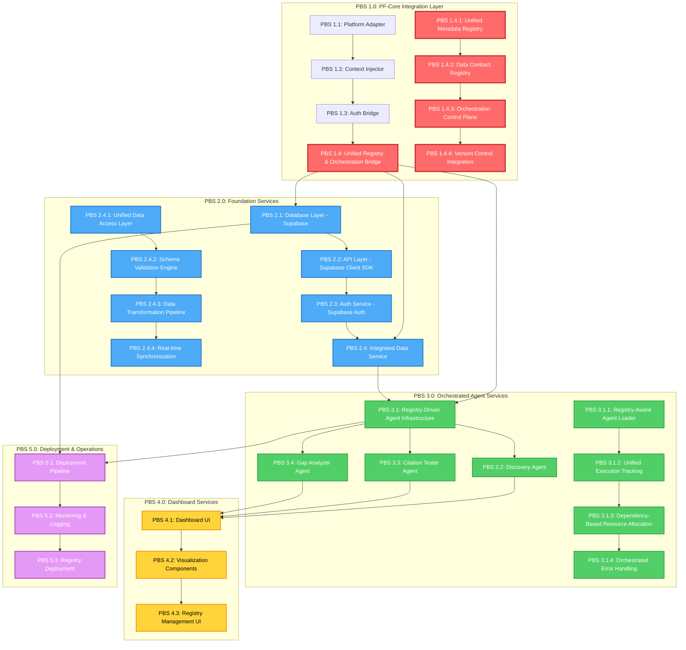

### 1.2 Dependency Type Classification

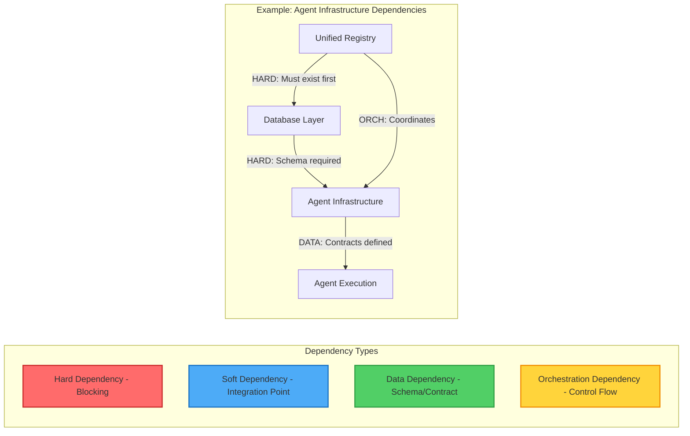

---

## 2. Unified Registry Dependencies

### 2.1 Registry Internal Dependencies

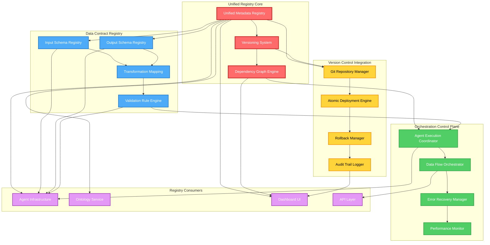

### 2.2 Registry Integration Flow

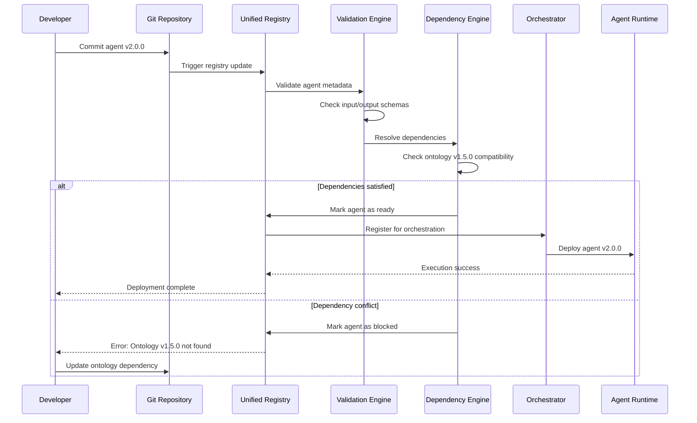

---

## 3. Epic-to-Feature Breakdown

### 3.1 Complete Epic-Feature-Function Hierarchy

```mermaid
graph TB
    subgraph EPIC1["EPIC 1: Unified Registry Foundation"]
        E1F1[Feature 1.1: Metadata Management]
        E1F2[Feature 1.2: Semantic Versioning]
        E1F3[Feature 1.3: Dependency Resolution]
        E1F4[Feature 1.4: Version Control Integration]
        
        E1F1F1[Function: Agent Registration]
        E1F1F2[Function: Ontology Registration]
        E1F1F3[Function: Contract Registration]
        
        E1F2F1[Function: Version Increment]
        E1F2F2[Function: Compatibility Check]
        
        E1F3F1[Function: Dependency Graph Build]
        E1F3F2[Function: Impact Analysis]
        
        E1F4F1[Function: Git Sync]
        E1F4F2[Function: Atomic Deployment]
    end
    
    subgraph EPIC2["EPIC 2: Data Contract Management"]
        E2F1[Feature 2.1: Schema Registry]
        E2F2[Feature 2.2: Data Validation]
        E2F3[Feature 2.3: Transformation Pipeline]
        
        E2F1F1[Function: Input Schema Definition]
        E2F1F2[Function: Output Schema Definition]
        
        E2F2F1[Function: Runtime Validation]
        E2F2F2[Function: Schema Evolution]
        
        E2F3F1[Function: Data Mapping]
        E2F3F2[Function: Format Conversion]
    end
    
    subgraph EPIC3["EPIC 3: Orchestrated Agent Services"]
        E3F1[Feature 3.1: Registry-Aware Loading]
        E3F2[Feature 3.2: Dependency-Based Execution]
        E3F3[Feature 3.3: Error Recovery]
        
        E3F1F1[Function: Agent Discovery]
        E3F1F2[Function: Dynamic Loading]
        
        E3F2F1[Function: Execution Coordination]
        E3F2F2[Function: Resource Allocation]
        
        E3F3F1[Function: Automatic Retry]
        E3F3F2[Function: Rollback]
    end
    
    subgraph EPIC4["EPIC 4: Dashboard & Visualization"]
        E4F1[Feature 4.1: Registry Explorer]
        E4F2[Feature 4.2: Dependency Visualizer]
        E4F3[Feature 4.3: Execution Monitor]
        
        E4F1F1[Function: Browse Registry]
        E4F1F2[Function: Search & Filter]
        
        E4F2F1[Function: Dependency Graph View]
        E4F2F2[Function: Impact Preview]
        
        E4F3F1[Function: Real-time Status]
        E4F3F2[Function: Performance Metrics]
    end
    
    %% Epic 1 Dependencies
    E1F1 --> E1F1F1
    E1F1 --> E1F1F2
    E1F1 --> E1F1F3
    
    E1F2 --> E1F2F1
    E1F2 --> E1F2F2
    
    E1F3 --> E1F3F1
    E1F3 --> E1F3F2
    
    E1F4 --> E1F4F1
    E1F4 --> E1F4F2
    
    E1F1 --> E1F2
    E1F2 --> E1F3
    E1F3 --> E1F4
    
    %% Epic 2 Dependencies
    E2F1 --> E2F1F1
    E2F1 --> E2F1F2
    
    E2F2 --> E2F2F1
    E2F2 --> E2F2F2
    
    E2F3 --> E2F3F1
    E2F3 --> E2F3F2
    
    E2F1 --> E2F2
    E2F2 --> E2F3
    
    %% Epic 3 Dependencies
    E3F1 --> E3F1F1
    E3F1 --> E3F1F2
    
    E3F2 --> E3F2F1
    E3F2 --> E3F2F2
    
    E3F3 --> E3F3F1
    E3F3 --> E3F3F2
    
    E3F1 --> E3F2
    E3F2 --> E3F3
    
    %% Epic 4 Dependencies
    E4F1 --> E4F1F1
    E4F1 --> E4F1F2
    
    E4F2 --> E4F2F1
    E4F2 --> E4F2F2
    
    E4F3 --> E4F3F1
    E4F3 --> E4F3F2
    
    E4F1 --> E4F2
    E4F2 --> E4F3
    
    %% Cross-Epic Dependencies
    E1F1 --> E2F1
    E1F3 --> E2F2
    E2F3 --> E3F1
    E1F1 --> E3F1
    E3F2 --> E4F3
    E1F3 --> E4F2
    
    %% Styling
    classDef epic fill:#ff6b6b,stroke:#c92a2a,stroke-width:3px,color:#fff
    classDef feature fill:#4dabf7,stroke:#1971c2,stroke-width:2px,color:#fff
    classDef function fill:#51cf66,stroke:#2f9e44,stroke-width:2px,color:#fff
    
    class E1F1,E1F2,E1F3,E1F4,E2F1,E2F2,E2F3,E3F1,E3F2,E3F3,E4F1,E4F2,E4F3 feature
    class E1F1F1,E1F1F2,E1F1F3,E1F2F1,E1F2F2,E1F3F1,E1F3F2,E1F4F1,E1F4F2 function
    class E2F1F1,E2F1F2,E2F2F1,E2F2F2,E2F3F1,E2F3F2 function
    class E3F1F1,E3F1F2,E3F2F1,E3F2F2,E3F3F1,E3F3F2 function
    class E4F1F1,E4F1F2,E4F2F1,E4F2F2,E4F3F1,E4F3F2 function
```

---

## 4. Feature-to-User Story Mapping

### 4.1 User Stories by Epic

```mermaid
graph TB
    subgraph US_EPIC1["User Stories - EPIC 1: Registry Foundation"]
        US1_1["US1.1: As a developer, I want to register a new agent with the unified registry so that it can be discovered and orchestrated"]
        US1_2["US1.2: As a system admin, I want to see dependency conflicts before deployment so that I can resolve them proactively"]
        US1_3["US1.3: As a developer, I want automatic version incrementing so that I don't have to manually manage versions"]
        US1_4["US1.4: As a DevOps engineer, I want atomic deployments so that partial updates never break the system"]
    end
    
    subgraph US_EPIC2["User Stories - EPIC 2: Data Contracts"]
        US2_1["US2.1: As a data engineer, I want to define input/output schemas so that data validation is automatic"]
        US2_2["US2.2: As a developer, I want schema evolution support so that I can safely update data contracts"]
        US2_3["US2.3: As an agent, I want automatic data transformation so that I don't need custom conversion code"]
        US2_4["US2.4: As a system, I want runtime validation so that invalid data never enters the pipeline"]
    end
    
    subgraph US_EPIC3["User Stories - EPIC 3: Agent Orchestration"]
        US3_1["US3.1: As an orchestrator, I want to dynamically load agents based on registry metadata so that deployment is seamless"]
        US3_2["US3.2: As a system, I want dependency-based execution so that agents run in the correct order"]
        US3_3["US3.3: As a developer, I want automatic retry on failure so that transient errors don't require manual intervention"]
        US3_4["US3.4: As a system admin, I want execution tracking so that I can monitor agent performance"]
    end
    
    subgraph US_EPIC4["User Stories - EPIC 4: Dashboard"]
        US4_1["US4.1: As a product owner, I want to browse the registry so that I can see all agents and ontologies"]
        US4_2["US4.2: As a developer, I want to visualize dependencies so that I understand impact before making changes"]
        US4_3["US4.3: As a system admin, I want real-time execution monitoring so that I can detect issues immediately"]
        US4_4["US4.4: As a stakeholder, I want performance metrics so that I can track system health"]
    end
    
    %% Map to Features
    US1_1 --> E1F1[Feature 1.1: Metadata Management]
    US1_2 --> E1F3[Feature 1.3: Dependency Resolution]
    US1_3 --> E1F2[Feature 1.2: Semantic Versioning]
    US1_4 --> E1F4[Feature 1.4: Version Control Integration]
    
    US2_1 --> E2F1[Feature 2.1: Schema Registry]
    US2_2 --> E2F2[Feature 2.2: Data Validation]
    US2_3 --> E2F3[Feature 2.3: Transformation Pipeline]
    US2_4 --> E2F2
    
    US3_1 --> E3F1[Feature 3.1: Registry-Aware Loading]
    US3_2 --> E3F2[Feature 3.2: Dependency-Based Execution]
    US3_3 --> E3F3[Feature 3.3: Error Recovery]
    US3_4 --> E3F2
    
    US4_1 --> E4F1[Feature 4.1: Registry Explorer]
    US4_2 --> E4F2[Feature 4.2: Dependency Visualizer]
    US4_3 --> E4F3[Feature 4.3: Execution Monitor]
    US4_4 --> E4F3
    
    %% Styling
    classDef story fill:#ffd43b,stroke:#f08c00,stroke-width:2px,color:#000
    classDef feature fill:#4dabf7,stroke:#1971c2,stroke-width:2px,color:#fff
    
    class US1_1,US1_2,US1_3,US1_4,US2_1,US2_2,US2_3,US2_4,US3_1,US3_2,US3_3,US3_4,US4_1,US4_2,US4_3,US4_4 story
    class E1F1,E1F2,E1F3,E1F4,E2F1,E2F2,E2F3,E3F1,E3F2,E3F3,E4F1,E4F2,E4F3 feature
```

### 4.2 Acceptance Criteria Mapping

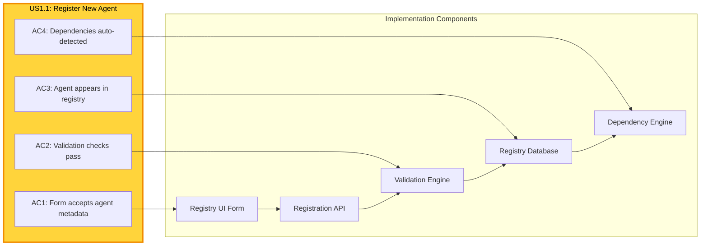

---

## 5. Data Flow Dependencies

### 5.1 Agent Execution Data Flow

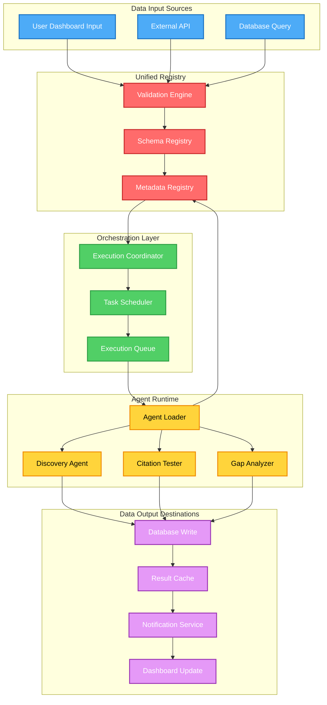

### 5.2 Ontology Data Flow

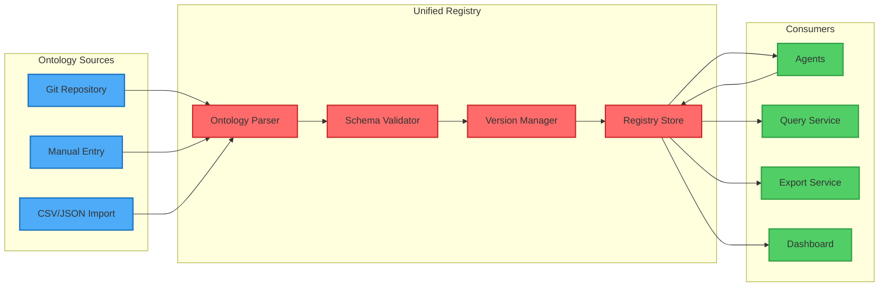

---

## 6. Critical Path Analysis

### 6.1 Week-by-Week Critical Path

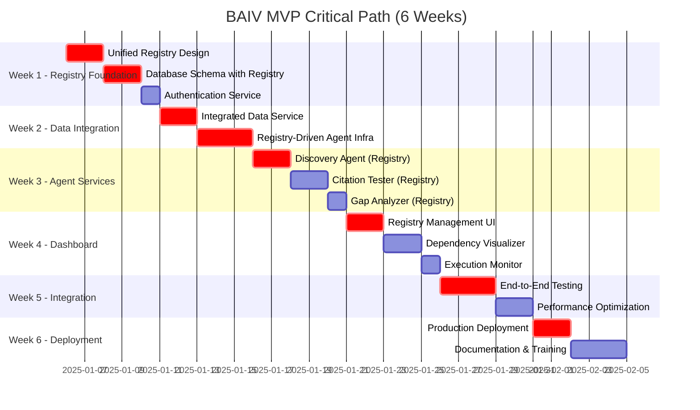

### 6.2 Critical Dependency Chain

---

## 7. Agent Orchestration Dependencies

### 7.1 Three-Agent MVP Orchestration

```mermaid
graph TB
    subgraph UserTrigger["User Interaction"]
        USER[User submits query]
        DASH[Dashboard Interface]
    end
    
    subgraph Registry["Unified Registry"]
        REG_CHECK[Check agent availability]
        REG_DEP[Resolve dependencies]
        REG_SCHEMA[Validate schemas]
    end
    
    subgraph Orchestrator["Orchestration Control"]
        COORD[Execution Coordinator]
        SCHEDULE[Task Scheduler]
        MONITOR[Performance Monitor]
    end
    
    subgraph DiscoveryAgent["Discovery Agent"]
        DISC_LOAD[Load from registry]
        DISC_VAL[Validate input]
        DISC_EXEC[Execute discovery]
        DISC_OUT[Write results]
    end
    
    subgraph CitationTester["Citation Tester Agent"]
        CITE_LOAD[Load from registry]
        CITE_DEPS[Check Discovery results]
        CITE_EXEC[Test citations]
        CITE_OUT[Write results]
    end
    
    subgraph GapAnalyzer["Gap Analyzer Agent"]
        GAP_LOAD[Load from registry]
        GAP_DEPS[Check Citation results]
        GAP_EXEC[Analyze gaps]
        GAP_OUT[Generate report]
    end
    
    subgraph Results["Result Aggregation"]
        AGG[Aggregate results]
        CACHE[Cache outcomes]
        NOTIFY[Notify user]
    end
    
    %% User Flow
    USER --> DASH
    DASH --> REG_CHECK
    
    %% Registry Flow
    REG_CHECK --> REG_DEP
    REG_DEP --> REG_SCHEMA
    REG_SCHEMA --> COORD
    
    %% Orchestration Flow
    COORD --> SCHEDULE
    SCHEDULE --> MONITOR
    
    %% Agent 1: Discovery
    MONITOR --> DISC_LOAD
    DISC_LOAD --> DISC_VAL
    DISC_VAL --> DISC_EXEC
    DISC_EXEC --> DISC_OUT
    
    %% Agent 2: Citation Tester (depends on Discovery)
    DISC_OUT --> CITE_LOAD
    CITE_LOAD --> CITE_DEPS
    CITE_DEPS --> CITE_EXEC
    CITE_EXEC --> CITE_OUT
    
    %% Agent 3: Gap Analyzer (depends on Citation)
    CITE_OUT --> GAP_LOAD
    GAP_LOAD --> GAP_DEPS
    GAP_DEPS --> GAP_EXEC
    GAP_EXEC --> GAP_OUT
    
    %% Results Flow
    GAP_OUT --> AGG
    AGG --> CACHE
    CACHE --> NOTIFY
    NOTIFY --> DASH
    
    %% Styling
    classDef user fill:#4dabf7,stroke:#1971c2,stroke-width:2px,color:#fff
    classDef registry fill:#ff6b6b,stroke:#c92a2a,stroke-width:3px,color:#fff
    classDef orch fill:#51cf66,stroke:#2f9e44,stroke-width:2px,color:#fff
    classDef agent1 fill:#ffd43b,stroke:#f08c00,stroke-width:2px,color:#000
    classDef agent2 fill:#ffd43b,stroke:#f08c00,stroke-width:2px,color:#000
    classDef agent3 fill:#ffd43b,stroke:#f08c00,stroke-width:2px,color:#000
    classDef result fill:#e599f7,stroke:#9c36b5,stroke-width:2px,color:#fff
    
    class USER,DASH user
    class REG_CHECK,REG_DEP,REG_SCHEMA registry
    class COORD,SCHEDULE,MONITOR orch
    class DISC_LOAD,DISC_VAL,DISC_EXEC,DISC_OUT agent1
    class CITE_LOAD,CITE_DEPS,CITE_EXEC,CITE_OUT agent2
    class GAP_LOAD,GAP_DEPS,GAP_EXEC,GAP_OUT agent3
    class AGG,CACHE,NOTIFY result
```

### 7.2 Agent Dependency Matrix

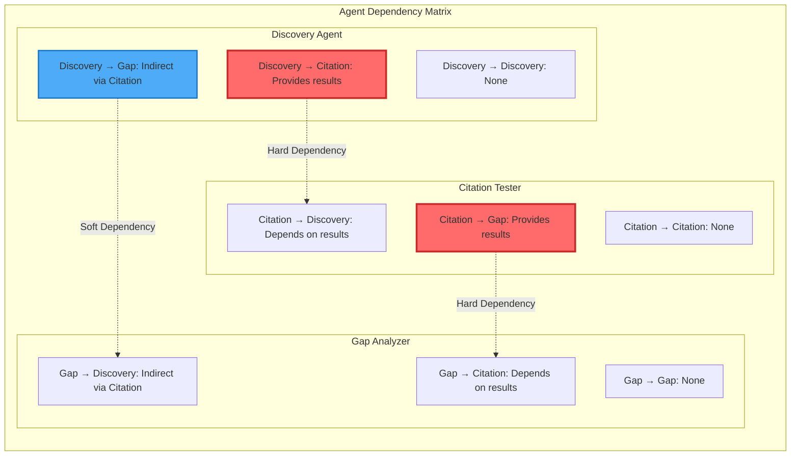

---

## 8. Summary & Key Insights

### Key Dependency Insights
1. **Critical Path**: Unified Registry → Database → Agent Infrastructure → Agent Implementation
2. **Blocking Dependencies**: 
   - All agent services blocked by registry foundation (Week 1)
   - Dashboard blocked by agent implementation (Week 3)
   - Deployment blocked by integration testing (Week 5)

3. **Data Dependencies**:
   - Discovery Agent provides data to Citation Tester
   - Citation Tester provides data to Gap Analyzer
   - All agents depend on Unified Registry for metadata

4. **Orchestration Dependencies**:
   - Metadata Registry → Data Contract Registry → Orchestration Control
   - Version Control Integration runs parallel to orchestration
   - All consumers depend on registry stability

### Risk Areas
- **Week 1**: Registry design quality impacts entire project
- **Week 2**: Agent infrastructure must handle registry-driven loading
- **Week 3**: Agent sequencing must respect data dependencies

### Optimization Opportunities
- Parallel work possible: Dashboard UI + Agent Implementation (Week 3-4)
- Version Control Integration can start after registry design (Week 1)
- Performance optimization can overlap with integration testing (Week 5)

---

**Document Version:** 1.0.0  
**Total Diagrams:** 14  
**Last Updated:** 2025-01-01
