# BAIV Dashboard & Scorecard Templates v1.0.0

**Strategic Dashboard and Balanced Scorecard Framework**

| Attribute | Value |
|-----------|-------|
| **Document Version** | 1.0.0 |
| **Date** | December 31, 2025 |
| **Purpose** | BSC framework and strategic dashboard templates for BAIV |
| **Status** | 🟢 Active |
| **Owner** | BAIV Product Team |
| **Parent Documents** | BAIV_INTEGRATION_PLAN.md, PFC-PFI-BAIV_MODULE_CATALOG.md |
| **Related Artifacts** | PFC-PFI-BAIV_INTEGRATION_BRIDGES.md (Design Bridge) |

---

## Executive Summary

BAIV implements a **Strategic Dashboard** built on a **5-Perspective Balanced Scorecard (BSC)** framework. The dashboard provides real-time visibility into AI visibility performance, content operations, and business outcomes.

**Dashboard Structure:**
1. **Executive Overview** - Top-level KPIs and alerts
2. **5-Perspective BSC Cards** - Financial, Customer, Process, Learning, Stakeholder
3. **OKR Progress Tracking** - Objectives and key results
4. **At-Risk Alerts** - Issues requiring attention

**Widget Library:**
- **20+ reusable widgets** organized by category
- Citation, Gap, Content, Performance, Business widgets
- Real-time data from BAIV ontologies
- Responsive design with BAIV design tokens

---

## Table of Contents

1. [BAIV Strategic Dashboard](#baiv-strategic-dashboard)
2. [Balanced Scorecard Framework](#balanced-scorecard-framework)
3. [Widget Library](#widget-library)
4. [Data Source Mappings](#data-source-mappings)
5. [Layout Specifications](#layout-specifications)
6. [Implementation Guidance](#implementation-guidance)

---

## BAIV Strategic Dashboard

### Dashboard Layout Structure

```mermaid
graph TB
    subgraph DASHBOARD["BAIV Strategic Dashboard"]
        subgraph HEADER["Header Section"]
            LOGO["BAIV Logo"]
            NAV["Navigation"]
            USER["User Profile"]
        end
        
        subgraph EXECUTIVE["Executive Overview"]
            KPI1["AI Visibility Score<br/>0-100"]
            KPI2["Citation Rate<br/>%"]
            KPI3["Content Velocity<br/>pieces/week"]
            KPI4["Gap Closure Rate<br/>%"]
            KPI5["Client Health<br/>NPS"]
        end
        
        subgraph BSC["5-Perspective BSC Cards"]
            FINANCIAL["Financial<br/>MRR • LTV • Revenue"]
            CUSTOMER["Customer<br/>NPS • Retention • Satisfaction"]
            PROCESS["Process<br/>Audit Velocity • Content Throughput"]
            LEARNING["Learning<br/>Agent Accuracy • Model Improvements"]
            STAKEHOLDER["Stakeholder<br/>Partner Revenue • Affiliates"]
        end
        
        subgraph OKR["OKR Progress Tracking"]
            OBJ1["Objective 1<br/>Key Results 1-3"]
            OBJ2["Objective 2<br/>Key Results 1-3"]
            OBJ3["Objective 3<br/>Key Results 1-3"]
        end
        
        subgraph ALERTS["At-Risk Alerts"]
            ALERT1["Citation Drop Alert"]
            ALERT2["Content Backlog Alert"]
            ALERT3["Client Health Alert"]
        end
    end
    
    HEADER --> EXECUTIVE
    EXECUTIVE --> BSC
    BSC --> OKR
    OKR --> ALERTS
    
    style HEADER fill:#00A4BF,color:#fff
    style EXECUTIVE fill:#019587,color:#fff
    style BSC fill:#E84E1C,color:#fff
    style OKR fill:#CEC528,color:#000
    style ALERTS fill:#CF057D,color:#fff
```



### Dashboard Wireframe

```
┌─────────────────────────────────────────────────────────────────┐
│ BAIV Logo    Dashboard    Reports    Settings         [User]    │
├─────────────────────────────────────────────────────────────────┤
│                                                                   │
│  EXECUTIVE OVERVIEW                                               │
│  ┌──────────┬──────────┬──────────┬──────────┬──────────┐       │
│  │ AI Vis.  │ Citation │ Content  │ Gap      │ Client   │       │
│  │ Score    │ Rate     │ Velocity │ Closure  │ Health   │       │
│  │   78     │   64%    │ 12/week  │   82%    │ NPS 42   │       │
│  │  ▲ +5    │  ▼ -2%   │  ▲ +3    │  ▲ +7%   │  ▲ +3    │       │
│  └──────────┴──────────┴──────────┴──────────┴──────────┘       │
│                                                                   │
│  BALANCED SCORECARD                                               │
│  ┌──────────────────────┬────────────────────────────────────┐   │
│  │ Financial            │ Customer                           │   │
│  │ MRR: $45K            │ NPS: 42                            │   │
│  │ LTV: $18K            │ Retention: 94%                     │   │
│  │ Revenue/Client: $750 │ Citation Satisfaction: 87%         │   │
│  ├──────────────────────┼────────────────────────────────────┤   │
│  │ Process              │ Learning                           │   │
│  │ Audit Velocity: 8/wk │ Agent Accuracy: 96%                │   │
│  │ Content Throughput:  │ Model Improvements: 3 this quarter │   │
│  │   12 pieces/week     │ Error Rate: 2.1%                   │   │
│  ├──────────────────────┴────────────────────────────────────┤   │
│  │ Stakeholder                                                │   │
│  │ Partner Revenue: $12K/mo                                   │   │
│  │ Affiliate Conversions: 8 this month                        │   │
│  │ Agency Partner Count: 4                                    │   │
│  └────────────────────────────────────────────────────────────┘   │
│                                                                   │
│  OKR PROGRESS                                                     │
│  ┌─────────────────────────────────────────────────────────────┐ │
│  │ Objective 1: Increase AI Visibility Score to 85        [78] │ │
│  │ ▓▓▓▓▓▓▓▓▓▓▓▓▓▓▓▓▓▓░░░░░░░░  78%                              │ │
│  │   KR1: Citation Rate > 75%  ▓▓▓▓▓▓▓▓▓▓▓▓▓░░░  64% ❌        │ │
│  │   KR2: Platform Consistency ▓▓▓▓▓▓▓▓▓▓▓▓▓▓▓▓▓  87% ✅        │ │
│  │   KR3: Journey Coverage     ▓▓▓▓▓▓▓▓▓▓▓▓▓▓░░░  71% ⚠️        │ │
│  └─────────────────────────────────────────────────────────────┘ │
│                                                                   │
│  AT-RISK ALERTS                                                   │
│  ⚠️  Citation Rate dropped 5% week-over-week                      │
│  ⚠️  Content backlog: 8 pieces pending publication                │
│  ✅  All clients healthy (NPS > 40)                               │
│                                                                   │
└─────────────────────────────────────────────────────────────────┘
```

---

## Balanced Scorecard Framework

### 1. Financial Perspective

**Purpose:** Track revenue health and unit economics

**KPIs:**
- **MRR (Monthly Recurring Revenue)** - Total monthly recurring revenue
- **LTV (Lifetime Value)** - Average customer lifetime value
- **Revenue per Customer** - Average monthly revenue per client
- **LTV:CAC Ratio** - Lifetime value to customer acquisition cost (target: 3:1)
- **Gross Margin** - Revenue minus COGS (target: 80%+)
- **Payback Period** - Months to recover CAC (target: <12 months)

**Data Sources:**
- `BAIV-ONT-Financial-Metrics` ontology
- Billing system (Stripe/Chargebee)
- CRM (Airtable)

**Widget Specifications:**

**MRR Trend Widget**
```typescript
interface MRRTrendWidget {
  type: "line_chart";
  title: "MRR Trend";
  data_source: "financial_metrics.mrr_history";
  time_range: "last_12_months";
  display: {
    current_value: number;
    previous_period: number;
    change_pct: number;
    change_indicator: "up" | "down" | "flat";
  };
  thresholds: {
    target: number;
    warning: number;
  };
}
```

**Example:**
```
┌──────────────────────────────┐
│ MRR Trend                    │
│                              │
│ $45,000  ▲ +12% vs last month│
│                              │
│    ╱───╲                     │
│   ╱     ╲     ╱───           │
│  ╱       ╲   ╱               │
│ ╱         ╲ ╱                │
│ Jan  Apr  Jul  Oct           │
│                              │
│ Target: $50K/mo              │
└──────────────────────────────┘
```

**LTV:CAC Ratio Widget**
```typescript
interface LTVCACWidget {
  type: "ratio_gauge";
  title: "LTV:CAC Ratio";
  data_source: "financial_metrics.ltv_cac_ratio";
  display: {
    current_ratio: number;
    ltv: number;
    cac: number;
    health_status: "healthy" | "warning" | "critical";
  };
  thresholds: {
    healthy: 3.0;  // 3:1 or better
    warning: 2.0;  // Below 2:1
  };
}
```

---

### 2. Customer Perspective

**Purpose:** Measure client satisfaction and retention

**KPIs:**
- **NPS (Net Promoter Score)** - Customer satisfaction metric (target: >40)
- **Retention Rate** - % of customers retained month-over-month (target: >90%)
- **Citation Satisfaction** - % of clients satisfied with citation results (target: >85%)
- **Churn Rate** - % of customers lost per month (target: <5%)
- **Time to Value** - Days from signup to first audit (target: <7 days)
- **Support Response Time** - Average time to first response (target: <2 hours)

**Data Sources:**
- `BAIV-ONT-Customer-Organization` ontology
- `BAIV-ONT-PMF-Signals` ontology
- Support ticketing system
- NPS survey results

**Widget Specifications:**

**NPS Score Widget**
```typescript
interface NPSWidget {
  type: "gauge";
  title: "Net Promoter Score";
  data_source: "pmf_signals.nps_score";
  display: {
    current_score: number;
    promoters_pct: number;
    passives_pct: number;
    detractors_pct: number;
    trend: "up" | "down" | "stable";
  };
  thresholds: {
    excellent: 50;
    good: 30;
    acceptable: 0;
  };
}
```

**Example:**
```
┌──────────────────────────────┐
│ Net Promoter Score           │
│                              │
│       42  ▲ +3 pts           │
│                              │
│   ╱────────╲                 │
│  │    42    │                │
│   ╲────────╱                 │
│                              │
│ Promoters:  58%              │
│ Passives:   26%              │
│ Detractors: 16%              │
│                              │
│ Status: Good (>40)           │
└──────────────────────────────┘
```

**Retention Cohort Widget**
```typescript
interface RetentionCohortWidget {
  type: "heatmap";
  title: "Retention Cohorts";
  data_source: "customer_metrics.retention_cohorts";
  display: {
    cohorts: CohortData[];
    overall_retention: number;
    best_cohort: string;
    worst_cohort: string;
  };
}
```

---

### 3. Process Perspective

**Purpose:** Track operational efficiency and content production

**KPIs:**
- **Audit Velocity** - Audits completed per week
- **Content Throughput** - Content pieces produced per week
- **Avg Audit Duration** - Average time to complete citation audit (target: <4 hours)
- **Content Quality Score** - Average quality score of generated content (target: >85/100)
- **Publishing Rate** - % of content published vs generated (target: >80%)
- **Gap Closure Rate** - % of gaps closed within 30 days (target: >75%)

**Data Sources:**
- `BAIV-ONT-Citation-Test-Result` ontology
- `BAIV-ONT-Blog-Post` ontology
- `BAIV-ONT-Gap-Analysis` ontology
- `BAIV-ONT-Publishing-Log` ontology

**Widget Specifications:**

**Audit Velocity Widget**
```typescript
interface AuditVelocityWidget {
  type: "bar_chart";
  title: "Audit Velocity";
  data_source: "audit_metrics.velocity_weekly";
  time_range: "last_8_weeks";
  display: {
    current_week: number;
    average: number;
    trend: "up" | "down" | "stable";
  };
  thresholds: {
    target: 10;
    minimum: 5;
  };
}
```

**Example:**
```
┌──────────────────────────────┐
│ Audit Velocity (per week)   │
│                              │
│ This week: 8  ▼ -2 vs avg   │
│                              │
│ 12│    ███                   │
│ 10│  █████ ███               │
│  8│ ████████████             │
│  6│████████████████          │
│  4│████████████████          │
│   └─────────────────         │
│    W1 W2 W3 W4 W5 W6 W7 W8   │
│                              │
│ Average: 10 audits/week      │
└──────────────────────────────┘
```

**Content Pipeline Widget**
```typescript
interface ContentPipelineWidget {
  type: "funnel";
  title: "Content Pipeline";
  data_source: "content_metrics.pipeline_status";
  display: {
    backlog: number;
    in_progress: number;
    review: number;
    published: number;
    conversion_rates: PipelineConversion[];
  };
}
```

**Example:**
```
┌──────────────────────────────┐
│ Content Pipeline             │
│                              │
│ Backlog:     24 ████████████ │
│ In Progress: 12 ██████       │
│ Review:       8 ████         │
│ Published:    6 ███          │
│                              │
│ Conversion: Backlog → Pub    │
│   25% completion rate        │
└──────────────────────────────┘
```

---

### 4. Learning & Growth Perspective

**Purpose:** Measure agent performance and AI system improvements

**KPIs:**
- **Agent Accuracy** - % of agent outputs requiring no human correction (target: >95%)
- **Model Improvements** - Number of model/prompt improvements per quarter
- **Error Rate** - % of agent executions resulting in errors (target: <3%)
- **Average Confidence Score** - Agent self-reported confidence (target: >0.85)
- **Agent Execution Time** - Average time per agent execution
- **Cost per Agent Execution** - Average API cost per execution

**Data Sources:**
- `agent_registry` table (OAA)
- `audit_log` table
- Agent execution metrics
- Cost tracking

**Widget Specifications:**

**Agent Accuracy Widget**
```typescript
interface AgentAccuracyWidget {
  type: "multi_bar";
  title: "Agent Accuracy by Type";
  data_source: "agent_metrics.accuracy_by_type";
  display: {
    agents: {
      agent_id: string;
      agent_name: string;
      accuracy_pct: number;
      executions_count: number;
    }[];
    overall_accuracy: number;
  };
  thresholds: {
    excellent: 0.95;
    good: 0.90;
    acceptable: 0.85;
  };
}
```

**Example:**
```
┌──────────────────────────────┐
│ Agent Accuracy               │
│                              │
│ Overall: 96% ✅              │
│                              │
│ Discovery       ████████ 98% │
│ Citation Test   ███████  96% │
│ Gap Analyzer    ███████  95% │
│ Blog Creator    ██████   94% │
│ Social Creator  ██████   93% │
│                              │
│ Target: >95%                 │
└──────────────────────────────┘
```

**Model Improvements Timeline Widget**
```typescript
interface ModelImprovementsWidget {
  type: "timeline";
  title: "Model Improvements";
  data_source: "agent_metrics.improvements_log";
  time_range: "current_quarter";
  display: {
    improvements: {
      date: string;
      agent: string;
      improvement_type: "prompt" | "model" | "validation";
      description: string;
      impact_score: number;
    }[];
    total_count: number;
    avg_impact: number;
  };
}
```

---

### 5. Stakeholder Perspective

**Purpose:** Measure partner and ecosystem value

**KPIs:**
- **Partner Revenue** - Monthly revenue from agency partners
- **Affiliate Conversions** - Number of affiliate sign-ups per month
- **Agency Partner Count** - Number of active agency partners
- **Partner Satisfaction** - NPS from partners (target: >50)
- **Co-Marketing Activities** - Joint marketing initiatives per quarter
- **API Integration Usage** - Number of API calls from partners

**Data Sources:**
- `BAIV-ONT-Partner` ontology (to be created)
- Affiliate tracking system
- Partner portal metrics
- API usage logs

**Widget Specifications:**

**Partner Revenue Widget**
```typescript
interface PartnerRevenueWidget {
  type: "stacked_bar";
  title: "Partner Revenue";
  data_source: "partner_metrics.revenue_by_partner";
  time_range: "last_6_months";
  display: {
    total_revenue: number;
    partners: {
      partner_name: string;
      revenue: number;
      growth_pct: number;
    }[];
  };
}
```

**Example:**
```
┌──────────────────────────────┐
│ Partner Revenue              │
│                              │
│ Total: $12K/mo  ▲ +18%       │
│                              │
│ Agency A    $5K ████████████ │
│ Agency B    $4K █████████    │
│ Agency C    $2K █████        │
│ Agency D    $1K ██           │
│                              │
│ 4 active partners            │
└──────────────────────────────┘
```

---

## Widget Library

### Citation Widgets

#### 1. Citation Rate Trend
**Purpose:** Track citation rate over time across all platforms

```typescript
interface CitationRateTrendWidget {
  widget_id: "citation-rate-trend";
  category: "citation";
  data_source: "BAIV-ONT-Citation-Test-Result";
  update_frequency: "daily";
  size: "medium" | "large";
  
  query: {
    metric: "citation_rate";
    aggregation: "weekly_average";
    time_range: "last_90_days";
    group_by: "week";
  };
  
  visualization: {
    type: "line_chart";
    x_axis: "week";
    y_axis: "citation_rate_pct";
    show_target_line: true;
    target_value: 75;
  };
  
  display: {
    title: "Citation Rate Trend";
    current_value: number;
    previous_period: number;
    change_pct: number;
    change_indicator: "up" | "down" | "flat";
    status: "on_track" | "at_risk" | "behind";
  };
}
```

#### 2. Platform Comparison
**Purpose:** Compare citation performance across AI platforms

```typescript
interface PlatformComparisonWidget {
  widget_id: "platform-comparison";
  category: "citation";
  data_source: "BAIV-ONT-Citation-Test-Result";
  update_frequency: "daily";
  size: "large";
  
  query: {
    platforms: ["ChatGPT", "Claude", "Gemini", "Perplexity", "Google AI Mode"];
    metrics: ["citation_rate", "avg_rpi_score", "position_avg"];
    time_range: "last_30_days";
  };
  
  visualization: {
    type: "grouped_bar_chart";
    x_axis: "platform";
    y_axes: ["citation_rate", "rpi_score"];
  };
}
```

#### 3. RPI Score Distribution
**Purpose:** Show distribution of RPI scores across queries

```typescript
interface RPIDistributionWidget {
  widget_id: "rpi-distribution";
  category: "citation";
  data_source: "BAIV-ONT-RPI-Score";
  update_frequency: "daily";
  size: "medium";
  
  visualization: {
    type: "histogram";
    bins: [0, 20, 40, 60, 80, 100];
    color_coding: {
      "0-40": "red";      // Poor
      "40-60": "yellow";  // Fair
      "60-80": "green";   // Good
      "80-100": "blue";   // Excellent
    };
  };
}
```

### Gap Widgets

#### 4. Gap Count by Priority
**Purpose:** Track open gaps by priority level

```typescript
interface GapCountWidget {
  widget_id: "gap-count-priority";
  category: "gap";
  data_source: "BAIV-ONT-Gap-Analysis";
  update_frequency: "daily";
  size: "small";
  
  query: {
    status: "open";
    group_by: "priority";
  };
  
  visualization: {
    type: "donut_chart";
    segments: ["P0", "P1", "P2", "P3"];
    colors: {
      P0: "#DC2626";  // Red - Critical
      P1: "#F59E0B";  // Orange - High
      P2: "#CEC528";  // Yellow - Medium
      P3: "#10B981";  // Green - Low
    };
  };
  
  display: {
    total_count: number;
    critical_count: number;
    alert_threshold: 10;  // Alert if P0 > 10
  };
}
```

#### 5. Gap Closure Rate
**Purpose:** Track % of gaps closed within SLA

```typescript
interface GapClosureRateWidget {
  widget_id: "gap-closure-rate";
  category: "gap";
  data_source: "BAIV-ONT-Gap-Analysis";
  update_frequency: "weekly";
  size: "medium";
  
  query: {
    time_range: "last_90_days";
    metrics: ["gaps_created", "gaps_closed", "closure_rate"];
  };
  
  visualization: {
    type: "stacked_area_chart";
    series: ["created", "closed", "open"];
  };
  
  display: {
    closure_rate_pct: number;
    avg_time_to_close_days: number;
    target_rate: 75;
  };
}
```

#### 6. Topic Coverage Heatmap
**Purpose:** Visualize content coverage across topics

```typescript
interface TopicCoverageHeatmap {
  widget_id: "topic-coverage-heatmap";
  category: "gap";
  data_source: "BAIV-ONT-RRF-Score";
  update_frequency: "weekly";
  size: "large";
  
  query: {
    topics: "all_active_topics";
    metrics: ["article_count", "rrf_score", "citation_rate"];
  };
  
  visualization: {
    type: "heatmap";
    dimensions: {
      rows: "topic_category";
      columns: "sub_topic";
      color_intensity: "rrf_score";
    };
    color_scale: {
      min: 0;
      max: 100;
      low_color: "#DC2626";
      high_color: "#10B981";
    };
  };
}
```

### Content Widgets

#### 7. Content Velocity
**Purpose:** Track content production rate

```typescript
interface ContentVelocityWidget {
  widget_id: "content-velocity";
  category: "content";
  data_source: "BAIV-ONT-Blog-Post";
  update_frequency: "daily";
  size: "small";
  
  query: {
    time_range: "last_8_weeks";
    status: "published";
    group_by: "week";
  };
  
  visualization: {
    type: "sparkline";
    trend_line: true;
  };
  
  display: {
    current_week_count: number;
    avg_per_week: number;
    target_per_week: number;
    status: "on_track" | "at_risk" | "behind";
  };
}
```

#### 8. Publishing Rate
**Purpose:** Track % of content published vs generated

```typescript
interface PublishingRateWidget {
  widget_id: "publishing-rate";
  category: "content";
  data_source: ["BAIV-ONT-Blog-Post", "BAIV-ONT-Publishing-Log"];
  update_frequency: "daily";
  size: "medium";
  
  query: {
    time_range: "last_30_days";
    metrics: ["generated_count", "published_count", "publishing_rate"];
  };
  
  visualization: {
    type: "funnel";
    stages: ["generated", "approved", "scheduled", "published"];
  };
  
  display: {
    publishing_rate_pct: number;
    bottleneck_stage: string;
    target_rate: 80;
  };
}
```

#### 9. Content Performance
**Purpose:** Track performance of published content

```typescript
interface ContentPerformanceWidget {
  widget_id: "content-performance";
  category: "content";
  data_source: ["BAIV-ONT-Blog-Post", "BAIV-ONT-Citation-Test-Result"];
  update_frequency: "daily";
  size: "large";
  
  query: {
    time_range: "last_90_days";
    metrics: ["citation_count", "traffic", "engagement"];
    top_n: 10;
  };
  
  visualization: {
    type: "table";
    columns: [
      "title",
      "publish_date",
      "citations",
      "traffic",
      "engagement_score"
    ];
    sortable: true;
  };
}
```

### Performance Widgets

#### 10. AI Visibility Score Gauge
**Purpose:** Show overall AI Visibility Score (0-100)

```typescript
interface VisibilityScoreGauge {
  widget_id: "visibility-score-gauge";
  category: "performance";
  data_source: "BAIV-ONT-AI-Visibility-Score";
  update_frequency: "daily";
  size: "large";
  
  query: {
    metric: "overall_score";
    components: [
      "citation_rate",      // 40 points
      "rpi_score",          // 25 points
      "platform_consistency", // 15 points
      "journey_coverage",   // 10 points
      "content_authority"   // 10 points
    ];
  };
  
  visualization: {
    type: "radial_gauge";
    min: 0;
    max: 100;
    thresholds: {
      poor: { max: 40, color: "#DC2626" };
      fair: { max: 60, color: "#F59E0B" };
      good: { max: 80, color: "#CEC528" };
      excellent: { max: 100, color: "#10B981" };
    };
  };
  
  display: {
    current_score: number;
    previous_score: number;
    change: number;
    component_breakdown: ComponentScore[];
  };
}
```

### Business Widgets

#### 11. MRR Trend
*(Already specified in Financial Perspective)*

#### 12. Client Health Score
**Purpose:** Aggregate health score per client

```typescript
interface ClientHealthScoreWidget {
  widget_id: "client-health-score";
  category: "business";
  data_source: ["BAIV-ONT-Customer-Organization", "BAIV-ONT-PMF-Signals"];
  update_frequency: "daily";
  size: "large";
  
  query: {
    clients: "all_active";
    health_factors: [
      "nps",
      "usage_frequency",
      "citation_satisfaction",
      "support_tickets",
      "payment_status"
    ];
  };
  
  visualization: {
    type: "table";
    columns: [
      "client_name",
      "health_score",
      "nps",
      "usage_trend",
      "at_risk_indicator"
    ];
    color_coding: {
      health_score: {
        "0-50": "red";
        "50-75": "yellow";
        "75-100": "green";
      };
    };
  };
}
```

---

## Data Source Mappings

### Citation Data

| Widget | Ontology | Table | Key Metrics |
|--------|----------|-------|-------------|
| Citation Rate Trend | BAIV-ONT-Citation-Test-Result | `citation_results` | `citation_rate`, `tested_at` |
| Platform Comparison | BAIV-ONT-Citation-Test-Result | `citation_results` | `platform`, `citation_rate`, `rpi_score` |
| RPI Distribution | BAIV-ONT-RPI-Score | `rpi_scores` | `score`, `query_id` |

### Gap Data

| Widget | Ontology | Table | Key Metrics |
|--------|----------|-------|-------------|
| Gap Count | BAIV-ONT-Gap-Analysis | `gaps` | `gap_id`, `priority`, `status` |
| Gap Closure Rate | BAIV-ONT-Gap-Analysis | `gaps` | `identified_date`, `closed_date`, `status` |
| Topic Coverage | BAIV-ONT-RRF-Score | `rrf_topic_coverage` | `topic`, `article_count`, `rrf_score` |

### Content Data

| Widget | Ontology | Table | Key Metrics |
|--------|----------|-------|-------------|
| Content Velocity | BAIV-ONT-Blog-Post | `blog_posts` | `created_at`, `status` |
| Publishing Rate | BAIV-ONT-Publishing-Log | `publishing_log` | `published_at`, `status` |
| Content Performance | BAIV-ONT-Blog-Post + Citation | `blog_posts`, `citation_results` | `citations`, `traffic` |

### Business Data

| Widget | Ontology | Table | Key Metrics |
|--------|----------|-------|-------------|
| MRR Trend | BAIV-ONT-Financial-Metrics | `financial_metrics` | `mrr`, `period` |
| Client Health | BAIV-ONT-Customer-Organization | `customers` | `nps`, `usage_frequency` |
| Retention Cohorts | BAIV-ONT-Customer-Organization | `customers` | `signup_date`, `churn_date` |

---

## Layout Specifications

### Responsive Grid System

BAIV Dashboard uses a **12-column grid system** with responsive breakpoints:

**Breakpoints:**
- **Desktop:** 1440px+ (12 columns)
- **Tablet:** 768px-1439px (8 columns)
- **Mobile:** 0-767px (4 columns)

**Widget Sizes:**
- **Small:** 3 columns (desktop), 4 columns (tablet), 4 columns (mobile)
- **Medium:** 6 columns (desktop), 8 columns (tablet), 4 columns (mobile)
- **Large:** 12 columns (all breakpoints)

### Layout Example (Desktop)

```
┌─────────────────────────────────────────────────────────────┐
│ Header (12 cols)                                            │
├─────────────────────────────────────────────────────────────┤
│ Executive Overview (12 cols)                                │
│ ┌────┬────┬────┬────┬────┐                                  │
│ │ S  │ S  │ S  │ S  │ S  │ (5 small widgets, 3 cols each)  │
│ └────┴────┴────┴────┴────┘                                  │
├─────────────────────────────────────────────────────────────┤
│ BSC Cards (12 cols)                                         │
│ ┌───────────┬───────────┐                                   │
│ │ Financial │ Customer  │ (2 medium widgets, 6 cols each)  │
│ ├───────────┼───────────┤                                   │
│ │ Process   │ Learning  │                                   │
│ ├───────────┴───────────┤                                   │
│ │ Stakeholder           │ (1 large widget, 12 cols)        │
│ └───────────────────────┘                                   │
├─────────────────────────────────────────────────────────────┤
│ OKR Progress (12 cols)                                      │
│ ┌─────────────────────────────────────────────────────────┐ │
│ │ OKR Tracking Widget                                     │ │
│ └─────────────────────────────────────────────────────────┘ │
├─────────────────────────────────────────────────────────────┤
│ At-Risk Alerts (12 cols)                                    │
│ ┌─────────────────────────────────────────────────────────┐ │
│ │ Alerts Widget                                           │ │
│ └─────────────────────────────────────────────────────────┘ │
└─────────────────────────────────────────────────────────────┘
```

### Design Tokens

**Colors (BAIV Brand):**
- Primary: `#00A4BF` (Teal)
- Secondary: `#E84E1C` (Orange)
- Accent: `#CEC528` (Yellow)
- Success: `#019587` (Green)
- Warning: `#CF057D` (Pink)
- Error: `#DC2626` (Red)
- Info: `#1C3E8E` (Blue)

**Typography:**
- Heading: Titillium Web, Bold, 24px
- Body: Open Sans, Regular, 16px
- Small: Open Sans, Regular, 14px

**Spacing:**
- Base unit: 8px
- Widget padding: 16px
- Widget gap: 24px
- Section gap: 32px

**Widget Border Radius:** 8px

---

## Implementation Guidance

### Step 1: Widget Component Library

Build reusable React components for each widget type:

```typescript
// Example: Base Widget Component
interface BaseWidgetProps {
  widget_id: string;
  title: string;
  data_source: string;
  size: "small" | "medium" | "large";
  children: React.ReactNode;
}

const BaseWidget: React.FC<BaseWidgetProps> = ({ 
  widget_id, 
  title, 
  size, 
  children 
}) => {
  return (
    <div className={`widget widget-${size}`} data-widget-id={widget_id}>
      <div className="widget-header">
        <h3>{title}</h3>
        <button className="widget-refresh">↻</button>
      </div>
      <div className="widget-content">
        {children}
      </div>
    </div>
  );
};
```

### Step 2: Data Loading Pattern

Use React Query for real-time data loading:

```typescript
// Example: Citation Rate Widget
const CitationRateWidget: React.FC = () => {
  const { data, isLoading } = useQuery({
    queryKey: ['citation-rate-trend'],
    queryFn: async () => {
      const response = await fetch('/api/widgets/citation-rate-trend');
      return response.json();
    },
    refetchInterval: 60000, // Refresh every minute
  });

  if (isLoading) return <WidgetSkeleton />;

  return (
    <BaseWidget
      widget_id="citation-rate-trend"
      title="Citation Rate Trend"
      size="medium"
    >
      <LineChart data={data.time_series} />
      <MetricDisplay
        current={data.current_value}
        previous={data.previous_period}
        change={data.change_pct}
      />
    </BaseWidget>
  );
};
```

### Step 3: Dashboard Layout

Use CSS Grid for responsive layout:

```typescript
const DashboardLayout: React.FC = () => {
  return (
    <div className="dashboard-container">
      <DashboardHeader />
      
      <section className="executive-overview">
        <div className="widget-grid">
          <VisibilityScoreWidget />
          <CitationRateWidget />
          <ContentVelocityWidget />
          <GapClosureWidget />
          <ClientHealthWidget />
        </div>
      </section>
      
      <section className="bsc-cards">
        <div className="widget-grid">
          <FinancialCard />
          <CustomerCard />
          <ProcessCard />
          <LearningCard />
          <StakeholderCard />
        </div>
      </section>
      
      <section className="okr-progress">
        <OKRProgressWidget />
      </section>
      
      <section className="alerts">
        <AlertsWidget />
      </section>
    </div>
  );
};
```

### Step 4: Figma Design Integration

**Design Bridge Configuration:**
```yaml
# Via PFC-PFI-BAIV_INTEGRATION_BRIDGES.md
design_bridge:
  dashboard_layouts:
    - name: "BAIV Strategic Dashboard"
      figma_file_id: "ABC123"
      frames:
        - "Desktop Dashboard"
        - "Tablet Dashboard"
        - "Mobile Dashboard"
  
  widget_library:
    - widget_type: "citation_rate_trend"
      figma_component: "Widget/Citation/Trend"
    - widget_type: "gap_count"
      figma_component: "Widget/Gap/Count"
  
  design_tokens:
    colors: "BAIV/Colors"
    typography: "BAIV/Typography"
    spacing: "BAIV/Spacing"
```

### Step 5: Real-Time Updates

Implement WebSocket connections for real-time dashboard updates:

```typescript
// Real-time dashboard updates
const useDashboardWebSocket = () => {
  const { tenant_id } = useAuth();
  
  useEffect(() => {
    const ws = new WebSocket(`wss://api.baiv.co.uk/ws/dashboard/${tenant_id}`);
    
    ws.onmessage = (event) => {
      const update = JSON.parse(event.data);
      
      switch (update.type) {
        case 'citation_test_complete':
          queryClient.invalidateQueries(['citation-rate-trend']);
          break;
        case 'gap_closed':
          queryClient.invalidateQueries(['gap-count']);
          break;
        case 'content_published':
          queryClient.invalidateQueries(['content-velocity']);
          break;
      }
    };
    
    return () => ws.close();
  }, [tenant_id]);
};
```

---

## Summary

**BAIV Dashboard Framework:**
- **Strategic Dashboard** with Executive Overview, BSC, OKR, Alerts
- **5-Perspective Balanced Scorecard** (Financial, Customer, Process, Learning, Stakeholder)
- **20+ Reusable Widgets** organized by category
- **Responsive Layout** with 12-column grid system
- **Real-Time Updates** via WebSocket
- **Design System Integration** via Design Bridge

**Implementation Checklist:**
- [ ] Build widget component library (React + TypeScript)
- [ ] Implement data loading layer (React Query)
- [ ] Create responsive dashboard layout (CSS Grid)
- [ ] Connect to BAIV ontologies (data sources)
- [ ] Integrate with Figma design system (Design Bridge)
- [ ] Set up real-time WebSocket updates
- [ ] Implement alert notifications
- [ ] Create mobile-responsive views
- [ ] Add widget customization (drag-and-drop)
- [ ] Deploy to staging and production

---

**Document Version:** 1.0.0  
**Status:** 🟢 Active  
**Next Review:** After dashboard implementation  
**Related Documents:** PFC-PFI-BAIV_MODULE_CATALOG.md, PFC-PFI-BAIV_INTEGRATION_BRIDGES.md, BAIV_AGENT_INVENTORY.md
