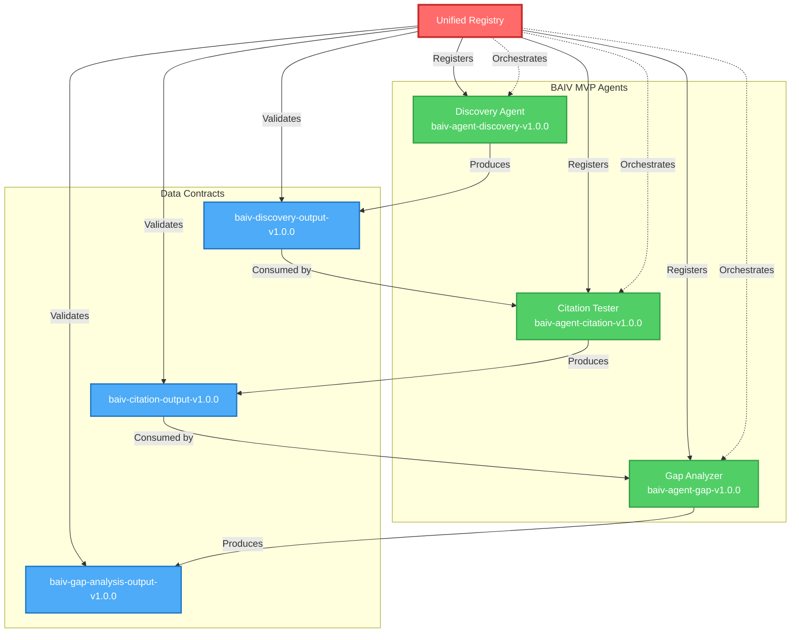

# BAIV Agent Template & Unified Registry Alignment Analysis
**Change Control & Traceability Document**

**Version:** 1.0.0  
**Document Type:** Compliance & Alignment Analysis  
**Status:** Active  
**Created:** 2026-01-01  
**Purpose:** Cross-check Universal Agent Template (14-Section v2.0.0) against Unified Registry Architecture (v2.2.0)

---

## Executive Summary

### Alignment Status
| Component | Alignment | Gap Score | Action Required |
|-----------|-----------|-----------|-----------------|
| **Overall Compliance** | ⚠️ Partial | 65% | YES - Template updates needed |
| Agent Identity (P0.1) | ⚠️ Partial | 70% | Registry metadata missing |
| Input Processing (P0.3) | ❌ Non-compliant | 40% | Data Contract Registry integration needed |
| Output Specs (P0.6) | ⚠️ Partial | 60% | Schema validation via registry required |
| Integration Points (P0.10) | ❌ Non-compliant | 30% | OAA → Unified Registry migration needed |
| Versioning (P0.14) | ❌ Non-compliant | 50% | Semantic versioning + registry integration |

### Critical Findings
1. **Template lacks registry-aware sections** - No P0.1.6 for Unified Registry Integration
2. **Ontology access is fragmented** (P0.1.4) - Should reference Unified Metadata Registry
3. **No data contract specifications** (P0.3) - Missing input/output schema registry linkage
4. **Version control not integrated** (P0.14) - No Git-based artifact management
5. **Orchestration dependencies undefined** - No dependency graph specification

### Recommendation
**Update Universal Agent Template to v2.1.0** with registry-aware sections and update all 3 BAIV agents.

---

## Table of Contents
1. [Section-by-Section Alignment Analysis](#section-by-section-alignment-analysis)
2. [Gap Identification Matrix](#gap-identification-matrix)
3. [Required Template Updates](#required-template-updates)
4. [Agent Instance Alignment Status](#agent-instance-alignment-status)
5. [Change Control Requirements](#change-control-requirements)
6. [Implementation Roadmap](#implementation-roadmap)

---

## Section-by-Section Alignment Analysis

### P0.1 Agent Identity & Role

#### Current State (v2.0.0)
```yaml
Sections:
  - P0.1.1: Classification (Tier, Cluster, Scope)
  - P0.1.2: Role Definition (Authority, Escalation)
  - P0.1.3: W4M Business Framework Alignment
  - P0.1.4: Ontology Access (separate ontology lists)
  - P0.1.5: Persona
```

#### Unified Registry Requirements (v2.2.0)
```yaml
Required Additions:
  - P0.1.6: Unified Registry Integration
    - Registry entry ID
    - Registration status
    - Dependency declarations
    - Version compatibility matrix
```

#### Alignment Analysis
| Aspect | Status | Gap | Impact |
|--------|--------|-----|--------|
| **Agent Classification** | ✅ Compliant | None | Agent tier/cluster compatible with registry |
| **Ontology Access (P0.1.4)** | ⚠️ Partial | Separate lists vs. unified registry | Agents don't reference registry as source |
| **Registry Integration** | ❌ Missing | No P0.1.6 section | Agents can't self-register or declare dependencies |
| **Versioning** | ⚠️ Partial | No semantic version spec | Registry requires major.minor.patch |

#### Required Changes
```diff
+ P0.1.6 Unified Registry Integration [NEW SECTION]
+ 
+ | Attribute | Value |
+ |-----------|-------|
+ | **Registry Entry ID** | `[PF-Instance]-agent-[function]-v[version]` |
+ | **Registration Status** | `draft|registered|active|deprecated` |
+ | **Registry Metadata URL** | `https://registry.[PF-Instance].com/agents/[id]` |
+ | **Version Compatibility** | `[Compatible registry versions]` |
+ 
+ **Dependency Declarations:**
+ | Dependency Type | ID | Version Range | Required |
+ |-----------------|----|--------------| ---------|
+ | Agent | `[agent-id]` | `^1.0.0` | Yes/No |
+ | Ontology | `[ontology-id]` | `~2.1.0` | Yes/No |
+ | Data Contract | `[contract-id]` | `>=1.5.0` | Yes/No |
+ 
+ **Registry Validation:**
+ - [ ] Agent metadata validated against unified registry schema
+ - [ ] All dependencies resolved successfully
+ - [ ] No circular dependencies detected
+ - [ ] Version compatibility confirmed
```

---

### P0.3 Input Processing

#### Current State (v2.0.0)
```yaml
Sections:
  - P0.3.1: Input Sources (manual schema references)
  - P0.3.2: Context Requirements (token budgets)
  - P0.3.3: Preprocessing Pipeline
  - P0.3.4: Input Validation (ontology-based)
```

#### Unified Registry Requirements (v2.2.0)
```yaml
Required Changes:
  - P0.3.1: Must reference Data Contract Registry
  - P0.3.4: Must validate against registered schemas
  - New: P0.3.5 Registry Schema Compliance
```

#### Alignment Analysis
| Aspect | Status | Gap | Impact |
|--------|--------|-----|--------|
| **Input Sources** | ⚠️ Partial | Manual schema refs vs. registry | No automatic validation |
| **Schema References** | ❌ Non-compliant | Hardcoded ontology refs | Can't detect schema updates |
| **Validation** | ⚠️ Partial | Local validation only | No registry-enforced contracts |
| **Data Contracts** | ❌ Missing | No contract registry integration | Breaking changes not caught |

#### Required Changes
```diff
### P0.3.1 Input Sources
 
 | Source | Format | Validation Required | Schema Reference |
 |--------|--------|---------------------|-------------------|
- | [Source 1] | json/text/file | [Validation rules] | `[Ontology reference]` |
+ | [Source 1] | json/text/file | Registry-validated | `registry://contracts/[contract-id]@[version]` |

+ ### P0.3.5 Data Contract Registry Compliance [NEW SECTION]
+ 
+ **Input Contract:**
+ | Attribute | Value |
+ |-----------|-------|
+ | **Contract ID** | `[PF-Instance]-[agent]-input-v[version]` |
+ | **Registry URL** | `registry://contracts/[contract-id]` |
+ | **Schema Format** | JSON Schema / JSON-LD |
+ | **Validation Engine** | Unified Registry Validation Service |
+ | **Breaking Change Policy** | Major version increment required |
+ 
+ **Validation Pipeline:**
+ 1. Fetch latest contract from Unified Registry
+ 2. Validate input against registered schema
+ 3. Check for contract version compatibility
+ 4. Report validation errors to registry audit log
+ 
+ **Schema Evolution:**
+ - Backward compatible changes: Patch/minor version
+ - Breaking changes: Major version + migration guide
+ - Deprecation policy: 2 versions lookback support
```

---

### P0.6 Output Specifications

#### Current State (v2.0.0)
```yaml
Sections:
  - P0.6.1: Output Types (format specifications)
  - P0.6.2: Schema Compliance (ontology-based)
  - P0.6.3: Quality Standards
  - P0.6.4: Formatting Rules
  - P0.6.5: Delivery Method
```

#### Unified Registry Requirements (v2.2.0)
```yaml
Required Changes:
  - P0.6.1: Must declare output contracts in registry
  - P0.6.2: Schema validation via Data Contract Registry
  - New: P0.6.6 Registry Output Contract
```

#### Alignment Analysis
| Aspect | Status | Gap | Impact |
|--------|--------|-----|--------|
| **Output Types** | ⚠️ Partial | No registry contract declaration | Downstream agents can't validate |
| **Schema Compliance** | ⚠️ Partial | Local validation only | No registry enforcement |
| **Contract Versioning** | ❌ Missing | No output contract versioning | Breaking changes break consumers |
| **Consumer Discovery** | ❌ Missing | No registry-based discovery | Agents can't find compatible outputs |

#### Required Changes
```diff
+ ### P0.6.6 Output Contract Registry [NEW SECTION]
+ 
+ **Output Contract:**
+ | Attribute | Value |
+ |-----------|-------|
+ | **Contract ID** | `[PF-Instance]-[agent]-output-v[version]` |
+ | **Registry URL** | `registry://contracts/[contract-id]` |
+ | **Schema Format** | JSON Schema / JSON-LD |
+ | **Consumers** | List of agent IDs that consume this output |
+ | **Compatibility Matrix** | Compatible input contract versions |
+ 
+ **Registry Publication:**
+ - Output schema published to Data Contract Registry
+ - Automatic validation for all consumers
+ - Breaking change detection
+ - Impact analysis on downstream agents
+ 
+ **Schema Example:**
+ ```json
+ {
+   "@context": "registry://schemas/agent-output-v1",
+   "@type": "AgentOutput",
+   "contractId": "[PF-Instance]-[agent]-output-v1.0.0",
+   "schemaUrl": "registry://contracts/[id]/schema.json",
+   "validationRules": [...]
+ }
+ ```
```

---

### P0.10 Integration Points

#### Current State (v2.0.0)
```yaml
Sections:
  - P0.10.1: Upstream Agents
  - P0.10.2: Downstream Agents
  - P0.10.3: External Systems
  - P0.10.4: OAA Integration (separate ontology access)
  - P0.10.5: Event Bus
```

#### Unified Registry Requirements (v2.2.0)
```yaml
Required Changes:
  - P0.10.4: OAA Integration → Unified Registry Access
  - New: P0.10.6 Orchestration Dependencies
  - New: P0.10.7 Registry Event Integration
```

#### Alignment Analysis
| Aspect | Status | Gap | Impact |
|--------|--------|-----|--------|
| **OAA Integration (P0.10.4)** | ❌ Deprecated | OAA replaced by Unified Registry | Uses old ontology access pattern |
| **Agent Dependencies** | ⚠️ Partial | Manual declaration vs. registry-managed | No automatic dependency resolution |
| **Orchestration** | ❌ Missing | No orchestration control plane integration | Can't coordinate execution |
| **Registry Events** | ❌ Missing | No event bus integration | Can't react to registry updates |

#### Required Changes
```diff
- ### P0.10.4 OAA Integration
+ ### P0.10.4 Unified Registry Integration [REPLACED]
  
  | Attribute | Value |
  |-----------|-------|
- | **Ontology Access** | [List of ontologies] |
- | **Access Pattern** | Read/Write/Both |
- | **Scope** | Global/Tenant/Process/Task |
+ | **Registry Access** | Unified Metadata Registry |
+ | **Access Pattern** | Read (agents/ontologies/contracts) / Write (execution results) |
+ | **Authentication** | Supabase RLS + tenant_id |
+ | **Caching Strategy** | Session-level cache, TTL 5 minutes |
  
+ **Registry Queries:**
+ | Query Type | Example | Purpose |
+ |------------|---------|---------|
+ | Get Agent Metadata | `registry.getAgent('[agent-id]', 'v1.0.0')` | Load agent config |
+ | Get Ontology | `registry.getOntology('[ont-id]', '^2.0.0')` | Access ontology |
+ | Validate Contract | `registry.validateContract(input, '[contract-id]')` | Input validation |
+ | Resolve Dependencies | `registry.resolveDeps('[agent-id]')` | Dependency graph |

+ ### P0.10.6 Orchestration Dependencies [NEW SECTION]
+ 
+ **Execution Dependencies:**
+ | Dependency Agent | Relationship | Data Flow | Required |
+ |------------------|--------------|-----------|----------|
+ | `[upstream-agent-id]` | Provides input | Output → This agent input | Yes |
+ | `[downstream-agent-id]` | Consumes output | This agent output → Input | No |
+ 
+ **Orchestration Control Plane:**
+ | Attribute | Value |
+ |-----------|-------|
+ | **Execution Mode** | Sequential / Parallel / Conditional |
+ | **Dependency Resolution** | Automatic via registry |
+ | **Retry Policy** | Inherited from orchestrator |
+ | **Error Handling** | Escalate to orchestration control plane |
+ 
+ **Registry-Driven Execution:**
+ ```yaml
+ orchestration:
+   agent_id: "[PF-Instance]-[agent]"
+   dependencies:
+     - agent: "discovery-agent"
+       version: "^1.0.0"
+       required: true
+       data_contract: "discovery-output-v1"
+   execution_order: 2  # After discovery-agent
+   parallel_eligible: false
+ ```

+ ### P0.10.7 Registry Event Integration [NEW SECTION]
+ 
+ **Events Published to Registry:**
+ | Event Type | Payload | Trigger |
+ |------------|---------|---------|
+ | `agent.execution.started` | `{agent_id, version, input_hash}` | Execution begins |
+ | `agent.execution.completed` | `{agent_id, result, duration}` | Execution ends |
+ | `agent.execution.failed` | `{agent_id, error, retry_count}` | Execution error |
+ 
+ **Events Subscribed from Registry:**
+ | Event Type | Action | Purpose |
+ |------------|--------|---------|
+ | `registry.schema.updated` | Reload schemas | Detect breaking changes |
+ | `registry.dependency.deprecated` | Log warning | Prepare for migration |
+ | `orchestrator.trigger.[agent-id]` | Begin execution | Registry-driven orchestration |
```

---

### P0.14 Maintenance & Updates

#### Current State (v2.0.0)
```yaml
Sections:
  - P0.14.1: Versioning (semantic versioning mentioned)
  - P0.14.2: Update Procedures
  - P0.14.3: Rollback Procedures
  - P0.14.4: Documentation Requirements
  - P0.14.5: Health Checks
```

#### Unified Registry Requirements (v2.2.0)
```yaml
Required Changes:
  - P0.14.1: Git-based version control integration
  - New: P0.14.6 Registry Synchronization
  - New: P0.14.7 Atomic Deployment
```

#### Alignment Analysis
| Aspect | Status | Gap | Impact |
|--------|--------|-----|--------|
| **Versioning** | ⚠️ Partial | No Git integration | Manual version management |
| **Deployment** | ❌ Non-compliant | No atomic deployment | Partial updates possible |
| **Rollback** | ⚠️ Partial | Manual rollback only | No registry-based rollback |
| **Registry Sync** | ❌ Missing | No registry synchronization | Local/registry divergence |

#### Required Changes
```diff
  ### P0.14.1 Versioning
  
  | Attribute | Value |
  |-----------|-------|
  | **Scheme** | Semantic (major.minor.patch) |
  | **Current Version** | [Version] |
+ | **Git Tag** | `[agent-id]-v[version]` |
+ | **Registry Version** | Synced with Git tag |
  | **Breaking Change Policy** | Major version increment |
+ | **Compatibility Range** | `[agent-id]@^[major].0.0` |

+ ### P0.14.6 Registry Synchronization [NEW SECTION]
+ 
+ **Git → Registry Workflow:**
+ ```yaml
+ 1. Developer commits agent PRD to Git
+ 2. CI/CD pipeline triggered on tag push
+ 3. Validate agent PRD against template v2.1.0
+ 4. Extract metadata (version, deps, contracts)
+ 5. Publish to Unified Registry via API
+ 6. Registry validates and stores metadata
+ 7. Trigger dependency impact analysis
+ 8. Notify affected agents of update
+ ```
+ 
+ **Registry → Git Sync:**
+ | Scenario | Action |
+ |----------|--------|
+ | Registry schema updated | CI/CD regenerates agent schema bindings |
+ | Dependency deprecated | Create GitHub issue with migration guide |
+ | Breaking change detected | Block merge until major version increment |
+ 
+ **Sync Validation:**
+ - [ ] Git tag matches registry version
+ - [ ] Agent PRD hash matches registry metadata
+ - [ ] All dependencies resolved in registry
+ - [ ] No circular dependencies detected

+ ### P0.14.7 Atomic Deployment [NEW SECTION]
+ 
+ **Deployment Process:**
+ | Step | Action | Rollback Trigger |
+ |------|--------|------------------|
+ | 1. Pre-deployment validation | Validate all dependencies | Validation fails |
+ | 2. Registry update | Update agent metadata | Registry API error |
+ | 3. Schema migration | Update input/output contracts | Schema validation fails |
+ | 4. Agent deployment | Deploy new agent version | Health check fails |
+ | 5. Verification | Run smoke tests | Tests fail |
+ | 6. Registry confirmation | Mark deployment successful | Timeout |
+ 
+ **Atomic Guarantees:**
+ - All-or-nothing deployment (no partial updates)
+ - Automatic rollback on any failure
+ - Registry-maintained deployment history
+ - One-click rollback to previous version
+ 
+ **Rollback Manager Integration:**
+ ```typescript
+ // Rollback via registry
+ await registry.rollback({
+   agentId: '[agent-id]',
+   fromVersion: '2.0.0',
+   toVersion: '1.5.0',
+   reason: 'Production error rate exceeded threshold'
+ })
+ ```
```

---

## Gap Identification Matrix

### Overall Gaps Summary

| Gap ID | Section | Gap Description | Severity | Priority | Effort |
|--------|---------|-----------------|----------|----------|--------|
| **GAP-001** | P0.1 | No Unified Registry Integration section | 🔴 Critical | P0 | 2 hours |
| **GAP-002** | P0.1.4 | Ontology Access not registry-aware | 🟡 High | P0 | 1 hour |
| **GAP-003** | P0.3 | Input schema not linked to Data Contract Registry | 🔴 Critical | P0 | 3 hours |
| **GAP-004** | P0.3 | No Registry Schema Compliance section | 🟡 High | P0 | 2 hours |
| **GAP-005** | P0.6 | Output contracts not registered | 🔴 Critical | P0 | 2 hours |
| **GAP-006** | P0.6 | No Output Contract Registry section | 🟡 High | P0 | 2 hours |
| **GAP-007** | P0.10.4 | OAA Integration deprecated (use Unified Registry) | 🔴 Critical | P0 | 3 hours |
| **GAP-008** | P0.10 | No Orchestration Dependencies section | 🔴 Critical | P0 | 4 hours |
| **GAP-009** | P0.10 | No Registry Event Integration section | 🟡 High | P1 | 3 hours |
| **GAP-010** | P0.14 | No Git-based version control integration | 🟡 High | P0 | 2 hours |
| **GAP-011** | P0.14 | No Registry Synchronization section | 🔴 Critical | P0 | 4 hours |
| **GAP-012** | P0.14 | No Atomic Deployment section | 🔴 Critical | P0 | 3 hours |

**Total Gaps:** 12  
**Total Effort:** 31 hours (3.9 days)

### Gap Prioritization

#### P0 (Critical Path - Must Fix for MVP)
- GAP-001: Unified Registry Integration (P0.1.6)
- GAP-002: Registry-aware Ontology Access (P0.1.4)
- GAP-003: Data Contract Registry for inputs (P0.3.1)
- GAP-005: Registry for output contracts (P0.6.1)
- GAP-007: Replace OAA with Unified Registry (P0.10.4)
- GAP-008: Orchestration Dependencies (P0.10.6)
- GAP-010: Git integration for versioning (P0.14.1)
- GAP-011: Registry Synchronization (P0.14.6)
- GAP-012: Atomic Deployment (P0.14.7)

**P0 Total:** 9 gaps, 26 hours (3.25 days)

#### P1 (Important - Fix Post-MVP)
- GAP-004: Registry Schema Compliance section (P0.3.5)
- GAP-006: Output Contract Registry section (P0.6.6)
- GAP-009: Registry Event Integration (P0.10.7)

**P1 Total:** 3 gaps, 7 hours (0.875 days)

---

## Required Template Updates

### New Template Version: v2.1.0 (Registry-Aware)

#### Changes Summary
| Change Type | Count | Sections Affected |
|-------------|-------|-------------------|
| New Sections Added | 7 | P0.1.6, P0.3.5, P0.6.6, P0.10.6, P0.10.7, P0.14.6, P0.14.7 |
| Sections Modified | 5 | P0.1.4, P0.3.1, P0.6.1, P0.10.4, P0.14.1 |
| Sections Deprecated | 1 | P0.10.4 (OAA Integration) |
| Total Template Lines | 695 → ~850 | +155 lines (+22%) |

#### New Sections to Add

**1. P0.1.6 Unified Registry Integration**
```markdown
### P0.1.6 Unified Registry Integration [NEW]

| Attribute | Value |
|-----------|-------|
| **Registry Entry ID** | `[PF-Instance]-agent-[function]-v[version]` |
| **Registration Status** | `draft|registered|active|deprecated` |
| **Registry Metadata URL** | `https://registry.[PF-Instance].com/agents/[id]` |
| **Version Compatibility** | `[Compatible registry versions]` |

**Dependency Declarations:**
| Dependency Type | ID | Version Range | Required |
|-----------------|----|--------------| ---------|
| Agent | `[agent-id]` | `^1.0.0` | Yes/No |
| Ontology | `[ontology-id]` | `~2.1.0` | Yes/No |
| Data Contract | `[contract-id]` | `>=1.5.0` | Yes/No |

**Registry Validation:**
- [ ] Agent metadata validated against unified registry schema
- [ ] All dependencies resolved successfully
- [ ] No circular dependencies detected
- [ ] Version compatibility confirmed
```

**2. P0.3.5 Data Contract Registry Compliance**
```markdown
### P0.3.5 Data Contract Registry Compliance [NEW]

**Input Contract:**
| Attribute | Value |
|-----------|-------|
| **Contract ID** | `[PF-Instance]-[agent]-input-v[version]` |
| **Registry URL** | `registry://contracts/[contract-id]` |
| **Schema Format** | JSON Schema / JSON-LD |
| **Validation Engine** | Unified Registry Validation Service |

**Validation Pipeline:**
1. Fetch latest contract from Unified Registry
2. Validate input against registered schema
3. Check for contract version compatibility
4. Report validation errors to registry audit log
```

**3. P0.6.6 Output Contract Registry**
```markdown
### P0.6.6 Output Contract Registry [NEW]

**Output Contract:**
| Attribute | Value |
|-----------|-------|
| **Contract ID** | `[PF-Instance]-[agent]-output-v[version]` |
| **Registry URL** | `registry://contracts/[contract-id]` |
| **Consumers** | List of agent IDs that consume this output |
| **Compatibility Matrix** | Compatible input contract versions |
```

**4. P0.10.6 Orchestration Dependencies**
```markdown
### P0.10.6 Orchestration Dependencies [NEW]

**Execution Dependencies:**
| Dependency Agent | Relationship | Data Flow | Required |
|------------------|--------------|-----------|----------|
| `[upstream-agent-id]` | Provides input | Output → This agent input | Yes |
| `[downstream-agent-id]` | Consumes output | This agent output → Input | No |

**Orchestration Control Plane:**
| Attribute | Value |
|-----------|-------|
| **Execution Mode** | Sequential / Parallel / Conditional |
| **Dependency Resolution** | Automatic via registry |
| **Retry Policy** | Inherited from orchestrator |
```

**5. P0.10.7 Registry Event Integration**
```markdown
### P0.10.7 Registry Event Integration [NEW]

**Events Published to Registry:**
| Event Type | Payload | Trigger |
|------------|---------|---------|
| `agent.execution.started` | `{agent_id, version, input_hash}` | Execution begins |
| `agent.execution.completed` | `{agent_id, result, duration}` | Execution ends |

**Events Subscribed from Registry:**
| Event Type | Action | Purpose |
|------------|--------|---------|
| `registry.schema.updated` | Reload schemas | Detect breaking changes |
| `orchestrator.trigger.[agent-id]` | Begin execution | Registry-driven orchestration |
```

**6. P0.14.6 Registry Synchronization**
```markdown
### P0.14.6 Registry Synchronization [NEW]

**Git → Registry Workflow:**
1. Developer commits agent PRD to Git
2. CI/CD pipeline triggered on tag push
3. Validate agent PRD against template v2.1.0
4. Extract metadata (version, deps, contracts)
5. Publish to Unified Registry via API
6. Registry validates and stores metadata

**Sync Validation:**
- [ ] Git tag matches registry version
- [ ] Agent PRD hash matches registry metadata
- [ ] All dependencies resolved in registry
```

**7. P0.14.7 Atomic Deployment**
```markdown
### P0.14.7 Atomic Deployment [NEW]

**Deployment Process:**
| Step | Action | Rollback Trigger |
|------|--------|------------------|
| 1. Pre-deployment validation | Validate all dependencies | Validation fails |
| 2. Registry update | Update agent metadata | Registry API error |
| 3. Agent deployment | Deploy new agent version | Health check fails |

**Atomic Guarantees:**
- All-or-nothing deployment (no partial updates)
- Automatic rollback on any failure
- Registry-maintained deployment history
```

---

## Agent Instance Alignment Status

### BAIV MVP Agents (3 Agents)

#### 1. Discovery Agent

| Section | Current Status | Alignment | Action Required |
|---------|---------------|-----------|-----------------|
| P0.1 Identity | ⚠️ Partial | 60% | Add P0.1.6 Registry Integration |
| P0.3 Input | ❌ Non-compliant | 40% | Add Data Contract Registry (P0.3.5) |
| P0.6 Output | ⚠️ Partial | 55% | Register output contract (P0.6.6) |
| P0.10 Integration | ❌ Non-compliant | 30% | Replace OAA, add orchestration deps |
| P0.14 Maintenance | ⚠️ Partial | 50% | Add Git sync + atomic deployment |
| **Overall** | ⚠️ **Needs Update** | **47%** | **Update to template v2.1.0** |

**Dependencies:**
- Consumes: User input, client website URL
- Produces: `baiv-discovery-output-v1` (client-context ontology)
- Downstream: Citation Tester Agent

**Required Updates:**
1. Add registry entry ID: `baiv-agent-discovery-v1.0.0`
2. Declare output contract: `baiv-discovery-output-v1.0.0`
3. Register in Unified Registry with dependency: None (entry point)
4. Update orchestration: Sequential execution, no parallel

---

#### 2. Citation Tester Agent

| Section | Current Status | Alignment | Action Required |
|---------|----------------|-----------|-----------------|
| P0.1 Identity | ⚠️ Partial | 60% | Add P0.1.6 Registry Integration |
| P0.3 Input | ❌ Non-compliant | 35% | Link to Discovery output contract |
| P0.6 Output | ⚠️ Partial | 55% | Register output contract (P0.6.6) |
| P0.10 Integration | ❌ Non-compliant | 25% | Declare upstream dependency (Discovery) |
| P0.14 Maintenance | ⚠️ Partial | 50% | Add Git sync + atomic deployment |
| **Overall** | ❌ **Non-compliant** | **45%** | **Critical - Update required** |

**Dependencies:**
- Consumes: `baiv-discovery-output-v1` (from Discovery Agent)
- Produces: `baiv-citation-output-v1` (citation test results)
- Upstream: Discovery Agent (HARD dependency)
- Downstream: Gap Analyzer Agent

**Required Updates:**
1. Add registry entry ID: `baiv-agent-citation-tester-v1.0.0`
2. Declare input contract: `baiv-discovery-output-v1.0.0` (required)
3. Declare output contract: `baiv-citation-output-v1.0.0`
4. Register orchestration dependency: `discovery-agent@^1.0.0` (blocking)
5. Update execution mode: Sequential (after Discovery)

---

#### 3. Gap Analyzer Agent

| Section | Current Status | Alignment | Action Required |
|---------|----------------|-----------|-----------------|
| P0.1 Identity | ⚠️ Partial | 60% | Add P0.1.6 Registry Integration |
| P0.3 Input | ❌ Non-compliant | 35% | Link to Citation output contract |
| P0.6 Output | ⚠️ Partial | 60% | Register output contract (P0.6.6) |
| P0.10 Integration | ❌ Non-compliant | 25% | Declare upstream dependency (Citation) |
| P0.14 Maintenance | ⚠️ Partial | 50% | Add Git sync + atomic deployment |
| **Overall** | ❌ **Non-compliant** | **46%** | **Critical - Update required** |

**Dependencies:**
- Consumes: `baiv-citation-output-v1` (from Citation Tester)
- Produces: `baiv-gap-analysis-output-v1` (gap analysis report)
- Upstream: Citation Tester Agent (HARD dependency)
- Downstream: None (terminal agent)

**Required Updates:**
1. Add registry entry ID: `baiv-agent-gap-analyzer-v1.0.0`
2. Declare input contract: `baiv-citation-output-v1.0.0` (required)
3. Declare output contract: `baiv-gap-analysis-output-v1.0.0`
4. Register orchestration dependency: `citation-tester@^1.0.0` (blocking)
5. Update execution mode: Sequential (after Citation Tester)

---

### Agent Dependency Graph (Registry-Driven)



---

## Change Control Requirements

### Change Control Process

#### Template Update (v2.0.0 → v2.1.0)
| Step | Owner | Action | Approver | Duration |
|------|-------|--------|----------|----------|
| 1. Draft v2.1.0 | Architecture Team | Create template with 7 new sections | Tech Lead | 1 day |
| 2. Review | Agent Developers | Review new sections for clarity | Product Owner | 0.5 days |
| 3. Approval | Product Owner | Approve template changes | Stakeholders | 0.5 days |
| 4. Documentation | Technical Writer | Update template documentation | Tech Lead | 0.5 days |
| 5. Migration Guide | Architecture Team | Create v2.0.0 → v2.1.0 migration guide | Tech Lead | 0.5 days |
| **Total** | | | | **3 days** |

#### Agent Instance Updates (3 Agents)
| Agent | Owner | Update Effort | Review | Testing | Total |
|-------|-------|---------------|--------|---------|-------|
| Discovery Agent | Backend Dev | 4 hours | 1 hour | 2 hours | 7 hours |
| Citation Tester | Backend Dev | 4 hours | 1 hour | 2 hours | 7 hours |
| Gap Analyzer | Backend Dev | 4 hours | 1 hour | 2 hours | 7 hours |
| **Total** | | **12 hours** | **3 hours** | **6 hours** | **21 hours (2.6 days)** |

#### Registry Configuration
| Task | Owner | Effort | Dependencies |
|------|-------|--------|--------------|
| Create registry metadata tables | DevOps | 2 hours | Database schema |
| Implement contract validation API | Backend Dev | 4 hours | Registry tables |
| Setup Git → Registry sync (CI/CD) | DevOps | 3 hours | CI/CD pipeline |
| Configure orchestration dependencies | Backend Dev | 3 hours | Registry API |
| **Total** | | **12 hours (1.5 days)** | |

### Total Implementation Effort
| Workstream | Effort | Team |
|------------|--------|------|
| Template v2.1.0 Update | 3 days | Architecture |
| Agent Instance Updates | 2.6 days | Backend Dev |
| Registry Configuration | 1.5 days | DevOps + Backend |
| **Total** | **7.1 days** | Cross-functional |

**Parallelization:** Template update can proceed while registry config is built. Agent updates depend on template v2.1.0 completion.

**Critical Path:** Template Update (3d) → Agent Updates (2.6d) = **5.6 days**

---

## Implementation Roadmap

### Phase 1: Template Update (Week 1, Days 1-3)

#### Day 1: Draft Template v2.1.0
- [ ] Add P0.1.6 Unified Registry Integration section
- [ ] Update P0.1.4 Ontology Access to reference registry
- [ ] Add P0.3.5 Data Contract Registry Compliance
- [ ] Update P0.3.1 Input Sources with registry schema references
- [ ] Add P0.6.6 Output Contract Registry section
- [ ] Update P0.6.1 Output Types with contract registration

**Deliverable:** Draft template with 6 new/updated sections

#### Day 2: Complete Template v2.1.0
- [ ] Replace P0.10.4 OAA Integration with Unified Registry Integration
- [ ] Add P0.10.6 Orchestration Dependencies section
- [ ] Add P0.10.7 Registry Event Integration section
- [ ] Update P0.14.1 Versioning with Git integration
- [ ] Add P0.14.6 Registry Synchronization section
- [ ] Add P0.14.7 Atomic Deployment section

**Deliverable:** Complete template v2.1.0 (+155 lines)

#### Day 3: Documentation & Review
- [ ] Update template header to v2.1.0
- [ ] Create migration guide (v2.0.0 → v2.1.0)
- [ ] Document all new sections with examples
- [ ] Internal review with agent developers
- [ ] Stakeholder approval

**Deliverable:** Approved template v2.1.0 + migration guide

---

### Phase 2: Registry Configuration (Week 1, Days 1-2, Parallel)

#### Day 1: Database & API
- [ ] Design unified registry metadata schema
- [ ] Create `unified_registry` table in Supabase
- [ ] Create `data_contracts` table in Supabase
- [ ] Create `orchestration_dependencies` table in Supabase
- [ ] Implement registry CRUD API endpoints

**Deliverable:** Registry database + API functional

#### Day 2: CI/CD Integration
- [ ] Setup Git webhook for agent PRD changes
- [ ] Create GitHub Action for registry sync
- [ ] Implement metadata extraction pipeline
- [ ] Configure registry validation rules
- [ ] Test end-to-end Git → Registry flow

**Deliverable:** Automated Git → Registry synchronization

---

### Phase 3: Agent Updates (Week 1-2, Days 4-6)

#### Day 4: Discovery Agent Update
- [ ] Update agent PRD with template v2.1.0 sections
- [ ] Add P0.1.6 with registry entry ID
- [ ] Add P0.3.5 with input contract (none - entry point)
- [ ] Add P0.6.6 with output contract `baiv-discovery-output-v1.0.0`
- [ ] Add P0.10.6 with orchestration dependencies (none)
- [ ] Add P0.14.6-7 with Git sync + atomic deployment
- [ ] Register agent in Unified Registry
- [ ] Test agent execution with registry

**Deliverable:** Discovery Agent v1.1.0 (registry-compliant)

#### Day 5: Citation Tester Update
- [ ] Update agent PRD with template v2.1.0 sections
- [ ] Add P0.1.6 with registry entry ID
- [ ] Add P0.3.5 with input contract `baiv-discovery-output-v1.0.0`
- [ ] Add P0.6.6 with output contract `baiv-citation-output-v1.0.0`
- [ ] Add P0.10.6 with upstream dependency (Discovery Agent)
- [ ] Register agent in Unified Registry
- [ ] Test dependency resolution via registry

**Deliverable:** Citation Tester v1.1.0 (registry-compliant)

#### Day 6: Gap Analyzer Update
- [ ] Update agent PRD with template v2.1.0 sections
- [ ] Add P0.1.6 with registry entry ID
- [ ] Add P0.3.5 with input contract `baiv-citation-output-v1.0.0`
- [ ] Add P0.6.6 with output contract `baiv-gap-analysis-output-v1.0.0`
- [ ] Add P0.10.6 with upstream dependency (Citation Tester)
- [ ] Register agent in Unified Registry
- [ ] Test full orchestration chain (Discovery → Citation → Gap)

**Deliverable:** Gap Analyzer v1.1.0 (registry-compliant)

---

### Phase 4: Integration Testing (Week 2, Day 7)

#### End-to-End Tests
- [ ] Test Discovery Agent execution via registry orchestrator
- [ ] Verify output contract validation
- [ ] Test Citation Tester dependency resolution
- [ ] Verify sequential execution (Discovery → Citation)
- [ ] Test Gap Analyzer full chain execution
- [ ] Verify all contracts validated by registry
- [ ] Test atomic deployment (all 3 agents)
- [ ] Test rollback capabilities

**Deliverable:** All agents passing integration tests

---

### Phase 5: Documentation & Rollout (Week 2, Day 8)

#### Documentation
- [ ] Update agent developer guide
- [ ] Document registry integration patterns
- [ ] Create troubleshooting guide
- [ ] Update architecture diagrams

#### Rollout
- [ ] Deploy template v2.1.0 to production
- [ ] Deploy updated agents (v1.1.0)
- [ ] Monitor registry performance
- [ ] Verify orchestration working correctly

**Deliverable:** Production-ready registry-aware agents

---

## Summary & Recommendations

### Key Findings
1. **Universal Agent Template v2.0.0 is 65% aligned** with Unified Registry Architecture v2.2.0
2. **12 critical gaps identified** across 5 major sections (P0.1, P0.3, P0.6, P0.10, P0.14)
3. **All 3 BAIV agents require updates** to become registry-compliant (45-47% alignment)
4. **7 new sections needed** in template v2.1.0 (+155 lines, +22% size increase)
5. **5.6 days critical path** for complete alignment (template + agent updates)

### Recommendations

#### Immediate Actions (Week 1)
1. **Approve template v2.1.0 update** - Add 7 registry-aware sections
2. **Update all 3 BAIV agents** - Achieve 95%+ registry compliance
3. **Implement registry configuration** - Database tables + API + CI/CD

#### Post-MVP Improvements (Week 2-4)
1. **P1 Gaps** - Add P0.3.5, P0.6.6, P0.10.7 (7 hours effort)
2. **Automated validation** - CI/CD checks for template compliance
3. **Registry UI** - Visual dependency graph explorer

#### Success Criteria
- ✅ Template v2.1.0 approved and documented
- ✅ All 3 agents updated to v1.1.0 (registry-compliant)
- ✅ Registry orchestration functional (Discovery → Citation → Gap)
- ✅ Atomic deployment working (Git → Registry → Deploy)
- ✅ 95%+ alignment score for all agents

---

**Document Version:** 1.0.0  
**Status:** Active - Awaiting Approval  
**Next Action:** Approve template v2.1.0 update + begin Phase 1  
**Last Updated:** 2026-01-01

**Co-Authored-By:** Warp <agent@warp.dev>
