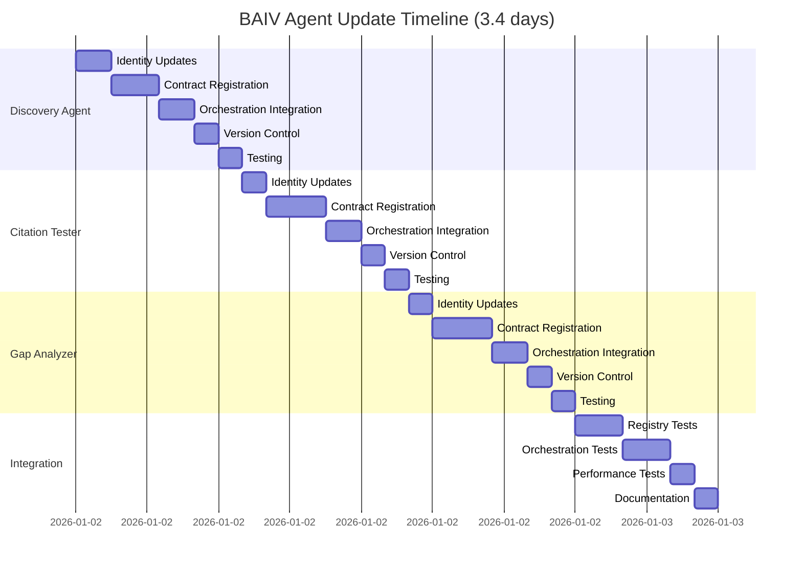
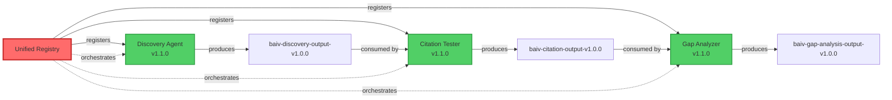

# BAIV Agent Update Implementation Plan v1.0.0
**Registry Compliance Update: Discovery, Citation Tester, Gap Analyzer**

**Version:** 1.0.0  
**Document Type:** Implementation Plan (PRD-PBS-WBS)  
**Status:** Ready for Execution  
**Created:** 2026-01-01  
**Purpose:** Update 3 BAIV MVP agents to template v2.1.0 (registry-compliant)

---

## 1. PRD: Product Requirements

### 1.1 Product Vision

**Objective:**
Update all 3 BAIV MVP agents (Discovery, Citation Tester, Gap Analyzer) to Universal Agent Template v2.1.0, achieving 95%+ registry compliance and enabling unified registry orchestration.

**Current State (v1.0.0):**
- Agents built on template v2.0.0
- Manual ontology access (OAA pattern)
- No data contract registration
- No orchestration dependencies declared
- 45-47% registry alignment

**Target State (v1.1.0):**
- Agents compliant with template v2.1.0
- Registry-driven ontology access
- Input/output contracts registered
- Orchestration dependencies defined
- 95%+ registry alignment

###  1.2 Business Requirements

**Why This Matters:**
- **Orchestration:** Enable automatic agent sequencing (Discovery → Citation → Gap)
- **Data Integrity:** Prevent schema mismatches between agents
- **Scalability:** Support 50+ agents with unified registry
- **Continuous Improvement:** Track all agent changes in registry
- **Version Control:** Atomic deployments with rollback capabilities

**Success Criteria:**
| Metric | Target | Measurement |
|--------|--------|-------------|
| Registry Compliance | 95%+ | Template v2.1.0 checklist |
| All Dependencies Declared | 100% | Registry validation |
| Contracts Registered | 100% | Data Contract Registry |
| Orchestration Working | 100% | End-to-end test (D→C→G) |
| Zero Breaking Changes | 100% | Backward compatibility tests |

### 1.3 Functional Requirements

#### FR1: Agent Identity Registry Integration
- Each agent must have P0.1.6 Unified Registry Integration section
- Registry entry ID format: `baiv-agent-[function]-v1.1.0`
- Dependency declarations for upstream/downstream agents
- Git tag format: `baiv-agent-[function]-v1.1.0`

#### FR2: Data Contract Registration
- Input contracts registered in P0.3.5 (except Discovery - entry point)
- Output contracts registered in P0.6.6 (all 3 agents)
- Schema format: JSON-LD with JSON Schema validation
- Version compatibility matrix defined

#### FR3: Orchestration Dependencies
- P0.10.6 section added with execution dependencies
- Discovery: No upstream (entry point)
- Citation Tester: Depends on Discovery output
- Gap Analyzer: Depends on Citation Tester output
- Sequential execution mode enforced

#### FR4: Registry Integration
- P0.10.4 updated: OAA → Unified Registry access
- Registry queries for agents, ontologies, contracts
- Supabase RLS authentication
- Session-level caching (TTL 5 minutes)

#### FR5: Git/Registry Synchronization
- P0.14.6 section added with sync workflow
- P0.14.7 section added with atomic deployment
- Automatic registry update on Git tag push
- Rollback manager integration

### 1.4 Non-Functional Requirements

| Requirement | Target | Rationale |
|-------------|--------|-----------|
| **Backward Compatibility** | 100% | No breaking changes for existing users |
| **Performance** | <50ms registry overhead | Minimal latency impact |
| **Test Coverage** | 80%+ for new sections | Ensure registry integration works |
| **Documentation** | Complete migration guide | Enable smooth transition |
| **Rollback Time** | <5 minutes | Quick recovery if issues |

---

## 2. PBS: Product Breakdown Structure

### 2.0 PBS Overview

```
BAIV Agent Updates v1.1.0 (Registry Compliance)
├── 1.0 Discovery Agent Update
├── 2.0 Citation Tester Agent Update
├── 3.0 Gap Analyzer Agent Update
└── 4.0 Integration & Testing
```

### 2.1 PBS Level 2: Component Breakdown

#### 1.0 Discovery Agent Update
```
1.0 Discovery Agent (baiv-agent-discovery-v1.1.0)
├── 1.1 Agent Identity Updates
│   ├── 1.1.1 Add P0.1.6 Unified Registry Integration
│   ├── 1.1.2 Update P0.1.4 Ontology Access (registry-aware)
│   └── 1.1.3 Update document header (v1.0.0 → v1.1.0)
├── 1.2 Input/Output Contract Registration
│   ├── 1.2.1 Add P0.3.5 Data Contract (input: none - entry point)
│   ├── 1.2.2 Add P0.6.6 Output Contract (baiv-discovery-output-v1.0.0)
│   └── 1.2.3 Register contracts in Unified Registry
├── 1.3 Orchestration Integration
│   ├── 1.3.1 Add P0.10.6 Orchestration Dependencies (upstream: none)
│   ├── 1.3.2 Update P0.10.4 OAA → Unified Registry
│   └── 1.3.3 Add P0.10.7 Registry Event Integration
├── 1.4 Version Control Integration
│   ├── 1.4.1 Update P0.14.1 Versioning (Git tags)
│   ├── 1.4.2 Add P0.14.6 Registry Synchronization
│   └── 1.4.3 Add P0.14.7 Atomic Deployment
└── 1.5 Testing & Validation
    ├── 1.5.1 Unit tests for registry integration
    ├── 1.5.2 Contract validation tests
    └── 1.5.3 Backward compatibility tests
```

#### 2.0 Citation Tester Agent Update
```
2.0 Citation Tester (baiv-agent-citation-tester-v1.1.0)
├── 2.1 Agent Identity Updates
│   ├── 2.1.1 Add P0.1.6 with dependency on Discovery
│   └── 2.1.2 Update header (v1.0.0 → v1.1.0)
├── 2.2 Input/Output Contract Registration
│   ├── 2.2.1 Add P0.3.5 (input: baiv-discovery-output-v1.0.0 REQUIRED)
│   ├── 2.2.2 Add P0.6.6 (output: baiv-citation-output-v1.0.0)
│   └── 2.2.3 Register contracts + dependency validation
├── 2.3 Orchestration Integration
│   ├── 2.3.1 Add P0.10.6 (upstream: Discovery, execution_order: 2)
│   ├── 2.3.2 Update P0.10.4 OAA → Unified Registry
│   └── 2.3.3 Add P0.10.7 Registry Event Integration
├── 2.4 Version Control Integration
│   ├── 2.4.1 Update P0.14.1, add P0.14.6, P0.14.7
└── 2.5 Testing & Validation
    ├── 2.5.1 Dependency resolution tests
    ├── 2.5.2 Contract compatibility tests
    └── 2.5.3 Sequential execution tests (Discovery → Citation)
```

#### 3.0 Gap Analyzer Agent Update
```
3.0 Gap Analyzer (baiv-agent-gap-analyzer-v1.1.0)
├── 3.1 Agent Identity Updates
│   ├── 3.1.1 Add P0.1.6 with dependency on Citation Tester
│   └── 3.1.2 Update header (v1.0.0 → v1.1.0)
├── 3.2 Input/Output Contract Registration
│   ├── 3.2.1 Add P0.3.5 (input: baiv-citation-output-v1.0.0 REQUIRED)
│   ├── 3.2.2 Add P0.6.6 (output: baiv-gap-analysis-output-v1.0.0)
│   └── 3.2.3 Register contracts + dependency validation
├── 3.3 Orchestration Integration
│   ├── 3.3.1 Add P0.10.6 (upstream: Citation, execution_order: 3)
│   ├── 3.3.2 Update P0.10.4 OAA → Unified Registry
│   └── 3.3.3 Add P0.10.7 Registry Event Integration
├── 3.4 Version Control Integration
│   ├── 3.4.1 Update P0.14.1, add P0.14.6, P0.14.7
└── 3.5 Testing & Validation
    ├── 3.5.1 Full chain tests (Discovery → Citation → Gap)
    ├── 3.5.2 Contract compatibility tests
    └── 3.5.3 Terminal agent validation (no downstream)
```

#### 4.0 Integration & Testing
```
4.0 Integration & Testing
├── 4.1 Registry Integration Tests
│   ├── 4.1.1 Agent metadata validation
│   ├── 4.1.2 Dependency resolution tests
│   └── 4.1.3 Contract validation tests
├── 4.2 Orchestration Tests
│   ├── 4.2.1 Sequential execution (D→C→G)
│   ├── 4.2.2 Dependency-based triggering
│   └── 4.2.3 Error handling & recovery
├── 4.3 Performance Tests
│   ├── 4.3.1 Registry query latency (<50ms)
│   ├── 4.3.2 Contract validation overhead
│   └── 4.3.3 End-to-end throughput
└── 4.4 Documentation
    ├── 4.4.1 Migration guide (v1.0.0 → v1.1.0)
    ├── 4.4.2 Registry integration examples
    └── 4.4.3 Troubleshooting guide
```

---

## 3. WBS: Work Breakdown Structure

### 3.1 WBS Overview

| WBS ID | Task | Duration | Dependencies | Priority | Owner |
|--------|------|----------|--------------|----------|-------|
| **1.0** | **Discovery Agent Update** | **7 hours** | - | **P0** | Backend Dev |
| **2.0** | **Citation Tester Update** | **7 hours** | WBS 1.0 | **P0** | Backend Dev |
| **3.0** | **Gap Analyzer Update** | **7 hours** | WBS 2.0 | **P0** | Backend Dev |
| **4.0** | **Integration & Testing** | **6 hours** | WBS 1.0-3.0 | **P0** | QA + Backend |
| **Total** | | **27 hours (3.4 days)** | | | |

### 3.2 WBS 1.0: Discovery Agent Update (7 hours)

| WBS ID | Task | Duration | Dependencies | Deliverable |
|--------|------|----------|--------------|-------------|
| 1.1 | Agent Identity Updates | 1.5 hours | - | PRD sections updated |
| 1.1.1 | Add P0.1.6 Unified Registry Integration | 30 min | - | Registry entry declared |
| 1.1.2 | Update P0.1.4 Ontology Access | 30 min | - | Registry-aware access |
| 1.1.3 | Update document header to v1.1.0 | 30 min | - | Version incremented |
| 1.2 | Input/Output Contract Registration | 2 hours | 1.1 | Contracts registered |
| 1.2.1 | Add P0.3.5 Data Contract (input: none) | 30 min | - | Entry point documented |
| 1.2.2 | Add P0.6.6 Output Contract | 1 hour | - | baiv-discovery-output-v1.0.0 |
| 1.2.3 | Register in Unified Registry | 30 min | 1.2.1-2 | Registry validated |
| 1.3 | Orchestration Integration | 1.5 hours | 1.2 | Orchestration configured |
| 1.3.1 | Add P0.10.6 (no upstream deps) | 30 min | - | Entry point orchestration |
| 1.3.2 | Update P0.10.4 OAA → Registry | 45 min | - | Registry queries impl |
| 1.3.3 | Add P0.10.7 Registry Events | 15 min | - | Events configured |
| 1.4 | Version Control Integration | 1 hour | 1.3 | Git/registry sync |
| 1.4.1 | Update P0.14.1 Versioning | 15 min | - | Git tags configured |
| 1.4.2 | Add P0.14.6 Registry Sync | 30 min | - | Sync workflow defined |
| 1.4.3 | Add P0.14.7 Atomic Deployment | 15 min | - | Deployment process |
| 1.5 | Testing & Validation | 1 hour | 1.1-1.4 | All tests passing |
| 1.5.1 | Unit tests for registry integration | 30 min | - | Registry calls tested |
| 1.5.2 | Contract validation tests | 20 min | - | Output contract validated |
| 1.5.3 | Backward compatibility tests | 10 min | - | v1.0.0 users unaffected |

### 3.3 WBS 2.0: Citation Tester Update (7 hours)

| WBS ID | Task | Duration | Dependencies | Deliverable |
|--------|------|----------|--------------|-------------|
| 2.1 | Agent Identity Updates | 1 hour | WBS 1.0 | PRD sections updated |
| 2.1.1 | Add P0.1.6 with Discovery dependency | 45 min | - | Dependency declared |
| 2.1.2 | Update header to v1.1.0 | 15 min | - | Version incremented |
| 2.2 | Input/Output Contract Registration | 2.5 hours | 2.1 | Contracts registered |
| 2.2.1 | Add P0.3.5 (input: Discovery output) | 1 hour | - | Input contract linked |
| 2.2.2 | Add P0.6.6 Output Contract | 1 hour | - | baiv-citation-output-v1.0.0 |
| 2.2.3 | Register + validate dependencies | 30 min | 2.2.1-2 | Registry validated |
| 2.3 | Orchestration Integration | 1.5 hours | 2.2 | Orchestration configured |
| 2.3.1 | Add P0.10.6 (upstream: Discovery) | 45 min | - | Sequential execution |
| 2.3.2 | Update P0.10.4 OAA → Registry | 30 min | - | Registry queries |
| 2.3.3 | Add P0.10.7 Registry Events | 15 min | - | Events configured |
| 2.4 | Version Control Integration | 1 hour | 2.3 | Git/registry sync |
| 2.4.1 | Update P0.14.1, add P0.14.6-7 | 1 hour | - | Full VC integration |
| 2.5 | Testing & Validation | 1 hour | 2.1-2.4 | All tests passing |
| 2.5.1 | Dependency resolution tests | 30 min | - | Discovery dep resolved |
| 2.5.2 | Contract compatibility tests | 20 min | - | Input/output validated |
| 2.5.3 | Sequential execution tests | 10 min | - | Discovery → Citation works |

### 3.4 WBS 3.0: Gap Analyzer Update (7 hours)

| WBS ID | Task | Duration | Dependencies | Deliverable |
|--------|------|----------|--------------|-------------|
| 3.1 | Agent Identity Updates | 1 hour | WBS 2.0 | PRD sections updated |
| 3.1.1 | Add P0.1.6 with Citation dependency | 45 min | - | Dependency declared |
| 3.1.2 | Update header to v1.1.0 | 15 min | - | Version incremented |
| 3.2 | Input/Output Contract Registration | 2.5 hours | 3.1 | Contracts registered |
| 3.2.1 | Add P0.3.5 (input: Citation output) | 1 hour | - | Input contract linked |
| 3.2.2 | Add P0.6.6 Output Contract | 1 hour | - | baiv-gap-analysis-output-v1.0.0 |
| 3.2.3 | Register + validate dependencies | 30 min | 3.2.1-2 | Registry validated |
| 3.3 | Orchestration Integration | 1.5 hours | 3.2 | Orchestration configured |
| 3.3.1 | Add P0.10.6 (upstream: Citation) | 45 min | - | Terminal agent config |
| 3.3.2 | Update P0.10.4 OAA → Registry | 30 min | - | Registry queries |
| 3.3.3 | Add P0.10.7 Registry Events | 15 min | - | Events configured |
| 3.4 | Version Control Integration | 1 hour | 3.3 | Git/registry sync |
| 3.4.1 | Update P0.14.1, add P0.14.6-7 | 1 hour | - | Full VC integration |
| 3.5 | Testing & Validation | 1 hour | 3.1-3.4 | All tests passing |
| 3.5.1 | Full chain tests (D→C→G) | 30 min | - | End-to-end working |
| 3.5.2 | Contract compatibility tests | 20 min | - | All contracts validated |
| 3.5.3 | Terminal agent validation | 10 min | - | No downstream deps |

### 3.5 WBS 4.0: Integration & Testing (6 hours)

| WBS ID | Task | Duration | Dependencies | Deliverable |
|--------|------|----------|--------------|-------------|
| 4.1 | Registry Integration Tests | 2 hours | WBS 1.0-3.0 | Registry tests passing |
| 4.1.1 | Agent metadata validation | 45 min | - | All 3 agents registered |
| 4.1.2 | Dependency resolution tests | 45 min | - | Dep graph correct |
| 4.1.3 | Contract validation tests | 30 min | - | All contracts valid |
| 4.2 | Orchestration Tests | 2 hours | 4.1 | Orchestration working |
| 4.2.1 | Sequential execution (D→C→G) | 1 hour | - | Full chain executes |
| 4.2.2 | Dependency-based triggering | 45 min | - | Auto-triggering works |
| 4.2.3 | Error handling & recovery | 15 min | - | Rollback functional |
| 4.3 | Performance Tests | 1 hour | 4.2 | Performance acceptable |
| 4.3.1 | Registry query latency | 30 min | - | <50ms overhead |
| 4.3.2 | Contract validation overhead | 20 min | - | <10ms per validation |
| 4.3.3 | End-to-end throughput | 10 min | - | No degradation |
| 4.4 | Documentation | 1 hour | 4.1-4.3 | Docs complete |
| 4.4.1 | Migration guide | 30 min | - | v1.0.0 → v1.1.0 guide |
| 4.4.2 | Registry integration examples | 20 min | - | Code samples |
| 4.4.3 | Troubleshooting guide | 10 min | - | Common issues |

---

## 4. Implementation Timeline

### 4.1 Sequential Implementation (3.4 days)

**Day 1: Discovery Agent (7 hours)**
- Morning: WBS 1.1-1.2 (Identity + Contracts) - 3.5 hours
- Afternoon: WBS 1.3-1.5 (Orchestration + VC + Tests) - 3.5 hours
- **Deliverable:** Discovery Agent v1.1.0 registered in Unified Registry

**Day 2: Citation Tester (7 hours)**
- Morning: WBS 2.1-2.2 (Identity + Contracts) - 3.5 hours
- Afternoon: WBS 2.3-2.5 (Orchestration + VC + Tests) - 3.5 hours
- **Deliverable:** Citation Tester v1.1.0 with Discovery dependency

**Day 3: Gap Analyzer (7 hours)**
- Morning: WBS 3.1-3.2 (Identity + Contracts) - 3.5 hours
- Afternoon: WBS 3.3-3.5 (Orchestration + VC + Tests) - 3.5 hours
- **Deliverable:** Gap Analyzer v1.1.0 with Citation dependency

**Day 4: Integration & Testing (6 hours)**
- Morning: WBS 4.1-4.2 (Registry + Orchestration Tests) - 4 hours
- Afternoon: WBS 4.3-4.4 (Performance + Documentation) - 2 hours
- **Deliverable:** All 3 agents v1.1.0 production-ready

### 4.2 Critical Path



---

## 5. Risk Management

### 5.1 Identified Risks

| Risk | Probability | Impact | Mitigation | Contingency |
|------|-------------|--------|------------|-------------|
| **Breaking changes in contracts** | Medium | High | Extensive testing, backward compat | Version rollback |
| **Dependency resolution fails** | Low | High | Validate in staging first | Manual dependency fix |
| **Performance degradation** | Medium | Medium | Registry caching, <50ms target | Optimize queries |
| **Template v2.1.0 incomplete** | Low | High | Complete template first | Use alignment doc specs |
| **Timeline overrun** | Medium | Medium | Buffer included, daily standups | Reduce test coverage |

### 5.2 Success Criteria

- [ ] All 3 agents updated to template v2.1.0 (12/12 sections)
- [ ] Registry compliance: 95%+ (alignment checklist)
- [ ] All dependencies declared and resolved
- [ ] All contracts registered and validated
- [ ] Sequential execution working (D→C→G)
- [ ] Zero breaking changes for v1.0.0 users
- [ ] Performance: <50ms registry overhead
- [ ] Documentation complete (migration guide)

---

## 6. Appendices

### Appendix A: Contract Specifications

#### Discovery Agent Output Contract
```json
{
  "@context": "registry://schemas/agent-output-v1",
  "@type": "AgentOutput",
  "contractId": "baiv-discovery-output-v1.0.0",
  "schemaUrl": "registry://contracts/baiv-discovery-output/schema.json",
  "description": "Client context ontology output from Discovery Agent",
  "consumers": ["baiv-agent-citation-tester-v1.1.0"],
  "fields": {
    "client_context": {"type": "object", "required": true},
    "discovered_ontologies": {"type": "array", "required": true},
    "metadata": {"type": "object", "required": false}
  }
}
```

#### Citation Tester Output Contract
```json
{
  "@context": "registry://schemas/agent-output-v1",
  "@type": "AgentOutput",
  "contractId": "baiv-citation-output-v1.0.0",
  "schemaUrl": "registry://contracts/baiv-citation-output/schema.json",
  "description": "Citation test results from Citation Tester Agent",
  "consumers": ["baiv-agent-gap-analyzer-v1.1.0"],
  "fields": {
    "citation_results": {"type": "array", "required": true},
    "rpi_score": {"type": "number", "required": true},
    "platform_breakdown": {"type": "object", "required": true}
  }
}
```

#### Gap Analyzer Output Contract
```json
{
  "@context": "registry://schemas/agent-output-v1",
  "@type": "AgentOutput",
  "contractId": "baiv-gap-analysis-output-v1.0.0",
  "schemaUrl": "registry://contracts/baiv-gap-analysis-output/schema.json",
  "description": "Gap analysis report from Gap Analyzer Agent",
  "consumers": [],
  "fields": {
    "gaps": {"type": "array", "required": true},
    "priority_scores": {"type": "object", "required": true},
    "recommendations": {"type": "array", "required": false}
  }
}
```

### Appendix B: Dependency Graph



---

**Document Version:** 1.0.0  
**Status:** Ready for Execution  
**Estimated Duration:** 3.4 days (27 hours)  
**Next Action:** Begin WBS 1.0 (Discovery Agent Update)  
**Last Updated:** 2026-01-01

**Co-Authored-By:** Warp <agent@warp.dev>
