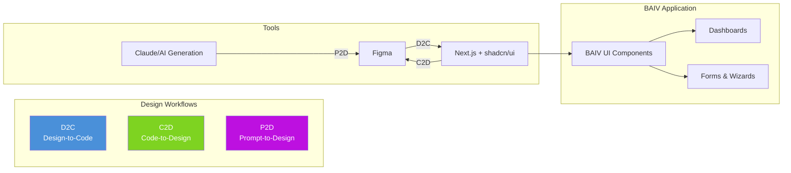
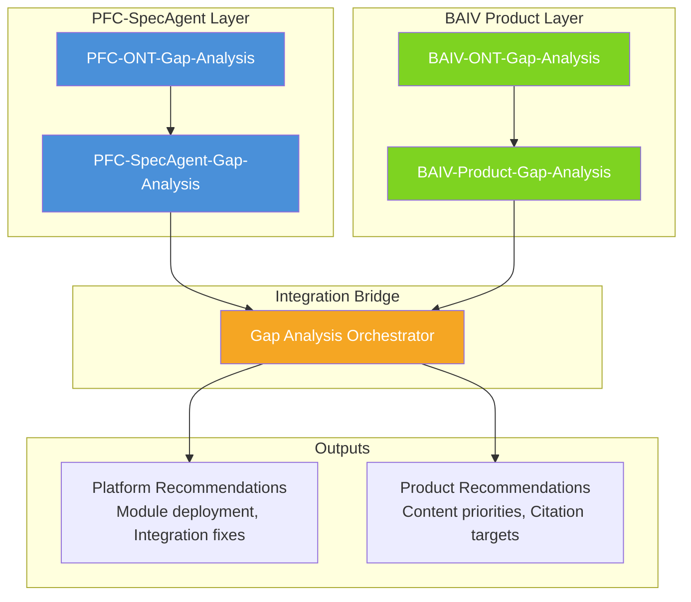
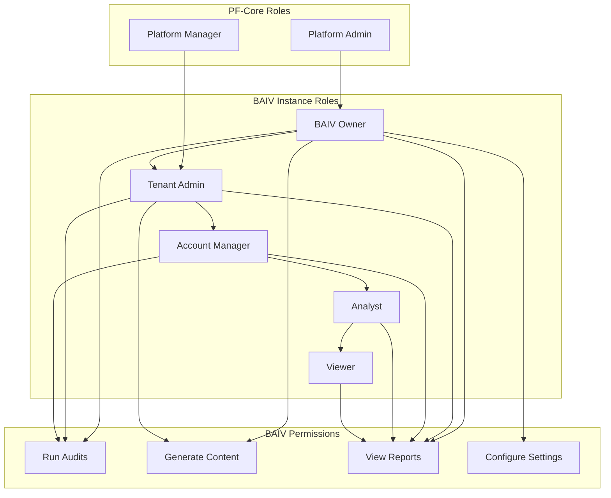
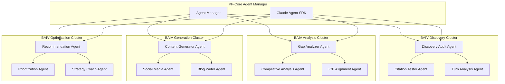
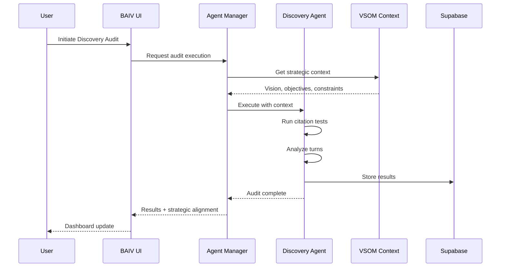
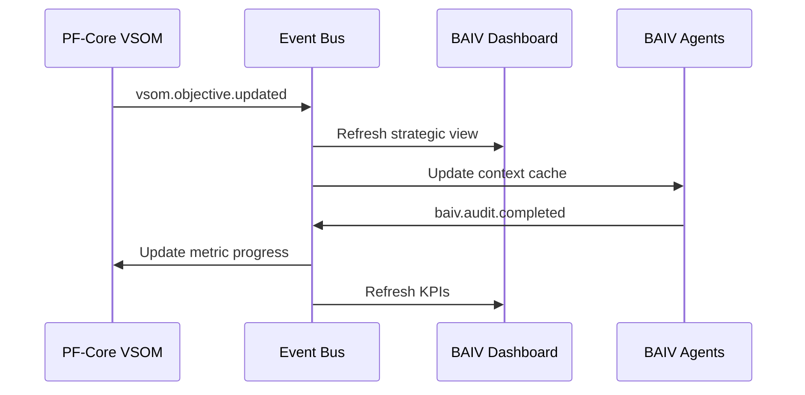

# BAIV PRD: PF-Core Integration v2.0

**Platform Foundation Core Integration for Be AI Visible**

| Attribute | Value |
|-----------|-------|
| **Document Version** | 2.0.0 |
| **Date** | December 2025 |
| **Author** | Platform Architecture Team |
| **Platform** | BAIV Agentic Platform - Platform Foundation Core |
| **PRD Type** | Integration Architecture & Module Mapping |
| **Base Document** | BAIV Instance PRD v1.7.2 |
| **Upstream Dependency** | PRD_PF_CORE_VSOM_Module_v1.0 |
| **Ontology Compliance** | Schema.org Grounded \| OAA Registry v3.0 |
| **Transferability Pattern** | W4M COO-GP Guardian SOP Reference |

---

## 1. Executive Summary

This document establishes the integration architecture connecting Platform Foundation Core (PF-Core) modules to the BAIV (Be AI Visible) product instance. The integration follows the Value Engineering cascade pattern established in the VSOM Module, ensuring strategic alignment flows from organizational vision through to product-specific AI Visibility operations.

### 1.1 Integration Purpose

The PF-Core to BAIV integration serves three critical functions:

1. **Value Cascade**: Propagate VSOM strategic context into BAIV-specific workflows, ensuring AI Visibility activities align with organizational objectives
2. **Module Reusability**: Enable PF-Core transferable modules (VSOM, OKR, Security, CRM) to instantiate within BAIV while maintaining platform independence
3. **Agent Context Sharing**: Provide BAIV's 16-agent architecture with strategic context for aligned decision-making

### 1.2 Reference Architecture Pattern

This integration follows the **W4M COO-GP Guardian SOP pattern**:

```
PF-Core (Platform Layer)
    └── Value Engineering Modules (VSOM, OKR, PMF)
        └── Instance Configuration Layer
            └── BAIV Instance (Product Layer)
                └── Domain-Specific Modules (AI Visibility, Citation, Gap Analysis)
                    └── Agent Orchestration Layer
```

---

## 2. PF-Core Module Inventory & BAIV Mapping

### 2.1 Platform Foundation Core Module Categories

Based on the comprehensive Figma reference documentation, PF-Core modules are organized into the following categories:

| Category | PF-Core Module | BAIV Instance Mapping | Integration Priority | Action to Do |
|----------|----------------|----------------------|---------------------|--------------|
| **Value Engineering** | VSOM (Vision, Strategy, Objectives, Metrics) | *No Direct Mapping - PFC Only* | P0 - Critical | Define Vision/Mission statements; Configure BSC perspectives |
| **Value Engineering** | OKR Module (CMO-OKR-ONTOLOGY v3.0.0) | Marketing OKRs & KPIs | P0 - Critical | Create CMO OKRs; Link to BAIV metrics |
| **Value Engineering** | PMF Module (Product-Market Fit) | PMF Surveys & Analysis | P1 - High | Configure PMF surveys; Set validation thresholds |
| **Value Engineering** | VE-RRR (Roles, RACI, RBAC) | BAIV RRR-VSOM | P0 - Critical | Define role hierarchy; Map RACI to workflows |
| **Value Engineering** | VE-Metrics/KPI Tree | BAIV KPI Dashboard & Ontology Mapping | P1 - High | Build KPI hierarchy; Map ontology to metrics |
| **Value Engineering** | VE-Value Proposition | BAIV Brand Value Props & Positioning | P1 - High | Define ICP; Document value propositions |
| **Value Engineering** | VE-UI/UC (User Interface/Use Case) | BAIV UI Patterns & Use Case Flows | P1 - High | Document UI patterns; Map user journeys |
| **Value Engineering** | VE-PF Instance Config Management | BAIV Instance Configuration | P0 - Critical | Configure tenant settings; Set feature flags |
| **Value Engineering** | VE-Business Models | BAIV Revenue & Pricing Models | P1 - High | Define pricing tiers; Configure usage limits |
| **Value Engineering** | VE-OAA Architect (Ontology Architect Agent) | BAIV Ontology Governance | P0 - Critical | Register BAIV ontologies; Set validation rules |
| **Security** | Authentication Module | BAIV User Authentication | P0 - Critical | Configure OAuth providers; Enable MFA |
| **Security** | RBAC Module | BAIV Role Permissions | P0 - Critical | Define permission sets; Map roles to features |
| **Security** | Session Management | BAIV User Sessions | P0 - Critical | Set session timeouts; Configure refresh tokens |
| **Security** | Audit & Logging Control | BAIV Audit Trail & Activity Logs | P0 - Critical | Enable audit logging; Set retention policies |
| **Design** | Design Dashboard | BAIV Strategic Dashboard | P0 - Critical | Create Figma layouts; Generate dashboard components |
| **Design** | Scorecard & Analytics | BAIV Performance Scorecards | P0 - Critical | Configure BSC views; Build analytics widgets |
| **Design** | Navigation Manager | BAIV Nav Hierarchy | P1 - High | Define nav structure; Set access controls |
| **Design** | Atomic Design System | BAIV UI Components | P1 - High | Build component library; Document patterns |
| **Design** | D2C (Design-to-Code) | BAIV Figma → Code Pipeline | P1 - High | Configure Figma Make; Set code generation rules |
| **Design** | C2D (Code-to-Design) | BAIV Code → Figma Sync | P2 - Medium | Enable reverse sync; Map component changes |
| **Design** | P2D (Prompt-to-Design) | BAIV AI Design Generation | P2 - Medium | Configure AI prompts; Set design constraints |
| **CRM** | Customer Organization Profile | BAIV Client Profiles | P1 - High | Define profile schema; Configure ICP fields |
| **CRM** | Partner Management | BAIV Agency/Affiliate | P2 - Medium | Set partner tiers; Configure revenue share |
| **Agent** | Agent Manager | *No BAIV Mapping - PFC Only* | P0 - Critical | Register agents; Configure orchestration rules |
| **Agent** | Claude Agent SDK | BAIV AI Agents | P0 - Critical | Implement 16 primary agents; Deploy sub-agents |
| **Agentic Builder** | Program Manager | *No BAIV Mapping - PFC Only* | P0 - Critical | Define program roadmap; Set milestone gates |
| **Agentic Builder** | Platform Manager | *No BAIV Mapping - PFC Only* | P0 - Critical | Configure infrastructure; Set scaling policies |
| **Agentic Builder** | Product Manager | *No BAIV Mapping - PFC Only* | P0 - Critical | Build product backlog; Prioritize features |
| **Agentic Builder** | Solution Architect | *No BAIV Mapping - PFC Only* | P0 - Critical | Create architecture docs; Define tech standards |
| **Agentic Builder** | Solution Builder (PRD-PBS-WBS) | *No BAIV Mapping - PFC Only* | P0 - Critical | Generate PRDs; Build PBS/WBS breakdowns |
| **Agentic Builder** | Test Driven Design (TDD) | *No BAIV Mapping - PFC Only* | P0 - Critical | Define test cases first; Validate with 80%+ coverage |

### 2.2 Value Engineering Module Details

#### VSOM (PFC-Only - No Direct BAIV Mapping)

VSOM operates at the Platform Foundation Core layer providing strategic context to all instances. It does not have a direct BAIV UI mapping but feeds downstream modules:

```
VSOM (PFC Layer)
├── Provides strategic context to Agent Manager
├── Feeds VE-RRR for role-based objective assignment
├── Cascades to OKR Module for execution tracking
└── Consumed by instances via Integration Bridges
    ├── BAIV → via BAIV RRR-VSOM
    ├── W4M → via W4M RRR-VSOM
    └── AIR → via AIR RRR-VSOM
```

#### VE-RRR (Roles, RACI, RBAC) → BAIV RRR-VSOM

The VE-RRR module establishes organizational role structures that cascade through platform instances. In BAIV, this manifests as **BAIV RRR-VSOM** - the instance-specific implementation:

| Component | PFC Definition | BAIV RRR-VSOM Application |
|-----------|----------------|---------------------------|
| **Roles** | C-Suite to IC role definitions | BAIV user role hierarchy |
| **RACI** | Responsibility assignment matrix | Audit/Content workflow ownership |
| **RBAC** | Role-based access control | Feature & data permissions |
| **VSOM Link** | Strategic objective ownership | Role-to-objective assignment |

```
VE-RRR → BAIV RRR-VSOM Cascade:
├── C-Suite Roles (CEO, CMO, CTO, COO, CFO, etc.)
│   └── BAIV RRR-VSOM: Strategic objective ownership, OKR accountability
├── VP/Director Roles
│   └── BAIV RRR-VSOM: Campaign management, team oversight
├── Manager Roles
│   └── BAIV RRR-VSOM: Audit execution, content approval
└── IC Roles (Analyst, Specialist)
    └── BAIV RRR-VSOM: Task execution, report viewing
```

#### VE-Metrics/KPI Tree

Hierarchical metrics framework with ontology mapping:

```
VE-Metrics/KPI Tree Structure:
├── Strategic KPIs (VSOM Layer 4)
│   ├── Financial: Revenue, MRR, LTV
│   ├── Customer: NPS, Retention, Citation Rate
│   ├── Process: Audit Velocity, Content Coverage
│   ├── Learning: Agent Accuracy, Model Updates
│   └── Stakeholder: Partner Revenue, Affiliate Conv.
│
├── Operational KPIs (OKR Key Results)
│   └── BAIV Ontology Mapping:
│       ├── BAIV-ONT-AI-Visibility → Citation metrics
│       ├── BAIV-ONT-Gap-Analysis → Gap closure %
│       └── BAIV-ONT-Content → Content velocity
│
└── Activity Metrics (Leading Indicators)
    └── Daily/Weekly tracking feeds
```

#### VE-Value Proposition

Value proposition framework for positioning and messaging:

| VP Component | PFC Definition | BAIV Instantiation |
|--------------|----------------|-------------------|
| **Target Customer** | ICP Profile Ontology | B2B SaaS, Marketing Leaders |
| **Problem Statement** | Gap Analysis Output | "Invisible to AI platforms" |
| **Solution** | Platform Capability | AI Visibility Optimization |
| **Unique Differentiator** | Competitive Analysis | Ontology-driven, Agent-powered |
| **Value Delivered** | KPI Improvement | Citation rate ↑, Lead quality ↑ |

#### VE-UI/UC (User Interface/Use Case)

Framework for defining user interface patterns and use case flows:

| Component | PFC Definition | BAIV Application |
|-----------|----------------|------------------|
| **UI Patterns** | Reusable interface patterns | Dashboard, Wizard, List, Detail views |
| **Use Case Flows** | End-to-end user journeys | Audit → Gap → Content → Publish |
| **Interaction Models** | User interaction paradigms | Click, Drag, Search, Filter |
| **State Management** | UI state handling | Form states, Navigation states |

```
VE-UI/UC Pattern Library:
├── Discovery Patterns
│   └── BAIV: Search, Filter, Drill-down, Compare
├── Data Entry Patterns
│   └── BAIV: Wizard, Form, Inline Edit, Bulk Import
├── Visualization Patterns
│   └── BAIV: Charts, Tables, Cards, Timelines
└── Action Patterns
    └── BAIV: Generate, Export, Share, Schedule
```

#### VE-PF Instance Config Management

Platform Foundation Instance Configuration for multi-tenant deployment:

| Config Layer | PFC Definition | BAIV Instance Settings |
|--------------|----------------|------------------------|
| **Tenant Config** | Organization-level settings | Company profile, branding |
| **Feature Flags** | Module enablement | Enabled BAIV features |
| **Integration Config** | Third-party connections | API keys, webhooks |
| **Limit Config** | Usage boundaries | Audit limits, content quotas |
| **Environment Config** | Deployment settings | Dev/Staging/Prod URLs |

```
VE-PF Instance Config Hierarchy:
├── Platform Defaults (PFC)
│   └── Base configuration for all instances
├── Instance Overrides (BAIV)
│   └── BAIV-specific feature settings
├── Tenant Customization
│   └── Per-customer configuration
└── User Preferences
    └── Individual user settings
```

#### VE-Business Models

Framework for defining revenue models, pricing strategies, and monetization:

| Component | PFC Definition | BAIV Application |
|-----------|----------------|------------------|
| **Revenue Models** | Subscription, Usage, Hybrid | SaaS tiers, Credit-based usage |
| **Pricing Tiers** | Feature-based tier definitions | Starter, Growth, Enterprise |
| **Monetization Rules** | Value-to-price mapping | Audit credits, Content limits |
| **Partner Economics** | Revenue share models | Agency margins, Affiliate commissions |

```
VE-Business Models Framework:
├── Direct Revenue
│   └── BAIV: Subscription MRR, Usage fees, Add-ons
├── Partner Revenue
│   └── BAIV: Agency white-label, Affiliate referrals
├── Pricing Strategy
│   ├── Value Metric: Audits per month
│   ├── Tier Structure: 3-tier + Enterprise
│   └── Usage Limits: Content pieces, API calls
└── Unit Economics
    └── BAIV: CAC, LTV, Payback period tracking
```

| BAIV Pricing Tier | Audits/Month | Content Pieces | Price Point |
|-------------------|--------------|----------------|-------------|
| **Starter** | 10 | 50 | $X/mo |
| **Growth** | 50 | 250 | $Y/mo |
| **Enterprise** | Unlimited | Unlimited | Custom |

#### VE-OAA Architect (Ontology Architect Agent)

Centralized ontology governance and registry management:

| Component | PFC Definition | BAIV Application |
|-----------|----------------|------------------|
| **Ontology Registry** | Central catalog of all ontologies | BAIV-ONT registry entries |
| **Version Control** | Semantic versioning (Major.Minor.Patch) | Ontology version tracking |
| **Validation Rules** | Schema.org compliance checks | BAIV ontology validation |
| **Evolution Management** | Breaking change detection | Migration path planning |

```
VE-OAA Architect Registry Structure:
├── Platform Ontologies (PFC-ONT)
│   ├── PFC-ONT-VSOM
│   ├── PFC-ONT-RRR
│   ├── PFC-ONT-Gap-Analysis
│   └── PFC-ONT-Business-Models
│
├── Instance Ontologies (BAIV-ONT)
│   ├── BAIV-ONT-AI-Visibility (01)
│   ├── BAIV-ONT-Universal-Brand (02)
│   ├── BAIV-ONT-Customer-Organization (03)
│   ├── BAIV-ONT-Gap-Analysis (04)
│   └── BAIV-ONT-CMO-OKR (05)
│
└── Agent Ontologies (SpecialAgents-ONTs)
    ├── Discovery Agent Ontology
    ├── Gap Analyzer Ontology
    └── Content Generator Ontology
```

| OAA Governance Function | Description | BAIV Impact |
|------------------------|-------------|-------------|
| **Registration** | New ontology onboarding | BAIV ontology catalog |
| **Validation** | Schema.org compliance | Quality assurance |
| **Versioning** | SemVer management | Change tracking |
| **Deprecation** | Sunset planning | Migration support |
| **Discovery** | Ontology search & browse | Agent context loading |

### 2.3 Security Module Details

#### Authentication Module

Centralized authentication for platform access:

| Component | PFC Definition | BAIV Application |
|-----------|----------------|------------------|
| **Identity Provider** | OAuth2/OIDC integration | Google, Microsoft, SAML SSO |
| **MFA** | Multi-factor authentication | TOTP, SMS, Email verification |
| **API Authentication** | Service-to-service auth | JWT tokens, API keys |
| **Session Tokens** | User session management | Access/Refresh token pairs |

```
Authentication Flow:
├── User Authentication
│   └── BAIV: Login → MFA → Session → Dashboard
├── Service Authentication
│   └── BAIV: Agent → Token → API → Response
└── Webhook Authentication
    └── BAIV: External → Signature → Validation → Process
```

#### Audit & Logging Control

Comprehensive audit trail and activity logging:

| Component | PFC Definition | BAIV Application |
|-----------|----------------|------------------|
| **Activity Logs** | User action tracking | Audit runs, content changes |
| **Security Logs** | Auth/access events | Login attempts, permission changes |
| **Agent Logs** | AI execution tracking | Agent runs, decisions, errors |
| **Compliance Logs** | Regulatory audit trail | Data access, exports, deletions |

```
Audit & Logging Hierarchy:
├── Security Events (P0)
│   └── BAIV: Auth failures, permission violations
├── User Activity (P1)
│   └── BAIV: Audits run, content generated, exports
├── Agent Activity (P1)
│   └── BAIV: Agent executions, decisions, handoffs
├── System Events (P2)
│   └── BAIV: API calls, integrations, errors
└── Compliance Trail (P0)
    └── BAIV: GDPR requests, data retention, deletions
```

### 2.4 Design Module Details (Design Dashboard, Scorecard & Analytics, D2C, C2D, P2D)

#### Design Dashboard → BAIV Strategic Dashboard

The Design Dashboard is a PFC module that provides the visual framework for strategic information display. In BAIV, this maps to the **BAIV Strategic Dashboard**:

| PFC Design Dashboard Component | BAIV Strategic Dashboard Implementation |
|-------------------------------|----------------------------------------|
| **Vision Display Widget** | BAIV Brand Mission & Vision Panel |
| **BSC Perspective Cards** | BAIV 5-Perspective Performance Cards |
| **KPI Trend Visualizations** | BAIV Citation Rate, Gap %, Coverage Charts |
| **OKR Progress Tracking** | BAIV Marketing OKR Progress Bars |
| **Health Status Indicators** | BAIV At-Risk Objective Alerts |
| **Strategic Alignment View** | BAIV Module-to-Objective Mapping |

```
Design Dashboard (PFC) → BAIV Strategic Dashboard
├── Layout Templates
│   └── BAIV: Executive overview, Manager detail, Analyst drill-down
├── Widget Library
│   └── BAIV: Citation widgets, Gap widgets, Content velocity
├── Theme System
│   └── BAIV: Brand-aligned color schemes
└── Responsive Breakpoints
    └── BAIV: Desktop, Tablet, Mobile views
```

#### Scorecard & Analytics → BAIV Performance Scorecards

The Scorecard & Analytics module provides structured performance measurement and analytical capabilities:

| Component | PFC Definition | BAIV Application |
|-----------|----------------|------------------|
| **Balanced Scorecard** | 5-perspective strategic view | BAIV BSC Dashboard |
| **KPI Scorecards** | Metric tracking & thresholds | Citation, Gap, Content KPIs |
| **Trend Analytics** | Time-series analysis | Performance over time |
| **Comparative Analytics** | Benchmark comparisons | Competitor citation analysis |
| **Predictive Analytics** | Forecasting models | Gap closure predictions |

```
Scorecard & Analytics Framework:
├── Strategic Scorecards
│   ├── Financial Scorecard
│   │   └── BAIV: MRR, LTV, Revenue per customer
│   ├── Customer Scorecard
│   │   └── BAIV: NPS, Retention, Citation satisfaction
│   ├── Process Scorecard
│   │   └── BAIV: Audit velocity, Content throughput
│   ├── Learning Scorecard
│   │   └── BAIV: Agent accuracy, Model improvements
│   └── Stakeholder Scorecard
│       └── BAIV: Partner revenue, Affiliate conversions
│
├── Operational Scorecards
│   ├── Discovery Scorecard
│   │   └── BAIV: Queries tested, Citations found, Turn coverage
│   ├── Gap Scorecard
│   │   └── BAIV: Gaps identified, Gaps closed, Priority distribution
│   └── Content Scorecard
│       └── BAIV: Content generated, Published, Performance
│
└── Analytics Capabilities
    ├── Descriptive: What happened?
    ├── Diagnostic: Why did it happen?
    ├── Predictive: What will happen?
    └── Prescriptive: What should we do?
```

| BAIV Scorecard Type | Key Metrics | Refresh Rate |
|--------------------|-------------|--------------|
| **Executive Summary** | Top 10 KPIs, Health status | Daily |
| **Discovery Performance** | Citation rate, Query coverage | Per audit |
| **Gap Analysis** | Gap count, Priority mix, Closure rate | Weekly |
| **Content Velocity** | Generation rate, Publish rate | Daily |
| **ROI Dashboard** | Revenue impact, Cost savings | Monthly |

#### D2C, C2D, P2D Workflows

The Design layer implements bidirectional design-development workflows:



| Workflow | Direction | Purpose | BAIV Use Case |
|----------|-----------|---------|---------------|
| **D2C** | Figma → Code | Design-first development | UI component generation |
| **C2D** | Code → Figma | Code-first design sync | Component library documentation |
| **P2D** | Prompt → Design | AI-generated design | Rapid prototyping, variations |

### 2.5 Agent Manager (PFC-Only)

The Agent Manager operates exclusively at the PFC layer with no direct BAIV mapping. It provides orchestration services consumed by all instances:

```
Agent Manager (PFC Layer)
├── Agent Registry
│   └── Defines available agents across all instances
├── Orchestration Engine
│   └── Manages agent execution, handoffs, context
├── Context Injection Service
│   └── Provides VSOM/strategic context to agents
├── Monitoring & Logging
│   └── Tracks agent performance, errors, costs
│
└── Instance Consumption:
    ├── BAIV → Uses 16 primary + 12 sub-agents
    ├── W4M → Uses VE-focused agent subset
    └── AIR → Uses strategy-focused agent subset
```

**Why No BAIV Mapping?**

The Agent Manager is infrastructure, not a product feature. BAIV consumes Agent Manager services but doesn't expose or extend them. This maintains:
- Clean separation of platform vs. product
- Consistent agent behavior across instances
- Centralized agent governance and updates

### 2.6 Agentic Builder (PFC-Only)

The Agentic Builder category provides AI-powered development and management agents that operate at the platform level. These agents have no direct BAIV mapping as they serve the platform build process itself, not end-user product features.

#### Program Manager Agent

Orchestrates multi-project programs and strategic initiatives:

| Component | PFC Definition | Function |
|-----------|----------------|----------|
| **Program Roadmap** | Multi-project timeline management | Coordinates BAIV, W4M, AIR timelines |
| **Dependency Tracking** | Cross-project dependency resolution | Identifies blocking items |
| **Resource Allocation** | Team and budget distribution | Balances across initiatives |
| **Risk Management** | Program-level risk identification | Escalation and mitigation |
| **Stakeholder Reporting** | Executive-level status updates | Portfolio health dashboards |

```
Program Manager Agent Responsibilities:
├── Strategic Alignment
│   └── Ensures all projects support VSOM objectives
├── Portfolio Coordination
│   ├── BAIV Program → AI Visibility delivery
│   ├── W4M Program → Value Engineering tools
│   └── AIR Program → Strategy consulting platform
├── Milestone Management
│   └── Cross-program dependencies and gates
└── Investment Tracking
    └── Budget vs. actuals across programs
```

#### Platform Manager Agent

Manages platform-wide infrastructure and shared services:

| Component | PFC Definition | Function |
|-----------|----------------|----------|
| **Infrastructure Orchestration** | Cloud resource management | Supabase, DO App Platform |
| **Shared Services** | Cross-instance service management | Auth, Audit, Agent Manager |
| **Platform Health** | System monitoring and alerting | Uptime, performance, errors |
| **Upgrade Coordination** | Platform version management | Rolling updates, migrations |
| **Capacity Planning** | Resource forecasting | Scale projections |

```
Platform Manager Agent Responsibilities:
├── Infrastructure Layer
│   ├── Database Management (Supabase)
│   ├── Hosting (Digital Ocean)
│   └── CDN & Edge Services
├── Shared Services Layer
│   ├── Authentication Service
│   ├── Ontology Registry Service
│   └── Agent Orchestration Service
├── Monitoring & Observability
│   └── Platform-wide health metrics
└── Release Management
    └── Platform version deployments
```

#### Product Manager Agent

Manages product lifecycle and feature development:

| Component | PFC Definition | Function |
|-----------|----------------|----------|
| **Product Backlog** | Feature and story management | Prioritized delivery queue |
| **User Story Generation** | Requirements articulation | Acceptance criteria |
| **Sprint Planning** | Iteration scope definition | Capacity-based planning |
| **Stakeholder Management** | Feedback collection and synthesis | Voice of customer |
| **Release Planning** | Feature bundling and scheduling | Go-to-market coordination |

```
Product Manager Agent Responsibilities:
├── Discovery & Validation
│   ├── User research synthesis
│   ├── Competitive analysis
│   └── Opportunity scoring
├── Definition & Planning
│   ├── User story creation
│   ├── Acceptance criteria
│   └── Sprint scope
├── Delivery Coordination
│   ├── Dev team liaison
│   ├── Blocker resolution
│   └── Scope negotiation
└── Launch & Iterate
    ├── Release notes
    ├── Feature adoption tracking
    └── Feedback loops
```

#### Solution Architect Agent

Designs technical solutions and system architecture:

| Component | PFC Definition | Function |
|-----------|----------------|----------|
| **Architecture Design** | System structure definition | Component relationships |
| **Technology Selection** | Stack decisions | Framework and tool choices |
| **Integration Patterns** | API and data flow design | Service interfaces |
| **Non-Functional Requirements** | Quality attribute specifications | Performance, security, scale |
| **Technical Documentation** | Architecture decision records | ADRs, diagrams, specs |

```
Solution Architect Agent Responsibilities:
├── Architecture Definition
│   ├── System context diagrams
│   ├── Container diagrams
│   ├── Component diagrams
│   └── Code/deployment views
├── Technology Governance
│   ├── Stack standards
│   ├── Pattern library
│   └── Anti-pattern detection
├── Integration Design
│   ├── API contracts
│   ├── Event schemas
│   └── Data flow mapping
└── Quality Assurance
    ├── Architecture reviews
    ├── Technical debt tracking
    └── Performance modeling
```

#### Solution Builder Agent (PRD-PBS-WBS)

Executes structured solution delivery using PRD → PBS → WBS methodology:

| Component | PFC Definition | Function |
|-----------|----------------|----------|
| **PRD (Product Requirements Document)** | Requirements specification | What to build |
| **PBS (Product Breakdown Structure)** | Deliverable decomposition | Components and modules |
| **WBS (Work Breakdown Structure)** | Task decomposition | How to build it |
| **Estimation** | Effort and duration calculation | Story points, hours |
| **Dependency Mapping** | Task sequence definition | Critical path |

```
Solution Builder Agent PRD-PBS-WBS Flow:
├── PRD Phase (Requirements)
│   ├── Business objectives
│   ├── User stories
│   ├── Acceptance criteria
│   └── Success metrics
│
├── PBS Phase (Product Breakdown)
│   ├── Module decomposition
│   ├── Component identification
│   ├── Interface definitions
│   └── Deliverable mapping
│
├── WBS Phase (Work Breakdown)
│   ├── Task decomposition
│   ├── Effort estimation
│   ├── Dependency sequencing
│   └── Resource assignment
│
└── Progress Tracking and Traceability Matrix
    ├── Progress monitoring
    ├── Variance analysis
    ├── Requirements traceability
    ├── Test coverage mapping
    └── Completion verification
```

| Artifact | Input | Output | Agent Action |
|----------|-------|--------|--------------|
| **PRD** | VSOM objectives, User needs | Requirements doc | Generate & validate |
| **PBS** | PRD requirements | Component tree | Decompose & structure |
| **WBS** | PBS components | Task list | Break down & estimate |
| **Schedule** | WBS tasks | Timeline | Sequence & resource |
| **Traceability** | All artifacts | Matrix | Link & verify |

#### Test Driven Design (TDD) Agent

Ensures quality through test-first development methodology:

| Component | PFC Definition | Function |
|-----------|----------------|----------|
| **Test Case Generation** | Requirements-to-test mapping | Create tests before code |
| **Coverage Analysis** | Code coverage measurement | Validate 80%+ coverage |
| **Regression Suite** | Automated test maintenance | Prevent regressions |
| **Acceptance Criteria** | User story validation | BDD/Gherkin specifications |
| **Quality Gates** | Pass/fail thresholds | Deployment controls |

```
Test Driven Design Agent Workflow:
├── Test First (Red Phase)
│   ├── Analyze requirements/user stories
│   ├── Generate test cases
│   ├── Define acceptance criteria
│   └── Create failing tests
│
├── Implementation (Green Phase)
│   ├── Write minimal code to pass
│   ├── Run test suite
│   ├── Validate coverage metrics
│   └── Document test results
│
├── Refactor (Blue Phase)
│   ├── Improve code quality
│   ├── Maintain test coverage
│   ├── Optimize performance
│   └── Update documentation
│
└── Traceability & Quality Gates
    ├── Requirement → Test mapping
    ├── Test → Code mapping
    ├── Coverage threshold validation (80%+)
    └── Deployment gate approval
```

| Test Type | Scope | Coverage Target | Agent Action |
|-----------|-------|-----------------|--------------|
| **Unit Tests** | Functions/Methods | 90%+ | Auto-generate from code |
| **Integration Tests** | Component interfaces | 80%+ | Generate from API specs |
| **E2E Tests** | User journeys | Critical paths | Generate from use cases |
| **Performance Tests** | Load/stress | Key endpoints | Generate from NFRs |
| **Security Tests** | Vulnerability | OWASP Top 10 | Generate from threat model |

**TDD Quality Metrics:**
- Code Coverage: Minimum 80%, Target 90%
- Test Pass Rate: 100% required for deployment
- Mutation Score: Minimum 70% (test effectiveness)
- Flaky Test Rate: Maximum 1%

**Why No BAIV Mapping for Agentic Builder?**

These agents are meta-level builders - they construct the platform and products, not features within them:
- They operate during development, not runtime
- They produce artifacts (PRDs, architecture, plans), not user-facing features
- They serve developers and PMs, not end customers
- BAIV (and W4M, AIR) are outputs of these agents, not consumers of them

### 2.7 Module Dependency Graph

```mermaid
graph TB
    subgraph "PF-Core Layer"
        VSOM[VSOM Module<br/>PFC Only]
        OKR[OKR Module]
        PMF[PMF Module]
        RRR[VE-RRR<br/>Roles/RACI/RBAC]
        KPI[VE-Metrics/KPI Tree]
        VP[VE-Value Proposition]
        UIUC[VE-UI/UC]
        ICM[VE-Instance Config]
        BM[VE-Business Models]
        OAA[VE-OAA Architect]
        AUTH[Authentication]
        SEC[Security Manager]
        AUDIT[Audit & Logging]
        NAV[Navigation Manager]
        DDASH[Design Dashboard]
        SCORE[Scorecard & Analytics]
        D2C[Design D2C/C2D/P2D]
        AGT[Agent Manager<br/>PFC Only]
    end

    subgraph "Agentic Builder Layer - PFC Only"
        PRGM[Program Manager]
        PLTM[Platform Manager]
        PRDM[Product Manager]
        SOLA[Solution Architect]
        SOLB[Solution Builder<br/>PRD-PBS-WBS]
        TDD[Test Driven Design]
    end

    subgraph "Integration Layer"
        VE[Value Engineering Bridge]
        CTX[Context Engineering Bridge]
        SEC_BR[Security Bridge]
        DSN[Design Bridge]
        ORQ[Agent Orchestration Bridge]
    end

    subgraph "BAIV Instance Layer"
        DASH[BAIV Strategic Dashboard]
        BSCORE[BAIV Performance Scorecards]
        BRRR[BAIV RRR-VSOM]
        BCFG[BAIV Instance Config]
        BBM[BAIV Revenue Models]
        BAUTH[BAIV Authentication]
        BAUDIT[BAIV Audit Trail]
        DISC[Discovery & Citation]
        GAP[Gap Analysis]
        CONT[Content Generation]
        LEAD[Lead Generation]
        PMK[Marketing Automation]
        UI[BAIV UI Components]
    end

    VSOM --> VE
    VSOM -.->|context| RRR
    OKR --> VE
    PMF --> VE
    RRR --> VE
    KPI --> VE
    VP --> VE
    UIUC --> VE
    ICM --> VE
    BM --> VE
    OAA --> VE
    VE --> BRRR
    VE --> GAP
    VE --> BCFG
    VE --> BBM

    AUTH --> SEC_BR
    SEC --> SEC_BR
    AUDIT --> SEC_BR
    SEC_BR --> BAUTH
    SEC_BR --> BAUDIT
    
    NAV --> CTX
    CTX --> DISC
    CTX --> CONT

    DDASH --> DSN
    SCORE --> DSN
    D2C --> DSN
    DSN --> DASH
    DSN --> BSCORE
    DSN --> UI
    UI --> DISC
    UI --> CONT

    AGT --> ORQ
    OAA -.->|ontology context| ORQ
    ORQ --> DISC
    ORQ --> GAP
    ORQ --> CONT
    ORQ --> LEAD
    ORQ --> PMK

    %% Agentic Builder internal relationships
    VSOM -.->|objectives| PRGM
    PRGM --> PLTM
    PRGM --> PRDM
    PRDM --> SOLA
    SOLA --> SOLB
    SOLB --> TDD
    TDD -.->|quality gates| SOLB
    SOLB -.->|artifacts| VE
    
    %% Agent Manager orchestrates Agentic Builder
    AGT -.->|orchestrates| PRGM
    AGT -.->|orchestrates| PLTM
    AGT -.->|orchestrates| PRDM
    AGT -.->|orchestrates| SOLA
    AGT -.->|orchestrates| SOLB
    AGT -.->|orchestrates| TDD

    style VSOM fill:#f5e1ff
    style AGT fill:#f5e1ff
    style PRGM fill:#f5e1ff
    style PLTM fill:#f5e1ff
    style PRDM fill:#f5e1ff
    style SOLA fill:#f5e1ff
    style SOLB fill:#f5e1ff
    style TDD fill:#f5e1ff
    style OKR fill:#e1f5ff
    style RRR fill:#e1f5ff
    style KPI fill:#e1f5ff
    style VP fill:#e1f5ff
    style UIUC fill:#e1f5ff
    style ICM fill:#e1f5ff
    style BM fill:#e1f5ff
    style OAA fill:#e1f5ff
    style AUTH fill:#ffe1e1
    style SEC fill:#ffe1e1
    style AUDIT fill:#ffe1e1
    style DDASH fill:#e1f5ff
    style SCORE fill:#e1f5ff
    style VE fill:#fff4e1
    style SEC_BR fill:#fff4e1
    style DSN fill:#fff4e1
    style ORQ fill:#fff4e1
    style DASH fill:#e1ffe1
    style BSCORE fill:#e1ffe1
    style BRRR fill:#e1ffe1
    style BCFG fill:#e1ffe1
    style BBM fill:#e1ffe1
    style BAUTH fill:#e1ffe1
    style BAUDIT fill:#e1ffe1
    style DISC fill:#e1ffe1
```



**Legend:**
- Purple (VSOM, Agent Manager, Agentic Builder): PFC-Only modules with no direct BAIV mapping
- Blue: Value Engineering & Design PFC modules
- Red: Security PFC modules
- Orange: Integration bridges
- Green: BAIV Instance modules

---

## 3. PF-Core Ontology & Special Agents (SpecialAgents-ONTs)

### 3.1 Ontology Architecture Overview

PF-Core maintains a distinct ontology layer for Special Agents that operates independently from product instance ontologies. This separation enables reusable, transferable agent capabilities while allowing product-specific extensions.

```
PF-Core Ontology Layer (SpecialAgents-ONTs)
├── PFC-ONT-Gap-Analysis          ← Platform-level gap identification
├── PFC-ONT-Security-Manager      ← Cross-platform security patterns
├── PFC-ONT-Value-Engineering     ← VSOM/OKR/PMF frameworks
├── PFC-ONT-Context-Engineering   ← Agent context injection
└── PFC-ONT-OAA                   ← Ontology Architect Agent registry

PF-Instance Ontology Layer (Product-Specific)
├── BAIV-ONT-Gap-Analysis         ← AI Visibility content gaps
├── BAIV-ONT-Citation-Discovery   ← AI platform citation patterns
├── BAIV-ONT-AI-Visibility        ← Visibility scoring & optimization
└── W4M-ONT-Gap-Analysis          ← Value Engineering process gaps
```

### 3.2 Gap Analysis: Two Distinct Forms

**CRITICAL DISTINCTION:** The platform maintains two separate Gap Analysis capabilities that serve different purposes:

| Attribute | PFC-SpecAgent-Gap-Analysis | PF-Instance-BAIV-Product-Gap-Analysis |
|-----------|---------------------------|---------------------------------------|
| **Ontology** | PFC-ONT-Gap-Analysis | BAIV-ONT-Gap-Analysis |
| **Scope** | Platform-wide process & capability gaps | AI Visibility content & citation gaps |
| **Focus** | Strategic alignment, module coverage, integration gaps | Content topics, keyword coverage, competitor citations |
| **Consumers** | All PF Instances (BAIV, W4M, AIR) | BAIV Instance only |
| **Output** | Platform improvement recommendations | Content generation priorities |
| **BSC Perspective** | Internal Process, Learning & Growth | Customer, Financial |

#### 3.2.1 PFC-SpecAgent-Gap-Analysis (Platform Level)

```json
{
  "@context": {
    "@vocab": "https://schema.org/",
    "pfc": "https://pf-core.platform/ontology/"
  },
  "@type": "pfc:PlatformGapAnalysis",
  "@id": "pfc:gap-analysis-spec-agent",
  "agentType": "PFC-SpecialAgent",
  "gapCategories": [
    {
      "category": "module_coverage",
      "description": "Missing or incomplete PF-Core modules",
      "examples": ["VSOM not deployed", "Security RBAC incomplete"]
    },
    {
      "category": "integration_gaps",
      "description": "Disconnected module interfaces",
      "examples": ["OKR not linked to VSOM", "Agent context missing"]
    },
    {
      "category": "capability_gaps",
      "description": "Missing platform capabilities",
      "examples": ["No audit trail", "Missing event bus"]
    },
    {
      "category": "transferability_gaps",
      "description": "Barriers to instance deployment",
      "examples": ["Hardcoded config", "Missing abstraction layer"]
    }
  ],
  "transferability": ["BAIV", "W4M", "AIR", "ClientDeployments"]
}
```

#### 3.2.2 BAIV-ONT-Gap-Analysis (Product Level)

```json
{
  "@context": {
    "@vocab": "https://schema.org/",
    "baiv": "https://baiv.co.uk/ontology/"
  },
  "@type": "baiv:AIVisibilityGapAnalysis",
  "@id": "baiv:gap-analysis-product",
  "productInstance": "BAIV",
  "gapCategories": [
    {
      "category": "topic_missing",
      "description": "Content topics not covered",
      "examples": ["No AI implementation guide", "Missing FAQ page"]
    },
    {
      "category": "keyword_gap",
      "description": "Target keywords without content",
      "examples": ["'AI visibility' not optimized", "Competitor ranking higher"]
    },
    {
      "category": "citation_gap",
      "description": "AI platforms not citing client",
      "examples": ["ChatGPT cites competitor", "Claude no mention"]
    },
    {
      "category": "format_gap",
      "description": "Missing content formats",
      "examples": ["No schema markup", "Missing structured FAQ"]
    }
  ],
  "transferability": "BAIV-only"
}
```

### 3.3 Gap Analysis Integration Pattern



### 3.4 PFC Special Agents Registry

| Special Agent | Ontology | Purpose | Transferable |
|---------------|----------|---------|--------------|
| **PFC-SpecAgent-Gap-Analysis** | PFC-ONT-Gap-Analysis | Platform capability & integration gap identification | Yes - All Instances |
| **PFC-SpecAgent-Security** | PFC-ONT-Security-Manager | Cross-platform security pattern enforcement | Yes - All Instances |
| **PFC-SpecAgent-VE** | PFC-ONT-Value-Engineering | VSOM/OKR strategic alignment validation | Yes - All Instances |
| **PFC-SpecAgent-Context** | PFC-ONT-Context-Engineering | Agent context injection & enrichment | Yes - All Instances |
| **PFC-SpecAgent-OAA** | PFC-ONT-OAA | Ontology governance & registry management | Yes - All Instances |
| **PFC-SpecAgent-Designer** | PFC-ONT-Design-System | Atomic design system & Figma integration | Yes - All Instances |

### 3.5 BAIV Product Agents (Instance-Specific)

| Product Agent | Ontology | Purpose | Transferable |
|---------------|----------|---------|--------------|
| **BAIV-Agent-Gap-Analysis** | BAIV-ONT-Gap-Analysis | AI Visibility content gap identification | BAIV Only |
| **BAIV-Agent-Citation** | BAIV-ONT-Citation-Discovery | AI platform citation testing | BAIV Only |
| **BAIV-Agent-Discovery** | BAIV-ONT-AI-Visibility | Visibility audit orchestration | BAIV Only |
| **BAIV-Agent-Content** | BAIV-ONT-Content-Generation | AI-optimized content creation | BAIV Only |

---

## 4. Value Engineering Integration Architecture

### 3.1 Four-Layer Cascade from PF-Core to BAIV

The VSOM four-layer framework cascades into BAIV-specific implementation:

| VSOM Layer | PF-Core Component | BAIV Instantiation | Example |
|------------|-------------------|-------------------|---------|
| **Layer 1: Vision & Mission** | Vision Statement, Core Values | BAIV Brand Mission | "Establish AI Visibility Leadership" |
| **Layer 2: Strategic Objectives** | BSC Perspectives (5) | BAIV Strategic Themes | Customer: "Improve Client AI Citations by 40%" |
| **Layer 3: Operational Strategy & OKRs** | CMO-OKR-ONTOLOGY | BAIV Marketing OKRs | O: "Dominate AI Platform Citations" KR: "Achieve 75% citation rate" |
| **Layer 4: Metrics & KPIs** | Leading/Lagging Indicators | BAIV Performance Dashboard | Citation Rate, Gap Closure %, Content Coverage |

### 3.2 BAIV-Specific Strategic Alignment

#### BSC Perspective Mapping to BAIV Modules

```mermaid
graph LR
    subgraph "Balanced Scorecard Perspectives"
        FIN[Financial]
        CUS[Customer]
        INT[Internal Process]
        LNG[Learning & Growth]
        STK[Stakeholder]
    end

    subgraph "BAIV Module Alignment"
        REV[Revenue Metrics<br/>MRR, Subscription Tiers]
        SAT[Client Success<br/>Citation Improvement, NPS]
        OPS[Platform Operations<br/>Audit Efficiency, Content Velocity]
        CAP[Team Capabilities<br/>Agent Performance, Model Updates]
        PRT[Partner Network<br/>Agency Performance, Affiliates]
    end

    FIN --> REV
    CUS --> SAT
    INT --> OPS
    LNG --> CAP
    STK --> PRT
```



### 3.3 OKR Integration with CMO-OKR-ONTOLOGY v3.0.0

BAIV leverages the CMO-OKR-ONTOLOGY for marketing-specific objective tracking:

```json
{
  "@context": {
    "@vocab": "https://schema.org/",
    "baiv": "https://baiv.co.uk/ontology/"
  },
  "@type": "baiv:BAIVObjective",
  "alignedStrategicObjective": "baiv:strategic-objective-citation-leadership",
  "objective": {
    "name": "Establish AI Platform Citation Dominance",
    "category": "awareness",
    "roleLevel": "CMO",
    "quarter": "Q1-2026"
  },
  "keyResults": [
    {
      "name": "Achieve 75% client citation rate improvement",
      "target": 75,
      "unit": "percentage",
      "measurementType": "lagging"
    },
    {
      "name": "Close 50 content gaps per client per month",
      "target": 50,
      "unit": "count",
      "measurementType": "leading"
    },
    {
      "name": "Onboard 100 paying customers",
      "target": 100,
      "unit": "count",
      "measurementType": "lagging"
    }
  ]
}
```

---

## 5. PF-Core Module Integration Specifications

### 5.1 VSOM Module Integration

**Source:** PRD_PF_CORE_VSOM_Module_v1.0

**Integration Points:**

| VSOM Component | BAIV Integration | Data Flow |
|----------------|------------------|-----------|
| Vision Statement | BAIV Brand Context | Read-only propagation |
| Strategic Objectives | BAIV Strategic Dashboard | Bidirectional alignment |
| Operational Strategies | BAIV Campaign Planning | Write-back capability |
| Metrics Dashboard | BAIV Analytics Integration | Real-time sync |

**Database Schema Extension:**

```sql
-- BAIV Instance Extension to VSOM
CREATE TABLE IF NOT EXISTS baiv_vsom_alignment (
    id UUID PRIMARY KEY DEFAULT gen_random_uuid(),
    tenant_id UUID NOT NULL REFERENCES tenants(id) ON DELETE CASCADE,
    
    -- VSOM Reference
    vsom_objective_id UUID NOT NULL,
    vsom_strategy_id UUID,
    
    -- BAIV-Specific Mapping
    baiv_module TEXT NOT NULL CHECK (baiv_module IN (
        'discovery_audit', 'citation_tracking', 'gap_analysis',
        'content_generation', 'lead_generation', 'pmf_analysis'
    )),
    
    -- Alignment Configuration
    alignment_type TEXT NOT NULL CHECK (alignment_type IN (
        'direct_contribution', 'indirect_support', 'enabling'
    )),
    contribution_weight DECIMAL(3,2) DEFAULT 1.0,
    
    -- Status Tracking
    alignment_status TEXT DEFAULT 'active',
    last_validated_at TIMESTAMP,
    
    -- Metadata
    created_at TIMESTAMP DEFAULT NOW(),
    updated_at TIMESTAMP DEFAULT NOW()
);

-- Index for tenant lookups
CREATE INDEX idx_baiv_vsom_alignment_tenant 
    ON baiv_vsom_alignment(tenant_id);

-- Index for module filtering
CREATE INDEX idx_baiv_vsom_alignment_module 
    ON baiv_vsom_alignment(baiv_module);
```

### 5.2 Security Module Integration

**Source:** PF-Security Manager PRD, RBAC_AND_REQUIREMENTS_GUIDE.md

**BAIV Role Hierarchy:**



### 5.3 Agent Manager Integration

**Source:** AGENT_MANAGER_PRD.md, ORCHESTRATED_AGENT_LAYER_PRD.md

**BAIV Agent Architecture (16 Primary + 12 Sub-Agents):**



**Agent Context Injection from VSOM:**

```python
# Agent Context Provider - VSOM Integration
class VSOMAgentContextProvider:
    """
    Provides VSOM strategic context to BAIV agents
    Enables strategy-aligned autonomous decision-making
    """
    
    def __init__(self, tenant_id: str):
        self.tenant_id = tenant_id
    
    async def get_strategic_context(self) -> dict:
        """
        Retrieve VSOM context for agent reasoning
        """
        return {
            "vision": await self._get_vision_mission(),
            "strategic_objectives": await self._get_aligned_objectives(),
            "current_okrs": await self._get_active_okrs(),
            "health_status": await self._get_metric_health(),
            "constraints": await self._get_strategic_constraints()
        }
    
    async def validate_action_alignment(
        self, 
        proposed_action: dict,
        agent_id: str
    ) -> dict:
        """
        Validate proposed agent action against strategic objectives
        Returns alignment score and recommendations
        """
        context = await self.get_strategic_context()
        
        return {
            "alignment_score": self._calculate_alignment(
                proposed_action, context
            ),
            "supporting_objectives": self._find_supporting_objectives(
                proposed_action, context
            ),
            "strategic_recommendations": self._generate_recommendations(
                proposed_action, context
            )
        }
```

---

## 6. BAIV Instance Module Specifications

### 6.1 BAIV Module Architecture

The BAIV Instance implements domain-specific modules that consume PF-Core services:

| BAIV Module | Table Count | PF-Core Dependencies | Primary Function |
|-------------|-------------|---------------------|------------------|
| **Discovery & Citation** | 11 | Agent Manager, Security | AI platform citation audits |
| **Gap Analysis** | 4 | VSOM, OKR Module | Content gap identification |
| **ICP & Profiles** | 3 | Customer Org Ontology | Ideal customer profiling |
| **Content Generation** | 15 | Agent Manager, Brand Voice | AI content creation |
| **Lead Generation** | 5 | CRM Module, PMF | Lead discovery & qualification |
| **LinkedIn Automation** | 5 | Security, Session Mgmt | Outreach automation |
| **Podcast Outreach** | 4 | CRM Module | Guest booking system |
| **Brand Ambassadors** | 3 | Partner Management | Influencer partnerships |
| **Product-Market Fit** | 11 | PMF Module | PMF analysis & surveys |
| **Analytics & Metrics** | 6 | VSOM Metrics Dashboard | Performance tracking |

**Total BAIV Tables:** 67 (of 101 total platform tables)

### 6.2 Discovery & Citation Module Integration

**Primary Integration:** Agent Manager + VSOM Strategic Context



### 6.3 Gap Analysis Module Integration

**Primary Integration:** VSOM Objectives + CMO-OKR-ONTOLOGY

```json
{
  "@context": {
    "@vocab": "https://schema.org/",
    "baiv": "https://baiv.co.uk/ontology/"
  },
  "@type": "baiv:GapAnalysisResult",
  "auditId": "audit-2025-001",
  "alignedObjective": "baiv:objective-citation-leadership",
  "gaps": [
    {
      "@type": "baiv:ContentGap",
      "gapType": "topic_missing",
      "topic": "AI implementation best practices",
      "strategicImpact": "high",
      "okrContribution": {
        "keyResult": "Achieve 75% citation rate",
        "estimatedContribution": 0.15
      },
      "priorityScore": 92,
      "recommendedAction": "Create comprehensive guide"
    }
  ],
  "strategicSummary": {
    "totalGaps": 23,
    "highPriorityGaps": 8,
    "estimatedOKRImpact": "18% improvement potential"
  }
}
```

---

## 7. Integration Implementation Phases

### Phase 1: Foundation (Weeks 1-3)

| Task | PF-Core Module | BAIV Target | Deliverable |
|------|----------------|-------------|-------------|
| VSOM Schema Deployment | VSOM Module | BAIV Tenant Config | vsom_* tables created |
| RBAC Integration | Security Manager | BAIV Permissions | Role hierarchy active |
| Agent Context Provider | Agent Manager | All BAIV Agents | Context injection live |

### Phase 2: Value Engineering Cascade (Weeks 4-6)

| Task | PF-Core Module | BAIV Target | Deliverable |
|------|----------------|-------------|-------------|
| Strategic Dashboard | VSOM Layer 1-2 | BAIV Dashboard | Vision/Objectives visible |
| OKR Integration | CMO-OKR-ONTOLOGY | BAIV Marketing | OKR cascade functional |
| Metrics Sync | VSOM Layer 4 | BAIV Analytics | Real-time KPI updates |

### Phase 3: Agent Orchestration (Weeks 7-9)

| Task | PF-Core Module | BAIV Target | Deliverable |
|------|----------------|-------------|-------------|
| Discovery Agent | Agent Manager | Discovery Module | Strategy-aligned audits |
| Gap Agent | Agent Manager | Gap Analysis | OKR-aware prioritization |
| Content Agent | Agent Manager | Content Generation | Brand-aligned output |

### Phase 4: Full Integration (Weeks 10-12)

| Task | PF-Core Module | BAIV Target | Deliverable |
|------|----------------|-------------|-------------|
| Cross-Module Sync | All PF-Core | All BAIV | Bidirectional data flow |
| Transferability Test | Module Packaging | W4M Instance | Successful clone |
| Documentation | All | All | Complete integration guide |

---

## 8. W4M COO-GP Guardian Pattern Reference

### 8.1 Pattern Definition

The W4M COO-GP (Chief Operating Officer - Governance & Process) Guardian pattern establishes the template for PF-Core to Instance integration:

```
COO-GP Guardian Pattern Components:
├── Governance Layer
│   ├── Strategic Alignment Validation
│   ├── Policy Enforcement
│   └── Compliance Monitoring
├── Process Layer
│   ├── Workflow Orchestration
│   ├── State Management
│   └── Error Handling
└── SOP Layer
    ├── Standard Operating Procedures
    ├── Playbook Execution
    └── Continuous Improvement Loop
```

### 8.2 BAIV Application of COO-GP Pattern

| COO-GP Component | BAIV Implementation | Integration Point |
|------------------|---------------------|-------------------|
| **Governance** | VSOM Strategic Alignment | Agent decision validation |
| **Process** | Agent Orchestration | Workflow state machine |
| **SOP** | Audit Playbooks | Discovery & Analysis flows |

### 8.3 SOP Integration Example

```yaml
# BAIV Discovery Audit SOP - COO-GP Pattern
sop_id: baiv-discovery-audit-001
version: 1.0.0
governance:
  strategic_alignment:
    required_objective: "AI Visibility Improvement"
    minimum_alignment_score: 0.7
  policy_enforcement:
    - max_queries_per_audit: 50
    - platform_coverage: ["chatgpt", "claude", "perplexity"]
  compliance:
    - data_retention: 90_days
    - audit_logging: required

process:
  orchestration:
    primary_agent: discovery_audit_agent
    sub_agents:
      - citation_tester_agent
      - turn_analysis_agent
      - attribution_metrics_agent
  state_management:
    states:
      - initiated
      - query_generation
      - citation_testing
      - analysis
      - completed
      - failed
  error_handling:
    retry_policy: exponential_backoff
    max_retries: 3
    fallback: manual_review

sop_steps:
  - step: 1
    name: "Context Injection"
    action: "Load VSOM strategic context"
    agent: orchestrator
    
  - step: 2
    name: "Query Generation"
    action: "Generate ICP-aligned queries"
    agent: discovery_audit_agent
    inputs:
      - tenant_icp_profile
      - target_keywords
      - competitor_domains
    
  - step: 3
    name: "Citation Testing"
    action: "Execute platform queries"
    agent: citation_tester_agent
    platforms:
      - chatgpt
      - claude
      - perplexity
      - gemini
    
  - step: 4
    name: "Turn Analysis"
    action: "Analyze response structure"
    agent: turn_analysis_agent
    
  - step: 5
    name: "Gap Identification"
    action: "Identify content gaps"
    agent: gap_analyzer_agent
    outputs:
      - gap_analysis_report
      - priority_recommendations
    
  - step: 6
    name: "Strategic Alignment Report"
    action: "Generate OKR-aligned recommendations"
    agent: strategy_coach_agent
    outputs:
      - strategic_alignment_score
      - okr_contribution_estimate
```

---

## 9. Database Schema Integration

### 9.1 PF-Core Tables Required for BAIV

The following PF-Core tables must be instantiated for BAIV:

```sql
-- PF-Core VSOM Tables
CREATE TABLE vsom_vision_mission (...);
CREATE TABLE vsom_strategic_objectives (...);
CREATE TABLE vsom_operational_strategies (...);
CREATE TABLE vsom_metrics_kpis (...);

-- PF-Core Security Tables
CREATE TABLE admin_user_sessions (...);
CREATE TABLE admin_session_events (...);
CREATE TABLE admin_team_activity_log (...);

-- PF-Core Agent Tables
CREATE TABLE agent_definitions (...);
CREATE TABLE agent_execution_logs (...);
CREATE TABLE agent_context_cache (...);
```

### 9.2 BAIV Instance Extension Tables

The following tables extend PF-Core for BAIV-specific functionality:

```sql
-- BAIV Strategic Alignment
CREATE TABLE baiv_vsom_alignment (...);
CREATE TABLE baiv_okr_contributions (...);
CREATE TABLE baiv_strategic_health (...);

-- BAIV Agent Extensions
CREATE TABLE baiv_agent_strategic_context (...);
CREATE TABLE baiv_agent_okr_tracking (...);
```

### 9.3 Integration Views

```sql
-- Combined Strategic View for BAIV Dashboard
CREATE VIEW baiv_strategic_dashboard AS
SELECT 
    v.id as vsom_id,
    v.vision_statement,
    so.objectives,
    os.strategies,
    m.metrics,
    ba.baiv_module_alignment,
    bc.contribution_metrics
FROM vsom_vision_mission v
JOIN vsom_strategic_objectives so ON so.tenant_id = v.tenant_id
JOIN vsom_operational_strategies os ON os.tenant_id = v.tenant_id
JOIN vsom_metrics_kpis m ON m.tenant_id = v.tenant_id
LEFT JOIN baiv_vsom_alignment ba ON ba.vsom_objective_id = so.id
LEFT JOIN baiv_okr_contributions bc ON bc.strategy_id = os.id
WHERE v.tenant_id = current_setting('app.tenant_id')::uuid;
```

---

## 10. API Integration Specifications

### 10.1 PF-Core to BAIV API Contracts

```typescript
// VSOM Context API
interface VSOMContext {
  tenantId: string;
  vision: {
    statement: string;
    timeHorizon: number;
    coreValues: string[];
  };
  objectives: StrategicObjective[];
  strategies: OperationalStrategy[];
  metrics: MetricKPI[];
}

// Agent Context Injection API
interface AgentContextRequest {
  agentId: string;
  tenantId: string;
  requestedContext: ('vsom' | 'okr' | 'metrics' | 'constraints')[];
}

interface AgentContextResponse {
  context: VSOMContext;
  alignmentRules: AlignmentRule[];
  activeConstraints: Constraint[];
  recommendedActions: RecommendedAction[];
}

// Strategic Alignment Validation API
interface AlignmentValidationRequest {
  agentId: string;
  proposedAction: AgentAction;
  targetModule: BAIVModule;
}

interface AlignmentValidationResponse {
  isAligned: boolean;
  alignmentScore: number;
  supportingObjectives: string[];
  recommendations: string[];
  requiredApprovals?: string[];
}
```

### 10.2 Event-Driven Integration



---

## 11. Success Metrics & Acceptance Criteria

### 11.1 Integration Success Metrics

| Metric | Target | Measurement Method |
|--------|--------|-------------------|
| **Module Deployment Time** | < 4 hours per tenant | Automated deployment script |
| **Context Injection Latency** | < 200ms | Agent response time monitoring |
| **Strategic Alignment Coverage** | 100% of BAIV actions | Alignment validation logs |
| **Data Consistency** | 99.9% sync accuracy | Reconciliation reports |
| **Transferability Index** | Deploy to 3+ ventures | Successful W4M/AIR deployment |

### 11.2 Acceptance Criteria

**AC-INT-001:** Given a new BAIV tenant, when PF-Core modules are deployed, then VSOM, Security, and Agent Manager are operational within 4 hours.

**AC-INT-002:** Given a BAIV agent action, when alignment validation is requested, then response includes alignment score and supporting objectives within 200ms.

**AC-INT-003:** Given VSOM objective update, when event is published, then all BAIV agents receive updated context within 5 seconds.

**AC-INT-004:** Given integration is complete, when transferability test is run, then W4M instance deploys with zero code changes.

---

## 12. Related Documentation

| Document | Location | Purpose |
|----------|----------|---------|
| PF-CORE VSOM Module PRD | PRD_PF_CORE_VSOM_Module_v1.0 | Value Engineering foundation |
| **PFC-ONT-Gap-Analysis** | ontologies/pfc-gap-analysis-ontology.json | Platform-level gap identification |
| **BAIV-ONT-Gap-Analysis** | ontologies/04-gap-analysis-ontology.json | AI Visibility content gaps |
| **VE-RRR Framework** | docs/VE_RRR_FRAMEWORK.md | Roles, RACI, RBAC definitions |
| **VE-Metrics/KPI Tree** | docs/VE_METRICS_KPI_TREE.md | Hierarchical metrics framework |
| **VE-Value Proposition** | docs/VE_VALUE_PROPOSITION.md | Positioning framework |
| **Design D2C/C2D/P2D** | docs/DESIGN_WORKFLOWS.md | Design-development pipelines |
| CMO-OKR-ONTOLOGY | ontologies/05-cmo-okr-ontology.json | Marketing OKR framework |
| Customer Organization Ontology | ontologies/03-customer-organization-ontology.json | Client profiling |
| AI Visibility Ontology | ontologies/01-ai-visibility-ontology.json | Citation patterns |
| Database Schema Complete | DATABASE_SCHEMA_COMPLETE.md | 101 table reference |
| Agent Manager PRD | AGENT_MANAGER_PRD.md | Agent orchestration (PFC only) |
| Security Manager PRD | SECURITY_MANAGER_PRD.md | RBAC implementation |

---

## 13. Glossary

| Term | Definition |
|------|------------|
| **PF-Core** | Platform Foundation Core - transferable infrastructure modules |
| **PFC-SpecAgent** | Platform Foundation Core Special Agent - reusable cross-instance agent |
| **PFC-ONT** | Platform Foundation Core Ontology - platform-level semantic definitions |
| **BAIV-ONT** | BAIV Instance Ontology - product-specific semantic definitions |
| **SpecialAgents-ONTs** | Special Agents Ontology Layer - registry of transferable agent ontologies |
| **VE-RRR** | Value Engineering Roles, RACI, RBAC - organizational structure framework |
| **BAIV RRR-VSOM** | BAIV instance implementation of VE-RRR with VSOM strategic context |
| **VE-Metrics/KPI Tree** | Hierarchical metrics framework with ontology mapping |
| **VE-Value Proposition** | Value proposition and positioning framework |
| **VE-UI/UC** | Value Engineering User Interface/Use Case - UI patterns and user journey flows |
| **VE-PF Instance Config** | Platform Foundation Instance Configuration Management |
| **VE-Business Models** | Revenue models, pricing strategies, and monetization framework |
| **VE-OAA Architect** | Ontology Architect Agent - centralized ontology governance and registry |
| **Scorecard & Analytics** | Strategic performance measurement and analytical capabilities |
| **BSC** | Balanced Scorecard - five-perspective strategic framework |
| **Authentication Module** | PFC centralized identity and access management |
| **Audit & Logging Control** | PFC comprehensive activity tracking and compliance logging |
| **Design Dashboard** | PFC module providing strategic dashboard visual framework |
| **D2C** | Design-to-Code - Figma to Next.js/shadcn/ui pipeline |
| **C2D** | Code-to-Design - Code synchronization back to Figma |
| **P2D** | Prompt-to-Design - AI-generated design from prompts |
| **VSOM** | Vision, Strategy, Objectives & Metrics - top-level value engineering (PFC-only) |
| **BAIV** | Be AI Visible - AI Visibility product instance |
| **OKR** | Objectives and Key Results - execution framework |
| **RACI** | Responsible, Accountable, Consulted, Informed - responsibility matrix |
| **COO-GP** | Chief Operating Officer - Governance & Process pattern |
| **OAA** | Ontology Architect Agent - registry governance |
| **RLS** | Row-Level Security - multi-tenant data isolation |
| **MFA** | Multi-Factor Authentication - additional security verification |
| **SSO** | Single Sign-On - unified authentication across services |
| **JWT** | JSON Web Token - secure token format for API authentication |
| **MRR** | Monthly Recurring Revenue - subscription revenue metric |
| **LTV** | Lifetime Value - total customer value over relationship |
| **CAC** | Customer Acquisition Cost - cost to acquire a customer |
| **SemVer** | Semantic Versioning - Major.Minor.Patch version format |
| **TDD** | Test Driven Design/Development - test-first methodology with 80%+ coverage |
| **BDD** | Behavior Driven Development - Gherkin-style acceptance criteria |
| **PRD** | Product Requirements Document - specification of what to build |
| **PBS** | Product Breakdown Structure - deliverable decomposition |
| **WBS** | Work Breakdown Structure - task decomposition |

---

## Document Control

| Version | Date | Author | Changes |
|---------|------|--------|---------|
| 1.0.0 | December 2025 | Platform Architecture Team | Initial integration PRD |

---

**--- END OF DOCUMENT ---**
