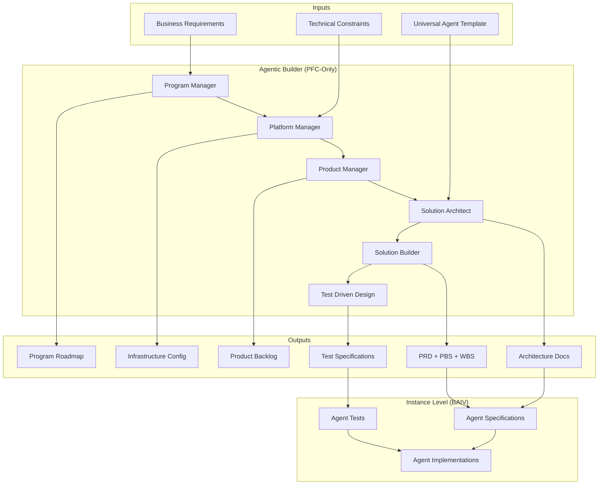

# PFC-PFI-BAIV Agentic Builder Guide v1.0.0

**Meta-Agent Stack for Building Agents Using Universal Agent Template**

| Attribute | Value |
|-----------|-------|
| **Document Version** | 1.0.0 |
| **Date** | December 31, 2025 |
| **Purpose** | Document the 6-module meta-agent stack that generates agents |
| **Status** | 🟢 Active |
| **Owner** | Platform Architecture Team |
| **Parent Documents** | BAIV_INTEGRATION_PLAN.md, PFC-PFI-BAIV_MODULE_CATALOG.md |
| **Related Artifacts** | UNIVERSAL_AGENT_TEMPLATE.md, PFC-PFI-BAIV_INTEGRATION_BRIDGES.md |

---

## Executive Summary

The **Agentic Builder** is a 6-module meta-agent stack that generates AI agents using the Universal Agent Template (UAT). These are **PFC-only modules** that operate at the platform layer and have **no direct BAIV instance mapping**.

**Key Distinction:**
- **UAT defines WHAT to build:** Agent metadata, ontology bindings, authority boundaries, implementation structure
- **Agentic Builder defines HOW to build it:** Program roadmap, platform infrastructure, product backlog, architecture, execution, testing

**6 Agentic Builder Modules:**
1. **Program Manager** - Defines program roadmap and milestone gates
2. **Platform Manager** - Configures infrastructure and scaling policies
3. **Product Manager** - Builds product backlog and prioritizes features
4. **Solution Architect** - Creates architecture docs and tech standards
5. **Solution Builder (PRD-PBS-WBS)** - Generates PRDs and builds PBS/WBS breakdowns
6. **Test Driven Design (TDD)** - Defines test cases first and validates with 80%+ coverage

**Relationship to BAIV:**
- BAIV **implements agents** (16 primary agents using UAT)
- BAIV does **not implement** Agentic Builder modules (PFC-only)
- Agentic Builder is used **upstream** to generate BAIV agent specifications

---

## 1. Agentic Builder Architecture

### 1.1 Meta-Agent Stack Overview



### 1.2 Module Flow

**Sequential Processing:**
```
1. Program Manager
   ↓ (Program roadmap with milestones)
   
2. Platform Manager
   ↓ (Infrastructure requirements)
   
3. Product Manager
   ↓ (Product backlog with priorities)
   
4. Solution Architect
   ↓ (Architecture docs: HLD, UAT, integration specs)
   
5. Solution Builder
   ↓ (PRD with PBS/WBS breakdown)
   
6. Test Driven Design
   ↓ (Test specifications for validation)
   
→ Agent Specifications (Ready for implementation)
```

### 1.3 PFC-Only Nature

**Why these modules are PFC-only:**
- **Program Manager:** Orchestrates multi-instance programs (BAIV, W4M, AIR)
- **Platform Manager:** Manages platform infrastructure (Supabase, deployment)
- **Product Manager:** Plans platform products across instances
- **Solution Architect:** Creates reusable architecture patterns (UAT)
- **Solution Builder:** Generates specs for platform and instances
- **TDD:** Validates platform quality standards (80%+ coverage)

**BAIV Relationship:**
- BAIV **consumes** outputs from Agentic Builder
- BAIV **does not implement** Agentic Builder modules
- Example: Program Manager creates BAIV agent roadmap → BAIV implements agents

---

## 2. Module 1: Program Manager

### 2.1 Purpose

Defines program roadmap, sets milestone gates, and manages multi-instance program orchestration.

**Module ID:** `pfc-mod-builder-program-v1.0.0`  
**Type:** PFC-Only  
**BAIV Mapping:** None  
**Scope:** Platform-wide program management

### 2.2 Responsibilities

**Strategic Planning:**
- Define program vision and objectives
- Create multi-quarter roadmap
- Set milestone gates (Alpha, Beta, GA)
- Coordinate cross-instance programs

**Program Governance:**
- Track program health (on-track, at-risk, off-track)
- Manage dependencies between instances (BAIV → W4M → AIR)
- Escalate blockers and risks
- Report to executive stakeholders

**Resource Allocation:**
- Allocate engineering resources across programs
- Prioritize program initiatives
- Manage program budget

### 2.3 Program Roadmap Structure

**Example: BAIV Agent Program Roadmap**

```
Program: BAIV Agent Ecosystem
Vision: Build 16 primary agents for AI Visibility optimization
Duration: 6 months (Jan 2025 - Jun 2025)
Owner: Program Manager

Milestone Gates:
├── M1: Foundation (Week 1-4)
│   ├── Tier 1 Agents (Discovery, ICP Discovery)
│   ├── Gate Criteria: 2 agents, 80% coverage, production-ready
│   └── Status: 🟢 On Track
│
├── M2: Analysis (Week 5-8)
│   ├── Tier 2-3 Agents (Citation Tester, Gap Analyzer, Query Expansion, LLM Mentions)
│   ├── Gate Criteria: 6 agents total, integration tests pass
│   └── Status: 🟡 At Risk (Gap Analyzer delayed)
│
├── M3: Content (Week 9-12)
│   ├── Tier 3 Agents (Content Generator, Publishing)
│   ├── Gate Criteria: 8 agents total, content workflow end-to-end
│   └── Status: ⬜ Not Started
│
├── M4: Intelligence (Week 13-16)
│   ├── Tier 3 Agents (Scorecard, KPI, OKR, PMF, RPI)
│   ├── Gate Criteria: 13 agents total, dashboard integration
│   └── Status: ⬜ Not Started
│
├── M5: Reporting (Week 17-20)
│   ├── Tier 3 Agents (Analytics, Reporting, Alert)
│   ├── Gate Criteria: 16 agents total, alerting functional
│   └── Status: ⬜ Not Started
│
└── M6: Production Hardening (Week 21-24)
    ├── Performance optimization, security audit, documentation
    ├── Gate Criteria: All agents GA-ready, 95%+ success rate
    └── Status: ⬜ Not Started
```

### 2.4 Program Health Dashboard

**Metrics:**
- **Velocity:** Agents completed per sprint
- **Quality:** Test coverage %, production incident rate
- **Dependencies:** Blockers, cross-team dependencies
- **Risk:** High-risk items, mitigation status

**Gate Criteria Template:**
```json
{
  "milestone_gate": "M2: Analysis",
  "entry_criteria": [
    "M1 (Foundation) milestone complete",
    "Tier 1 agents in production",
    "Discovery/ICP agents achieving 80%+ citation discovery rate"
  ],
  "exit_criteria": [
    "6 agents total (Tier 1 + Tier 2-3)",
    "All agents 80%+ test coverage",
    "Integration tests pass (Discovery → Citation → Gap)",
    "Production deployment successful",
    "No P0 bugs open"
  ],
  "go_no_go_decision": "Program Manager + Platform Manager approval"
}
```

### 2.5 Cross-Instance Dependencies

**Example: BAIV Dependencies**
```
BAIV Agent Program
├── Depends on PFC:
│   ├── Agent Manager (orchestration)
│   ├── OAA Architect (ontology registry)
│   ├── VSOM (strategic context)
│   └── Security modules (auth, RBAC)
│
├── Enables W4M:
│   ├── Agent patterns transferable
│   ├── Ontology design patterns
│   └── Testing frameworks
│
└── Enables AIR:
    ├── Agent orchestration patterns
    ├── Dashboard components
    └── Integration bridge patterns
```

### 2.6 Program Manager Actions

**Action Items:**
- [ ] Define program roadmap for BAIV agents
- [ ] Set milestone gates (6 milestones)
- [ ] Configure program-level orchestration
- [ ] Track program health metrics
- [ ] Manage cross-instance dependencies
- [ ] Report program status to executives

---

## 3. Module 2: Platform Manager

### 3.1 Purpose

Configures infrastructure, sets scaling policies, and manages platform operations.

**Module ID:** `pfc-mod-builder-platform-v1.0.0`  
**Type:** PFC-Only  
**BAIV Mapping:** None  
**Scope:** Platform infrastructure and operations

### 3.2 Responsibilities

**Infrastructure Management:**
- Configure Supabase (database, auth, storage, edge functions)
- Set up deployment pipelines (CI/CD)
- Manage environments (Dev, Staging, Prod)
- Configure CDN and caching

**Scaling Policies:**
- Auto-scaling rules for compute
- Database connection pooling
- Rate limiting and throttling
- Load balancing configuration

**Operations:**
- Monitoring and alerting (Datadog, Sentry)
- Log aggregation and analysis
- Incident response procedures
- Backup and disaster recovery

**Cost Optimization:**
- Resource utilization monitoring
- Cost allocation per instance (BAIV, W4M, AIR)
- Right-sizing recommendations

### 3.3 Infrastructure Architecture

**Platform Infrastructure Stack:**

```
┌─────────────────────────────────────────────┐
│         CDN (Cloudflare)                    │
│         SSL/TLS, DDoS Protection            │
└─────────────────────────────────────────────┘
                    ↓
┌─────────────────────────────────────────────┐
│         Load Balancer                       │
│         Health Checks, Failover             │
└─────────────────────────────────────────────┘
                    ↓
┌──────────────────────┬──────────────────────┐
│   Web Tier           │   API Tier           │
│   Next.js (Vercel)   │   Supabase Edge Fns  │
│   Static Assets      │   REST/GraphQL APIs  │
└──────────────────────┴──────────────────────┘
                    ↓
┌─────────────────────────────────────────────┐
│         Application Tier                    │
│         Agent Orchestration                 │
│         Business Logic                      │
└─────────────────────────────────────────────┘
                    ↓
┌──────────────────────┬──────────────────────┐
│   Data Tier          │   Storage Tier       │
│   Supabase Postgres  │   Supabase Storage   │
│   Redis Cache        │   S3 Backups         │
└──────────────────────┴──────────────────────┘
                    ↓
┌─────────────────────────────────────────────┐
│         Monitoring & Logging                │
│         Datadog, Sentry, LogRocket          │
└─────────────────────────────────────────────┘
```

### 3.4 Environment Configuration

**Three Environments:**

**Development:**
```json
{
  "environment": "dev",
  "purpose": "Feature development and testing",
  "database": {
    "instance": "pf-core-dev",
    "size": "small",
    "connections": 20
  },
  "deployment": {
    "auto_deploy": true,
    "branch": "develop",
    "preview_urls": true
  },
  "monitoring": {
    "log_level": "debug",
    "retention_days": 7
  }
}
```

**Staging:**
```json
{
  "environment": "staging",
  "purpose": "Pre-production validation",
  "database": {
    "instance": "pf-core-staging",
    "size": "medium",
    "connections": 50,
    "replica": true
  },
  "deployment": {
    "auto_deploy": false,
    "branch": "main",
    "approval_required": true
  },
  "monitoring": {
    "log_level": "info",
    "retention_days": 30
  }
}
```

**Production:**
```json
{
  "environment": "production",
  "purpose": "Live customer traffic",
  "database": {
    "instance": "pf-core-prod",
    "size": "large",
    "connections": 200,
    "replicas": 3,
    "backup_frequency": "hourly"
  },
  "deployment": {
    "auto_deploy": false,
    "branch": "main",
    "approval_required": true,
    "rollback_enabled": true
  },
  "monitoring": {
    "log_level": "warn",
    "retention_days": 90,
    "alerting_enabled": true
  }
}
```

### 3.5 Scaling Configuration

**Auto-Scaling Rules:**

```json
{
  "scaling_policies": {
    "compute": {
      "metric": "cpu_utilization",
      "target": 70,
      "min_instances": 2,
      "max_instances": 20,
      "scale_up_cooldown": 60,
      "scale_down_cooldown": 300
    },
    "database": {
      "metric": "connection_pool_utilization",
      "target": 80,
      "min_connections": 20,
      "max_connections": 200
    },
    "cache": {
      "metric": "hit_rate",
      "target": 90,
      "eviction_policy": "lru",
      "ttl": 3600
    }
  },
  "rate_limiting": {
    "api_calls": {
      "free_tier": 100,
      "paid_tier": 1000,
      "enterprise_tier": 10000,
      "window": "per_hour"
    },
    "agent_executions": {
      "concurrent_limit": 5,
      "queue_enabled": true
    }
  }
}
```

### 3.6 Monitoring & Alerting

**Key Metrics:**
- **Availability:** Uptime %, response time p50/p95/p99
- **Performance:** API latency, database query time
- **Errors:** Error rate, 5xx responses
- **Resources:** CPU, memory, disk utilization
- **Business:** Agent execution rate, audit completion rate

**Alert Configuration:**
```json
{
  "alerts": [
    {
      "name": "High Error Rate",
      "metric": "error_rate",
      "threshold": 0.05,
      "window": "5 minutes",
      "severity": "critical",
      "notify": ["platform-team", "on-call"]
    },
    {
      "name": "Database Connection Pool Exhausted",
      "metric": "db_connections",
      "threshold": 180,
      "window": "1 minute",
      "severity": "critical",
      "notify": ["platform-team"]
    },
    {
      "name": "Agent Execution Failures",
      "metric": "agent_failure_rate",
      "threshold": 0.10,
      "window": "15 minutes",
      "severity": "high",
      "notify": ["baiv-team"]
    }
  ]
}
```

### 3.7 Platform Manager Actions

**Action Items:**
- [ ] Configure infrastructure (Supabase, Vercel)
- [ ] Set scaling policies (auto-scaling rules)
- [ ] Define operational procedures (incident response)
- [ ] Set up monitoring (Datadog, Sentry)
- [ ] Configure backup and DR
- [ ] Optimize costs (resource right-sizing)

---

## 4. Module 3: Product Manager

### 4.1 Purpose

Builds product backlog, prioritizes features, and manages product requirements.

**Module ID:** `pfc-mod-builder-product-v1.0.0`  
**Type:** PFC-Only  
**BAIV Mapping:** None  
**Scope:** Product planning and backlog management

### 4.2 Responsibilities

**Product Vision:**
- Define product vision and strategy
- Identify target customers (ICP)
- Establish product-market fit criteria

**Backlog Management:**
- Build and prioritize product backlog
- Write user stories and acceptance criteria
- Manage feature requests and enhancements

**Stakeholder Management:**
- Gather requirements from stakeholders
- Communicate product roadmap
- Manage expectations and tradeoffs

**Metrics & KPIs:**
- Define product success metrics
- Track feature adoption rates
- Monitor user satisfaction (NPS, CSAT)

### 4.3 Product Backlog Structure

**Backlog Organization:**

```
Product Backlog: BAIV Agent Ecosystem
├── Epic 1: Discovery & Analysis Agents
│   ├── Story 1.1: Discovery Agent - Competitor Analysis
│   │   ├── Priority: P0
│   │   ├── Story Points: 8
│   │   ├── Acceptance Criteria: [...]
│   │   └── Status: ✅ Done
│   │
│   ├── Story 1.2: ICP Discovery Agent - Ideal Customer Profiling
│   │   ├── Priority: P0
│   │   ├── Story Points: 5
│   │   └── Status: ✅ Done
│   │
│   ├── Story 1.3: Citation Tester Agent - Multi-Platform Testing
│   │   ├── Priority: P0
│   │   ├── Story Points: 13
│   │   └── Status: 🔄 In Progress
│   │
│   └── Story 1.4: Gap Analyzer Agent - Content Gap Identification
│       ├── Priority: P0
│       ├── Story Points: 8
│       └── Status: ⬜ To Do
│
├── Epic 2: Content Generation Agents
│   ├── Story 2.1: Query Expansion Agent - Keyword Discovery
│   ├── Story 2.2: LLM Mentions Agent - AI Platform Tracking
│   ├── Story 2.3: Content Generator Agent - AI-Powered Drafts
│   └── Story 2.4: Publishing Agent - CMS Integration
│
├── Epic 3: Intelligence & Reporting Agents
│   ├── Story 3.1: Scorecard Agent - BSC Performance
│   ├── Story 3.2: KPI Agent - Metrics Calculation
│   ├── Story 3.3: OKR Agent - Objective Tracking
│   ├── Story 3.4: PMF Agent - Product-Market Fit
│   └── Story 3.5: RPI Agent - Revenue Performance Index
│
└── Epic 4: Analytics & Alerting Agents
    ├── Story 4.1: Analytics Agent - Trend Analysis
    ├── Story 4.2: Reporting Agent - Automated Reports
    └── Story 4.3: Alert Agent - Real-time Notifications
```

### 4.4 User Story Template

**Format:** As a [user role], I want [feature], so that [business value]

**Example: Citation Tester Agent**

```markdown
# Story 1.3: Citation Tester Agent - Multi-Platform Testing

## User Story
As a Marketing Director, I want to test if my brand is cited by AI platforms (ChatGPT, Claude, Gemini, Perplexity) for relevant queries, so that I can measure AI Visibility and identify citation gaps.

## Priority: P0 (Critical)
## Story Points: 13 (Large)
## Sprint: Sprint 3

## Acceptance Criteria
- [ ] Agent tests queries on 4 platforms (ChatGPT, Claude, Gemini, Perplexity)
- [ ] Agent detects if client brand is cited in responses
- [ ] Agent calculates citation rate per platform
- [ ] Agent identifies which competitors are cited instead
- [ ] Results stored in `audit_results` table
- [ ] Agent handles rate limiting gracefully
- [ ] Agent retries failed queries (3 attempts)
- [ ] Test coverage ≥ 80%

## Technical Requirements
- Agent ID: `agent-baiv-citation-tester-v1.0.0`
- Type: domain_specialist
- Tier: 2
- Consumes: BAIV-ONT-AI-Visibility, BAIV-ONT-Universal-Brand
- Produces: BAIV-ONT-AI-Visibility (citation data)
- API Integration: Claude API, OpenAI API, Gemini API, Perplexity API

## Dependencies
- Discovery Agent must be complete (provides queries)
- API keys configured for all 4 platforms
- Rate limiting logic implemented

## Definition of Done
- Code reviewed and merged
- Unit tests pass (80%+ coverage)
- Integration tests pass
- Agent registered in OAA Registry
- Documentation updated
- Deployed to production
```

### 4.5 Prioritization Framework

**Priority Levels:**
- **P0 (Critical):** Must-have for launch, blocks other work
- **P1 (High):** Important but not blocking, near-term priority
- **P2 (Medium):** Nice-to-have, can be deferred
- **P3 (Low):** Future consideration

**Prioritization Matrix:**

| Impact | Effort: Low | Effort: Medium | Effort: High |
|--------|-------------|----------------|--------------|
| **High Impact** | P0 (Do First) | P0-P1 (High Priority) | P1 (Plan Carefully) |
| **Medium Impact** | P1 (Quick Wins) | P1-P2 (Evaluate) | P2 (Defer) |
| **Low Impact** | P2 (If Time) | P3 (Backlog) | P3 (Don't Do) |

**Example Prioritization:**
- Discovery Agent: High Impact, Medium Effort → **P0**
- Citation Tester: High Impact, High Effort → **P0** (blocking Gap Analyzer)
- Alert Agent: Medium Impact, Low Effort → **P1** (quick win later)
- P2D (Prompt-to-Design): Low Impact, High Effort → **P3** (don't do)

### 4.6 Feature Adoption Tracking

**Metrics:**
- **Adoption Rate:** % of users using feature within 30 days
- **Usage Frequency:** Daily/Weekly active users
- **Feature Stickiness:** DAU/MAU ratio
- **Time to Value:** Time from signup to first successful use

**Example: Citation Tester Adoption**
```json
{
  "feature": "Citation Tester Agent",
  "launch_date": "2025-02-15",
  "metrics": {
    "adoption_rate_30d": 0.65,
    "dau": 120,
    "mau": 500,
    "stickiness": 0.24,
    "time_to_value_median": "2 hours",
    "nps": 45
  },
  "feedback": [
    "Love the multi-platform testing!",
    "Wish it was faster (rate limiting delays)",
    "Want historical citation tracking"
  ]
}
```

### 4.7 Product Manager Actions

**Action Items:**
- [ ] Build product backlog (Epics, Stories)
- [ ] Prioritize features (P0/P1/P2/P3)
- [ ] Define product requirements (user stories)
- [ ] Write acceptance criteria
- [ ] Track feature adoption metrics
- [ ] Gather stakeholder feedback

---

## 5. Module 4: Solution Architect

### 5.1 Purpose

Creates architecture documents, defines tech standards, and establishes design patterns.

**Module ID:** `pfc-mod-builder-architect-v1.0.0`  
**Type:** PFC-Only  
**BAIV Mapping:** None  
**Scope:** Architecture design and technical standards

### 5.2 Responsibilities

**Architecture Documentation:**
- Create HLD (High-Level Design)
- Create UAT (Universal Agent Template)
- Define integration bridges
- Document API contracts

**Technical Standards:**
- Define coding standards
- Establish design patterns
- Set technology choices
- Define security requirements

**System Design:**
- Design system architecture
- Define data models
- Establish communication patterns
- Plan scalability approach

**Quality Standards:**
- Define test coverage requirements (80%+)
- Establish code review process
- Set performance benchmarks
- Define SLAs

### 5.3 Architecture Documents Created

**For BAIV Agent Ecosystem:**

1. **HLD_AGENTIC_SOLUTION_TEMPLATE.md** (988 lines)
   - 6 architectural layers
   - 15 mermaid diagrams
   - 6-week implementation roadmap
   - Design system integration

2. **UNIVERSAL_AGENT_TEMPLATE.md** (1,177 lines)
   - Agent metadata specification (YAML)
   - JSON-LD ontology format
   - 4 architecture diagrams (Context, Flow, State, Ontology)
   - TypeScript implementation templates
   - Authority boundary definitions

3. **PFC-PFI-BAIV_MODULE_CATALOG.md** (1,715 lines)
   - 30 PFC modules documented
   - BAIV mappings for each module
   - Module dependency graph
   - 3-phase implementation priorities

4. **PFC-PFI-BAIV_INTEGRATION_BRIDGES.md** (1,735 lines)
   - 4 integration bridges
   - Configuration schemas (JSON)
   - Code examples (TypeScript, SQL)
   - Validation checklists

### 5.4 Universal Agent Template (UAT) Structure

**UAT Sections:**

```
Universal Agent Template
├── Section 1: Agent Metadata
│   ├── Agent ID, Name, Type, Tier
│   ├── Description and Purpose
│   └── Version and Status
│
├── Section 2: JSON-LD Specification
│   ├── @context, @type, @id
│   ├── Schema.org grounding
│   └── Properties and relationships
│
├── Section 3: Architecture Diagrams
│   ├── Context Diagram (dependencies)
│   ├── Execution Flow Diagram
│   ├── State Machine Diagram
│   └── Ontology Relationships Diagram
│
├── Section 4: Ontology Bindings
│   ├── Consumes (input ontologies)
│   ├── Produces (output ontologies)
│   ├── Requires (context ontologies)
│   └── Validates (compliance ontologies)
│
├── Section 5: Authority Boundary
│   ├── can_read permissions
│   ├── can_write permissions
│   ├── can_delete permissions
│   ├── requires_approval flag
│   ├── timeConstraints
│   └── resourceLimits
│
├── Section 6: Implementation (TypeScript)
│   ├── BaseAgent class extension
│   ├── execute() method
│   ├── setTenantContext() call
│   └── Error handling
│
├── Section 7: Testing
│   ├── Unit tests
│   ├── Integration tests
│   ├── Tenant isolation test
│   └── 80%+ coverage requirement
│
├── Section 8: Deployment
│   ├── Environment variables
│   ├── API route
│   └── Production config
│
├── Section 9: Documentation
│   ├── README.md
│   ├── Architecture diagrams
│   └── Usage examples
│
└── Section 10: Quality Checklist
    └── 80+ quality verification items
```

### 5.5 Design Patterns Established

**Agent Design Patterns:**

**1. Context Loading Pattern**
```typescript
// Every agent must load context before execution
abstract class BaseAgent {
  async execute(input: any): Promise<any> {
    // 1. Load tenant context
    await this.setTenantContext(input.tenant_id, input.user_id);
    
    // 2. Load strategic context (VSOM)
    const veContext = await this.loadOntology('ve-context');
    
    // 3. Load required ontologies
    const requiredOntologies = await this.loadRequiredOntologies();
    
    // 4. Execute agent logic
    const result = await this.executeLogic(input);
    
    // 5. Log activity
    await this.logActivity(result);
    
    return result;
  }
}
```

**2. Ontology Binding Pattern**
```typescript
// Agents declare ontology dependencies explicitly
class DiscoveryAgent extends BaseAgent {
  ontologyBindings = {
    consumes: [
      'BAIV-ONT-Customer-Organization',
      'BAIV-ONT-Universal-Brand'
    ],
    produces: [
      'BAIV-ONT-AI-Visibility'
    ],
    requires: [
      've-context'
    ],
    validates: []
  };
}
```

**3. Agent Orchestration Pattern**
```typescript
// Agents hand off to next agent in workflow
async function orchestrateWorkflow(input: any): Promise<any> {
  const discovery = await discoveryAgent.execute(input);
  const citations = await citationAgent.execute(discovery);
  const gaps = await gapAgent.execute(citations);
  const content = await contentAgent.execute(gaps);
  return { discovery, citations, gaps, content };
}
```

**4. Error Handling Pattern**
```typescript
// All agents use consistent error handling
class BaseAgent {
  async execute(input: any): Promise<any> {
    try {
      return await this.executeLogic(input);
    } catch (error) {
      await this.logError(error);
      if (this.isRetryable(error)) {
        return await this.retry(input);
      }
      throw new AgentError(error);
    }
  }
}
```

### 5.6 Technology Choices

**Tech Stack:**
- **Frontend:** Next.js 14 (App Router), React, TypeScript
- **Backend:** Supabase (Postgres, Auth, Storage, Edge Functions)
- **AI/ML:** Claude 3.5 Sonnet (Anthropic API)
- **Deployment:** Vercel (frontend), Supabase (backend)
- **Monitoring:** Datadog, Sentry, LogRocket
- **CI/CD:** GitHub Actions
- **Testing:** Jest, Playwright
- **Design:** Figma, BAIV design tokens

**Rationale:**
- **Supabase:** Integrated platform (DB + Auth + Storage + Functions)
- **Next.js:** Server-side rendering, API routes, optimized performance
- **Claude API:** Best-in-class reasoning for agents
- **TypeScript:** Type safety, better DX
- **Vercel:** Seamless Next.js deployment

### 5.7 Solution Architect Actions

**Action Items:**
- [ ] Create architecture docs (HLD, UAT)
- [ ] Define tech standards (TypeScript, testing)
- [ ] Establish design patterns (BaseAgent, orchestration)
- [ ] Document API contracts
- [ ] Define security requirements (RLS, MFA)
- [ ] Set performance benchmarks (p95 < 2s)

---

## 6. Module 5: Solution Builder (PRD-PBS-WBS)

### 6.1 Purpose

Generates PRDs (Product Requirements Documents), builds PBS/WBS breakdowns, and manages solution execution.

**Module ID:** `pfc-mod-builder-solution-v1.0.0`  
**Type:** PFC-Only  
**BAIV Mapping:** None  
**Scope:** Solution specification and breakdown

### 6.2 Responsibilities

**PRD Generation:**
- Write Product Requirements Documents
- Define functional and non-functional requirements
- Specify acceptance criteria
- Document assumptions and constraints

**PBS (Product Breakdown Structure):**
- Decompose product into features
- Break features into user stories
- Organize hierarchically

**WBS (Work Breakdown Structure):**
- Break work into tasks
- Estimate effort (story points, hours)
- Assign tasks to team members
- Track completion

**Execution Management:**
- Sprint planning
- Daily standups coordination
- Sprint reviews and retrospectives

### 6.3 PRD Template

**PRD Structure:**

```markdown
# Product Requirements Document: [Feature Name]

## 1. Executive Summary
- Product: [Product name]
- Feature: [Feature name]
- Owner: [Product Manager name]
- Status: [Draft/Review/Approved]

## 2. Problem Statement
- What problem are we solving?
- Who has this problem?
- How big is the problem?

## 3. Goals & Success Metrics
- Goal 1: [Objective]
  - Success Metric: [KPI with target]
- Goal 2: [Objective]
  - Success Metric: [KPI with target]

## 4. User Stories
- As a [user role], I want [feature], so that [value]
- [More user stories...]

## 5. Functional Requirements
- FR1: [Requirement description]
- FR2: [Requirement description]

## 6. Non-Functional Requirements
- Performance: [Requirements]
- Security: [Requirements]
- Scalability: [Requirements]

## 7. Technical Architecture
- [High-level architecture diagram]
- [Technology choices]

## 8. Dependencies
- [Upstream dependencies]
- [External dependencies]

## 9. Timeline
- Phase 1: [Dates]
- Phase 2: [Dates]

## 10. Risks & Mitigations
- Risk 1: [Description] → Mitigation: [Plan]
```

### 6.4 PBS Example: BAIV Agent Ecosystem

**Product Breakdown Structure:**

```
BAIV Agent Ecosystem
├── 1. Discovery & Analysis
│   ├── 1.1 Discovery Agent
│   │   ├── 1.1.1 Competitor URL input
│   │   ├── 1.1.2 Query generation
│   │   ├── 1.1.3 Client brand extraction
│   │   └── 1.1.4 Discovery report generation
│   │
│   ├── 1.2 ICP Discovery Agent
│   │   ├── 1.2.1 Firmographic profiling
│   │   ├── 1.2.2 Behavioral analysis
│   │   └── 1.2.3 ICP report generation
│   │
│   ├── 1.3 Citation Tester Agent
│   │   ├── 1.3.1 Multi-platform API integration
│   │   ├── 1.3.2 Citation detection logic
│   │   ├── 1.3.3 Rate limiting & retries
│   │   └── 1.3.4 Citation report
│   │
│   └── 1.4 Gap Analyzer Agent
│       ├── 1.4.1 Gap identification
│       ├── 1.4.2 Priority scoring
│       ├── 1.4.3 Keyword clustering
│       └── 1.4.4 Gap report
│
├── 2. Content Generation
│   ├── 2.1 Query Expansion Agent
│   ├── 2.2 LLM Mentions Agent
│   ├── 2.3 Content Generator Agent
│   └── 2.4 Publishing Agent
│
├── 3. Intelligence & Reporting
│   ├── 3.1 Scorecard Agent
│   ├── 3.2 KPI Agent
│   ├── 3.3 OKR Agent
│   ├── 3.4 PMF Agent
│   └── 3.5 RPI Agent
│
└── 4. Analytics & Alerting
    ├── 4.1 Analytics Agent
    ├── 4.2 Reporting Agent
    └── 4.3 Alert Agent
```

### 6.5 WBS Example: Citation Tester Agent

**Work Breakdown Structure:**

```
Citation Tester Agent
├── 1. Design (8 hours)
│   ├── 1.1 Architecture diagram (2h)
│   ├── 1.2 Ontology bindings spec (2h)
│   ├── 1.3 API integration design (2h)
│   └── 1.4 Error handling strategy (2h)
│
├── 2. Implementation (40 hours)
│   ├── 2.1 BaseAgent setup (4h)
│   ├── 2.2 API integrations (16h)
│   │   ├── 2.2.1 ChatGPT API (4h)
│   │   ├── 2.2.2 Claude API (4h)
│   │   ├── 2.2.3 Gemini API (4h)
│   │   └── 2.2.4 Perplexity API (4h)
│   ├── 2.3 Citation detection logic (8h)
│   ├── 2.4 Rate limiting (4h)
│   ├── 2.5 Retry logic (4h)
│   └── 2.6 Data storage (4h)
│
├── 3. Testing (24 hours)
│   ├── 3.1 Unit tests (12h)
│   ├── 3.2 Integration tests (8h)
│   └── 3.3 Load testing (4h)
│
├── 4. Documentation (8 hours)
│   ├── 4.1 README (2h)
│   ├── 4.2 API docs (2h)
│   ├── 4.3 Architecture diagrams (2h)
│   └── 4.4 Usage examples (2h)
│
└── 5. Deployment (8 hours)
    ├── 5.1 CI/CD setup (4h)
    ├── 5.2 Production deployment (2h)
    └── 5.3 Monitoring setup (2h)

Total Effort: 88 hours (~11 days @ 8h/day)
Story Points: 13
```

### 6.6 Sprint Planning

**Sprint Structure (2 weeks):**
- Sprint Planning: Monday Week 1 (2 hours)
- Daily Standups: Daily (15 minutes)
- Sprint Review: Friday Week 2 (1 hour)
- Sprint Retrospective: Friday Week 2 (1 hour)

**Sprint Planning Template:**
```markdown
# Sprint [N]: [Sprint Name]
**Dates:** [Start Date] - [End Date]
**Sprint Goal:** [1-2 sentence goal]
**Team Capacity:** [Total story points available]

## Stories Committed
- [ ] Story 1.3: Citation Tester Agent (13 points)
- [ ] Story 1.4: Gap Analyzer Agent (8 points)
- [ ] Bug fixes (2 points)

**Total Committed:** 23 points
**Team Velocity:** 25 points (based on last 3 sprints)
**Commitment:** 92% of capacity (healthy)

## Sprint Backlog
1. Citation Tester - Design & API integrations
2. Citation Tester - Detection logic & testing
3. Gap Analyzer - Design
4. Bug fix: Discovery Agent timeout

## Definition of Done
- Code reviewed and merged
- Tests pass (80%+ coverage)
- Deployed to staging
- PM approved
```

### 6.7 Solution Builder Actions

**Action Items:**
- [ ] Generate PRDs (one per epic/major feature)
- [ ] Build PBS/WBS breakdowns (hierarchical)
- [ ] Manage solution execution (sprint planning)
- [ ] Track task completion
- [ ] Coordinate sprint ceremonies
- [ ] Update documentation

---

## 7. Module 6: Test Driven Design (TDD)

### 7.1 Purpose

Defines test cases first, validates with 80%+ coverage, and ensures quality across all implementations.

**Module ID:** `pfc-mod-builder-tdd-v1.0.0`  
**Type:** PFC-Only  
**BAIV Mapping:** None  
**Scope:** Test strategy and quality validation

### 7.2 Responsibilities

**Test Strategy:**
- Define test types (unit, integration, e2e)
- Set coverage requirements (80%+)
- Establish test data strategies
- Define test environments

**Test-First Development:**
- Write tests before implementation
- Use TDD Red-Green-Refactor cycle
- Ensure testability in design

**Quality Gates:**
- Define quality criteria for releases
- Enforce coverage requirements
- Block deploys if tests fail

**Continuous Testing:**
- Automate test execution in CI/CD
- Run tests on every commit
- Generate coverage reports

### 7.3 Test Pyramid

**Test Distribution:**

```
          /\
         /  \
        / E2E \     10% (End-to-End Tests)
       /______\
      /        \
     / Integr.  \   20% (Integration Tests)
    /____________\
   /              \
  /   Unit Tests   \ 70% (Unit Tests)
 /__________________\
```

**Rationale:**
- **Unit tests (70%):** Fast, isolated, test individual functions
- **Integration tests (20%):** Test component interactions
- **E2E tests (10%):** Test full user flows (expensive, slow)

### 7.4 Test Types

**1. Unit Tests**
- **Scope:** Individual functions, methods, classes
- **Tools:** Jest
- **Coverage Target:** 80%+
- **Example:** Test `DiscoveryAgent.generateQueries()` method

```typescript
// Unit test example
describe('DiscoveryAgent', () => {
  it('should generate queries from competitor URL', async () => {
    const agent = new DiscoveryAgent();
    const input = {
      competitor_url: 'https://competitor.com',
      tenant_id: 'tenant-123',
      user_id: 'user-456'
    };
    
    const result = await agent.generateQueries(input);
    
    expect(result.queries).toHaveLength(10);
    expect(result.queries[0]).toHaveProperty('text');
    expect(result.queries[0]).toHaveProperty('intent');
  });
  
  it('should handle invalid URL', async () => {
    const agent = new DiscoveryAgent();
    const input = {
      competitor_url: 'invalid-url',
      tenant_id: 'tenant-123',
      user_id: 'user-456'
    };
    
    await expect(agent.generateQueries(input)).rejects.toThrow('Invalid URL');
  });
});
```

**2. Integration Tests**
- **Scope:** Component interactions, API calls, database
- **Tools:** Jest + Supabase test client
- **Example:** Test Discovery → Citation → Gap workflow

```typescript
// Integration test example
describe('Audit Workflow Integration', () => {
  it('should complete Discovery → Citation → Gap flow', async () => {
    // 1. Run Discovery Agent
    const discoveryResult = await discoveryAgent.execute({
      competitor_url: 'https://competitor.com',
      tenant_id: 'test-tenant',
      user_id: 'test-user'
    });
    
    expect(discoveryResult.queries).toHaveLength(10);
    
    // 2. Run Citation Tester on first query
    const citationResult = await citationAgent.execute({
      query: discoveryResult.queries[0].text,
      client_brand: 'Test Brand',
      tenant_id: 'test-tenant',
      user_id: 'test-user'
    });
    
    expect(citationResult).toHaveProperty('citation_found');
    
    // 3. Run Gap Analyzer
    const gapResult = await gapAgent.execute({
      citation_results: [citationResult],
      competitor_url: 'https://competitor.com',
      tenant_id: 'test-tenant',
      user_id: 'test-user'
    });
    
    expect(gapResult.gaps).toBeDefined();
  });
});
```

**3. Tenant Isolation Tests**
- **Scope:** Ensure multi-tenant data separation
- **Critical for:** Security, compliance
- **Example:** Test RLS policies

```typescript
// Tenant isolation test
describe('Tenant Isolation', () => {
  it('should not allow cross-tenant data access', async () => {
    // Create audit for tenant A
    const auditA = await supabase
      .from('audits')
      .insert({ tenant_id: 'tenant-a', data: 'A data' })
      .select()
      .single();
    
    // Try to read from tenant B
    const { data, error } = await supabase
      .from('audits')
      .select('*')
      .eq('id', auditA.data.id)
      .eq('tenant_id', 'tenant-b')
      .single();
    
    expect(data).toBeNull();
    expect(error).toBeDefined();
  });
});
```

**4. E2E Tests**
- **Scope:** Full user flows from UI to database
- **Tools:** Playwright
- **Example:** User runs audit, views gaps, generates content

```typescript
// E2E test example
test('Complete audit workflow', async ({ page }) => {
  // 1. Login
  await page.goto('/login');
  await page.fill('[name="email"]', 'test@example.com');
  await page.fill('[name="password"]', 'password');
  await page.click('button[type="submit"]');
  
  // 2. Navigate to audits
  await page.goto('/audits/new');
  
  // 3. Run audit
  await page.fill('[name="competitor_url"]', 'https://competitor.com');
  await page.click('button:has-text("Run Audit")');
  
  // 4. Wait for results
  await page.waitForSelector('.audit-results', { timeout: 60000 });
  
  // 5. Verify citation rate displayed
  const citationRate = await page.textContent('.citation-rate');
  expect(citationRate).toMatch(/\d+%/);
  
  // 6. Navigate to gaps
  await page.click('a:has-text("View Gaps")');
  await page.waitForSelector('.gap-list');
  
  // 7. Verify gaps displayed
  const gapCount = await page.locator('.gap-item').count();
  expect(gapCount).toBeGreaterThan(0);
});
```

### 7.5 Coverage Requirements

**Minimum Coverage Targets:**
- **Overall:** 80%+
- **Critical paths:** 95%+
- **Agents:** 90%+
- **UI components:** 70%+

**Coverage Enforcement:**
```json
{
  "jest": {
    "coverageThreshold": {
      "global": {
        "branches": 80,
        "functions": 80,
        "lines": 80,
        "statements": 80
      },
      "src/agents/**/*.ts": {
        "branches": 90,
        "functions": 90,
        "lines": 90,
        "statements": 90
      }
    }
  }
}
```

### 7.6 TDD Red-Green-Refactor Cycle

**Process:**

```
1. RED: Write failing test
   ↓
2. GREEN: Write minimum code to pass
   ↓
3. REFACTOR: Clean up code
   ↓
4. Repeat
```

**Example: Implementing Citation Detection**

```typescript
// 1. RED: Write failing test
describe('CitationTesterAgent', () => {
  it('should detect if brand is cited', () => {
    const agent = new CitationTesterAgent();
    const response = "I recommend using TestBrand for this use case.";
    const brand = "TestBrand";
    
    const result = agent.detectCitation(response, brand);
    
    expect(result.cited).toBe(true);
  });
});

// Test fails (method doesn't exist yet)

// 2. GREEN: Write minimum code to pass
class CitationTesterAgent extends BaseAgent {
  detectCitation(response: string, brand: string): { cited: boolean } {
    return { cited: response.includes(brand) };
  }
}

// Test passes (simple implementation)

// 3. REFACTOR: Improve implementation
class CitationTesterAgent extends BaseAgent {
  detectCitation(response: string, brand: string): { cited: boolean } {
    // Case-insensitive, whole-word matching
    const regex = new RegExp(`\\b${brand}\\b`, 'i');
    return { cited: regex.test(response) };
  }
}

// Test still passes (better implementation)
```

### 7.7 Quality Gates

**Pre-Merge Gates:**
- [ ] All tests pass
- [ ] Coverage ≥ 80%
- [ ] No linting errors
- [ ] No TypeScript errors
- [ ] Code reviewed (1+ approval)

**Pre-Deploy Gates (Staging):**
- [ ] All pre-merge gates passed
- [ ] Integration tests pass
- [ ] E2E tests pass
- [ ] Performance benchmarks met
- [ ] Security scan passed

**Pre-Deploy Gates (Production):**
- [ ] All staging gates passed
- [ ] Staging soak test (24 hours)
- [ ] No P0/P1 bugs open
- [ ] Rollback plan documented
- [ ] On-call engineer available

### 7.8 TDD Actions

**Action Items:**
- [ ] Define test cases first (before implementation)
- [ ] Validate 80%+ coverage (enforce in CI/CD)
- [ ] Ensure quality standards (quality gates)
- [ ] Write integration tests (agent workflows)
- [ ] Write E2E tests (user flows)
- [ ] Enforce tenant isolation tests

---

## 8. Agentic Builder Integration with BAIV

### 8.1 How BAIV Consumes Agentic Builder Outputs

**Workflow:**

```
1. Program Manager → BAIV Agent Roadmap
   ↓
2. Platform Manager → BAIV Infrastructure Config
   ↓
3. Product Manager → BAIV Feature Backlog
   ↓
4. Solution Architect → Agent Specifications (UAT)
   ↓
5. Solution Builder → PRDs + PBS + WBS
   ↓
6. TDD → Test Specifications
   ↓
7. BAIV Team Implements Agents
   ↓
8. Tests Validate Implementation
```

### 8.2 BAIV Agent Build Order (From Agentic Builder)

**7-Phase Build Order:**

**Phase 1: Foundation (Week 1-4)**
- Discovery Agent
- ICP Discovery Agent

**Phase 2: Analysis (Week 5-8)**
- Citation Tester Agent
- Gap Analyzer Agent
- Query Expansion Agent
- LLM Mentions Agent

**Phase 3: Content (Week 9-12)**
- Content Generator Agent
- Publishing Agent

**Phase 4: Intelligence (Week 13-16)**
- Scorecard Agent
- KPI Agent
- OKR Agent
- PMF Agent
- RPI Agent

**Phase 5: Reporting (Week 17-20)**
- Analytics Agent
- Reporting Agent
- Alert Agent

**Phase 6: Testing & Hardening (Week 21-22)**
- Integration testing
- Performance optimization
- Security audit

**Phase 7: Production Launch (Week 23-24)**
- Production deployment
- Monitoring setup
- Documentation finalization

### 8.3 Agentic Builder vs UAT

**Clear Distinction:**

| Aspect | Universal Agent Template (UAT) | Agentic Builder |
|--------|-------------------------------|-----------------|
| **Purpose** | Defines WHAT agents look like | Defines HOW to build agents |
| **Scope** | Agent specification format | End-to-end build process |
| **Output** | Agent metadata, ontology bindings, implementation template | Program roadmap, infrastructure, backlog, PRDs, tests |
| **Transferable** | Yes (all instances use UAT) | PFC-only (not transferred to instances) |
| **Example** | "Agent must have JSON-LD spec" | "Build Discovery Agent in Sprint 2" |

### 8.4 BAIV Implementation Checklist

**Using Agentic Builder Outputs:**

- [ ] Review program roadmap (Program Manager output)
- [ ] Configure infrastructure per Platform Manager specs
- [ ] Prioritize backlog per Product Manager
- [ ] Follow architecture docs (Solution Architect output)
- [ ] Implement per PRD (Solution Builder output)
- [ ] Write tests first per TDD specs
- [ ] Validate 80%+ coverage
- [ ] Deploy per deployment plan

---

## 9. Summary & Action Items

### 9.1 Agentic Builder Module Summary

| Module | Purpose | Key Outputs | BAIV Relationship |
|--------|---------|-------------|-------------------|
| **Program Manager** | Program roadmap, milestones | 6-milestone roadmap, health dashboard | Defines BAIV agent program |
| **Platform Manager** | Infrastructure, scaling | 3 environments, scaling policies, monitoring | Provides BAIV infrastructure |
| **Product Manager** | Product backlog, features | Backlog, user stories, priorities | Defines BAIV feature priorities |
| **Solution Architect** | Architecture, standards | HLD, UAT, integration bridges, patterns | Specifies BAIV agent structure |
| **Solution Builder** | PRDs, PBS, WBS | PRD per epic, PBS breakdown, WBS tasks | Details BAIV implementation |
| **TDD** | Tests, quality gates | Test specs, 80%+ coverage, quality gates | Validates BAIV quality |

### 9.2 Complete Action Checklist

**Program Manager:**
- [ ] Define program roadmap
- [ ] Set milestone gates
- [ ] Track program health
- [ ] Manage dependencies

**Platform Manager:**
- [ ] Configure infrastructure
- [ ] Set scaling policies
- [ ] Define operations
- [ ] Set up monitoring

**Product Manager:**
- [ ] Build product backlog
- [ ] Prioritize features
- [ ] Write user stories
- [ ] Track adoption

**Solution Architect:**
- [ ] Create architecture docs
- [ ] Define tech standards
- [ ] Establish patterns
- [ ] Set quality standards

**Solution Builder:**
- [ ] Generate PRDs
- [ ] Build PBS/WBS
- [ ] Manage execution
- [ ] Sprint planning

**TDD:**
- [ ] Define test cases
- [ ] Validate coverage
- [ ] Enforce quality gates
- [ ] Continuous testing

### 9.3 Key Takeaways

**1. PFC-Only Modules**
- Agentic Builder modules operate at platform layer
- No direct BAIV instance mapping
- Used upstream to generate agent specifications

**2. Relationship to UAT**
- UAT defines agent template (WHAT)
- Agentic Builder defines build process (HOW)
- Both work together to produce agents

**3. BAIV Consumes Outputs**
- BAIV team uses roadmaps, PRDs, test specs
- BAIV implements agents per specifications
- BAIV validates per quality gates

**4. Transferable Patterns**
- Program/product/solution management patterns transfer to W4M, AIR
- Infrastructure and testing patterns reusable
- Architecture docs (HLD, UAT) applicable to all instances

---

## Appendix: Reference Materials

### Document References

**Architecture Documents:**
- HLD_AGENTIC_SOLUTION_TEMPLATE.md (v1.2.0)
- UNIVERSAL_AGENT_TEMPLATE.md (v1.0.0)
- PFC-PFI-BAIV_MODULE_CATALOG.md (v1.0.0)
- PFC-PFI-BAIV_INTEGRATION_BRIDGES.md (v1.0.0)

**Planning Documents:**
- BAIV_INTEGRATION_PLAN.md (v1.0.0)
- BAIV_ALIGNMENT_ANALYSIS.md (v1.0.0)

### Agent Build References

**BAIV 16 Primary Agents:**
1. Discovery Agent
2. ICP Discovery Agent
3. Citation Tester Agent
4. Gap Analyzer Agent
5. Query Expansion Agent
6. LLM Mentions Agent
7. Content Generator Agent
8. Publishing Agent
9. Scorecard Agent
10. KPI Agent
11. OKR Agent
12. PMF Agent
13. RPI Agent
14. Analytics Agent
15. Reporting Agent
16. Alert Agent

---

**Document Version:** 1.0.0  
**Status:** 🟢 Active  
**Next Review:** After Phase 1 implementation  
**Related Documents:** PFC-PFI-BAIV_MODULE_CATALOG.md, PFC-PFI-BAIV_INTEGRATION_BRIDGES.md, UNIVERSAL_AGENT_TEMPLATE.md
