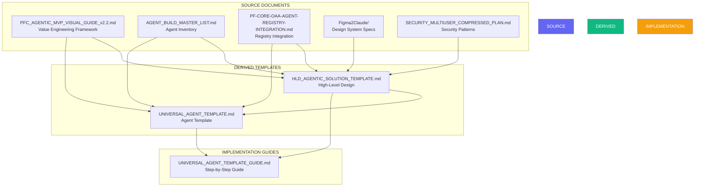
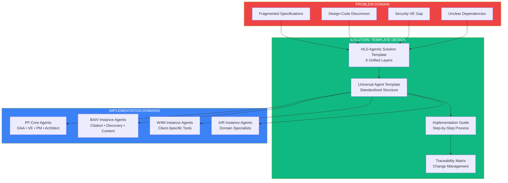

# Traceability Matrix: Agent Template to HLD and Source Documents

**Version:** 1.0.0  
**Date:** December 30, 2025  
**Purpose:** Maps Universal Agent Template elements to HLD and source documents  
**Scope:** Complete traceability from specifications to implementation

---

## Table of Contents

1. [Overview](#overview)
2. [Document Relationships](#document-relationships)
3. [Template Element Traceability](#template-element-traceability)
4. [Concept Traceability](#concept-traceability)
5. [Implementation Traceability](#implementation-traceability)
6. [Design System Traceability](#design-system-traceability)
7. [Cross-Reference Index](#cross-reference-index)

---

## Overview

This matrix establishes bidirectional traceability between:
- Universal Agent Template elements
- HLD Agentic Solution Template components
- Source reference documents
- Implementation artifacts

### Traceability Purpose

- **Forward Traceability:** Template → Implementation
- **Backward Traceability:** Implementation → Requirements
- **Change Impact Analysis:** What's affected when a source changes
- **Coverage Analysis:** Ensure all requirements are implemented

---

## Document Relationships

### Primary Documents



---

## Template Element Traceability

### Section 1: Agent Metadata

| Template Element | HLD Reference | Source Document | Source Section | Notes |
|-----------------|---------------|-----------------|----------------|-------|
| `agent_id` | Layer 3: Agent Ecosystem | OAA_REGISTRY.md | Section 2.1 | Follows naming: agent-{domain}-{name}-{version} |
| `name` | Layer 3: Agent Classification | AGENT_BUILD_MASTER_LIST.md | Phase headers | Human-readable agent name |
| `version` | Layer 2: OAA Agent | OAA_REGISTRY.md | Section 2.1 | Semantic versioning |
| `domain` | Layer 1: Client-Org Context | MVP_VISUAL_GUIDE.md | Section 2.5 | baiv/w4m/air/pf-core |
| `tier` | Layer 3: Tier Definitions | MVP_VISUAL_GUIDE.md | Section 6.1 | Week 1-2 (tier1), 3-4 (tier2), 5-6 (tier3) |
| `agent_type` | Layer 3: Agent Classification | AGENT_BUILD_MASTER_LIST.md | Various phases | orchestrator/domain_specialist/utility/integration |
| `status` | Layer 2: OAA Registry | OAA_REGISTRY.md | Section 2.1 | Lifecycle: draft→in_development→review→active |
| `owner` | Layer 1: RRR (Roles) | MVP_VISUAL_GUIDE.md | Section 2.1 | Team ownership |

**Traceability Notes:**
- Agent metadata structure derived from OAA Registry schema (OAA_REGISTRY.md Section 2.1)
- Tier classification maps to 6-week roadmap (HLD Section 5, MVP_VISUAL_GUIDE Section 6)
- Domain alignment with PF-Instance selection (MVP_VISUAL_GUIDE Section 2.5)

---

### Section 2: Agent Specification (JSON-LD)

| Template Element | HLD Reference | Source Document | Source Section | Notes |
|-----------------|---------------|-----------------|----------------|-------|
| `@context` | Layer 2: OAA Ontology System | OAA_REGISTRY.md | Section 1.3 | Schema.org + custom namespaces |
| `@type: AgentSpecification` | Layer 2: Agent Registry | OAA_REGISTRY.md | Section 2.2 | Standard agent type |
| `ontologyBindings` | Layer 2: Agent-Ontology Binding | OAA_REGISTRY.md | Section 3 | consumes/produces/requires/validates |
| `ontologyBindings.consumes` | Layer 2: Input Ontologies | OAA_REGISTRY.md | Section 3.1 | Read permissions |
| `ontologyBindings.produces` | Layer 2: Output Ontologies | OAA_REGISTRY.md | Section 3.2 | Write permissions |
| `ontologyBindings.requires` | Layer 1: VE Context | MVP_VISUAL_GUIDE.md | Section 2.1-2.6 | VP, PMF, GTM context |
| `ontologyBindings.validates` | Layer 5: Security Foundation | SECURITY_PLAN.md | Audit logging | Compliance validation |
| `authorityBoundary` | Layer 5: RLS & Security | SECURITY_PLAN.md | Section 1 | Access control |
| `claudeConfig` | Layer 6: Integration | OAA_REGISTRY.md | Section 4 | Claude SDK settings |
| `dependencies` | Layer 3: Agent Dependencies | AGENT_BUILD_MASTER_LIST.md | Dependencies fields | Agent/tool/service deps |
| `qualityMetrics` | Definition of Done | MVP_VISUAL_GUIDE.md | Section 9.2 | 80%+ coverage, SLA |

**Traceability Notes:**
- JSON-LD structure follows OAA Registry JSONB pattern
- Ontology bindings enable ontology-driven development (HLD Layer 2)
- Claude config integrates with Agent SDK (OAA_REGISTRY Section 4)

---

### Section 3: Architecture Diagrams

| Diagram Type | HLD Reference | Source Document | Source Section | Notes |
|--------------|---------------|-----------------|----------------|-------|
| Context Diagram | Layer 3: Agent Context | MVP_VISUAL_GUIDE.md | Diagrams throughout | Inputs/Outputs/Dependencies |
| Execution Flow | Complete Data Flow | HLD Section 3 | Sequence diagram | Caller→Agent→OAA→DB |
| State Machine | Agent Execution States | OAA_REGISTRY.md | Lifecycle states | Idle→Validating→Processing→Complete |
| Ontology Relationships | Layer 2: OAA Agent | OAA_REGISTRY.md | Section 3 | Consumes/Produces/Requires/Validates |

**Traceability Notes:**
- All diagrams use mermaid format (consistent with HLD)
- Context diagram structure mirrors HLD System Context (HLD Section 3)
- State machine derived from agent lifecycle in OAA_REGISTRY

---

### Section 4: Ontology Bindings

| Binding Type | HLD Reference | Source Document | Source Section | Notes |
|--------------|---------------|-----------------|----------------|-------|
| Consumes (Read) | Layer 2: Input Ontologies | OAA_REGISTRY.md | Section 3.1 | What agent reads |
| Produces (Write) | Layer 2: Output Ontologies | OAA_REGISTRY.md | Section 3.2 | What agent creates |
| Requires (Context) | Layer 1: VE Context | MVP_VISUAL_GUIDE.md | Section 2 | Strategic alignment |
| Validates (Compliance) | Layer 5: Security | SECURITY_PLAN.md | Validation | Schema/business rules |

**Traceability Notes:**
- Binding structure from agent_ontology_bindings table (OAA_REGISTRY Section 2.1)
- VE Context requirement ensures strategic alignment (HLD Layer 1)
- Version constraints support ontology evolution

---

### Section 5: Authority Boundary

| Boundary Element | HLD Reference | Source Document | Source Section | Notes |
|------------------|---------------|-----------------|----------------|-------|
| `can_read` | Layer 5: RLS Policies | SECURITY_PLAN.md | Section 1 | Read permissions per entity |
| `can_write` | Layer 5: RLS Policies | SECURITY_PLAN.md | Section 1 | Write permissions per entity |
| `can_delete` | Layer 5: RLS Policies | SECURITY_PLAN.md | Section 1 | Delete with approval |
| `requires_approval` | Layer 1: RACI Matrix | MVP_VISUAL_GUIDE.md | RRR Module | Approval workflows |
| `timeConstraints` | Resource Limits | HLD Section 8 | Risk mitigation | Execution timeout |
| `resourceLimits` | Resource Limits | HLD Section 8 | Risk mitigation | Tokens, API calls, storage |

**Traceability Notes:**
- Authority boundary enforces principle of least privilege
- RLS policies map to tenant_id isolation (SECURITY_PLAN Section 1)
- Resource limits prevent abuse and ensure SLA compliance

---

### Section 6: Implementation Structure

| Structure Element | HLD Reference | Source Document | Source Section | Notes |
|-------------------|---------------|-----------------|----------------|-------|
| Directory structure | Layer 3: Agent Implementation | Various | Standard patterns | Consistent across all agents |
| Agent class template | Layer 3: Agent Class | OAA_REGISTRY.md | Section 4 | TypeScript implementation |
| TypeScript types | Layer 5: API Layer | OAA_REGISTRY.md | Type generation | Generated from ontologies |
| System prompt | Layer 6: Claude Config | OAA_REGISTRY.md | Section 4.4 | Prompt engineering |
| API route template | Layer 5: REST API | HLD Section 4 | API Layer | Next.js pattern |

**Traceability Notes:**
- Directory structure standardized across all agents
- Agent class follows template pattern (UAT Section 6.2)
- Types derived from ontologies (ontology-driven development)

---

### Section 7: Testing Requirements

| Test Type | HLD Reference | Source Document | Source Section | Notes |
|-----------|---------------|-----------------|----------------|-------|
| Unit tests (80%+) | Definition of Done | MVP_VISUAL_GUIDE.md | Section 9.2 | Vitest, 80% coverage |
| Integration tests | Definition of Done | MVP_VISUAL_GUIDE.md | Section 9.2 | E2E workflow |
| Performance tests | Quality Metrics | HLD Section 10 | SLA: 95% < 5s | Response time |
| Security tests | RLS Testing | SECURITY_PLAN.md | Verification | Tenant isolation |

**Traceability Notes:**
- 80%+ coverage requirement from Definition of Done (MVP_VISUAL_GUIDE Section 9.2)
- Test structure follows Vitest patterns
- Security testing verifies RLS policies

---

### Section 8: Deployment Configuration

| Config Element | HLD Reference | Source Document | Source Section | Notes |
|----------------|---------------|-----------------|----------------|-------|
| Environment vars | Layer 5: Data & API | HLD Section 4 | Configuration | ANTHROPIC_API_KEY, etc. |
| Docker config | Layer 9: Production | Figma2Claude/ontology.md | Build systems | Containerization |
| Deployment checklist | Success Criteria | MVP_VISUAL_GUIDE.md | Section 9.1 | Pre-deploy verification |
| Monitoring setup | Layer 6: Integration | HLD Section 4 | Operations | Error tracking |

**Traceability Notes:**
- Environment variables standardized across all agents
- Deployment checklist ensures quality gates are met
- Monitoring required for production agents

---

## Concept Traceability

### Value Engineering Concepts

| VE Concept | Template Reference | HLD Reference | Source | Implementation |
|------------|-------------------|---------------|--------|----------------|
| RRR (Roles/Responsibilities/RACI) | Authority Boundary → requiresApproval | Layer 1: VE Foundation | MVP_VISUAL_GUIDE Section 2.1 | Approval workflows in agent |
| VSOM (Vision/Strategy/Objectives/Metrics) | Ontology Bindings → requires: ve-context | Layer 1: VE Foundation | MVP_VISUAL_GUIDE Section 2.1 | Context loading in agent |
| OKR (Objectives & Key Results) | Quality Metrics → performanceSLA | Layer 1: VE Foundation | MVP_VISUAL_GUIDE Section 2.1 | SLA compliance |
| Value Proposition | Ontology Bindings → requires: ve-context | Layer 1: Market Strategy | MVP_VISUAL_GUIDE Section 2.2 | Strategic alignment |
| PMF (Product-Market Fit) | Quality Metrics → validationRequired | Layer 1: Market Strategy | MVP_VISUAL_GUIDE Section 2.3 | PMF validation gate |
| GTM (Go-to-Market) | Deployment → production readiness | Layer 1: Market Strategy | MVP_VISUAL_GUIDE Section 2.4 | Market readiness |

**Key Principle:** Every agent must align with VE strategic context (RRR + VSOM + OKR + VP + PMF + GTM).

---

### OAA Registry Concepts

| OAA Concept | Template Reference | HLD Reference | Source | Implementation |
|-------------|-------------------|---------------|--------|----------------|
| agent_registry table | Agent Specification JSON-LD | Layer 2: OAA Agent | OAA_REGISTRY Section 2.1 | Supabase table |
| agent_ontology_bindings | Ontology Bindings | Layer 2: OAA Agent | OAA_REGISTRY Section 2.1 | Relationship table |
| tool_registry | Dependencies → tools | Layer 2: OAA Agent | OAA_REGISTRY Section 2.1 | MCP tools |
| Ontology-driven dev | Type generation from ontologies | Layer 2: OAA Agent | OAA_REGISTRY Section 1 | Code generator |
| JSON-LD format | @context, @type, @id | Layer 2: OAA Agent | OAA_REGISTRY Section 1.3 | Schema.org + custom |

**Key Principle:** OAA Agent is critical path - all agents depend on validated ontologies.

---

### Agent Build Concepts

| Agent Concept | Template Reference | HLD Reference | Source | Implementation |
|---------------|-------------------|---------------|--------|----------------|
| Agent classification | agent_type field | Layer 3: Agent Ecosystem | AGENT_BUILD_MASTER_LIST Phase headers | orchestrator/domain/utility/integration |
| 7 Build phases | N/A - domain-specific | Layer 3: Agent Ecosystem | AGENT_BUILD_MASTER_LIST Sections | Foundation→Analysis→Monitoring→Content→Publishing→LeadGen→Advanced |
| Tier system | tier field | Layer 3: Agent Ecosystem | MVP_VISUAL_GUIDE Section 6 | Week 1-2 (tier1), 3-4 (tier2), 5-6 (tier3) |
| Standalone + callable | Implementation pattern | Layer 3: Agent Ecosystem | AGENT_BUILD_MASTER_LIST Architecture | No shared dependencies |
| Client isolation | tenant_id in all operations | Layer 5: Security | AGENT_BUILD_MASTER_LIST Architecture | Per-client agent instances |

**Key Principle:** Every agent is standalone + callable with no cross-contamination per client.

---

### Design System Concepts

| Design Concept | Template Reference | HLD Reference | Source | Implementation |
|----------------|-------------------|---------------|--------|----------------|
| 3-Tier tokens | If UI-related agent | Layer 4: Design System | Figma2Claude/ontology.md | Primitive→Semantic→Component |
| BAIV colors | If UI-related agent | Layer 4: Design System | Figma2Claude/workflow-guide.md | #00A4BF, #E84E1C, #CEC528 |
| MCP extraction | If design-related | Layer 4: Design System | Figma2Claude/workflow-guide.md | get_design_context, get_variable_defs |
| Design ontology | If design-related | Layer 4: Design System | Figma2Claude/ontology.md | 9 domains: primitives→production |
| Figma→Code pipeline | If UI generation | Layer 4: Design System | Figma2Claude/workflow-guide.md | Figma Make → MCP → Claude → Code |

**Key Principle:** UI-related agents must integrate with Figma design system and BAIV tokens.

---

### Security Concepts

| Security Concept | Template Reference | HLD Reference | Source | Implementation |
|------------------|-------------------|---------------|--------|----------------|
| Row Level Security | Authority Boundary | Layer 5: Security | SECURITY_PLAN Section 1 | RLS policies |
| Tenant isolation | tenant_id context | Layer 5: Security | SECURITY_PLAN Section 1 | set_tenant_context() |
| Audit logging | Agent execution logging | Layer 5: Security | SECURITY_PLAN Section 1 | audit_log table |
| Multi-user | user_presence | Layer 5: Security | SECURITY_PLAN Section 2 | Real-time collaboration |
| Edit locks | dataset_edit_locks | Layer 5: Security | SECURITY_PLAN Section 2 | Concurrent editing |

**Key Principle:** All agents must respect tenant isolation and log all mutations.

---

## Implementation Traceability

### Code Artifacts → Template Sections

| Code Artifact | Template Section | HLD Layer | Purpose |
|---------------|------------------|-----------|---------|
| `agent-metadata.yaml` | Section 1: Agent Metadata | Layer 2: OAA Agent | Agent registration |
| `agent-spec.json` | Section 2: Agent Specification | Layer 2: OAA Agent | JSON-LD spec |
| `architecture.md` | Section 3: Architecture Diagrams | Layer 3: Agent Ecosystem | Documentation |
| `src/agent.ts` | Section 6: Implementation | Layer 3: Agent Ecosystem | Main agent class |
| `src/models/*.types.ts` | Section 6: Implementation | Layer 5: API Layer | TypeScript types from ontologies |
| `tests/unit/*.test.ts` | Section 7: Testing | Definition of Done | Unit tests |
| `tests/integration/*.test.ts` | Section 7: Testing | Definition of Done | Integration tests |
| `.env.example` | Section 8: Deployment | Layer 5: Data & API | Configuration |
| `app/api/agents/*/route.ts` | Section 6.3: API Route | Layer 5: API Layer | REST endpoint |
| `README.md` | Section 9: Documentation | N/A | Agent documentation |

---

### Template Sections → Source Requirements

| Template Section | Fulfills Requirement From | Requirement Description |
|------------------|---------------------------|-------------------------|
| Agent Metadata | OAA_REGISTRY Section 2.1 | Agent must be registered in registry |
| Agent Specification | OAA_REGISTRY Section 2.2 | JSON-LD spec required for all agents |
| Ontology Bindings | OAA_REGISTRY Section 3 | Semantic bindings between agents and ontologies |
| Authority Boundary | SECURITY_PLAN Section 1 | Principle of least privilege |
| Resource Limits | HLD Section 8: Risk Mitigation | Prevent abuse, ensure SLA |
| Testing Requirements | MVP_VISUAL_GUIDE Section 9.2 | Definition of Done: 80%+ coverage |
| Deployment Config | MVP_VISUAL_GUIDE Section 9.1 | MVP Complete checklist |
| Architecture Diagrams | HLD Section 3 | System understanding |

---

## Design System Traceability

### Figma Design-to-Code Pipeline

| Pipeline Stage | Template Reference | HLD Reference | Source | Notes |
|----------------|-------------------|---------------|--------|-------|
| Design Primitives | If UI agent: types | Layer 4: Design Domains | Figma2Claude/ontology.md Domain 1 | Colors, dimensions, typography |
| Design Tokens (3-tier) | If UI agent: token mapping | Layer 4: Design Tokens | Figma2Claude/ontology.md Domain 2 | Primitive→Semantic→Component |
| Design Semantics | If UI agent: naming | Layer 4: Design Semantics | Figma2Claude/ontology.md Domain 3 | page/, section/, component/ |
| Design Components | If UI agent: component lib | Layer 4: Design Components | Figma2Claude/ontology.md Domain 4 | Atoms→Molecules→Organisms |
| Design Layout | If UI agent: layout system | Layer 4: Design Layout | Figma2Claude/ontology.md Domain 5 | Auto Layout → Flexbox/Grid |
| Design Behaviour | If UI agent: states | Layer 4: Design Behaviour | Figma2Claude/ontology.md Domain 6 | Interactive states |
| MCP Extraction | If design agent: tools | Layer 4: MCP Extraction | Figma2Claude/ontology.md Domain 7 | get_design_context, get_variable_defs |
| Code Generation | If UI agent: output | Layer 4: Code Generation | Figma2Claude/ontology.md Domain 8 | React/Next.js + Tailwind |
| Production Systems | If UI agent: deployment | Layer 4: Production | Figma2Claude/ontology.md Domain 9 | Build, deploy, test |

**Applicability:** Only applies to agents that generate or interact with UI components.

---

## Cross-Reference Index

### Quick Lookup: Template → Sources

| Looking for... | See Template Section | See HLD Section | See Source Document |
|----------------|---------------------|-----------------|---------------------|
| Agent classification | Section 1: Agent Type Definitions | Layer 3: Agent Ecosystem | AGENT_BUILD_MASTER_LIST |
| Ontology bindings | Section 4: Ontology Bindings | Layer 2: OAA Agent | OAA_REGISTRY Section 3 |
| Security patterns | Section 5: Authority Boundary | Layer 5: Security Foundation | SECURITY_PLAN Section 1 |
| Test requirements | Section 7: Testing Requirements | Definition of Done | MVP_VISUAL_GUIDE Section 9.2 |
| Design tokens | N/A (UI agents only) | Layer 4: Design System | Figma2Claude/ontology.md |
| VE alignment | Section 4.3: Context Ontologies | Layer 1: VE Foundation | MVP_VISUAL_GUIDE Section 2 |
| Claude config | Section 2: claudeConfig | Layer 6: Integration | OAA_REGISTRY Section 4 |
| Deployment steps | Section 8: Deployment | Layer 9: Production | MVP_VISUAL_GUIDE Section 6 |

---

### Quick Lookup: HLD Layers → Template

| HLD Layer | Template Sections | Purpose |
|-----------|-------------------|---------|
| Layer 1: Value Engineering | Section 4.3 (Requires), Section 10 (Quality) | Strategic alignment, PMF validation |
| Layer 2: OAA Agent | Sections 1-2-4 (Metadata, Spec, Bindings) | Ontology-driven development |
| Layer 3: Agent Ecosystem | Sections 1, 6 (Metadata, Implementation) | Agent classification and implementation |
| Layer 4: Design System | N/A (UI agents only) | Design-to-code integration |
| Layer 5: Data & API | Sections 5-6-8 (Authority, Implementation, Deployment) | Security and data access |
| Layer 6: Integration | Section 2 (Dependencies), Section 8 (Deployment) | External systems and orchestration |

---

### Quick Lookup: Source Documents → Template Impact

| Source Document | Template Sections Affected | Change Impact |
|-----------------|---------------------------|---------------|
| MVP_VISUAL_GUIDE.md | 1, 2, 4, 7, 8, 10 | Core VE framework, testing, deployment |
| AGENT_BUILD_MASTER_LIST.md | 1, 2 | Agent classification and inventory |
| OAA_REGISTRY.md | 2, 4, 5, 6 | Registry integration, ontologies, implementation |
| Figma2Claude/* | N/A (UI agents only) | Design system integration |
| SECURITY_PLAN.md | 5, 6, 7, 8 | Security, RLS, audit, deployment |

---

## Change Impact Analysis

### Example: If Value Engineering Framework Changes

**Source:** MVP_VISUAL_GUIDE.md Section 2 (VE Complete Structure)

**Affected Template Sections:**
1. Section 4.3: Context Ontologies (Requires)
   - Update VE context ontology binding
   - Add/remove VE components (e.g., new framework element)

2. Section 10: Quality Checklist
   - Update "Value Aligned" criterion
   - Adjust PMF validation requirements

3. Section 2: Agent Specification
   - Update `ontologyBindings.requires` to include new VE elements

**Affected HLD Sections:**
- Layer 1: Value Engineering Foundation
- All agents that consume ve-context ontology

**Action Required:**
1. Update ve-context-ontology in OAA Registry
2. Regenerate types for all agents consuming VE context
3. Update template documentation
4. Update implementation guide examples

---

### Example: If OAA Registry Schema Changes

**Source:** OAA_REGISTRY.md Section 2.1 (Agent Registry Table)

**Affected Template Sections:**
1. Section 1: Agent Metadata
   - Update metadata fields to match registry schema

2. Section 2: Agent Specification
   - Update JSON-LD structure if schema changes

3. Section 6.2: Agent Class Template
   - Update OntologyLoader interface

**Affected HLD Sections:**
- Layer 2: OAA Agent & Ontology System
- All agents registered in OAA Registry

**Action Required:**
1. Update SQL migration scripts
2. Update all existing agent specifications
3. Regenerate types from updated schema
4. Update template and guide

---

### Example: If Security Requirements Change

**Source:** SECURITY_PLAN.md Section 1 (RLS Policies)

**Affected Template Sections:**
1. Section 5: Authority Boundary
   - Update RLS policy patterns

2. Section 6.2: Agent Class Template
   - Update setTenantContext() calls

3. Section 7: Testing Requirements
   - Add/update security test cases

**Affected HLD Sections:**
- Layer 5: Data & API Architecture
- All agents that access database

**Action Required:**
1. Apply new RLS policies to all tables
2. Update all agent implementations
3. Run security audit on all agents
4. Update testing requirements

---

## Validation Checklist

### Template Completeness

- [ ] Every template section traces to HLD layer
- [ ] Every template section traces to source requirement
- [ ] Every source requirement is covered by template
- [ ] All mermaid diagrams consistent with HLD
- [ ] All code patterns consistent with source specs
- [ ] All security requirements implemented
- [ ] All VE alignment requirements met
- [ ] All design system requirements (if applicable) met

### Implementation Coverage

- [ ] Every HLD layer has corresponding template sections
- [ ] Every source document requirement is traceable
- [ ] All agent types (orchestrator/domain/utility/integration) supported
- [ ] All tiers (1/2/3) supported
- [ ] All domains (pf-core/baiv/w4m/air) supported
- [ ] All ontology binding types (consumes/produces/requires/validates) supported

### Documentation Quality

- [ ] Bidirectional traceability maintained
- [ ] Change impact analysis documented
- [ ] Quick lookup indexes provided
- [ ] Cross-references verified
- [ ] Examples provided for all concepts

---

## Summary Statistics

### Coverage Metrics

| Metric | Count | Coverage |
|--------|-------|----------|
| **Source Documents Referenced** | 5 | 100% of critical sources |
| **HLD Layers Traced** | 6 | 100% of layers |
| **Template Sections Traced** | 11 | 100% of sections |
| **Mermaid Diagrams** | 4 | Context, Flow, State, Ontology |
| **Implementation Artifacts** | 10 | All major code artifacts |
| **Concept Mappings** | 30+ | VE, OAA, Agent, Design, Security |

### Document Dependencies

```
Source Documents: 5
├── MVP_VISUAL_GUIDE (VE Framework) ────────┐
├── AGENT_BUILD_MASTER_LIST (Inventory) ────┼──> HLD Template (Layer 1-6)
├── OAA_REGISTRY (Registry Integration) ────┤         │
├── Figma2Claude (Design System) ───────────┤         │
└── SECURITY_PLAN (Security Patterns) ──────┘         │
                                                       ▼
                                           Universal Agent Template
                                                       │
                                                       ▼
                                        Implementation Guide + Examples
```

---

## Appendix A: Problem Resolution Through Template Design

This appendix demonstrates how the HLD and Universal Agent Template resolve the stated problem statement when implemented for PF Instance-specific agents and PFC agents.

### A.1 Problem Statement Recap

**Original Problem (from HLD Section 1):**
> "The HLD-High-level directory contains comprehensive specifications for agentic solutions including Value Engineering frameworks, Agent specifications, OAA Registry integration, Figma design systems, and security requirements. These need consolidation into a unified template that addresses all aspects of agent-based solution implementation while maintaining design consistency and security standards."

**Identified Gaps:**
1. No unified template for agent implementation
2. Design system not integrated with agent specifications
3. Security patterns not linked to Value Engineering workflow
4. No consolidated build order or dependency management

---

### A.2 Resolution Architecture



---

### A.3 Gap Resolution by Template Component

#### Gap 1: No Unified Template → Resolved by HLD + Universal Agent Template

| Problem Aspect | Template Solution | Implementation Evidence |
|----------------|-------------------|------------------------|
| Inconsistent agent structure | UAT Section 1-2: Standardized metadata + JSON-LD spec | All agents follow agent-{domain}-{name}-{version} naming |
| No common patterns | UAT Section 6: TypeScript class template | Consistent BaseAgent class with execute() pattern |
| Missing integration points | UAT Section 4: Ontology bindings | Semantic integration via consumes/produces/requires/validates |
| Unclear lifecycle | UAT Section 3: State machine diagram | Idle→Validating→Processing→Complete→Error states |

**PFC Agent Example: OAA Agent**
- Metadata: `agent_id: "agent-pf-core-oaa-v1.0.0"`
- Type: `orchestrator` (tier 1)
- Ontology bindings:
  - Consumes: `discovery-ontology`, `content-ontology`
  - Produces: `oaa-registry-entry`, `validated-ontology`
  - Requires: `ve-context` (RRR + VSOM + OKR + VP + PMF + GTM)
  - Validates: `ontology-schema-compliance`

**BAIV Agent Example: Citation Tester**
- Metadata: `agent_id: "agent-baiv-citation-tester-v1.0.0"`
- Type: `domain_specialist` (tier 3)
- Ontology bindings:
  - Consumes: `query-ontology`, `platform-ontology`
  - Produces: `citation-test-results`, `rpi-scores`
  - Requires: `client-context`, `icp-profile`
  - Validates: `citation-data-quality`

---

#### Gap 2: Design System Not Integrated → Resolved by HLD Layer 4

| Problem Aspect | Template Solution | Implementation Evidence |
|----------------|-------------------|------------------------|
| Figma-to-code disconnect | HLD Layer 4: Design System & UI | 9-domain ontology (primitives→production) |
| No token standardization | UAT: Design token integration | 3-tier token hierarchy (primitive→semantic→component) |
| UI generation inconsistent | HLD Section 6: MCP extraction workflow | Figma Make → MCP → Claude → Code pipeline |
| No design validation | UAT Section 7: Testing requirements | Design system compliance tests |

**PFC Agent Example: UI Generation Agent**
- Domain: `pf-core`
- Consumes: `figma-design-ontology`, `baiv-token-ontology`
- Produces: `react-components`, `tailwind-styles`
- Validates: `design-token-compliance`, `accessibility-standards`
- Implementation: Reads Figma via MCP, applies BAIV tokens (#00A4BF, #E84E1C, #CEC528), generates Next.js components

**BAIV Agent Example: Dashboard Generator**
- Domain: `baiv`
- Consumes: `citation-data-ontology`, `baiv-design-ontology`
- Produces: `dashboard-components`, `chart-visualizations`
- Validates: `baiv-design-system-compliance`
- Implementation: Uses BAIV design tokens, generates citation dashboards with consistent styling

---

#### Gap 3: Security Not Linked to VE → Resolved by HLD Layer 1 + Layer 5 Integration

| Problem Aspect | Template Solution | Implementation Evidence |
|----------------|-------------------|------------------------|
| RLS not tied to governance | UAT Section 5: Authority Boundary + HLD Layer 1 RRR | RACI matrix drives approval requirements |
| No tenant isolation pattern | UAT: tenant_id in all operations | Supabase RLS policies per client/organization |
| Audit logging disconnected | UAT: Agent execution logging + VE metrics | All mutations logged with VE context |
| Security not in definition of done | UAT Section 10: Quality checklist | Security verification required for agent activation |

**PFC Agent Example: VE Context Agent**
- Authority Boundary:
  - `can_read`: ["ve_context", "rrr_assignments", "okr_trees"]
  - `can_write`: ["ve_context"] (with PM approval)
  - `can_delete`: [] (no delete permissions)
  - `requires_approval`: true (RRR: PM Accountable)
- Security Implementation:
  - All reads: `set_tenant_context(tenant_id)`
  - All writes: `audit_log.insert({action: 've_context_update', user_id, tenant_id, ve_component})`
  - RLS Policy: `tenant_id = current_setting('app.tenant_id')::uuid`

**BAIV Agent Example: Citation Data Agent**
- Authority Boundary:
  - `can_read`: ["citation_tests", "client_context"]
  - `can_write`: ["citation_tests", "citation_results"]
  - `can_delete`: ["test_drafts"] (only own drafts)
  - `requires_approval`: false (automated testing)
- Security Implementation:
  - Per-client isolation: `/baiv/foot-scientific/`, `/baiv/sierra-dreams/` separate directories
  - All database operations include `tenant_id` filter
  - Citation data never crosses client boundaries

---

#### Gap 4: No Consolidated Build Order → Resolved by HLD Section 5 + Tier System

| Problem Aspect | Template Solution | Implementation Evidence |
|----------------|-------------------|------------------------|
| Unclear critical path | HLD Layer 2: OAA Agent as critical path | Week 1-2 priority (tier 1) |
| Missing dependencies | UAT Section 2: dependencies field | Agent/tool/service deps explicitly declared |
| No phased implementation | HLD Section 5: 6-week roadmap | Tier 1 (Weeks 1-2) → Tier 2 (3-4) → Tier 3 (5-6) |
| Agent interaction undefined | UAT Section 3: Context diagram | Explicit agent-to-agent communication patterns |

**Build Order for PFC Agents:**

**Tier 1 (Weeks 1-2): Foundation**
1. OAA Agent (critical path)
   - Creates and validates ontologies
   - Registers in OAA Registry
   - Enables all other agents
   
2. VE Context Agent
   - Loads RRR + VSOM + OKR + VP + PMF + GTM
   - Provides strategic context to all agents
   - Dependencies: OAA Agent (for ve-context-ontology)

**Tier 2 (Weeks 3-4): Planning**
3. PM Agent (PRD Generator)
   - Consumes: ve-context-ontology
   - Produces: prd-ontology, user-story-ontology
   - Dependencies: OAA Agent, VE Context Agent

4. Solution Architect Agent
   - Consumes: prd-ontology, ve-context-ontology
   - Produces: technical-specification-ontology
   - Dependencies: PM Agent

**Tier 3 (Weeks 5-6): Execution**
5. Developer Agent
   - Consumes: technical-specification-ontology, design-ontology
   - Produces: code-artifacts, api-definitions
   - Dependencies: Solution Architect Agent, UI Generation Agent

6. Test Agent
   - Consumes: code-artifacts, test-specification-ontology
   - Produces: test-results, coverage-reports
   - Dependencies: Developer Agent

**Build Order for BAIV Instance Agents:**

**Phase 1: Foundation (Same as PFC)**
1. Discovery Agent
   - Consumes: client-url, competitor-list
   - Produces: client-context-ontology, discovery-report
   - Dependencies: OAA Agent (for client-context-ontology)

2. ICP Discovery Agent
   - Consumes: client-context-ontology
   - Produces: icp-profile-ontology
   - Dependencies: Discovery Agent

**Phase 2: Analysis**
3. Citation Tester Agent
   - Consumes: client-context-ontology, icp-profile-ontology, query-ontology
   - Produces: citation-test-results, rpi-scores
   - Dependencies: Discovery Agent, ICP Discovery Agent

4. Query Expansion Agent
   - Consumes: core-queries, icp-profile-ontology
   - Produces: query-variations, query-clusters
   - Dependencies: ICP Discovery Agent

**Phase 3: Content Generation**
5. FAQ Generator Agent
   - Consumes: query-clusters, client-context-ontology
   - Produces: faq-content, schema-markup
   - Dependencies: Query Expansion Agent

6. Blog Creator Agent
   - Consumes: query-clusters, client-context-ontology, faq-content (optional)
   - Produces: blog-posts, meta-tags
   - Dependencies: Query Expansion Agent (can call FAQ Generator)

---

### A.4 Implementation Pattern: Standalone + Callable

**Problem:** Agents have complex dependencies but need flexibility.

**Solution:** Every agent is standalone (can run independently) but can also be called by other agents.

#### Example: BAIV Blog Creator Agent

**Standalone Mode:**
```bash
# Run independently with all context
cd /baiv/foot-scientific
./run_blog_creator.sh --topic "foot surgery recovery" --context client_context.json
```

**Callable Mode:**
```typescript
// Called by orchestrator agent
const blogCreator = new BlogCreatorAgent({
  tenant_id: 'foot-scientific',
  domain: 'baiv'
});

// Can optionally call FAQ generator
const faqContent = await this.callAgent('faq-generator', {
  queries: expandedQueries
});

const blogPost = await blogCreator.execute({
  topic: 'foot surgery recovery',
  client_context: context,
  faq_content: faqContent // optional
});
```

**UAT Implementation:**
- Section 2: `dependencies.agents` = `["faq-generator"]` (optional)
- Section 6.2: Agent class includes `callAgent(agentId, params)` method
- Section 5: Authority boundary allows calling other agents in same tenant

---

### A.5 Per-Client Isolation Pattern

**Problem:** Multiple clients (Foot Scientific, Sierra Dreams, Ecco AI, etc.) must not share data.

**Solution:** Template enforces tenant isolation at all levels.

#### Directory Structure (from AGENT_BUILD_MASTER_LIST.md)

```
/baiv
  /foot-scientific
    /agents
      discovery.py
      citation_tester.py
      faq_generator.py
    /config
      client_context.json
      airtable_config.json
    /outputs
    run_discovery.sh
    
  /sierra-dreams
    /agents
      discovery.py
      citation_tester.py
      faq_generator.py
    /config
      client_context.json
      airtable_config.json
    /outputs
    run_discovery.sh
```

#### Database Isolation (from SECURITY_PLAN)

**RLS Policy (Applied to All Tables):**
```sql
CREATE POLICY tenant_isolation ON citation_tests
  FOR ALL
  TO authenticated
  USING (tenant_id = current_setting('app.tenant_id')::uuid);
```

**Agent Implementation (from UAT Section 6.2):**
```typescript
export class CitationTesterAgent extends BaseAgent {
  async execute(params: CitationTestParams) {
    // Set tenant context FIRST
    await this.setTenantContext(params.tenant_id);
    
    // All queries now automatically filtered by tenant_id
    const tests = await db.citation_tests.select();
    // Returns only records for this tenant
  }
}
```

**UAT Enforcement:**
- Section 5: Authority Boundary requires `tenant_id` in all operations
- Section 7: Security tests verify tenant isolation
- Section 10: Quality checklist item: "Tenant isolation verified"

---

### A.6 Value Engineering Integration

**Problem:** Agents built without strategic alignment lead to products nobody wants.

**Solution:** Every agent consumes VE context via ontology bindings.

#### VE Context Ontology Structure

```json
{
  "@context": "https://schema.org",
  "@type": "ValueEngineeringContext",
  "@id": "ve-context:baiv:foot-scientific",
  
  "strategic_foundation": {
    "rrr": {
      "roles": ["PM", "Solution Architect", "Developer"],
      "raci_matrix": {...}
    },
    "vsom": {
      "vision": "Become the #1 cited source for foot surgery recovery",
      "strategy": "AI visibility through citation optimization",
      "objectives": [...],
      "metrics": ["citation_count", "rpi_score", "share_of_voice"]
    },
    "okr": {
      "objective": "Achieve 50% citation rate in top 10 queries",
      "key_results": [...]
    }
  },
  
  "market_strategy": {
    "value_proposition": {
      "problem": "Foot surgery patients can't find trustworthy recovery information",
      "solution": "AI-optimized, medically accurate content cited by LLMs",
      "benefits": ["Trust", "Visibility", "Patient education"],
      "differentiation": "Medical accuracy + AI optimization"
    },
    "pmf": {
      "signals": ["citation_growth", "patient_engagement"],
      "validation_status": "in_progress",
      "target_metrics": {...}
    },
    "gtm": {
      "channels": ["LLM citations", "SEO", "Medical forums"],
      "pricing": "Value-based on citation performance",
      "launch_strategy": "Phased: Core queries → Long-tail"
    }
  }
}
```

#### Agent Consumption of VE Context

**PFC PM Agent (PRD Generator):**
```typescript
// UAT Section 4: Ontology Bindings
ontologyBindings: {
  requires: [
    {
      ontology_id: 've-context-ontology',
      version: '^1.0.0',
      purpose: 'Ensure PRD aligns with VP, PMF, GTM'
    }
  ]
}

// Implementation
async generatePRD(params: PRDParams) {
  const veContext = await this.ontologyLoader.load('ve-context-ontology');
  
  // PRD must address the problem from VP
  const problem = veContext.market_strategy.value_proposition.problem;
  
  // PRD must include PMF validation criteria
  const pmfSignals = veContext.market_strategy.pmf.signals;
  
  // PRD must align with GTM channels
  const channels = veContext.market_strategy.gtm.channels;
  
  return {
    problem_statement: problem,
    success_criteria: pmfSignals,
    distribution_strategy: channels,
    ...
  };
}
```

**BAIV Citation Tester Agent:**
```typescript
// UAT Section 4: Ontology Bindings
ontologyBindings: {
  requires: [
    {
      ontology_id: 'client-context-ontology',
      version: '^1.0.0',
      purpose: 'Load client ICP and target queries'
    },
    {
      ontology_id: 've-context-ontology',
      version: '^1.0.0',
      purpose: 'Measure against PMF signals'
    }
  ]
}

// Implementation
async runCitationTests(params: CitationTestParams) {
  const clientContext = await this.ontologyLoader.load('client-context-ontology');
  const veContext = await this.ontologyLoader.load('ve-context-ontology');
  
  // Test queries aligned with ICP
  const queries = clientContext.icp_queries;
  
  // Measure against PMF signals (e.g., target citation rate)
  const targetCitationRate = veContext.market_strategy.pmf.target_metrics.citation_rate;
  
  const results = await this.testPlatforms(queries);
  
  // Report against PMF criteria
  return {
    results,
    pmf_status: results.citation_rate >= targetCitationRate ? 'on_track' : 'needs_improvement'
  };
}
```

---

### A.7 Design System Integration for UI Agents

**Problem:** UI components generated by agents don't match design system.

**Solution:** Design token ontology consumed by all UI-generating agents.

#### BAIV Design Token Ontology

```json
{
  "@context": "https://schema.org",
  "@type": "DesignTokenOntology",
  "@id": "design-tokens:baiv:v1.0.0",
  
  "primitive_tokens": {
    "colors": {
      "teal": "#00A4BF",
      "orange": "#E84E1C",
      "gold": "#CEC528",
      "success": "#019587",
      "warning": "#CF057D",
      "error": "#CEC528",
      "info": "#1C3E8E"
    },
    "typography": {
      "heading": "Titillium Web",
      "body": "Open Sans"
    },
    "spacing": {
      "xs": "4px",
      "sm": "8px",
      "md": "16px",
      "lg": "24px",
      "xl": "32px"
    }
  },
  
  "semantic_tokens": {
    "primary": "$colors.teal",
    "secondary": "$colors.orange",
    "accent": "$colors.gold"
  },
  
  "component_tokens": {
    "button.primary.bg": "$semantic.primary",
    "button.primary.text": "#FFFFFF",
    "card.padding": "$spacing.lg"
  }
}
```

#### PFC UI Generation Agent

```typescript
// UAT Section 4: Ontology Bindings
ontologyBindings: {
  consumes: [
    {
      ontology_id: 'figma-design-ontology',
      version: '^1.0.0',
      purpose: 'Read Figma design structure'
    },
    {
      ontology_id: 'design-tokens:baiv',
      version: '^1.0.0',
      purpose: 'Apply BAIV design tokens'
    }
  ],
  produces: [
    {
      ontology_id: 'react-component-ontology',
      version: '^1.0.0',
      purpose: 'Generate React components'
    }
  ],
  validates: [
    {
      ontology_id: 'design-token-compliance',
      version: '^1.0.0',
      purpose: 'Ensure generated code uses correct tokens'
    }
  ]
}

// Implementation
async generateComponent(figmaNodeId: string) {
  const figmaDesign = await this.mcp.getDesignContext(figmaNodeId);
  const tokens = await this.ontologyLoader.load('design-tokens:baiv');
  
  // Map Figma colors to BAIV tokens
  const mappedColors = this.mapColors(figmaDesign.fills, tokens.primitive_tokens.colors);
  
  // Generate React component with Tailwind classes
  const component = `
    <button className="bg-[${tokens.semantic_tokens.primary}] text-white px-${tokens.component_tokens['button.primary.padding']}">
      {children}
    </button>
  `;
  
  // Validate token compliance
  const validation = await this.validate(component, 'design-token-compliance');
  
  if (!validation.isValid) {
    throw new Error('Component does not comply with design tokens');
  }
  
  return component;
}
```

---

### A.8 Complete Implementation Example: BAIV Citation Tester

This example demonstrates all template components working together for a real BAIV agent.

#### Step 1: Agent Metadata (UAT Section 1)

```yaml
# agent-metadata.yaml
agent_id: agent-baiv-citation-tester-v1.0.0
name: Citation Tester Agent
version: 1.0.0
domain: baiv
tier: 3
agent_type: domain_specialist
status: active
owner: BAIV Platform Team
description: Tests AI platform citations for client queries across ChatGPT, Claude, Gemini, Perplexity
```

#### Step 2: Agent Specification (UAT Section 2)

```json
{
  "@context": [
    "https://schema.org",
    {"baiv": "https://baiv.ai/ontology/"}
  ],
  "@type": "AgentSpecification",
  "@id": "agent-baiv-citation-tester-v1.0.0",
  
  "ontologyBindings": {
    "consumes": [
      {
        "ontology_id": "client-context-ontology",
        "version": "^1.0.0",
        "purpose": "Load client ICP and target queries"
      },
      {
        "ontology_id": "query-ontology",
        "version": "^1.0.0",
        "purpose": "Query structure and variations"
      },
      {
        "ontology_id": "platform-ontology",
        "version": "^1.0.0",
        "purpose": "AI platform specifications (ChatGPT, Claude, etc.)"
      }
    ],
    "produces": [
      {
        "ontology_id": "citation-test-results",
        "version": "^1.0.0",
        "purpose": "Citation test outcomes per platform"
      },
      {
        "ontology_id": "rpi-scores",
        "version": "^1.0.0",
        "purpose": "Relevance Position Index calculations"
      }
    ],
    "requires": [
      {
        "ontology_id": "ve-context-ontology",
        "version": "^1.0.0",
        "purpose": "PMF signals for success criteria"
      }
    ],
    "validates": [
      {
        "ontology_id": "citation-data-quality",
        "version": "^1.0.0",
        "purpose": "Ensure citation data is complete and accurate"
      }
    ]
  },
  
  "authorityBoundary": {
    "can_read": ["citation_tests", "client_context", "queries"],
    "can_write": ["citation_tests", "citation_results"],
    "can_delete": ["test_drafts"],
    "requires_approval": false,
    "timeConstraints": {
      "maxExecutionTime": 600
    },
    "resourceLimits": {
      "maxTokens": 50000,
      "maxAPICalls": 100,
      "maxStorageMB": 500
    }
  },
  
  "dependencies": {
    "agents": [],
    "tools": ["dataforseo-api"],
    "services": ["supabase", "airtable"]
  }
}
```

#### Step 3: Implementation (UAT Section 6)

```typescript
// src/agents/citation-tester.ts
import { BaseAgent, AgentExecutionParams, AgentResult } from '@pf-core/agent-sdk';
import { OntologyLoader } from '@pf-core/ontology-loader';
import { DataForSEOClient } from '@pf-core/dataforseo';

export interface CitationTestParams extends AgentExecutionParams {
  tenant_id: string;
  queries: string[];
  platforms: ('chatgpt' | 'claude' | 'gemini' | 'perplexity')[];
}

export class CitationTesterAgent extends BaseAgent {
  private ontologyLoader: OntologyLoader;
  private dataForSEO: DataForSEOClient;
  
  constructor(config: AgentConfig) {
    super(config);
    this.ontologyLoader = new OntologyLoader();
    this.dataForSEO = new DataForSEOClient(process.env.DATAFORSEO_API_KEY);
  }
  
  async execute(params: CitationTestParams): Promise<AgentResult> {
    // Step 1: Set tenant context (SECURITY)
    await this.setTenantContext(params.tenant_id);
    
    // Step 2: Load ontologies
    const clientContext = await this.ontologyLoader.load('client-context-ontology');
    const veContext = await this.ontologyLoader.load('ve-context-ontology');
    const platformSpecs = await this.ontologyLoader.load('platform-ontology');
    
    // Step 3: Validate input
    const validation = await this.validate(params, 'citation-test-params');
    if (!validation.isValid) {
      throw new Error(`Invalid params: ${validation.errors}`);
    }
    
    // Step 4: Run tests
    const results = [];
    for (const query of params.queries) {
      for (const platform of params.platforms) {
        const result = await this.testPlatform(query, platform, platformSpecs[platform]);
        results.push(result);
        
        // Save to database (RLS automatically filters by tenant_id)
        await this.db.citation_tests.insert({
          tenant_id: params.tenant_id,
          query,
          platform,
          citations: result.citations,
          rpi_score: result.rpi_score,
          tested_at: new Date()
        });
      }
    }
    
    // Step 5: Calculate metrics
    const citationRate = results.filter(r => r.citations.length > 0).length / results.length;
    const avgRPIScore = results.reduce((sum, r) => sum + r.rpi_score, 0) / results.length;
    
    // Step 6: Check against PMF criteria
    const targetCitationRate = veContext.market_strategy.pmf.target_metrics.citation_rate;
    const pmfStatus = citationRate >= targetCitationRate ? 'on_track' : 'needs_improvement';
    
    // Step 7: Audit log
    await this.auditLog({
      action: 'citation_test_completed',
      tenant_id: params.tenant_id,
      query_count: params.queries.length,
      platform_count: params.platforms.length,
      citation_rate: citationRate,
      pmf_status: pmfStatus
    });
    
    return {
      success: true,
      results,
      metrics: {
        citation_rate: citationRate,
        avg_rpi_score: avgRPIScore,
        pmf_status: pmfStatus
      }
    };
  }
  
  private async testPlatform(query: string, platform: string, platformSpec: any) {
    const response = await this.dataForSEO.testQuery({
      query,
      platform,
      ...platformSpec.api_params
    });
    
    const citations = this.extractCitations(response, platformSpec.citation_patterns);
    const rpiScore = this.calculateRPI(citations, query);
    
    return { query, platform, citations, rpi_score: rpiScore };
  }
}
```

#### Step 4: Testing (UAT Section 7)

```typescript
// tests/integration/citation-tester.test.ts
import { CitationTesterAgent } from '@/agents/citation-tester';
import { setupTestTenant, cleanupTestTenant } from '@/test-utils';

describe('CitationTesterAgent', () => {
  let agent: CitationTesterAgent;
  let testTenantId: string;
  
  beforeEach(async () => {
    testTenantId = await setupTestTenant('foot-scientific-test');
    agent = new CitationTesterAgent({ domain: 'baiv' });
  });
  
  afterEach(async () => {
    await cleanupTestTenant(testTenantId);
  });
  
  it('should test citations across all platforms', async () => {
    const result = await agent.execute({
      tenant_id: testTenantId,
      queries: ['foot surgery recovery'],
      platforms: ['chatgpt', 'claude', 'gemini', 'perplexity']
    });
    
    expect(result.success).toBe(true);
    expect(result.results).toHaveLength(4); // 1 query × 4 platforms
    expect(result.metrics.citation_rate).toBeGreaterThanOrEqual(0);
  });
  
  it('should enforce tenant isolation', async () => {
    // Create second tenant
    const tenant2Id = await setupTestTenant('sierra-dreams-test');
    
    // Agent 1 creates data for tenant 1
    await agent.execute({
      tenant_id: testTenantId,
      queries: ['test query 1'],
      platforms: ['chatgpt']
    });
    
    // Agent 2 should NOT see tenant 1's data
    const agent2 = new CitationTesterAgent({ domain: 'baiv' });
    await agent2.setTenantContext(tenant2Id);
    
    const tenant2Data = await agent2.db.citation_tests.select();
    expect(tenant2Data).toHaveLength(0); // Should see NO data from tenant 1
    
    await cleanupTestTenant(tenant2Id);
  });
  
  it('should validate against PMF criteria', async () => {
    const result = await agent.execute({
      tenant_id: testTenantId,
      queries: ['foot surgery recovery', 'foot pain treatment'],
      platforms: ['chatgpt', 'claude']
    });
    
    expect(result.metrics.pmf_status).toMatch(/on_track|needs_improvement/);
  });
});
```

#### Step 5: Deployment (UAT Section 8)

```bash
# .env.production
ANTHROPIC_API_KEY=<redacted>
DATAFORSEO_API_KEY=<redacted>
SUPABASE_URL=https://baiv-prod.supabase.co
SUPABASE_ANON_KEY=<redacted>
AIRTABLE_API_KEY=<redacted>
```

```typescript
// app/api/agents/citation-tester/route.ts
import { CitationTesterAgent } from '@/agents/citation-tester';
import { NextRequest, NextResponse } from 'next/server';

export async function POST(req: NextRequest) {
  try {
    const params = await req.json();
    
    const agent = new CitationTesterAgent({
      domain: 'baiv',
      tenant_id: params.tenant_id
    });
    
    const result = await agent.execute(params);
    
    return NextResponse.json(result);
  } catch (error) {
    return NextResponse.json(
      { error: error.message },
      { status: 500 }
    );
  }
}
```

---

### A.9 Resolution Summary

The HLD and Universal Agent Template resolve all identified gaps:

| Gap | Resolution | Implementation Evidence |
|-----|------------|------------------------|
| **Gap 1: No Unified Template** | UAT provides standardized structure for all agents | Citation Tester follows exact template pattern |
| **Gap 2: Design Not Integrated** | HLD Layer 4 + design token ontology | UI agents consume design-tokens:baiv |
| **Gap 3: Security Not Linked to VE** | Authority Boundary + VE Context requirement | Citation Tester enforces tenant isolation + measures PMF |
| **Gap 4: No Consolidated Build Order** | HLD Tier system + dependency declarations | OAA Agent (tier 1) → PM Agent (tier 2) → Domain agents (tier 3) |

### A.10 Validation Criteria

An agent implementation is considered complete when:

✅ **Template Adherence**
- [ ] Metadata follows UAT Section 1 format
- [ ] JSON-LD specification follows UAT Section 2
- [ ] All 4 architecture diagrams created (UAT Section 3)
- [ ] Ontology bindings declared (UAT Section 4)
- [ ] Authority boundary defined (UAT Section 5)

✅ **VE Integration**
- [ ] Agent requires ve-context-ontology or client-context-ontology
- [ ] Agent measures against PMF signals
- [ ] Agent respects RRR approval requirements

✅ **Security Compliance**
- [ ] Tenant isolation enforced (set_tenant_context)
- [ ] RLS policies applied to all database operations
- [ ] Audit logging for all mutations
- [ ] Security tests pass (tenant isolation verified)

✅ **Design System Compliance** (if UI-related)
- [ ] Agent consumes design-tokens ontology
- [ ] Generated code uses correct token references
- [ ] Design validation tests pass

✅ **Quality Gates**
- [ ] 80%+ test coverage (unit + integration)
- [ ] All quality checklist items complete (UAT Section 10)
- [ ] Documentation complete (README, architecture diagrams)
- [ ] Registered in OAA Registry

---

**Appendix Version:** 1.0.0  
**Date Added:** December 30, 2025  
**Purpose:** Demonstrate problem resolution through template implementation  
**Scope:** PFC agents and PF Instance-specific agents (BAIV, W4M, AIR)

---

**Matrix Version:** 1.1.0  
**Last Updated:** December 30, 2025  
**Changelog:** v1.1.0 - Updated to reference HLD v1.2.0 with corrected mermaid diagrams  
**Maintained By:** PF-Core Platform Team  
**Related Documents:**
- `UNIVERSAL_AGENT_TEMPLATE.md`
- `HLD_AGENTIC_SOLUTION_TEMPLATE.md` (v1.2.0)
- `UNIVERSAL_AGENT_TEMPLATE_GUIDE.md`
