# PRD v1.7 Scope Definition
## BAIV Be AI Visible - Enhanced Structure

**Version:** 1.0.0  
**Date:** December 2025  
**Status:** SCOPE DEFINITION - Pre-Draft  
**Purpose:** Define structure and content for PRD v1.7 incorporating MILANA components

---

## 1. Key Decisions Captured

| # | Decision | Status | Notes |
|---|----------|--------|-------|
| 1 | RRF Algorithm positioning | 🔶 HOLD | To be discussed - do not finalize |
| 2 | All Ontologies via PF-Core OAA | ✅ CONFIRMED | No instance-specific ontology storage |
| 3 | Database design optimization | 🔄 RECONSIDER | Current schema needs review |
| 4 | MILANA mappings | ✅ CONFIRMED | Clearly delineated and separate in PRD |

---

## 2. Ontology Architecture: All via PF-Core OAA

### 2.1 Confirmed Architecture

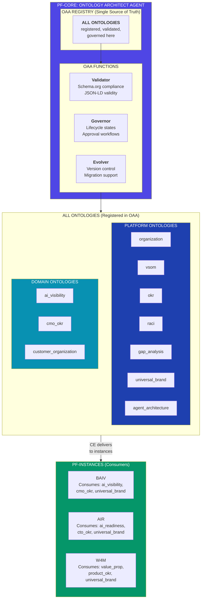

### 2.2 Ontology Categorization

| Category | Ontologies | Scope | Consumers |
|----------|------------|-------|-----------|
| **Platform** | organization, vsom, okr, raci, gap_analysis, universal_brand, agent_architecture | All instances | BAIV, AIR, W4M, future |
| **Domain: Marketing** | ai_visibility, cmo_okr | Marketing products | BAIV |
| **Domain: Technology** | ai_readiness, cto_okr | Tech products | AIR |
| **Domain: Product** | value_proposition, product_okr | Product products | W4M |
| **Domain: Shared** | customer_organization | Multiple | BAIV, AIR |

### 2.3 Ontology Lifecycle (All via OAA)

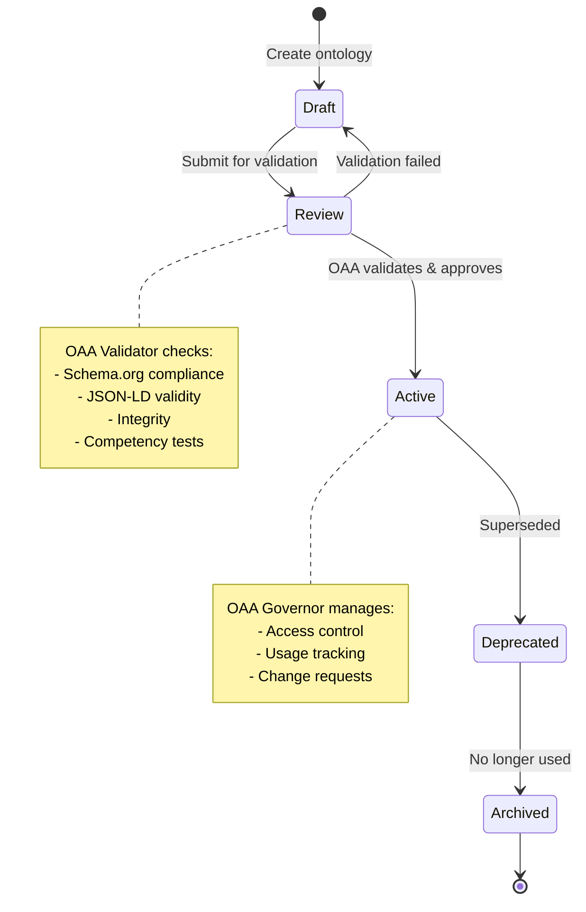

---

## 3. PRD v1.7 Structure with MILANA Delineation

### 3.1 Proposed Section Structure

```
PRD v1.7: BAIV Be AI Visible
│
├── §1 Executive Summary
├── §2 Organizational Alignment Framework
├── §3 PF-Core Architecture
│
├── §4 Value Engineering (VE)
│   ├── VE-100 to VE-600
│   └── §4.7 MILANA INTEGRATION: Priority Scoring Pattern ◄── MILANA
│
├── §5 Context Engineering (CE)
│   ├── CE-100 to CE-500
│   └── §5.6 MILANA INTEGRATION: Additional Retrievers ◄── MILANA
│
├── §6 Gap Analysis Agent
│   └── §6.3 MILANA INTEGRATION: RRF Gap Techniques ◄── MILANA
│
├── §7 Ontology Architect Agent (OAA)
│   ├── §7.1 OAA Functions (All ontologies via OAA)
│   ├── §7.2 Platform Ontologies
│   ├── §7.3 Domain Ontologies
│   └── §7.4 MILANA INTEGRATION: Ontology Contributions ◄── MILANA
│
├── §8 BAIV Instance Configuration
│
├── §9 Be AI Visible Product Definition
│   ├── §9.1 Problem Statement
│   ├── §9.2 Value Proposition
│   ├── §9.3 Process Flow
│   └── §9.4 MILANA INTEGRATION: RRF System (HOLD) ◄── MILANA/HOLD
│
├── §10 Agent Architecture
│   └── §10.5 MILANA INTEGRATION: Skill Enhancements ◄── MILANA
│
├── §11 PMF-Gated Agent Build Model
│
├── §12 API Architecture (NEW)
│   ├── §12.1 API Design Principles
│   ├── §12.2 Endpoint Mappings
│   ├── §12.3 Input/Output Schemas
│   └── §12.4 MILANA INTEGRATION: API Endpoints ◄── MILANA
│
├── §13 Analytics, Dashboards & Scorecards (NEW)
│   ├── §13.1 Analytics Framework
│   ├── §13.2 AI Visibility Metrics Tree
│   ├── §13.3 Dashboard Specifications
│   ├── §13.4 Scorecard Definitions
│   └── §13.5 MILANA INTEGRATION: RRF Analytics (HOLD) ◄── MILANA/HOLD
│
├── §14 Ontology Framework
│   └── (Consolidated - all via OAA per §7)
│
├── §15 Technical Stack
│
├── §16 Data Architecture
│   ├── §16.1 Design Principles
│   ├── §16.2 Core Tables
│   ├── §16.3 BAIV Tables
│   └── §16.4 MILANA INTEGRATION: Table Mappings ◄── MILANA
│
├── §17 Process Flows
│
├── §18 Implementation Roadmap
│
├── §19 Success Metrics
│
└── APPENDIX A: MILANA Integration Summary ◄── MILANA (Complete Reference)
```

### 3.2 MILANA Integration Sections Visualization

```mermaid
flowchart TB
    subgraph PRD["PRD v1.7 STRUCTURE"]
        direction TB
        
        subgraph CORE["CORE SECTIONS"]
            S1["§1-3 Overview"]
            S4["§4 Value Engineering"]
            S5["§5 Context Engineering"]
            S6["§6 Gap Analysis"]
            S7["§7 OAA"]
            S8["§8-11 BAIV Product"]
        end
        
        subgraph NEW["NEW SECTIONS"]
            S12["§12 API Architecture"]
            S13["§13 Analytics & Dashboards"]
        end
        
        subgraph INFRA["INFRASTRUCTURE"]
            S14["§14 Ontology Framework"]
            S15["§15 Technical Stack"]
            S16["§16 Data Architecture"]
            S17["§17-19 Implementation"]
        end
    end

    subgraph MILANA["MILANA INTEGRATION POINTS"]
        direction TB
        M1["§4.7 Priority Scoring"]
        M2["§5.6 Additional Retrievers"]
        M3["§6.3 RRF Gap Techniques"]
        M4["§7.4 Ontology Contributions"]
        M5["§9.4 RRF System<br/>(HOLD)"]
        M6["§10.5 Skill Enhancements"]
        M7["§12.4 API Endpoints"]
        M8["§13.5 RRF Analytics<br/>(HOLD)"]
        M9["§16.4 Table Mappings"]
        MA["APPENDIX A:<br/>Complete Reference"]
    end

    S4 -.-> M1
    S5 -.-> M2
    S6 -.-> M3
    S7 -.-> M4
    S8 -.-> M5
    S8 -.-> M6
    S12 -.-> M7
    S13 -.-> M8
    S16 -.-> M9
    INFRA -.-> MA

    style CORE fill:#1e40af,color:#fff
    style NEW fill:#f59e0b,color:#000
    style INFRA fill:#64748b,color:#fff
    style MILANA fill:#0891b2,color:#fff
    style M5 fill:#dc2626,color:#fff
    style M8 fill:#dc2626,color:#fff
```

---

## 4. NEW: §12 API Architecture

### 4.1 API Design Principles

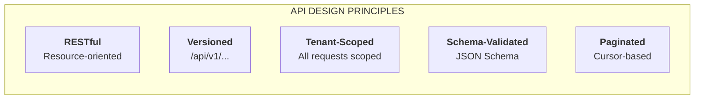

### 4.2 API Endpoint Categories

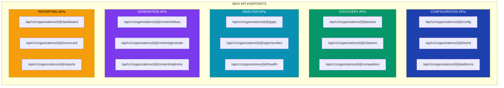

### 4.3 API Input/Output Flow

```mermaid
flowchart LR
    subgraph INPUT["API INPUTS"]
        I1["Organization Context"]
        I2["Brand Configuration"]
        I3["Platform Selection"]
        I4["Query Parameters"]
        I5["Filters & Pagination"]
    end

    subgraph PROCESSING["PROCESSING"]
        P1["Validation Layer"]
        P2["Business Logic"]
        P3["Agent Orchestration"]
        P4["Data Access"]
    end

    subgraph OUTPUT["API OUTPUTS"]
        O1["Structured JSON"]
        O2["Pagination Metadata"]
        O3["Error Responses"]
        O4["Async Job Status"]
    end

    INPUT --> P1 --> P2 --> P3 --> P4 --> OUTPUT

    style INPUT fill:#1e40af,color:#fff
    style PROCESSING fill:#7c3aed,color:#fff
    style OUTPUT fill:#059669,color:#fff
```

### 4.4 MILANA INTEGRATION: API Endpoints

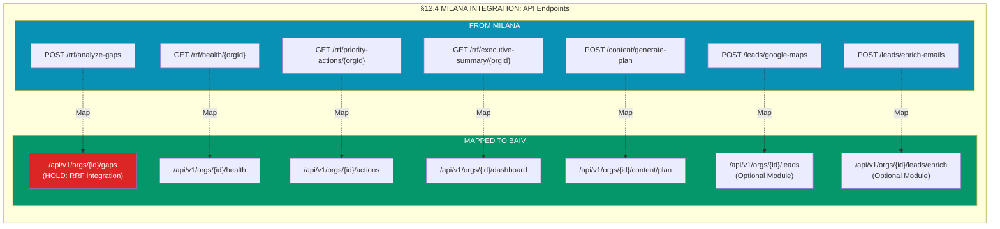

---

## 5. NEW: §13 Analytics, Dashboards & Scorecards

### 5.1 Analytics Framework

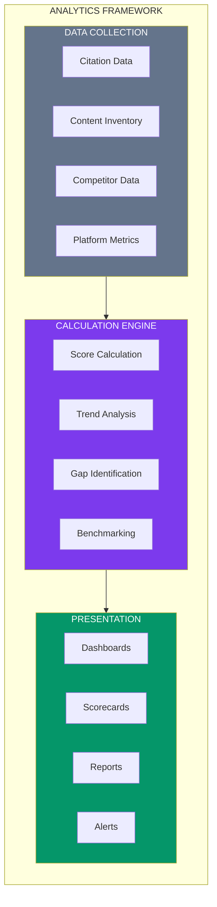

### 5.2 AI Visibility Metrics Tree

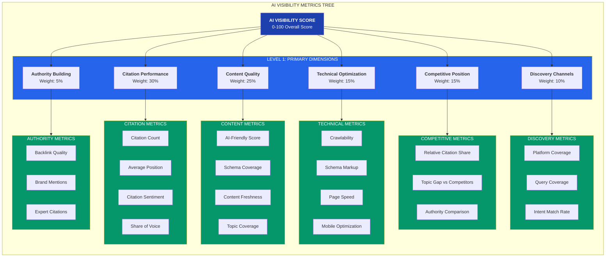

### 5.3 Metrics Tree Detail Table

| Level | Metric | Description | Calculation | Target |
|-------|--------|-------------|-------------|--------|
| **L0** | **AI Visibility Score** | Overall visibility health | Weighted sum of L1 | 75+ |
| **L1** | **Citation Performance** | How often AI platforms cite you | Weighted sum of L2 | 70+ |
| L2 | Citation Count | Monthly citations across platforms | Count | 50+/month |
| L2 | Average Position | Mean position in citations | Average | Top 5 |
| L2 | Citation Sentiment | Positive/neutral/negative ratio | Sentiment analysis | 80%+ positive |
| L2 | Share of Voice | % of category citations | Your citations / Total | 20%+ |
| **L1** | **Content Quality** | AI-readiness of content | Weighted sum of L2 | 75+ |
| L2 | AI-Friendly Score | Content structure for AI | Proprietary score | 80+ |
| L2 | Schema Coverage | % content with schema | Coverage % | 90%+ |
| L2 | Content Freshness | Age-weighted relevance | Decay function | 70+ |
| L2 | Topic Coverage | Topics covered vs needed | Coverage ratio | 80%+ |
| **L1** | **Technical Optimization** | Technical AI discoverability | Weighted sum of L2 | 80+ |
| L2 | Crawlability | Can AI platforms access | Binary + issues | 100% |
| L2 | Schema Markup | Valid structured data | Validation % | 95%+ |
| L2 | Page Speed | Load time for scrapers | Seconds | <3s |
| L2 | Mobile Optimization | Mobile-friendly | Score | 90+ |
| **L1** | **Competitive Position** | Ranking vs competitors | Weighted sum of L2 | 60+ |
| L2 | Relative Citation Share | Your share vs top competitor | Ratio | >1.0 |
| L2 | Topic Gap vs Competitors | Topics they cover, you don't | Gap count | <10 |
| L2 | Authority Comparison | Domain authority comparison | Relative score | Top 3 |
| **L1** | **Discovery Channels** | Presence across AI platforms | Weighted sum of L2 | 70+ |
| L2 | Platform Coverage | # platforms citing you | Count of 5 | 4+ |
| L2 | Query Coverage | % relevant queries citing you | Coverage % | 60%+ |
| L2 | Intent Match Rate | Citation matches query intent | Match % | 80%+ |
| **L1** | **Authority Building** | Long-term authority signals | Weighted sum of L2 | 50+ |
| L2 | Backlink Quality | High-authority backlinks | Count | 100+ |
| L2 | Brand Mentions | Unlinked brand mentions | Count | 50+/month |
| L2 | Expert Citations | Citations by recognized experts | Count | 10+ |

### 5.4 Dashboard Specifications

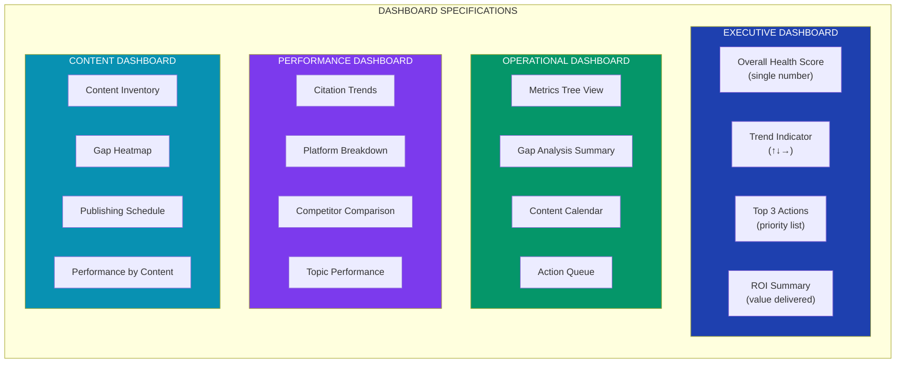

### 5.5 Scorecard Definitions

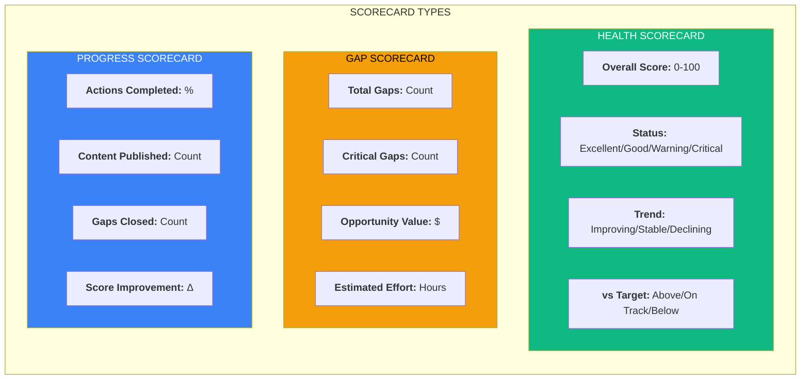

### 5.6 MILANA INTEGRATION: Analytics (HOLD)

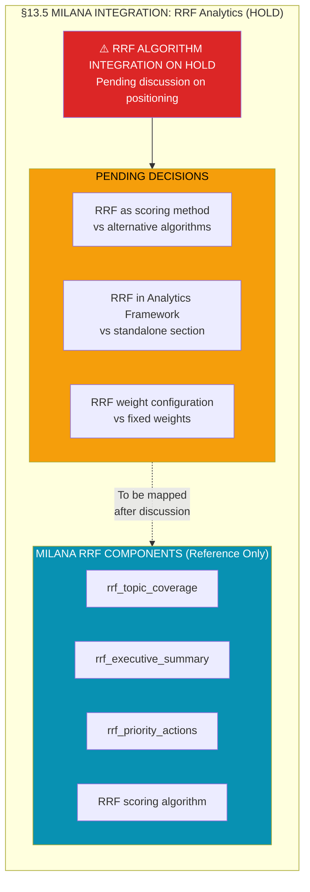

---

## 6. Data Architecture Optimization

### 6.1 Design Principles for Optimization

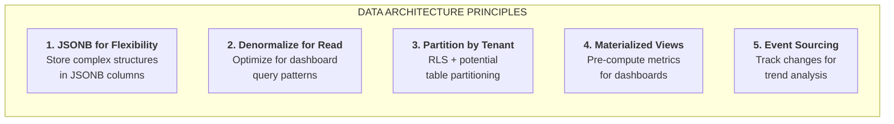

### 6.2 Optimized Table Structure

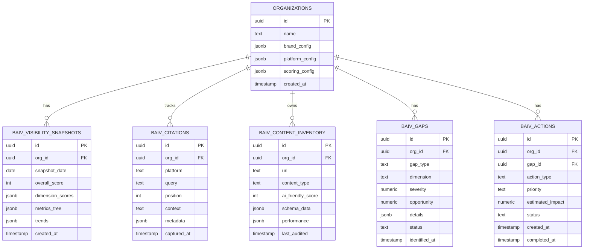

### 6.3 MILANA Table Mapping

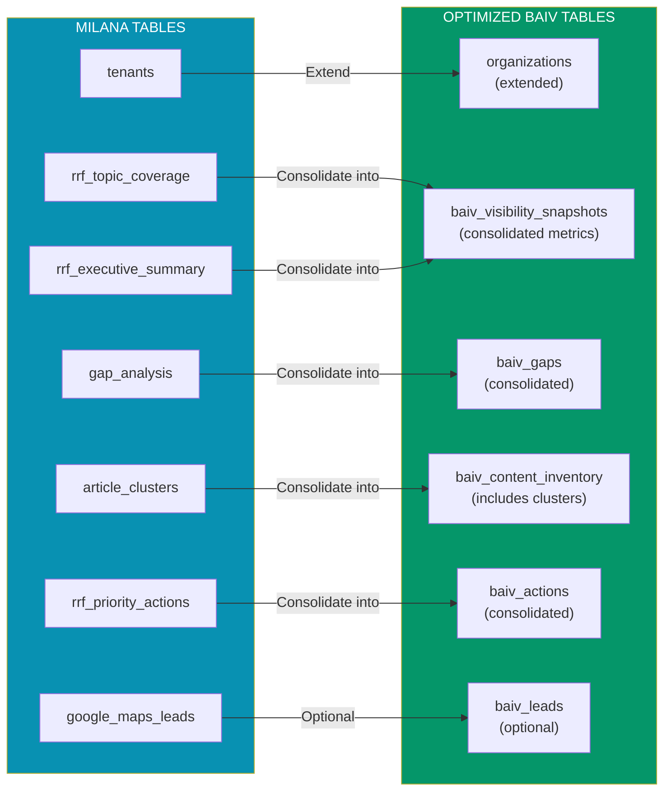

---

## 7. MILANA Integration Summary Diagram

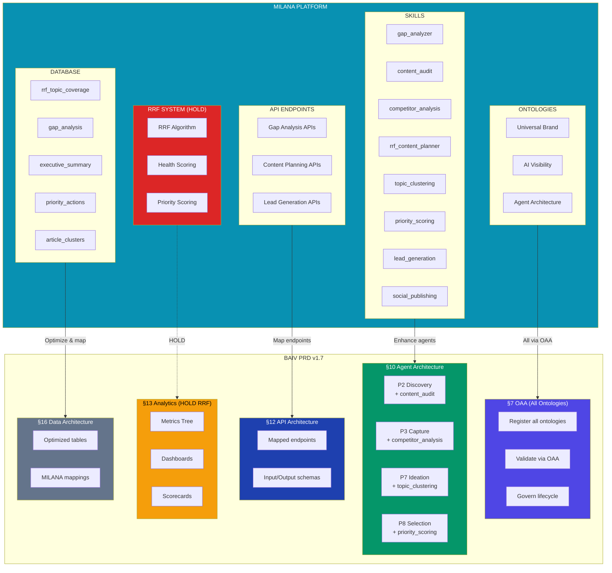

---

## 8. Decision Matrix for v1.7

### 8.1 Confirmed Decisions

| # | Decision | Status | PRD Section |
|---|----------|--------|-------------|
| 1 | All ontologies via PF-Core OAA | ✅ CONFIRMED | §7 |
| 2 | MILANA mappings clearly delineated | ✅ CONFIRMED | Subsections + Appendix A |
| 3 | New API Architecture section | ✅ CONFIRMED | §12 |
| 4 | New Analytics/Dashboards section | ✅ CONFIRMED | §13 |
| 5 | AI Visibility Metrics Tree | ✅ CONFIRMED | §13.2 |
| 6 | Database optimization | ✅ CONFIRMED | §16 |

### 8.2 Items on HOLD

| # | Item | Status | Reason |
|---|------|--------|--------|
| 1 | RRF Algorithm positioning | 🔶 HOLD | Awaiting discussion |
| 2 | RRF in Analytics Framework | 🔶 HOLD | Depends on #1 |
| 3 | RRF scoring weights | 🔶 HOLD | Depends on #1 |

### 8.3 Open Questions

| # | Question | Context |
|---|----------|---------|
| 1 | Should Analytics be §13 or earlier? | Structure placement |
| 2 | Lead Generation: Core or Optional? | Scope clarity |
| 3 | Social Publishing: Core or Optional? | Scope clarity |
| 4 | Dashboard framework: Custom or shadcn? | Technical decision |

---

## 9. Next Steps

1. **Review this scope document** - Confirm structure and content
2. **Discuss RRF positioning** - Resolve HOLD items
3. **Finalize Metrics Tree** - Confirm weights and targets
4. **Approve database optimization** - Confirm table consolidation
5. **Create PRD v1.7** - Implement approved scope

---

**Document Version:** 1.0.0  
**Status:** SCOPE DEFINITION  
**Next Action:** Review and confirm scope before PRD v1.7 creation
