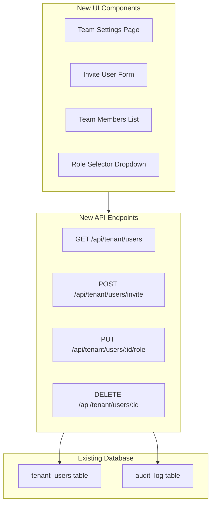

# Role Management Mini-PRD v1.0
## Tenant User Role Management - MVP Gap Closure

**Version:** 1.0.0  
**Date:** January 5, 2026  
**Parent Document:** SECURITY_MULTIUSER_MVP_PRD_PBS_WBS.md  
**Scope:** Close role management gap identified in MVP security implementation  
**Total Effort:** 4-6 hours (1 day)  
**Status:** Ready for Implementation

---

## Executive Summary

This mini-PRD addresses a critical gap in the MVP security plan: **user-facing role management capabilities**. While the database foundation and RLS policies support role-based access control, the MVP lacks API endpoints and UI components for tenant admins to actually manage user roles.

### What This Adds to MVP

| Capability | Status in Base MVP | Added by Mini-PRD |
|------------|-------------------|-------------------|
| Role-based RLS policies | ✅ Implemented | - |
| `tenant_users` table with roles | ✅ Implemented | - |
| Role checking in functions | ✅ Implemented | - |
| **API to manage user roles** | ❌ Missing | ✅ Added |
| **UI to invite/assign roles** | ❌ Missing | ✅ Added |
| **UI to view team members** | ❌ Missing | ✅ Added |
| **Permission matrix documentation** | ❌ Missing | ✅ Added |

---

## 1. Problem Statement

### Current State
The compressed security plan (SECURITY_MULTIUSER_MVP_PRD_PBS_WBS.md) includes:
- RLS policies that check user roles
- Functions like `advance_cycle_stage()` that require owner/admin role
- Database support for role storage in `tenant_users` table
- Auth flow that retrieves user role

### Gap
**No mechanism for tenant admins to:**
1. Invite new users to their tenant
2. Assign or change user roles
3. View all users in their tenant
4. Remove users from their tenant

**Impact:** Without this, role-based permissions are unusable. Admins cannot onboard their team.

---

## 2. Solution Design

### 2.1 Permission Matrix (What Each Role Can Do)

| Action | Owner | Admin | Member |
|--------|-------|-------|--------|
| View all tenant data | ✅ | ✅ | ✅ |
| Create/edit datasets | ✅ | ✅ | ✅ |
| View team members | ✅ | ✅ | ✅ |
| Invite new users | ✅ | ✅ | ❌ |
| Change user roles | ✅ | ✅ | ❌ |
| Remove users | ✅ | ✅ | ❌ |
| Advance cycle stage | ✅ | ✅ | ❌ |
| Delete tenant | ✅ | ❌ | ❌ |
| Billing management | ✅ | ❌ | ❌ |

**Note:** First user who creates tenant is automatically assigned "owner" role.

### 2.2 Architecture Addition



---

## 3. Functional Requirements

### FR-RM-01: List Team Members
**As a** tenant user  
**I want to** view all users in my tenant with their roles  
**So that** I know who has access to our data

**Acceptance Criteria:**
- API endpoint: `GET /api/tenant/users`
- Returns: user_id, email, name, role, joined_at, last_active
- Sorted by role (owner → admin → member), then by name
- Only accessible to authenticated tenant users

### FR-RM-02: Invite User to Tenant
**As a** tenant admin/owner  
**I want to** invite a new user to my tenant  
**So that** I can onboard team members

**Acceptance Criteria:**
- API endpoint: `POST /api/tenant/users/invite`
- Requires: email, role (defaults to 'member')
- Only admin/owner can invite
- Sends email invitation with magic link
- Creates pending invitation record
- Returns: invitation_id, status

### FR-RM-03: Change User Role
**As a** tenant admin/owner  
**I want to** change an existing user's role  
**So that** I can adjust permissions as needed

**Acceptance Criteria:**
- API endpoint: `PUT /api/tenant/users/:userId/role`
- Requires: new_role (owner|admin|member)
- Only admin/owner can change roles
- Cannot change own role
- Logs role change to audit_log
- Returns: success confirmation

### FR-RM-04: Remove User from Tenant
**As a** tenant admin/owner  
**I want to** remove a user from my tenant  
**So that** I can revoke access when needed

**Acceptance Criteria:**
- API endpoint: `DELETE /api/tenant/users/:userId`
- Only admin/owner can remove users
- Cannot remove self
- Cannot remove last owner
- Soft delete (sets is_active=false)
- Logs removal to audit_log
- Returns: success confirmation

---

## 4. Database Changes

### 4.1 New Table: User Invitations

```sql
CREATE TABLE user_invitations (
    invitation_id UUID PRIMARY KEY DEFAULT gen_random_uuid(),
    tenant_id UUID NOT NULL REFERENCES tenants(id),
    email TEXT NOT NULL,
    invited_role TEXT NOT NULL CHECK (invited_role IN ('owner', 'admin', 'member')),
    
    -- Invitation metadata
    invited_by UUID NOT NULL REFERENCES users(id),
    invitation_token TEXT NOT NULL UNIQUE,
    expires_at TIMESTAMPTZ NOT NULL DEFAULT NOW() + INTERVAL '7 days',
    
    -- Status tracking
    status TEXT DEFAULT 'pending' CHECK (status IN ('pending', 'accepted', 'expired', 'cancelled')),
    accepted_at TIMESTAMPTZ,
    accepted_by_user_id UUID,
    
    created_at TIMESTAMPTZ DEFAULT NOW(),
    updated_at TIMESTAMPTZ DEFAULT NOW()
);

CREATE INDEX idx_invitations_email ON user_invitations(email, status);
CREATE INDEX idx_invitations_tenant ON user_invitations(tenant_id, status);
CREATE INDEX idx_invitations_token ON user_invitations(invitation_token);

-- Enable RLS
ALTER TABLE user_invitations ENABLE ROW LEVEL SECURITY;

CREATE POLICY invitations_tenant ON user_invitations
    FOR ALL
    USING (tenant_id = current_setting('app.current_tenant_id')::UUID);
```

### 4.2 Update Existing Table: tenant_users

```sql
-- Add tracking fields to tenant_users
ALTER TABLE tenant_users 
ADD COLUMN is_active BOOLEAN DEFAULT TRUE,
ADD COLUMN joined_at TIMESTAMPTZ DEFAULT NOW(),
ADD COLUMN last_active_at TIMESTAMPTZ DEFAULT NOW(),
ADD COLUMN invited_by UUID REFERENCES users(id);

-- Index for active user lookups
CREATE INDEX idx_tenant_users_active ON tenant_users(tenant_id, is_active);
```

### 4.3 New Functions

```sql
-- Function: Invite user to tenant
CREATE OR REPLACE FUNCTION invite_user_to_tenant(
    p_tenant_id UUID,
    p_email TEXT,
    p_role TEXT DEFAULT 'member',
    p_inviting_user_id UUID
) RETURNS TABLE (
    success BOOLEAN,
    invitation_id UUID,
    invitation_token TEXT,
    message TEXT
) AS $$
DECLARE
    v_inviter_role TEXT;
    v_token TEXT;
    v_inv_id UUID;
    v_existing_user UUID;
BEGIN
    -- Check inviter has permission (admin or owner)
    SELECT role INTO v_inviter_role
    FROM tenant_users
    WHERE tenant_id = p_tenant_id 
      AND user_id = p_inviting_user_id
      AND is_active = TRUE;
    
    IF v_inviter_role NOT IN ('owner', 'admin') THEN
        RETURN QUERY SELECT FALSE, NULL::UUID, NULL::TEXT, 
            'Only owners and admins can invite users'::TEXT;
        RETURN;
    END IF;
    
    -- Check if user already exists in tenant
    SELECT user_id INTO v_existing_user
    FROM tenant_users tu
    JOIN auth.users u ON u.id = tu.user_id
    WHERE tu.tenant_id = p_tenant_id 
      AND u.email = p_email
      AND tu.is_active = TRUE;
    
    IF v_existing_user IS NOT NULL THEN
        RETURN QUERY SELECT FALSE, NULL::UUID, NULL::TEXT,
            'User already exists in this tenant'::TEXT;
        RETURN;
    END IF;
    
    -- Generate secure token
    v_token := encode(gen_random_bytes(32), 'base64');
    
    -- Create invitation
    INSERT INTO user_invitations (
        tenant_id, email, invited_role, invited_by, invitation_token
    ) VALUES (
        p_tenant_id, p_email, p_role, p_inviting_user_id, v_token
    ) RETURNING invitation_id INTO v_inv_id;
    
    -- Log activity
    INSERT INTO organization_activity (
        tenant_id, actor_type, actor_id, action_type, action_category,
        summary, is_highlight
    ) VALUES (
        p_tenant_id, 'user', p_inviting_user_id::TEXT, 'user_invited', 'team',
        'Invited ' || p_email || ' as ' || p_role, FALSE
    );
    
    RETURN QUERY SELECT TRUE, v_inv_id, v_token,
        'Invitation created successfully'::TEXT;
END;
$$ LANGUAGE plpgsql SECURITY DEFINER;

-- Function: Accept invitation
CREATE OR REPLACE FUNCTION accept_invitation(
    p_invitation_token TEXT,
    p_user_id UUID
) RETURNS TABLE (
    success BOOLEAN,
    tenant_id UUID,
    assigned_role TEXT,
    message TEXT
) AS $$
DECLARE
    v_invitation RECORD;
BEGIN
    -- Get invitation details
    SELECT * INTO v_invitation
    FROM user_invitations
    WHERE invitation_token = p_invitation_token
      AND status = 'pending'
      AND expires_at > NOW();
    
    IF v_invitation IS NULL THEN
        RETURN QUERY SELECT FALSE, NULL::UUID, NULL::TEXT,
            'Invalid or expired invitation'::TEXT;
        RETURN;
    END IF;
    
    -- Add user to tenant
    INSERT INTO tenant_users (
        tenant_id, user_id, role, invited_by, joined_at
    ) VALUES (
        v_invitation.tenant_id, 
        p_user_id, 
        v_invitation.invited_role,
        v_invitation.invited_by,
        NOW()
    ) ON CONFLICT (tenant_id, user_id) DO UPDATE
    SET is_active = TRUE,
        role = v_invitation.invited_role,
        joined_at = NOW();
    
    -- Update invitation status
    UPDATE user_invitations
    SET status = 'accepted',
        accepted_at = NOW(),
        accepted_by_user_id = p_user_id,
        updated_at = NOW()
    WHERE invitation_id = v_invitation.invitation_id;
    
    -- Log activity
    INSERT INTO organization_activity (
        tenant_id, actor_type, actor_id, action_type, action_category,
        summary, is_highlight
    ) VALUES (
        v_invitation.tenant_id, 'user', p_user_id::TEXT, 
        'user_joined', 'team',
        'New team member joined', FALSE
    );
    
    RETURN QUERY SELECT TRUE, v_invitation.tenant_id, 
        v_invitation.invited_role, 'Invitation accepted'::TEXT;
END;
$$ LANGUAGE plpgsql SECURITY DEFINER;

-- Function: Update user role
CREATE OR REPLACE FUNCTION update_user_role(
    p_tenant_id UUID,
    p_target_user_id UUID,
    p_new_role TEXT,
    p_requesting_user_id UUID
) RETURNS TABLE (
    success BOOLEAN,
    message TEXT
) AS $$
DECLARE
    v_requester_role TEXT;
    v_old_role TEXT;
    v_owner_count INT;
BEGIN
    -- Check requester has permission
    SELECT role INTO v_requester_role
    FROM tenant_users
    WHERE tenant_id = p_tenant_id 
      AND user_id = p_requesting_user_id
      AND is_active = TRUE;
    
    IF v_requester_role NOT IN ('owner', 'admin') THEN
        RETURN QUERY SELECT FALSE, 
            'Only owners and admins can change roles'::TEXT;
        RETURN;
    END IF;
    
    -- Cannot change own role
    IF p_requesting_user_id = p_target_user_id THEN
        RETURN QUERY SELECT FALSE, 
            'Cannot change your own role'::TEXT;
        RETURN;
    END IF;
    
    -- Get old role
    SELECT role INTO v_old_role
    FROM tenant_users
    WHERE tenant_id = p_tenant_id 
      AND user_id = p_target_user_id
      AND is_active = TRUE;
    
    -- If removing owner, ensure not last owner
    IF v_old_role = 'owner' AND p_new_role != 'owner' THEN
        SELECT COUNT(*) INTO v_owner_count
        FROM tenant_users
        WHERE tenant_id = p_tenant_id
          AND role = 'owner'
          AND is_active = TRUE;
        
        IF v_owner_count <= 1 THEN
            RETURN QUERY SELECT FALSE,
                'Cannot remove last owner'::TEXT;
            RETURN;
        END IF;
    END IF;
    
    -- Update role
    UPDATE tenant_users
    SET role = p_new_role,
        updated_at = NOW()
    WHERE tenant_id = p_tenant_id
      AND user_id = p_target_user_id;
    
    -- Log to audit
    INSERT INTO organization_activity (
        tenant_id, actor_type, actor_id, action_type, action_category,
        summary, details, is_highlight
    ) VALUES (
        p_tenant_id, 'user', p_requesting_user_id::TEXT,
        'role_changed', 'team',
        'User role changed from ' || v_old_role || ' to ' || p_new_role,
        jsonb_build_object(
            'target_user_id', p_target_user_id,
            'old_role', v_old_role,
            'new_role', p_new_role
        ),
        FALSE
    );
    
    RETURN QUERY SELECT TRUE, 'Role updated successfully'::TEXT;
END;
$$ LANGUAGE plpgsql SECURITY DEFINER;

-- Function: Remove user from tenant
CREATE OR REPLACE FUNCTION remove_user_from_tenant(
    p_tenant_id UUID,
    p_target_user_id UUID,
    p_requesting_user_id UUID
) RETURNS TABLE (
    success BOOLEAN,
    message TEXT
) AS $$
DECLARE
    v_requester_role TEXT;
    v_target_role TEXT;
    v_owner_count INT;
BEGIN
    -- Check requester has permission
    SELECT role INTO v_requester_role
    FROM tenant_users
    WHERE tenant_id = p_tenant_id 
      AND user_id = p_requesting_user_id
      AND is_active = TRUE;
    
    IF v_requester_role NOT IN ('owner', 'admin') THEN
        RETURN QUERY SELECT FALSE,
            'Only owners and admins can remove users'::TEXT;
        RETURN;
    END IF;
    
    -- Cannot remove self
    IF p_requesting_user_id = p_target_user_id THEN
        RETURN QUERY SELECT FALSE,
            'Cannot remove yourself'::TEXT;
        RETURN;
    END IF;
    
    -- Get target role
    SELECT role INTO v_target_role
    FROM tenant_users
    WHERE tenant_id = p_tenant_id
      AND user_id = p_target_user_id
      AND is_active = TRUE;
    
    -- If removing owner, ensure not last owner
    IF v_target_role = 'owner' THEN
        SELECT COUNT(*) INTO v_owner_count
        FROM tenant_users
        WHERE tenant_id = p_tenant_id
          AND role = 'owner'
          AND is_active = TRUE;
        
        IF v_owner_count <= 1 THEN
            RETURN QUERY SELECT FALSE,
                'Cannot remove last owner'::TEXT;
            RETURN;
        END IF;
    END IF;
    
    -- Soft delete user
    UPDATE tenant_users
    SET is_active = FALSE,
        updated_at = NOW()
    WHERE tenant_id = p_tenant_id
      AND user_id = p_target_user_id;
    
    -- Log activity
    INSERT INTO organization_activity (
        tenant_id, actor_type, actor_id, action_type, action_category,
        summary, is_highlight
    ) VALUES (
        p_tenant_id, 'user', p_requesting_user_id::TEXT,
        'user_removed', 'team',
        'User removed from team', FALSE
    );
    
    RETURN QUERY SELECT TRUE, 'User removed successfully'::TEXT;
END;
$$ LANGUAGE plpgsql SECURITY DEFINER;

-- Grant execute permissions
GRANT EXECUTE ON FUNCTION invite_user_to_tenant TO authenticated;
GRANT EXECUTE ON FUNCTION accept_invitation TO authenticated;
GRANT EXECUTE ON FUNCTION update_user_role TO authenticated;
GRANT EXECUTE ON FUNCTION remove_user_from_tenant TO authenticated;
```

---

## 5. API Implementation

### 5.1 Endpoint Specifications

#### GET /api/tenant/users
**Purpose:** List all users in current tenant  
**Auth:** Required (any role)  
**Response:**
```typescript
{
  users: [
    {
      user_id: string;
      email: string;
      name: string;
      role: 'owner' | 'admin' | 'member';
      is_active: boolean;
      joined_at: string;
      last_active_at: string;
    }
  ]
}
```

#### POST /api/tenant/users/invite
**Purpose:** Invite new user to tenant  
**Auth:** Required (admin or owner)  
**Request:**
```typescript
{
  email: string;
  role?: 'admin' | 'member'; // defaults to 'member'
}
```
**Response:**
```typescript
{
  success: boolean;
  invitation_id: string;
  message: string;
}
```

#### PUT /api/tenant/users/:userId/role
**Purpose:** Change user's role  
**Auth:** Required (admin or owner)  
**Request:**
```typescript
{
  new_role: 'owner' | 'admin' | 'member';
}
```
**Response:**
```typescript
{
  success: boolean;
  message: string;
}
```

#### DELETE /api/tenant/users/:userId
**Purpose:** Remove user from tenant  
**Auth:** Required (admin or owner)  
**Response:**
```typescript
{
  success: boolean;
  message: string;
}
```

#### GET /api/invitations/:token
**Purpose:** Get invitation details (for accept page)  
**Auth:** Optional  
**Response:**
```typescript
{
  tenant_name: string;
  invited_role: string;
  invited_by_name: string;
  expires_at: string;
  is_valid: boolean;
}
```

#### POST /api/invitations/:token/accept
**Purpose:** Accept invitation and join tenant  
**Auth:** Required  
**Response:**
```typescript
{
  success: boolean;
  tenant_id: string;
  message: string;
}
```

---

## 6. UI/UX Implementation

### 6.1 Required UI Components (Referenced in Figma Design System)

Based on the Figma design system architecture, these components should be implemented using **Shadcn/UI** with **schema.org** grounded data structures:

#### Component 1: TeamSettingsPage
**Location:** `app/settings/team/page.tsx`  
**Design Reference:** Settings page template in Figma  
**Layout:**
```
┌─────────────────────────────────────────────┐
│ Team Settings                               │
├─────────────────────────────────────────────┤
│                                             │
│ [+ Invite Team Member] button               │
│                                             │
│ Team Members (12)                           │
│ ┌─────────────────────────────────────────┐ │
│ │ ○ Alice Smith     Owner      [⋮]       │ │
│ │   alice@company.com                     │ │
│ │   Joined Dec 2024 · Active now          │ │
│ ├─────────────────────────────────────────┤ │
│ │ ○ Bob Jones       Admin      [⋮]       │ │
│ │   bob@company.com                       │ │
│ │   Joined Jan 2025 · Active 2h ago       │ │
│ ├─────────────────────────────────────────┤ │
│ │ ○ Carol Davis     Member     [⋮]       │ │
│ │   carol@company.com                     │ │
│ │   Joined Jan 2025 · Active 1d ago       │ │
│ └─────────────────────────────────────────┘ │
│                                             │
│ Pending Invitations (2)                     │
│ ┌─────────────────────────────────────────┐ │
│ │ dave@company.com - Member               │ │
│ │ Invited by Alice · Expires in 5 days    │ │
│ │                            [Cancel]     │ │
│ └─────────────────────────────────────────┘ │
└─────────────────────────────────────────────┘
```

**Shadcn Components Used:**
- `Card` - Container for member list
- `Avatar` - User profile pictures
- `Badge` - Role indicators
- `DropdownMenu` - Actions menu (⋮)
- `Button` - Invite button, action buttons
- `Separator` - Visual dividers

**Data Structure (schema.org):**
```typescript
interface TeamMember {
  "@context": "https://schema.org";
  "@type": "Person";
  identifier: string; // user_id
  email: string;
  name: string;
  roleName: "owner" | "admin" | "member";
  memberOf: {
    "@type": "Organization";
    identifier: string; // tenant_id
  };
  dateCreated: string; // joined_at
  lastActivityDate: string;
  isActive: boolean;
}
```

#### Component 2: InviteUserDialog
**Location:** `components/team/InviteUserDialog.tsx`  
**Design Reference:** Modal dialog pattern in Figma  
**Layout:**
```
┌───────────────────────────────────┐
│ Invite Team Member            [×] │
├───────────────────────────────────┤
│                                   │
│ Email Address                     │
│ [___________________________]     │
│                                   │
│ Role                              │
│ [Member ▼]                        │
│   • Owner (full access)           │
│   • Admin (can manage team)       │
│   • Member (view & edit data)     │
│                                   │
│               [Cancel] [Send Invite] │
└───────────────────────────────────┘
```

**Shadcn Components Used:**
- `Dialog` - Modal container
- `Form` - Form wrapper with validation
- `Input` - Email input field
- `Select` - Role dropdown
- `Button` - Action buttons

**Validation Rules:**
- Email: valid format, not already in tenant
- Role: member or admin (not owner via UI)

#### Component 3: UserActionsDropdown
**Location:** `components/team/UserActionsDropdown.tsx`  
**Design Reference:** Dropdown menu pattern in Figma  
**Layout:**
```
┌─────────────────────┐
│ Change Role      ▶  │ ┌──────────────┐
│ Remove from Team    │ │ Owner        │
│                     │ │ Admin        │
└─────────────────────┘ │ Member       │
                        └──────────────┘
```

**Shadcn Components Used:**
- `DropdownMenu` - Main menu
- `DropdownMenuSub` - Role submenu
- `AlertDialog` - Confirmation for removal

**Conditional Display:**
- Hide "Change Role" for self
- Hide "Remove from Team" for self
- Show warning before removing owner

#### Component 4: AcceptInvitationPage
**Location:** `app/invitations/[token]/page.tsx`  
**Design Reference:** Onboarding flow in Figma  
**Layout:**
```
┌─────────────────────────────────────┐
│                                     │
│          [Company Logo]             │
│                                     │
│    You've been invited to join     │
│         Acme Corporation            │
│                                     │
│  Alice Smith has invited you as     │
│  an Admin to collaborate on the     │
│  AI Visibility Platform.            │
│                                     │
│     [Accept Invitation]             │
│                                     │
│  Expires in 5 days                  │
│                                     │
└─────────────────────────────────────┘
```

**Shadcn Components Used:**
- `Card` - Invitation container
- `Button` - Accept button
- `Alert` - Expiry warning

**Flow:**
1. User clicks email link with token
2. If not logged in → redirect to login/signup
3. If logged in → show invitation details
4. On accept → call API, redirect to tenant dashboard

#### Component 5: RoleBadge
**Location:** `components/team/RoleBadge.tsx`  
**Design Reference:** Badge variants in Figma design tokens  
**Variants:**
```
[Owner]   - Purple background, white text
[Admin]   - Blue background, white text
[Member]  - Gray background, dark text
```

**Shadcn Components Used:**
- `Badge` - Base component with variant styles

### 6.2 Design System Integration

All components follow the established Figma design system:

**Color Tokens:**
- `--role-owner`: Purple-600
- `--role-admin`: Blue-600
- `--role-member`: Gray-500

**Spacing:**
- List items: 16px padding
- Card gaps: 24px
- Form fields: 12px gap

**Typography:**
- User names: Text-base, Font-semibold
- Emails: Text-sm, Text-muted-foreground
- Meta info: Text-xs, Text-muted-foreground

**Accessibility:**
- All interactive elements keyboard navigable
- Role changes require confirmation
- Screen reader labels for all icons
- Focus indicators on all inputs

---

## 7. Implementation Plan (WBS)

### Day 1: Role Management Implementation (4-6 hours)

| Task | Effort | Output | Dependencies |
|------|--------|--------|--------------|
| **7.1** Apply database migration (tables + functions) | 30 min | Migration executed | Supabase access |
| **7.2** Create API route: GET /api/tenant/users | 30 min | users list endpoint | Migration complete |
| **7.3** Create API route: POST /api/tenant/users/invite | 45 min | invite endpoint | Migration complete |
| **7.4** Create API route: PUT /api/tenant/users/:id/role | 30 min | role update endpoint | Migration complete |
| **7.5** Create API route: DELETE /api/tenant/users/:id | 30 min | remove user endpoint | Migration complete |
| **7.6** Create API route: GET/POST /api/invitations/:token | 30 min | invitation flow | Migration complete |
| **7.7** Build TeamSettingsPage component | 1 hr | team management UI | API routes complete |
| **7.8** Build InviteUserDialog component | 45 min | invite modal | API routes complete |
| **7.9** Build UserActionsDropdown component | 30 min | actions menu | API routes complete |
| **7.10** Build AcceptInvitationPage | 45 min | invitation accept flow | API routes complete |
| **7.11** Test role management flows | 30 min | test results | All components built |

**Total:** 5-6 hours

---

## 8. Testing Checklist

### 8.1 Database Tests
```sql
-- Test: Invite user
DO $$
DECLARE
    result RECORD;
BEGIN
    SELECT * INTO result FROM invite_user_to_tenant(
        'tenant-uuid',
        'newuser@test.com',
        'member',
        'admin-user-uuid'
    );
    ASSERT result.success = TRUE, 'Invitation failed';
END $$;

-- Test: Role change restrictions
DO $$
BEGIN
    -- Should fail: cannot change own role
    ASSERT (
        SELECT success FROM update_user_role(
            'tenant-uuid',
            'user-uuid',
            'owner',
            'user-uuid' -- same user
        )
    ) = FALSE;
END $$;

-- Test: Cannot remove last owner
DO $$
BEGIN
    ASSERT (
        SELECT success FROM remove_user_from_tenant(
            'tenant-uuid',
            'last-owner-uuid',
            'admin-uuid'
        )
    ) = FALSE;
END $$;
```

### 8.2 API Tests
```typescript
// Test: List users
const response = await fetch('/api/tenant/users', {
  headers: { Authorization: `Bearer ${token}` }
});
expect(response.status).toBe(200);
expect(response.body.users).toBeArray();

// Test: Invite requires admin role
const response = await fetch('/api/tenant/users/invite', {
  method: 'POST',
  headers: { 
    Authorization: `Bearer ${memberToken}` // member, not admin
  },
  body: JSON.stringify({ email: 'test@test.com' })
});
expect(response.status).toBe(403);

// Test: Role change validation
const response = await fetch('/api/tenant/users/123/role', {
  method: 'PUT',
  body: JSON.stringify({ new_role: 'invalid_role' })
});
expect(response.status).toBe(400);
```

### 8.3 UI Tests
```typescript
// Test: Team page renders users
render(<TeamSettingsPage />);
await waitFor(() => {
  expect(screen.getByText('alice@company.com')).toBeInTheDocument();
  expect(screen.getByText('Owner')).toBeInTheDocument();
});

// Test: Invite dialog validation
render(<InviteUserDialog open={true} />);
fireEvent.click(screen.getByText('Send Invite'));
expect(screen.getByText('Email is required')).toBeInTheDocument();

// Test: Cannot change own role
render(<UserActionsDropdown user={currentUser} />);
expect(screen.queryByText('Change Role')).not.toBeInTheDocument();
```

---

## 9. Integration with Existing MVP

### 9.1 How This Fits into Base MVP Timeline

The base MVP (SECURITY_MULTIUSER_MVP_PRD_PBS_WBS.md) is structured as 3 days:
- **Day 1:** Auth + Security foundation
- **Day 2:** Collaboration foundation
- **Day 3:** UI + Ship

**Recommended Integration:**
Add role management as **Day 4** OR insert into Day 3:

**Option A: Day 4 (Safest)**
- Complete base MVP Days 1-3 as planned
- Add Day 4 for role management (this mini-PRD)
- Total MVP: 4 days

**Option B: Merge into Day 3 (Aggressive)**
- Day 3 becomes "UI + Role Management + Ship"
- Add 2-3 hours to Day 3 effort
- Total MVP: still 3 days, but longer final day

### 9.2 Updated PBS (Product Breakdown Structure)

Add to existing PBS structure:

```
PBS-5.0 UI Package
├── PBS-5.1 Login/Signup Pages
├── PBS-5.2 Tenant Selector
├── PBS-5.3 Org Status Card
├── PBS-5.4 Online Users Badge
├── PBS-5.5 Activity Feed
├── PBS-5.6 Team Settings Page ← NEW
├── PBS-5.7 Invite User Dialog ← NEW
└── PBS-5.8 Accept Invitation Page ← NEW

PBS-4.0 API Package
├── PBS-4.1 Context Middleware
├── PBS-4.2 Presence Endpoints
├── PBS-4.3 Lock Endpoints
├── PBS-4.4 Cycle Endpoints
├── PBS-4.5 Activity Endpoints
└── PBS-4.6 User Management Endpoints ← NEW
```

---

## 10. What to Do with the Compressed Plan

### 10.1 Document Relationship

```
SECURITY_MULTIUSER_MVP_PRD_PBS_WBS.md (Base Plan)
├── Defines foundation: RLS, auth, tables
├── Status: Implementation-ready
└── Gap: No user management UI/API

ROLE_MANAGEMENT_MINI_PRD_v1.0.md (This Document)
├── Extends base plan
├── Closes role management gap
└── Status: Implementation-ready

SECURITY_PLAN_MVP_Ontology_Platform.md (Comprehensive Plan)
├── Enterprise-grade security controls
├── Consultant access, agent authority
└── Status: Reference for post-MVP
```

### 10.2 Recommended Actions

**Immediate (This Sprint):**
1. ✅ Keep SECURITY_MULTIUSER_MVP_PRD_PBS_WBS.md as primary implementation guide
2. ✅ Use THIS document (ROLE_MANAGEMENT_MINI_PRD) as Day 4 extension
3. ✅ Implement in sequence: Base MVP → Role Management
4. ✅ Update base MVP document with reference to this mini-PRD

**Post-MVP (Future Sprints):**
5. Implement consultant access model (from SECURITY_PLAN_MVP)
6. Implement agent authority policies (from SECURITY_PLAN_MVP)
7. Add agency-level cross-tenant features (from SECURITY_PLAN_MVP)

### 10.3 Update Base Document

Add to SECURITY_MULTIUSER_MVP_PRD_PBS_WBS.md:

```markdown
## Appendix D: Role Management Extension

For complete role management implementation (user invites, role changes, team UI),
see: ROLE_MANAGEMENT_MINI_PRD_v1.0.md

This extension adds:
- API endpoints for user management
- Team settings UI components
- Invitation flow with email tokens
- Permission matrix documentation

Effort: +1 day (4-6 hours)
Status: Optional for MVP, recommended for production readiness
```

---

## 11. Success Criteria

### 11.1 Done When

- ✅ Tenant admin can view all users in their tenant
- ✅ Tenant admin can invite new user via email
- ✅ Invited user receives email with magic link
- ✅ User can accept invitation and join tenant
- ✅ Tenant admin can change user roles (with restrictions)
- ✅ Tenant admin can remove users (with safeguards)
- ✅ All role changes logged to audit trail
- ✅ UI components match Figma design system
- ✅ All tests passing (DB, API, UI)

### 11.2 Acceptance Test Scenario

```gherkin
Scenario: Complete role management flow
  Given Alice is owner of "Acme Corp" tenant
  When Alice invites bob@test.com as Admin
  Then Bob receives invitation email
  
  When Bob clicks invitation link
  And Bob logs in with Google
  And Bob accepts invitation
  Then Bob is added to Acme Corp as Admin
  And Bob sees Acme Corp dashboard
  
  When Alice views team settings
  Then Alice sees Bob listed as Admin
  
  When Alice changes Bob's role to Member
  Then Bob's role is updated to Member
  And role change is logged to audit
  
  When Alice tries to change her own role
  Then operation fails with "Cannot change own role"
  
  When Alice removes Bob from team
  Then Bob loses access to Acme Corp
  And Bob no longer sees Acme Corp in tenant list
```

---

## 12. Deployment Checklist

### Pre-Deployment
- [ ] Review and test all SQL migrations
- [ ] Environment variables configured
- [ ] Email templates for invitations created
- [ ] Figma designs reviewed and approved

### Database Deployment
- [ ] Apply migration: user_invitations table
- [ ] Apply migration: tenant_users updates
- [ ] Deploy functions: invite_user_to_tenant
- [ ] Deploy functions: accept_invitation
- [ ] Deploy functions: update_user_role
- [ ] Deploy functions: remove_user_from_tenant
- [ ] Verify RLS policies active
- [ ] Run database test suite

### API Deployment
- [ ] Deploy user management endpoints
- [ ] Deploy invitation endpoints
- [ ] Test with Postman/API client
- [ ] Verify auth middleware working
- [ ] Test role-based access controls

### UI Deployment
- [ ] Deploy TeamSettingsPage
- [ ] Deploy InviteUserDialog
- [ ] Deploy AcceptInvitationPage
- [ ] Deploy supporting components
- [ ] Verify responsive design
- [ ] Test on mobile devices
- [ ] Run accessibility audit

### Post-Deployment
- [ ] Smoke test in production
- [ ] Verify email invitations sent
- [ ] Test complete onboarding flow
- [ ] Monitor error logs
- [ ] Update documentation

---

## 13. Risk Register

| Risk | Probability | Impact | Mitigation |
|------|-------------|--------|------------|
| Invitation emails not delivered | Medium | High | Use proven email service (SendGrid/Postman), test templates |
| Invitation token security | Low | Critical | Use crypto-secure random tokens, expire after 7 days |
| Accidentally removing last owner | Low | High | Database constraint prevents, UI hides option |
| User changes own role to owner | Low | Critical | Database function blocks, RLS enforces |
| Duplicate invitations | Medium | Low | Check existing invitations before creating new |

---

## Appendix A: Email Templates

### Invitation Email Template

**Subject:** You've been invited to join {{tenant_name}} on AI Visibility Platform

```html
<!DOCTYPE html>
<html>
<body style="font-family: sans-serif; max-width: 600px; margin: 0 auto;">
  <div style="background: #f5f5f5; padding: 24px; border-radius: 8px;">
    <h1 style="margin: 0 0 16px 0;">You're invited!</h1>
    
    <p>{{inviter_name}} has invited you to join <strong>{{tenant_name}}</strong> as {{role}} on the AI Visibility Platform.</p>
    
    <p>Click the button below to accept your invitation:</p>
    
    <a href="{{invitation_url}}" 
       style="display: inline-block; background: #0066cc; color: white; 
              padding: 12px 24px; text-decoration: none; border-radius: 4px;">
      Accept Invitation
    </a>
    
    <p style="color: #666; font-size: 14px; margin-top: 24px;">
      This invitation expires in 7 days.<br>
      If you didn't expect this invitation, you can ignore this email.
    </p>
  </div>
</body>
</html>
```

---

## Appendix B: TypeScript Interfaces

```typescript
// API Types
export interface TeamMember {
  user_id: string;
  email: string;
  name: string | null;
  role: 'owner' | 'admin' | 'member';
  is_active: boolean;
  joined_at: string;
  last_active_at: string;
  avatar_url?: string;
}

export interface UserInvitation {
  invitation_id: string;
  email: string;
  invited_role: 'owner' | 'admin' | 'member';
  invited_by: string;
  invited_by_name: string;
  status: 'pending' | 'accepted' | 'expired' | 'cancelled';
  expires_at: string;
  created_at: string;
}

export interface InviteUserRequest {
  email: string;
  role?: 'admin' | 'member';
}

export interface UpdateRoleRequest {
  new_role: 'owner' | 'admin' | 'member';
}

// Component Props
export interface TeamSettingsPageProps {
  initialUsers?: TeamMember[];
  initialInvitations?: UserInvitation[];
}

export interface InviteUserDialogProps {
  open: boolean;
  onOpenChange: (open: boolean) => void;
  onSuccess: () => void;
}

export interface UserActionsDropdownProps {
  user: TeamMember;
  currentUserId: string;
  onRoleChange: (newRole: string) => void;
  onRemove: () => void;
}

export interface RoleBadgeProps {
  role: 'owner' | 'admin' | 'member';
  size?: 'sm' | 'md' | 'lg';
}
```

---

## Appendix C: Migration Script

Complete migration script to apply all database changes:

```sql
-- ============================================================
-- ROLE MANAGEMENT MINI-PRD MIGRATION v1.0
-- Run after base MVP security migration
-- ============================================================

BEGIN;

-- 1. Update tenant_users table
ALTER TABLE tenant_users 
ADD COLUMN IF NOT EXISTS is_active BOOLEAN DEFAULT TRUE,
ADD COLUMN IF NOT EXISTS joined_at TIMESTAMPTZ DEFAULT NOW(),
ADD COLUMN IF NOT EXISTS last_active_at TIMESTAMPTZ DEFAULT NOW(),
ADD COLUMN IF NOT EXISTS invited_by UUID REFERENCES users(id);

CREATE INDEX IF NOT EXISTS idx_tenant_users_active 
ON tenant_users(tenant_id, is_active);

-- 2. Create user_invitations table
CREATE TABLE IF NOT EXISTS user_invitations (
    invitation_id UUID PRIMARY KEY DEFAULT gen_random_uuid(),
    tenant_id UUID NOT NULL REFERENCES tenants(id) ON DELETE CASCADE,
    email TEXT NOT NULL,
    invited_role TEXT NOT NULL CHECK (invited_role IN ('owner', 'admin', 'member')),
    
    invited_by UUID NOT NULL REFERENCES users(id),
    invitation_token TEXT NOT NULL UNIQUE,
    expires_at TIMESTAMPTZ NOT NULL DEFAULT NOW() + INTERVAL '7 days',
    
    status TEXT DEFAULT 'pending' CHECK (status IN ('pending', 'accepted', 'expired', 'cancelled')),
    accepted_at TIMESTAMPTZ,
    accepted_by_user_id UUID,
    
    created_at TIMESTAMPTZ DEFAULT NOW(),
    updated_at TIMESTAMPTZ DEFAULT NOW()
);

CREATE INDEX IF NOT EXISTS idx_invitations_email 
ON user_invitations(email, status);

CREATE INDEX IF NOT EXISTS idx_invitations_tenant 
ON user_invitations(tenant_id, status);

CREATE INDEX IF NOT EXISTS idx_invitations_token 
ON user_invitations(invitation_token);

-- 3. Enable RLS on invitations
ALTER TABLE user_invitations ENABLE ROW LEVEL SECURITY;

DROP POLICY IF EXISTS invitations_tenant ON user_invitations;
CREATE POLICY invitations_tenant ON user_invitations
    FOR ALL
    USING (tenant_id = current_setting('app.current_tenant_id', true)::UUID);

-- 4. Deploy functions (see section 4.3 above)
-- [Insert all function definitions from section 4.3]

-- 5. Verification
DO $$
BEGIN
    -- Check tables exist
    ASSERT (SELECT COUNT(*) FROM pg_tables 
            WHERE tablename = 'user_invitations') = 1,
        'user_invitations table not created';
    
    -- Check RLS enabled
    ASSERT (SELECT rowsecurity FROM pg_tables 
            WHERE tablename = 'user_invitations') = TRUE,
        'RLS not enabled on user_invitations';
    
    -- Check functions exist
    ASSERT (SELECT COUNT(*) FROM pg_proc 
            WHERE proname = 'invite_user_to_tenant') = 1,
        'invite_user_to_tenant function not created';
    
    RAISE NOTICE 'Role management migration completed successfully';
END $$;

COMMIT;
```

---

*Document Version 1.0.0 - Ready for Implementation*
*Parent Document: SECURITY_MULTIUSER_MVP_PRD_PBS_WBS.md*
*Integration: Day 4 of MVP or merge into Day 3*
