# MVP Security Architecture: Ontology & Data Integrity Framework

## MCSB-Aligned Security for Supabase JSONB Multi-Tenant Platform

**Version:** 2.0  
**Date:** December 21, 2025  
**Scope:** Platform Foundation (PF-Core) with BAIV, AIR, and W4M Ventures  
**Architecture:** Supabase PostgreSQL with JSONB Ontologies, Multi-Tenant RLS, Claude Agent SDK

---

## Executive Summary

This document translates Microsoft Cloud Security Benchmark (MCSB) enterprise security controls into practical implementations for a Supabase-based ontology platform. The architecture addresses access control and data integrity for JSONB ontology files with explicit agentic controls that create tenant-unique views supporting collaborative dataset modification by multiple users, consultants, and AI agents.

### Architecture Overview Diagram

The following diagram illustrates the complete security architecture from user access through to data storage, showing all security enforcement layers:

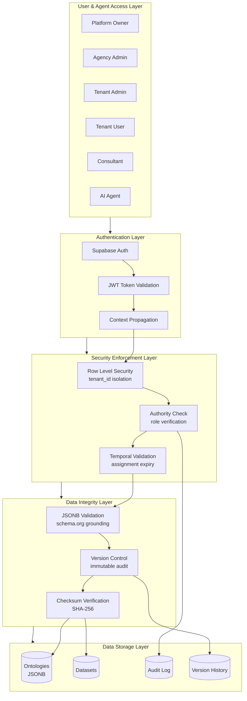

This layered architecture ensures that every request passes through authentication, authorization, and integrity validation before reaching the data layer. Each layer adds specific security controls mapped to MCSB requirements.

---

## 1. MCSB Control Domain Mapping

The following table maps Microsoft Cloud Security Benchmark domains to platform-specific implementations:

| MCSB Domain | Platform Translation | Implementation |
|-------------|---------------------|----------------|
| Network Security (NS) | Supabase edge functions, RLS as network-level isolation | RLS policies per table |
| Identity Management (IM) | Supabase Auth + tenant context propagation | JWT claims + app settings |
| Privileged Access (PA) | Agent authority boundaries, consultant role hierarchies | Authority policy framework |
| Data Protection (DP) | JSONB integrity validation, schema enforcement | Validation triggers + checksums |
| Logging & Threat Detection (LT) | Audit trails, change tracking, agent activity logs | Unified audit log + pg_notify |
| Governance & Strategy (GS) | Ontology governance, OAA Registry compliance | Schema.org grounding |

---

## 2. Multi-Tenant Access Control Architecture

### 2.1 Tenant Isolation Flow

The diagram below shows how requests are processed through the multi-tenant isolation system, demonstrating the decision flow for granting or denying access:

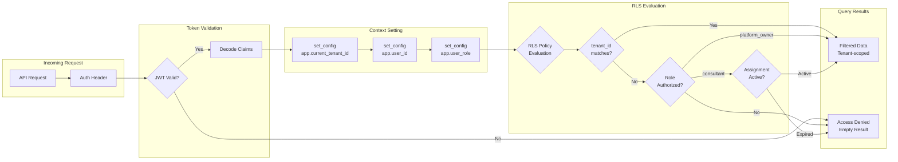

This flow ensures that every database query is automatically filtered based on the authenticated user's context. Even if application code contains bugs, the database-level RLS policies prevent cross-tenant data access.

### 2.2 Role Hierarchy

The platform implements a hierarchical role system with decreasing privilege levels:

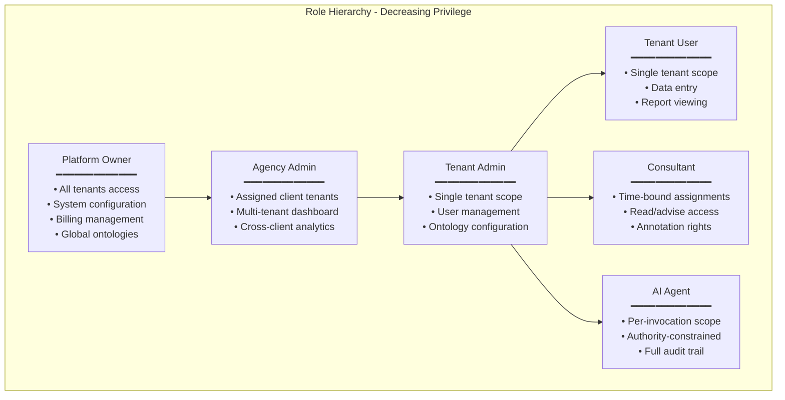

Each role has explicit RLS policies that determine data visibility. The hierarchy supports the principle of least privilege (MCSB: PA-7) while enabling collaborative workflows.

### 2.3 RLS Policy Implementation

```sql
-- Base tenant isolation (MCSB: NS-1, PA-7)
CREATE POLICY tenant_isolation_base ON {table_name}
    FOR ALL
    USING (
        tenant_id = current_setting('app.current_tenant_id')::UUID
        OR 
        current_setting('app.user_role', true) = 'platform_owner'
        OR
        (
            current_setting('app.user_role', true) = 'consultant'
            AND tenant_id IN (
                SELECT tenant_id 
                FROM consultant_assignments 
                WHERE consultant_id = current_setting('app.user_id')::UUID
                AND is_active = true
                AND expires_at > NOW()
            )
        )
    );

-- Agency-level access for multi-client consultancies
CREATE POLICY agency_cross_tenant ON {table_name}
    FOR SELECT
    USING (
        current_setting('app.agency_id', true) IS NOT NULL
        AND tenant_id IN (
            SELECT tenant_id 
            FROM agency_client_relationships 
            WHERE agency_id = current_setting('app.agency_id')::UUID
            AND relationship_status = 'active'
        )
    );

-- Service role bypass for backend operations
CREATE POLICY service_role_bypass ON {table_name}
    FOR ALL
    TO service_role
    USING (true);
```

---

## 3. Ontology Integrity & JSONB Data Protection

### 3.1 JSONB Validation Lifecycle

The following diagram shows the complete lifecycle of ontology data from creation through validation and versioning:

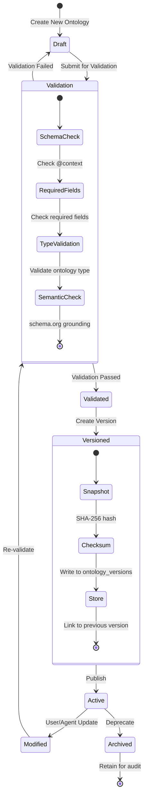

This lifecycle ensures that all ontology data passes through validation before becoming active, and all changes are preserved in an immutable version history for audit purposes.

### 3.2 Ontology Type Validation Rules

Each ontology type has specific validation requirements based on Schema.org grounding:

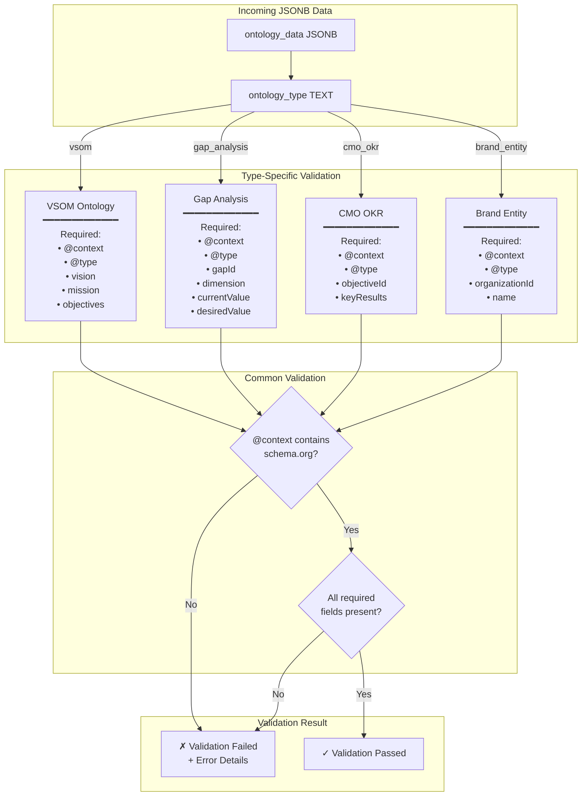

### 3.3 JSONB Schema Validation Implementation

```sql
-- Ontology validation function (MCSB: DP-4, PV-2)
CREATE OR REPLACE FUNCTION validate_jsonb_ontology(
    ontology_data JSONB,
    ontology_type TEXT
) RETURNS BOOLEAN AS $$
DECLARE
    required_fields TEXT[];
    field TEXT;
BEGIN
    -- Type-specific required field definitions
    CASE ontology_type
        WHEN 'vsom' THEN
            required_fields := ARRAY['@context', '@type', 'vision', 'mission', 'objectives'];
        WHEN 'gap_analysis' THEN
            required_fields := ARRAY['@context', '@type', 'gapId', 'dimension', 'currentValue', 'desiredValue'];
        WHEN 'cmo_okr' THEN
            required_fields := ARRAY['@context', '@type', 'objectiveId', 'keyResults'];
        WHEN 'brand_entity' THEN
            required_fields := ARRAY['@context', '@type', 'organizationId', 'name'];
        ELSE
            RAISE EXCEPTION 'Unknown ontology type: %', ontology_type;
    END CASE;
    
    -- Validate required fields exist
    FOREACH field IN ARRAY required_fields LOOP
        IF NOT (ontology_data ? field) THEN
            RAISE EXCEPTION 'Missing required field: % for ontology type: %', field, ontology_type;
        END IF;
    END LOOP;
    
    -- Validate @context is schema.org grounded
    IF NOT (ontology_data->>'@context' LIKE '%schema.org%') THEN
        RAISE WARNING 'Ontology missing schema.org context';
    END IF;
    
    RETURN TRUE;
END;
$$ LANGUAGE plpgsql IMMUTABLE;
```

### 3.4 Version Control and Integrity Verification

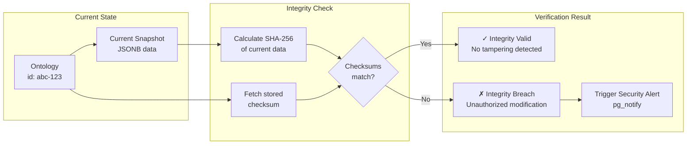

```sql
-- Integrity verification function (MCSB: DP-4)
CREATE OR REPLACE FUNCTION verify_ontology_integrity(ontology_uuid UUID)
RETURNS TABLE (
    is_valid BOOLEAN,
    current_checksum TEXT,
    stored_checksum TEXT,
    discrepancy_details JSONB
) AS $$
DECLARE
    current_data JSONB;
    stored_check TEXT;
    calculated_check TEXT;
BEGIN
    -- Get current ontology data
    SELECT data INTO current_data
    FROM ontologies WHERE id = ontology_uuid;
    
    -- Get most recent version checksum
    SELECT checksum INTO stored_check
    FROM ontology_versions
    WHERE ontology_id = ontology_uuid
    ORDER BY version_number DESC LIMIT 1;
    
    -- Calculate current checksum
    calculated_check := encode(sha256(current_data::TEXT::BYTEA), 'hex');
    
    RETURN QUERY SELECT
        (calculated_check = stored_check) AS is_valid,
        calculated_check AS current_checksum,
        stored_check AS stored_checksum,
        CASE
            WHEN calculated_check != stored_check THEN
                jsonb_build_object(
                    'alert', 'Integrity mismatch detected',
                    'ontology_id', ontology_uuid,
                    'detected_at', NOW()
                )
            ELSE NULL::JSONB
        END AS discrepancy_details;
END;
$$ LANGUAGE plpgsql SECURITY DEFINER;
```

---

## 4. Multi-User Collaborative Editing

### 4.1 Concurrent Edit Session Flow

The platform supports multiple users and consultants working on the same dataset simultaneously:

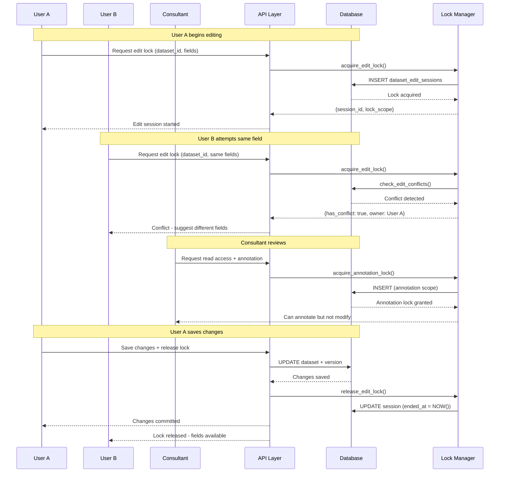

### 4.2 Edit Session State Machine

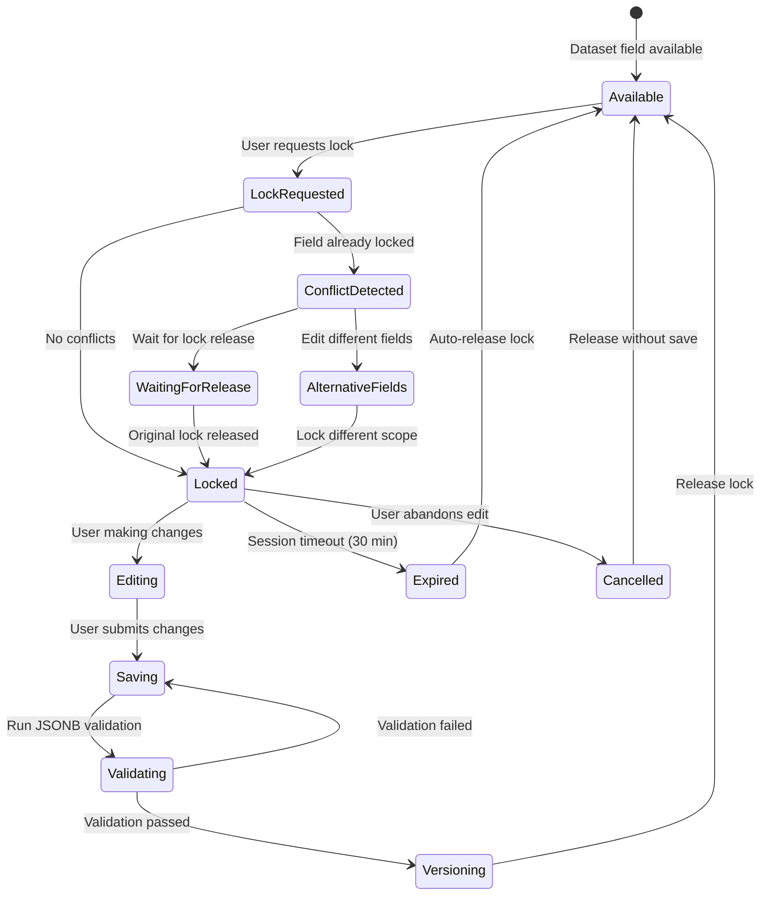

### 4.3 Edit Session Tables

```sql
-- Session-aware locking (MCSB: DP-2)
CREATE TABLE dataset_edit_sessions (
    session_id UUID PRIMARY KEY DEFAULT gen_random_uuid(),
    tenant_id UUID NOT NULL,
    dataset_id UUID NOT NULL REFERENCES datasets(id),
    user_id UUID NOT NULL,
    
    -- Lock scope: document-level or field-level
    lock_scope JSONB NOT NULL DEFAULT '{"type": "document"}',
    -- Examples:
    -- {"type": "document"} - entire dataset locked
    -- {"type": "fields", "paths": ["$.objectives[0]", "$.metrics"]}
    
    -- Session lifecycle
    started_at TIMESTAMPTZ DEFAULT NOW(),
    session_expires_at TIMESTAMPTZ DEFAULT NOW() + INTERVAL '30 minutes',
    ended_at TIMESTAMPTZ,
    
    -- Edit state
    pending_changes JSONB DEFAULT '{}',
    
    CONSTRAINT valid_lock_scope CHECK (
        lock_scope ? 'type' AND 
        lock_scope->>'type' IN ('document', 'fields')
    )
);

-- Conflict detection function
CREATE OR REPLACE FUNCTION check_edit_conflicts(
    p_dataset_id UUID,
    p_user_id UUID,
    p_requested_paths JSONB DEFAULT '[]'::JSONB
) RETURNS TABLE (
    has_conflict BOOLEAN,
    conflicting_sessions JSONB,
    recommendation TEXT
) AS $$
BEGIN
    RETURN QUERY
    SELECT
        EXISTS(
            SELECT 1 FROM dataset_edit_sessions
            WHERE dataset_id = p_dataset_id
              AND user_id != p_user_id
              AND ended_at IS NULL
              AND session_expires_at > NOW()
        ) AS has_conflict,
        COALESCE(
            (SELECT jsonb_agg(jsonb_build_object(
                'session_id', session_id,
                'user_id', user_id,
                'lock_scope', lock_scope,
                'expires_at', session_expires_at
            ))
            FROM dataset_edit_sessions
            WHERE dataset_id = p_dataset_id
              AND user_id != p_user_id
              AND ended_at IS NULL
              AND session_expires_at > NOW()
            ), '[]'::JSONB
        ) AS conflicting_sessions,
        CASE
            WHEN EXISTS(
                SELECT 1 FROM dataset_edit_sessions
                WHERE dataset_id = p_dataset_id
                  AND lock_scope->>'type' = 'document'
                  AND ended_at IS NULL
            ) THEN 'Document locked - wait for release or request annotation access'
            ELSE 'Request field-level lock for non-conflicting paths'
        END AS recommendation;
END;
$$ LANGUAGE plpgsql SECURITY DEFINER;
```

---

## 5. Consultant Access Model

### 5.1 Consultant Assignment Flow

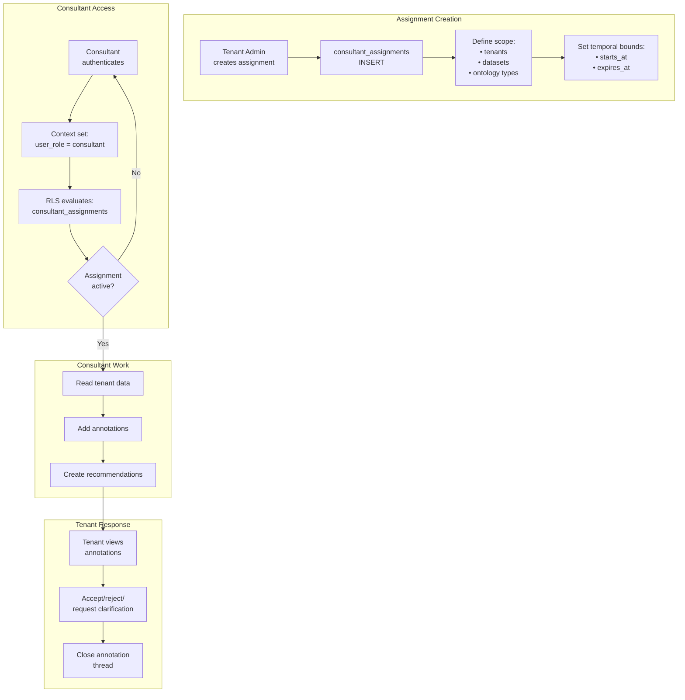

### 5.2 Consultant Access Levels

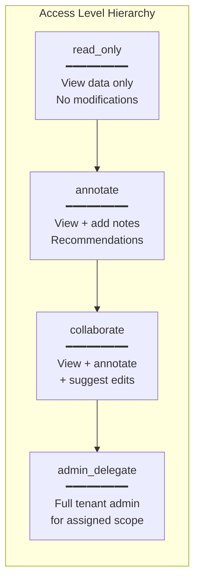

### 5.3 Consultant Tables and Functions

```sql
-- Consultant assignments (MCSB: PA-2, IM-7)
CREATE TABLE consultant_assignments (
    assignment_id UUID PRIMARY KEY DEFAULT gen_random_uuid(),
    consultant_id UUID NOT NULL REFERENCES auth.users(id),
    tenant_id UUID NOT NULL REFERENCES tenants(id),
    
    -- Access configuration
    access_level TEXT NOT NULL CHECK (
        access_level IN ('read_only', 'annotate', 'collaborate', 'admin_delegate')
    ),
    
    -- Scope restrictions
    restricted_to_datasets UUID[],      -- NULL = all datasets
    restricted_to_ontology_types TEXT[], -- NULL = all types
    
    -- Temporal bounds
    starts_at TIMESTAMPTZ NOT NULL DEFAULT NOW(),
    expires_at TIMESTAMPTZ NOT NULL,
    
    -- Status
    is_active BOOLEAN DEFAULT TRUE,
    created_by UUID NOT NULL,
    created_at TIMESTAMPTZ DEFAULT NOW(),
    
    CONSTRAINT valid_date_range CHECK (expires_at > starts_at)
);

-- Consultant annotations
CREATE TABLE consultant_annotations (
    annotation_id UUID PRIMARY KEY DEFAULT gen_random_uuid(),
    tenant_id UUID NOT NULL,
    consultant_id UUID NOT NULL,
    assignment_id UUID NOT NULL REFERENCES consultant_assignments(assignment_id),
    
    -- Target reference
    target_table TEXT NOT NULL,
    target_id UUID NOT NULL,
    target_json_path TEXT, -- JSONPath to specific element
    
    -- Annotation content
    annotation_type TEXT NOT NULL CHECK (
        annotation_type IN ('recommendation', 'question', 'approval', 'concern', 'note')
    ),
    content TEXT NOT NULL,
    priority TEXT DEFAULT 'medium' CHECK (priority IN ('low', 'medium', 'high', 'critical')),
    
    -- Workflow state
    status TEXT DEFAULT 'pending_review' CHECK (
        status IN ('pending_review', 'acknowledged', 'accepted', 'rejected', 'clarification_requested')
    ),
    tenant_response JSONB, -- {"response": "...", "responded_by": "...", "responded_at": "..."}
    
    created_at TIMESTAMPTZ DEFAULT NOW(),
    updated_at TIMESTAMPTZ DEFAULT NOW()
);
```

---

## 6. Agent Authority Framework

### 6.1 Agent Authority Decision Flow

The following diagram shows how agent authority is evaluated for each action:

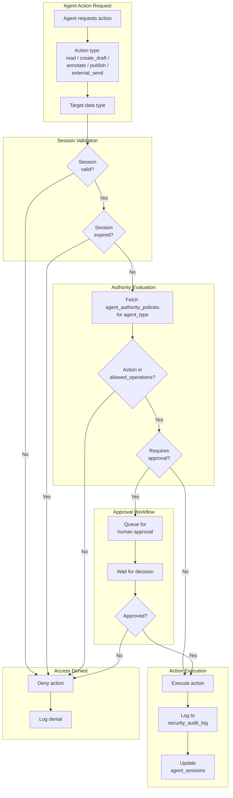

### 6.2 Agent Type Authority Matrix

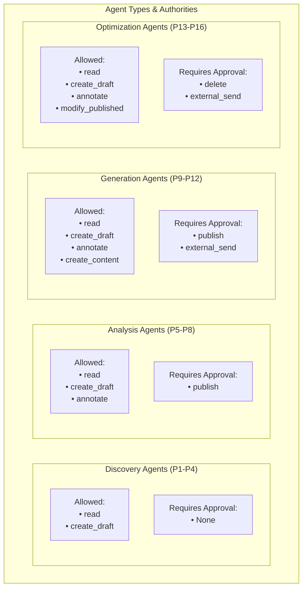

### 6.3 Agent Authority Implementation

```sql
-- Agent authority policies (MCSB: PA-1, PA-7)
CREATE TABLE agent_authority_policies (
    policy_id UUID PRIMARY KEY DEFAULT gen_random_uuid(),
    agent_type TEXT NOT NULL UNIQUE,
    
    -- Authority definitions
    allowed_operations TEXT[] NOT NULL,
    requires_approval_for TEXT[] DEFAULT '{}',
    
    -- Data scope restrictions
    allowed_data_types TEXT[] DEFAULT ARRAY['*'],
    max_records_per_action INTEGER DEFAULT 100,
    
    -- Temporal restrictions
    allowed_hours JSONB, -- {"start": "09:00", "end": "17:00", "timezone": "UTC"}
    
    created_at TIMESTAMPTZ DEFAULT NOW(),
    updated_at TIMESTAMPTZ DEFAULT NOW()
);

-- Insert default policies for agent clusters
INSERT INTO agent_authority_policies (agent_type, allowed_operations, requires_approval_for) VALUES
    ('discovery_agent', ARRAY['read', 'create_draft'], ARRAY[]::TEXT[]),
    ('analysis_agent', ARRAY['read', 'create_draft', 'annotate'], ARRAY['publish']),
    ('generation_agent', ARRAY['read', 'create_draft', 'annotate', 'create_content'], ARRAY['publish', 'external_send']),
    ('optimization_agent', ARRAY['read', 'create_draft', 'annotate', 'modify_published'], ARRAY['delete', 'external_send']);

-- Agent session tracking
CREATE TABLE agent_sessions (
    session_id UUID PRIMARY KEY DEFAULT gen_random_uuid(),
    tenant_id UUID NOT NULL,
    agent_type TEXT NOT NULL,
    agent_instance_id TEXT NOT NULL,
    
    -- Session lifecycle
    started_at TIMESTAMPTZ DEFAULT NOW(),
    expires_at TIMESTAMPTZ DEFAULT NOW() + INTERVAL '1 hour',
    ended_at TIMESTAMPTZ,
    
    -- Activity tracking
    actions_performed JSONB DEFAULT '[]',
    data_accessed JSONB DEFAULT '[]',
    
    -- Result
    session_status TEXT DEFAULT 'active' CHECK (
        session_status IN ('active', 'completed', 'failed', 'timed_out')
    ),
    result_summary JSONB
);

-- Authority check function
CREATE OR REPLACE FUNCTION check_agent_authority(
    p_session_id UUID,
    p_requested_action TEXT,
    p_target_data_type TEXT
) RETURNS TABLE (
    is_authorized BOOLEAN,
    requires_approval BOOLEAN,
    denial_reason TEXT
) AS $$
DECLARE
    v_agent_type TEXT;
    v_policy RECORD;
BEGIN
    -- Get agent type from session
    SELECT agent_type INTO v_agent_type
    FROM agent_sessions
    WHERE session_id = p_session_id
      AND session_status = 'active'
      AND expires_at > NOW();
    
    IF v_agent_type IS NULL THEN
        RETURN QUERY SELECT FALSE, FALSE, 'Invalid or expired session';
        RETURN;
    END IF;
    
    -- Get authority policy
    SELECT * INTO v_policy
    FROM agent_authority_policies
    WHERE agent_type = v_agent_type;
    
    IF NOT FOUND THEN
        RETURN QUERY SELECT FALSE, FALSE, 'No authority policy defined';
        RETURN;
    END IF;
    
    -- Check if action is allowed
    IF NOT (p_requested_action = ANY(v_policy.allowed_operations)) THEN
        RETURN QUERY SELECT FALSE, FALSE, 
            format('Action %s not in allowed operations for %s', p_requested_action, v_agent_type);
        RETURN;
    END IF;
    
    -- Check if approval is required
    RETURN QUERY SELECT 
        TRUE,
        (p_requested_action = ANY(v_policy.requires_approval_for)),
        NULL::TEXT;
END;
$$ LANGUAGE plpgsql SECURITY DEFINER;
```

---

## 7. Security Monitoring & Audit Logging

### 7.1 Security Event Flow

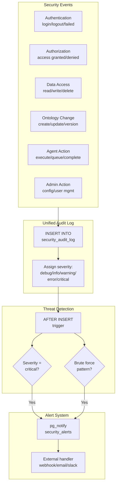

### 7.2 Audit Log Schema

```sql
-- Unified security audit log (MCSB: LT-3, LT-5)
CREATE TABLE security_audit_log (
    log_id UUID PRIMARY KEY DEFAULT gen_random_uuid(),
    tenant_id UUID, -- NULL for platform-level events
    
    -- Event classification
    event_category TEXT NOT NULL CHECK (
        event_category IN (
            'authentication', 'authorization', 'data_access',
            'data_modification', 'ontology_change', 'agent_action',
            'admin_action', 'security_alert'
        )
    ),
    event_type TEXT NOT NULL,
    severity TEXT NOT NULL CHECK (
        severity IN ('debug', 'info', 'warning', 'error', 'critical')
    ),
    
    -- Actor information
    actor_type TEXT NOT NULL CHECK (
        actor_type IN ('user', 'agent', 'system', 'anonymous')
    ),
    actor_id TEXT,
    
    -- Action details
    action TEXT NOT NULL,
    resource_type TEXT,
    resource_id TEXT,
    
    -- Context
    ip_address INET,
    user_agent TEXT,
    request_id TEXT,
    
    -- Outcome
    outcome TEXT CHECK (outcome IN ('success', 'failure', 'partial')),
    outcome_details JSONB,
    
    -- Timestamp
    occurred_at TIMESTAMPTZ DEFAULT NOW(),
    
    -- Immutability constraint - no updates allowed via RLS
    CONSTRAINT log_immutable CHECK (TRUE)
);

-- RLS for audit log - append only, read by authorized
ALTER TABLE security_audit_log ENABLE ROW LEVEL SECURITY;

CREATE POLICY audit_log_insert ON security_audit_log
    FOR INSERT
    WITH CHECK (TRUE); -- Any authenticated process can log

CREATE POLICY audit_log_read ON security_audit_log
    FOR SELECT
    USING (
        current_setting('app.user_role', true) = 'platform_owner'
        OR tenant_id = current_setting('app.current_tenant_id')::UUID
    );

-- No UPDATE or DELETE policies - log is immutable

-- Security alert trigger
CREATE OR REPLACE FUNCTION trigger_security_alert()
RETURNS TRIGGER AS $$
BEGIN
    -- Alert on critical severity events
    IF NEW.severity = 'critical' THEN
        PERFORM pg_notify('security_alerts', json_build_object(
            'alert_type', 'critical_event',
            'log_id', NEW.log_id,
            'event_type', NEW.event_type,
            'tenant_id', NEW.tenant_id,
            'action', NEW.action,
            'occurred_at', NEW.occurred_at
        )::TEXT);
    END IF;
    
    -- Alert on multiple failed auth attempts (brute force detection)
    IF NEW.event_category = 'authentication' AND NEW.outcome = 'failure' THEN
        IF (
            SELECT COUNT(*) > 5
            FROM security_audit_log
            WHERE ip_address = NEW.ip_address
              AND event_category = 'authentication'
              AND outcome = 'failure'
              AND occurred_at > NOW() - INTERVAL '15 minutes'
        ) THEN
            PERFORM pg_notify('security_alerts', json_build_object(
                'alert_type', 'brute_force_attempt',
                'ip_address', NEW.ip_address,
                'attempt_count', 6,
                'occurred_at', NEW.occurred_at
            )::TEXT);
        END IF;
    END IF;
    
    RETURN NEW;
END;
$$ LANGUAGE plpgsql;

CREATE TRIGGER security_alert_trigger
    AFTER INSERT ON security_audit_log
    FOR EACH ROW
    EXECUTE FUNCTION trigger_security_alert();
```

---

## 8. Implementation Roadmap

### 8.1 Phased Implementation Timeline

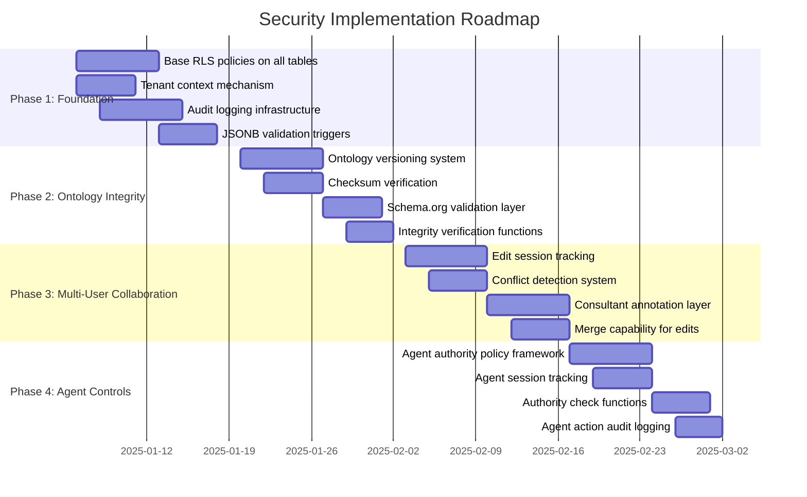

### 8.2 Phase Details

| Phase | Duration | Tasks | MCSB Controls | Priority |
|-------|----------|-------|---------------|----------|
| **Phase 1: Foundation** | Weeks 1-2 | Base RLS policies, tenant context, audit logging, JSONB validation | NS-1, PA-7, IM-1, LT-3, DP-4 | Critical |
| **Phase 2: Ontology Integrity** | Weeks 3-4 | Versioning, checksums, schema.org validation, integrity verification | DP-4, BR-1, PV-2, DP-2 | High |
| **Phase 3: Multi-User Collaboration** | Weeks 5-6 | Edit sessions, conflict detection, annotations, merge capability | DP-2, PA-4, IM-7 | High |
| **Phase 4: Agent Controls** | Weeks 7-8 | Authority policies, session tracking, authority checks, action audit | PA-1, PA-7, LT-1, LT-3 | High |

---

## 9. Testing & Validation

### 9.1 Security Test Workflow

```mermaid
flowchart TB
    subgraph Isolation["RLS Isolation Tests"]
        T1["Set context to Tenant A"]
        T2["Query Tenant B data"]
        T3{Result = 0 rows?}
        T4[✓ PASS]
        T5[✗ FAIL - RLS Violation]
    end
    
    subgraph Consultant["Consultant Boundary Tests"]
        C1["Set consultant context"]
        C2["No active assignments"]
        C3["Query any tenant data"]
        C4{Result = 0 rows?}
        C5[✓ PASS]
        C6[✗ FAIL - Auth Violation]
    end
    
    subgraph Integrity["Ontology Integrity Tests"]
        I1["Create ontology with checksum"]
        I2["Simulate unauthorized change"]
        I3["Run verify_ontology_integrity"]
        I4{Mismatch detected?}
        I5[✓ PASS]
        I6[✗ FAIL - Integrity Gap]
    end
    
    subgraph Agent["Agent Authority Tests"]
        A1["Create agent session"]
        A2["Request unauthorized action"]
        A3["Run check_agent_authority"]
        A4{Denied?}
        A5[✓ PASS]
        A6[✗ FAIL - Authority Leak]
    end
    
    T1 --> T2 --> T3
    T3 -->|Yes| T4
    T3 -->|No| T5
    
    C1 --> C2 --> C3 --> C4
    C4 -->|Yes| C5
    C4 -->|No| C6
    
    I1 --> I2 --> I3 --> I4
    I4 -->|Yes| I5
    I4 -->|No| I6
    
    A1 --> A2 --> A3 --> A4
    A4 -->|Yes| A5
    A4 -->|No| A6
```

### 9.2 Test Case SQL

```sql
-- Test: Verify RLS prevents cross-tenant access
DO $$
BEGIN
    -- Set context to Tenant A
    PERFORM set_config('app.current_tenant_id', 'tenant-a-uuid', false);
    
    -- Attempt to access Tenant B data should return 0 rows
    ASSERT (SELECT COUNT(*) FROM datasets WHERE tenant_id = 'tenant-b-uuid') = 0,
        'RLS VIOLATION: Tenant A can see Tenant B data';
    
    RAISE NOTICE '✓ RLS isolation test PASSED';
END $$;

-- Test: Verify consultant access boundaries
DO $$
BEGIN
    -- Set context to consultant without assignment
    PERFORM set_config('app.user_id', 'unassigned-consultant-uuid', false);
    PERFORM set_config('app.user_role', 'consultant', false);
    
    -- Should have no access to any tenant data
    ASSERT (SELECT COUNT(*) FROM datasets) = 0,
        'AUTHORIZATION VIOLATION: Unassigned consultant has data access';
    
    RAISE NOTICE '✓ Consultant boundary test PASSED';
END $$;

-- Test: Verify ontology integrity check
DO $$
DECLARE
    test_result RECORD;
BEGIN
    SELECT * INTO test_result FROM verify_ontology_integrity('test-ontology-uuid');
    
    ASSERT test_result.is_valid = TRUE,
        'INTEGRITY VIOLATION: Ontology checksum mismatch';
    
    RAISE NOTICE '✓ Ontology integrity test PASSED';
END $$;

-- Test: Verify agent authority check
DO $$
DECLARE
    auth_result RECORD;
BEGIN
    SELECT * INTO auth_result FROM check_agent_authority(
        'test-session-uuid',
        'delete',  -- Unauthorized for discovery agents
        'ontology'
    );
    
    ASSERT auth_result.is_authorized = FALSE,
        'AUTHORITY VIOLATION: Unauthorized action permitted';
    
    RAISE NOTICE '✓ Agent authority test PASSED';
END $$;
```

---

## 10. MCSB Compliance Mapping Summary

The following table provides a complete mapping of implemented controls to MCSB requirements:

| MCSB Control | Description | Implementation | Status |
|--------------|-------------|----------------|--------|
| **NS-1** | Network Segmentation | RLS provides row-level isolation equivalent | ✅ |
| **IM-1** | Centralized Identity | Supabase Auth + context propagation | ✅ |
| **IM-7** | Conditional Access | Role-based RLS policies with temporal checks | ✅ |
| **PA-1** | Privileged User Limits | Agent authority policies, role hierarchy | ✅ |
| **PA-2** | JIT Access | Time-bound consultant assignments | ✅ |
| **PA-4** | Privileged Access Review | Annotation workflow for oversight | ✅ |
| **PA-7** | Least Privilege | Scoped RLS policies per role | ✅ |
| **DP-2** | Data Anomaly Monitoring | Security alert triggers, conflict detection | ✅ |
| **DP-4** | Encryption at Rest | Supabase default (Postgres TDE) + checksums | ✅ |
| **LT-1** | Threat Detection | Security alert system, brute force detection | ✅ |
| **LT-3** | Security Logging | Comprehensive immutable audit log | ✅ |
| **LT-5** | Centralized Log Management | Single audit table with partitioning | ✅ |
| **PV-2** | Configuration Audit | Ontology validation triggers | ✅ |
| **BR-1** | Automated Backups | Ontology versioning + Supabase backups | ✅ |
| **GS-1** | Security Strategy | This document + governance framework | ✅ |

---

## 11. Quick Reference

### Context Setting (Required Before Queries)

```sql
-- Set tenant context
SELECT set_config('app.current_tenant_id', 'your-tenant-uuid', false);
SELECT set_config('app.user_id', 'your-user-uuid', false);
SELECT set_config('app.user_role', 'tenant_user', false);

-- Check current context
SELECT 
    current_setting('app.current_tenant_id', true) AS tenant_id,
    current_setting('app.user_id', true) AS user_id,
    current_setting('app.user_role', true) AS role;
```

### RLS Verification

```sql
-- Verify RLS is enabled
SELECT tablename, rowsecurity 
FROM pg_tables 
WHERE schemaname = 'public' AND tablename = 'your_table';

-- List all policies
SELECT schemaname, tablename, policyname, cmd, qual 
FROM pg_policies 
WHERE schemaname = 'public';
```

### Common Security Operations

```sql
-- Create consultant assignment
INSERT INTO consultant_assignments (consultant_id, tenant_id, access_level, expires_at)
VALUES ('consultant-uuid', 'tenant-uuid', 'collaborate', NOW() + INTERVAL '30 days');

-- Check edit conflicts
SELECT * FROM check_edit_conflicts('dataset-uuid', 'user-uuid');

-- Verify ontology integrity
SELECT * FROM verify_ontology_integrity('ontology-uuid');

-- Check agent authority
SELECT * FROM check_agent_authority('session-uuid', 'publish', 'content');
```

---

## Appendix A: Diagram Key

| Symbol | Meaning |
|--------|---------|
| Rectangle | Process or Component |
| Diamond | Decision Point |
| Cylinder | Database/Storage |
| Arrow | Data/Control Flow |
| Subgraph | Logical Grouping |
| ✓ | Success/Pass |
| ✗ | Failure/Deny |

---

*Document Version 2.0 - Platform Foundation Security Architecture*  
*Review quarterly or upon significant architecture changes*
