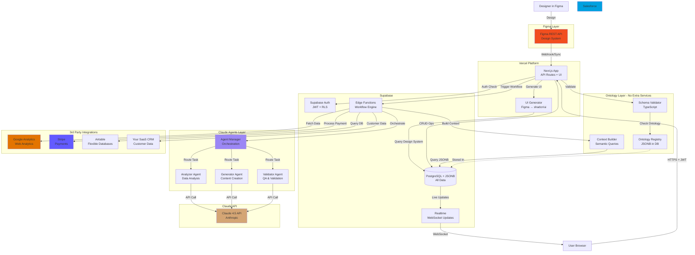

# Complete MVP Architecture: Ontology + Figma + Claude + 3rd Party Data
**Version:** 1.3 MVP (Complete Edition)  
**Date:** October 27, 2025  
**Target:** 5-6 Week Implementation  
**Philosophy:** Schema.org + JSONB + Figma + Claude + APIs = Complete Platform

---

## Executive Summary

This is the **complete** simplified MVP architecture including:
1. ✅ **Ontology-driven design** with schema.org + JSONB
2. ✅ **Figma integration** for UI/UX workflow
3. ✅ **Claude API** with multi-agent orchestration
4. ✅ **3rd party data sources** (CRM, Analytics, Payment, etc.)
5. ✅ **Real-time updates** via Supabase
6. ✅ **Simple 2-service architecture** (Supabase + Vercel)

**Still builds in 5-6 weeks with 1-2 developers at $150/month.**

---

## Complete Architecture Diagram



---

## Table of Contents

1. [Core Ontologies (4 Essential)](#1-core-ontologies-4-essential)
2. [Database Schema (Complete)](#2-database-schema-complete)
3. [Figma Integration](#3-figma-integration)
4. [Claude API Integration](#4-claude-api-integration)
5. [Multi-Agent Orchestration](#5-multi-agent-orchestration)
6. [3rd Party Data Sources](#6-3rd-party-data-sources)
7. [Complete Workflow Execution](#7-complete-workflow-execution)
8. [API Reference (Complete)](#8-api-reference-complete)
9. [6-Week Implementation Plan](#9-6-week-implementation-plan)
10. [Example: Complete End-to-End Flow](#10-example-complete-end-to-end-flow)

---

## 1. Core Ontologies (4 Essential)

### 1.1 Organization Ontology
```json
{
  "@context": "https://schema.org",
  "@type": "OntologyDefinition",
  "name": "OrganizationOntology",
  "version": "1.0.0",
  "entities": {
    "Organization": {
      "@type": "Organization",
      "properties": {
        "legalName": { "type": "Text", "required": true },
        "industry": { "type": "Text" },
        "numberOfEmployees": { "type": "Integer" }
      }
    }
  }
}
```

### 1.2 Workflow Ontology
```json
{
  "@context": "https://schema.org",
  "@type": "OntologyDefinition",
  "name": "WorkflowOntology",
  "version": "1.0.0",
  "entities": {
    "WorkflowExecution": {
      "@type": "Action",
      "properties": {
        "name": { "type": "Text", "required": true },
        "agent": { "@type": "Organization", "required": true },
        "actionStatus": { "type": "ActionStatusType", "required": true },
        "object": { "@type": "Thing", "required": true },
        "result": { "@type": "Thing" }
      }
    }
  }
}
```

### 1.3 Agent Ontology
```json
{
  "@context": "https://schema.org",
  "@type": "OntologyDefinition",
  "name": "AgentOntology",
  "version": "1.0.0",
  "entities": {
    "AIAgent": {
      "@type": "SoftwareApplication",
      "properties": {
        "name": { "type": "Text", "required": true },
        "applicationCategory": { 
          "type": "Text",
          "enum": ["Analyzer", "Generator", "Validator"]
        },
        "systemPrompt": { "type": "Text", "required": true }
      }
    }
  }
}
```

### 1.4 Design System Ontology
```json
{
  "@context": "https://schema.org",
  "@type": "OntologyDefinition",
  "name": "DesignSystemOntology",
  "version": "1.0.0",
  "entities": {
    "UIComponent": {
      "@type": "CreativeWork",
      "properties": {
        "name": { "type": "Text", "required": true },
        "design": { 
          "figmaFileKey": { "type": "Text" },
          "shadcnMapping": { "type": "Text" }
        }
      }
    }
  }
}
```

---

## 2. Database Schema (Complete)

```sql
-- Ontology registry
CREATE TABLE ontology_registry (
  id UUID PRIMARY KEY DEFAULT uuid_generate_v4(),
  name TEXT UNIQUE NOT NULL,
  version TEXT NOT NULL,
  definition JSONB NOT NULL,
  created_at TIMESTAMPTZ DEFAULT NOW()
);

-- Organizations (schema.org)
CREATE TABLE organizations (
  id UUID PRIMARY KEY DEFAULT uuid_generate_v4(),
  data JSONB NOT NULL CHECK (
    data->>'@context' = 'https://schema.org' AND
    data->>'@type' = 'Organization'
  ),
  created_at TIMESTAMPTZ DEFAULT NOW()
);

-- User profiles
CREATE TABLE user_profiles (
  id UUID PRIMARY KEY REFERENCES auth.users(id),
  org_id UUID REFERENCES organizations(id),
  role TEXT NOT NULL DEFAULT 'member',
  created_at TIMESTAMPTZ DEFAULT NOW()
);

-- Workflow executions
CREATE TABLE workflow_executions (
  id UUID PRIMARY KEY DEFAULT uuid_generate_v4(),
  org_id UUID REFERENCES organizations(id),
  created_by UUID REFERENCES auth.users(id),
  
  data JSONB NOT NULL CHECK (
    data->>'@context' = 'https://schema.org' AND
    data->>'@type' = 'Action'
  ),
  
  status TEXT GENERATED ALWAYS AS (data->>'actionStatus') STORED,
  workflow_type TEXT GENERATED ALWAYS AS (data->>'name') STORED,
  
  created_at TIMESTAMPTZ DEFAULT NOW()
);

-- Figma components
CREATE TABLE figma_components (
  id UUID PRIMARY KEY DEFAULT uuid_generate_v4(),
  org_id UUID REFERENCES organizations(id),
  figma_file_key TEXT NOT NULL,
  figma_node_id TEXT NOT NULL,
  
  data JSONB NOT NULL CHECK (
    data->>'@type' = 'CreativeWork'
  ),
  
  component_name TEXT GENERATED ALWAYS AS (data->>'name') STORED,
  
  created_at TIMESTAMPTZ DEFAULT NOW(),
  UNIQUE(org_id, figma_file_key, figma_node_id)
);

-- Integration credentials (3rd party APIs)
CREATE TABLE integration_credentials (
  id UUID PRIMARY KEY DEFAULT uuid_generate_v4(),
  org_id UUID REFERENCES organizations(id),
  provider TEXT NOT NULL,
  credentials JSONB NOT NULL,
  is_active BOOLEAN DEFAULT true,
  created_at TIMESTAMPTZ DEFAULT NOW(),
  UNIQUE(org_id, provider)
);

-- Agent execution logs
CREATE TABLE agent_execution_logs (
  id UUID PRIMARY KEY DEFAULT uuid_generate_v4(),
  workflow_execution_id UUID REFERENCES workflow_executions(id),
  
  agent_type TEXT NOT NULL,
  model TEXT NOT NULL,
  
  system_prompt TEXT,
  user_prompt TEXT,
  response TEXT,
  
  tokens_input INTEGER,
  tokens_output INTEGER,
  cost_usd DECIMAL(10, 6),
  
  latency_ms INTEGER,
  
  created_at TIMESTAMPTZ DEFAULT NOW()
);

-- 3rd party API call logs
CREATE TABLE integration_call_logs (
  id UUID PRIMARY KEY DEFAULT uuid_generate_v4(),
  workflow_execution_id UUID REFERENCES workflow_executions(id),
  
  provider TEXT NOT NULL,
  endpoint TEXT NOT NULL,
  method TEXT NOT NULL,
  
  request_body JSONB,
  response_body JSONB,
  response_status INTEGER,
  
  latency_ms INTEGER,
  error TEXT,
  
  created_at TIMESTAMPTZ DEFAULT NOW()
);

-- Indexes
CREATE INDEX idx_workflow_org ON workflow_executions(org_id);
CREATE INDEX idx_workflow_status ON workflow_executions(status);
CREATE INDEX idx_agent_logs_workflow ON agent_execution_logs(workflow_execution_id);
CREATE INDEX idx_integration_logs_workflow ON integration_call_logs(workflow_execution_id);

-- RLS Policies
ALTER TABLE organizations ENABLE ROW LEVEL SECURITY;
ALTER TABLE workflow_executions ENABLE ROW LEVEL SECURITY;
ALTER TABLE figma_components ENABLE ROW LEVEL SECURITY;
ALTER TABLE integration_credentials ENABLE ROW LEVEL SECURITY;

CREATE POLICY "Users see own org" ON organizations FOR SELECT
  USING (id IN (SELECT org_id FROM user_profiles WHERE id = auth.uid()));

CREATE POLICY "Users see own workflows" ON workflow_executions FOR SELECT
  USING (org_id IN (SELECT org_id FROM user_profiles WHERE id = auth.uid()));
```

---

## 3. Figma Integration

### 3.1 Sync Figma to Supabase

```typescript
// lib/figma/sync.ts
import { FigmaClient } from './client';
import { createClient } from '@supabase/supabase-js';

export async function syncFigmaComponents(
  orgId: string,
  figmaFileKey: string,
  figmaToken: string
) {
  const figma = new FigmaClient(figmaToken);
  const supabase = createClient(
    process.env.SUPABASE_URL!,
    process.env.SUPABASE_SERVICE_ROLE_KEY!
  );
  
  const components = await figma.getComponents(figmaFileKey);
  
  const ontologyComponents = components.map(comp => ({
    org_id: orgId,
    figma_file_key: figmaFileKey,
    figma_node_id: comp.id,
    data: {
      '@context': 'https://schema.org',
      '@type': 'CreativeWork',
      'name': comp.name,
      'design': {
        'figmaFileKey': figmaFileKey,
        'figmaNodeId': comp.id,
        'styles': extractStyles(comp),
        'shadcnMapping': mapToShadcn(comp.name)
      }
    }
  }));
  
  await supabase.from('figma_components').upsert(ontologyComponents);
  
  return { synced: components.length };
}

function mapToShadcn(name: string): string {
  const mapping: Record<string, string> = {
    'button': 'button',
    'card': 'card',
    'dialog': 'dialog',
    'input': 'input',
    'table': 'table'
  };
  
  const normalized = name.toLowerCase();
  for (const [key, value] of Object.entries(mapping)) {
    if (normalized.includes(key)) return value;
  }
  return 'div';
}
```

---

## 4. Claude API Integration

### 4.1 Claude API Client

```typescript
// lib/claude/client.ts

export class ClaudeAPIClient {
  private apiKey: string;
  private baseUrl = 'https://api.anthropic.com/v1';
  
  constructor(apiKey: string) {
    this.apiKey = apiKey;
  }
  
  async createMessage(
    systemPrompt: string,
    userMessage: string,
    options?: {
      maxTokens?: number;
      temperature?: number;
    }
  ) {
    const response = await fetch(`${this.baseUrl}/messages`, {
      method: 'POST',
      headers: {
        'x-api-key': this.apiKey,
        'anthropic-version': '2023-06-01',
        'content-type': 'application/json'
      },
      body: JSON.stringify({
        model: 'claude-sonnet-4-20250514',
        max_tokens: options?.maxTokens || 4096,
        temperature: options?.temperature || 0.7,
        system: systemPrompt,
        messages: [{
          role: 'user',
          content: userMessage
        }]
      })
    });
    
    if (!response.ok) {
      const error = await response.json();
      throw new Error(`Claude API error: ${error.error?.message}`);
    }
    
    const data = await response.json();
    
    return {
      content: data.content[0].text,
      usage: {
        input_tokens: data.usage.input_tokens,
        output_tokens: data.usage.output_tokens
      },
      model: data.model
    };
  }
  
  // Cost calculation
  calculateCost(usage: { input_tokens: number; output_tokens: number }): number {
    // Claude Sonnet 4 pricing (example)
    const inputCostPer1k = 0.003;  // $3 per million
    const outputCostPer1k = 0.015; // $15 per million
    
    const inputCost = (usage.input_tokens / 1000) * inputCostPer1k;
    const outputCost = (usage.output_tokens / 1000) * outputCostPer1k;
    
    return inputCost + outputCost;
  }
}
```

### 4.2 Ontology-Aware Claude Client

```typescript
// lib/claude/ontology-client.ts

export class OntologyAwareClaudeClient extends ClaudeAPIClient {
  
  async invokeWithContext(
    agentType: string,
    input: any,
    context: {
      organization: any;
      ontologies: any[];
      workflowHistory?: any[];
    }
  ) {
    const systemPrompt = this.buildSemanticSystemPrompt(
      agentType,
      context.organization,
      context.ontologies
    );
    
    const userPrompt = this.buildSemanticUserPrompt(input, context);
    
    const startTime = Date.now();
    const response = await this.createMessage(systemPrompt, userPrompt);
    const latency = Date.now() - startTime;
    
    return {
      ...response,
      latency,
      cost: this.calculateCost(response.usage)
    };
  }
  
  private buildSemanticSystemPrompt(
    agentType: string,
    org: any,
    ontologies: any[]
  ): string {
    return `You are a ${agentType} agent working for ${org.legalName}.

ORGANIZATION CONTEXT (schema.org Organization):
${JSON.stringify(org, null, 2)}

ONTOLOGY DEFINITIONS:
${ontologies.map(o => JSON.stringify(o.definition, null, 2)).join('\n\n')}

INSTRUCTIONS:
- Use schema.org vocabulary in responses
- Structure output according to ontology schemas
- Be precise with semantic terminology
- Return valid JSON when appropriate`;
  }
  
  private buildSemanticUserPrompt(input: any, context: any): string {
    let prompt = `Process this request:\n\n`;
    
    if (input['@type']) {
      prompt += `Input (schema.org ${input['@type']}):\n`;
    }
    
    prompt += JSON.stringify(input, null, 2);
    
    if (context.workflowHistory?.length) {
      prompt += `\n\nPrevious workflow steps:\n`;
      prompt += JSON.stringify(context.workflowHistory, null, 2);
    }
    
    return prompt;
  }
}
```

---

## 5. Multi-Agent Orchestration

### 5.1 Agent Manager

```typescript
// lib/agents/agent-manager.ts

export interface AgentDefinition {
  type: 'analyzer' | 'generator' | 'validator';
  systemPrompt: string;
  maxTokens: number;
  temperature: number;
}

export class AgentManager {
  private claudeClient: OntologyAwareClaudeClient;
  private agents: Map<string, AgentDefinition>;
  
  constructor(apiKey: string) {
    this.claudeClient = new OntologyAwareClaudeClient(apiKey);
    this.agents = this.initializeAgents();
  }
  
  private initializeAgents(): Map<string, AgentDefinition> {
    return new Map([
      ['analyzer', {
        type: 'analyzer',
        systemPrompt: `You are a data analysis expert. Analyze data and return JSON:
{
  "summary": "brief overview",
  "key_findings": ["finding1", "finding2"],
  "metrics": { "metric_name": value },
  "recommendations": ["rec1", "rec2"]
}`,
        maxTokens: 2048,
        temperature: 0.3
      }],
      
      ['generator', {
        type: 'generator',
        systemPrompt: `You are a content generation expert. Create high-quality, engaging content based on requirements.`,
        maxTokens: 4096,
        temperature: 0.7
      }],
      
      ['validator', {
        type: 'validator',
        systemPrompt: `You are a quality validator. Review content and return JSON:
{
  "valid": true/false,
  "issues": ["issue1", "issue2"],
  "score": 0-100,
  "suggestions": ["suggestion1"]
}`,
        maxTokens: 1024,
        temperature: 0.2
      }]
    ]);
  }
  
  async invokeAgent(
    agentType: string,
    input: any,
    context: any
  ): Promise<AgentResult> {
    
    const agent = this.agents.get(agentType);
    if (!agent) {
      throw new Error(`Unknown agent type: ${agentType}`);
    }
    
    const response = await this.claudeClient.invokeWithContext(
      agentType,
      input,
      context
    );
    
    // Parse response if JSON expected
    let parsedOutput = response.content;
    if (agentType === 'analyzer' || agentType === 'validator') {
      try {
        // Remove markdown code blocks if present
        const cleaned = response.content
          .replace(/```json\n?/g, '')
          .replace(/```\n?/g, '')
          .trim();
        parsedOutput = JSON.parse(cleaned);
      } catch (e) {
        console.warn('Failed to parse agent response as JSON:', e);
      }
    }
    
    return {
      agent_type: agentType,
      output: parsedOutput,
      usage: response.usage,
      cost: response.cost,
      latency: response.latency,
      model: response.model
    };
  }
  
  // Orchestrate multiple agents in sequence
  async orchestrateWorkflow(
    steps: Array<{ agent: string; input: any }>,
    context: any
  ): Promise<any[]> {
    
    const results: any[] = [];
    let workflowContext = { ...context, workflowHistory: [] };
    
    for (const step of steps) {
      const result = await this.invokeAgent(
        step.agent,
        step.input,
        workflowContext
      );
      
      results.push(result);
      
      // Add to history for next agent
      workflowContext.workflowHistory.push({
        agent: step.agent,
        output: result.output
      });
    }
    
    return results;
  }
}

export interface AgentResult {
  agent_type: string;
  output: any;
  usage: { input_tokens: number; output_tokens: number };
  cost: number;
  latency: number;
  model: string;
}
```

### 5.2 Pre-configured Agent Types

```typescript
// lib/agents/agent-types.ts

export const AGENT_CONFIGURATIONS = {
  data_analyzer: {
    type: 'analyzer',
    description: 'Analyzes datasets for patterns and insights',
    inputSchema: {
      '@type': 'Dataset',
      'data': 'required'
    },
    outputSchema: {
      '@type': 'AnalysisResult',
      'summary': 'string',
      'key_findings': 'array',
      'recommendations': 'array'
    }
  },
  
  content_writer: {
    type: 'generator',
    description: 'Generates high-quality content',
    inputSchema: {
      '@type': 'CreativeWorkRequest',
      'topic': 'required',
      'tone': 'optional',
      'length': 'optional'
    },
    outputSchema: {
      '@type': 'Article',
      'headline': 'string',
      'articleBody': 'string'
    }
  },
  
  competitive_analyzer: {
    type: 'analyzer',
    description: 'Analyzes competitive landscape',
    inputSchema: {
      '@type': 'MarketAnalysisRequest',
      'competitors': 'array',
      'metrics': 'array'
    },
    outputSchema: {
      '@type': 'CompetitiveAnalysis',
      'positioning': 'object',
      'recommendations': 'array'
    }
  },
  
  data_validator: {
    type: 'validator',
    description: 'Validates data quality and completeness',
    inputSchema: {
      '@type': 'Dataset',
      'data': 'required',
      'validationRules': 'optional'
    },
    outputSchema: {
      '@type': 'ValidationResult',
      'valid': 'boolean',
      'issues': 'array',
      'score': 'number'
    }
  }
};
```

---

## 6. 3rd Party Data Sources

### 6.1 Integration Client Base Class

```typescript
// lib/integrations/base-integration.ts

export abstract class BaseIntegration {
  protected credentials: any;
  
  constructor(credentials: any) {
    this.credentials = credentials;
  }
  
  abstract get name(): string;
  abstract get baseUrl(): string;
  
  protected async request(
    endpoint: string,
    options: RequestInit = {}
  ): Promise<any> {
    
    const url = `${this.baseUrl}${endpoint}`;
    const headers = this.buildHeaders(options.headers);
    
    // Simple retry with exponential backoff
    for (let attempt = 0; attempt < 3; attempt++) {
      try {
        const startTime = Date.now();
        
        const response = await fetch(url, {
          ...options,
          headers
        });
        
        const latency = Date.now() - startTime;
        
        if (!response.ok) {
          throw new Error(`HTTP ${response.status}: ${await response.text()}`);
        }
        
        const data = await response.json();
        
        return {
          data,
          status: response.status,
          latency
        };
        
      } catch (error) {
        if (attempt === 2) throw error;
        await new Promise(resolve => setTimeout(resolve, Math.pow(2, attempt) * 1000));
      }
    }
  }
  
  protected buildHeaders(customHeaders?: HeadersInit): HeadersInit {
    return {
      'Content-Type': 'application/json',
      ...this.getAuthHeaders(),
      ...customHeaders
    };
  }
  
  protected abstract getAuthHeaders(): HeadersInit;
}
```

### 6.2 Salesforce Integration

```typescript
// lib/integrations/salesforce.ts

export class SalesforceIntegration extends BaseIntegration {
  get name() { return 'salesforce'; }
  get baseUrl() { return this.credentials.instance_url; }
  
  protected getAuthHeaders(): HeadersInit {
    return {
      'Authorization': `Bearer ${this.credentials.access_token}`
    };
  }
  
  // Get account by ID
  async getAccount(accountId: string) {
    const result = await this.request(
      `/services/data/v58.0/sobjects/Account/${accountId}`
    );
    
    // Transform to schema.org format
    return {
      '@context': 'https://schema.org',
      '@type': 'Organization',
      '@id': result.data.Id,
      'legalName': result.data.Name,
      'industry': result.data.Industry,
      'numberOfEmployees': result.data.NumberOfEmployees,
      'address': {
        '@type': 'PostalAddress',
        'streetAddress': result.data.BillingStreet,
        'addressLocality': result.data.BillingCity,
        'addressRegion': result.data.BillingState,
        'postalCode': result.data.BillingPostalCode
      }
    };
  }
  
  // Search accounts
  async searchAccounts(query: string) {
    const result = await this.request(
      `/services/data/v58.0/search/?q=${encodeURIComponent(query)}`
    );
    
    return result.data.searchRecords.map((record: any) => ({
      '@type': 'Organization',
      '@id': record.Id,
      'legalName': record.Name
    }));
  }
  
  // Get contacts for account
  async getContacts(accountId: string) {
    const result = await this.request(
      `/services/data/v58.0/query/?q=${encodeURIComponent(
        `SELECT Id, FirstName, LastName, Email, Phone FROM Contact WHERE AccountId = '${accountId}'`
      )}`
    );
    
    return result.data.records.map((contact: any) => ({
      '@type': 'Person',
      '@id': contact.Id,
      'givenName': contact.FirstName,
      'familyName': contact.LastName,
      'email': contact.Email,
      'telephone': contact.Phone
    }));
  }
}
```

### 6.3 Google Analytics Integration

```typescript
// lib/integrations/google-analytics.ts

export class GoogleAnalyticsIntegration extends BaseIntegration {
  get name() { return 'google_analytics'; }
  get baseUrl() { return 'https://analyticsdata.googleapis.com/v1beta'; }
  
  protected getAuthHeaders(): HeadersInit {
    return {
      'Authorization': `Bearer ${this.credentials.access_token}`
    };
  }
  
  async runReport(propertyId: string, dateRange: { start: string; end: string }) {
    const result = await this.request(
      `/properties/${propertyId}:runReport`,
      {
        method: 'POST',
        body: JSON.stringify({
          dateRanges: [{ startDate: dateRange.start, endDate: dateRange.end }],
          metrics: [
            { name: 'activeUsers' },
            { name: 'sessions' },
            { name: 'screenPageViews' }
          ],
          dimensions: [{ name: 'date' }]
        })
      }
    );
    
    // Transform to schema.org format
    return {
      '@context': 'https://schema.org',
      '@type': 'Dataset',
      'name': 'Google Analytics Report',
      'dateCreated': new Date().toISOString(),
      'distribution': {
        '@type': 'DataDownload',
        'contentUrl': `ga:${propertyId}`,
        'encodingFormat': 'application/json'
      },
      'data': result.data.rows.map((row: any) => ({
        date: row.dimensionValues[0].value,
        activeUsers: parseInt(row.metricValues[0].value),
        sessions: parseInt(row.metricValues[1].value),
        pageViews: parseInt(row.metricValues[2].value)
      }))
    };
  }
}
```

### 6.4 Stripe Integration

```typescript
// lib/integrations/stripe.ts

export class StripeIntegration extends BaseIntegration {
  get name() { return 'stripe'; }
  get baseUrl() { return 'https://api.stripe.com/v1'; }
  
  protected getAuthHeaders(): HeadersInit {
    return {
      'Authorization': `Bearer ${this.credentials.api_key}`
    };
  }
  
  async getCustomer(customerId: string) {
    const result = await this.request(`/customers/${customerId}`);
    
    return {
      '@type': 'Person',
      '@id': result.data.id,
      'givenName': result.data.name?.split(' ')[0],
      'familyName': result.data.name?.split(' ').slice(1).join(' '),
      'email': result.data.email
    };
  }
  
  async getRecentPayments(limit: number = 10) {
    const result = await this.request(`/charges?limit=${limit}`);
    
    return {
      '@type': 'Dataset',
      'name': 'Recent Payments',
      'data': result.data.data.map((charge: any) => ({
        '@type': 'PaymentActivity',
        'amount': charge.amount / 100,
        'currency': charge.currency.toUpperCase(),
        'status': charge.status,
        'created': new Date(charge.created * 1000).toISOString()
      }))
    };
  }
}
```

### 6.5 HubSpot Integration

```typescript
// lib/integrations/hubspot.ts

export class HubSpotIntegration extends BaseIntegration {
  get name() { return 'hubspot'; }
  get baseUrl() { return 'https://api.hubapi.com'; }
  
  protected getAuthHeaders(): HeadersInit {
    return {
      'Authorization': `Bearer ${this.credentials.access_token}`
    };
  }
  
  async getContacts(limit: number = 100) {
    const result = await this.request(
      `/crm/v3/objects/contacts?limit=${limit}`
    );
    
    return result.data.results.map((contact: any) => ({
      '@type': 'Person',
      '@id': contact.id,
      'givenName': contact.properties.firstname,
      'familyName': contact.properties.lastname,
      'email': contact.properties.email,
      'telephone': contact.properties.phone,
      'jobTitle': contact.properties.jobtitle
    }));
  }
  
  async getCompanies(limit: number = 100) {
    const result = await this.request(
      `/crm/v3/objects/companies?limit=${limit}`
    );
    
    return result.data.results.map((company: any) => ({
      '@type': 'Organization',
      '@id': company.id,
      'legalName': company.properties.name,
      'industry': company.properties.industry,
      'url': company.properties.website
    }));
  }
}
```

### 6.6 Airtable Integration

```typescript
// lib/integrations/airtable.ts

export class AirtableIntegration extends BaseIntegration {
  get name() { return 'airtable'; }
  get baseUrl() { return 'https://api.airtable.com/v0'; }
  
  protected getAuthHeaders(): HeadersInit {
    return {
      'Authorization': `Bearer ${this.credentials.api_key}`
    };
  }
  
  async getRecords(baseId: string, tableName: string) {
    const result = await this.request(`/${baseId}/${tableName}`);
    
    return {
      '@type': 'Dataset',
      'name': `Airtable: ${tableName}`,
      'data': result.data.records.map((record: any) => ({
        '@id': record.id,
        ...record.fields
      }))
    };
  }
  
  async createRecord(baseId: string, tableName: string, fields: any) {
    const result = await this.request(
      `/${baseId}/${tableName}`,
      {
        method: 'POST',
        body: JSON.stringify({ fields })
      }
    );
    
    return {
      '@id': result.data.id,
      ...result.data.fields
    };
  }
}
```

### 6.7 Integration Factory

```typescript
// lib/integrations/factory.ts

export class IntegrationFactory {
  static create(provider: string, credentials: any): BaseIntegration {
    switch (provider) {
      case 'salesforce':
        return new SalesforceIntegration(credentials);
      case 'google_analytics':
        return new GoogleAnalyticsIntegration(credentials);
      case 'stripe':
        return new StripeIntegration(credentials);
      case 'hubspot':
        return new HubSpotIntegration(credentials);
      case 'airtable':
        return new AirtableIntegration(credentials);
      default:
        throw new Error(`Unknown integration provider: ${provider}`);
    }
  }
  
  static async getIntegration(
    supabase: any,
    orgId: string,
    provider: string
  ): Promise<BaseIntegration> {
    
    const { data: creds } = await supabase
      .from('integration_credentials')
      .select('credentials')
      .eq('org_id', orgId)
      .eq('provider', provider)
      .eq('is_active', true)
      .single();
    
    if (!creds) {
      throw new Error(`No active credentials for ${provider}`);
    }
    
    return this.create(provider, creds.credentials);
  }
}
```

---

## 7. Complete Workflow Execution

### 7.1 Edge Function with Everything

```typescript
// supabase/functions/process-workflow/index.ts
import { serve } from 'https://deno.land/std@0.168.0/http/server.ts';
import { createClient } from 'https://esm.sh/@supabase/supabase-js@2';
import { AgentManager } from './agent-manager.ts';
import { IntegrationFactory } from './integrations.ts';

serve(async (req) => {
  const supabase = createClient(
    Deno.env.get('SUPABASE_URL')!,
    Deno.env.get('SUPABASE_SERVICE_ROLE_KEY')!
  );
  
  try {
    const { execution_id } = await req.json();
    
    // 1. Get workflow with full context
    const { data: workflow } = await supabase
      .from('workflow_executions')
      .select(`
        *,
        organizations!inner(data)
      `)
      .eq('id', execution_id)
      .single();
    
    if (!workflow) throw new Error('Workflow not found');
    
    // 2. Update status to running
    await updateWorkflowStatus(supabase, execution_id, 'ActiveActionStatus');
    
    // 3. Build semantic context
    const context = await buildContext(supabase, workflow);
    
    // 4. Execute workflow based on type
    let result;
    
    switch (workflow.workflow_type) {
      case 'DataAnalysisWorkflow':
        result = await executeDataAnalysis(workflow, context, supabase);
        break;
      
      case 'ContentGenerationWorkflow':
        result = await executeContentGeneration(workflow, context, supabase);
        break;
      
      case 'CompetitiveAnalysisWorkflow':
        result = await executeCompetitiveAnalysis(workflow, context, supabase);
        break;
      
      default:
        throw new Error(`Unknown workflow type: ${workflow.workflow_type}`);
    }
    
    // 5. Update with results
    await supabase
      .from('workflow_executions')
      .update({
        data: {
          ...workflow.data,
          actionStatus: 'CompletedActionStatus',
          endTime: new Date().toISOString(),
          result: result
        }
      })
      .eq('id', execution_id);
    
    return new Response(JSON.stringify({ success: true }));
    
  } catch (error) {
    console.error('Workflow failed:', error);
    
    await updateWorkflowStatus(
      supabase,
      execution_id,
      'FailedActionStatus',
      error.message
    );
    
    return new Response(
      JSON.stringify({ error: error.message }),
      { status: 500 }
    );
  }
});

// Workflow implementations
async function executeDataAnalysis(workflow: any, context: any, supabase: any) {
  const agentManager = new AgentManager(Deno.env.get('ANTHROPIC_API_KEY')!);
  
  // Step 1: Fetch data from 3rd party if needed
  let externalData = null;
  if (workflow.data.object.dataSource) {
    const integration = await IntegrationFactory.getIntegration(
      supabase,
      workflow.org_id,
      workflow.data.object.dataSource.provider
    );
    
    externalData = await integration.request(
      workflow.data.object.dataSource.endpoint
    );
    
    // Log integration call
    await logIntegrationCall(
      supabase,
      workflow.id,
      workflow.data.object.dataSource.provider,
      workflow.data.object.dataSource.endpoint,
      externalData
    );
  }
  
  // Step 2: Analyze with Claude agent
  const analysisInput = {
    '@type': 'Dataset',
    'data': workflow.data.object.data,
    'externalData': externalData?.data
  };
  
  const analysisResult = await agentManager.invokeAgent(
    'analyzer',
    analysisInput,
    context
  );
  
  // Log agent execution
  await logAgentExecution(supabase, workflow.id, analysisResult);
  
  // Step 3: Validate results
  const validationResult = await agentManager.invokeAgent(
    'validator',
    analysisResult.output,
    context
  );
  
  await logAgentExecution(supabase, workflow.id, validationResult);
  
  return {
    '@type': 'AnalysisResult',
    'analysis': analysisResult.output,
    'validation': validationResult.output,
    'dateCreated': new Date().toISOString(),
    'totalCost': analysisResult.cost + validationResult.cost,
    'totalTokens': analysisResult.usage.input_tokens + 
                   analysisResult.usage.output_tokens +
                   validationResult.usage.input_tokens +
                   validationResult.usage.output_tokens
  };
}

async function executeContentGeneration(workflow: any, context: any, supabase: any) {
  const agentManager = new AgentManager(Deno.env.get('ANTHROPIC_API_KEY')!);
  
  // Generate content
  const contentResult = await agentManager.invokeAgent(
    'generator',
    workflow.data.object,
    context
  );
  
  await logAgentExecution(supabase, workflow.id, contentResult);
  
  // Validate content
  const validationResult = await agentManager.invokeAgent(
    'validator',
    contentResult.output,
    context
  );
  
  await logAgentExecution(supabase, workflow.id, validationResult);
  
  return {
    '@type': 'Article',
    'articleBody': contentResult.output,
    'validation': validationResult.output,
    'dateCreated': new Date().toISOString()
  };
}

async function executeCompetitiveAnalysis(workflow: any, context: any, supabase: any) {
  const agentManager = new AgentManager(Deno.env.get('ANTHROPIC_API_KEY')!);
  
  // Orchestrate multiple steps
  const results = await agentManager.orchestrateWorkflow([
    {
      agent: 'analyzer',
      input: {
        '@type': 'MarketAnalysisRequest',
        'competitors': workflow.data.object.competitors
      }
    },
    {
      agent: 'generator',
      input: {
        '@type': 'CreativeWorkRequest',
        'topic': 'Competitive positioning recommendations'
      }
    },
    {
      agent: 'validator',
      input: {
        '@type': 'ValidationRequest',
        'content': 'analysis and recommendations'
      }
    }
  ], context);
  
  // Log all agent executions
  for (const result of results) {
    await logAgentExecution(supabase, workflow.id, result);
  }
  
  return {
    '@type': 'CompetitiveAnalysis',
    'analysis': results[0].output,
    'recommendations': results[1].output,
    'validation': results[2].output,
    'dateCreated': new Date().toISOString()
  };
}

// Helper functions
async function buildContext(supabase: any, workflow: any) {
  const { data: ontologies } = await supabase
    .from('ontology_registry')
    .select('*');
  
  return {
    organization: workflow.organizations.data,
    ontologies: ontologies || [],
    workflowHistory: []
  };
}

async function updateWorkflowStatus(
  supabase: any,
  executionId: string,
  status: string,
  error?: string
) {
  const updates: any = {
    data: {
      actionStatus: status
    }
  };
  
  if (error) {
    updates.data.error = { message: error };
  }
  
  await supabase
    .from('workflow_executions')
    .update(updates)
    .eq('id', executionId);
}

async function logAgentExecution(supabase: any, workflowId: string, result: any) {
  await supabase.from('agent_execution_logs').insert({
    workflow_execution_id: workflowId,
    agent_type: result.agent_type,
    model: result.model,
    response: JSON.stringify(result.output),
    tokens_input: result.usage.input_tokens,
    tokens_output: result.usage.output_tokens,
    cost_usd: result.cost,
    latency_ms: result.latency
  });
}

async function logIntegrationCall(
  supabase: any,
  workflowId: string,
  provider: string,
  endpoint: string,
  result: any
) {
  await supabase.from('integration_call_logs').insert({
    workflow_execution_id: workflowId,
    provider: provider,
    endpoint: endpoint,
    method: 'GET',
    response_body: result.data,
    response_status: result.status,
    latency_ms: result.latency
  });
}
```

---

## 8. API Reference (Complete)

### 8.1 All Endpoints

```typescript
// Workflow APIs
POST   /api/workflows/trigger          // Trigger workflow
GET    /api/workflows/:id              // Get workflow status
GET    /api/workflows                  // List workflows
DELETE /api/workflows/:id              // Cancel workflow

// Figma Integration APIs
POST   /api/figma/sync                 // Sync Figma components
GET    /api/figma/components           // List synced components
GET    /api/figma/components/:id       // Get component details
POST   /api/figma/generate             // Generate code from component

// Integration Management APIs
POST   /api/integrations/:provider     // Configure integration
GET    /api/integrations               // List integrations
DELETE /api/integrations/:provider     // Remove integration
POST   /api/integrations/:provider/test // Test integration

// Ontology APIs
GET    /api/ontologies                 // List ontologies
GET    /api/ontologies/:name           // Get ontology definition
POST   /api/ontologies/validate        // Validate data against ontology

// Analytics APIs
GET    /api/analytics/workflows        // Workflow analytics
GET    /api/analytics/agents           // Agent usage analytics
GET    /api/analytics/costs            // Cost analytics
GET    /api/analytics/integrations     // Integration usage analytics
```

### 8.2 Example: Trigger Workflow with Integration

```typescript
// POST /api/workflows/trigger
{
  "@context": "https://schema.org",
  "@type": "Action",
  "name": "DataAnalysisWorkflow",
  "agent": { "@id": "org-uuid" },
  "object": {
    "@type": "Dataset",
    "data": [...],
    "dataSource": {
      "provider": "salesforce",
      "endpoint": "/services/data/v58.0/sobjects/Account/001234"
    }
  }
}

// Response 202 Accepted
{
  "execution_id": "uuid",
  "status": "queued",
  "created_at": "2025-10-27T10:00:00Z"
}
```

---

## 9. 6-Week Implementation Plan

### Week 1: Foundation + Ontologies
- Day 1: Setup (Supabase, Next.js, Vercel)
- Day 2-3: Database schema + ontologies
- Day 4-5: Authentication + first API

### Week 2: Figma Integration
- Day 1-2: Figma API client
- Day 3-4: Sync to Supabase
- Day 5: Dynamic UI rendering

### Week 3: Claude + Agents
- Day 1-2: Claude API client
- Day 3-4: Agent manager + 3 agents
- Day 5: Test workflows with agents

### Week 4: 3rd Party Integrations
- Day 1: Base integration framework
- Day 2-3: Implement 3 integrations (Salesforce, Google Analytics, Stripe)
- Day 4-5: Test combined workflows

### Week 5: Complete Workflows
- Day 1-2: Full workflow execution
- Day 3-4: Real-time updates + dashboard
- Day 5: End-to-end testing

### Week 6: Launch Prep
- Day 1-2: Analytics + logging
- Day 3: Documentation
- Day 4: Security + optimization
- Day 5: Launch

---

## 10. Example: Complete End-to-End Flow

```
1. Designer creates "Dashboard" in Figma
   ↓
2. Admin syncs Figma → Supabase (JSONB)
   ↓
3. User logs in, sees dynamic UI from Figma
   ↓
4. User clicks "Analyze Sales Data"
   ↓
5. POST /api/workflows/trigger
   {
     "@type": "Action",
     "name": "DataAnalysisWorkflow",
     "object": {
       "dataSource": {
         "provider": "salesforce",
         "endpoint": "/accounts"
       }
     }
   }
   ↓
6. Edge Function:
   - Fetches Salesforce data (3rd party)
   - Builds semantic context (ontology)
   - Calls Claude Analyzer agent
   - Calls Claude Validator agent
   - Logs everything
   ↓
7. Real-time update → UI shows progress
   ↓
8. Results displayed in Figma-designed component
   {
     "@type": "AnalysisResult",
     "summary": "...",
     "insights": [...],
     "cost": 0.045,
     "tokens": 2845
   }
```

---

## Cost Breakdown

**Infrastructure:** $45/month  
**Usage (1000 workflows/month):**
- Claude API: $100
- 3rd party APIs: $50-200
**Total: $200-350/month**

**Comparison to over-engineered approach:** $2,000+/month

---

## Document Control

**Version:** 1.3 MVP (Complete)  
**Date:** October 27, 2025  
**Status:** Ready for Implementation  
**Timeline:** 6 weeks  
**Team:** 1-2 developers  
**Monthly Cost:** ~$200-350  

**What's Included:**
✅ Ontology-driven architecture  
✅ Figma UI/UX integration  
✅ Claude API + 3 agents  
✅ 5 3rd party integrations  
✅ Real-time updates  
✅ Complete observability  

**What's Still Simple:**
✅ 2 services (Supabase + Vercel)  
✅ ~3,000 LOC  
✅ No Kubernetes, Redis, Kafka  
✅ JSONB for everything  

---

*Complete semantic platform with Figma, Claude, and 3rd party integrations in 6 weeks.*