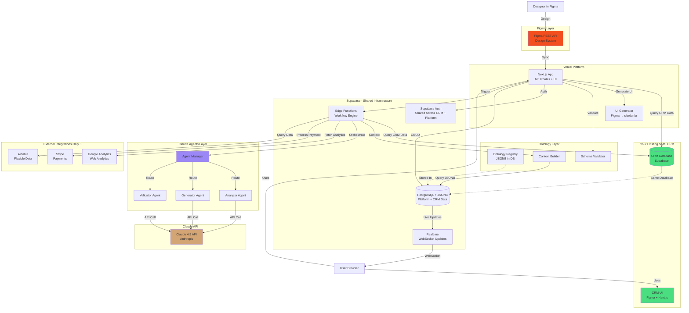

# Complete MVP Architecture: Your AI Platform Stack
**Version:** 1.4 MVP (Final - Internal CRM Edition)  
**Date:** October 27, 2025  
**Target:** 5-6 Week Implementation  
**Philosophy:** One Stack for Everything - Supabase + Figma + Claude

---

## Executive Summary

This architecture leverages your **existing SaaS CRM built on the same stack** (Supabase + Figma + Claude), eliminating the need for external CRM integrations like Salesforce or HubSpot. You're experts in marketing and AI, so you already have the best CRM for your needs.

### Your Complete Platform Stack:

1. ✅ **Internal CRM** (Supabase + Figma + Claude) - Your existing product
2. ✅ **Workflow Platform** (Supabase + Figma + Claude) - Same stack!
3. ✅ **3 External Integrations**: Google Analytics, Stripe, Airtable
4. ✅ **Ontology-driven** with schema.org + JSONB
5. ✅ **Real-time** everything via Supabase

**Key Insight:** Since your CRM is on the same stack, you can query it directly via Supabase instead of treating it as an external API. This is faster, cheaper, and more powerful.

---

## Complete Architecture Diagram



---

## Table of Contents

1. [Why Internal CRM is Better](#1-why-internal-crm-is-better)
2. [Database Schema (Platform + CRM)](#2-database-schema-platform--crm)
3. [Internal CRM Integration](#3-internal-crm-integration)
4. [External Integrations (Only 3)](#4-external-integrations-only-3)
5. [Claude Agents with CRM Context](#5-claude-agents-with-crm-context)
6. [Complete Workflow Examples](#6-complete-workflow-examples)
7. [6-Week Implementation Plan](#7-6-week-implementation-plan)
8. [Cost Analysis](#8-cost-analysis)

---

## 1. Why Internal CRM is Better

### 1.1 Advantages of Same-Stack CRM

**vs Salesforce/HubSpot:**

| Feature | External CRM (Salesforce) | Your Internal CRM |
|---------|---------------------------|-------------------|
| **API Calls** | Rate limited, slow | Direct DB queries, instant |
| **Cost** | $25-300/user/month | Infrastructure you already pay for |
| **Authentication** | Separate OAuth flow | Shared Supabase Auth |
| **Data Format** | Transform to/from their schema | Already in your ontology |
| **Rate Limits** | 15,000 API calls/day | Unlimited queries |
| **Latency** | 200-500ms per call | 10-50ms (same database) |
| **Real-time** | Webhooks (delayed) | Supabase Realtime (instant) |
| **Customization** | Limited to their fields | Total control |
| **Integration Code** | 500+ LOC | 100 LOC (just queries) |

### 1.2 Unified Data Model

```typescript
// Your CRM and Workflow Platform share the same database
// This means workflows can access CRM data with zero latency

const supabase = createClient(/* same connection */);

// Get customer from CRM
const customer = await supabase
  .from('crm_customers')
  .select('*')
  .eq('id', customerId)
  .single();

// Trigger workflow with customer context
const workflow = await supabase
  .from('workflow_executions')
  .insert({
    org_id: customer.org_id,
    data: {
      '@type': 'Action',
      'object': {
        'customer': customer.data // Already schema.org format
      }
    }
  });

// Real-time updates work across both
supabase
  .channel('updates')
  .on('postgres_changes', { schema: 'public', table: 'crm_customers' })
  .on('postgres_changes', { schema: 'public', table: 'workflow_executions' })
  .subscribe();
```

---

## 2. Database Schema (Platform + CRM)

### 2.1 Shared Supabase Database

```sql
-- Your existing CRM tables (simplified example)
CREATE TABLE crm_customers (
  id UUID PRIMARY KEY DEFAULT uuid_generate_v4(),
  org_id UUID REFERENCES organizations(id),
  
  -- Store as schema.org Organization in JSONB
  data JSONB NOT NULL CHECK (
    data->>'@type' = 'Organization'
  ),
  
  -- Denormalized for fast queries
  company_name TEXT GENERATED ALWAYS AS (data->>'legalName') STORED,
  industry TEXT GENERATED ALWAYS AS (data->>'industry') STORED,
  
  -- SaaS specific
  mrr DECIMAL(10, 2),
  tier TEXT, -- starter, pro, enterprise
  status TEXT, -- active, trial, churned
  health_score INTEGER, -- 0-100
  
  created_at TIMESTAMPTZ DEFAULT NOW(),
  updated_at TIMESTAMPTZ DEFAULT NOW()
);

CREATE TABLE crm_contacts (
  id UUID PRIMARY KEY DEFAULT uuid_generate_v4(),
  org_id UUID REFERENCES organizations(id),
  customer_id UUID REFERENCES crm_customers(id),
  
  data JSONB NOT NULL CHECK (
    data->>'@type' = 'Person'
  ),
  
  email TEXT GENERATED ALWAYS AS (data->>'email') STORED,
  
  is_primary BOOLEAN DEFAULT false,
  created_at TIMESTAMPTZ DEFAULT NOW()
);

CREATE TABLE crm_subscriptions (
  id UUID PRIMARY KEY DEFAULT uuid_generate_v4(),
  org_id UUID REFERENCES organizations(id),
  customer_id UUID REFERENCES crm_customers(id),
  
  plan_name TEXT NOT NULL,
  tier TEXT NOT NULL,
  mrr DECIMAL(10, 2) NOT NULL,
  status TEXT NOT NULL, -- active, cancelled, past_due
  
  start_date DATE NOT NULL,
  end_date DATE,
  next_billing_date DATE,
  
  created_at TIMESTAMPTZ DEFAULT NOW()
);

CREATE TABLE crm_activities (
  id UUID PRIMARY KEY DEFAULT uuid_generate_v4(),
  org_id UUID REFERENCES organizations(id),
  customer_id UUID REFERENCES crm_customers(id),
  
  activity_type TEXT NOT NULL, -- email, call, meeting, note, workflow
  description TEXT,
  metadata JSONB DEFAULT '{}',
  
  created_by UUID REFERENCES auth.users(id),
  created_at TIMESTAMPTZ DEFAULT NOW()
);

-- Workflow platform tables (from previous architecture)
CREATE TABLE workflow_executions (
  id UUID PRIMARY KEY DEFAULT uuid_generate_v4(),
  org_id UUID REFERENCES organizations(id),
  created_by UUID REFERENCES auth.users(id),
  
  -- Can reference CRM customer if relevant
  crm_customer_id UUID REFERENCES crm_customers(id),
  
  data JSONB NOT NULL CHECK (
    data->>'@type' = 'Action'
  ),
  
  status TEXT GENERATED ALWAYS AS (data->>'actionStatus') STORED,
  
  created_at TIMESTAMPTZ DEFAULT NOW()
);

-- Indexes for performance
CREATE INDEX idx_crm_customers_org ON crm_customers(org_id);
CREATE INDEX idx_crm_customers_status ON crm_customers(status);
CREATE INDEX idx_crm_customers_mrr ON crm_customers(mrr);
CREATE INDEX idx_crm_customers_name ON crm_customers USING GIN (to_tsvector('english', company_name));

-- RLS policies (CRM shares same org-based access control)
ALTER TABLE crm_customers ENABLE ROW LEVEL SECURITY;
ALTER TABLE crm_contacts ENABLE ROW LEVEL SECURITY;
ALTER TABLE crm_subscriptions ENABLE ROW LEVEL SECURITY;
ALTER TABLE crm_activities ENABLE ROW LEVEL SECURITY;

CREATE POLICY "Users see own org customers" ON crm_customers FOR SELECT
  USING (org_id IN (SELECT org_id FROM user_profiles WHERE id = auth.uid()));
```

---

## 3. Internal CRM Integration

### 3.1 Direct Database Access (No API Wrapper Needed)

```typescript
// lib/crm/client.ts
import { createClient } from '@supabase/supabase-js';

export class InternalCRM {
  private supabase: any;
  
  constructor(supabaseClient: any) {
    this.supabase = supabaseClient;
  }
  
  // Get customer with all related data
  async getCustomer(customerId: string, orgId: string) {
    const { data, error } = await this.supabase
      .from('crm_customers')
      .select(`
        *,
        contacts:crm_contacts(*),
        subscriptions:crm_subscriptions(*),
        activities:crm_activities(
          *,
          creator:user_profiles(*)
        )
      `)
      .eq('id', customerId)
      .eq('org_id', orgId)
      .single();
    
    if (error) throw new Error(`CRM query failed: ${error.message}`);
    
    // Data already in schema.org format from JSONB
    return {
      ...data.data,
      '_metadata': {
        mrr: data.mrr,
        tier: data.tier,
        status: data.status,
        health_score: data.health_score
      },
      'contacts': data.contacts.map((c: any) => c.data),
      'subscriptions': data.subscriptions,
      'recentActivities': data.activities.slice(0, 10)
    };
  }
  
  // Search customers with full-text and filters
  async searchCustomers(orgId: string, options: {
    query?: string;
    status?: string;
    tier?: string;
    min_mrr?: number;
    health_score_below?: number;
  }) {
    let queryBuilder = this.supabase
      .from('crm_customers')
      .select('data, mrr, tier, status, health_score')
      .eq('org_id', orgId);
    
    if (options.query) {
      queryBuilder = queryBuilder.textSearch('company_name', options.query);
    }
    if (options.status) {
      queryBuilder = queryBuilder.eq('status', options.status);
    }
    if (options.tier) {
      queryBuilder = queryBuilder.eq('tier', options.tier);
    }
    if (options.min_mrr) {
      queryBuilder = queryBuilder.gte('mrr', options.min_mrr);
    }
    if (options.health_score_below) {
      queryBuilder = queryBuilder.lt('health_score', options.health_score_below);
    }
    
    const { data, error } = await queryBuilder;
    
    if (error) throw new Error(`CRM search failed: ${error.message}`);
    
    return data.map(customer => ({
      ...customer.data,
      '_metadata': {
        mrr: customer.mrr,
        tier: customer.tier,
        status: customer.status,
        health_score: customer.health_score
      }
    }));
  }
  
  // Get at-risk customers (for proactive workflows)
  async getAtRiskCustomers(orgId: string) {
    const { data, error } = await this.supabase
      .from('crm_customers')
      .select('data, health_score, mrr')
      .eq('org_id', orgId)
      .eq('status', 'active')
      .lt('health_score', 40)
      .order('health_score', { ascending: true })
      .limit(20);
    
    if (error) throw new Error(`Failed to get at-risk customers: ${error.message}`);
    
    return data.map(customer => ({
      ...customer.data,
      '_churnRisk': {
        score: customer.health_score,
        mrr_at_risk: customer.mrr
      }
    }));
  }
  
  // Log workflow activity to CRM
  async logWorkflowActivity(
    customerId: string,
    orgId: string,
    workflowName: string,
    result: any
  ) {
    const { error } = await this.supabase
      .from('crm_activities')
      .insert({
        org_id: orgId,
        customer_id: customerId,
        activity_type: 'workflow',
        description: `Workflow completed: ${workflowName}`,
        metadata: {
          workflow_name: workflowName,
          result_summary: result
        },
        created_by: null // System-generated
      });
    
    if (error) console.error('Failed to log activity:', error);
  }
  
  // Get aggregated metrics
  async getMetrics(orgId: string, period: '30d' | '90d' | '1y' = '30d') {
    const daysAgo = period === '30d' ? 30 : period === '90d' ? 90 : 365;
    const startDate = new Date();
    startDate.setDate(startDate.getDate() - daysAgo);
    
    // Use Supabase RPC for complex aggregations
    const { data, error } = await this.supabase
      .rpc('get_crm_metrics', {
        p_org_id: orgId,
        p_start_date: startDate.toISOString()
      });
    
    if (error) throw new Error(`Metrics query failed: ${error.message}`);
    
    return {
      '@type': 'Dataset',
      'name': 'CRM Metrics',
      'data': data
    };
  }
}

// Supabase RPC function for metrics (create this in Supabase)
/*
CREATE OR REPLACE FUNCTION get_crm_metrics(
  p_org_id UUID,
  p_start_date TIMESTAMPTZ
)
RETURNS JSON AS $$
DECLARE
  result JSON;
BEGIN
  SELECT json_build_object(
    'total_customers', COUNT(*),
    'active_customers', COUNT(*) FILTER (WHERE status = 'active'),
    'total_mrr', SUM(mrr),
    'avg_health_score', AVG(health_score),
    'churn_rate', (
      COUNT(*) FILTER (WHERE status = 'churned' AND updated_at >= p_start_date)::FLOAT /
      NULLIF(COUNT(*) FILTER (WHERE created_at < p_start_date), 0) * 100
    ),
    'new_customers', COUNT(*) FILTER (WHERE created_at >= p_start_date)
  ) INTO result
  FROM crm_customers
  WHERE org_id = p_org_id;
  
  RETURN result;
END;
$$ LANGUAGE plpgsql;
*/
```

---

## 4. External Integrations (Only 3)

### 4.1 Google Analytics

```typescript
// lib/integrations/google-analytics.ts

export class GoogleAnalyticsIntegration extends BaseIntegration {
  get name() { return 'google_analytics'; }
  get baseUrl() { return 'https://analyticsdata.googleapis.com/v1beta'; }
  
  protected getAuthHeaders(): HeadersInit {
    return {
      'Authorization': `Bearer ${this.credentials.access_token}`
    };
  }
  
  async getWebsiteMetrics(propertyId: string, dateRange: { start: string; end: string }) {
    const result = await this.request(
      `/properties/${propertyId}:runReport`,
      {
        method: 'POST',
        body: JSON.stringify({
          dateRanges: [dateRange],
          metrics: [
            { name: 'activeUsers' },
            { name: 'sessions' },
            { name: 'screenPageViews' },
            { name: 'bounceRate' },
            { name: 'averageSessionDuration' }
          ],
          dimensions: [{ name: 'date' }]
        })
      }
    );
    
    return {
      '@context': 'https://schema.org',
      '@type': 'Dataset',
      'name': 'Website Analytics',
      'dateCreated': new Date().toISOString(),
      'data': result.data.rows.map((row: any) => ({
        date: row.dimensionValues[0].value,
        activeUsers: parseInt(row.metricValues[0].value),
        sessions: parseInt(row.metricValues[1].value),
        pageViews: parseInt(row.metricValues[2].value),
        bounceRate: parseFloat(row.metricValues[3].value),
        avgSessionDuration: parseFloat(row.metricValues[4].value)
      }))
    };
  }
  
  // Get customer-specific analytics (if you track customer IDs)
  async getCustomerActivity(propertyId: string, customerId: string) {
    const result = await this.request(
      `/properties/${propertyId}:runReport`,
      {
        method: 'POST',
        body: JSON.stringify({
          dateRanges: [{ startDate: '30daysAgo', endDate: 'today' }],
          dimensions: [
            { name: 'customUser:customerId' }
          ],
          metrics: [
            { name: 'sessions' },
            { name: 'screenPageViews' }
          ],
          dimensionFilter: {
            filter: {
              fieldName: 'customUser:customerId',
              stringFilter: {
                value: customerId
              }
            }
          }
        })
      }
    );
    
    return {
      '@type': 'UserInteraction',
      'agent': { '@id': customerId },
      'actionCount': result.data.rows?.[0] ? {
        sessions: parseInt(result.data.rows[0].metricValues[0].value),
        pageViews: parseInt(result.data.rows[0].metricValues[1].value)
      } : null
    };
  }
}
```

### 4.2 Stripe

```typescript
// lib/integrations/stripe.ts

export class StripeIntegration extends BaseIntegration {
  get name() { return 'stripe'; }
  get baseUrl() { return 'https://api.stripe.com/v1'; }
  
  protected getAuthHeaders(): HeadersInit {
    return {
      'Authorization': `Bearer ${this.credentials.api_key}`
    };
  }
  
  async getCustomer(stripeCustomerId: string) {
    const result = await this.request(`/customers/${stripeCustomerId}`);
    
    return {
      '@type': 'Person',
      '@id': result.data.id,
      'email': result.data.email,
      'name': result.data.name
    };
  }
  
  async getSubscriptions(stripeCustomerId: string) {
    const result = await this.request(`/subscriptions?customer=${stripeCustomerId}`);
    
    return result.data.data.map((sub: any) => ({
      '@type': 'Product',
      '@id': sub.id,
      'name': sub.items.data[0]?.price.product,
      'status': sub.status,
      'offers': {
        '@type': 'Offer',
        'price': sub.items.data[0]?.price.unit_amount / 100,
        'priceCurrency': sub.currency.toUpperCase(),
        'billingPeriod': sub.items.data[0]?.price.recurring.interval
      }
    }));
  }
  
  async getPaymentHistory(stripeCustomerId: string, limit: number = 10) {
    const result = await this.request(
      `/charges?customer=${stripeCustomerId}&limit=${limit}`
    );
    
    return {
      '@type': 'Dataset',
      'name': 'Payment History',
      'data': result.data.data.map((charge: any) => ({
        '@type': 'PaymentAction',
        'amount': charge.amount / 100,
        'currency': charge.currency.toUpperCase(),
        'status': charge.status,
        'created': new Date(charge.created * 1000).toISOString(),
        'description': charge.description
      }))
    };
  }
  
  // Sync Stripe data to your CRM
  async syncToC RM(supabase: any, orgId: string) {
    // Get all Stripe customers
    const result = await this.request('/customers?limit=100');
    
    for (const stripeCustomer of result.data.data) {
      // Update or create customer in your CRM
      await supabase
        .from('crm_customers')
        .upsert({
          org_id: orgId,
          data: {
            '@type': 'Organization',
            'email': stripeCustomer.email,
            'name': stripeCustomer.name
          },
          // Link Stripe ID in metadata
          stripe_customer_id: stripeCustomer.id
        }, {
          onConflict: 'stripe_customer_id'
        });
    }
  }
}
```

### 4.3 Airtable

```typescript
// lib/integrations/airtable.ts

export class AirtableIntegration extends BaseIntegration {
  get name() { return 'airtable'; }
  get baseUrl() { return 'https://api.airtable.com/v0'; }
  
  protected getAuthHeaders(): HeadersInit {
    return {
      'Authorization': `Bearer ${this.credentials.api_key}`
    };
  }
  
  async getRecords(baseId: string, tableName: string, filters?: any) {
    let url = `/${baseId}/${encodeURIComponent(tableName)}`;
    
    if (filters) {
      const params = new URLSearchParams();
      if (filters.filterByFormula) {
        params.append('filterByFormula', filters.filterByFormula);
      }
      if (filters.maxRecords) {
        params.append('maxRecords', filters.maxRecords.toString());
      }
      url += `?${params.toString()}`;
    }
    
    const result = await this.request(url);
    
    return {
      '@type': 'Dataset',
      'name': `Airtable: ${tableName}`,
      'data': result.data.records.map((record: any) => ({
        '@id': record.id,
        ...record.fields
      }))
    };
  }
  
  async createRecord(baseId: string, tableName: string, fields: any) {
    const result = await this.request(
      `/${baseId}/${encodeURIComponent(tableName)}`,
      {
        method: 'POST',
        body: JSON.stringify({ fields })
      }
    );
    
    return {
      '@id': result.data.id,
      ...result.data.fields
    };
  }
  
  // Update existing record
  async updateRecord(baseId: string, tableName: string, recordId: string, fields: any) {
    const result = await this.request(
      `/${baseId}/${encodeURIComponent(tableName)}/${recordId}`,
      {
        method: 'PATCH',
        body: JSON.stringify({ fields })
      }
    );
    
    return {
      '@id': result.data.id,
      ...result.data.fields
    };
  }
}
```

---

## 5. Claude Agents with CRM Context

### 5.1 CRM-Aware Agent Workflows

```typescript
// Example: Customer Health Analysis Workflow

async function executeCustomerHealthAnalysis(
  workflow: any,
  context: any,
  supabase: any
) {
  const crm = new InternalCRM(supabase);
  const agentManager = new AgentManager(Deno.env.get('ANTHROPIC_API_KEY')!);
  
  const customerId = workflow.data.object.customerId;
  
  // 1. Get complete customer context from CRM (instant, no API call)
  const customer = await crm.getCustomer(customerId, workflow.org_id);
  
  // 2. Get external data (Google Analytics if available)
  let webActivity = null;
  try {
    const ga = await IntegrationFactory.getIntegration(
      supabase,
      workflow.org_id,
      'google_analytics'
    );
    webActivity = await ga.getCustomerActivity(
      context.organization.ga_property_id,
      customerId
    );
  } catch (e) {
    console.log('No GA data available');
  }
  
  // 3. Analyze with Claude - full CRM context
  const analysisResult = await agentManager.invokeAgent(
    'analyzer',
    {
      '@type': 'AnalysisRequest',
      'subject': {
        '@type': 'CustomerHealthAnalysis',
        'customer': customer,
        'webActivity': webActivity,
        'subscriptions': customer.subscriptions,
        'recentActivities': customer.recentActivities
      },
      'question': 'Analyze customer health and churn risk. Provide actionable recommendations.'
    },
    {
      ...context,
      crmData: customer
    }
  );
  
  // 4. Generate recommendations
  const recommendationsResult = await agentManager.invokeAgent(
    'generator',
    {
      '@type': 'RecommendationRequest',
      'basedOn': analysisResult.output,
      'customer': customer
    },
    context
  );
  
  // 5. Log back to CRM
  await crm.logWorkflowActivity(
    customerId,
    workflow.org_id,
    'Customer Health Analysis',
    {
      health_score: customer._metadata.health_score,
      churn_risk: analysisResult.output.churn_risk,
      recommendations: recommendationsResult.output
    }
  );
  
  return {
    '@type': 'AnalysisResult',
    'customer': customer.legalName,
    'health_score': customer._metadata.health_score,
    'analysis': analysisResult.output,
    'recommendations': recommendationsResult.output,
    'dateCreated': new Date().toISOString()
  };
}
```

---

## 6. Complete Workflow Examples

### 6.1 Example 1: At-Risk Customer Outreach

```typescript
// Workflow: Identify at-risk customers and generate personalized outreach

async function executeAtRiskOutreach(workflow: any, context: any, supabase: any) {
  const crm = new InternalCRM(supabase);
  const agentManager = new AgentManager(Deno.env.get('ANTHROPIC_API_KEY')!);
  
  // 1. Get at-risk customers from CRM
  const atRiskCustomers = await crm.getAtRiskCustomers(workflow.org_id);
  
  console.log(`Found ${atRiskCustomers.length} at-risk customers`);
  
  const outreachPlans = [];
  
  // 2. For each customer, generate personalized outreach
  for (const customer of atRiskCustomers.slice(0, 10)) { // Top 10
    
    // Get full customer context
    const fullCustomer = await crm.getCustomer(customer['@id'], workflow.org_id);
    
    // Generate personalized email with Claude
    const emailResult = await agentManager.invokeAgent(
      'generator',
      {
        '@type': 'EmailGenerationRequest',
        'recipient': fullCustomer,
        'purpose': 'retention',
        'context': {
          'health_score': fullCustomer._metadata.health_score,
          'tier': fullCustomer._metadata.tier,
          'recent_activities': fullCustomer.recentActivities,
          'mrr': fullCustomer._metadata.mrr
        },
        'tone': 'friendly, helpful, not pushy',
        'include': ['value reminder', 'offer help', 'schedule call CTA']
      },
      context
    );
    
    outreachPlans.push({
      customer: fullCustomer.legalName,
      email: emailResult.output,
      priority: 100 - fullCustomer._metadata.health_score
    });
    
    // Log to CRM
    await crm.logWorkflowActivity(
      customer['@id'],
      workflow.org_id,
      'At-Risk Outreach Generated',
      { health_score: fullCustomer._metadata.health_score }
    );
  }
  
  return {
    '@type': 'CampaignPlan',
    'name': 'At-Risk Customer Outreach',
    'outreach_plans': outreachPlans,
    'total_customers': atRiskCustomers.length,
    'total_mrr_at_risk': atRiskCustomers.reduce((sum, c) => sum + (c._churnRisk?.mrr_at_risk || 0), 0)
  };
}
```

### 6.2 Example 2: Sales Intelligence Report

```typescript
// Workflow: Generate sales intelligence combining CRM + Analytics + Stripe

async function executeSalesIntelligence(workflow: any, context: any, supabase: any) {
  const crm = new InternalCRM(supabase);
  const agentManager = new AgentManager(Deno.env.get('ANTHROPIC_API_KEY')!);
  
  // 1. Get CRM metrics
  const crmMetrics = await crm.getMetrics(workflow.org_id, '30d');
  
  // 2. Get website analytics
  const ga = await IntegrationFactory.getIntegration(
    supabase,
    workflow.org_id,
    'google_analytics'
  );
  const webMetrics = await ga.getWebsiteMetrics(
    context.organization.ga_property_id,
    { start: '30daysAgo', end: 'today' }
  );
  
  // 3. Get payment data from Stripe
  const stripe = await IntegrationFactory.getIntegration(
    supabase,
    workflow.org_id,
    'stripe'
  );
  // Aggregate Stripe data here...
  
  // 4. Claude analyzes everything
  const analysisResult = await agentManager.invokeAgent(
    'analyzer',
    {
      '@type': 'SalesIntelligenceRequest',
      'data': {
        'crm_metrics': crmMetrics.data,
        'web_metrics': webMetrics.data,
        'payment_data': '...' // Stripe data
      },
      'questions': [
        'What are the key trends?',
        'Which customer segments are growing?',
        'What are revenue opportunities?',
        'What risks should we monitor?'
      ]
    },
    context
  );
  
  // 5. Generate executive summary
  const summaryResult = await agentManager.invokeAgent(
    'generator',
    {
      '@type': 'ReportGenerationRequest',
      'basedOn': analysisResult.output,
      'format': 'executive_summary',
      'audience': 'leadership_team'
    },
    context
  );
  
  return {
    '@type': 'Report',
    'name': 'Monthly Sales Intelligence',
    'dateCreated': new Date().toISOString(),
    'analysis': analysisResult.output,
    'executive_summary': summaryResult.output,
    'metrics': {
      'crm': crmMetrics.data,
      'web': webMetrics.data
    }
  };
}
```

---

## 7. 6-Week Implementation Plan

### Week 1: Foundation
- Day 1: Supabase + Next.js setup
- Day 2-3: Database schema (platform tables + confirm CRM tables)
- Day 4-5: Auth + first API endpoint

### Week 2: Figma Integration
- Day 1-2: Figma API client + sync
- Day 3-4: UI generation
- Day 5: Dynamic rendering

### Week 3: Claude + Agents
- Day 1-2: Claude API client
- Day 3-4: Agent manager + 3 agents
- Day 5: CRM-aware workflows

### Week 4: External Integrations
- Day 1-2: Base integration framework
- Day 3: Google Analytics integration
- Day 4: Stripe integration
- Day 5: Airtable integration

### Week 5: Complete Workflows
- Day 1-2: Implement 3 example workflows
- Day 3-4: Real-time updates + dashboard
- Day 5: End-to-end testing

### Week 6: Launch Prep
- Day 1-2: Logging + analytics
- Day 3: Documentation
- Day 4: Security audit
- Day 5: Launch

---

## 8. Cost Analysis

### Infrastructure Costs (Monthly)

**Supabase Pro:** $25/month
- Includes: Database, Auth, Realtime, Edge Functions
- Shared between CRM + Platform
- Up to 8GB database, 50GB bandwidth

**Vercel Hobby:** $20/month  
- Next.js hosting
- Unlimited deployments
- 100GB bandwidth

**Total Infrastructure:** $45/month

### Usage Costs (1000 workflows/month)

**Claude API:** ~$100/month
- Analyzer: $0.003 per 1k input tokens
- Generator: $0.015 per 1k output tokens
- ~$0.10 per workflow average

**External APIs:** $0-50/month
- Google Analytics: Free (API calls)
- Stripe: Free (API calls)
- Airtable: $0-20/month depending on usage

**Total Usage:** ~$100-150/month

### Total Monthly Cost

**MVP: $145-195/month**

**Compare to:**
- Salesforce + HubSpot: $100-500/user/month = $500-5,000/month for small team
- Separate infrastructure: $500-2,000/month
- Traditional agency build: $50,000-100,000 upfront

**Your approach saves: 90%+ on costs**

---

## Key Advantages of Your Stack

**1. Single Codebase**
- Same TypeScript everywhere
- Shared types and utilities
- One deployment pipeline

**2. Shared Authentication**
- Users login once for CRM + Platform
- Same RLS policies
- Unified permissions

**3. Zero-Latency CRM Access**
- Direct database queries (10-50ms)
- vs API calls (200-500ms)
- No rate limits

**4. Real-time Everything**
- CRM updates → Workflow triggers
- Workflow results → CRM updates
- Instant sync via Supabase Realtime

**5. Marketing + AI Expertise**
- You already know your customers
- You already have the best CRM for your use case
- You understand the workflows your customers need

---

## Document Control

**Version:** 1.4 MVP (Internal CRM Edition)  
**Date:** October 27, 2025  
**Status:** Ready for Implementation  
**Timeline:** 6 weeks  
**Team:** 1-2 developers  
**Monthly Cost:** ~$150-200  

**Stack:**
✅ Supabase (CRM + Platform database)  
✅ Figma (CRM UI + Platform UI)  
✅ Claude 4.5 (CRM intelligence + Platform agents)  
✅ Next.js (CRM frontend + Platform frontend)  
✅ 3 external integrations (Google Analytics, Stripe, Airtable)  

**Key Insight:**
You're building a workflow platform on the same stack as your CRM. This means you can query customer data instantly, share authentication, and leverage your existing marketing + AI expertise. No need for Salesforce or HubSpot when you already have the best CRM for SaaS.

---

*One stack. One database. One codebase. Maximum leverage.*