# PF-CORE CI/CD Automation Agent

> Intelligent infrastructure provisioning and deployment automation powered by Claude AI

[](https://www.python.org/downloads/)
[](https://opensource.org/licenses/MIT)

## Overview

The PF-CORE CI/CD Automation Agent is an AI-powered tool that automates the provisioning, configuration, and deployment of PF-CORE platform instances. Using Claude as its reasoning engine, it orchestrates operations across GitHub, Digital Ocean, and Supabase to create complete deployment pipelines.

```mermaid
graph TB
    subgraph User["👤 User Interface"]
        CLI[CLI Chat]
        API[Programmatic API]
    end

    subgraph Agent["🤖 CI/CD Agent"]
        Orchestrator[Claude Orchestrator]
        Tools[Tool Registry]
        Audit[Audit System]
    end

    subgraph Platforms["☁️ Cloud Platforms"]
        GitHub[GitHub]
        DO[Digital Ocean]
        Supabase[Supabase]
    end

    CLI --> Orchestrator
    API --> Orchestrator
    Orchestrator --> Tools
    Tools --> GitHub
    Tools --> DO
    Tools --> Supabase
    Orchestrator --> Audit
    Audit --> Supabase
```



## Features

- **Natural Language Interface**: Describe what you want in plain English
- **Multi-Platform Orchestration**: GitHub, Digital Ocean, Supabase integration
- **Configuration Inheritance**: 4-level config hierarchy (PF-CORE → Instance → Product → WhiteLabel)
- **Complete Audit Trail**: Every action logged for compliance and debugging
- **Template Engine**: Jinja2-powered templates for workflows, infrastructure, and configs
- **Extensible Tools**: Easy to add new tools and integrations

## Quick Start

### Prerequisites

- Python 3.11+
- Anthropic API key (Claude)
- GitHub Personal Access Token
- Digital Ocean API Token
- Supabase Project

### Installation

```bash
# Clone the repository
git clone https://github.com/ajrmooreuk/PF-Prototype-Shared.git
cd PF-Prototype-Shared/CI-CD/pf-cicd-agent

# Create virtual environment
python -m venv venv
source venv/bin/activate  # On Windows: venv\Scripts\activate

# Install the package
pip install -e ".[dev]"

# Copy and configure environment
cp .env.example .env
# Edit .env with your API keys
```

### Configuration

Edit `.env` with your credentials:

```bash
# Required
ANTHROPIC_API_KEY=sk-ant-...
GITHUB_TOKEN=ghp_...
GITHUB_ORG=your-org
DO_API_TOKEN=dop_v1_...
DO_SSH_KEY_FINGERPRINT=xx:xx:xx:...
SUPABASE_URL=https://your-project.supabase.co
SUPABASE_ANON_KEY=eyJ...
SUPABASE_SERVICE_ROLE_KEY=eyJ...
```

### First Run

```bash
# Start interactive chat
pf-cicd chat

# You can now talk to the agent:
# > Create a new repository called air-ep with branch protection
# > Provision a development droplet for the AIR instance
# > Set up CI/CD workflows for the EP product
```

## Documentation

| Document | Description |
|----------|-------------|
| [Architecture Guide](docs/architecture.md) | System architecture and design |
| [Configuration Guide](docs/configuration.md) | Configuration schemas and inheritance |
| [Tools Reference](docs/tools-reference.md) | Available tools and parameters |
| [Deployment Guide](docs/deployment.md) | Step-by-step deployment instructions |
| [API Reference](docs/api-reference.md) | Programmatic API usage |

## Architecture


## Available Tools

### GitHub Tools
| Tool | Description |
|------|-------------|
| `create_repo` | Create a new repository |
| `configure_branch_protection` | Set branch protection rules |
| `create_environment` | Create deployment environment |
| `set_secret` | Set repository/environment secrets |
| `create_workflow` | Create GitHub Actions workflow |

### Digital Ocean Tools
| Tool | Description |
|------|-------------|
| `create_droplet` | Provision a new VPS |
| `configure_firewall` | Set up cloud firewall |
| `bootstrap_droplet` | Execute setup scripts via SSH |
| `create_dns_record` | Create DNS records |

## Example Workflows

### Provision a Complete Instance

```bash
pf-cicd chat

You: Create the AIR instance with the EP product

Agent: I'll provision the AIR-EP platform. Let me:
1. ✓ Create the air-ep repository from template
2. ✓ Configure branch protection for main and develop
3. ✓ Set up dev, staging, and production environments
4. ✓ Create droplets for each environment
5. ✓ Configure firewalls and DNS
6. ✓ Set up CI/CD workflows

All infrastructure has been provisioned successfully!
```

### Programmatic Usage

```python
from pf_cicd_agent import CICDOrchestrator

# Initialize
agent = CICDOrchestrator()
agent.start_session()

# Execute commands
result = agent.execute_command("create_repo",
    name="air-ep",
    description="AIR EP Product",
    private=True
)

# Or use chat interface
response = agent.chat("Set up branch protection for main with 2 required reviews")

# End session
summary = agent.end_session()
```

## Project Structure

```
pf-cicd-agent/
├── src/pf_cicd_agent/
│   ├── agents/           # Agent implementations
│   ├── audit/            # Audit logging system
│   ├── config/           # Configuration management
│   ├── templates/        # Template engine
│   ├── tools/            # Tool implementations
│   │   ├── github/       # GitHub API tools
│   │   └── digitalocean/ # DO API tools
│   └── cli.py            # CLI entry point
├── templates/            # Template files
│   ├── base/             # Base configurations
│   ├── workflows/        # CI/CD templates
│   ├── infrastructure/   # Server setup templates
│   ├── database/         # SQL migrations
│   └── instances/        # Instance configs
└── docs/                 # Documentation
```

## Contributing

1. Fork the repository
2. Create a feature branch
3. Make your changes
4. Run tests: `pytest`
5. Submit a pull request

## License

MIT License - see [LICENSE](LICENSE) for details.

---

**Built with ❤️ by Platform Foundation Core Holdings**
