# PF-CORE CI/CD Agent Architecture

## System Overview

The PF-CORE CI/CD Automation Agent is a multi-layered system that combines AI-powered orchestration with infrastructure automation to provision and manage platform deployments.


## Component Architecture

### 1. Agent Layer

The agent layer is the brain of the system, powered by Claude AI.


#### Orchestrator (`agents/orchestrator.py`)

The central coordinator that:
- Manages Claude conversations
- Routes tool calls to the registry
- Handles multi-step operations
- Reports progress to users

```python
class CICDOrchestrator:
    """Primary orchestration agent."""

    def __init__(self, settings, audit_service, tool_registry):
        self._client = Anthropic(api_key=settings.anthropic_api_key)
        self.tools = tool_registry
        self.audit_service = audit_service

    def chat(self, user_message: str) -> str:
        """Process user message through Claude."""
        response = self._client.messages.create(
            model=self.settings.agent_model,
            system=SYSTEM_PROMPT,
            tools=self.tools.get_definitions(),
            messages=self._messages
        )
        return self._process_response(response)
```

#### Conversation Handler (`agents/conversation.py`)

Manages conversation state across multi-turn interactions:
- Message history
- Context tracking
- Operation state
- Confirmation handling

### 2. Tool Layer

Tools are the hands of the agent - they perform actual operations.


#### Tool Definition Format

Tools are exposed to Claude in a standardized format:

```json
{
  "name": "create_repo",
  "description": "Create a new GitHub repository in the organization",
  "input_schema": {
    "type": "object",
    "properties": {
      "name": {
        "type": "string",
        "description": "Repository name"
      },
      "description": {
        "type": "string",
        "description": "Repository description"
      },
      "private": {
        "type": "boolean",
        "default": true
      }
    },
    "required": ["name"]
  }
}
```

### 3. Configuration Layer

The configuration system supports 4-level inheritance for multi-tenant deployments.

```mermaid
graph TB
    subgraph Hierarchy["Configuration Hierarchy"]
        PFCore["PF-CORE Base<br/>━━━━━━━━━━━<br/>• Default settings<br/>• Platform standards<br/>• Base design tokens"]

        Instance["Instance (AIR/BAIV/W4M)<br/>━━━━━━━━━━━━━━━━━━<br/>• Brand tokens<br/>• Instance overrides<br/>• Admin contacts"]

        Product["Product (EP/VHF/WWG)<br/>━━━━━━━━━━━━━━━━<br/>• Product features<br/>• API config<br/>• DB extensions"]

        WhiteLabel["White-Label<br/>━━━━━━━━━━<br/>• Custom domain<br/>• Full rebrand<br/>• Usage limits"]
    end

    PFCore -->|extends| Instance
    Instance -->|extends| Product
    Product -->|extends| WhiteLabel

    subgraph Resolution["Inheritance Resolution"]
        Merge["Deep Merge<br/>Override Detection"]
    end

    Hierarchy --> Merge
```



#### Inheritance Engine

The inheritance engine performs deep merging with override tracking:

```python
class InheritanceEngine:
    def resolve_inheritance(self, config_id: str) -> tuple[dict, list[str]]:
        """Resolve full inheritance chain."""
        chain = self._build_inheritance_chain(config_id)
        resolved = {}
        overrides = []

        for chain_id in chain:
            config = self.get_config(chain_id)
            resolved, new_overrides = self.deep_merge(resolved, config)
            overrides.extend(new_overrides)

        return resolved, overrides
```

### 4. Template Layer

Templates generate configuration and infrastructure files using Jinja2.


### 5. Audit Layer

Every action is logged for compliance and debugging.


## Data Flow

### Provisioning Workflow


## Security Architecture


### Security Best Practices

1. **Secrets never logged**: Audit decorators redact sensitive fields
2. **Minimal permissions**: Tools request only needed scopes
3. **Firewall by default**: All droplets get firewall rules
4. **SSL everywhere**: Nginx templates include SSL configuration
5. **Audit trail**: Every action logged to Supabase

## Extensibility

### Adding a New Tool

```python
from pf_cicd_agent.tools.base import BaseTool, ToolResult

class MyNewTool(BaseTool):
    name = "my_new_tool"
    description = "Does something useful"
    category = "custom"

    def get_input_schema(self) -> dict:
        return {
            "type": "object",
            "properties": {
                "param1": {"type": "string", "description": "First param"}
            },
            "required": ["param1"]
        }

    def execute(self, param1: str) -> ToolResult:
        # Implementation
        return ToolResult.success(data={"result": "done"})

# Register the tool
registry.register(MyNewTool)
```

### Adding a New Template

1. Create template file in `templates/` directory
2. Use Jinja2 syntax with available context variables
3. Load via `TemplateEngine.render()`

```jinja2
# templates/custom/my-template.yaml.template
name: {{ product_name }}
instance: {{ instance_id }}
environment: {{ environment }}

settings:
  feature_enabled: {{ features.my_feature | default(false) }}
```

## Performance Considerations

| Component | Optimization |
|-----------|--------------|
| Tool Execution | Parallel tool calls where possible |
| API Calls | Connection pooling, retry with backoff |
| Templates | Jinja2 template caching |
| Config | Cached inheritance resolution |
| Audit | Async logging (future) |

## Monitoring & Observability


---

*Document Version: 1.0.0 | Last Updated: December 2025*
