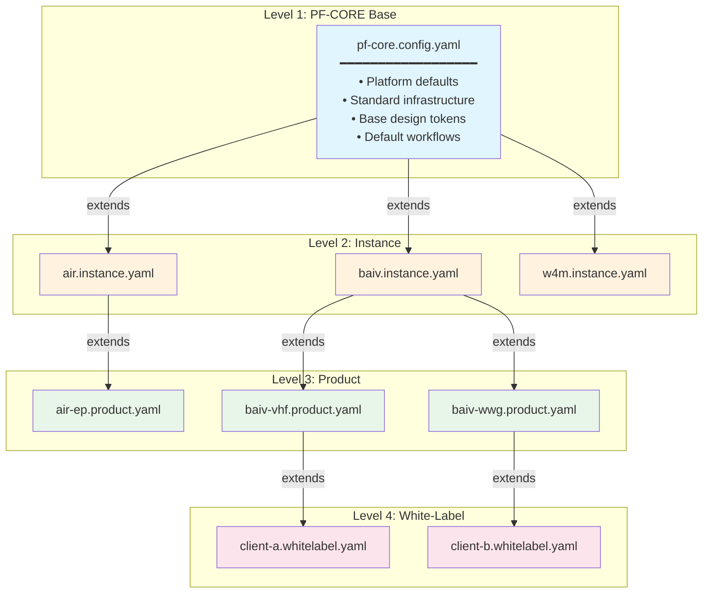
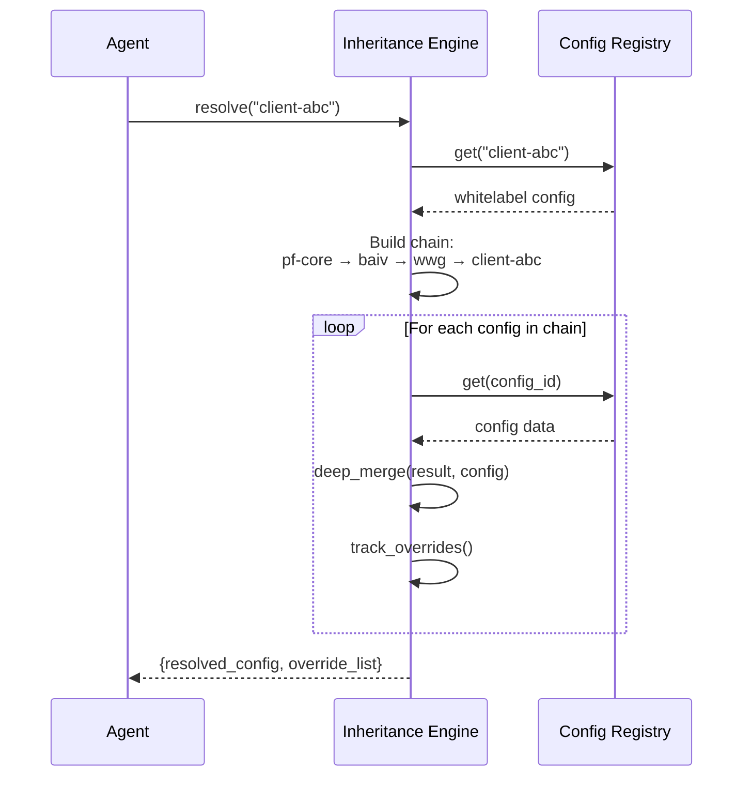
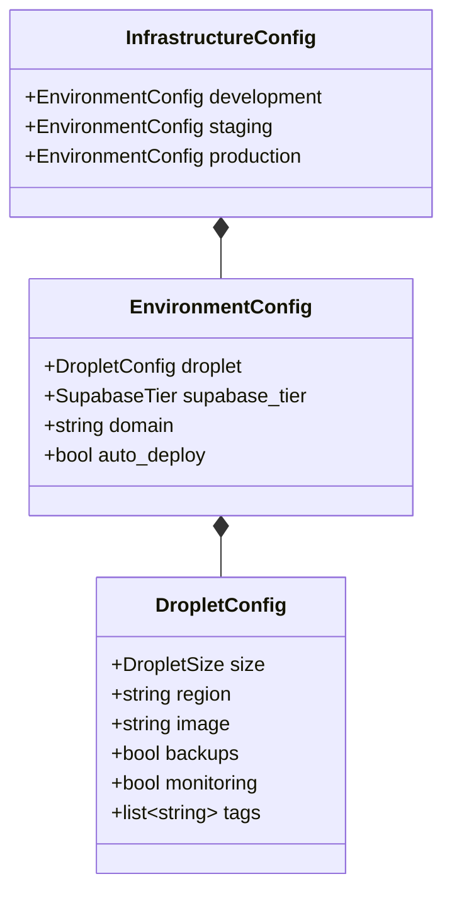
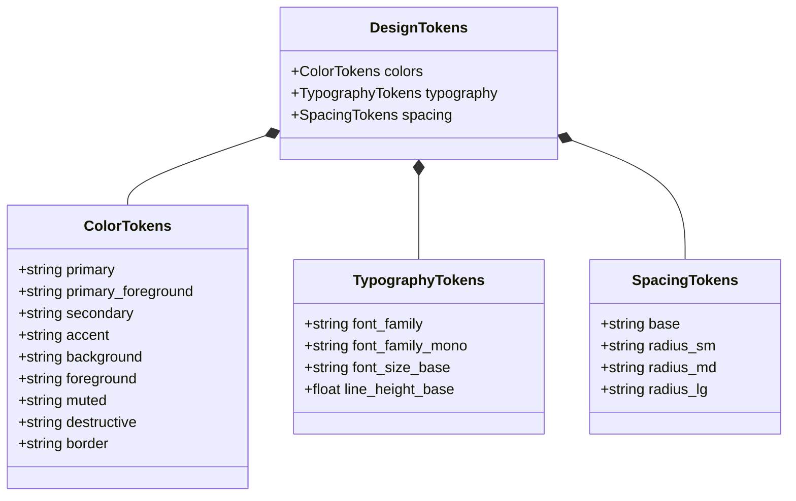

# Configuration Guide

This guide explains the configuration system, inheritance hierarchy, and how to create custom configurations for instances and products.

## Configuration Hierarchy

The PF-CORE platform uses a 4-level configuration inheritance system:



## Configuration Schemas

### PF-CORE Base Configuration

The base configuration defines platform-wide defaults.

```yaml
# templates/base/pf-core.config.yaml

schema_version: "1.0.0"
platform_name: "PF-CORE"
platform_version: "1.0.0"

# Runtime defaults
default_node_version: "20"
default_python_version: "3.11"

# Infrastructure per environment
infrastructure:
  development:
    droplet:
      size: "s-1vcpu-1gb"
      region: "lon1"
      image: "ubuntu-22-04-x64"
      backups: false
      monitoring: true
    supabase_tier: "free"
    auto_deploy: true

  staging:
    droplet:
      size: "s-1vcpu-1gb"
      # ... inherits other defaults

  production:
    droplet:
      size: "s-1vcpu-2gb"
      backups: true
    supabase_tier: "pro"
    auto_deploy: false  # Manual approval required

# GitHub defaults
github:
  visibility: "private"
  branch_protection:
    main:
      required_reviews: 2
      require_status_checks:
        - "quality-gates"
        - "security"
    develop:
      required_reviews: 1

# CI/CD pipeline
pipeline:
  quality_gates:
    coverage_threshold: 80.0
    lint_enabled: true
    type_check_enabled: true
    security_scan_enabled: true

# Design tokens
design_tokens:
  colors:
    primary: "#3B82F6"
    secondary: "#6B7280"
    # ...
```

### Instance Configuration

Instance configs represent a tenant/brand (e.g., AIR, BAIV, W4M).

```yaml
# templates/instances/air.instance.yaml

instance_id: "air"
instance_name: "Artist in Residence"
description: "Platform for artist residency programs"
extends: "pf-core"  # Inherits from base

# Brand-specific design tokens (overrides base)
design_tokens:
  colors:
    primary: "#E11D48"      # Rose - overrides base primary
    secondary: "#F472B6"    # Pink
    accent: "#FBBF24"       # Amber
    background: "#FFFBEB"   # Warm white

  typography:
    font_family: "Playfair Display, serif"  # Custom font

# Brand assets
brand_assets:
  logo: "https://assets.air-platform.com/logo.svg"
  favicon: "https://assets.air-platform.com/favicon.ico"

# Contact information
admin_email: "admin@air-platform.com"
support_email: "support@air-platform.com"

# Products under this instance
products:
  - "ep"

# Instance-specific overrides
infrastructure:
  production:
    droplet:
      size: "s-2vcpu-4gb"  # Larger for production
```

### Product Configuration

Product configs represent applications within an instance.

```yaml
# templates/products/air-ep.product.yaml

product_id: "ep"
product_name: "Exhibition Platform"
description: "Digital platform for art exhibitions"
extends: "air"  # Inherits from AIR instance

# Repository name override
repo_name: "air-ep"

# Product features
features:
  exhibitions: true
  virtual_tours: true
  artist_profiles: true
  booking_system: false  # Disabled for this product

# API configuration
api_version: "v1"
api_prefix: "/api"

# Database extensions
db_schema_extensions:
  - "002_air_exhibitions.sql"
  - "003_air_artists.sql"

# Product-specific design token adjustments
design_tokens:
  colors:
    accent: "#10B981"  # Green accent for EP
```

### White-Label Configuration

White-label configs enable complete rebranding for clients.

```yaml
# templates/whitelabels/client-abc.whitelabel.yaml

whitelabel_id: "client-abc"
client_name: "ABC Art Collective"
description: "White-label deployment for ABC"
extends: "baiv-wwg"  # Inherits from WWG product

# Complete brand override
design_tokens:
  colors:
    primary: "#7C3AED"
    secondary: "#A78BFA"
    background: "#F5F3FF"

brand_assets:
  logo: "https://abc-collective.com/logo.svg"
  favicon: "https://abc-collective.com/favicon.ico"

# Custom domain
custom_domain: "platform.abc-collective.com"

# Feature restrictions
disabled_features:
  - "analytics"
  - "export_data"

# Usage limits
usage_limits:
  max_users: 100
  max_storage_gb: 10
```

## Inheritance Resolution

When the agent loads a configuration, it resolves the full inheritance chain:



### Override Detection

The engine tracks what values were overridden at each level:

```python
from pf_cicd_agent.config import InheritanceEngine

engine = InheritanceEngine()
engine.register_config("pf-core", pf_core_config)
engine.register_config("air", air_config)
engine.register_config("air-ep", ep_config)

resolved, overrides = engine.resolve_inheritance("air-ep")

for override in overrides:
    print(override)

# Output:
# [air] design_tokens.colors.primary [#3B82F6 → #E11D48]
# [air] design_tokens.typography.font_family [Inter → Playfair Display]
# [air-ep] design_tokens.colors.accent [#8B5CF6 → #10B981]
```

## Creating Custom Configurations

### Step 1: Create Instance Configuration

```bash
# Using the template loader
pf-cicd exec validate templates/instances/my-instance.instance.yaml
```

Or programmatically:

```python
from pf_cicd_agent.templates import TemplateLoader

loader = TemplateLoader()
loader.create_instance_config(
    instance_id="my-corp",
    instance_name="My Corporation",
    description="Enterprise deployment",
    design_tokens={
        "colors": {
            "primary": "#1E40AF",
            "secondary": "#3B82F6"
        }
    },
    admin_email="admin@my-corp.com"
)
```

### Step 2: Create Product Configuration

```python
loader.create_product_config(
    instance_id="my-corp",
    product_id="dashboard",
    product_name="Analytics Dashboard",
    features={
        "real_time": True,
        "exports": True
    }
)
```

### Step 3: Validate Configuration

```bash
pf-cicd validate templates/instances/my-corp.instance.yaml
pf-cicd validate templates/products/my-corp-dashboard.product.yaml
```

## Configuration Schema Reference

### Infrastructure Schema



### Design Tokens Schema



## Environment Variables

The agent itself is configured via environment variables:

| Variable | Required | Description | Default |
|----------|----------|-------------|---------|
| `ANTHROPIC_API_KEY` | Yes | Claude API key | - |
| `GITHUB_TOKEN` | Yes | GitHub PAT | - |
| `GITHUB_ORG` | Yes | GitHub organization | - |
| `GITHUB_TEMPLATE_REPO` | No | Template repository | `pf-core-template` |
| `DO_API_TOKEN` | Yes | Digital Ocean API token | - |
| `DO_SSH_KEY_FINGERPRINT` | Yes | SSH key fingerprint | - |
| `DO_REGION` | No | Default region | `lon1` |
| `DO_DEFAULT_IMAGE` | No | Default droplet image | `ubuntu-22-04-x64` |
| `SUPABASE_URL` | Yes | Supabase project URL | - |
| `SUPABASE_ANON_KEY` | Yes | Supabase anon key | - |
| `SUPABASE_SERVICE_ROLE_KEY` | Yes | Supabase service key | - |
| `AGENT_MODEL` | No | Claude model | `claude-sonnet-4-20250514` |
| `LOG_LEVEL` | No | Logging level | `INFO` |
| `AUDIT_ENABLED` | No | Enable audit logging | `true` |

---

*Document Version: 1.0.0 | Last Updated: December 2025*
