# Deployment Guide

This guide walks you through deploying the PF-CORE CI/CD Agent and using it to provision platform infrastructure.

## Table of Contents

1. [Prerequisites](#prerequisites)
2. [Installation](#installation)
3. [Configuration](#configuration)
4. [Using the Agent](#using-the-agent)
5. [Provisioning Workflows](#provisioning-workflows)
6. [Production Deployment](#production-deployment)
7. [Troubleshooting](#troubleshooting)

---

## Prerequisites

### Required Accounts & Access


| Service | What You Need | How to Get It |
|---------|---------------|---------------|
| **Anthropic** | API Key | [console.anthropic.com](https://console.anthropic.com) |
| **GitHub** | Personal Access Token | Settings → Developer settings → Personal access tokens |
| **GitHub** | Organization access | Create or join an organization |
| **Digital Ocean** | API Token | API → Generate New Token |
| **Digital Ocean** | SSH Key | Upload your public key |
| **Supabase** | Project URL + Keys | Create project → Settings → API |

### GitHub Token Permissions

Your GitHub PAT needs these scopes:
- `repo` - Full control of private repositories
- `workflow` - Update GitHub Action workflows
- `admin:org` - Manage organization settings

### Digital Ocean Requirements

1. **API Token**: Read/Write access
2. **SSH Key**: Upload your public key and note the fingerprint
3. **Domain** (optional): Add domain to DO for DNS management

---

## Installation

### Step 1: Clone Repository

```bash
git clone https://github.com/ajrmooreuk/PF-Prototype-Shared.git
cd PF-Prototype-Shared/CI-CD/pf-cicd-agent
```

### Step 2: Create Virtual Environment

```bash
# Create environment
python -m venv venv

# Activate (Linux/macOS)
source venv/bin/activate

# Activate (Windows)
venv\Scripts\activate
```

### Step 3: Install Package

```bash
# Install with development dependencies
pip install -e ".[dev]"

# Verify installation
pf-cicd version
```

### Installation Verification

```mermaid
flowchart LR
    A[Clone Repo] --> B[Create venv]
    B --> C[Install Package]
    C --> D{pf-cicd version}
    D -->|Success| E[✅ Ready]
    D -->|Error| F[Check Python version]
```



---

## Configuration

### Step 1: Create Environment File

```bash
cp .env.example .env
```

### Step 2: Configure Required Variables

Edit `.env` with your credentials:

```bash
# =============================================================================
# REQUIRED CONFIGURATION
# =============================================================================

# Anthropic API (Claude)
ANTHROPIC_API_KEY=sk-ant-api03-your-key-here

# GitHub
GITHUB_TOKEN=ghp_your-personal-access-token
GITHUB_ORG=your-organization-name
GITHUB_TEMPLATE_REPO=pf-core-template  # Optional: template repo name

# Digital Ocean
DO_API_TOKEN=dop_v1_your-token-here
DO_SSH_KEY_FINGERPRINT=ab:cd:ef:12:34:56:78:90:ab:cd:ef:12:34:56:78:90
DO_REGION=lon1  # or nyc1, sfo1, etc.

# Supabase
SUPABASE_URL=https://your-project-id.supabase.co
SUPABASE_ANON_KEY=eyJhbGciOiJIUzI1NiIsInR5cCI6IkpXVCJ9...
SUPABASE_SERVICE_ROLE_KEY=eyJhbGciOiJIUzI1NiIsInR5cCI6IkpXVCJ9...

# =============================================================================
# OPTIONAL CONFIGURATION
# =============================================================================

# Agent Settings
AGENT_MODEL=claude-sonnet-4-20250514
AGENT_MAX_TOKENS=4096
AGENT_TEMPERATURE=0.1

# Logging
LOG_LEVEL=INFO
LOG_FORMAT=json

# Audit
AUDIT_ENABLED=true
AUDIT_TABLE=pf_cicd_audit_log
```

### Step 3: Verify Configuration

```bash
# Test configuration loading
pf-cicd tools

# Should list available tools without errors
```

### Configuration Flow

```mermaid
flowchart TB
    subgraph Config["Configuration Loading"]
        ENV[".env File"]
        Pydantic["Pydantic Settings"]
        Validation["Validation"]
    end

    subgraph Secrets["Secret Storage"]
        EnvVars["Environment Variables"]
        SecretStr["SecretStr (masked)"]
    end

    ENV --> Pydantic
    Pydantic --> Validation
    Validation -->|Valid| Ready["✅ Ready"]
    Validation -->|Invalid| Error["❌ Error Message"]

    EnvVars --> SecretStr
    SecretStr -->|Never Logged| Audit["Audit System"]
```



---

## Using the Agent

### Interactive Mode (Recommended)

```bash
pf-cicd chat
```

This starts an interactive session where you can:
- Describe tasks in natural language
- Get guided through multi-step operations
- See progress updates in real-time

```
╔═══════════════════════════════════════════════════════════╗
║          PF-CORE CI/CD Automation Agent                   ║
╚═══════════════════════════════════════════════════════════╝

Type your requests, or 'exit' to quit.

You: Create a new repository called air-ep with branch protection

⏳ Processing...
🔧 Executing: create_repo
✓ Repository 'your-org/air-ep' created successfully
🔧 Executing: configure_branch_protection
✓ Branch protection configured for air-ep:main

╭─ Agent ──────────────────────────────────────────────────╮
│ I've created the repository and configured branch       │
│ protection. Here's what was set up:                     │
│                                                         │
│ **Repository**: your-org/air-ep                         │
│ **URL**: https://github.com/your-org/air-ep            │
│ **Branch Protection (main)**:                           │
│ - 2 required reviews                                    │
│ - Dismiss stale reviews: enabled                        │
│ - Status checks required: quality-gates, security       │
╰─────────────────────────────────────────────────────────╯

You: exit
Session Summary:
  Messages: 4
  Success Rate: 100.0%

Goodbye!
```

### Command Mode

Execute single commands without chat:

```bash
# Create a repository
pf-cicd exec create_repo name=my-app description="My Application"

# Create a droplet
pf-cicd exec create_droplet name=my-app-dev size=s-1vcpu-1gb

# Configure branch protection
pf-cicd exec configure_branch_protection repo_name=my-app branch=main required_reviews=2
```

### Programmatic Usage

```python
from pf_cicd_agent import CICDOrchestrator

# Initialize
agent = CICDOrchestrator()
session_id = agent.start_session()

# Chat interface
response = agent.chat("Create a repository called test-app")
print(response)

# Direct command execution
result = agent.execute_command(
    "create_repo",
    name="test-app",
    private=True
)

if result["success"]:
    print(f"Created: {result['data']['html_url']}")

# End session
summary = agent.end_session()
print(f"Total events: {summary['total_events']}")
```

---

## Provisioning Workflows

### Complete Instance Provisioning

This workflow creates everything needed for a new platform instance:


### Example Chat Session

```
You: Provision a complete development environment for the BAIV-VHF product

Agent: I'll provision the BAIV-VHF development environment. This includes:

1. **Repository Setup**
   - Create baiv-vhf repository
   - Configure branch protection
   - Set up development environment

2. **Infrastructure**
   - Create development droplet
   - Configure firewall
   - Set up DNS

3. **CI/CD**
   - Create workflows

Let me start...

🔧 Creating repository...
✓ Repository baiv-vhf created

🔧 Configuring branch protection...
✓ Protection set for main (2 reviews required)
✓ Protection set for develop (1 review required)

🔧 Creating environment...
✓ Development environment created

🔧 Setting secrets...
✓ SUPABASE_URL set
✓ SUPABASE_ANON_KEY set
✓ DO_SSH_KEY set

🔧 Creating droplet...
✓ Droplet baiv-vhf-dev created (IP: 104.131.xxx.xxx)

🔧 Configuring firewall...
✓ Firewall configured (SSH, HTTP, HTTPS)

🔧 Creating DNS record...
✓ dev.baiv-vhf.example.com → 104.131.xxx.xxx

🔧 Creating CI workflow...
✓ .github/workflows/ci.yml created

🔧 Creating deploy workflow...
✓ .github/workflows/deploy-dev.yml created

**Summary:**
- Repository: https://github.com/your-org/baiv-vhf
- Dev URL: https://dev.baiv-vhf.example.com
- Droplet IP: 104.131.xxx.xxx

The development environment is ready! Push code to the `develop` branch
to trigger automatic deployments.
```

### Post-Provisioning Steps

After the agent provisions infrastructure, you may need to:


---

## Production Deployment

### Pre-Production Checklist

```markdown
- [ ] All environment variables set in GitHub secrets
- [ ] SSL certificates configured on all servers
- [ ] Firewall rules verified
- [ ] Database migrations applied
- [ ] Monitoring configured
- [ ] Backup strategy in place
- [ ] Rollback procedure documented
```

### Deployment Architecture


### Production Deployment Flow


1. **Development** → Push to `develop` → Auto-deploy to dev
2. **Staging** → Create `release/*` branch → Auto-deploy to staging
3. **Production** → Create GitHub release → Manual approval → Deploy to prod

---

## Troubleshooting

### Common Issues

#### Authentication Errors

```
Error: Failed to authenticate with GitHub
```

**Solution**: Check your `GITHUB_TOKEN` has correct scopes and hasn't expired.

```bash
# Test GitHub authentication
curl -H "Authorization: token YOUR_TOKEN" https://api.github.com/user
```

#### Droplet Creation Fails

```
Error: Failed to create droplet: You have reached the limit
```

**Solution**: Check Digital Ocean limits or increase your account limits.

#### SSH Connection Timeout

```
Error: SSH connection timeout after 10 attempts
```

**Solution**:
1. Verify the droplet is active
2. Check firewall allows SSH (port 22)
3. Verify SSH key fingerprint is correct

### Debug Mode

Enable verbose logging:

```bash
LOG_LEVEL=DEBUG pf-cicd chat
```

### Viewing Audit Logs

```python
from pf_cicd_agent.audit import AuditService

audit = AuditService()
events = audit.query_events(
    event_type="DROPLET_CREATE",
    success=False,
    limit=10
)

for event in events:
    print(f"{event.timestamp}: {event.error_message}")
```

### Getting Help

```bash
# CLI help
pf-cicd --help
pf-cicd chat --help

# List all tools
pf-cicd tools
```

---

## Next Steps

After deployment:

1. **Configure monitoring**: Set up alerts for your infrastructure
2. **Set up backups**: Enable DO snapshots and Supabase backups
3. **Document runbooks**: Create operational procedures
4. **Train team**: Share this guide with your team

---

*Document Version: 1.0.0 | Last Updated: December 2025*
