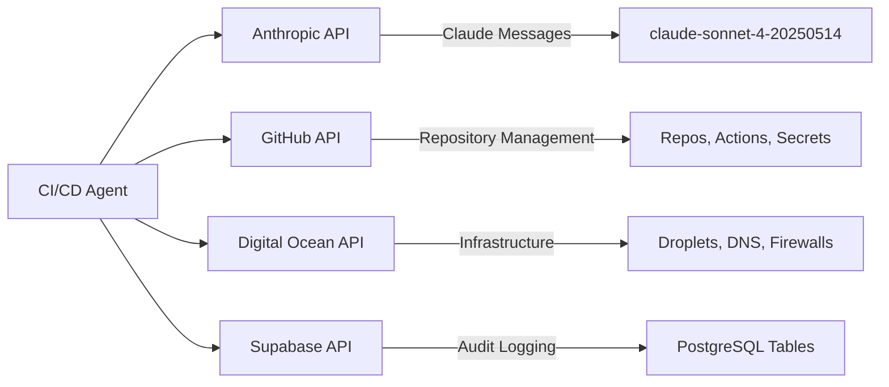
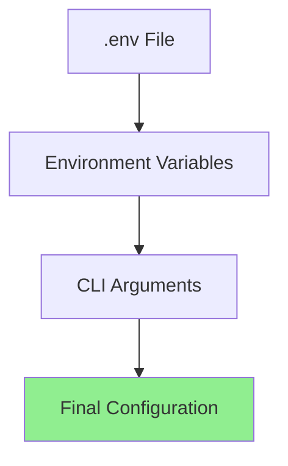
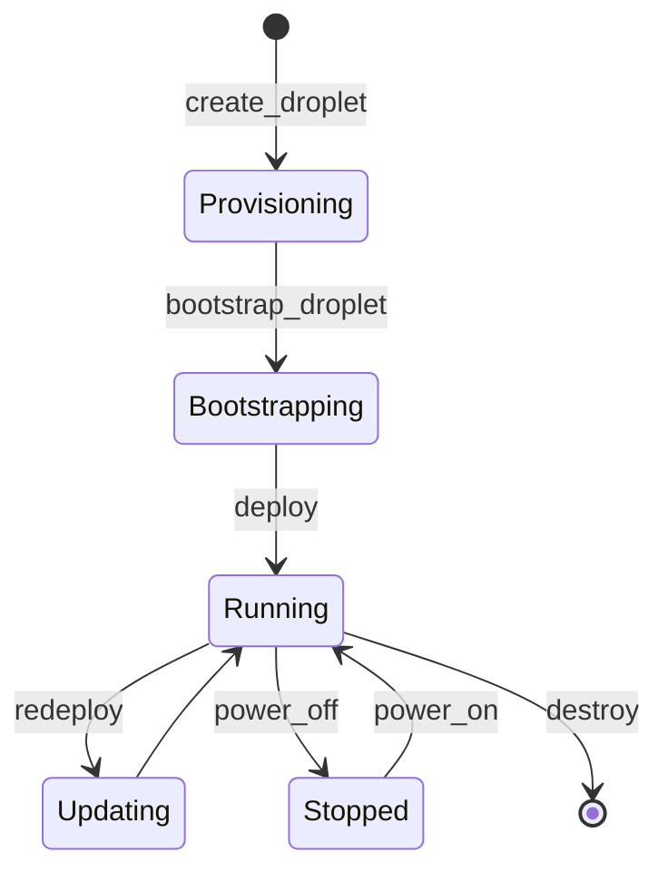
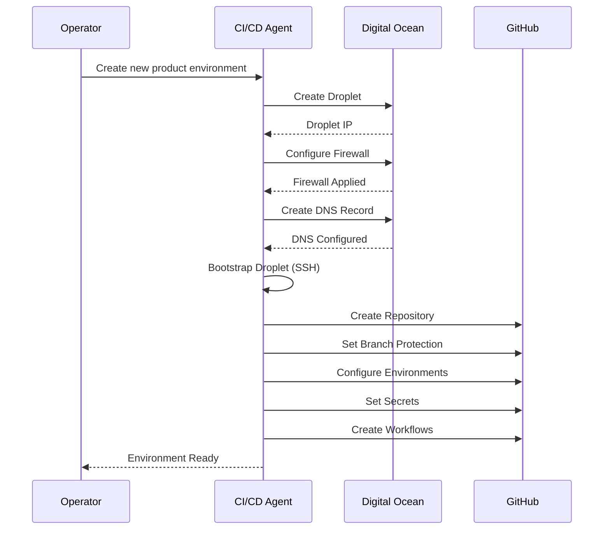
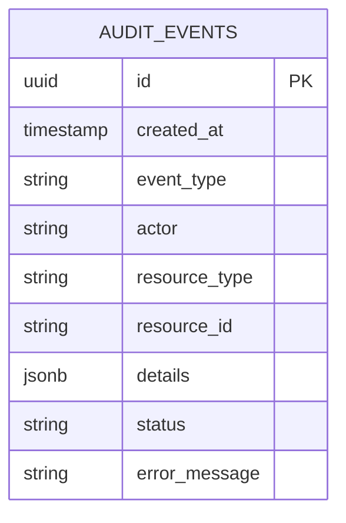
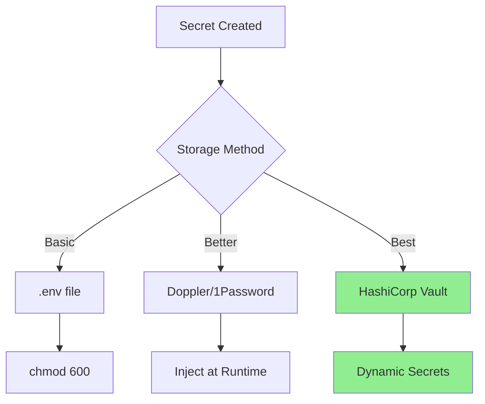
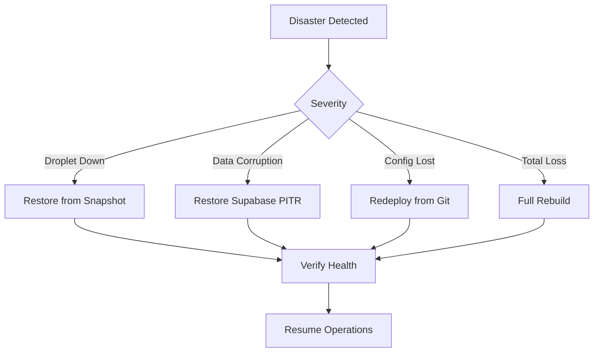

# PF-CORE CI/CD Agent - Operations Guide

This guide covers installation, configuration, monitoring, troubleshooting, security, and maintenance of the PF-CORE CI/CD Automation Agent.

---

## Table of Contents

1. [System Requirements](#system-requirements)
2. [Installation](#installation)
3. [Configuration](#configuration)
4. [Infrastructure Management](#infrastructure-management)
5. [Monitoring & Logging](#monitoring--logging)
6. [Security Operations](#security-operations)
7. [Backup & Recovery](#backup--recovery)
8. [Troubleshooting](#troubleshooting)
9. [Maintenance Tasks](#maintenance-tasks)
10. [Runbooks](#runbooks)

---

## System Requirements

### Control Plane (Where Agent Runs)

| Component | Minimum | Recommended |
|-----------|---------|-------------|
| Python | 3.10+ | 3.11+ |
| Memory | 512MB | 2GB |
| Disk | 1GB | 5GB |
| Network | Outbound HTTPS | Outbound HTTPS |

### Target Infrastructure (Digital Ocean Droplets)

| Environment | Droplet Size | RAM | vCPUs | Storage |
|-------------|--------------|-----|-------|---------|
| Development | s-1vcpu-1gb | 1GB | 1 | 25GB |
| Staging | s-2vcpu-2gb | 2GB | 2 | 50GB |
| Production | s-2vcpu-4gb | 4GB | 2 | 80GB |

### Required API Access



---

## Installation

### Step 1: Clone Repository

```bash
git clone https://github.com/ajrmooreuk/PF-Prototype-Shared.git
cd PF-Prototype-Shared/CI-CD/pf-cicd-agent
```

### Step 2: Create Virtual Environment

```bash
python -m venv venv
source venv/bin/activate  # Linux/macOS
# or
.\venv\Scripts\activate   # Windows
```

### Step 3: Install Package

```bash
# Development installation (editable)
pip install -e .

# Production installation
pip install .
```

### Step 4: Verify Installation

```bash
pf-cicd --version
pf-cicd tools  # List available tools
```

### Installation Verification Checklist

- [ ] Python 3.10+ installed
- [ ] Virtual environment activated
- [ ] Package installed successfully
- [ ] CLI responds to commands
- [ ] All dependencies resolved

---

## Configuration

### Environment Variables

Create `.env` file from template:

```bash
cp .env.example .env
chmod 600 .env  # Restrict permissions
```

### Required Variables

```bash
# =============================================================================
# REQUIRED - Core API Keys
# =============================================================================

# Anthropic (Claude AI)
ANTHROPIC_API_KEY=sk-ant-api03-xxxxx

# GitHub Personal Access Token
# Required scopes: repo, workflow, admin:org, delete_repo
GITHUB_TOKEN=ghp_xxxxxxxxxxxx

# Digital Ocean API Token
# Required scopes: read, write
DO_TOKEN=dop_v1_xxxxxxxxxxxx

# =============================================================================
# REQUIRED - Supabase (Audit Logging)
# =============================================================================
SUPABASE_URL=https://xxxxx.supabase.co
SUPABASE_KEY=eyJhbGciOiJIUzI1NiIsInR5cCI6IkpXVCJ9.xxxxx
```

### Optional Variables

```bash
# =============================================================================
# OPTIONAL - Defaults
# =============================================================================

# GitHub organization (default: personal account)
GITHUB_ORG=ajrmooreuk

# Digital Ocean defaults
DO_REGION=lon1
DO_DEFAULT_SIZE=s-2vcpu-4gb

# Logging level
LOG_LEVEL=INFO

# Claude model (default: claude-sonnet-4-20250514)
CLAUDE_MODEL=claude-sonnet-4-20250514
```

### Configuration Validation

```bash
# Validate all configuration
pf-cicd validate

# Expected output:
# ✓ ANTHROPIC_API_KEY: Valid
# ✓ GITHUB_TOKEN: Valid (scopes: repo, workflow, admin:org)
# ✓ DO_TOKEN: Valid (account: your-account)
# ✓ SUPABASE_URL: Valid
# ✓ SUPABASE_KEY: Valid
```

### Configuration Hierarchy



Priority: CLI Arguments > Environment Variables > .env File

---

## Infrastructure Management

### Droplet Lifecycle



### Provisioning Workflow



### Standard Droplet Tags

| Tag | Purpose | Example |
|-----|---------|---------|
| `pf-core` | Platform identifier | All droplets |
| `instance:{id}` | Instance identifier | `instance:air` |
| `product:{id}` | Product identifier | `product:air-ep` |
| `env:{environment}` | Environment | `env:production` |
| `managed:cicd-agent` | Management flag | Automation target |

---

## Monitoring & Logging

### Audit Events

All operations are logged to Supabase:



### Event Types

| Category | Events |
|----------|--------|
| Repository | `REPO_CREATED`, `REPO_DELETED`, `BRANCH_PROTECTED` |
| Secrets | `SECRET_SET`, `SECRET_ROTATED` |
| Infrastructure | `DROPLET_CREATED`, `DROPLET_DESTROYED`, `DNS_CREATED` |
| Deployment | `DEPLOY_STARTED`, `DEPLOY_COMPLETED`, `DEPLOY_FAILED` |
| Configuration | `CONFIG_VALIDATED`, `CONFIG_MERGED` |

### Querying Audit Logs

```sql
-- Recent operations
SELECT * FROM audit_events
ORDER BY created_at DESC
LIMIT 50;

-- Failed operations in last 24h
SELECT * FROM audit_events
WHERE status = 'error'
AND created_at > NOW() - INTERVAL '24 hours';

-- Operations by instance
SELECT * FROM audit_events
WHERE details->>'instance_id' = 'air';

-- Deployment history
SELECT * FROM audit_events
WHERE event_type LIKE 'DEPLOY_%'
ORDER BY created_at DESC;
```

### Droplet Monitoring

```bash
# SSH to droplet and check status
ssh deploy@<droplet-ip>

# Check PM2 status
pm2 status

# Check logs
pm2 logs --lines 100

# Check system resources
htop
df -h
free -m

# Check Docker (if using)
docker ps
docker logs <container-id>
```

### Health Check Endpoints

Each deployed application exposes:

| Endpoint | Purpose | Expected Response |
|----------|---------|-------------------|
| `/api/health` | Basic health | `200 OK` |
| `/api/health/ready` | Readiness | `200` with details |
| `/api/health/live` | Liveness | `200 OK` |

---

## Security Operations

### API Key Rotation

#### GitHub Token Rotation

```bash
# 1. Generate new token in GitHub Settings
# 2. Update .env file
GITHUB_TOKEN=ghp_NEW_TOKEN

# 3. Validate new token
pf-cicd validate

# 4. Revoke old token in GitHub Settings
```

#### Digital Ocean Token Rotation

```bash
# 1. Generate new token in DO Control Panel
# 2. Update .env file
DO_TOKEN=dop_v1_NEW_TOKEN

# 3. Validate
pf-cicd validate

# 4. Revoke old token
```

### Secrets Management Best Practices



### SSH Key Management

```bash
# Generate deployment key
ssh-keygen -t ed25519 -C "deploy@pf-core" -f ~/.ssh/pf-deploy

# Add to droplet
ssh-copy-id -i ~/.ssh/pf-deploy.pub deploy@<droplet-ip>

# Store in GitHub Secrets
# PRODUCTION_SSH_KEY: contents of ~/.ssh/pf-deploy
```

### Firewall Rules

Default firewall configuration per environment:

| Port | Service | Development | Staging | Production |
|------|---------|-------------|---------|------------|
| 22 | SSH | Open | Restricted IP | Restricted IP |
| 80 | HTTP | Open | Open | Open |
| 443 | HTTPS | Open | Open | Open |
| 3000 | App (internal) | Closed | Closed | Closed |

---

## Backup & Recovery

### What to Backup

| Component | Backup Method | Frequency |
|-----------|---------------|-----------|
| GitHub Repos | GitHub native | Automatic |
| Droplet Volumes | DO Snapshots | Weekly |
| Database | Supabase PITR | Continuous |
| Configuration | Git repository | On change |
| Secrets | Secrets manager | On change |

### Droplet Snapshot

```bash
# Create snapshot via agent
pf-cicd exec create_snapshot \
  droplet_id=123456 \
  name="pre-upgrade-$(date +%Y%m%d)"

# Or via DO CLI
doctl compute droplet-action snapshot 123456 \
  --snapshot-name "backup-$(date +%Y%m%d)"
```

### Disaster Recovery Procedure



### Full Rebuild Procedure

```bash
# 1. Provision new infrastructure
pf-cicd chat
> Create production droplet for air-ep with 4GB RAM
> Configure DNS for air-ep.air-platform.com
> Bootstrap the droplet with Docker

# 2. Restore secrets
# Copy .env from backup or secrets manager

# 3. Deploy application
# Trigger GitHub Actions workflow

# 4. Verify
curl https://air-ep.air-platform.com/api/health
```

---

## Troubleshooting

### Common Issues

#### Issue: API Authentication Failed

```
Error: 401 Unauthorized - GitHub API
```

**Solution:**
1. Verify token is valid: `pf-cicd validate`
2. Check token scopes in GitHub Settings
3. Regenerate token if expired

#### Issue: Droplet SSH Connection Failed

```
Error: Connection refused to <ip>:22
```

**Solution:**
1. Verify droplet is running: `doctl compute droplet get <id>`
2. Check firewall allows your IP
3. Verify SSH key is correct
4. Check fail2ban hasn't blocked you

```bash
# If locked out, use DO Console
doctl compute droplet console <id>

# Unblock IP
fail2ban-client set sshd unbanip <your-ip>
```

#### Issue: Deployment Failed

```
Error: Deploy failed - health check timeout
```

**Solution:**
1. SSH to droplet
2. Check PM2 logs: `pm2 logs --lines 200`
3. Check application logs: `tail -f /app/shared/logs/error.log`
4. Verify environment variables: `cat /app/shared/.env`
5. Check disk space: `df -h`
6. Check memory: `free -m`

#### Issue: DNS Not Resolving

```
Error: NXDOMAIN for subdomain.domain.com
```

**Solution:**
1. Verify DNS record created: `doctl compute domain records list <domain>`
2. Wait for propagation (up to 48h, usually minutes)
3. Check with: `dig subdomain.domain.com`
4. Verify domain is in DO account

### Debug Mode

```bash
# Run agent with debug logging
LOG_LEVEL=DEBUG pf-cicd chat

# Verbose tool execution
pf-cicd exec create_droplet \
  name=test \
  region=lon1 \
  size=s-1vcpu-1gb \
  --verbose
```

### Diagnostic Commands

```bash
# Check all services
pf-cicd validate --full

# Test GitHub connectivity
pf-cicd exec test_github_connection

# Test DO connectivity
pf-cicd exec test_do_connection

# List all managed resources
pf-cicd exec list_resources --filter=managed:cicd-agent
```

---

## Maintenance Tasks

### Daily

- [ ] Review audit logs for errors
- [ ] Check droplet health endpoints
- [ ] Monitor disk usage alerts

### Weekly

- [ ] Review and rotate any expiring tokens
- [ ] Check for security updates
- [ ] Review PM2 logs for anomalies
- [ ] Verify backup snapshots completed

### Monthly

- [ ] Full infrastructure audit
- [ ] Review and prune old releases
- [ ] Update dependencies
- [ ] Test disaster recovery procedure
- [ ] Review access permissions

### Quarterly

- [ ] Rotate all API keys
- [ ] Security penetration testing
- [ ] Capacity planning review
- [ ] Documentation review

### Maintenance Commands

```bash
# Prune old releases (keep last 5)
ssh deploy@<droplet-ip> 'cd /app/releases && ls -t | tail -n +6 | xargs -r rm -rf'

# Clear PM2 logs
ssh deploy@<droplet-ip> 'pm2 flush'

# Update system packages
ssh deploy@<droplet-ip> 'sudo apt update && sudo apt upgrade -y'

# Docker cleanup
ssh deploy@<droplet-ip> 'docker system prune -af'
```

---

## Runbooks

### Runbook: Deploy New Product

```bash
# 1. Create configuration
cat > templates/instances/newproduct.instance.yaml << EOF
instance_id: newproduct
display_name: "New Product"
github:
  org: ajrmooreuk
  repo_prefix: newproduct
infrastructure:
  provider: digitalocean
  region: lon1
EOF

# 2. Validate configuration
pf-cicd validate --config templates/instances/newproduct.instance.yaml

# 3. Provision via chat
pf-cicd chat
> Create infrastructure for newproduct instance
> Set up staging and production environments
> Deploy initial application
```

### Runbook: Emergency Rollback

```bash
# 1. SSH to affected droplet
ssh deploy@<droplet-ip>

# 2. List available releases
ls -lt /app/releases/

# 3. Rollback to previous release
ln -sfn /app/releases/<previous-commit> /app/current

# 4. Reload application
pm2 reload ecosystem.config.js

# 5. Verify health
curl localhost:3000/api/health

# 6. Log incident in audit
pf-cicd exec log_incident \
  type=rollback \
  product=<product-id> \
  reason="<description>"
```

### Runbook: Scale Up Droplet

```bash
# 1. Create snapshot first
doctl compute droplet-action snapshot <droplet-id> \
  --snapshot-name "pre-resize-$(date +%Y%m%d)"

# 2. Power off droplet
doctl compute droplet-action power-off <droplet-id> --wait

# 3. Resize
doctl compute droplet-action resize <droplet-id> \
  --size s-4vcpu-8gb --wait

# 4. Power on
doctl compute droplet-action power-on <droplet-id> --wait

# 5. Verify
ssh deploy@<droplet-ip> 'free -m && nproc'

# 6. Update PM2 cluster
ssh deploy@<droplet-ip> 'pm2 scale app max'
```

---

## Quick Reference

### CLI Commands

| Command | Description |
|---------|-------------|
| `pf-cicd chat` | Interactive AI-powered chat |
| `pf-cicd exec <tool> [args]` | Execute specific tool |
| `pf-cicd tools` | List available tools |
| `pf-cicd validate` | Validate configuration |

### Important Paths

| Path | Description |
|------|-------------|
| `/app/current` | Active application release |
| `/app/releases/` | All deployed releases |
| `/app/shared/.env` | Environment variables |
| `/app/shared/logs/` | Application logs |

### Emergency Contacts

| Service | Status Page | Support |
|---------|-------------|---------|
| Digital Ocean | status.digitalocean.com | Support ticket |
| GitHub | githubstatus.com | Support ticket |
| Supabase | status.supabase.com | Support ticket |
| Anthropic | status.anthropic.com | Support email |

---

*Last Updated: December 2024*
*Version: 1.0*
