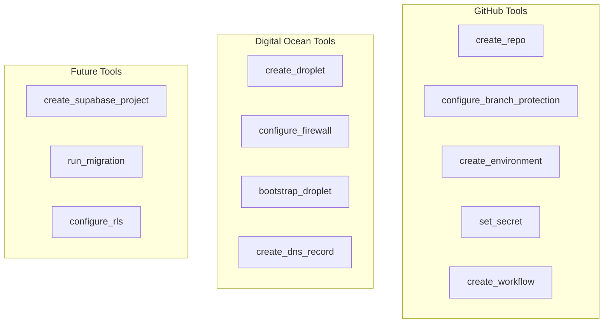
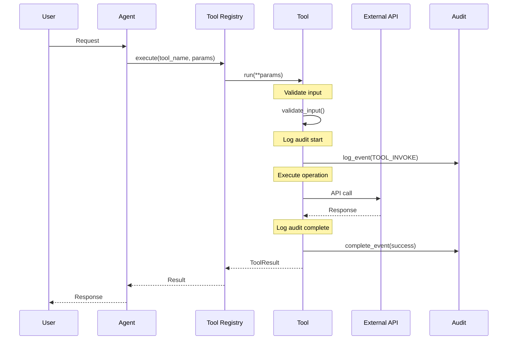

# Tools Reference

Complete reference for all available tools in the PF-CORE CI/CD Agent.

## Tool Categories



---

## GitHub Tools

### create_repo

Create a new GitHub repository in the organization.

**Parameters:**

| Parameter | Type | Required | Default | Description |
|-----------|------|----------|---------|-------------|
| `name` | string | Yes | - | Repository name |
| `description` | string | No | `""` | Repository description |
| `private` | boolean | No | `true` | Make repository private |
| `template_repo` | string | No | `null` | Template repository to use |
| `has_issues` | boolean | No | `true` | Enable issues |
| `has_wiki` | boolean | No | `false` | Enable wiki |
| `has_projects` | boolean | No | `true` | Enable projects |
| `auto_init` | boolean | No | `true` | Initialize with README |

**Example:**

```bash
# CLI
pf-cicd exec create_repo name=my-app description="My Application" private=true

# Chat
You: Create a repository called air-ep with issues and projects enabled
```

**Response:**

```json
{
  "name": "my-app",
  "full_name": "your-org/my-app",
  "html_url": "https://github.com/your-org/my-app",
  "clone_url": "https://github.com/your-org/my-app.git",
  "ssh_url": "git@github.com:your-org/my-app.git",
  "private": true,
  "default_branch": "main"
}
```

---

### configure_branch_protection

Set branch protection rules for a repository.

**Parameters:**

| Parameter | Type | Required | Default | Description |
|-----------|------|----------|---------|-------------|
| `repo_name` | string | Yes | - | Repository name |
| `branch` | string | No | `"main"` | Branch to protect |
| `required_reviews` | integer | No | `1` | Required approving reviews (0-6) |
| `dismiss_stale_reviews` | boolean | No | `true` | Dismiss stale reviews on push |
| `require_code_owner_reviews` | boolean | No | `false` | Require code owner review |
| `required_status_checks` | array | No | `[]` | Required status check names |
| `enforce_admins` | boolean | No | `true` | Enforce rules for admins |

**Example:**

```bash
# CLI
pf-cicd exec configure_branch_protection \
  repo_name=my-app \
  branch=main \
  required_reviews=2 \
  required_status_checks='["quality-gates", "security"]'

# Chat
You: Set up branch protection on my-app main branch requiring 2 reviews
```

**Response:**

```json
{
  "repo_name": "my-app",
  "branch": "main",
  "required_reviews": 2,
  "status_checks": ["quality-gates", "security"],
  "enforce_admins": true
}
```

---

### create_environment

Create a deployment environment for a repository.

**Parameters:**

| Parameter | Type | Required | Default | Description |
|-----------|------|----------|---------|-------------|
| `repo_name` | string | Yes | - | Repository name |
| `environment_name` | string | Yes | - | Environment name |
| `wait_timer` | integer | No | `0` | Wait timer in minutes (0-43200) |
| `reviewers` | array | No | `[]` | GitHub usernames of required reviewers |

**Example:**

```bash
# CLI
pf-cicd exec create_environment \
  repo_name=my-app \
  environment_name=production \
  wait_timer=10 \
  reviewers='["senior-dev"]'

# Chat
You: Create a production environment for my-app with a 10-minute wait timer
```

**Response:**

```json
{
  "repo_name": "my-app",
  "environment_name": "production",
  "wait_timer": 10,
  "reviewers": ["senior-dev"],
  "url": "https://github.com/your-org/my-app/settings/environments/production"
}
```

---

### set_secret

Set a repository or environment secret.

**Parameters:**

| Parameter | Type | Required | Default | Description |
|-----------|------|----------|---------|-------------|
| `repo_name` | string | Yes | - | Repository name |
| `secret_name` | string | Yes | - | Secret name (UPPER_SNAKE_CASE) |
| `secret_value` | string | Yes | - | Secret value |
| `environment_name` | string | No | `null` | Environment for environment-scoped secrets |

**Example:**

```bash
# CLI
pf-cicd exec set_secret \
  repo_name=my-app \
  secret_name=SUPABASE_URL \
  secret_value="https://xyz.supabase.co" \
  environment_name=production

# Chat
You: Set the SUPABASE_URL secret for my-app production environment
```

**Response:**

```json
{
  "repo_name": "my-app",
  "secret_name": "SUPABASE_URL",
  "environment_name": "production",
  "scope": "environment:production"
}
```

---

### create_workflow

Create a GitHub Actions workflow file.

**Parameters:**

| Parameter | Type | Required | Default | Description |
|-----------|------|----------|---------|-------------|
| `repo_name` | string | Yes | - | Repository name |
| `workflow_name` | string | Yes | - | Workflow filename (e.g., `ci.yml`) |
| `workflow_content` | string | Yes | - | YAML content of the workflow |
| `commit_message` | string | No | `"Add workflow"` | Commit message |
| `branch` | string | No | `"main"` | Branch to commit to |

**Example:**

```bash
# Chat
You: Create a CI workflow for my-app that runs tests on push
```

**Response:**

```json
{
  "repo_name": "my-app",
  "workflow_name": "ci.yml",
  "workflow_path": ".github/workflows/ci.yml",
  "commit_sha": "abc123...",
  "branch": "main"
}
```

---

## Digital Ocean Tools

### create_droplet

Create a new Digital Ocean Droplet (VPS).

**Parameters:**

| Parameter | Type | Required | Default | Description |
|-----------|------|----------|---------|-------------|
| `name` | string | Yes | - | Droplet name |
| `size` | string | No | `"s-1vcpu-1gb"` | Size slug |
| `region` | string | No | Settings default | Region slug |
| `image` | string | No | `"ubuntu-22-04-x64"` | Image slug |
| `backups` | boolean | No | `false` | Enable backups |
| `monitoring` | boolean | No | `true` | Enable monitoring |
| `tags` | array | No | `[]` | Tags for the droplet |
| `user_data` | string | No | `null` | Cloud-init script |
| `wait_for_active` | boolean | No | `true` | Wait for droplet to be active |

**Available Sizes:**

| Slug | vCPUs | RAM | Cost/mo |
|------|-------|-----|---------|
| `s-1vcpu-1gb` | 1 | 1 GB | $6 |
| `s-1vcpu-2gb` | 1 | 2 GB | $12 |
| `s-2vcpu-4gb` | 2 | 4 GB | $24 |
| `s-4vcpu-8gb` | 4 | 8 GB | $48 |

**Example:**

```bash
# CLI
pf-cicd exec create_droplet \
  name=my-app-prod \
  size=s-2vcpu-4gb \
  region=lon1 \
  backups=true

# Chat
You: Create a production droplet for my-app with 4GB RAM and backups
```

**Response:**

```json
{
  "id": 123456789,
  "name": "my-app-prod",
  "ip_address": "104.131.123.456",
  "status": "active",
  "region": "lon1",
  "size": "s-2vcpu-4gb",
  "image": "ubuntu-22-04-x64",
  "tags": []
}
```

---

### configure_firewall

Create and configure a Digital Ocean cloud firewall.

**Parameters:**

| Parameter | Type | Required | Default | Description |
|-----------|------|----------|---------|-------------|
| `name` | string | Yes | - | Firewall name |
| `inbound_rules` | array | No | SSH, HTTP, HTTPS | Inbound firewall rules |
| `outbound_rules` | array | No | All outbound | Outbound firewall rules |
| `droplet_ids` | array | No | `[]` | Droplet IDs to attach |
| `tags` | array | No | `[]` | Tags for the firewall |

**Rule Schema:**

```json
{
  "protocol": "tcp",
  "ports": "22",
  "addresses": ["0.0.0.0/0", "::/0"]
}
```

**Example:**

```bash
# CLI
pf-cicd exec configure_firewall \
  name=my-app-firewall \
  droplet_ids='[123456789]'

# Chat
You: Create a firewall for my-app-prod allowing SSH, HTTP, and HTTPS
```

**Response:**

```json
{
  "id": "fw-12345",
  "name": "my-app-firewall",
  "inbound_rules_count": 3,
  "outbound_rules_count": 2,
  "droplet_ids": [123456789],
  "status": "active"
}
```

---

### bootstrap_droplet

Bootstrap a droplet by executing a script via SSH.

**Parameters:**

| Parameter | Type | Required | Default | Description |
|-----------|------|----------|---------|-------------|
| `droplet_id` | integer | No* | - | Droplet ID to bootstrap |
| `droplet_name` | string | No* | - | Droplet name (alternative to ID) |
| `ssh_user` | string | No | `"root"` | SSH username |
| `ssh_key_path` | string | No | `null` | Path to SSH private key |
| `bootstrap_script` | string | Yes | - | Bash script to execute |
| `timeout` | integer | No | `600` | Timeout in seconds (60-3600) |
| `retry_connection` | boolean | No | `true` | Retry SSH connection on failure |

*Either `droplet_id` or `droplet_name` is required.

**Example:**

```bash
# Chat
You: Bootstrap the my-app-prod droplet with Docker and Nginx
```

**Response:**

```json
{
  "droplet_id": 123456789,
  "droplet_name": "my-app-prod",
  "ip_address": "104.131.123.456",
  "exit_code": 0,
  "stdout": "... installation output ...",
  "stderr": "",
  "duration_seconds": 180
}
```

---

### create_dns_record

Create a DNS record in a Digital Ocean managed domain.

**Parameters:**

| Parameter | Type | Required | Default | Description |
|-----------|------|----------|---------|-------------|
| `domain` | string | Yes | - | Domain name |
| `record_type` | string | No | `"A"` | Record type (A, AAAA, CNAME, TXT, MX, NS, SRV) |
| `name` | string | Yes | - | Record name (subdomain or @ for root) |
| `data` | string | Yes | - | Record data (IP for A, target for CNAME) |
| `ttl` | integer | No | `3600` | Time to live in seconds |
| `priority` | integer | No | `null` | Priority (for MX, SRV) |

**Example:**

```bash
# CLI
pf-cicd exec create_dns_record \
  domain=my-app.com \
  record_type=A \
  name=www \
  data=104.131.123.456

# Chat
You: Create a DNS A record pointing www.my-app.com to the production droplet
```

**Response:**

```json
{
  "id": 12345678,
  "domain": "my-app.com",
  "record_type": "A",
  "name": "www",
  "data": "104.131.123.456",
  "ttl": 3600,
  "fqdn": "www.my-app.com"
}
```

---

## Tool Execution Flow



## Error Handling

All tools return a `ToolResult` with consistent error handling:

```python
class ToolResult:
    status: ToolStatus  # SUCCESS, ERROR, PARTIAL, SKIPPED
    message: str
    data: Any
    error: str | None
    error_code: str | None
    duration_ms: int
```

**Common Error Codes:**

| Code | Description |
|------|-------------|
| `VALIDATION_ERROR` | Invalid input parameters |
| `REPO_EXISTS` | Repository already exists |
| `REPO_NOT_FOUND` | Repository not found |
| `DROPLET_EXISTS` | Droplet with name already exists |
| `SSH_CONNECTION_FAILED` | Unable to connect via SSH |
| `GITHUB_ERROR` | GitHub API error |
| `DO_ERROR` | Digital Ocean API error |

---

*Document Version: 1.0.0 | Last Updated: December 2025*
