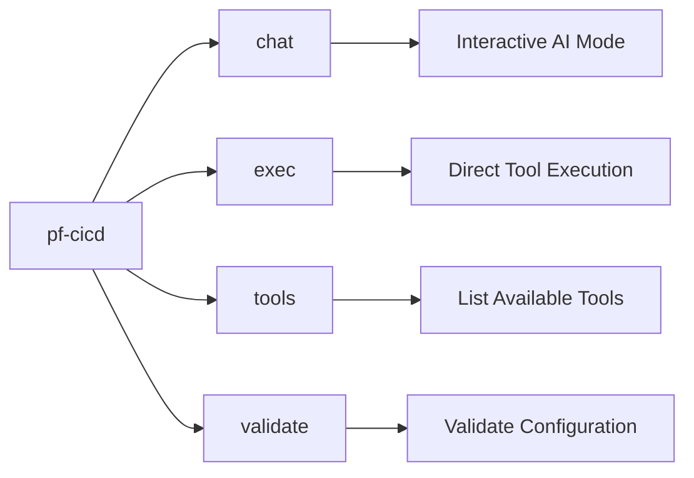
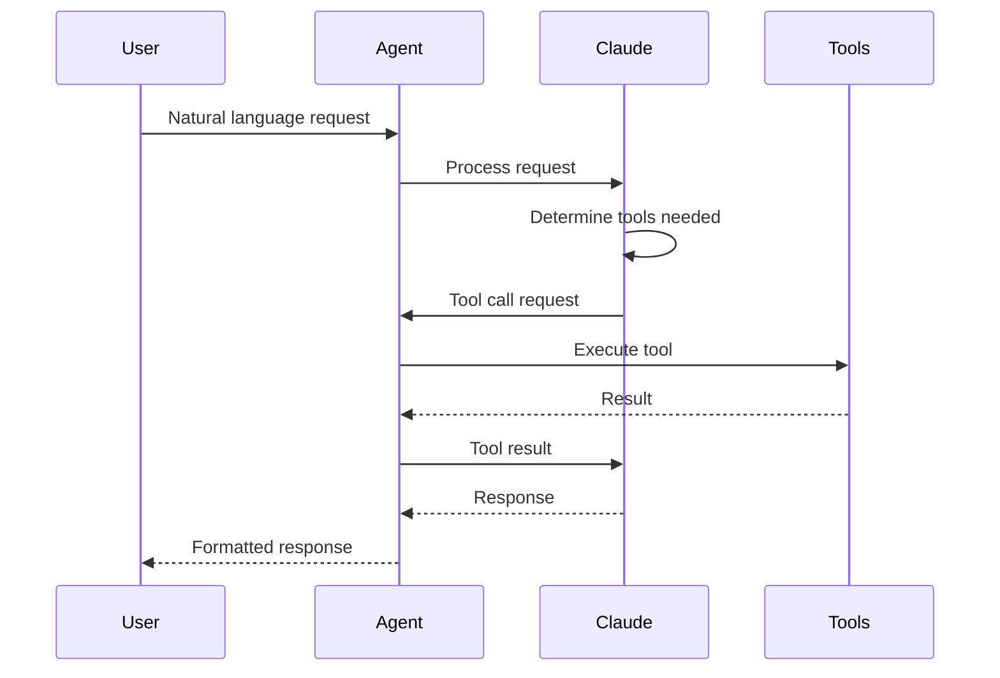
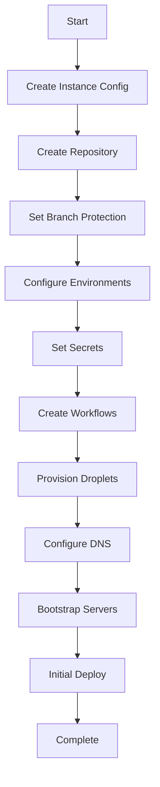
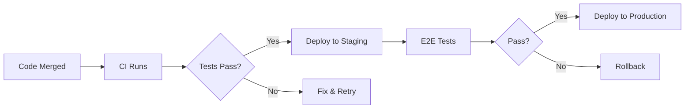
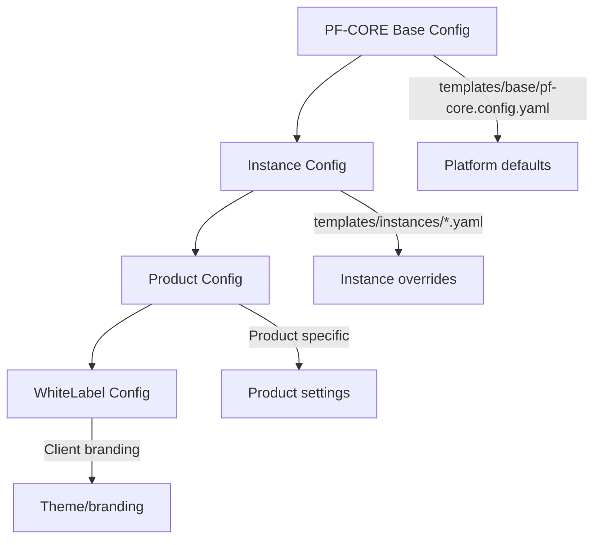

# PF-CORE CI/CD Agent - User Guide

This guide covers how to use the PF-CORE CI/CD Automation Agent for day-to-day development and deployment tasks.

---

## Table of Contents

1. [Getting Started](#getting-started)
2. [CLI Overview](#cli-overview)
3. [Interactive Chat Mode](#interactive-chat-mode)
4. [Direct Tool Execution](#direct-tool-execution)
5. [Common Workflows](#common-workflows)
6. [Configuration Management](#configuration-management)
7. [Working with Templates](#working-with-templates)
8. [Best Practices](#best-practices)
9. [Examples & Recipes](#examples--recipes)
10. [FAQ](#faq)

---

## Getting Started

### Prerequisites

Before using the CI/CD Agent, ensure you have:

- [ ] Python 3.10 or higher installed
- [ ] Access credentials configured (see [Configuration](#quick-setup))
- [ ] Familiarity with the PF-CORE platform architecture

### Quick Setup

```bash
# 1. Navigate to agent directory
cd CI-CD/pf-cicd-agent

# 2. Create and activate virtual environment
python -m venv venv
source venv/bin/activate

# 3. Install the agent
pip install -e .

# 4. Configure credentials
cp .env.example .env
# Edit .env with your API keys

# 5. Verify setup
pf-cicd validate
```

### First Run

```bash
# Start interactive chat
pf-cicd chat

# You'll see:
# ╭─────────────────────────────────────────────────────╮
# │  PF-CORE CI/CD Agent                                │
# │  Type 'help' for commands, 'exit' to quit          │
# ╰─────────────────────────────────────────────────────╯
# > _
```

---

## CLI Overview

### Command Structure



### Available Commands

| Command | Description | Example |
|---------|-------------|---------|
| `chat` | Interactive AI-powered session | `pf-cicd chat` |
| `exec` | Execute a specific tool | `pf-cicd exec create_repo name=myapp` |
| `tools` | List all available tools | `pf-cicd tools` |
| `validate` | Validate configuration | `pf-cicd validate` |
| `--help` | Show help | `pf-cicd --help` |
| `--version` | Show version | `pf-cicd --version` |

### Getting Help

```bash
# General help
pf-cicd --help

# Command-specific help
pf-cicd chat --help
pf-cicd exec --help

# Tool-specific help
pf-cicd exec create_repo --help
```

---

## Interactive Chat Mode

The chat mode provides an AI-powered conversational interface to manage your infrastructure.

### Starting a Chat Session

```bash
pf-cicd chat
```

### Chat Commands

| Command | Description |
|---------|-------------|
| `help` | Show available commands |
| `tools` | List available tools |
| `history` | Show conversation history |
| `clear` | Clear conversation history |
| `exit` or `quit` | End session |

### Conversation Flow



### Example Conversations

#### Creating a New Repository

```
> Create a new repository called air-website for the AIR instance

I'll create a new repository for the AIR instance.

Executing: create_repo
  - name: air-website
  - description: AIR Instance Website
  - private: true
  - auto_init: true

✓ Repository created: https://github.com/ajrmooreuk/air-website

Would you like me to set up branch protection rules?
```

#### Provisioning Infrastructure

```
> Set up a staging environment for air-website

I'll provision a complete staging environment. This includes:
1. Digital Ocean droplet
2. DNS configuration
3. Firewall rules
4. Server bootstrapping

Executing: create_droplet
  - name: air-website-staging
  - size: s-2vcpu-2gb
  - region: lon1

✓ Droplet created: 192.168.1.100

Executing: create_dns_record
  - domain: air-platform.com
  - name: staging.air-website
  - type: A
  - value: 192.168.1.100

✓ DNS configured: staging.air-website.air-platform.com

Executing: configure_firewall
  - droplet_id: 12345678
  - rules: [ssh, http, https]

✓ Firewall applied

Executing: bootstrap_droplet
  - ip: 192.168.1.100
  - type: docker

✓ Server bootstrapped with Docker, Nginx, and PM2

Staging environment is ready at: https://staging.air-website.air-platform.com
```

#### Deploying an Application

```
> Deploy the latest release of air-website to staging

I'll trigger a deployment to staging.

Executing: create_workflow_dispatch
  - repo: air-website
  - workflow: deploy-staging.yml
  - ref: main

✓ Deployment triggered

The deployment workflow is now running. You can monitor progress at:
https://github.com/ajrmooreuk/air-website/actions

Would you like me to wait and report the deployment status?
```

### Tips for Effective Chat

1. **Be Specific**: Include instance names, environments, and specific requirements
2. **Ask for Confirmation**: The agent will confirm destructive operations
3. **Chain Commands**: Request multiple related operations in one message
4. **Use Context**: Reference previous operations ("do the same for production")

---

## Direct Tool Execution

For scripting or when you know exactly what tool to run, use direct execution.

### Syntax

```bash
pf-cicd exec <tool_name> [param=value ...]
```

### Examples

```bash
# Create a repository
pf-cicd exec create_repo \
  name=my-new-app \
  description="My new application" \
  private=true

# Create a droplet
pf-cicd exec create_droplet \
  name=my-app-prod \
  region=lon1 \
  size=s-2vcpu-4gb \
  image=ubuntu-22-04-x64

# Set a GitHub secret
pf-cicd exec set_secret \
  repo=my-new-app \
  name=SUPABASE_KEY \
  value=eyJhbGciOiJIUzI1NiIs...

# Create DNS record
pf-cicd exec create_dns_record \
  domain=mydomain.com \
  name=app \
  type=A \
  value=192.168.1.100
```

### Listing Tools

```bash
# List all tools
pf-cicd tools

# Output:
# GitHub Tools:
#   - create_repo          Create a new GitHub repository
#   - branch_protection    Configure branch protection rules
#   - create_environment   Create GitHub deployment environment
#   - set_secret          Set a repository or environment secret
#   - create_workflow     Create a GitHub Actions workflow
#
# Digital Ocean Tools:
#   - create_droplet      Create a new droplet
#   - configure_firewall  Configure firewall rules
#   - bootstrap_droplet   Bootstrap a droplet with software
#   - create_dns_record   Create a DNS record
```

### Tool Parameters

Each tool has required and optional parameters:

```bash
# View tool parameters
pf-cicd exec create_droplet --help

# Output:
# create_droplet - Create a new Digital Ocean droplet
#
# Required parameters:
#   name    - Droplet name
#   region  - Region slug (e.g., lon1, nyc1, sfo3)
#   size    - Size slug (e.g., s-1vcpu-1gb)
#
# Optional parameters:
#   image   - Image slug (default: ubuntu-22-04-x64)
#   tags    - Comma-separated tags
#   ssh_keys - SSH key IDs or fingerprints
```

---

## Common Workflows

### Workflow 1: New Product Setup



**Chat Version:**
```
> I need to set up a complete new product called "newproduct" under the BAIV instance.
> It needs staging and production environments on Digital Ocean.
```

**Script Version:**
```bash
#!/bin/bash
# new-product-setup.sh

PRODUCT="newproduct"
INSTANCE="baiv"

# Create repository
pf-cicd exec create_repo \
  name=$PRODUCT \
  description="$INSTANCE - $PRODUCT" \
  private=true

# Set branch protection
pf-cicd exec branch_protection \
  repo=$PRODUCT \
  branch=main \
  required_reviews=1

# Create environments
for ENV in staging production; do
  pf-cicd exec create_environment \
    repo=$PRODUCT \
    name=$ENV
done

# Create droplets
for ENV in staging production; do
  SIZE="s-2vcpu-2gb"
  [ "$ENV" = "production" ] && SIZE="s-2vcpu-4gb"

  pf-cicd exec create_droplet \
    name=$PRODUCT-$ENV \
    region=lon1 \
    size=$SIZE \
    tags="pf-core,instance:$INSTANCE,product:$PRODUCT,env:$ENV"
done
```

### Workflow 2: Daily Deployment



**Chat Version:**
```
> Deploy the latest main branch to staging for air-website
> After staging is verified, deploy to production
```

### Workflow 3: Emergency Rollback

```
> Rollback air-website production to the previous release

I'll initiate a rollback of the production environment.

1. Connecting to production server...
2. Identifying previous release...
3. Switching symlink...
4. Reloading application...
5. Running health check...

✓ Rollback complete. Production is now running commit abc123.
```

### Workflow 4: Infrastructure Scaling

```
> Scale up the air-website production droplet to 8GB RAM

I'll resize the production droplet. This requires:
1. Creating a snapshot (for safety)
2. Powering off the droplet
3. Resizing
4. Powering back on

⚠️ This will cause approximately 2-5 minutes of downtime.

Proceed? (yes/no)
```

---

## Configuration Management

### Configuration Hierarchy



### Creating Instance Configuration

```yaml
# templates/instances/myinstance.instance.yaml
instance_id: myinstance
display_name: "My Instance"
description: "Custom instance configuration"

github:
  org: myorg
  repo_prefix: myinstance
  default_branch: main
  branch_protection:
    required_reviews: 2
    require_code_owner: true

infrastructure:
  provider: digitalocean
  region: lon1
  default_droplet_size: s-2vcpu-4gb

  environments:
    staging:
      droplet_size: s-2vcpu-2gb
      domain_prefix: staging

    production:
      droplet_size: s-2vcpu-4gb
      domain_prefix: ""
      replicas: 1

features:
  enable_preview_deployments: true
  enable_slack_notifications: true

supabase:
  project_ref: myproject
  region: eu-west-2
```

### Validating Configuration

```bash
# Validate all configurations
pf-cicd validate

# Validate specific config
pf-cicd validate --config templates/instances/myinstance.instance.yaml

# Output:
# ✓ Schema validation passed
# ✓ Required fields present
# ✓ GitHub organization accessible
# ✓ DO region valid
# ✓ Configuration valid
```

### Viewing Merged Configuration

```bash
# See effective configuration after inheritance
pf-cicd exec show_config \
  instance=myinstance \
  product=myproduct

# Output shows merged config with inheritance tracking
```

---

## Working with Templates

### Available Templates

| Template | Purpose | Location |
|----------|---------|----------|
| CI Workflow | Continuous integration | `templates/workflows/ci.yml.template` |
| Deploy Workflow | Deployment automation | `templates/workflows/deploy.yml.template` |
| Bootstrap Script | Server setup | `templates/infrastructure/bootstrap-docker.sh.template` |
| Nginx Config | Reverse proxy | `templates/infrastructure/nginx-site.conf.template` |
| Database Schema | Initial DB setup | `templates/database/001_pf_core_base.sql` |

### Generating from Templates

```bash
# Generate CI workflow
pf-cicd exec generate_template \
  template=workflows/ci.yml \
  instance=air \
  product=air-ep \
  output=.github/workflows/ci.yml

# Generate bootstrap script
pf-cicd exec generate_template \
  template=infrastructure/bootstrap-docker.sh \
  instance=air \
  product=air-ep \
  environment=production \
  output=scripts/bootstrap.sh
```

### Template Variables

Templates use Jinja2 syntax:

```yaml
# Example template
name: "{{ product_name }} CI"

env:
  NODE_VERSION: '{{ node_version | default("20") }}'
  INSTANCE: '{{ instance_id }}'
  PRODUCT: '{{ product_id }}'


  SUPABASE_URL: ${{ secrets.SUPABASE_URL }}

```

### Creating Custom Templates

```bash
# 1. Create template file
cat > templates/custom/my-template.yml.template << 'EOF'
# {{ product_name }} Custom Configuration
version: 1.0
instance: {{ instance_id }}
product: {{ product_id }}
environment: {{ environment }}

settings:
  feature_a: {{ features.feature_a | default(true) }}
  feature_b: {{ features.feature_b | default(false) }}
EOF

# 2. Use the template
pf-cicd exec generate_template \
  template=custom/my-template.yml \
  instance=air \
  product=air-ep \
  output=config.yml
```

---

## Best Practices

### 1. Use Descriptive Names

```bash
# Good
pf-cicd exec create_droplet name=air-website-production-v2

# Avoid
pf-cicd exec create_droplet name=server1
```

### 2. Always Tag Resources

```bash
pf-cicd exec create_droplet \
  name=myapp-prod \
  tags="pf-core,instance:air,product:air-ep,env:production,managed:cicd-agent"
```

### 3. Use Environments for Secrets

```bash
# Set environment-specific secrets
pf-cicd exec set_secret \
  repo=myapp \
  environment=production \
  name=DATABASE_URL \
  value=postgres://...

# Not repository-wide for sensitive values
```

### 4. Validate Before Applying

```bash
# Always validate config before provisioning
pf-cicd validate --config my-config.yaml

# Use dry-run when available
pf-cicd exec create_droplet --dry-run \
  name=test \
  region=lon1
```

### 5. Document in Chat

```
> Create a staging droplet for air-website
> Note: This is for the Q1 2025 redesign project
> Contact: dev@example.com
```

The agent logs all operations with context.

### 6. Use Instance Configurations

Don't hardcode values; use configuration files:

```bash
# Good - uses instance config
pf-cicd exec provision_product \
  instance=air \
  product=air-website

# Avoid - hardcoded values
pf-cicd exec create_droplet \
  name=air-website-prod \
  region=lon1 \
  size=s-2vcpu-4gb
```

---

## Examples & Recipes

### Recipe: Complete Product Provisioning

```
> Set up a complete new product called "member-portal" for the W4M instance.
> It needs:
> - GitHub repository with branch protection
> - Staging environment (2GB RAM)
> - Production environment (4GB RAM)
> - DNS records for both
> - CI/CD workflows
> - All secrets configured
```

### Recipe: Clone Environment

```
> Create a copy of air-website production as a performance-test environment.
> Same configuration but different DNS.
```

### Recipe: Rotate All Secrets

```
> Rotate all GitHub secrets for the air-website repository.
> Generate new values and update both staging and production environments.
```

### Recipe: Audit Check

```
> Show me all operations performed on the air instance in the last 7 days.
> Flag any failed operations.
```

### Recipe: Infrastructure Report

```
> Generate a report of all infrastructure for the BAIV instance.
> Include droplets, DNS records, and GitHub repositories.
```

---

## FAQ

### Q: How do I undo an operation?

**A:** Most operations can be reversed. Use chat to describe what you want to undo:
```
> Delete the staging droplet I just created for air-website
```

For critical operations, the agent will ask for confirmation before proceeding.

### Q: Can I run operations in parallel?

**A:** In chat mode, describe multiple operations and the agent will optimize execution:
```
> Create staging and production droplets for my-new-app simultaneously
```

In script mode, run multiple `pf-cicd exec` commands in background.

### Q: How do I see what was deployed?

**A:** Query the audit log:
```
> Show the last 5 deployments for air-website
```

Or check GitHub Actions:
```bash
gh run list -R ajrmooreuk/air-website
```

### Q: What if a tool fails?

**A:** The agent provides error details and suggestions:
```
✗ create_droplet failed: Rate limit exceeded

Suggestion: Wait 60 seconds and retry, or use a different API token.
```

### Q: Can I customize tool behavior?

**A:** Yes, through configuration files. Each instance can override default tool parameters.

### Q: How do I integrate with CI/CD pipelines?

**A:** Use direct execution in your pipeline:
```yaml
# .github/workflows/provision.yml
- name: Provision Infrastructure
  run: |
    pf-cicd exec create_droplet \
      name=${{ github.event.inputs.name }} \
      region=lon1
  env:
    DO_TOKEN: ${{ secrets.DO_TOKEN }}
```

### Q: Is there a dry-run mode?

**A:** Use the `--dry-run` flag with exec:
```bash
pf-cicd exec create_repo --dry-run name=test-repo
```

### Q: How do I get verbose output?

**A:** Add `--verbose` to any command:
```bash
pf-cicd exec create_droplet --verbose name=test
```

---

## Keyboard Shortcuts (Chat Mode)

| Shortcut | Action |
|----------|--------|
| `Ctrl+C` | Cancel current operation |
| `Ctrl+D` | Exit chat |
| `↑` / `↓` | Navigate history |
| `Tab` | Auto-complete commands |

---

## Next Steps

- Read the [Operations Guide](ops-guide.md) for maintenance and troubleshooting
- Review [Architecture Documentation](architecture.md) for system design
- Check [Configuration Reference](configuration.md) for all options
- Explore [Tools Reference](tools-reference.md) for detailed tool documentation

---

*Last Updated: December 2024*
*Version: 1.0*
